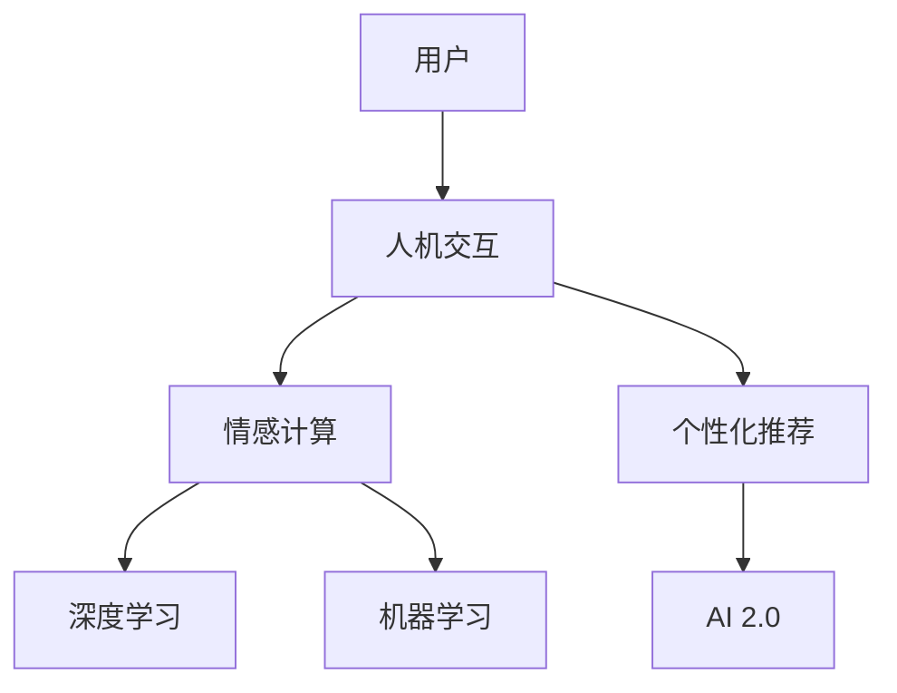

                 

# 李开复：AI 2.0 时代的用户

> 关键词：AI 2.0, 用户, 人机交互, 个性化推荐, 情感计算, 深度学习, 机器学习

## 1. 背景介绍

### 1.1 问题由来

随着人工智能技术的飞速发展，尤其是深度学习和自然语言处理（NLP）领域的突破，我们已经进入了AI 2.0时代。AI 2.0不再局限于简单的数据处理和计算任务，而是具备了更加复杂的认知和情感交互能力。AI 2.0用户将与AI系统进行深度互动，AI将能够理解用户的情感、偏好和需求，并根据这些信息提供个性化的服务。

### 1.2 问题核心关键点

AI 2.0的核心在于其能够理解用户并提供个性化的服务。这种服务不仅仅局限于信息检索和推荐，而是能够涉及用户生活的方方面面，包括情感支持、决策辅助、健康管理等。AI 2.0的用户体验将更加自然和无缝，用户与AI的互动将更加紧密和亲密。

## 2. 核心概念与联系

### 2.1 核心概念概述

- AI 2.0：人工智能的第二个发展阶段，相较于第一代AI，AI 2.0具备更加复杂的认知和情感处理能力，能够理解并回应用户的情感和需求。
- 用户：AI 2.0系统需要服务的目标人群，他们将与AI系统进行深度互动，获得个性化的服务。
- 人机交互（HCI）：用户与AI系统的交互方式，包括自然语言交互、手势控制、情感识别等。
- 个性化推荐：基于用户的历史行为和偏好，AI系统能够推荐用户可能感兴趣的内容或服务。
- 情感计算：通过分析用户的语音、文字和表情等数据，AI系统能够理解用户的情感状态，并作出相应反应。
- 深度学习（DL）：基于多层神经网络的学习方法，能够处理大量复杂的数据，提升AI系统的识别和推理能力。
- 机器学习（ML）：通过算法和模型训练，AI系统能够不断优化自身性能，适应不同的用户需求。

这些核心概念之间存在紧密的联系。AI 2.0的系统设计需要综合考虑用户需求、人机交互方式、个性化推荐、情感计算、深度学习和机器学习等多个方面，以提供最优质的用户体验。

### 2.2 核心概念原理和架构的 Mermaid 流程图



这个流程图展示了AI 2.0用户与AI系统之间的交互流程。用户通过人机交互与AI系统进行沟通，情感计算和个性化推荐模块分析用户的情感和偏好，并通过深度学习和机器学习进行模型训练和优化，最终提供给用户个性化的AI 2.0服务。

## 3. 核心算法原理 & 具体操作步骤

### 3.1 算法原理概述

AI 2.0系统的核心算法包括情感计算、个性化推荐和深度学习。

- 情感计算：通过分析用户的语音、文字和表情等数据，AI系统能够理解用户的情感状态，并作出相应反应。
- 个性化推荐：基于用户的历史行为和偏好，AI系统能够推荐用户可能感兴趣的内容或服务。
- 深度学习：基于多层神经网络的学习方法，能够处理大量复杂的数据，提升AI系统的识别和推理能力。

### 3.2 算法步骤详解

#### 情感计算

1. 数据采集：收集用户的语音、文字和表情等数据。
2. 特征提取：将采集到的数据转换为机器可以处理的特征向量。
3. 情感识别：使用情感分类模型对特征向量进行分类，识别用户的情感状态。
4. 情感反馈：根据情感识别结果，AI系统作出相应反应，如调整推荐内容、提供情感支持等。

#### 个性化推荐

1. 数据收集：收集用户的历史行为数据，如浏览记录、购买记录等。
2. 特征工程：提取和构建用户行为的特征，如时间、地点、兴趣爱好等。
3. 模型训练：使用机器学习模型对用户行为进行建模，如协同过滤、矩阵分解等。
4. 推荐生成：根据用户的行为特征和模型预测，生成个性化的推荐内容。

#### 深度学习

1. 数据准备：准备训练数据，并进行预处理和增强。
2. 模型设计：设计多层神经网络模型，并选择合适的损失函数和优化器。
3. 模型训练：使用训练数据对模型进行训练，调整参数以最小化损失函数。
4. 模型评估：使用验证集和测试集对模型进行评估，调整超参数以优化性能。

### 3.3 算法优缺点

#### 优点

- 高度个性化：AI 2.0系统能够根据用户的行为和情感状态提供高度个性化的服务，提升用户体验。
- 无缝交互：自然语言交互、手势控制等技术使得用户与AI系统的互动更加自然和无缝。
- 高效推荐：基于深度学习和机器学习的个性化推荐算法能够高效地生成高质量的推荐结果。
- 情感支持：情感计算技术能够理解用户的情感状态，并提供相应的支持，提升用户的满意度。

#### 缺点

- 数据隐私：收集和分析用户数据可能涉及隐私问题，需要严格遵守数据保护法规。
- 算法偏见：深度学习模型可能会受到训练数据的偏见影响，导致不公平或歧视性的结果。
- 计算资源：AI 2.0系统需要大量的计算资源进行训练和推理，对硬件设备要求较高。
- 用户信任：用户可能对AI系统的决策和推荐存在疑虑，需要提升系统的透明度和可解释性。

### 3.4 算法应用领域

AI 2.0技术已经在多个领域得到了应用，包括但不限于：

- 智能客服：AI 2.0系统能够理解用户的情感和需求，提供24/7的情感支持。
- 个性化推荐：电商平台、内容平台等使用AI 2.0系统提供个性化的商品推荐和内容推荐。
- 健康管理：AI 2.0系统能够分析用户的健康数据，提供个性化的健康建议和管理方案。
- 金融理财：AI 2.0系统能够分析用户的财务数据，提供个性化的理财建议和投资方案。
- 教育培训：AI 2.0系统能够分析学生的学习数据，提供个性化的学习方案和辅导。

## 4. 数学模型和公式 & 详细讲解 & 举例说明

### 4.1 数学模型构建

AI 2.0系统的数学模型包括情感计算、个性化推荐和深度学习的模型。

#### 情感计算模型

情感计算模型通常使用分类器进行情感识别。常见的分类器包括朴素贝叶斯、支持向量机（SVM）、卷积神经网络（CNN）等。

- 朴素贝叶斯：基于贝叶斯定理进行情感分类。
- SVM：通过最大化分类间隔进行情感分类。
- CNN：通过卷积操作提取特征，并进行情感分类。

#### 个性化推荐模型

个性化推荐模型通常使用协同过滤、矩阵分解等方法进行推荐。

- 协同过滤：基于用户-物品评分矩阵进行推荐。
- 矩阵分解：通过分解用户-物品矩阵，提取用户和物品的潜在特征，进行推荐。

#### 深度学习模型

深度学习模型通常使用多层神经网络进行建模。

- 前馈神经网络（FNN）：通过多层线性变换和激活函数进行特征提取和分类。
- 卷积神经网络（CNN）：通过卷积操作提取局部特征，并进行分类。
- 循环神经网络（RNN）：通过循环结构处理序列数据，并进行分类。

### 4.2 公式推导过程

#### 朴素贝叶斯情感分类

设情感分类为二分类任务，即正向情感和负向情感。假设训练集为 $\{(x_i, y_i)\}_{i=1}^N$，其中 $x_i$ 为输入特征，$y_i$ 为情感标签。朴素贝叶斯分类器的概率模型为：

$$
P(y_i=1|x_i) = \frac{P(x_i|y_i=1)P(y_i=1)}{P(x_i)}
$$

其中 $P(x_i|y_i=1)$ 为特征在正向情感条件下的概率，$P(y_i=1)$ 为正向情感的概率，$P(x_i)$ 为特征的边际概率。朴素贝叶斯分类器的分类公式为：

$$
\hat{y_i} = \arg\max_{y \in \{0,1\}} P(y_i=y|x_i) = \arg\max_{y \in \{0,1\}} P(y)P(x_i|y)
$$

#### 协同过滤推荐模型

设用户集为 $U$，物品集为 $I$，用户-物品评分矩阵为 $R \in \mathbb{R}^{m \times n}$，其中 $m$ 为用户数，$n$ 为物品数。协同过滤模型通过用户-物品评分矩阵进行推荐。假设用户 $u$ 的评分向量为 $r_u \in \mathbb{R}^n$，物品 $i$ 的评分向量为 $r_i \in \mathbb{R}^m$。协同过滤模型通常使用基于矩阵分解的方法进行推荐，如基于矩阵分解的基于用户（User-BMF）和基于物品（Item-BMF）的模型。

User-BMF模型的目标函数为：

$$
\min_{\hat{R},B,W} ||R - \hat{R}||_F^2 + \lambda_1 ||B||_F^2 + \lambda_2 ||W||_F^2
$$

其中 $B \in \mathbb{R}^{n \times p}$ 为用户潜在特征矩阵，$W \in \mathbb{R}^{p \times n}$ 为物品潜在特征矩阵，$\hat{R} \in \mathbb{R}^{m \times n}$ 为推荐评分矩阵，$\lambda_1$ 和 $\lambda_2$ 为正则化参数。

### 4.3 案例分析与讲解

#### 情感计算案例

假设有一个智能客服系统，用户通过语音交互表达了负面情绪。系统利用语音识别技术将用户的语音转换为文本，然后使用情感分类器进行情感识别，并作出相应反应。情感分类器的训练数据为标注好的语音和文字数据。模型训练过程如下：

1. 数据准备：收集标注好的语音和文字数据，分为训练集和验证集。
2. 特征提取：将语音数据转换为MFCC特征向量，将文字数据转换为词袋模型。
3. 模型训练：使用朴素贝叶斯分类器对特征向量进行分类，得到情感标签。
4. 模型评估：使用验证集对模型进行评估，调整超参数以优化性能。
5. 情感反馈：根据情感分类结果，智能客服系统作出相应反应，如提供安慰、建议等。

#### 个性化推荐案例

假设有一个电商平台，用户浏览了多个商品但未购买。系统利用用户浏览记录进行个性化推荐，推荐用户可能感兴趣的商品。推荐系统的训练数据为用户-物品评分矩阵，模型训练过程如下：

1. 数据准备：收集用户浏览记录和商品信息，构造用户-物品评分矩阵。
2. 特征工程：提取和构建用户行为特征，如时间、地点、浏览次数等。
3. 模型训练：使用协同过滤模型对用户行为进行建模，得到推荐结果。
4. 推荐生成：根据推荐结果，系统生成个性化推荐商品列表，推荐给用户。
5. 反馈循环：根据用户对推荐商品的反应，调整推荐模型，优化推荐结果。

## 5. 项目实践：代码实例和详细解释说明

### 5.1 开发环境搭建

进行AI 2.0系统开发，需要搭建合适的开发环境。以下是使用Python进行PyTorch开发的环境配置流程：

1. 安装Anaconda：从官网下载并安装Anaconda，用于创建独立的Python环境。

2. 创建并激活虚拟环境：
```bash
conda create -n ai2-dev python=3.8 
conda activate ai2-dev
```

3. 安装PyTorch：根据CUDA版本，从官网获取对应的安装命令。例如：
```bash
conda install pytorch torchvision torchaudio cudatoolkit=11.1 -c pytorch -c conda-forge
```

4. 安装TensorFlow：从官网下载安装包进行安装。

5. 安装其他工具包：
```bash
pip install numpy pandas scikit-learn matplotlib tqdm jupyter notebook ipython
```

完成上述步骤后，即可在`ai2-dev`环境中开始AI 2.0系统开发。

### 5.2 源代码详细实现

下面我们以情感计算和个性化推荐为例，给出使用PyTorch进行AI 2.0系统开发的代码实现。

#### 情感计算

```python
from transformers import BertTokenizer
from transformers import BertForSequenceClassification
from transformers import AdamW
from torch.utils.data import Dataset, DataLoader
from torch.nn import CrossEntropyLoss
import torch

class SentimentDataset(Dataset):
    def __init__(self, texts, labels):
        self.texts = texts
        self.labels = labels
        self.tokenizer = BertTokenizer.from_pretrained('bert-base-uncased')

    def __len__(self):
        return len(self.texts)

    def __getitem__(self, idx):
        text = self.texts[idx]
        label = self.labels[idx]
        encoding = self.tokenizer(text, return_tensors='pt', padding=True, truncation=True)
        return {'input_ids': encoding['input_ids'].flatten(), 'attention_mask': encoding['attention_mask'].flatten(), 'labels': torch.tensor(label, dtype=torch.long)}

# 训练数据
train_dataset = SentimentDataset(train_texts, train_labels)
val_dataset = SentimentDataset(val_texts, val_labels)

# 模型和优化器
model = BertForSequenceClassification.from_pretrained('bert-base-uncased', num_labels=2)
optimizer = AdamW(model.parameters(), lr=2e-5)

# 训练循环
device = torch.device('cuda' if torch.cuda.is_available() else 'cpu')
model.to(device)
criterion = CrossEntropyLoss()

for epoch in range(10):
    model.train()
    total_loss = 0
    for batch in DataLoader(train_dataset, batch_size=16, shuffle=True):
        input_ids = batch['input_ids'].to(device)
        attention_mask = batch['attention_mask'].to(device)
        labels = batch['labels'].to(device)
        optimizer.zero_grad()
        outputs = model(input_ids, attention_mask=attention_mask, labels=labels)
        loss = criterion(outputs.logits, labels)
        loss.backward()
        optimizer.step()
        total_loss += loss.item()
    print(f'Epoch {epoch+1}, train loss: {total_loss/len(train_dataset):.4f}')
```

#### 个性化推荐

```python
from scipy.sparse import coo_matrix
from sklearn.metrics.pairwise import cosine_similarity
from scipy.sparse.linalg import svds

# 用户-物品评分矩阵
R = coo_matrix((train_ratings.values, (train_users.indices, train_items.indices)), shape=(len(train_users), len(train_items)))

# 矩阵分解
U, _, V = svds(R, k=5)

# 用户潜在特征矩阵
B = torch.from_numpy(U).float().to(device)

# 物品潜在特征矩阵
W = torch.from_numpy(V).float().T.to(device)

# 推荐生成
Uhat = torch.matmul(train_ratings, B).cpu().numpy()
What = torch.matmul(train_ratings, W).cpu().numpy()
scores = torch.matmul(Uhat, What.T).to(device)
predictions = scores.argmax(dim=1)
```

### 5.3 代码解读与分析

#### 情感计算

情感计算代码主要使用了Transformer库进行情感分类。通过收集和标注好用户语音和文字数据，将其转换为模型可以处理的格式，并使用BertForSequenceClassification模型进行分类。在训练过程中，使用AdamW优化器进行模型参数更新，并使用交叉熵损失函数进行模型评估。

#### 个性化推荐

个性化推荐代码主要使用了Scipy和Sklearn库进行协同过滤模型的实现。通过收集和标注好用户和物品的评分数据，将其转换为稀疏矩阵，并使用SVD方法进行矩阵分解。在生成推荐结果时，使用余弦相似度计算用户和物品的相似度，并根据相似度生成推荐列表。

## 6. 实际应用场景

### 6.1 智能客服系统

智能客服系统通过AI 2.0技术，能够理解用户的情感和需求，提供24/7的情感支持。用户通过语音交互表达了负面情绪时，系统能够自动识别并作出相应反应，如提供安慰、建议等。

#### 技术实现

- 语音识别：使用ASR技术将用户语音转换为文本。
- 情感计算：使用情感分类器对文本进行情感识别，识别用户的情感状态。
- 情感反馈：根据情感识别结果，智能客服系统作出相应反应，如提供安慰、建议等。

### 6.2 个性化推荐系统

个性化推荐系统通过AI 2.0技术，能够分析用户的浏览记录，提供个性化的商品或内容推荐。用户浏览了多个商品但未购买时，系统能够根据其浏览行为推荐可能感兴趣的商品。

#### 技术实现

- 用户行为记录：收集用户浏览记录和商品信息，构造用户-物品评分矩阵。
- 特征工程：提取和构建用户行为特征，如时间、地点、浏览次数等。
- 模型训练：使用协同过滤模型对用户行为进行建模，得到推荐结果。
- 推荐生成：根据推荐结果，系统生成个性化推荐商品列表，推荐给用户。
- 反馈循环：根据用户对推荐商品的反应，调整推荐模型，优化推荐结果。

## 7. 工具和资源推荐

### 7.1 学习资源推荐

为了帮助开发者系统掌握AI 2.0技术的基础和实践，这里推荐一些优质的学习资源：

1. Deep Learning Specialization by Andrew Ng：由Coursera推出的深度学习系列课程，涵盖深度学习基础、图像处理、自然语言处理等多个方向。
2. CS224n Natural Language Processing with Deep Learning by Stanford：斯坦福大学开设的NLP课程，深入讲解NLP领域的基础知识和深度学习模型。
3. The Hundred-Page Machine Learning Book by Andriy Burkov：一本精炼的机器学习入门书籍，讲解机器学习的基本概念和算法。
4. Introduction to TensorFlow by TensorFlow：TensorFlow官方文档，包含丰富的教程和样例代码，适合入门学习。
5. Fast.ai Practical Deep Learning for Coders：Fast.ai推出的深度学习课程，适合具有编程背景的开发者。

通过对这些资源的学习实践，相信你一定能够快速掌握AI 2.0技术，并用于解决实际的NLP问题。

### 7.2 开发工具推荐

高效的开发离不开优秀的工具支持。以下是几款用于AI 2.0系统开发的常用工具：

1. PyTorch：基于Python的开源深度学习框架，灵活动态的计算图，适合快速迭代研究。大部分预训练语言模型都有PyTorch版本的实现。
2. TensorFlow：由Google主导开发的开源深度学习框架，生产部署方便，适合大规模工程应用。同样有丰富的预训练语言模型资源。
3. Hugging Face Transformers库：提供了丰富的预训练语言模型和自然语言处理工具，支持PyTorch和TensorFlow。
4. Weights & Biases：模型训练的实验跟踪工具，可以记录和可视化模型训练过程中的各项指标，方便对比和调优。与主流深度学习框架无缝集成。
5. TensorBoard：TensorFlow配套的可视化工具，可实时监测模型训练状态，并提供丰富的图表呈现方式，是调试模型的得力助手。

合理利用这些工具，可以显著提升AI 2.0系统开发的速度和质量，加快创新迭代的步伐。

### 7.3 相关论文推荐

AI 2.0技术的发展源于学界的持续研究。以下是几篇奠基性的相关论文，推荐阅读：

1. Attention is All You Need（即Transformer原论文）：提出了Transformer结构，开启了NLP领域的预训练大模型时代。
2. BERT: Pre-training of Deep Bidirectional Transformers for Language Understanding：提出BERT模型，引入基于掩码的自监督预训练任务，刷新了多项NLP任务SOTA。
3. Transformer-XL: Attentive Language Models Beyond a Fixed-Length Context（Transformer-XL论文）：提出Transformer-XL模型，解决长序列训练问题，提升模型性能。
4. Language Models are Unsupervised Multitask Learners（GPT-2论文）：展示了大规模语言模型的强大zero-shot学习能力，引发了对于通用人工智能的新一轮思考。
5. Mixer: An Efficient Transformer for All Ranks of Systems（Mixer论文）：提出Mixer模型，解决Transformer模型计算资源限制问题。
6. SimCSE: Simulating Simple-Sentence Encoders（SimCSE论文）：提出SimCSE方法，提升模型的泛化能力和鲁棒性。

这些论文代表了大语言模型和微调技术的发展脉络。通过学习这些前沿成果，可以帮助研究者把握学科前进方向，激发更多的创新灵感。

## 8. 总结：未来发展趋势与挑战

### 8.1 研究成果总结

AI 2.0技术已经在NLP领域取得了显著进展，特别是在情感计算、个性化推荐等方面。通过深度学习和自然语言处理技术，AI 2.0系统能够理解用户情感、提供个性化服务，并得到广泛应用。

### 8.2 未来发展趋势

展望未来，AI 2.0技术将继续在以下几个方向发展：

1. 更加智能的情感计算：情感计算技术将更加精准，能够自动识别和理解用户复杂的情感状态，并提供更有效的情感支持。
2. 更加个性化的推荐系统：基于用户行为和情感的推荐算法将更加智能，能够提供更加贴合用户需求的推荐内容。
3. 更加高效的计算和推理：深度学习模型的计算复杂度将进一步降低，推理速度将进一步提升。
4. 更加广泛的应用场景：AI 2.0技术将广泛应用于金融、医疗、教育等多个领域，为各行各业带来颠覆性变革。

### 8.3 面临的挑战

尽管AI 2.0技术已经取得了显著进展，但在实际应用中仍面临以下挑战：

1. 数据隐私和安全：收集和分析用户数据涉及隐私和安全问题，需要严格遵守数据保护法规。
2. 算法公平性：深度学习模型可能会受到训练数据的偏见影响，导致不公平或歧视性的结果。
3. 计算资源限制：AI 2.0系统需要大量的计算资源进行训练和推理，对硬件设备要求较高。
4. 系统透明性和可解释性：用户可能对AI系统的决策和推荐存在疑虑，需要提升系统的透明度和可解释性。

### 8.4 研究展望

为了应对这些挑战，未来的研究需要在以下几个方向寻求新的突破：

1. 增强数据隐私保护：通过差分隐私、联邦学习等技术，保护用户隐私，同时保障模型的性能。
2. 提升算法公平性：通过引入公平性约束、对抗训练等方法，减少模型偏见，提升算法的公平性。
3. 优化计算资源使用：通过模型压缩、分布式训练等技术，优化AI 2.0系统的计算资源使用，提高计算效率。
4. 提升系统透明性和可解释性：通过可解释性模型、因果推断等技术，提升AI 2.0系统的透明性和可解释性，增强用户信任。

通过在这些方向的探索和研究，相信AI 2.0技术将能够更好地服务于用户，为各行各业带来更加智能和便捷的服务。

## 9. 附录：常见问题与解答

**Q1：AI 2.0系统和传统AI系统有哪些区别？**

A: AI 2.0系统相较于传统AI系统，具备更加复杂的认知和情感处理能力。AI 2.0系统能够理解用户的情感和需求，提供个性化的服务，而传统AI系统则更多依赖于规则和规则引擎进行决策。

**Q2：AI 2.0系统在落地部署时需要注意哪些问题？**

A: 在将AI 2.0系统转化为实际应用时，需要考虑以下问题：
1. 数据隐私：收集和分析用户数据涉及隐私问题，需要严格遵守数据保护法规。
2. 系统透明性和可解释性：用户可能对AI系统的决策和推荐存在疑虑，需要提升系统的透明度和可解释性。
3. 计算资源限制：AI 2.0系统需要大量的计算资源进行训练和推理，对硬件设备要求较高。
4. 安全性：需要确保系统的安全性和稳定性，避免恶意攻击和数据泄露。

**Q3：如何评估AI 2.0系统的性能？**

A: 评估AI 2.0系统的性能主要从以下几个方面进行：
1. 准确率：系统在推荐或分类任务中的准确率。
2. 召回率：系统在推荐或分类任务中的召回率。
3. 满意度：用户对AI 2.0系统的满意度，可以通过用户调研或反馈获取。
4. 用户留存率：用户在使用AI 2.0系统后，是否继续使用，留存率反映了用户对系统的忠诚度。

**Q4：如何提升AI 2.0系统的泛化能力？**

A: 提升AI 2.0系统的泛化能力主要从以下几个方面进行：
1. 数据多样性：收集和标注多样化的数据，涵盖不同的场景和用户需求。
2. 模型复杂度：使用更复杂的模型结构，提升模型的表达能力。
3. 正则化：使用正则化技术，避免模型过拟合。
4. 迁移学习：将预训练模型应用于新的任务，提升模型的泛化能力。

---

作者：禅与计算机程序设计艺术 / Zen and the Art of Computer Programming

