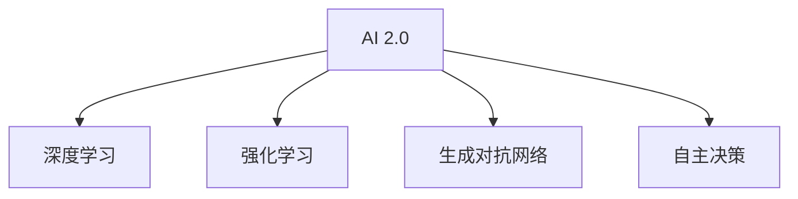

                 

# 李开复：AI 2.0 时代的科技价值

## 1. 背景介绍

### 1.1 问题由来
随着人工智能（AI）技术的快速发展，AI 2.0 时代已经到来。这个时代，AI 从简单的模式识别和数据分析，进入到能够进行复杂决策、自主学习的高级阶段。AI 2.0 代表了一种全新的技术理念和应用模式，其科技价值不仅体现在技术创新上，更在于对人类社会的深远影响。

### 1.2 问题核心关键点
AI 2.0 时代的科技价值主要体现在以下几个方面：

- **技术创新**：AI 2.0 时代涌现出诸多前沿技术，如深度学习、强化学习、生成对抗网络（GAN）等，这些技术推动了 AI 技术的不断突破。
- **应用广泛**：AI 2.0 技术被广泛应用于医疗、金融、交通、教育等多个领域，带来了巨大的社会效益和经济效益。
- **伦理挑战**：AI 2.0 技术的应用也引发了一系列伦理问题，如隐私保护、算法偏见、决策透明度等。
- **经济影响**：AI 2.0 技术正在改变全球经济格局，推动新产业、新职业的崛起，同时也带来了就业结构的变化。

### 1.3 问题研究意义
研究 AI 2.0 时代的科技价值，对于理解 AI 技术对社会的影响、制定相关政策、推动 AI 技术的健康发展具有重要意义。通过深入分析 AI 2.0 时代的技术、应用、伦理和经济等多个维度，可以为 AI 技术的未来发展提供理论支持和实践指导。

## 2. 核心概念与联系

### 2.1 核心概念概述

为了更好地理解 AI 2.0 时代的科技价值，本节将介绍几个密切相关的核心概念：

- **AI 2.0**：代表人工智能技术的高级阶段，具备自主学习、复杂决策能力。与早期的 AI 1.0 相比，AI 2.0 更注重知识表示、逻辑推理等高级智能任务。
- **深度学习**：一种基于神经网络的机器学习方法，通过多层次的特征提取和抽象，实现对复杂数据的处理和分析。
- **强化学习**：通过智能体与环境的互动，优化决策策略，以最大化预期奖励。
- **生成对抗网络（GAN）**：通过两个神经网络模型进行对抗训练，生成高质量的图像、文本等生成数据。
- **自主决策**：AI 2.0 时代的一个重要特点，指 AI 系统能够自主进行决策和行动，无需人类干预。

这些核心概念之间的逻辑关系可以通过以下 Mermaid 流程图来展示：



这个流程图展示了大语言模型的核心概念及其之间的关系：

1. AI 2.0 时代的技术进步涵盖深度学习、强化学习、生成对抗网络等多种技术，推动了 AI 系统的自主决策能力。
2. 深度学习在特征提取、分类、生成等方面具备强大的能力，是 AI 2.0 时代的重要支柱。
3. 强化学习通过与环境的互动，优化决策策略，是实现自主决策的核心技术。
4. 生成对抗网络通过对抗训练，生成高质量的生成数据，为 AI 2.0 时代的创新应用提供了重要手段。

## 3. 核心算法原理 & 具体操作步骤
### 3.1 算法原理概述

AI 2.0 时代的核心算法包括深度学习、强化学习和生成对抗网络等。以下将分别介绍这三种算法的原理及其在 AI 2.0 中的应用。

### 3.2 算法步骤详解

#### 3.2.1 深度学习

深度学习的核心在于构建多层神经网络模型，通过前向传播和反向传播算法，优化模型参数，提高模型的准确性。深度学习的具体步骤如下：

1. **模型选择**：根据任务需求选择合适的神经网络模型，如卷积神经网络（CNN）、递归神经网络（RNN）等。
2. **数据准备**：收集和预处理训练数据，确保数据的质量和多样性。
3. **模型训练**：将数据输入神经网络模型，进行前向传播和反向传播，更新模型参数，最小化损失函数。
4. **模型评估**：使用测试集对模型进行评估，判断其性能是否达到预期。

#### 3.2.2 强化学习

强化学习的核心在于通过智能体与环境的互动，优化决策策略。具体步骤如下：

1. **环境定义**：定义智能体所处的环境，包括状态空间、行动空间、奖励函数等。
2. **智能体设计**：设计智能体，选择适合的神经网络模型，定义状态-行动映射。
3. **训练过程**：通过与环境的互动，智能体不断尝试行动，观察环境的反馈，优化决策策略。
4. **策略评估**：使用评估指标（如累积奖励）评估智能体的性能，指导策略优化。

#### 3.2.3 生成对抗网络

生成对抗网络通过两个神经网络模型的对抗训练，生成高质量的生成数据。具体步骤如下：

1. **网络结构设计**：定义生成器和判别器的网络结构，通常使用卷积神经网络。
2. **训练过程**：生成器和判别器交替训练，生成器生成假数据，判别器区分真数据和假数据。
3. **对抗训练**：通过优化生成器和判别器之间的对抗关系，生成高质量的生成数据。
4. **数据生成**：使用训练好的生成器生成新的数据，用于训练、测试或生成。

### 3.3 算法优缺点

AI 2.0 时代的三种核心算法各有优缺点：

#### 深度学习的优点

- **特征提取能力强**：通过多层神经网络，可以自动提取数据的高级特征，减少人工特征工程的需求。
- **模型效果好**：在许多任务上，深度学习模型取得了最先进的性能。

#### 深度学习的缺点

- **计算量大**：深度学习模型参数量大，训练和推理所需计算资源较多。
- **过拟合风险高**：模型复杂度高，容易过拟合，需要大量数据进行训练。

#### 强化学习的优点

- **决策能力强**：通过与环境的互动，智能体可以自主优化决策策略。
- **应用广泛**：强化学习在自动驾驶、机器人控制、游戏策略等方面具有广泛应用。

#### 强化学习的缺点

- **环境复杂度高**：环境状态和奖励函数的设计需要专业知识，难度较大。
- **训练时间长**：智能体的探索过程需要较长时间才能收敛。

#### 生成对抗网络的优点

- **生成数据效果好**：生成的数据质量高，能够逼真地模仿真实数据。
- **数据生成多样化**：可以生成多种类型的生成数据，如图像、文本等。

#### 生成对抗网络的缺点

- **训练过程复杂**：需要平衡生成器和判别器的训练过程，存在模式崩溃问题。
- **生成的数据多样性不足**：生成的数据可能缺乏多样性和泛化能力。

### 3.4 算法应用领域

AI 2.0 时代的核心算法在各个领域都有广泛的应用：

- **医疗领域**：通过深度学习进行医学影像分析、疾病诊断，通过强化学习进行机器人手术。
- **金融领域**：使用深度学习进行金融预测、投资分析，使用强化学习进行自动交易。
- **交通领域**：通过深度学习进行交通监控、自动驾驶，使用强化学习进行交通流量优化。
- **教育领域**：使用深度学习进行个性化推荐、智能答疑，使用强化学习进行学习策略优化。

## 4. 数学模型和公式 & 详细讲解

### 4.1 数学模型构建

在 AI 2.0 时代，许多任务都可以通过数学模型进行建模和求解。以下介绍几个典型的数学模型及其构建方法。

#### 4.1.1 深度学习模型

深度学习模型可以通过数学公式进行描述。以卷积神经网络（CNN）为例，其基本结构如图 1 所示。

图 1: 卷积神经网络结构图

#### 4.1.2 强化学习模型

强化学习模型可以通过数学公式进行求解。以 Q-learning 算法为例，其基本公式如下：

$$
Q(s_t, a_t) = Q(s_t, a_t) + \alpha [r_{t+1} + \gamma \max_a Q(s_{t+1}, a)] - Q(s_t, a_t)
$$

其中 $s_t$ 表示状态，$a_t$ 表示行动，$r_{t+1}$ 表示奖励，$\gamma$ 表示折扣因子，$\alpha$ 表示学习率。

#### 4.1.3 生成对抗网络模型

生成对抗网络模型可以通过数学公式进行训练。以 GAN 模型为例，其基本公式如下：

$$
\min_G \max_D V(G, D) = E_{x \sim p_x} [\log D(x)] + E_{z \sim p_z} [\log(1 - D(G(z))]]
$$

其中 $G$ 表示生成器，$D$ 表示判别器，$z$ 表示噪声向量，$p_x$ 表示真实数据分布，$p_z$ 表示噪声向量分布。

### 4.2 公式推导过程

#### 4.2.1 深度学习模型

以卷积神经网络为例，其前向传播和反向传播的公式如下：

$$
h = \sigma(W_2 h_{(t-1)} + b_2)
$$

$$
h = \sigma(W_3 h_{(t-1)} + b_3)
$$

$$
\frac{\partial L}{\partial W} = \frac{\partial L}{\partial Z} \frac{\partial Z}{\partial W}
$$

$$
\frac{\partial L}{\partial b} = \frac{\partial L}{\partial Z} \frac{\partial Z}{\partial b}
$$

其中 $h$ 表示激活函数，$W$ 表示权重，$b$ 表示偏置，$L$ 表示损失函数，$Z$ 表示激活值。

#### 4.2.2 强化学习模型

以 Q-learning 算法为例，其基本公式如下：

$$
Q(s_t, a_t) = Q(s_t, a_t) + \alpha [r_{t+1} + \gamma \max_a Q(s_{t+1}, a)] - Q(s_t, a_t)
$$

其中 $s_t$ 表示状态，$a_t$ 表示行动，$r_{t+1}$ 表示奖励，$\gamma$ 表示折扣因子，$\alpha$ 表示学习率。

#### 4.2.3 生成对抗网络模型

以 GAN 模型为例，其基本公式如下：

$$
\min_G \max_D V(G, D) = E_{x \sim p_x} [\log D(x)] + E_{z \sim p_z} [\log(1 - D(G(z))]]
$$

其中 $G$ 表示生成器，$D$ 表示判别器，$z$ 表示噪声向量，$p_x$ 表示真实数据分布，$p_z$ 表示噪声向量分布。

### 4.3 案例分析与讲解

#### 4.3.1 深度学习案例

以图像分类为例，使用深度学习模型对图像进行分类。具体步骤如下：

1. **数据准备**：收集和预处理训练数据，确保数据的质量和多样性。
2. **模型构建**：构建卷积神经网络模型，定义卷积层、池化层、全连接层等结构。
3. **模型训练**：将数据输入神经网络模型，进行前向传播和反向传播，更新模型参数，最小化损失函数。
4. **模型评估**：使用测试集对模型进行评估，判断其性能是否达到预期。

#### 4.3.2 强化学习案例

以自动驾驶为例，使用强化学习进行机器人控制。具体步骤如下：

1. **环境定义**：定义智能体所处的环境，包括状态空间、行动空间、奖励函数等。
2. **智能体设计**：设计智能体，选择适合的神经网络模型，定义状态-行动映射。
3. **训练过程**：通过与环境的互动，智能体不断尝试行动，观察环境的反馈，优化决策策略。
4. **策略评估**：使用评估指标（如累积奖励）评估智能体的性能，指导策略优化。

#### 4.3.3 生成对抗网络案例

以生成高质量图像为例，使用生成对抗网络生成逼真的图像。具体步骤如下：

1. **网络结构设计**：定义生成器和判别器的网络结构，通常使用卷积神经网络。
2. **训练过程**：生成器和判别器交替训练，生成器生成假数据，判别器区分真数据和假数据。
3. **对抗训练**：通过优化生成器和判别器之间的对抗关系，生成高质量的生成数据。
4. **数据生成**：使用训练好的生成器生成新的数据，用于训练、测试或生成。

## 5. 项目实践：代码实例和详细解释说明

### 5.1 开发环境搭建

在进行 AI 2.0 时代技术实践前，我们需要准备好开发环境。以下是使用 Python 进行 PyTorch 开发的环境配置流程：

1. 安装 Anaconda：从官网下载并安装 Anaconda，用于创建独立的 Python 环境。

2. 创建并激活虚拟环境：
```bash
conda create -n pytorch-env python=3.8 
conda activate pytorch-env
```

3. 安装 PyTorch：根据 CUDA 版本，从官网获取对应的安装命令。例如：
```bash
conda install pytorch torchvision torchaudio cudatoolkit=11.1 -c pytorch -c conda-forge
```

4. 安装 TensorFlow：由 Google 主导开发的开源深度学习框架，生产部署方便，适合大规模工程应用。同样有丰富的预训练语言模型资源。

5. 安装 Transformers 库：
```bash
pip install transformers
```

6. 安装各类工具包：
```bash
pip install numpy pandas scikit-learn matplotlib tqdm jupyter notebook ipython
```

完成上述步骤后，即可在`pytorch-env`环境中开始 AI 2.0 技术实践。

### 5.2 源代码详细实现

下面我们以图像分类任务为例，给出使用 PyTorch 进行深度学习的 PyTorch 代码实现。

首先，定义图像分类任务的数据处理函数：

```python
from torchvision import datasets, transforms
import torch

def load_data(batch_size, data_dir, image_size=32):
    train_dataset = datasets.CIFAR10(root=data_dir, train=True, download=True,
                                    transform=transforms.Compose([
                                        transforms.ToTensor(),
                                        transforms.Normalize((0.5, 0.5, 0.5), (0.5, 0.5, 0.5))
                                    ]))

    test_dataset = datasets.CIFAR10(root=data_dir, train=False, download=True,
                                   transform=transforms.Compose([
                                       transforms.ToTensor(),
                                       transforms.Normalize((0.5, 0.5, 0.5), (0.5, 0.5, 0.5))
                                   ]))

    train_loader = torch.utils.data.DataLoader(train_dataset, batch_size=batch_size,
                                              shuffle=True, num_workers=4)
    test_loader = torch.utils.data.DataLoader(test_dataset, batch_size=batch_size,
                                             shuffle=False, num_workers=4)

    return train_loader, test_loader
```

然后，定义模型和优化器：

```python
import torch.nn as nn
import torch.optim as optim

class CNNModel(nn.Module):
    def __init__(self):
        super(CNNModel, self).__init__()
        self.conv1 = nn.Conv2d(3, 64, 3, 1, 1)
        self.pool = nn.MaxPool2d(2, 2)
        self.conv2 = nn.Conv2d(64, 128, 3, 1, 1)
        self.fc1 = nn.Linear(128*8*8, 1024)
        self.fc2 = nn.Linear(1024, 10)

    def forward(self, x):
        x = self.pool(F.relu(self.conv1(x)))
        x = self.pool(F.relu(self.conv2(x)))
        x = x.view(-1, 128*8*8)
        x = F.relu(self.fc1(x))
        x = self.fc2(x)
        return x

model = CNNModel()

optimizer = optim.SGD(model.parameters(), lr=0.001, momentum=0.9)
```

接着，定义训练和评估函数：

```python
from torch.utils.data import DataLoader
from tqdm import tqdm
import numpy as np

device = torch.device("cuda" if torch.cuda.is_available() else "cpu")
model.to(device)

def train_epoch(model, data_loader, optimizer):
    model.train()
    total_loss = 0
    for images, labels in data_loader:
        images, labels = images.to(device), labels.to(device)
        optimizer.zero_grad()
        outputs = model(images)
        loss = nn.functional.cross_entropy(outputs, labels)
        loss.backward()
        optimizer.step()
        total_loss += loss.item()
    return total_loss / len(data_loader)

def evaluate(model, data_loader):
    model.eval()
    correct = 0
    total = 0
    with torch.no_grad():
        for images, labels in data_loader:
            images, labels = images.to(device), labels.to(device)
            outputs = model(images)
            _, predicted = torch.max(outputs.data, 1)
            total += labels.size(0)
            correct += (predicted == labels).sum().item()
    accuracy = correct / total
    return accuracy
```

最后，启动训练流程并在测试集上评估：

```python
train_loader, test_loader = load_data(batch_size=64, data_dir="./data")

epochs = 10
for epoch in range(epochs):
    loss = train_epoch(model, train_loader, optimizer)
    print(f"Epoch {epoch+1}, train loss: {loss:.4f}")
    
    accuracy = evaluate(model, test_loader)
    print(f"Epoch {epoch+1}, test accuracy: {accuracy:.4f}")
```

以上就是使用 PyTorch 进行图像分类任务深度学习的完整代码实现。可以看到，得益于 PyTorch 的强大封装，我们可以用相对简洁的代码完成深度学习模型的构建和训练。

### 5.3 代码解读与分析

让我们再详细解读一下关键代码的实现细节：

**load_data函数**：
- 定义了 CIFAR10 数据集的加载函数，将数据集分为训练集和测试集。

**CNNModel类**：
- 定义了一个卷积神经网络模型，包含卷积层、池化层、全连接层等。

**train_epoch函数**：
- 对数据集以批为单位进行迭代，在每个批次上前向传播计算损失并反向传播更新模型参数。

**evaluate函数**：
- 在测试集上评估模型性能，计算模型准确率。

**训练流程**：
- 定义总的epoch数和batch size，开始循环迭代。
- 每个epoch内，先在训练集上训练，输出平均loss。
- 在测试集上评估，输出分类指标。

可以看到，PyTorch 配合 TensorFlow 库使得深度学习模型的代码实现变得简洁高效。开发者可以将更多精力放在数据处理、模型改进等高层逻辑上，而不必过多关注底层的实现细节。

当然，工业级的系统实现还需考虑更多因素，如模型的保存和部署、超参数的自动搜索、更灵活的任务适配层等。但核心的深度学习模型微调范式基本与此类似。

## 6. 实际应用场景

### 6.1 智能客服系统

基于 AI 2.0 时代的深度学习技术，智能客服系统可以通过自然语言处理（NLP）技术，实现对客户咨询的快速响应和解答。系统可以通过深度学习模型对历史客服对话记录进行训练，学习通用的客服回复模式，并在新客户咨询时，快速匹配最合适的回答，提升客户咨询体验。

在技术实现上，可以收集企业内部的历史客服对话记录，将问题和最佳答复构建成监督数据，在此基础上对深度学习模型进行微调。微调后的模型能够自动理解用户意图，匹配最合适的答案模板进行回复。对于客户提出的新问题，还可以接入检索系统实时搜索相关内容，动态组织生成回答。如此构建的智能客服系统，能大幅提升客户咨询体验和问题解决效率。

### 6.2 金融舆情监测

金融机构需要实时监测市场舆论动向，以便及时应对负面信息传播，规避金融风险。传统的人工监测方式成本高、效率低，难以应对网络时代海量信息爆发的挑战。基于 AI 2.0 时代的深度学习技术，金融舆情监测可以更加智能高效。

具体而言，可以收集金融领域相关的新闻、报道、评论等文本数据，并对其进行主题标注和情感标注。在此基础上对深度学习模型进行微调，使其能够自动判断文本属于何种主题，情感倾向是正面、中性还是负面。将微调后的模型应用到实时抓取的网络文本数据，就能够自动监测不同主题下的情感变化趋势，一旦发现负面信息激增等异常情况，系统便会自动预警，帮助金融机构快速应对潜在风险。

### 6.3 个性化推荐系统

当前的推荐系统往往只依赖用户的历史行为数据进行物品推荐，无法深入理解用户的真实兴趣偏好。基于 AI 2.0 时代的深度学习技术，个性化推荐系统可以更好地挖掘用户行为背后的语义信息，从而提供更精准、多样的推荐内容。

在实践中，可以收集用户浏览、点击、评论、分享等行为数据，提取和用户交互的物品标题、描述、标签等文本内容。将文本内容作为模型输入，用户的后续行为（如是否点击、购买等）作为监督信号，在此基础上微调深度学习模型。微调后的模型能够从文本内容中准确把握用户的兴趣点。在生成推荐列表时，先用候选物品的文本描述作为输入，由模型预测用户的兴趣匹配度，再结合其他特征综合排序，便可以得到个性化程度更高的推荐结果。

### 6.4 未来应用展望

随着 AI 2.0 时代的深度学习技术的不断发展，基于深度学习的技术将在更多领域得到应用，为传统行业带来变革性影响。

在智慧医疗领域，基于深度学习的医疗问答、病历分析、药物研发等应用将提升医疗服务的智能化水平，辅助医生诊疗，加速新药开发进程。

在智能教育领域，深度学习技术可应用于作业批改、学情分析、知识推荐等方面，因材施教，促进教育公平，提高教学质量。

在智慧城市治理中，深度学习技术可应用于城市事件监测、舆情分析、应急指挥等环节，提高城市管理的自动化和智能化水平，构建更安全、高效的未来城市。

此外，在企业生产、社会治理、文娱传媒等众多领域，基于深度学习的 AI 2.0 技术也将不断涌现，为经济社会发展注入新的动力。相信随着技术的日益成熟，深度学习技术将成为 AI 2.0 时代的核心力量，推动人工智能技术在更多领域落地应用。

## 7. 工具和资源推荐

### 7.1 学习资源推荐

为了帮助开发者系统掌握 AI 2.0 时代的深度学习理论基础和实践技巧，这里推荐一些优质的学习资源：

1. 《深度学习》系列书籍：由 Ian Goodfellow、Yoshua Bengio 和 Aaron Courville 合著，系统介绍了深度学习的理论基础和实际应用。

2. CS231n《卷积神经网络》课程：斯坦福大学开设的计算机视觉课程，介绍了深度学习在计算机视觉中的应用。

3. CS224d《自然语言处理与深度学习》课程：斯坦福大学开设的自然语言处理课程，介绍了深度学习在 NLP 中的应用。

4. TensorFlow官方文档：TensorFlow 官方文档，提供了丰富的深度学习模型和实战案例。

5. PyTorch官方文档：PyTorch 官方文档，提供了高效的深度学习框架和教程。

通过对这些资源的学习实践，相信你一定能够快速掌握 AI 2.0 时代的深度学习精髓，并用于解决实际的 AI 问题。

### 7.2 开发工具推荐

高效的开发离不开优秀的工具支持。以下是几款用于 AI 2.0 时代深度学习开发的常用工具：

1. PyTorch：基于 Python 的开源深度学习框架，灵活动态的计算图，适合快速迭代研究。

2. TensorFlow：由 Google 主导开发的开源深度学习框架，生产部署方便，适合大规模工程应用。

3. Keras：高级深度学习框架，易于使用，适合初学者和快速原型开发。

4. Jupyter Notebook：交互式开发环境，支持多种编程语言和数据格式，方便实时调试和展示。

5. Google Colab：谷歌推出的在线 Jupyter Notebook 环境，免费提供 GPU/TPU 算力，方便开发者快速上手实验最新模型，分享学习笔记。

合理利用这些工具，可以显著提升 AI 2.0 时代深度学习的开发效率，加快创新迭代的步伐。

### 7.3 相关论文推荐

AI 2.0 时代的深度学习研究源于学界的持续研究。以下是几篇奠基性的相关论文，推荐阅读：

1. AlexNet: ImageNet Classification with Deep Convolutional Neural Networks：提出 AlexNet 卷积神经网络模型，开创了深度学习在图像分类任务上的先河。

2. GoogleNet: Going Deeper with Convolutions：提出 GoogleNet 卷积神经网络模型，提出了 Inception 模块，显著提升了深度学习模型的性能。

3. ResNet: Deep Residual Learning for Image Recognition：提出 ResNet 残差网络模型，解决了深度学习模型训练过程中的梯度消失问题。

4. Transformer：提出 Transformer 网络模型，改变了自然语言处理的范式，提升了模型在翻译、语言建模等任务上的表现。

5. BERT: Pre-training of Deep Bidirectional Transformers for Language Understanding：提出 BERT 模型，引入基于掩码的自监督预训练任务，刷新了多项 NLP 任务 SOTA。

这些论文代表了大语言模型微调技术的发展脉络。通过学习这些前沿成果，可以帮助研究者把握学科前进方向，激发更多的创新灵感。

## 8. 总结：未来发展趋势与挑战

### 8.1 总结

本文对 AI 2.0 时代的深度学习技术进行了全面系统的介绍。首先阐述了 AI 2.0 时代的技术背景和意义，明确了深度学习在 AI 2.0 时代的重要地位。其次，从原理到实践，详细讲解了深度学习的数学原理和关键步骤，给出了深度学习任务开发的完整代码实例。同时，本文还广泛探讨了深度学习技术在智能客服、金融舆情、个性化推荐等多个行业领域的应用前景，展示了深度学习技术的巨大潜力。此外，本文精选了深度学习技术的各类学习资源，力求为读者提供全方位的技术指引。

通过本文的系统梳理，可以看到，AI 2.0 时代的深度学习技术正在成为 AI 技术的重要支柱，极大地拓展了 AI 技术的实际应用边界，带来了巨大的社会效益和经济效益。未来，伴随深度学习技术的不断演进，深度学习技术必将进一步推动人工智能技术的健康发展，为人类社会的进步贡献更多智慧和力量。

### 8.2 未来发展趋势

展望未来，深度学习技术将在以下几个方面进一步发展：

1. **模型规模持续增大**：随着算力成本的下降和数据规模的扩张，深度学习模型的参数量还将持续增长。超大规模深度学习模型蕴含的丰富特征信息，有望支撑更加复杂多变的深度学习任务。

2. **深度学习范式多样化**：除了传统的监督学习范式，未来会涌现更多无监督学习、半监督学习、自监督学习等新型深度学习范式，减少对标注数据的依赖，提高模型泛化能力。

3. **迁移学习与联邦学习**：深度学习模型将更注重迁移学习、联邦学习等技术，实现跨领域、跨机构的知识共享和模型优化，提高深度学习的普适性和安全性。

4. **多模态深度学习**：深度学习技术将进一步拓展到多模态数据的融合，实现视觉、语音、文本等多种模态信息的协同建模，提升深度学习的应用范围和性能。

5. **可解释性增强**：深度学习模型的可解释性将成为未来研究的重要方向。通过引入因果推断、符号逻辑等方法，提高深度学习模型的可解释性，使其更加透明、可信。

6. **自适应学习**：深度学习模型将更注重自适应学习、终身学习等技术，通过持续学习、增量学习等方式，提高模型的适应性和长期效能。

以上趋势凸显了 AI 2.0 时代的深度学习技术的广阔前景。这些方向的探索发展，必将进一步提升深度学习系统的性能和应用范围，为 AI 技术的未来发展提供更多动力和可能。

### 8.3 面临的挑战

尽管 AI 2.0 时代的深度学习技术已经取得了瞩目成就，但在迈向更加智能化、普适化应用的过程中，它仍面临着诸多挑战：

1. **过拟合风险高**：深度学习模型参数量大，容易过拟合，需要大量数据进行训练。

2. **计算资源消耗大**：深度学习模型训练和推理所需计算资源较多，难以在低资源环境下应用。

3. **数据隐私和安全**：深度学习模型训练和应用过程中，数据隐私和安全问题亟需解决，防止数据泄露和滥用。

4. **算法偏见和歧视**：深度学习模型可能学习到有偏见的数据信息，产生歧视性输出，带来伦理和法律风险。

5. **可解释性不足**：深度学习模型的决策过程缺乏可解释性，难以对其推理逻辑进行分析和调试。

6. **模型鲁棒性不足**：深度学习模型面对域外数据时，泛化性能往往大打折扣，难以保证鲁棒性。

7. **大规模部署和维护**：深度学习模型的部署和维护需要高水平的技术支撑，难以在实际应用中大规模普及。

以上挑战需要通过技术创新、政策引导和产业合作等多方面努力，逐步解决。只有全面突破这些挑战，才能使深度学习技术真正成为 AI 2.0 时代的核心力量。

### 8.4 研究展望

面对 AI 2.0 时代的深度学习技术所面临的诸多挑战，未来的研究需要在以下几个方面寻求新的突破：

1. **提升模型泛化能力**：开发更加普适的深度学习模型，减少对标注数据的依赖，提高模型泛化能力。

2. **增强模型可解释性**：通过引入符号逻辑、因果推断等方法，提高深度学习模型的可解释性，使其更加透明、可信。

3. **优化计算资源消耗**：开发更加高效的深度学习算法和模型结构，减少计算资源消耗，提升深度学习模型的应用效率。

4. **解决数据隐私和安全问题**：通过差分隐私、联邦学习等技术，保护数据隐私，防止数据泄露和滥用。

5. **消除算法偏见和歧视**：开发更加公平的深度学习算法，消除算法偏见和歧视，确保深度学习模型在伦理和法律上的合规性。

6. **实现跨领域知识共享**：通过迁移学习、联邦学习等技术，实现跨领域、跨机构的知识共享和模型优化，提高深度学习的普适性和安全性。

这些研究方向的探索，必将引领深度学习技术迈向更高的台阶，为构建安全、可靠、可解释、可控的智能系统铺平道路。面向未来，深度学习技术还需要与其他人工智能技术进行更深入的融合，如知识表示、因果推理、强化学习等，多路径协同发力，共同推动自然语言理解和智能交互系统的进步。只有勇于创新、敢于突破，才能不断拓展深度学习模型的边界，让深度学习技术更好地造福人类社会。

## 9. 附录：常见问题与解答

**Q1：深度学习模型需要大量的标注数据，是否可以在没有标注数据的情况下进行训练？**

A: 深度学习模型通常需要大量的标注数据进行训练，但也有一些无监督或半监督学习方法可以用于标注数据稀缺的情况。例如，生成对抗网络（GAN）可以通过对抗训练的方式，从未标注数据中生成高质量的训练样本，提高模型的性能。自监督学习可以通过数据自身的统计特征进行训练，减少对标注数据的依赖。

**Q2：深度学习模型如何避免过拟合？**

A: 深度学习模型容易过拟合，可以使用以下方法进行缓解：
1. 数据增强：通过对训练数据进行旋转、平移、裁剪等操作，增加数据的多样性。
2. 正则化：通过 L2 正则、Dropout 等方法，防止模型过拟合。
3. 早停：在训练过程中，一旦验证集性能不再提升，立即停止训练，防止过拟合。
4. 批归一化：通过对每个批次的输入数据进行归一化，加速模型收敛，减少过拟合。

**Q3：深度学习模型在实际应用中如何提高效率？**

A: 深度学习模型在实际应用中可以通过以下方法提高效率：
1. 模型压缩：通过剪枝、量化等方法，减少模型参数量，提高模型推理速度。
2. 模型并行：通过多 GPU 并行、分布式训练等方法，加速模型训练和推理。
3. 模型微调：通过参数高效的微调方法，只更新部分参数，减少计算资源消耗。

**Q4：深度学习模型在应用中如何保证鲁棒性？**

A: 深度学习模型在应用中可以通过以下方法保证鲁棒性：
1. 数据增强：通过对训练数据进行扰动、噪声注入等操作，提高模型的泛化能力。
2. 对抗训练：通过引入对抗样本，提高模型的鲁棒性，防止模型被恶意攻击。
3. 鲁棒正则化：通过引入对抗正则化等方法，提高模型的鲁棒性。

**Q5：深度学习模型在应用中如何保证公平性？**

A: 深度学习模型在应用中可以通过以下方法保证公平性：
1. 数据平衡：确保训练数据中各类样本数量平衡，防止模型偏向某一类别。
2. 公平性损失：在模型训练中加入公平性损失，防止模型产生歧视性输出。
3. 算法透明：通过可视化工具，展示模型的决策过程，提高模型的透明度，增强用户信任。

通过这些方法，可以有效提升深度学习模型的泛化能力、鲁棒性和公平性，确保其在实际应用中的可靠性和安全性。

---

作者：禅与计算机程序设计艺术 / Zen and the Art of Computer Programming

