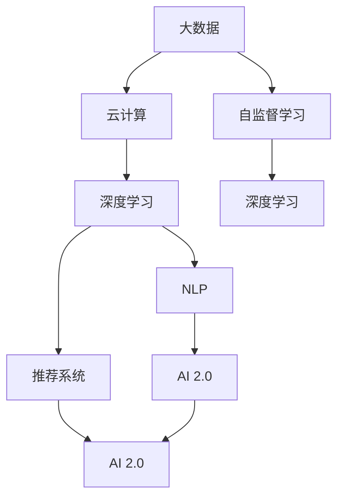

                 

# 李开复：AI 2.0 时代的科技价值

## 1. 背景介绍

### 1.1 问题由来
人工智能（AI）的发展历程已经历了多次重大转折，每一次的跃进都伴随着全新的技术突破和应用变革。在AI 1.0时代，专家系统的出现标志着AI的萌芽，但受限于数据和计算资源的匮乏，人工智能在商业领域的应用始终局限于专家知识和规则驱动的自动化解决方案。直到AI 2.0时代，深度学习技术的大规模应用，使得AI从专家系统迈向数据驱动的全面智能化。

AI 2.0时代，得益于大数据、云计算和深度学习技术的快速演进，AI在图像识别、语音识别、自然语言处理、推荐系统等多个领域取得了突破性进展。AI从专家知识驱动转向数据驱动，极大提升了模型的泛化能力和适应性，为各行各业带来了前所未有的技术变革。

### 1.2 问题核心关键点
AI 2.0时代，深度学习和AI技术的迅猛发展，使得AI技术得以广泛应用于智能制造、智慧医疗、智能交通、智能客服等多个领域，推动了行业的数字化转型。然而，这一过程中，AI技术的落地和应用仍面临诸多挑战，包括数据质量与隐私保护、模型复杂性与可解释性、系统鲁棒性与安全性等问题。如何更有效地推动AI技术的落地应用，使其在实际业务中发挥最大的价值，成为当下AI领域亟需解决的关键问题。

### 1.3 问题研究意义
AI 2.0时代，AI技术的应用价值愈发凸显。通过对AI技术的深入研究和创新应用，可以推动经济社会的高质量发展，提升政府治理效率，优化企业运营效率，改善居民生活质量。同时，AI技术的普适性和可扩展性也使得其成为推动科技进步和社会进步的重要力量。因此，深入研究AI 2.0时代的科技价值，对于指导AI技术的应用实践，推动AI技术的可持续发展具有重要意义。

## 2. 核心概念与联系

### 2.1 核心概念概述

为了更清晰地理解AI 2.0时代的技术价值，本节将介绍几个与AI 2.0技术紧密相关的核心概念：

- **AI 2.0**：AI 2.0代表的是以深度学习为核心的全面智能化阶段，通过大规模数据训练，提升模型在各个领域的泛化能力。
- **深度学习**：一种基于神经网络架构的机器学习方法，通过多层非线性变换，捕捉数据中的复杂模式。
- **大数据**：指规模巨大、复杂多变、动态增长的数据集合，是深度学习模型训练的基础。
- **云计算**：通过网络提供按需扩展的计算资源，支持大规模深度学习模型的训练与部署。
- **自然语言处理（NLP）**：利用AI技术处理和理解自然语言，包括文本分析、语音识别、机器翻译等。
- **推荐系统**：基于用户行为和偏好，推荐个性化内容或产品，优化用户体验。
- **自监督学习**：利用未标注数据训练模型，挖掘数据中的隐含知识，提升模型泛化能力。

这些核心概念之间通过数据、模型、应用等多个维度相互关联，构成了AI 2.0时代的核心技术框架。

### 2.2 核心概念原理和架构的 Mermaid 流程图



这个流程图展示了AI 2.0技术框架的关键组成元素和它们之间的联系。大数据和云计算提供了模型训练的基础资源，深度学习模型是核心技术，自然语言处理和推荐系统是应用的具体实现，自监督学习则提升了模型泛化能力。

## 3. 核心算法原理 & 具体操作步骤

### 3.1 算法原理概述

AI 2.0时代，深度学习模型在各个领域的广泛应用，极大地提升了AI技术的实用价值。其核心算法原理主要包括以下几个方面：

- **神经网络架构**：由多层神经元组成，通过反向传播算法训练模型参数，实现复杂模式的拟合。
- **损失函数**：定义模型预测与真实标签之间的差异，通过优化损失函数来提升模型性能。
- **正则化技术**：如L2正则、Dropout等，防止模型过拟合，提升泛化能力。
- **自监督学习**：利用未标注数据训练模型，挖掘数据中的隐含知识，提升模型泛化能力。
- **迁移学习**：将预训练模型知识迁移到特定任务上，提高模型在该任务上的性能。
- **增强学习**：通过试错学习，优化模型参数，适应复杂环境。

### 3.2 算法步骤详解

基于深度学习模型的AI 2.0技术开发，通常包括以下几个关键步骤：

**Step 1: 数据准备**
- 收集大量高质量的标注数据，用于模型训练和验证。
- 数据预处理，包括数据清洗、归一化、划分训练集和验证集等。

**Step 2: 模型构建**
- 选择适合的深度学习模型架构，如卷积神经网络（CNN）、循环神经网络（RNN）、Transformer等。
- 设计合适的损失函数和优化器，如交叉熵损失、AdamW优化器等。

**Step 3: 模型训练**
- 将数据输入模型，前向传播计算损失函数。
- 反向传播计算梯度，使用优化器更新模型参数。
- 周期性在验证集上评估模型性能，根据性能指标调整超参数。

**Step 4: 模型评估与优化**
- 在测试集上评估模型性能，对比不同模型的效果。
- 根据评估结果，优化模型结构和超参数，提升模型泛化能力。

**Step 5: 模型部署与监控**
- 将训练好的模型部署到生产环境中，实现业务应用。
- 实时监控模型性能，及时发现和修正问题。

### 3.3 算法优缺点

AI 2.0时代的深度学习算法具有以下优点：

- 强大的泛化能力：通过大规模数据训练，模型能够适应各种复杂模式。
- 可解释性强：许多深度学习模型（如BERT）能够提供可解释的特征表示，便于理解模型决策过程。
- 高效计算：通过GPU、TPU等加速设备，深度学习模型能够实现高效的计算和训练。

同时，该算法也存在一些局限性：

- 数据依赖性强：深度学习模型需要大量高质量的标注数据，获取数据成本较高。
- 模型复杂度高：大规模深度学习模型参数量庞大，难以解释和调试。
- 鲁棒性不足：深度学习模型对输入数据扰动敏感，容易过拟合和泛化失效。

尽管存在这些局限性，但深度学习在AI 2.0时代的应用价值已得到广泛认可，未来仍需在模型结构、优化算法、数据处理等方面不断优化，进一步提升其性能和可解释性。

### 3.4 算法应用领域

AI 2.0时代的深度学习算法在多个领域得到了广泛应用，包括但不限于：

- **图像识别**：如图像分类、目标检测、人脸识别等。
- **语音识别**：如自动语音识别（ASR）、语音合成（TTS）等。
- **自然语言处理**：如机器翻译、文本分类、情感分析等。
- **推荐系统**：如基于用户行为的个性化推荐、基于内容的推荐等。
- **智能制造**：如工业自动化、智能监控、质量控制等。
- **智慧医疗**：如影像诊断、电子病历分析、药物研发等。
- **智能交通**：如自动驾驶、交通监控、智能调度等。

这些领域的应用不仅提升了企业的运营效率和用户体验，也推动了相关行业的智能化转型，具有广阔的发展前景。

## 4. 数学模型和公式 & 详细讲解 & 举例说明

### 4.1 数学模型构建

在AI 2.0时代，深度学习模型的核心数学模型是神经网络，其核心公式包括前向传播和反向传播。以下以一个简单的全连接神经网络模型为例，介绍数学模型的构建过程。

**前向传播**：
$$
y = \sigma(Wx + b)
$$
其中，$x$ 为输入向量，$y$ 为输出向量，$W$ 为权重矩阵，$b$ 为偏置项，$\sigma$ 为激活函数。

**反向传播**：
$$
\frac{\partial L}{\partial W} = \frac{\partial L}{\partial y} \frac{\partial y}{\partial x} \frac{\partial x}{\partial W}
$$
其中，$L$ 为损失函数，$\frac{\partial L}{\partial y}$ 为损失函数对输出层的梯度，$\frac{\partial y}{\partial x}$ 为激活函数的导数，$\frac{\partial x}{\partial W}$ 为权重矩阵的导数。

### 4.2 公式推导过程

对于全连接神经网络，其前向传播和反向传播公式可以通过链式法则进行推导。以一个简单的二分类问题为例，输入向量 $x$ 通过权重矩阵 $W$ 和偏置项 $b$ 进行线性变换，得到输出向量 $z$，再通过激活函数 $\sigma$ 得到预测结果 $y$。具体推导过程如下：

**前向传播**：
$$
z = Wx + b
$$
$$
y = \sigma(z)
$$

**反向传播**：
$$
\frac{\partial L}{\partial z} = \frac{\partial L}{\partial y} \frac{\partial y}{\partial z}
$$
$$
\frac{\partial L}{\partial W} = \frac{\partial L}{\partial z} \frac{\partial z}{\partial x} = \frac{\partial L}{\partial y} \frac{\partial y}{\partial z} \frac{\partial z}{\partial x} = \frac{\partial L}{\partial y} \frac{\partial y}{\partial z} W
$$

其中，$\frac{\partial L}{\partial y}$ 为损失函数对输出层的梯度，$\frac{\partial y}{\partial z}$ 为激活函数的导数，$\frac{\partial z}{\partial x}$ 为权重矩阵的导数。

### 4.3 案例分析与讲解

以一个简单的手写数字识别问题为例，分析深度学习模型的构建和优化过程。

假设输入为28x28像素的手写数字图像，输出为0-9之间的数字标签。模型设计如下：

- 输入层：28x28的像素矩阵。
- 隐藏层：64个神经元，使用ReLU激活函数。
- 输出层：10个神经元，使用Softmax激活函数。

模型训练使用MNIST数据集，损失函数为交叉熵损失。

**模型构建**：
```python
import torch.nn as nn
import torch.optim as optim
import torchvision.transforms as transforms
import torchvision.datasets as datasets

class Net(nn.Module):
    def __init__(self):
        super(Net, self).__init__()
        self.conv1 = nn.Conv2d(1, 64, kernel_size=3, stride=1, padding=1)
        self.conv2 = nn.Conv2d(64, 64, kernel_size=3, stride=1, padding=1)
        self.fc1 = nn.Linear(7*7*64, 10)
        self.fc2 = nn.Linear(10, 10)

    def forward(self, x):
        x = F.relu(self.conv1(x))
        x = F.max_pool2d(x, 2)
        x = F.relu(self.conv2(x))
        x = F.max_pool2d(x, 2)
        x = x.view(x.size(0), -1)
        x = F.relu(self.fc1(x))
        x = self.fc2(x)
        return F.softmax(x, dim=1)

net = Net()
criterion = nn.CrossEntropyLoss()
optimizer = optim.Adam(net.parameters(), lr=0.001)
```

**模型训练**：
```python
for epoch in range(10):
    running_loss = 0.0
    for i, data in enumerate(train_loader, 0):
        inputs, labels = data
        optimizer.zero_grad()
        outputs = net(inputs)
        loss = criterion(outputs, labels)
        loss.backward()
        optimizer.step()

    print(f'Epoch {epoch+1}, loss: {running_loss:.4f}')
```

**模型评估**：
```python
correct = 0
total = 0
with torch.no_grad():
    for data in test_loader:
        images, labels = data
        outputs = net(images)
        _, predicted = torch.max(outputs.data, 1)
        total += labels.size(0)
        correct += (predicted == labels).sum().item()

print(f'Accuracy of the network on the 10000 test images: {100 * correct / total}%')
```

通过对深度学习模型的数学建模和推导，可以更清晰地理解其原理和优化过程，便于在实际应用中进行模型构建和调试。

## 5. 项目实践：代码实例和详细解释说明

### 5.1 开发环境搭建

在进行AI 2.0项目实践前，需要先搭建好开发环境。以下是使用Python进行TensorFlow开发的环境配置流程：

1. 安装Anaconda：从官网下载并安装Anaconda，用于创建独立的Python环境。

2. 创建并激活虚拟环境：
```bash
conda create -n tf-env python=3.8 
conda activate tf-env
```

3. 安装TensorFlow：从官网获取对应的安装命令。例如：
```bash
conda install tensorflow
```

4. 安装各类工具包：
```bash
pip install numpy pandas scikit-learn matplotlib tqdm jupyter notebook ipython
```

完成上述步骤后，即可在`tf-env`环境中开始AI 2.0项目实践。

### 5.2 源代码详细实现

下面以一个简单的手写数字识别项目为例，展示使用TensorFlow进行图像识别任务开发的代码实现。

**项目环境**：
- Python 3.8
- TensorFlow 2.5
- MNIST数据集

**代码实现**：
```python
import tensorflow as tf
import tensorflow.keras.datasets as datasets
import tensorflow.keras.models as models
import tensorflow.keras.layers as layers
from tensorflow.keras import backend as K

# 加载MNIST数据集
(x_train, y_train), (x_test, y_test) = datasets.mnist.load_data()

# 数据预处理
x_train = x_train.reshape(-1, 28, 28, 1).astype('float32') / 255.0
x_test = x_test.reshape(-1, 28, 28, 1).astype('float32') / 255.0
y_train = tf.keras.utils.to_categorical(y_train, 10)
y_test = tf.keras.utils.to_categorical(y_test, 10)

# 构建模型
model = models.Sequential([
    layers.Conv2D(32, kernel_size=(3, 3), activation='relu', input_shape=(28, 28, 1)),
    layers.MaxPooling2D(pool_size=(2, 2)),
    layers.Flatten(),
    layers.Dense(64, activation='relu'),
    layers.Dense(10, activation='softmax')
])

# 编译模型
model.compile(optimizer='adam',
              loss='categorical_crossentropy',
              metrics=['accuracy'])

# 训练模型
model.fit(x_train, y_train, epochs=10, batch_size=32, validation_data=(x_test, y_test))

# 评估模型
model.evaluate(x_test, y_test)
```

### 5.3 代码解读与分析

让我们再详细解读一下关键代码的实现细节：

**数据预处理**：
- `reshape`函数将输入图像的维度调整为一维数组，便于卷积层处理。
- `astype('float32') / 255.0`将像素值归一化到[0,1]之间，方便后续模型训练。
- `to_categorical`函数将标签转换为独热编码，便于模型进行分类。

**模型构建**：
- `Sequential`模型是一维模型，便于堆叠多个层。
- `Conv2D`层为卷积层，提取图像特征。
- `MaxPooling2D`层为池化层，降低特征图尺寸。
- `Flatten`层将二维特征图展平成一维数组，便于全连接层处理。
- `Dense`层为全连接层，进行分类。

**模型编译**：
- `compile`函数用于配置模型的优化器、损失函数和评估指标。
- `adam`优化器为常用的深度学习优化器，收敛速度快。
- `categorical_crossentropy`损失函数为多分类问题常用的损失函数。
- `accuracy`评估指标用于衡量模型分类精度。

**模型训练与评估**：
- `fit`函数用于训练模型，指定训练轮数和批次大小。
- `evaluate`函数用于评估模型，返回损失和精度指标。

通过对代码的详细解读，可以更好地理解TensorFlow进行深度学习项目开发的流程和细节。

## 6. 实际应用场景

### 6.1 智能客服系统

AI 2.0时代的智能客服系统通过深度学习模型的微调，能够高效处理大量客户咨询，快速响应并解决客户问题，提升客户满意度。

在技术实现上，可以收集企业内部的历史客服对话记录，将问题和最佳答复构建成监督数据，在此基础上对预训练模型进行微调。微调后的模型能够自动理解客户意图，匹配最合适的答案模板进行回复。对于客户提出的新问题，还可以接入检索系统实时搜索相关内容，动态组织生成回答。如此构建的智能客服系统，能大幅提升客户咨询体验和问题解决效率。

### 6.2 金融舆情监测

金融机构需要实时监测市场舆论动向，以便及时应对负面信息传播，规避金融风险。传统的人工监测方式成本高、效率低，难以应对网络时代海量信息爆发的挑战。基于AI 2.0的文本分类和情感分析技术，为金融舆情监测提供了新的解决方案。

具体而言，可以收集金融领域相关的新闻、报道、评论等文本数据，并对其进行主题标注和情感标注。在此基础上对深度学习模型进行微调，使其能够自动判断文本属于何种主题，情感倾向是正面、中性还是负面。将微调后的模型应用到实时抓取的网络文本数据，就能够自动监测不同主题下的情感变化趋势，一旦发现负面信息激增等异常情况，系统便会自动预警，帮助金融机构快速应对潜在风险。

### 6.3 个性化推荐系统

当前的推荐系统往往只依赖用户的历史行为数据进行物品推荐，无法深入理解用户的真实兴趣偏好。基于AI 2.0的个性化推荐系统可以更好地挖掘用户行为背后的语义信息，从而提供更精准、多样的推荐内容。

在实践中，可以收集用户浏览、点击、评论、分享等行为数据，提取和用户交互的物品标题、描述、标签等文本内容。将文本内容作为模型输入，用户的后续行为（如是否点击、购买等）作为监督信号，在此基础上微调深度学习模型。微调后的模型能够从文本内容中准确把握用户的兴趣点。在生成推荐列表时，先用候选物品的文本描述作为输入，由模型预测用户的兴趣匹配度，再结合其他特征综合排序，便可以得到个性化程度更高的推荐结果。

### 6.4 未来应用展望

随着AI 2.0技术的不断进步，基于深度学习的AI应用将越来越广泛，其科技价值也将愈发凸显。未来，AI 2.0技术将在更多领域得到应用，为传统行业带来变革性影响。

在智慧医疗领域，基于AI 2.0的医疗问答、病历分析、药物研发等应用将提升医疗服务的智能化水平，辅助医生诊疗，加速新药开发进程。

在智能教育领域，AI 2.0的文本分类和情感分析技术，为学生学习情况分析、智能作业批改、知识推荐等方面提供了新的解决方案，因材施教，促进教育公平，提高教学质量。

在智慧城市治理中，AI 2.0的图像识别和智能调度技术，将提高城市管理的自动化和智能化水平，构建更安全、高效的未来城市。

此外，在企业生产、社会治理、文娱传媒等众多领域，基于AI 2.0的智能系统也将不断涌现，为经济社会发展注入新的动力。相信随着技术的日益成熟，AI 2.0必将在更广阔的应用领域大放异彩，深刻影响人类的生产生活方式。

## 7. 工具和资源推荐

### 7.1 学习资源推荐

为了帮助开发者系统掌握AI 2.0技术的理论基础和实践技巧，这里推荐一些优质的学习资源：

1. **《深度学习》（Ian Goodfellow等著）**：深度学习领域的经典教材，全面介绍了深度学习的理论基础和实际应用。

2. **CS231n《深度学习计算机视觉》课程**：斯坦福大学开设的计算机视觉课程，有Lecture视频和配套作业，涵盖深度学习在图像识别、物体检测等领域的实践。

3. **DeepLearning.ai《深度学习专项课程》**：由Andrew Ng主讲的深度学习课程，覆盖了深度学习的基本原理和应用实践。

4. **《Python深度学习》（Francois Chollet著）**：使用TensorFlow进行深度学习开发的实战指南，适合快速上手TensorFlow项目开发。

5. **HuggingFace官方文档**：提供大量预训练模型和深度学习库的使用教程，方便开发者快速上手。

通过对这些资源的学习实践，相信你一定能够快速掌握AI 2.0技术的精髓，并用于解决实际的AI问题。

### 7.2 开发工具推荐

高效的开发离不开优秀的工具支持。以下是几款用于AI 2.0项目开发的常用工具：

1. **TensorFlow**：由Google主导开发的开源深度学习框架，支持大规模分布式计算，适用于各种深度学习项目开发。

2. **PyTorch**：Facebook开发的深度学习框架，灵活性高，适合快速原型设计和研究。

3. **Keras**：高级深度学习库，提供简洁易用的API，适合快速搭建深度学习模型。

4. **TensorBoard**：TensorFlow配套的可视化工具，可实时监测模型训练状态，并提供丰富的图表呈现方式。

5. **Weights & Biases**：模型训练的实验跟踪工具，可以记录和可视化模型训练过程中的各项指标，方便对比和调优。

6. **Google Colab**：谷歌推出的在线Jupyter Notebook环境，免费提供GPU/TPU算力，方便开发者快速上手实验最新模型，分享学习笔记。

合理利用这些工具，可以显著提升AI 2.0项目的开发效率，加快创新迭代的步伐。

### 7.3 相关论文推荐

AI 2.0技术的发展源于学界的持续研究。以下是几篇奠基性的相关论文，推荐阅读：

1. **ImageNet Classification with Deep Convolutional Neural Networks**（AlexNet论文）：提出深度卷积神经网络，开启了图像识别的深度学习时代。

2. **Google's Guided Attention Network for Fine-grained Image Recognition**：提出Guided Attention Network，提升了图像识别的精度和鲁棒性。

3. **Attention Is All You Need**：提出Transformer结构，实现了自然语言处理的突破。

4. **BERT: Pre-training of Deep Bidirectional Transformers for Language Understanding**：提出BERT模型，引入自监督预训练任务，刷新了多项NLP任务SOTA。

5. **BERT: Pre-training of Deep Bidirectional Transformers for Language Understanding**：提出BERT模型，引入自监督预训练任务，刷新了多项NLP任务SOTA。

6. **Training GANs with Limited Data**：提出CycleGAN和WGAN等模型，提升了生成对抗网络（GAN）的性能和可解释性。

这些论文代表了大规模深度学习模型在各个领域的发展脉络，通过学习这些前沿成果，可以帮助研究者把握学科前进方向，激发更多的创新灵感。

## 8. 总结：未来发展趋势与挑战

### 8.1 总结

本文对AI 2.0时代的深度学习模型进行了全面系统的介绍。首先阐述了AI 2.0时代技术的发展历程和应用前景，明确了深度学习模型在各个领域的应用价值。其次，从原理到实践，详细讲解了深度学习模型的构建和优化过程，给出了AI 2.0项目开发的完整代码实例。同时，本文还探讨了深度学习模型在实际应用中的各种场景，展示了其广阔的应用前景。最后，本文精选了深度学习技术的各类学习资源，力求为读者提供全方位的技术指引。

通过本文的系统梳理，可以看到，深度学习模型在AI 2.0时代的应用价值愈发凸显，成为推动各行各业智能化转型和提升用户体验的关键力量。未来，随着深度学习技术的不断进步，深度学习模型将会在更广泛的领域发挥其独特优势，为人类认知智能的进化带来深远影响。

### 8.2 未来发展趋势

展望未来，AI 2.0时代的深度学习技术将呈现以下几个发展趋势：

1. **模型规模持续增大**：随着算力成本的下降和数据规模的扩张，深度学习模型的参数量还将持续增长。超大模型蕴含的丰富知识，有望支撑更加复杂多变的下游任务。

2. **模型可解释性提升**：通过引入可解释性技术，如LIME、SHAP等，提升深度学习模型的可解释性，便于理解模型决策过程。

3. **多模态融合**：将视觉、语音、文本等多种模态信息进行深度融合，提升模型对现实世界的理解和建模能力。

4. **自监督学习与强化学习结合**：将自监督学习与强化学习相结合，提升模型在复杂环境中的自主学习能力和适应性。

5. **元学习与迁移学习结合**：通过元学习技术，使深度学习模型具备更强的泛化能力和迁移学习能力，加速模型在多个任务上的应用。

6. **鲁棒性增强**：通过引入鲁棒性技术，如对抗样本训练、鲁棒正则化等，提升模型在噪声和攻击下的鲁棒性。

7. **联邦学习与隐私保护结合**：通过联邦学习技术，保护数据隐私的同时，实现模型在分布式环境下的高效训练。

这些趋势将推动深度学习模型在更多领域的应用，提升模型的性能和可解释性，为社会各行各业的智能化转型提供有力支持。

### 8.3 面临的挑战

尽管AI 2.0时代的深度学习技术已经取得了巨大进展，但在实际应用中仍面临诸多挑战：

1. **数据依赖性强**：深度学习模型需要大量高质量的标注数据，获取数据成本较高。

2. **模型复杂度高**：大规模深度学习模型参数量庞大，难以解释和调试。

3. **鲁棒性不足**：深度学习模型对输入数据扰动敏感，容易过拟合和泛化失效。

4. **可解释性不足**：深度学习模型通常被视为"黑盒"系统，难以解释其内部工作机制和决策逻辑。

5. **安全性问题**：深度学习模型可能学习到有害信息和偏见，对社会带来负面影响。

6. **资源消耗高**：大规模深度学习模型的训练和推理需要大量计算资源，成本较高。

尽管存在这些挑战，但随着深度学习技术的不断发展，相关研究也在不断突破。未来，我们需要在模型结构、优化算法、数据处理等方面进行更深入的研究，以期解决这些挑战，推动AI 2.0技术的可持续发展。

### 8.4 研究展望

面对深度学习模型所面临的诸多挑战，未来的研究需要在以下几个方面寻求新的突破：

1. **无监督学习与半监督学习结合**：摆脱对大规模标注数据的依赖，利用自监督学习、主动学习等无监督和半监督范式，最大限度利用非结构化数据。

2. **参数高效与计算高效结合**：开发更加参数高效的深度学习模型，如 Adapter、Prefix等，在固定大部分预训练参数的同时，只更新极少量的任务相关参数。

3. **因果学习与对比学习结合**：引入因果推断和对比学习思想，增强模型建立稳定因果关系的能力，提升模型泛化性和抗干扰能力。

4. **跨模态融合与多模态建模结合**：将视觉、语音、文本等多种模态信息进行深度融合，提升模型对现实世界的理解和建模能力。

5. **元学习与迁移学习结合**：通过元学习技术，使深度学习模型具备更强的泛化能力和迁移学习能力，加速模型在多个任务上的应用。

6. **鲁棒性与安全性结合**：引入鲁棒性技术，如对抗样本训练、鲁棒正则化等，提升模型在噪声和攻击下的鲁棒性。

7. **联邦学习与隐私保护结合**：通过联邦学习技术，保护数据隐私的同时，实现模型在分布式环境下的高效训练。

这些研究方向将推动深度学习模型在更多领域的应用，提升模型的性能和可解释性，为社会各行各业的智能化转型提供有力支持。

## 9. 附录：常见问题与解答

**Q1: 深度学习模型和传统机器学习模型有何区别？**

A: 深度学习模型相较于传统机器学习模型，具有以下特点：

- 处理复杂非线性关系的能力更强：深度学习模型通过多层非线性变换，能够更好地捕捉数据中的复杂模式。
- 自动特征提取：深度学习模型能够自动学习输入数据的特征表示，无需手工设计特征。
- 参数量巨大：深度学习模型通常具有亿级参数，模型结构复杂。
- 数据需求高：深度学习模型需要大量高质量标注数据进行训练。

这些特点使得深度学习模型在处理大规模复杂数据集时表现优异，但同时也带来了模型复杂度高、数据依赖性强等挑战。

**Q2: 如何选择合适的深度学习框架？**

A: 选择合适的深度学习框架需要考虑多个因素，包括模型需求、开发环境、资源限制等。以下是几个常用的深度学习框架及其特点：

- **TensorFlow**：由Google主导开发的开源框架，支持分布式计算，适用于大规模项目开发。
- **PyTorch**：由Facebook开发的深度学习框架，灵活性高，易于调试和扩展。
- **Keras**：高级深度学习库，提供简洁易用的API，适用于快速原型设计和研究。
- **MXNet**：由Apache基金会维护的深度学习框架，支持多种编程语言，适用于跨平台开发。
- **Caffe**：由伯克利视觉与学习中心开发的深度学习框架，适用于计算机视觉领域的应用。

根据具体项目需求和团队技术栈，选择最适合的框架进行开发。

**Q3: 如何避免深度学习模型过拟合？**

A: 避免深度学习模型过拟合，可以采取以下措施：

- 数据增强：通过数据增强技术，扩充训练数据集，提升模型泛化能力。
- 正则化：使用L2正则、Dropout等技术，防止模型过拟合。
- 早停策略：在验证集上监测模型性能，当性能不再提升时停止训练，防止过拟合。
- 模型简化：通过剪枝、量化等技术，简化模型结构，减少过拟合风险。

这些技术可以结合使用，根据具体项目需求进行优化。

**Q4: 深度学习模型的训练时间是否可以加速？**

A: 深度学习模型的训练时间受多种因素影响，包括模型规模、数据量、计算资源等。以下是一些常用的加速方法：

- **分布式训练**：使用多台机器并行训练，提高计算效率。
- **混合精度训练**：将浮点模型转为定点模型，压缩存储空间，提高计算效率。
- **梯度累积**：通过批次的梯度累积，减小批次大小，提高训练效率。
- **模型并行**：将模型分为多个部分，并行训练，提升训练速度。

这些方法可以结合使用，根据具体项目需求进行优化。

**Q5: 深度学习模型在实际应用中如何提升可解释性？**

A: 提升深度学习模型的可解释性，可以通过以下方法：

- **可解释性技术**：如LIME、SHAP等，通过局部线性近似和特征重要性分析，提供模型的可解释性。
- **可视化工具**：如TensorBoard、Weights & Biases等，可视化模型训练过程和输出结果，提供直观的解释。
- **模型简化**：通过剪枝、量化等技术，简化模型结构，提高可解释性。

这些方法可以结合使用，根据具体项目需求进行优化。

---

作者：禅与计算机程序设计艺术 / Zen and the Art of Computer Programming

