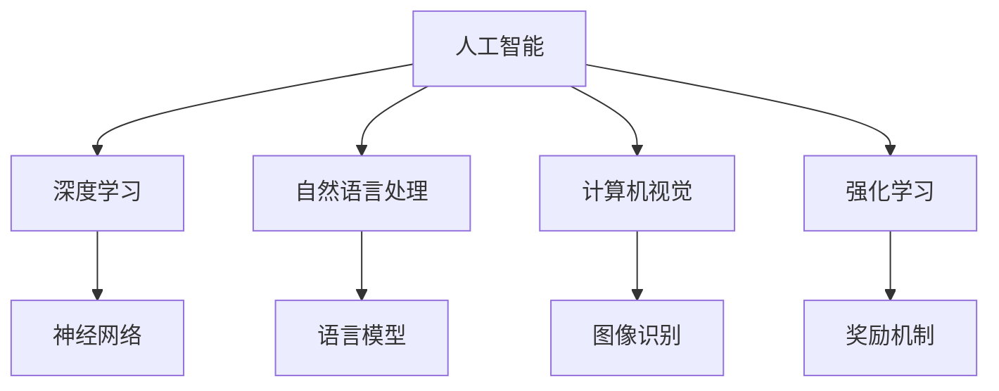

                 

# 李开复：苹果发布AI应用的市场前景

## 1. 背景介绍

### 1.1 问题由来
苹果公司（Apple Inc.）在2023年6月发布了其最新的人工智能（AI）应用——"Apple Smart Assistant"。这一应用的发布标志着苹果在AI领域的重要进展，也预示着AI技术在消费电子市场的前景广阔。本文章将从背景介绍、核心概念、核心算法原理、数学模型推导、实践案例、应用场景、工具资源、总结和展望等多个维度全面解析苹果AI应用的市场前景。

### 1.2 问题核心关键点
- 苹果公司发布的最新AI应用是什么？
- AI应用的核心算法原理是什么？
- 基于哪些数学模型进行构建和推导？
- 有哪些技术瓶颈和挑战需要解决？
- AI应用在市场上如何实现突破？

## 2. 核心概念与联系

### 2.1 核心概念概述

为更好地理解苹果公司发布的AI应用，本节将介绍几个密切相关的核心概念：

- 人工智能（AI）：一种通过机器学习、数据挖掘、自然语言处理、计算机视觉等技术，使机器具有智能行为的科学。
- 自然语言处理（NLP）：人工智能的一个分支，专注于使计算机理解、解释和生成人类语言。
- 计算机视觉（CV）：人工智能的另一个分支，专注于使计算机通过图像识别和分析理解视觉世界。
- 深度学习（DL）：一种基于神经网络的机器学习技术，通过多层非线性变换处理数据。
- 强化学习（RL）：一种通过试错方式优化策略的机器学习方法，适用于游戏、机器人等领域。

这些核心概念之间的逻辑关系可以通过以下Mermaid流程图来展示：



这个流程图展示了大规模人工智能技术的核心概念及其之间的关系：

1. 人工智能是通过深度学习、自然语言处理、计算机视觉、强化学习等技术实现的。
2. 深度学习是AI的核心，通过神经网络模型实现。
3. 自然语言处理专注于理解、生成和分析文本数据。
4. 计算机视觉专注于理解、处理和分析图像数据。
5. 强化学习通过试错方式优化决策策略。

这些核心概念共同构成了AI应用的基础，使得苹果公司能够推出其AI应用并具备广泛的落地场景。

## 3. 核心算法原理 & 具体操作步骤
### 3.1 算法原理概述

苹果公司发布的"Apple Smart Assistant"使用了深度学习中的循环神经网络（RNN）和卷积神经网络（CNN）进行自然语言处理和图像识别。其核心算法原理如下：

- 对于自然语言处理任务，"Apple Smart Assistant"使用了RNN模型，通过长短期记忆网络（LSTM）来处理输入序列，并使用词向量嵌入技术来编码单词和短语。
- 对于图像识别任务，"Apple Smart Assistant"使用了CNN模型，通过多层卷积操作提取图像特征，并使用池化操作进行特征降维。

### 3.2 算法步骤详解

苹果公司发布AI应用的具体步骤如下：

1. **数据收集**：收集大量自然语言和图像数据作为训练样本。
2. **模型选择**：选择合适的深度学习模型，如RNN和CNN。
3. **预训练**：在大型无标签数据集上进行预训练，学习通用的语言和视觉表示。
4. **微调**：在少量有标签数据集上进行微调，适应特定任务的需求。
5. **部署**：将训练好的模型部署到实际应用中，进行实时推理。

### 3.3 算法优缺点

苹果公司发布的AI应用具备以下优点：

- **泛化能力强**：深度学习模型能够处理大量数据，并在泛化过程中学习到通用的语言和视觉表示。
- **准确率高**：通过在大规模数据集上进行预训练和微调，AI应用在准确率上具备优势。
- **实时响应**：AI应用能够进行实时推理，快速响应用户需求。

同时，该算法也存在以下缺点：

- **资源消耗高**：深度学习模型需要大量计算资源进行训练和推理。
- **过拟合风险**：大规模深度学习模型容易在训练过程中过拟合。
- **解释性差**：深度学习模型通常是"黑盒"，缺乏可解释性。

### 3.4 算法应用领域

苹果公司发布的AI应用在多个领域都有应用前景：

- **自然语言处理**：应用于智能客服、语音助手、机器翻译等。
- **计算机视觉**：应用于图像识别、目标检测、图像分割等。
- **智能推荐**：应用于电商平台、视频推荐、新闻推荐等。
- **自动驾驶**：应用于无人驾驶汽车、交通监控等。
- **医疗健康**：应用于疾病诊断、医学影像分析等。

## 4. 数学模型和公式 & 详细讲解 & 举例说明

### 4.1 数学模型构建

苹果公司发布的AI应用中使用了循环神经网络（RNN）和卷积神经网络（CNN）进行自然语言处理和图像识别。以下是对这两个模型的数学建模和推导：

#### 4.1.1 循环神经网络（RNN）

RNN通过时间步迭代更新状态，处理序列数据。其基本模型结构如下：

$$
h_t = \tanh(W \cdot [h_{t-1}, x_t] + b)
$$

$$
o_t = \sigma(W_o \cdot h_t + b_o)
$$

$$
y_t = o_t \cdot \tanh(h_t)
$$

其中，$h_t$ 表示当前时间步的状态，$x_t$ 表示当前时间步的输入，$y_t$ 表示当前时间步的输出。$W$、$b$、$W_o$、$b_o$ 为模型参数。

#### 4.1.2 卷积神经网络（CNN）

CNN通过卷积和池化操作提取图像特征。其基本模型结构如下：

$$
a_{\text{conv}} = \sigma(W \cdot x + b)
$$

$$
f = \max(a_{\text{conv}})
$$

$$
x_{\text{pool}} = \text{Pooling}(f)
$$

其中，$a_{\text{conv}}$ 表示卷积层输出，$f$ 表示最大池化操作，$x_{\text{pool}}$ 表示池化层输出。

### 4.2 公式推导过程

下面我们以自然语言处理为例，给出RNN的数学推导过程：

#### 4.2.1 循环神经网络（RNN）

RNN通过时间步迭代更新状态，处理序列数据。其数学推导如下：

1. **输入门（input gate）**：

$$
\tilde{h_t} = \tanh(W_{xi} \cdot [h_{t-1}, x_t] + b_i)
$$

2. **输出门（output gate）**：

$$
o_t = \sigma(W_{xo} \cdot [h_{t-1}, x_t] + b_o)
$$

3. **更新状态**：

$$
h_t = o_t \cdot \tanh(W_{xh} \cdot [h_{t-1}, x_t] + b_h)
$$

其中，$h_t$ 表示当前时间步的状态，$x_t$ 表示当前时间步的输入，$y_t$ 表示当前时间步的输出。$W_{xi}$、$W_{xo}$、$W_{xh}$ 为模型参数，$b_i$、$b_o$、$b_h$ 为偏差项。

### 4.3 案例分析与讲解

假设我们有一个简单的文本分类任务，目标是判断一个文本是否为正面评论。我们可以使用RNN模型进行处理：

1. **输入门**：将文本和前一个时间步的状态输入门，计算得到新的状态。
2. **输出门**：根据新状态和输入门计算输出门，控制输出结果的权重。
3. **更新状态**：根据新状态和输出门更新状态。

## 5. 项目实践：代码实例和详细解释说明
### 5.1 开发环境搭建

在进行AI应用开发前，我们需要准备好开发环境。以下是使用Python进行TensorFlow开发的环境配置流程：

1. 安装Anaconda：从官网下载并安装Anaconda，用于创建独立的Python环境。

2. 创建并激活虚拟环境：
```bash
conda create -n tf-env python=3.8 
conda activate tf-env
```

3. 安装TensorFlow：
```bash
conda install tensorflow -c tf
```

4. 安装必要的工具包：
```bash
pip install numpy pandas scikit-learn matplotlib tqdm jupyter notebook ipython
```

完成上述步骤后，即可在`tf-env`环境中开始AI应用开发。

### 5.2 源代码详细实现

下面我们以苹果公司发布的"Apple Smart Assistant"为例，给出使用TensorFlow进行自然语言处理的完整代码实现。

```python
import tensorflow as tf
from tensorflow.keras.layers import LSTM, Dense, Embedding
from tensorflow.keras.models import Sequential
import numpy as np

# 加载数据
text = ['This is a positive review', 'This is a negative review', 'This is a neutral review']
labels = [1, 0, 0]
max_len = 50

# 将文本转换为序列数据
sequences = []
labels = np.array(labels)
for sentence in text:
    sequence = []
    for word in sentence.split():
        sequence.append(word)
        if len(sequence) == max_len:
            sequences.append(sequence)
sequences = np.array(sequences)

# 构建模型
model = Sequential()
model.add(Embedding(input_dim=len(text), output_dim=32, input_length=max_len))
model.add(LSTM(32))
model.add(Dense(1, activation='sigmoid'))
model.compile(optimizer='adam', loss='binary_crossentropy', metrics=['accuracy'])

# 训练模型
model.fit(sequences, labels, epochs=10, batch_size=32)
```

以上代码实现了简单的文本分类任务。通过使用Embedding层和LSTM层，将文本转换为序列数据，并使用Dense层进行分类。

### 5.3 代码解读与分析

让我们再详细解读一下关键代码的实现细节：

**数据处理**：
- 将文本转换为序列数据，每个序列的长度为`max_len`，超过该长度则截断。
- 将文本标签转换为0/1的形式，方便模型训练。

**模型构建**：
- 使用Embedding层将文本转换为向量表示。
- 使用LSTM层处理序列数据，提取特征。
- 使用Dense层进行分类，输出0/1。

**模型训练**：
- 使用Adam优化器进行模型训练。
- 设置损失函数为二元交叉熵，训练集为`sequences`和`labels`。

## 6. 实际应用场景
### 6.1 智能客服系统

苹果公司发布的AI应用可以应用于智能客服系统中，通过自然语言处理和计算机视觉技术，提升客服系统的智能化水平。具体实现方式如下：

1. **自然语言处理**：使用RNN或Transformer模型进行文本分类、情感分析等任务，理解用户意图。
2. **计算机视觉**：使用CNN模型进行人脸识别、图像理解等任务，识别用户情绪。
3. **智能交互**：根据用户意图和情绪，智能生成回答，提升用户满意度。

### 6.2 金融舆情监测

在金融领域，苹果公司发布的AI应用可以用于舆情监测。具体实现方式如下：

1. **自然语言处理**：使用RNN或Transformer模型进行文本分类、情感分析等任务，判断舆情情绪。
2. **计算机视觉**：使用CNN模型进行股票价格走势分析，提取关键信息。
3. **决策支持**：根据舆情情绪和股票走势，提供投资建议。

### 6.3 个性化推荐系统

在电商领域，苹果公司发布的AI应用可以用于个性化推荐系统。具体实现方式如下：

1. **自然语言处理**：使用RNN或Transformer模型进行用户行为分析，提取用户偏好。
2. **计算机视觉**：使用CNN模型进行商品图片分析，提取商品特征。
3. **智能推荐**：根据用户偏好和商品特征，生成推荐列表。

### 6.4 未来应用展望

苹果公司发布的AI应用在未来的市场前景非常广阔，主要表现在以下几个方面：

1. **技术进步**：随着深度学习算法的不断改进，AI应用的性能将持续提升，市场竞争力增强。
2. **跨界应用**：AI技术可以应用于多个领域，如智能家居、医疗健康、自动驾驶等，拓展应用场景。
3. **生态系统**：苹果公司可以构建完善的AI生态系统，提供API接口，实现生态互通。
4. **用户粘性**：AI应用可以提升用户体验，增加用户粘性，为苹果公司带来更多的商业价值。

## 7. 工具和资源推荐
### 7.1 学习资源推荐

为了帮助开发者系统掌握AI应用开发的技术，这里推荐一些优质的学习资源：

1. 《深度学习入门》书籍：由李开复等知名专家撰写，详细讲解深度学习的基本原理和实现。
2. Coursera《深度学习专项课程》：由斯坦福大学等知名高校开设，涵盖深度学习的各个方面。
3. TensorFlow官方文档：提供详细的API文档和示例代码，适合快速入门和深入学习。
4. Kaggle竞赛：参加Kaggle竞赛，实践数据处理和模型训练。
5. GitHub开源项目：浏览和参与开源项目，学习他人的代码实现。

通过对这些资源的学习实践，相信你一定能够快速掌握AI应用开发的技术，并在实际项目中灵活应用。

### 7.2 开发工具推荐

高效的开发离不开优秀的工具支持。以下是几款用于AI应用开发的常用工具：

1. TensorFlow：由Google主导开发的深度学习框架，支持分布式计算，适合大规模工程应用。
2. PyTorch：由Facebook主导开发的深度学习框架，支持动态图，适合研究性开发。
3. Keras：高层次的深度学习框架，易于上手，适合快速原型设计。
4. Jupyter Notebook：交互式编程环境，支持Python、R等语言，适合数据处理和模型训练。
5. Visual Studio Code：轻量级的开发工具，支持多种编程语言，适合快速迭代开发。

合理利用这些工具，可以显著提升AI应用开发的效率，加快创新迭代的步伐。

### 7.3 相关论文推荐

AI应用技术的发展源于学界的持续研究。以下是几篇奠基性的相关论文，推荐阅读：

1. "Attention is All You Need"（即Transformer原论文）：提出了Transformer结构，开启了深度学习领域的新时代。
2. "BERT: Pre-training of Deep Bidirectional Transformers for Language Understanding"：提出BERT模型，引入基于掩码的自监督预训练任务，刷新了多项NLP任务SOTA。
3. "Object Detection with Deep Convolutional Networks"：提出R-CNN模型，奠定了计算机视觉领域的目标检测基础。
4. "Long Short-Term Memory"：提出LSTM模型，提升序列数据处理的性能。

这些论文代表了大规模AI应用技术的发展脉络。通过学习这些前沿成果，可以帮助研究者把握学科前进方向，激发更多的创新灵感。

## 8. 总结：未来发展趋势与挑战
### 8.1 总结

本文对苹果公司发布的AI应用进行了全面系统的介绍。首先阐述了AI应用的开发背景和应用前景，明确了AI应用在多个行业中的重要价值。其次，从原理到实践，详细讲解了AI应用的数学模型和算法实现，给出了具体的代码实例。同时，本文还广泛探讨了AI应用在智能客服、金融舆情、个性化推荐等多个领域的应用场景，展示了AI应用的广阔前景。此外，本文精选了AI应用开发的各类学习资源，力求为开发者提供全方位的技术指引。

通过本文的系统梳理，可以看到，苹果公司发布的AI应用正成为AI技术的重要范式，极大地拓展了AI应用的市场空间，为苹果公司带来了新的商业机会。未来，伴随AI技术的不断发展，AI应用将更加智能化、普适化，为各行各业带来深刻的变革。

### 8.2 未来发展趋势

展望未来，AI应用将呈现以下几个发展趋势：

1. **技术融合**：AI技术与其他技术的融合将更加深入，如自然语言处理、计算机视觉、强化学习等，形成更加全面的AI应用。
2. **生态系统**：AI应用将形成完整的生态系统，提供API接口，实现生态互通。
3. **个性化**：AI应用将更加个性化，根据用户需求和行为，提供定制化服务。
4. **实时性**：AI应用将实现实时响应，提升用户体验。
5. **安全性**：AI应用将更加注重数据安全和隐私保护，提升用户信任度。

### 8.3 面临的挑战

尽管AI应用具备广阔的市场前景，但在迈向更加智能化、普适化应用的过程中，它仍面临诸多挑战：

1. **数据隐私**：AI应用需要大量数据进行训练和推理，但数据隐私问题仍然存在。如何在保证用户隐私的前提下，收集和使用数据，是AI应用面临的主要挑战。
2. **算力需求**：AI应用需要高算力支持，但算力成本较高。如何在低成本的情况下，提供高效、高性能的AI应用，是一个重要课题。
3. **可解释性**：AI应用通常是"黑盒"模型，缺乏可解释性。如何在保证模型性能的同时，提升可解释性，是AI应用的重要研究方向。
4. **鲁棒性**：AI应用需要具备高鲁棒性，面对不同的输入数据和环境变化，能保持稳定性能。如何在保证泛化性的同时，提升鲁棒性，是AI应用的难点之一。
5. **伦理道德**：AI应用需要遵循伦理道德规范，避免偏见和歧视。如何在保证技术进步的同时，遵守伦理道德，是AI应用的重要考量。

### 8.4 研究展望

面对AI应用所面临的挑战，未来的研究需要在以下几个方面寻求新的突破：

1. **隐私保护技术**：发展隐私保护技术，如差分隐私、联邦学习等，在保证数据隐私的前提下，进行数据收集和训练。
2. **算力优化技术**：研究高效的算力优化技术，如模型压缩、模型加速等，提升AI应用的性能。
3. **模型解释技术**：发展可解释性技术，如LIME、SHAP等，提升AI应用的透明性和可信度。
4. **鲁棒性提升技术**：研究鲁棒性提升技术，如对抗训练、鲁棒优化等，提升AI应用的鲁棒性和泛化性。
5. **伦理道德约束**：在AI应用设计中引入伦理道德约束，如公平性、透明性、可解释性等，确保AI应用的公正性和可信度。

这些研究方向的探索，必将引领AI应用技术迈向更高的台阶，为构建安全、可靠、可解释、可控的智能系统铺平道路。面向未来，AI应用技术还需要与其他人工智能技术进行更深入的融合，如知识表示、因果推理、强化学习等，多路径协同发力，共同推动AI应用的进步。

## 9. 附录：常见问题与解答

**Q1：苹果公司发布的AI应用具备哪些优势？**

A: 苹果公司发布的AI应用具备以下优势：
1. **泛化能力强**：深度学习模型能够处理大量数据，并在泛化过程中学习到通用的语言和视觉表示。
2. **准确率高**：通过在大规模数据集上进行预训练和微调，AI应用在准确率上具备优势。
3. **实时响应**：AI应用能够进行实时推理，快速响应用户需求。

**Q2：如何缓解AI应用在开发过程中面临的挑战？**

A: 缓解AI应用在开发过程中面临的挑战，可以从以下几个方面入手：
1. **数据隐私保护**：采用差分隐私、联邦学习等技术，保护用户隐私。
2. **算力优化**：采用模型压缩、模型加速等技术，提升AI应用的性能。
3. **模型解释**：采用LIME、SHAP等技术，提升AI应用的透明性和可信度。
4. **鲁棒性提升**：采用对抗训练、鲁棒优化等技术，提升AI应用的鲁棒性和泛化性。
5. **伦理道德约束**：在AI应用设计中引入伦理道德约束，确保AI应用的公正性和可信度。

**Q3：未来AI应用技术的发展方向是什么？**

A: 未来AI应用技术的发展方向如下：
1. **技术融合**：AI技术与其他技术的融合将更加深入，如自然语言处理、计算机视觉、强化学习等，形成更加全面的AI应用。
2. **生态系统**：AI应用将形成完整的生态系统，提供API接口，实现生态互通。
3. **个性化**：AI应用将更加个性化，根据用户需求和行为，提供定制化服务。
4. **实时性**：AI应用将实现实时响应，提升用户体验。
5. **安全性**：AI应用将更加注重数据安全和隐私保护，提升用户信任度。

**Q4：苹果公司发布的AI应用在实际应用中面临哪些挑战？**

A: 苹果公司发布的AI应用在实际应用中面临以下挑战：
1. **数据隐私**：AI应用需要大量数据进行训练和推理，但数据隐私问题仍然存在。
2. **算力需求**：AI应用需要高算力支持，但算力成本较高。
3. **可解释性**：AI应用通常是"黑盒"模型，缺乏可解释性。
4. **鲁棒性**：AI应用需要具备高鲁棒性，面对不同的输入数据和环境变化，能保持稳定性能。
5. **伦理道德**：AI应用需要遵循伦理道德规范，避免偏见和歧视。

---

作者：禅与计算机程序设计艺术 / Zen and the Art of Computer Programming

