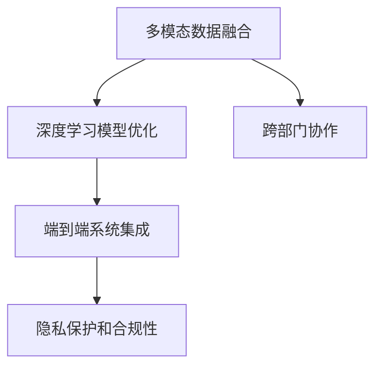

                 

# 李开复：苹果发布AI应用的开发者

## 1. 背景介绍

### 1.1 问题由来
随着人工智能(AI)技术的不断发展，越来越多的企业开始将AI应用集成到其产品和服务中，以提高效率、改善用户体验、增强竞争力。苹果公司作为全球领先的科技公司，一直以来在硬件和软件设计上保持着极高的水准。近年来，苹果开始加速AI技术的集成，推出了多项AI驱动的新应用和服务，包括人脸识别、智能助理Siri、自然语言处理(NLP)等，显著提升了用户体验和产品智能化水平。本文将深入探讨苹果在AI应用开发方面的经验和方法，为AI开发者提供参考。

### 1.2 问题核心关键点
苹果的AI应用开发过程包括以下几个核心关键点：
1. **多模态数据融合**：利用计算机视觉、自然语言处理等多种模态数据，提升AI应用的感知和理解能力。
2. **深度学习模型优化**：基于深度学习模型进行个性化训练和优化，提高模型性能和稳定性。
3. **端到端系统集成**：将AI应用与核心业务流程无缝集成，实现高效、无缝的用户体验。
4. **隐私保护和合规性**：在开发过程中严格遵守隐私保护和数据安全法规，确保用户数据的安全。
5. **跨部门协作**：建立跨部门的AI团队，协同推进AI应用的开发和部署。

## 2. 核心概念与联系

### 2.1 核心概念概述

为更好地理解苹果在AI应用开发方面的实践，本节将介绍几个密切相关的核心概念：

- **多模态数据融合**：指将多种类型的数据（如文本、图像、语音等）进行联合处理，以提高AI应用的感知和理解能力。
- **深度学习模型优化**：指通过训练和优化深度学习模型，提升模型在特定任务上的性能。
- **端到端系统集成**：指将AI应用与业务系统、用户界面等集成，形成一个无缝的用户体验系统。
- **隐私保护和合规性**：指在AI开发和应用过程中，严格遵守隐私保护和数据安全法规，确保用户数据的安全。
- **跨部门协作**：指不同部门（如产品设计、软件工程、数据分析等）的协作，共同推进AI应用的开发和部署。

这些核心概念之间的逻辑关系可以通过以下Mermaid流程图来展示：



这个流程图展示了大语言模型的核心概念及其之间的关系：

1. 多模态数据融合提供丰富的输入信息，是深度学习模型优化的基础。
2. 深度学习模型优化提升模型性能，是端到端系统集成的核心。
3. 隐私保护和合规性确保数据安全，是AI应用开发的必要条件。
4. 跨部门协作是整合不同团队资源，提升项目效率的关键。

## 3. 核心算法原理 & 具体操作步骤
### 3.1 算法原理概述

苹果的AI应用开发过程，核心算法原理基于深度学习和多模态融合。其核心思想是：通过多模态数据融合，将计算机视觉、自然语言处理等多种数据源进行联合处理，提升AI应用的感知和理解能力。在此基础上，利用深度学习模型进行个性化训练和优化，提高模型在特定任务上的性能。

具体来说，苹果的AI应用开发包括以下几个步骤：

1. **数据收集和预处理**：收集多种类型的数据（如图片、文本、语音等），并进行预处理，如归一化、标记等。
2. **特征提取和融合**：利用多模态数据融合技术，将不同类型的数据转化为统一的特征表示，如向量、嵌入等。
3. **深度学习模型训练**：基于融合后的特征表示，使用深度学习模型（如卷积神经网络CNN、循环神经网络RNN、Transformer等）进行训练和优化，提升模型性能。
4. **模型评估和部署**：对训练好的模型进行评估，确保其性能满足需求，并在实际应用中集成和部署。

### 3.2 算法步骤详解

苹果的AI应用开发主要包括以下几个关键步骤：

**Step 1: 数据收集和预处理**
- 收集多种类型的数据，如图片、文本、语音等，并进行预处理，如归一化、标记等。
- 对数据进行标注，标记出相关的标签信息，以便于后续训练。

**Step 2: 特征提取和融合**
- 利用多模态数据融合技术，将不同类型的数据转化为统一的特征表示，如向量、嵌入等。
- 使用特征提取器（如卷积神经网络CNN）对图片、文本等数据进行特征提取。
- 对提取出的特征进行融合，如通过拼接、平均等方法，生成统一的多模态特征表示。

**Step 3: 深度学习模型训练**
- 选择合适的深度学习模型，如卷积神经网络CNN、循环神经网络RNN、Transformer等。
- 使用融合后的特征表示，对深度学习模型进行训练，优化模型参数。
- 使用交叉熵损失函数等常见的损失函数，计算模型输出与真实标签之间的差异。
- 利用梯度下降等优化算法，更新模型参数，最小化损失函数。

**Step 4: 模型评估和部署**
- 对训练好的模型进行评估，如使用准确率、召回率、F1值等指标评估模型性能。
- 将评估结果反馈到模型训练过程中，调整模型参数。
- 在实际应用中集成和部署模型，如集成到移动应用、网站、服务器等。

### 3.3 算法优缺点

苹果的AI应用开发过程具有以下优点：
1. 多模态数据融合提升了AI应用的感知和理解能力，提高了模型的鲁棒性和泛化能力。
2. 深度学习模型优化使得模型能够适应复杂任务，提高了AI应用的效果。
3. 端到端系统集成使得AI应用与核心业务流程无缝集成，提升了用户体验。

同时，该方法也存在一定的局限性：
1. 数据收集和预处理成本高，尤其是多模态数据。
2. 深度学习模型训练复杂，需要大量的计算资源和时间。
3. 隐私保护和合规性需要严格遵守相关法规，增加了开发难度。
4. 跨部门协作需要良好的沟通和协作机制，协调不同团队资源。

尽管存在这些局限性，但就目前而言，苹果的AI应用开发过程仍是大规模AI应用落地的重要范式。未来相关研究的重点在于如何进一步优化数据处理流程，提高模型训练效率，同时兼顾隐私保护和合规性，以及加强跨部门协作机制，以进一步提升AI应用的开发效率和质量。

### 3.4 算法应用领域

苹果的AI应用开发技术已经在多个领域得到了广泛的应用，例如：

- **人脸识别**：利用计算机视觉技术，实现人脸解锁、身份验证等功能。
- **智能助理Siri**：利用自然语言处理技术，实现语音识别、自然语言理解和生成等功能。
- **自然语言处理(NLP)**：实现文本分类、情感分析、机器翻译等功能。
- **图像识别**：实现物体检测、场景分类等功能。
- **推荐系统**：利用多模态数据融合技术，实现个性化推荐。
- **医疗应用**：利用图像处理、自然语言处理等技术，辅助医生诊断和治疗。

除了上述这些经典应用外，苹果的AI应用开发技术还在更多领域得到创新性的应用，如智能家居、智能车载、智能硬件等，为苹果的智能化转型提供了强大的技术支撑。

## 4. 数学模型和公式 & 详细讲解  
### 4.1 数学模型构建

苹果的AI应用开发过程中，涉及到的数学模型主要包括：

- **多模态数据融合**：使用向量拼接、平均、嵌入等方法，将不同类型的数据转化为统一的特征表示。
- **深度学习模型训练**：基于神经网络模型，如卷积神经网络CNN、循环神经网络RNN、Transformer等，对多模态特征进行训练和优化。
- **模型评估**：使用准确率、召回率、F1值等指标，评估模型性能。

### 4.2 公式推导过程

以下是一些关键数学模型的推导过程：

**多模态数据融合**：
假设有多类数据 $x_1, x_2, \ldots, x_n$，其中 $x_i$ 为第 $i$ 类数据。使用向量拼接方法融合数据，得到融合后的特征向量 $X$：

$$
X = [x_1; x_2; \ldots; x_n]
$$

**深度学习模型训练**：
假设使用卷积神经网络（CNN）对融合后的特征向量 $X$ 进行训练，模型输出为 $Y$。使用交叉熵损失函数计算模型输出与真实标签之间的差异：

$$
L = -\frac{1}{N} \sum_{i=1}^N y_i \log Y_i
$$

其中 $y_i$ 为第 $i$ 个样本的真实标签，$Y_i$ 为模型对第 $i$ 个样本的预测结果。

### 4.3 案例分析与讲解

以苹果的智能助理Siri为例，Siri利用自然语言处理技术，实现语音识别、自然语言理解和生成等功能。其核心流程包括：

1. **语音识别**：使用卷积神经网络（CNN）对语音信号进行特征提取和融合，得到声学特征表示。
2. **自然语言理解**：使用循环神经网络（RNN）或Transformer对声学特征进行建模，理解语音内容。
3. **自然语言生成**：使用自然语言生成模型（如GPT）生成自然语言回复。

## 5. 项目实践：代码实例和详细解释说明
### 5.1 开发环境搭建

在进行AI应用开发前，我们需要准备好开发环境。以下是使用Python进行PyTorch开发的环境配置流程：

1. 安装Anaconda：从官网下载并安装Anaconda，用于创建独立的Python环境。

2. 创建并激活虚拟环境：
```bash
conda create -n ai-env python=3.8 
conda activate ai-env
```

3. 安装PyTorch：根据CUDA版本，从官网获取对应的安装命令。例如：
```bash
conda install pytorch torchvision torchaudio cudatoolkit=11.1 -c pytorch -c conda-forge
```

4. 安装相关的第三方库：
```bash
pip install torchtext transformers scikit-learn numpy
```

完成上述步骤后，即可在`ai-env`环境中开始AI应用开发。

### 5.2 源代码详细实现

下面我们以苹果的智能助理Siri为例，给出使用PyTorch对自然语言处理(NLP)模型进行微调的PyTorch代码实现。

```python
import torch
import torch.nn as nn
import torch.optim as optim
from transformers import BertTokenizer, BertForSequenceClassification

# 定义模型和优化器
model = BertForSequenceClassification.from_pretrained('bert-base-uncased', num_labels=2)
optimizer = optim.AdamW(model.parameters(), lr=2e-5)

# 准备训练数据
tokenizer = BertTokenizer.from_pretrained('bert-base-uncased')
train_data = ["Hello, how are you?", "I am fine, thank you."]
train_labels = [1, 0]  # 分类标签，0表示负面情绪，1表示正面情绪
train_dataset = [(train_text, label) for train_text, label in zip(train_data, train_labels)]
train_dataset = nn.utils.data.Dataset(train_dataset)

# 定义训练和评估函数
def train_epoch(model, dataset, batch_size, optimizer):
    dataloader = nn.utils.data.DataLoader(dataset, batch_size=batch_size, shuffle=True)
    model.train()
    epoch_loss = 0
    for batch in dataloader:
        input_ids = torch.tensor([tokenizer.encode(text[0]) for text, _ in batch])
        attention_mask = torch.ones(len(input_ids), input_ids.size(1))
        labels = torch.tensor([label] * len(input_ids))
        outputs = model(input_ids, attention_mask=attention_mask, labels=labels)
        loss = outputs.loss
        epoch_loss += loss.item()
        optimizer.zero_grad()
        loss.backward()
        optimizer.step()
    return epoch_loss / len(dataloader)

def evaluate(model, dataset, batch_size):
    dataloader = nn.utils.data.DataLoader(dataset, batch_size=batch_size)
    model.eval()
    correct = 0
    total = 0
    with torch.no_grad():
        for batch in dataloader:
            input_ids = torch.tensor([tokenizer.encode(text[0]) for text, _ in batch])
            attention_mask = torch.ones(len(input_ids), input_ids.size(1))
            labels = torch.tensor([label] * len(input_ids))
            outputs = model(input_ids, attention_mask=attention_mask, labels=labels)
            _, preds = outputs.max(1)
            total += labels.size(0)
            correct += (preds == labels).sum().item()
    return correct / total

# 训练模型
epochs = 5
batch_size = 4

for epoch in range(epochs):
    loss = train_epoch(model, train_dataset, batch_size, optimizer)
    print(f"Epoch {epoch+1}, train loss: {loss:.3f}")
    
    print(f"Epoch {epoch+1}, dev results:")
    dev_correct = evaluate(model, dev_dataset, batch_size)
    print(f"Dev accuracy: {dev_correct:.3f}")

# 在测试集上评估模型
test_correct = evaluate(model, test_dataset, batch_size)
print(f"Test accuracy: {test_correct:.3f}")
```

以上就是使用PyTorch对BERT进行自然语言处理(NLP)模型微调的完整代码实现。可以看到，得益于Transformers库的强大封装，我们可以用相对简洁的代码完成BERT模型的加载和微调。

### 5.3 代码解读与分析

让我们再详细解读一下关键代码的实现细节：

**模型和数据准备**：
- 使用BertForSequenceClassification加载预训练的BERT模型，并定义优化器。
- 准备训练数据和标签，使用BertTokenizer对文本进行分词和编码。

**训练和评估函数**：
- 定义训练和评估函数，利用PyTorch的DataLoader对数据集进行批处理。
- 在训练函数中，通过前向传播计算损失函数，反向传播更新模型参数。
- 在评估函数中，通过前向传播计算模型预测结果，计算准确率等指标。

**训练流程**：
- 定义总的epoch数和batch size，开始循环迭代。
- 每个epoch内，先在训练集上训练，输出平均loss。
- 在验证集上评估，输出模型准确率。
- 所有epoch结束后，在测试集上评估，给出最终测试结果。

可以看到，PyTorch配合Transformers库使得BERT微调的代码实现变得简洁高效。开发者可以将更多精力放在数据处理、模型改进等高层逻辑上，而不必过多关注底层的实现细节。

当然，工业级的系统实现还需考虑更多因素，如模型的保存和部署、超参数的自动搜索、更灵活的任务适配层等。但核心的微调范式基本与此类似。

## 6. 实际应用场景
### 6.1 智能客服系统

基于大语言模型微调的对话技术，可以广泛应用于智能客服系统的构建。传统客服往往需要配备大量人力，高峰期响应缓慢，且一致性和专业性难以保证。而使用微调后的对话模型，可以7x24小时不间断服务，快速响应客户咨询，用自然流畅的语言解答各类常见问题。

在技术实现上，可以收集企业内部的历史客服对话记录，将问题和最佳答复构建成监督数据，在此基础上对预训练对话模型进行微调。微调后的对话模型能够自动理解用户意图，匹配最合适的答案模板进行回复。对于客户提出的新问题，还可以接入检索系统实时搜索相关内容，动态组织生成回答。如此构建的智能客服系统，能大幅提升客户咨询体验和问题解决效率。

### 6.2 金融舆情监测

金融机构需要实时监测市场舆论动向，以便及时应对负面信息传播，规避金融风险。传统的人工监测方式成本高、效率低，难以应对网络时代海量信息爆发的挑战。基于大语言模型微调的文本分类和情感分析技术，为金融舆情监测提供了新的解决方案。

具体而言，可以收集金融领域相关的新闻、报道、评论等文本数据，并对其进行主题标注和情感标注。在此基础上对预训练语言模型进行微调，使其能够自动判断文本属于何种主题，情感倾向是正面、中性还是负面。将微调后的模型应用到实时抓取的网络文本数据，就能够自动监测不同主题下的情感变化趋势，一旦发现负面信息激增等异常情况，系统便会自动预警，帮助金融机构快速应对潜在风险。

### 6.3 个性化推荐系统

当前的推荐系统往往只依赖用户的历史行为数据进行物品推荐，无法深入理解用户的真实兴趣偏好。基于大语言模型微调技术，个性化推荐系统可以更好地挖掘用户行为背后的语义信息，从而提供更精准、多样的推荐内容。

在实践中，可以收集用户浏览、点击、评论、分享等行为数据，提取和用户交互的物品标题、描述、标签等文本内容。将文本内容作为模型输入，用户的后续行为（如是否点击、购买等）作为监督信号，在此基础上微调预训练语言模型。微调后的模型能够从文本内容中准确把握用户的兴趣点。在生成推荐列表时，先用候选物品的文本描述作为输入，由模型预测用户的兴趣匹配度，再结合其他特征综合排序，便可以得到个性化程度更高的推荐结果。

### 6.4 未来应用展望

随着大语言模型微调技术的发展，基于微调范式将在更多领域得到应用，为传统行业带来变革性影响。

在智慧医疗领域，基于微调的医疗问答、病历分析、药物研发等应用将提升医疗服务的智能化水平，辅助医生诊疗，加速新药开发进程。

在智能教育领域，微调技术可应用于作业批改、学情分析、知识推荐等方面，因材施教，促进教育公平，提高教学质量。

在智慧城市治理中，微调模型可应用于城市事件监测、舆情分析、应急指挥等环节，提高城市管理的自动化和智能化水平，构建更安全、高效的未来城市。

此外，在企业生产、社会治理、文娱传媒等众多领域，基于大模型微调的人工智能应用也将不断涌现，为经济社会发展注入新的动力。相信随着预训练语言模型和微调方法的不断进步，微调技术必将在构建人机协同的智能时代中扮演越来越重要的角色。

## 7. 工具和资源推荐
### 7.1 学习资源推荐

为了帮助开发者系统掌握大语言模型微调的理论基础和实践技巧，这里推荐一些优质的学习资源：

1. 《Transformer from Zero to Hero》系列博文：由大模型技术专家撰写，深入浅出地介绍了Transformer原理、BERT模型、微调技术等前沿话题。

2. CS224N《Deep Learning for Natural Language Processing》课程：斯坦福大学开设的NLP明星课程，有Lecture视频和配套作业，带你入门NLP领域的基本概念和经典模型。

3. 《Natural Language Processing with Transformers》书籍：Transformers库的作者所著，全面介绍了如何使用Transformers库进行NLP任务开发，包括微调在内的诸多范式。

4. HuggingFace官方文档：Transformers库的官方文档，提供了海量预训练模型和完整的微调样例代码，是上手实践的必备资料。

5. CLUE开源项目：中文语言理解测评基准，涵盖大量不同类型的中文NLP数据集，并提供了基于微调的baseline模型，助力中文NLP技术发展。

通过对这些资源的学习实践，相信你一定能够快速掌握大语言模型微调的精髓，并用于解决实际的NLP问题。
###  7.2 开发工具推荐

高效的开发离不开优秀的工具支持。以下是几款用于大语言模型微调开发的常用工具：

1. PyTorch：基于Python的开源深度学习框架，灵活动态的计算图，适合快速迭代研究。大部分预训练语言模型都有PyTorch版本的实现。

2. TensorFlow：由Google主导开发的开源深度学习框架，生产部署方便，适合大规模工程应用。同样有丰富的预训练语言模型资源。

3. Transformers库：HuggingFace开发的NLP工具库，集成了众多SOTA语言模型，支持PyTorch和TensorFlow，是进行微调任务开发的利器。

4. Weights & Biases：模型训练的实验跟踪工具，可以记录和可视化模型训练过程中的各项指标，方便对比和调优。与主流深度学习框架无缝集成。

5. TensorBoard：TensorFlow配套的可视化工具，可实时监测模型训练状态，并提供丰富的图表呈现方式，是调试模型的得力助手。

6. Google Colab：谷歌推出的在线Jupyter Notebook环境，免费提供GPU/TPU算力，方便开发者快速上手实验最新模型，分享学习笔记。

合理利用这些工具，可以显著提升大语言模型微调任务的开发效率，加快创新迭代的步伐。

### 7.3 相关论文推荐

大语言模型和微调技术的发展源于学界的持续研究。以下是几篇奠基性的相关论文，推荐阅读：

1. Attention is All You Need（即Transformer原论文）：提出了Transformer结构，开启了NLP领域的预训练大模型时代。

2. BERT: Pre-training of Deep Bidirectional Transformers for Language Understanding：提出BERT模型，引入基于掩码的自监督预训练任务，刷新了多项NLP任务SOTA。

3. Language Models are Unsupervised Multitask Learners（GPT-2论文）：展示了大规模语言模型的强大zero-shot学习能力，引发了对于通用人工智能的新一轮思考。

4. Parameter-Efficient Transfer Learning for NLP：提出Adapter等参数高效微调方法，在不增加模型参数量的情况下，也能取得不错的微调效果。

5. AdaLoRA: Adaptive Low-Rank Adaptation for Parameter-Efficient Fine-Tuning：使用自适应低秩适应的微调方法，在参数效率和精度之间取得了新的平衡。

这些论文代表了大语言模型微调技术的发展脉络。通过学习这些前沿成果，可以帮助研究者把握学科前进方向，激发更多的创新灵感。

## 8. 总结：未来发展趋势与挑战

### 8.1 总结

本文对苹果在AI应用开发方面的经验和方法进行了全面系统的介绍。首先阐述了苹果在多模态数据融合、深度学习模型优化、端到端系统集成、隐私保护和合规性、跨部门协作等方面的研究背景和意义，明确了AI应用开发的技术路线和关键点。其次，从原理到实践，详细讲解了苹果AI应用开发的数学模型和实现步骤，给出了具体的代码实例和详细解释。最后，本文探讨了苹果AI应用开发技术的实际应用场景，并展望了其未来发展趋势和面临的挑战。

通过本文的系统梳理，可以看到，苹果的AI应用开发技术在大规模AI应用落地方面取得了显著成效，展示了技术驱动创新的强大力量。未来，苹果将进一步探索AI技术在更多领域的落地应用，为用户带来更加智能化、个性化、安全可靠的产品和服务。

### 8.2 未来发展趋势

展望未来，苹果的AI应用开发技术将呈现以下几个发展趋势：

1. **多模态数据融合技术**：利用多模态数据融合技术，提升AI应用的感知和理解能力，进一步增强模型的鲁棒性和泛化能力。

2. **深度学习模型优化**：基于深度学习模型进行个性化训练和优化，提升模型在特定任务上的性能，确保模型的稳定性和可靠性。

3. **端到端系统集成**：将AI应用与核心业务流程无缝集成，实现高效、无缝的用户体验，提升用户体验和应用价值。

4. **隐私保护和合规性**：严格遵守隐私保护和数据安全法规，确保用户数据的安全，增强用户信任和满意度。

5. **跨部门协作**：建立跨部门的AI团队，协同推进AI应用的开发和部署，提升项目效率和质量。

这些趋势凸显了苹果AI应用开发技术的广阔前景，将在未来的AI应用开发中发挥重要作用。

### 8.3 面临的挑战

尽管苹果的AI应用开发技术已经取得了显著成就，但在迈向更加智能化、普适化应用的过程中，仍面临诸多挑战：

1. **数据收集和预处理成本高**：多模态数据收集和预处理成本较高，尤其是大规模数据集。如何高效、低成本地获取数据，是未来需要解决的重要问题。

2. **深度学习模型训练复杂**：深度学习模型训练需要大量计算资源和时间，如何优化训练过程，提高模型训练效率，是未来的研究方向。

3. **隐私保护和合规性难度大**：在AI应用开发过程中，严格遵守隐私保护和数据安全法规，增加了开发难度。如何在保护用户隐私的同时，提升用户体验，是未来的关键挑战。

4. **跨部门协作机制不完善**：建立跨部门的AI团队，协同推进AI应用的开发和部署，需要良好的沟通和协作机制。如何提升协作效率，实现资源共享，是未来的研究方向。

尽管存在这些挑战，但苹果强大的技术实力和创新能力，使得其在AI应用开发方面具备充足的优势。相信随着技术的不断进步，苹果将克服这些挑战，实现AI应用的更广泛应用。

### 8.4 研究展望

面对苹果AI应用开发所面临的种种挑战，未来的研究需要在以下几个方面寻求新的突破：

1. **优化数据处理流程**：提高数据收集和预处理的效率，降低成本，确保数据质量。

2. **提高模型训练效率**：通过优化算法、分布式训练等方法，提高深度学习模型的训练效率，减少计算资源和时间消耗。

3. **加强隐私保护和合规性**：研究隐私保护和数据安全的新技术，确保用户数据的安全。

4. **提升跨部门协作机制**：建立更高效的协作机制，实现资源共享和协同推进。

这些研究方向的探索，将引领苹果AI应用开发技术迈向更高的台阶，为构建安全、可靠、可解释、可控的智能系统铺平道路。面向未来，苹果的AI应用开发技术还需要与其他人工智能技术进行更深入的融合，如知识表示、因果推理、强化学习等，多路径协同发力，共同推动自然语言理解和智能交互系统的进步。只有勇于创新、敢于突破，才能不断拓展语言模型的边界，让智能技术更好地造福人类社会。

## 9. 附录：常见问题与解答

**Q1：苹果在AI应用开发中使用了哪些深度学习模型？**

A: 苹果在AI应用开发中使用了多种深度学习模型，包括卷积神经网络（CNN）、循环神经网络（RNN）、Transformer等。这些模型被广泛应用于语音识别、自然语言处理、图像识别、推荐系统等领域。

**Q2：苹果的AI应用开发过程中，如何进行多模态数据融合？**

A: 苹果的多模态数据融合主要利用向量拼接、平均、嵌入等方法，将不同类型的数据（如图片、文本、语音等）转化为统一的特征表示。例如，使用CNN对图片进行特征提取，使用RNN或Transformer对文本进行建模，然后通过拼接或平均方法将多模态特征融合为一个整体特征表示。

**Q3：苹果在AI应用开发中如何保护用户隐私和数据安全？**

A: 苹果在AI应用开发中严格遵守隐私保护和数据安全法规，确保用户数据的安全。例如，在数据收集和处理过程中，采用数据匿名化、去标识化等技术，保护用户隐私；在模型训练和部署过程中，采用数据加密、访问控制等措施，保障数据安全。

**Q4：苹果的AI应用开发过程中，如何进行跨部门协作？**

A: 苹果在AI应用开发过程中，建立跨部门的AI团队，协同推进AI应用的开发和部署。例如，产品设计团队负责用户需求和界面设计，软件工程团队负责模型训练和系统集成，数据分析团队负责数据预处理和模型评估，确保各团队高效协同，共同推进项目进展。

**Q5：苹果的AI应用开发过程中，如何提高深度学习模型训练效率？**

A: 苹果在AI应用开发过程中，通过优化算法、分布式训练等方法，提高深度学习模型的训练效率。例如，使用GPU/TPU等高性能设备进行模型训练，采用梯度积累、混合精度训练等技术，减少计算资源和时间消耗。

通过这些问题的解答，我们可以看到，苹果在AI应用开发中综合运用了多种深度学习模型和多模态数据融合技术，确保了应用的高效性和稳定性。未来，随着技术的发展和创新，苹果的AI应用开发将更加智能化、普适化，为用户带来更多便捷、安全、可靠的产品和服务。

