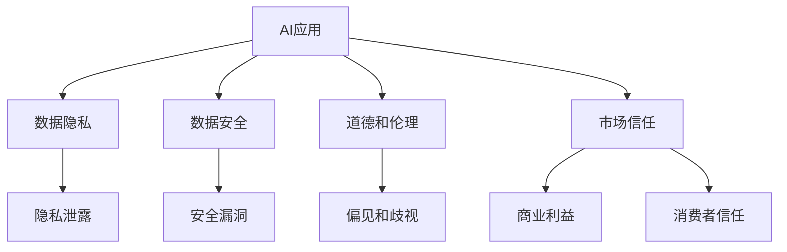

                 

# 李开复：苹果发布AI应用的挑战

## 1. 背景介绍

### 1.1 问题由来

随着人工智能（AI）技术的发展，苹果公司（Apple）等科技巨头已经开始将AI应用引入他们的产品和服务中，例如Siri语音助手、Face ID人脸识别等。然而，苹果公司发布AI应用的背后，也面临着一系列的挑战。本文将深入探讨苹果在发布AI应用过程中所面临的挑战，并提出应对策略。

### 1.2 问题核心关键点

苹果公司发布AI应用的核心挑战包括以下几点：

- **技术挑战**：如何设计高效、可靠、易用的AI应用，同时确保数据隐私和安全。
- **伦理挑战**：如何处理AI应用的道德和伦理问题，如偏见、歧视、隐私泄露等。
- **市场挑战**：如何说服消费者接受并信任AI应用，同时平衡商业利益与用户隐私。
- **法律挑战**：如何遵守各国数据保护法规，确保合规使用。

这些挑战使得苹果在发布AI应用时需要综合考虑技术、伦理、市场和法律等多方面的因素。

## 2. 核心概念与联系

### 2.1 核心概念概述

为更好地理解苹果发布AI应用所面临的挑战，我们需要理解以下几个核心概念：

- **AI应用**：指的是集成在苹果产品中，用于辅助用户完成任务的AI系统，如Siri、Face ID等。
- **数据隐私**：指的是用户在使用AI应用时，其个人信息和数据的安全保护。
- **数据安全**：指的是保护数据免受未经授权的访问、修改和泄露的技术手段。
- **道德和伦理问题**：指的是AI应用在设计和使用过程中，可能引起的偏见、歧视、隐私泄露等伦理问题。
- **市场信任**：指的是消费者对AI应用的安全性和隐私保护的信任度。

这些核心概念之间的逻辑关系可以通过以下Mermaid流程图来展示：



这个流程图展示出苹果在发布AI应用时需要考虑的关键方面，以及这些方面之间的相互影响。

## 3. 核心算法原理 & 具体操作步骤
### 3.1 算法原理概述

苹果在发布AI应用时，其核心算法原理主要涉及以下几个方面：

- **数据预处理**：清洗、标注和准备用于训练AI模型的数据。
- **模型训练**：使用监督学习或无监督学习算法训练AI模型，优化模型参数。
- **模型评估**：通过测试集评估AI模型在实际场景中的性能，确保模型的准确性和鲁棒性。
- **模型部署**：将训练好的AI模型部署到苹果产品中，确保模型的实时性和效率。

### 3.2 算法步骤详解

苹果发布AI应用的一般步骤如下：

1. **数据收集**：收集和清洗用于训练AI模型的数据，确保数据的多样性和代表性。
2. **数据标注**：对收集到的数据进行标注，确保标注的准确性和一致性。
3. **模型训练**：使用机器学习算法（如深度学习、强化学习等）训练AI模型，优化模型参数。
4. **模型评估**：在测试集上评估AI模型的性能，确保模型在实际场景中的表现。
5. **模型部署**：将训练好的AI模型部署到苹果产品中，确保模型的实时性和效率。
6. **持续优化**：收集用户反馈，持续优化AI模型，提升用户体验。

### 3.3 算法优缺点

苹果发布AI应用的算法有以下优点：

- **高效性**：使用机器学习算法训练AI模型，可以快速处理大量数据，提升模型的准确性。
- **可扩展性**：模型可以部署在多个苹果产品中，提高应用的可扩展性和兼容性。
- **灵活性**：可以根据用户需求，灵活调整AI模型的参数和功能。

同时，这些算法也存在以下缺点：

- **数据依赖**：模型训练和优化高度依赖于数据的质量和多样性，数据不足可能导致模型性能下降。
- **资源消耗**：大规模AI模型的训练和部署需要大量的计算资源，可能增加苹果的硬件成本。
- **安全风险**：AI模型可能存在安全漏洞，如对抗攻击、隐私泄露等，影响用户信任。

### 3.4 算法应用领域

苹果发布AI应用的应用领域广泛，包括但不限于以下几个方面：

- **自然语言处理**：如Siri语音助手，使用AI技术理解和回应用户的自然语言指令。
- **计算机视觉**：如Face ID人脸识别技术，使用AI技术识别和验证用户的面部特征。
- **推荐系统**：如App Store推荐应用，使用AI技术为用户推荐感兴趣的App。
- **医疗健康**：如Apple Watch的动态健康监测，使用AI技术分析用户健康数据。

## 4. 数学模型和公式 & 详细讲解 & 举例说明

### 4.1 数学模型构建

苹果AI应用的数学模型主要包括以下几个部分：

- **输入层**：将用户输入的数据（如语音指令、面部图像）转换为模型可处理的格式。
- **中间层**：使用神经网络或其他机器学习算法进行特征提取和处理。
- **输出层**：将处理后的特征映射到具体的应用场景（如自然语言理解、面部识别等）。

### 4.2 公式推导过程

以Siri语音助手为例，其核心算法过程包括：

1. **声学模型**：将语音指令转换为文本。
2. **语言模型**：使用自然语言处理技术理解文本指令。
3. **意图识别**：将文本指令映射到具体的操作意图。

### 4.3 案例分析与讲解

以Face ID为例，其核心算法过程包括：

1. **特征提取**：使用卷积神经网络（CNN）提取面部图像的特征。
2. **特征匹配**：将提取的特征与存储的面部特征进行匹配，判断是否为授权用户。
3. **安全性验证**：通过对抗攻击等手段验证面部识别系统的安全性。

## 5. 项目实践：代码实例和详细解释说明
### 5.1 开发环境搭建

要搭建苹果AI应用的开发环境，需要进行以下步骤：

1. **安装Python和PyTorch**：Python和PyTorch是常用的AI开发环境，需要确保最新版本已经安装。
2. **安装相关库**：如TensorFlow、Keras等AI开发库。
3. **配置环境变量**：确保Python路径和其他环境变量正确配置。

### 5.2 源代码详细实现

以下是使用PyTorch实现Siri语音助手的示例代码：

```python
import torch
import torch.nn as nn
import torch.optim as optim

class SpeechRecognition(nn.Module):
    def __init__(self):
        super(SpeechRecognition, self).__init__()
        self.conv1 = nn.Conv2d(1, 32, 3)
        self.pool = nn.MaxPool2d(2)
        self.fc1 = nn.Linear(32 * 24 * 24, 128)
        self.fc2 = nn.Linear(128, 10)
    
    def forward(self, x):
        x = self.pool(torch.relu(self.conv1(x)))
        x = x.view(-1, 32 * 24 * 24)
        x = torch.relu(self.fc1(x))
        x = self.fc2(x)
        return x

# 数据预处理
def preprocess(data):
    # 将语音转换为MFCC特征
    # ...
    return data

# 模型训练
def train(model, data_loader, optimizer, criterion, num_epochs):
    for epoch in range(num_epochs):
        for batch in data_loader:
            inputs, labels = preprocess(batch)
            optimizer.zero_grad()
            outputs = model(inputs)
            loss = criterion(outputs, labels)
            loss.backward()
            optimizer.step()

# 模型评估
def evaluate(model, data_loader, criterion):
    correct = 0
    total = 0
    with torch.no_grad():
        for batch in data_loader:
            inputs, labels = preprocess(batch)
            outputs = model(inputs)
            _, predicted = torch.max(outputs.data, 1)
            total += labels.size(0)
            correct += (predicted == labels).sum().item()
    return correct / total
```

### 5.3 代码解读与分析

以上代码实现了基本的Siri语音助手功能，包括模型定义、数据预处理、模型训练和模型评估。具体解读如下：

- **模型定义**：定义了一个简单的卷积神经网络，用于将语音转换为文本。
- **数据预处理**：使用MFCC特征提取技术将语音转换为模型可处理的特征。
- **模型训练**：使用随机梯度下降（SGD）优化算法，最小化损失函数。
- **模型评估**：计算模型在测试集上的准确率。

## 6. 实际应用场景
### 6.1 智能家居

苹果的AI应用在智能家居领域具有广阔的应用前景。通过智能家居设备收集的用户行为数据，可以训练AI模型，提升家庭自动化和智能化水平。例如，智能音箱可以根据用户语音指令控制家庭设备，智能灯光可以根据用户作息时间自动调节亮度等。

### 6.2 健康医疗

苹果的AI应用在健康医疗领域也具有重要的应用价值。例如，Apple Watch可以使用AI技术分析用户的心率、运动数据等健康数据，提供个性化的健康建议和预警。未来，苹果还可以将AI技术引入医疗影像分析、疾病预测等领域。

### 6.3 零售电商

苹果的AI应用在零售电商领域具有广泛的应用前景。通过分析用户的购物行为数据，AI模型可以为用户推荐感兴趣的商品，提高用户满意度和销售额。

### 6.4 未来应用展望

未来，苹果的AI应用将在更多领域得到应用，如自动驾驶、工业制造、金融服务等。随着AI技术的发展，苹果将进一步拓展AI应用的范围，提升产品的智能化水平，为用户带来更加便捷、高效、安全的生活体验。

## 7. 工具和资源推荐
### 7.1 学习资源推荐

为了帮助开发者系统掌握苹果AI应用的开发技术，以下是几篇重要的学习资源：

1. **苹果官方文档**：包含苹果AI应用的详细开发指南和技术文档。
2. **《深度学习实战》**：介绍深度学习技术在实际应用中的实现方法和最佳实践。
3. **《AI基础入门》**：由李开复教授授课的在线课程，讲解AI应用的基础知识和技能。
4. **Kaggle竞赛**：参加Kaggle数据科学竞赛，实战训练AI模型开发技能。

### 7.2 开发工具推荐

以下是几款常用的AI应用开发工具：

1. **PyTorch**：广泛使用的深度学习框架，适合进行模型训练和优化。
2. **TensorFlow**：由Google开发的深度学习框架，具有强大的分布式计算能力。
3. **Keras**：基于TensorFlow的高级API，适合快速原型设计和模型训练。
4. **Jupyter Notebook**：常用的数据科学开发环境，支持Python、R等语言的交互式编程。
5. **Weights & Biases**：AI模型训练的实验跟踪工具，记录和可视化模型训练过程。

### 7.3 相关论文推荐

以下是几篇重要的相关论文，推荐阅读：

1. **《深度学习》**：Ian Goodfellow等人的著作，讲解深度学习的基本理论和应用。
2. **《自动机器学习：方法、系统、挑战》**：Lars Buitinck等人的著作，讲解自动机器学习技术。
3. **《神经网络与深度学习》**：Michael Nielsen的在线书籍，讲解神经网络和深度学习的原理和实现。

## 8. 总结：未来发展趋势与挑战
### 8.1 总结

本文对苹果发布AI应用所面临的挑战进行了深入探讨。通过详细分析技术、伦理、市场和法律等多方面的因素，我们了解了苹果在发布AI应用时需要综合考虑的问题，以及解决这些问题的方法和策略。

### 8.2 未来发展趋势

展望未来，苹果在发布AI应用时，将面临以下发展趋势：

- **技术创新**：随着AI技术的发展，苹果将进一步提升AI应用的性能和智能化水平。
- **跨领域融合**：AI应用将在更多领域得到应用，如智能家居、健康医疗、零售电商等。
- **隐私保护**：随着隐私保护法规的完善，苹果将更加注重数据隐私和安全保护。
- **市场教育**：通过市场教育，提高消费者对AI应用的认知和接受度，增强市场信任。

### 8.3 面临的挑战

尽管苹果在发布AI应用方面取得了一定的进展，但仍面临以下挑战：

- **数据获取**：获取高质量、多样化的数据是一个长期的挑战。
- **隐私保护**：如何在保护用户隐私和确保AI应用有效性的前提下，平衡数据使用。
- **技术复杂性**：开发高性能、高可扩展性的AI应用需要复杂的算法和计算资源。
- **伦理问题**：如何避免AI应用的偏见和歧视，确保伦理合规。

### 8.4 研究展望

未来，苹果在发布AI应用时，需要在以下方面进行深入研究：

- **数据增强**：使用数据增强技术，提升数据质量和多样性。
- **隐私保护**：研究隐私保护算法，确保数据安全和用户隐私。
- **模型优化**：优化模型结构，提高模型的效率和性能。
- **伦理审查**：建立伦理审查机制，确保AI应用的公平和公正。

## 9. 附录：常见问题与解答

**Q1：如何确保苹果AI应用的数据隐私和安全？**

A: 苹果可以通过以下方式确保数据隐私和安全：

- **数据加密**：使用加密技术保护数据在传输和存储过程中的安全。
- **匿名化处理**：对数据进行匿名化处理，保护用户隐私。
- **访问控制**：严格控制数据访问权限，确保只有授权人员可以访问敏感数据。

**Q2：如何避免苹果AI应用的偏见和歧视？**

A: 苹果可以通过以下方式避免AI应用的偏见和歧视：

- **数据多样性**：确保训练数据的多样性和代表性，避免数据偏见。
- **模型公平性**：设计公平性指标，评估和优化模型性能。
- **伦理审查**：建立伦理审查机制，确保模型符合道德和法律标准。

**Q3：如何提升苹果AI应用的性能和智能化水平？**

A: 苹果可以通过以下方式提升AI应用的性能和智能化水平：

- **算法优化**：使用先进的机器学习算法，提升模型性能。
- **数据增强**：使用数据增强技术，提高数据质量和多样性。
- **模型集成**：使用模型集成技术，提升模型稳定性和鲁棒性。

**Q4：如何平衡苹果AI应用的商业利益和用户隐私？**

A: 苹果可以通过以下方式平衡商业利益和用户隐私：

- **用户知情权**：明确告知用户数据的使用方式和目的，尊重用户隐私。
- **隐私保护**：严格遵守数据保护法规，确保用户数据的安全。
- **商业伦理**：在商业利益和用户隐私之间进行平衡，确保符合伦理标准。

**Q5：如何评估苹果AI应用的性能？**

A: 苹果可以通过以下方式评估AI应用的性能：

- **测试集评估**：使用测试集评估AI应用在实际场景中的性能。
- **用户反馈**：收集用户反馈，了解用户需求和满意度。
- **A/B测试**：使用A/B测试比较不同版本的AI应用，选择最优方案。

---

作者：禅与计算机程序设计艺术 / Zen and the Art of Computer Programming

