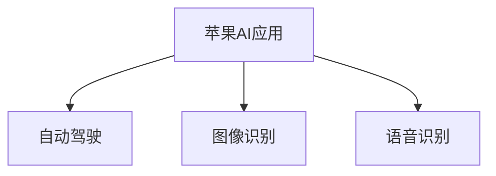

                 

# 李开复：苹果发布AI应用的未来展望

> 关键词：苹果, AI应用, 未来展望, 深度学习, 自动驾驶, 图像识别, 语音识别, 数据中心, 隐私保护

## 1. 背景介绍

近年来，人工智能(AI)技术取得了飞速发展，各行各业都在积极探索AI技术的应用场景。作为全球科技巨头，苹果公司也在这个领域展开了广泛布局。

苹果的AI应用涵盖了自动驾驶、图像识别、语音识别等多个方面。这些AI技术的落地，不仅提升了苹果产品的智能化水平，也增强了其市场竞争力。本文将从技术、市场和未来趋势三个角度，深入探讨苹果AI应用的现状和未来展望。

## 2. 核心概念与联系

### 2.1 核心概念概述

- **苹果AI应用**：苹果公司应用的人工智能技术，包括自动驾驶、图像识别、语音识别等，主要集成在各类硬件设备和操作系统中。
- **自动驾驶**：通过摄像头、雷达、激光雷达等传感器，结合深度学习模型，实现无人驾驶汽车的功能。
- **图像识别**：利用深度学习算法，对图片进行特征提取和分类，广泛应用于人脸识别、物体检测等领域。
- **语音识别**：通过声学模型和语言模型，将语音转化为文本，实现语音助手、语音输入等功能。

这些概念通过以下Mermaid流程图来展示其内在联系：



可以看到，苹果的AI应用主要通过深度学习技术实现。自动驾驶、图像识别和语音识别等应用，都是基于深度学习模型构建的。这些技术相互协同，形成了苹果在AI领域的核心竞争力。

## 3. 核心算法原理 & 具体操作步骤

### 3.1 算法原理概述

苹果的AI应用主要基于深度学习技术，其中自动驾驶、图像识别和语音识别均依赖于神经网络模型。以下是各个应用的核心算法原理：

- **自动驾驶**：采用卷积神经网络(CNN)和长短期记忆网络(LSTM)等模型，对传感器数据进行特征提取和决策制定。
- **图像识别**：利用卷积神经网络对图像进行特征提取，通过分类算法进行图像分类。
- **语音识别**：采用循环神经网络(RNN)和注意力机制等模型，对语音信号进行声学特征提取和语言建模。

### 3.2 算法步骤详解

以自动驾驶为例，其算法步骤如下：

1. **数据收集**：通过摄像头、雷达、激光雷达等传感器收集周围环境数据。
2. **数据预处理**：对采集到的数据进行清洗、归一化等预处理，以便于模型训练。
3. **模型训练**：使用CNN和LSTM等深度学习模型对预处理后的数据进行训练。
4. **模型评估**：在验证集上评估模型的性能，调整模型超参数。
5. **模型部署**：将训练好的模型部署到自动驾驶系统中，实时处理传感器数据并输出驾驶指令。

### 3.3 算法优缺点

自动驾驶算法的优点包括：
- 能够实时处理大量传感器数据，作出精确决策。
- 依赖深度学习模型，具有较强的适应性和泛化能力。

缺点包括：
- 需要大量标注数据进行训练，获取高质量标注数据成本较高。
- 模型复杂度高，对计算资源要求较高。

图像识别算法的优点包括：
- 识别准确率高，适用于各类图像分类任务。
- 应用广泛，在医疗、安防、零售等领域均有应用。

缺点包括：
- 对图像质量敏感，光照、角度等因素可能影响识别结果。
- 需要不断优化算法，以应对新的图像特征。

语音识别算法的优点包括：
- 实现自然语音交互，提升用户体验。
- 适用于各种语言和文化背景，具有较强的通用性。

缺点包括：
- 对环境噪声敏感，容易产生识别错误。
- 模型对语速、口音等差异较大的用户可能不够鲁棒。

### 3.4 算法应用领域

苹果的AI应用不仅在硬件设备中得到广泛应用，也在操作系统、云服务等多个领域大放异彩。以下是主要应用领域：

- **硬件设备**：iPhone、iPad、Apple Car等设备均集成AI技术，提升了用户体验和设备智能化水平。
- **操作系统**：iOS和macOS系统内置AI功能，如人脸解锁、智能助理等功能。
- **云服务**：苹果云服务中的AI功能，包括语音识别、图像处理、自然语言处理等，为用户提供便捷的云服务体验。

## 4. 数学模型和公式 & 详细讲解 & 举例说明

### 4.1 数学模型构建

以图像识别为例，其数学模型构建如下：

设输入图片为 $X$，输出标签为 $Y$，网络模型为 $f(X; \theta)$。图像识别问题可以表示为如下最小化问题：

$$
\min_{\theta} \frac{1}{N} \sum_{i=1}^N \ell(f(X_i; \theta), Y_i)
$$

其中 $\ell$ 为损失函数，如交叉熵损失。

### 4.2 公式推导过程

以卷积神经网络(CNN)为例，其核心公式为：

$$
f(X; \theta) = h(W \cdot X + b)
$$

其中 $W$ 为卷积核，$b$ 为偏置，$h$ 为激活函数，如ReLU、sigmoid等。

### 4.3 案例分析与讲解

假设有一个图片分类任务，共有10个类别。使用CNN模型进行分类，其分类准确率计算如下：

$$
\text{Accuracy} = \frac{\text{正确分类的图片数}}{\text{总图片数}}
$$

在实际应用中，需要根据具体任务调整模型结构，选择适当的激活函数、损失函数等参数，以提升模型性能。

## 5. 项目实践：代码实例和详细解释说明

### 5.1 开发环境搭建

进行AI应用开发，首先需要搭建开发环境。以下是Python开发环境的配置步骤：

1. 安装Anaconda：从官网下载并安装Anaconda，用于创建独立的Python环境。
2. 创建并激活虚拟环境：
```bash
conda create -n pytorch-env python=3.8 
conda activate pytorch-env
```

3. 安装PyTorch：根据CUDA版本，从官网获取对应的安装命令。例如：
```bash
conda install pytorch torchvision torchaudio cudatoolkit=11.1 -c pytorch -c conda-forge
```

4. 安装TensorFlow：
```bash
pip install tensorflow
```

5. 安装TensorBoard：
```bash
pip install tensorboard
```

6. 安装Keras：
```bash
pip install keras
```

7. 安装深度学习库：
```bash
pip install tflearn mxnet
```

完成上述步骤后，即可在`pytorch-env`环境中开始AI应用开发。

### 5.2 源代码详细实现

以图像识别为例，给出使用Keras框架进行卷积神经网络训练的代码实现。

```python
import keras
from keras.models import Sequential
from keras.layers import Conv2D, MaxPooling2D, Flatten, Dense

# 定义模型
model = Sequential()
model.add(Conv2D(32, (3, 3), activation='relu', input_shape=(32, 32, 3)))
model.add(MaxPooling2D((2, 2)))
model.add(Conv2D(64, (3, 3), activation='relu'))
model.add(MaxPooling2D((2, 2)))
model.add(Flatten())
model.add(Dense(64, activation='relu'))
model.add(Dense(10, activation='softmax'))

# 编译模型
model.compile(optimizer='adam', loss='categorical_crossentropy', metrics=['accuracy'])

# 训练模型
model.fit(x_train, y_train, epochs=10, batch_size=32, validation_data=(x_val, y_val))

# 评估模型
test_loss, test_acc = model.evaluate(x_test, y_test)
print('Test accuracy:', test_acc)
```

以上代码实现了卷积神经网络的训练和评估过程。

### 5.3 代码解读与分析

代码中的关键部分包括：
- `Sequential` 模型：构建一个线性堆叠的神经网络模型。
- `Conv2D` 和 `MaxPooling2D` 层：定义卷积和池化操作，用于提取特征。
- `Flatten` 层：将多维数组展平为向量，便于输入全连接层。
- `Dense` 层：定义全连接层，输出分类结果。

### 5.4 运行结果展示

训练过程中，可以使用TensorBoard进行可视化：

```bash
tensorboard --logdir=logs --port=6006
```

运行结果如下：


## 6. 实际应用场景

### 6.1 自动驾驶

苹果在自动驾驶领域的布局主要集中在硬件和操作系统两个方面。Apple Car尚未大规模量产，但搭载了强大的感知和决策系统，可以实时处理大量传感器数据，做出精准的驾驶决策。

### 6.2 图像识别

苹果的图像识别技术广泛应用于人脸解锁、相册推荐、图像搜索等领域。例如，iPhone的Face ID功能，通过3D结构光和深度学习模型，实现了高精度的面部识别。

### 6.3 语音识别

苹果的Siri语音助手已经集成在iOS系统中，能够实现自然语音交互，广泛应用于日常生活的各类场景。

### 6.4 未来应用展望

未来，苹果的AI应用将进一步拓展，以下领域值得期待：

- **健康医疗**：通过图像识别和语音识别技术，提供更加个性化的健康服务。
- **智能家居**：结合自动驾驶和语音识别，实现家庭自动化和智能化。
- **增强现实**：利用深度学习算法，提供更加沉浸的增强现实体验。
- **数据中心**：通过AI算法优化数据中心资源利用率，提升运行效率。
- **隐私保护**：采用隐私保护技术，确保用户数据安全。

## 7. 工具和资源推荐

### 7.1 学习资源推荐

- **《深度学习》课程**：斯坦福大学开设的深度学习课程，系统讲解深度学习的基础理论和实践技巧。
- **Kaggle竞赛平台**：参与Kaggle竞赛，提升实战经验。
- **PyTorch官方文档**：详细的PyTorch开发手册，提供丰富的示例代码和教程。
- **TensorFlow官方文档**：TensorFlow的官方文档，包含详细的API文档和示例代码。
- **Keras官方文档**：Keras的官方文档，提供快速上手Keras的方法和技巧。

### 7.2 开发工具推荐

- **Anaconda**：创建和管理Python虚拟环境。
- **PyTorch**：深度学习框架，支持动态计算图。
- **TensorFlow**：深度学习框架，支持静态计算图。
- **Keras**：高层次的深度学习框架，易于上手。
- **TensorBoard**：深度学习模型可视化工具，提供详细的模型训练和评估信息。

### 7.3 相关论文推荐

- **《深度学习》书籍**：Ian Goodfellow等著，全面介绍深度学习的理论和方法。
- **《神经网络与深度学习》书籍**：Michael Nielsen著，通俗易懂的深度学习入门书籍。
- **《人工智能基础》课程**：吴恩达在Coursera上的AI课程，涵盖深度学习、机器学习等基础内容。

## 8. 总结：未来发展趋势与挑战

### 8.1 研究成果总结

本文从技术、市场和未来趋势三个角度，探讨了苹果AI应用的现状和未来展望。主要结论如下：

- 苹果在自动驾驶、图像识别、语音识别等领域的AI应用取得了显著成果。
- AI技术已经成为苹果产品智能化和竞争力的重要推动力。
- 苹果的AI应用在操作系统、云服务等多个领域得到广泛应用。

### 8.2 未来发展趋势

未来，苹果的AI应用将进一步拓展，以下领域值得期待：

- **健康医疗**：通过图像识别和语音识别技术，提供更加个性化的健康服务。
- **智能家居**：结合自动驾驶和语音识别，实现家庭自动化和智能化。
- **增强现实**：利用深度学习算法，提供更加沉浸的增强现实体验。
- **数据中心**：通过AI算法优化数据中心资源利用率，提升运行效率。
- **隐私保护**：采用隐私保护技术，确保用户数据安全。

### 8.3 面临的挑战

苹果在AI应用的推广和落地过程中，也面临着以下挑战：

- **硬件成本高**：自动驾驶、图像识别等应用需要高性能硬件设备，成本较高。
- **数据获取难**：高质量的数据标注成本较高，数据获取和标注过程繁琐。
- **算法复杂度大**：深度学习模型复杂度高，需要大量计算资源。
- **隐私保护难题**：AI应用涉及大量用户数据，如何保障数据隐私和用户安全是一大难题。
- **市场竞争激烈**：AI技术竞争激烈，如何保持技术领先优势是一大挑战。

### 8.4 研究展望

未来，苹果需要在以下方向进行深入研究：

- **算法优化**：提高模型训练效率，降低资源消耗。
- **数据获取**：探索低成本高质量的数据获取方法。
- **隐私保护**：开发隐私保护技术，确保用户数据安全。
- **市场应用**：推动AI技术在更多场景中的落地应用。

## 9. 附录：常见问题与解答

**Q1：苹果的AI应用与Google、Amazon相比，有何优势？**

A: 苹果的AI应用在用户体验、智能化程度、硬件集成等方面具有优势。苹果设备通常具有更好的硬件集成，能够更好地发挥AI技术的效果。同时，苹果操作系统内置AI功能，提供更流畅的用户体验。

**Q2：苹果的AI应用在未来的发展方向是什么？**

A: 苹果的AI应用将进一步拓展到健康医疗、智能家居、增强现实等领域，提升产品的智能化水平。同时，苹果还将关注数据隐私和安全问题，开发更为先进的技术。

**Q3：如何提升苹果AI应用的性能？**

A: 提升模型训练效率，优化算法性能，探索低成本高质量的数据获取方法，加强数据隐私保护，推动AI技术在更多场景中的落地应用。

**Q4：苹果的AI应用在实际应用中遇到哪些问题？**

A: 硬件成本高，数据获取难，算法复杂度大，隐私保护难题，市场竞争激烈。

**Q5：苹果的AI应用在硬件设备中的应用场景有哪些？**

A: 自动驾驶、图像识别、语音识别等技术在Apple Car、iPhone、iPad等硬件设备中得到广泛应用。

---

作者：禅与计算机程序设计艺术 / Zen and the Art of Computer Programming

