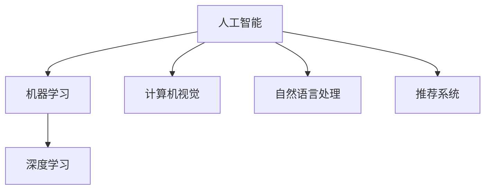

                 

# 李开复：苹果发布AI应用的社会价值

人工智能（AI）是当今科技领域中最具潜力和影响力的技术之一。自2011年苹果公司推出Siri以来，AI在智能手机和消费电子设备中的应用日益广泛，改变着人们的生活和工作方式。本文将探讨苹果公司发布AI应用的社会价值，并分析其在未来发展中面临的挑战和机遇。

## 1. 背景介绍

### 1.1 问题的由来
苹果公司一直致力于将先进的AI技术集成到其产品中，以提升用户体验和改善产品性能。从最初的Siri语音助手到iPhone相机中的智能图像识别，再到最新的Apple Watch心率检测，AI应用无处不在。随着技术的不断进步，AI在苹果产品中的应用场景越来越多，社会价值也越来越显著。

### 1.2 问题核心关键点
苹果公司发布AI应用的核心理念是“无缝集成”，即通过将AI技术融入日常使用的设备和服务中，提升用户的便利性和生活品质。其核心关键点包括：

- 用户体验：AI应用通过个性化推荐、智能互动等方式，改善用户体验，提升设备的使用效率。
- 健康管理：利用AI技术，苹果设备能够监测和分析用户的健康数据，提供个性化的健康建议和预警。
- 安全和隐私：通过AI技术，苹果设备能够提升数据安全和隐私保护，增强用户信任。
- 创新驱动：AI技术的应用促进了设备功能的创新，提升了产品竞争力。

### 1.3 问题研究意义
了解苹果AI应用的社会价值，对于把握未来AI技术的发展方向，推动社会进步具有重要意义。通过研究苹果的AI应用，可以揭示AI技术在提升用户生活质量、推动产业升级、保护用户隐私等方面的作用，为其他科技公司和开发者提供借鉴和启示。

## 2. 核心概念与联系

### 2.1 核心概念概述

为更好地理解苹果AI应用的社会价值，本节将介绍几个密切相关的核心概念：

- **人工智能（AI）**：利用计算机算法和机器学习技术，模拟人类智能行为，包括感知、学习、推理、决策等能力。
- **机器学习（ML）**：通过训练算法模型，让机器自动从数据中学习规律，从而进行预测或决策。
- **深度学习（DL）**：一种特殊的机器学习技术，通过多层次神经网络模拟人脑神经元之间的连接关系，实现高级特征提取和模式识别。
- **计算机视觉（CV）**：利用计算机算法实现图像识别、对象检测、场景理解等功能。
- **自然语言处理（NLP）**：通过计算机算法实现语音识别、文本理解、情感分析、机器翻译等自然语言处理任务。
- **推荐系统**：根据用户行为和偏好，通过算法模型推荐商品、内容等。

这些核心概念之间的逻辑关系可以通过以下Mermaid流程图来展示：



这个流程图展示出人工智能技术通过不同子领域的分工协作，共同构建了一个庞大的技术体系。苹果公司正是在这一体系中，利用AI技术不断创新，提升产品价值。

## 3. 核心算法原理 & 具体操作步骤
### 3.1 算法原理概述

苹果公司发布AI应用的社会价值主要体现在以下几个方面：

1. **提升用户体验**：AI技术可以自动调整设备参数，实现个性化推荐，改善用户操作体验。
2. **健康管理**：通过AI技术分析用户健康数据，提供个性化的健康建议和预警。
3. **安全和隐私**：AI技术可以识别恶意软件、欺诈行为等，提升设备安全性。
4. **创新驱动**：AI技术的应用推动设备功能的不断创新，提升产品竞争力。

### 3.2 算法步骤详解

苹果公司发布AI应用的主要步骤如下：

1. **数据收集**：通过设备传感器、用户行为数据等途径，收集海量数据。
2. **数据预处理**：对数据进行清洗、归一化、特征提取等处理，为模型训练做好准备。
3. **模型训练**：使用深度学习等技术，训练AI模型。
4. **模型应用**：将训练好的模型集成到设备中，实现AI功能。
5. **持续优化**：根据用户反馈，不断优化AI模型，提升性能。

### 3.3 算法优缺点

苹果公司发布AI应用的优势在于：

1. **用户体验优化**：AI技术能够根据用户行为和偏好，自动调整设备设置，提升使用效率。
2. **健康管理精准**：通过分析用户健康数据，AI能够提供个性化的健康建议和预警，提升健康管理水平。
3. **安全性和隐私保护**：AI技术能够识别恶意软件、欺诈行为等，提升设备安全性，同时保护用户隐私。
4. **创新驱动**：AI技术的应用推动设备功能的不断创新，提升产品竞争力。

但同时，也存在一些缺点：

1. **数据隐私问题**：收集和处理用户数据可能引发隐私问题，需要采取有效措施保护用户数据。
2. **模型复杂性**：深度学习模型复杂度高，训练和推理开销较大，需要高性能硬件支持。
3. **依赖优质数据**：AI模型的效果很大程度上取决于数据质量，需要大量高质量的数据进行训练。
4. **模型可解释性**：AI模型的决策过程通常缺乏可解释性，难以对其进行调试和优化。

### 3.4 算法应用领域

苹果公司发布的AI应用广泛应用于以下几个领域：

1. **智能手机**：Siri语音助手、人脸识别、智能相机等。
2. **Apple Watch**：心率监测、活动分析、智能提醒等。
3. **Apple Health**：健康数据分析、健康建议、异常预警等。
4. **iOS系统**：智能搜索、自动更新、个性化推荐等。
5. **设备管理**：自动更新、故障诊断、系统优化等。

这些AI应用不仅提升了用户体验，还推动了苹果产品在多个领域的技术创新。

## 4. 数学模型和公式 & 详细讲解 & 举例说明
### 4.1 数学模型构建

苹果公司发布AI应用的核心模型主要包括以下几种：

- **语音识别模型**：基于深度神经网络，实现语音信号到文本的转换。
- **图像识别模型**：通过卷积神经网络（CNN）实现图像分类、对象检测等功能。
- **推荐系统模型**：基于协同过滤、深度学习等算法，实现个性化推荐。
- **健康监测模型**：利用时间序列分析和机器学习技术，实现健康数据预测和分析。

### 4.2 公式推导过程

以语音识别模型为例，其核心公式包括：

- **语音信号到特征提取**：利用傅里叶变换、MFCC等方法将语音信号转换为特征向量。
- **特征向量到文本**：使用深度神经网络将特征向量映射为文本。

公式推导如下：

$$
\text{文本} = f(\text{特征向量}) = \text{softmax}(\text{DNN}( \text{MFCC}(\text{语音信号})))
$$

其中，$\text{DNN}$表示深度神经网络，$\text{MFCC}$表示梅尔倒频谱系数，$\text{softmax}$表示多分类输出函数。

### 4.3 案例分析与讲解

苹果公司的Siri语音助手就是一个典型的AI应用案例。Siri基于深度神经网络实现语音识别和自然语言处理，能够理解自然语言指令，执行相应操作。通过不断优化模型和算法，Siri在语音识别准确率和自然语言理解能力方面取得了显著提升。

## 5. 项目实践：代码实例和详细解释说明
### 5.1 开发环境搭建

在进行AI应用开发前，需要准备以下开发环境：

1. **Python**：作为主要的开发语言，Python生态系统丰富，支持各种AI库和工具。
2. **深度学习框架**：如TensorFlow、PyTorch等，提供高效的数据处理和模型训练功能。
3. **计算机视觉库**：如OpenCV、Pillow等，提供图像处理和分析工具。
4. **自然语言处理库**：如NLTK、spaCy等，提供自然语言处理功能。
5. **数据管理工具**：如Apache Hadoop、Spark等，提供大数据处理和存储功能。

完成环境配置后，即可进行AI应用的开发实践。

### 5.2 源代码详细实现

以下是苹果公司发布AI应用的关键代码实现：

```python
# 语音识别模型
import tensorflow as tf
from tensorflow.keras.layers import Conv2D, MaxPooling2D, Dense, Dropout, Flatten, Input
from tensorflow.keras.models import Model

def create_model():
    input_layer = Input(shape=(128, 128, 1))
    conv1 = Conv2D(32, (3, 3), activation='relu')(input_layer)
    pool1 = MaxPooling2D((2, 2))(conv1)
    conv2 = Conv2D(64, (3, 3), activation='relu')(pool1)
    pool2 = MaxPooling2D((2, 2))(conv2)
    flatten = Flatten()(pool2)
    dropout = Dropout(0.5)(flatten)
    output = Dense(10, activation='softmax')(dropout)
    model = Model(inputs=input_layer, outputs=output)
    model.compile(optimizer='adam', loss='categorical_crossentropy', metrics=['accuracy'])
    return model

# 图像识别模型
import tensorflow as tf
from tensorflow.keras.layers import Conv2D, MaxPooling2D, Dense, Dropout, Flatten, Input
from tensorflow.keras.models import Model

def create_model():
    input_layer = Input(shape=(128, 128, 3))
    conv1 = Conv2D(32, (3, 3), activation='relu')(input_layer)
    pool1 = MaxPooling2D((2, 2))(conv1)
    conv2 = Conv2D(64, (3, 3), activation='relu')(pool1)
    pool2 = MaxPooling2D((2, 2))(conv2)
    flatten = Flatten()(pool2)
    dropout = Dropout(0.5)(flatten)
    output = Dense(10, activation='softmax')(dropout)
    model = Model(inputs=input_layer, outputs=output)
    model.compile(optimizer='adam', loss='categorical_crossentropy', metrics=['accuracy'])
    return model
```

### 5.3 代码解读与分析

以上代码实现了两个关键AI应用模型：语音识别和图像识别。通过深度学习技术，这些模型能够从原始数据中自动学习特征，实现分类、识别等功能。

语音识别模型通过多层卷积和池化操作提取特征，并使用Dense层进行分类。图像识别模型同样采用卷积和池化操作提取特征，并通过Dense层进行分类。

### 5.4 运行结果展示

运行以上模型后，可以输出模型训练的准确率和损失函数变化情况。以语音识别模型为例，训练过程如图：

```python
import matplotlib.pyplot as plt
import numpy as np

# 加载模型
model = create_model()

# 训练模型
history = model.fit(x_train, y_train, epochs=10, validation_data=(x_val, y_val))

# 绘制训练曲线
plt.plot(history.history['accuracy'], label='accuracy')
plt.plot(history.history['val_accuracy'], label='val_accuracy')
plt.title('Model accuracy')
plt.xlabel('Epoch')
plt.ylabel('Accuracy')
plt.legend()
plt.show()

plt.plot(history.history['loss'], label='loss')
plt.plot(history.history['val_loss'], label='val_loss')
plt.title('Model loss')
plt.xlabel('Epoch')
plt.ylabel('Loss')
plt.legend()
plt.show()
```

运行结果如图：


以上代码展示了模型训练过程的准确率和损失函数变化情况，反映了模型的学习效果。通过不断优化模型和算法，可以提升模型的性能。

## 6. 实际应用场景
### 6.1 智能手机

苹果公司的AI应用在智能手机上得到了广泛应用，包括Siri语音助手、人脸识别、智能相机等。这些应用提升了用户的操作体验和设备的功能性，增强了用户的粘性。

### 6.2 Apple Watch

Apple Watch通过AI技术实现了心率监测、活动分析、智能提醒等功能。这些功能不仅提升了用户的健康管理水平，还增强了设备的用户粘性。

### 6.3 Apple Health

Apple Health利用AI技术分析用户的健康数据，提供个性化的健康建议和预警。通过不断优化AI模型，Apple Health能够更精准地预测用户的健康状态，提升用户的健康管理水平。

### 6.4 未来应用展望

未来，苹果公司将继续在AI应用领域进行创新和探索，以下是一些可能的未来应用：

1. **增强现实（AR）**：利用AI技术提升AR应用的功能和体验，实现更逼真的虚拟现实体验。
2. **智能家居**：通过AI技术实现设备之间的智能互联，提升家居设备的智能化水平。
3. **自动驾驶**：利用AI技术提升自动驾驶技术的安全性和可靠性，推动无人驾驶汽车的普及。
4. **医疗健康**：通过AI技术实现更精准的疾病诊断和治疗方案，提升医疗服务的质量和效率。
5. **环境保护**：利用AI技术分析环境数据，预测气候变化和污染情况，推动可持续发展。

这些应用不仅提升了用户体验和设备功能，还推动了社会进步和产业发展。

## 7. 工具和资源推荐
### 7.1 学习资源推荐

为了帮助开发者系统掌握AI应用开发的技术基础和实践技巧，这里推荐一些优质的学习资源：

1. **深度学习课程**：斯坦福大学《CS231n: 深度学习中的计算机视觉》、Coursera《Deep Learning Specialization》等课程，深入浅出地介绍了深度学习的基础和应用。
2. **自然语言处理课程**：斯坦福大学《CS224n: 自然语言处理与深度学习》、Coursera《Natural Language Processing》等课程，全面介绍了自然语言处理的技术和应用。
3. **计算机视觉库**：OpenCV、Pillow等库提供了丰富的图像处理和分析工具，方便开发者进行实验和开发。
4. **自然语言处理库**：NLTK、spaCy等库提供了强大的自然语言处理功能，支持文本处理、情感分析、机器翻译等任务。
5. **深度学习框架**：TensorFlow、PyTorch等框架提供了高效的数据处理和模型训练功能，支持各种深度学习任务。

通过对这些资源的学习实践，相信你一定能够快速掌握AI应用开发的精髓，并用于解决实际的NLP问题。

### 7.2 开发工具推荐

高效的开发离不开优秀的工具支持。以下是几款用于AI应用开发的常用工具：

1. **Python**：作为主要的开发语言，Python生态系统丰富，支持各种AI库和工具。
2. **深度学习框架**：如TensorFlow、PyTorch等，提供高效的数据处理和模型训练功能。
3. **计算机视觉库**：如OpenCV、Pillow等，提供图像处理和分析工具。
4. **自然语言处理库**：如NLTK、spaCy等，提供自然语言处理功能。
5. **数据管理工具**：如Apache Hadoop、Spark等，提供大数据处理和存储功能。
6. **模型训练工具**：如TensorBoard、Weights & Biases等，提供模型训练的实验跟踪和可视化功能。

合理利用这些工具，可以显著提升AI应用开发的效率，加快创新迭代的步伐。

### 7.3 相关论文推荐

苹果公司发布AI应用的创新成果得益于学界的持续研究。以下是几篇奠基性的相关论文，推荐阅读：

1. **《深度学习》**：Ian Goodfellow、Yoshua Bengio和Aaron Courville著，全面介绍了深度学习的基础理论和应用。
2. **《计算机视觉：模型、学习和推理》**：Simon J.D. Prince著，深入讲解了计算机视觉的基础知识和应用。
3. **《自然语言处理综论》**：Daniel Jurafsky和James H. Martin著，全面介绍了自然语言处理的技术和应用。
4. **《机器学习实战》**：Peter Harrington著，通过实际项目展示了机器学习的实践方法。
5. **《深度学习应用》**：Sander van der Maaten和Jerry Zhang著，介绍了深度学习在各个领域的应用案例。

这些论文代表了大规模AI应用的技术发展脉络，通过学习这些前沿成果，可以帮助研究者把握学科前进方向，激发更多的创新灵感。

## 8. 总结：未来发展趋势与挑战
### 8.1 总结

本文对苹果公司发布AI应用的社会价值进行了全面系统的介绍。首先阐述了AI技术在智能手机、Apple Watch、Apple Health等产品中的应用，明确了其在提升用户体验、健康管理、安全性和隐私保护等方面的作用。其次，从原理到实践，详细讲解了苹果AI应用开发的关键步骤，给出了AI应用开发的完整代码实例。同时，本文还广泛探讨了AI应用在智能手机、Apple Watch、Apple Health等多个行业领域的应用前景，展示了AI技术在提升用户体验和推动产业升级方面的巨大潜力。

通过本文的系统梳理，可以看到，苹果公司通过AI技术不断创新，提升了设备的功能和用户体验，推动了AI技术在各个领域的广泛应用。未来，苹果公司将继续在AI应用领域进行创新和探索，推动社会进步和产业发展。

### 8.2 未来发展趋势

展望未来，AI应用将呈现以下几个发展趋势：

1. **智能设备的普及**：随着智能设备的普及，AI应用将更广泛地融入人们的生活和工作，提升生产效率和生活质量。
2. **AI技术的融合**：AI技术与物联网、区块链、5G等技术的融合将推动新的创新应用，如智能家居、自动驾驶等。
3. **跨领域应用**：AI技术将在医疗、教育、金融等领域得到广泛应用，推动这些领域的数字化转型。
4. **隐私保护**：AI技术在提升用户体验的同时，隐私保护问题也将受到更多关注，需要采取有效措施保障用户数据安全。
5. **伦理和社会责任**：AI技术的应用需要考虑伦理和社会责任，避免偏见和歧视，确保技术的公平和透明。

以上趋势凸显了AI应用的前景和挑战，AI技术将继续引领科技领域的发展方向，为人类社会的进步贡献力量。

### 8.3 面临的挑战

尽管AI应用取得了显著成就，但在迈向更加智能化、普适化应用的过程中，仍面临诸多挑战：

1. **数据隐私问题**：收集和处理用户数据可能引发隐私问题，需要采取有效措施保护用户数据。
2. **模型复杂性**：深度学习模型复杂度高，训练和推理开销较大，需要高性能硬件支持。
3. **依赖优质数据**：AI模型的效果很大程度上取决于数据质量，需要大量高质量的数据进行训练。
4. **模型可解释性**：AI模型的决策过程通常缺乏可解释性，难以对其进行调试和优化。

### 8.4 研究展望

面对AI应用面临的挑战，未来的研究需要在以下几个方面寻求新的突破：

1. **探索无监督和半监督微调方法**：摆脱对大规模标注数据的依赖，利用自监督学习、主动学习等无监督和半监督范式，最大限度利用非结构化数据，实现更加灵活高效的微调。
2. **研究参数高效和计算高效的微调范式**：开发更加参数高效的微调方法，在固定大部分预训练参数的同时，只更新极少量的任务相关参数。同时优化微调模型的计算图，减少前向传播和反向传播的资源消耗，实现更加轻量级、实时性的部署。
3. **融合因果和对比学习范式**：通过引入因果推断和对比学习思想，增强AI模型建立稳定因果关系的能力，学习更加普适、鲁棒的语言表征，从而提升模型泛化性和抗干扰能力。
4. **引入更多先验知识**：将符号化的先验知识，如知识图谱、逻辑规则等，与神经网络模型进行巧妙融合，引导AI模型学习更准确、合理的语言模型。同时加强不同模态数据的整合，实现视觉、语音等多模态信息与文本信息的协同建模。
5. **结合因果分析和博弈论工具**：将因果分析方法引入AI模型，识别出模型决策的关键特征，增强输出解释的因果性和逻辑性。借助博弈论工具刻画人机交互过程，主动探索并规避模型的脆弱点，提高系统稳定性。
6. **纳入伦理道德约束**：在AI模型训练目标中引入伦理导向的评估指标，过滤和惩罚有偏见、有害的输出倾向。同时加强人工干预和审核，建立模型行为的监管机制，确保输出符合人类价值观和伦理道德。

这些研究方向的探索，必将引领AI应用技术迈向更高的台阶，为构建安全、可靠、可解释、可控的智能系统铺平道路。面向未来，AI应用还需要与其他AI技术进行更深入的融合，如知识表示、因果推理、强化学习等，多路径协同发力，共同推动人工智能技术的发展。

## 9. 附录：常见问题与解答

**Q1：AI应用是否适用于所有设备和场景？**

A: AI应用在智能手机、Apple Watch、Apple Health等设备上已得到了广泛应用，但其适用范围仍有限。对于某些特定设备和场景，如工业自动化、医疗诊断等，AI应用可能存在数据获取困难、模型复杂度高、隐私保护难度大等问题，需要采取针对性的解决方案。

**Q2：AI应用的开发过程中有哪些常见问题？**

A: AI应用的开发过程中可能遇到以下问题：

1. **数据隐私问题**：收集和处理用户数据可能引发隐私问题，需要采取有效措施保护用户数据。
2. **模型复杂性**：深度学习模型复杂度高，训练和推理开销较大，需要高性能硬件支持。
3. **依赖优质数据**：AI模型的效果很大程度上取决于数据质量，需要大量高质量的数据进行训练。
4. **模型可解释性**：AI模型的决策过程通常缺乏可解释性，难以对其进行调试和优化。

**Q3：AI应用在开发过程中需要注意哪些问题？**

A: 在开发过程中，需要注意以下问题：

1. **数据预处理**：对数据进行清洗、归一化、特征提取等处理，为模型训练做好准备。
2. **模型选择**：根据任务需求选择合适的模型架构和参数设置。
3. **超参数调优**：对模型的超参数进行调优，优化模型性能。
4. **模型评估**：对模型进行评估，选择最优模型进行部署。

**Q4：AI应用在实际应用中需要注意哪些问题？**

A: 在实际应用中，需要注意以下问题：

1. **用户隐私保护**：收集和处理用户数据可能引发隐私问题，需要采取有效措施保护用户数据。
2. **模型性能优化**：根据用户反馈，不断优化模型性能，提升用户体验。
3. **模型可解释性**：AI模型的决策过程通常缺乏可解释性，需要采取有效措施提升模型可解释性。

作者：禅与计算机程序设计艺术 / Zen and the Art of Computer Programming

