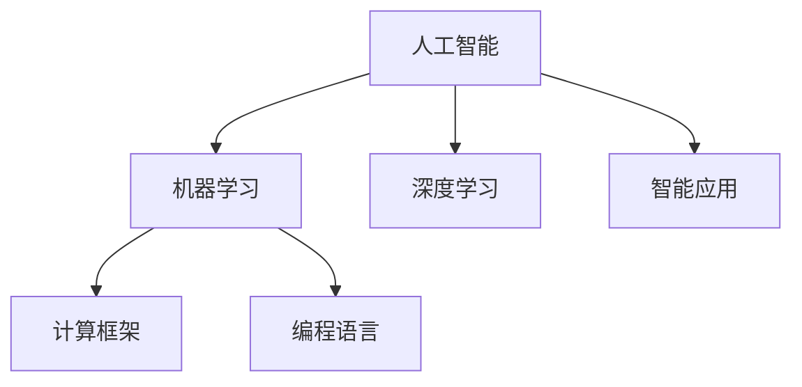
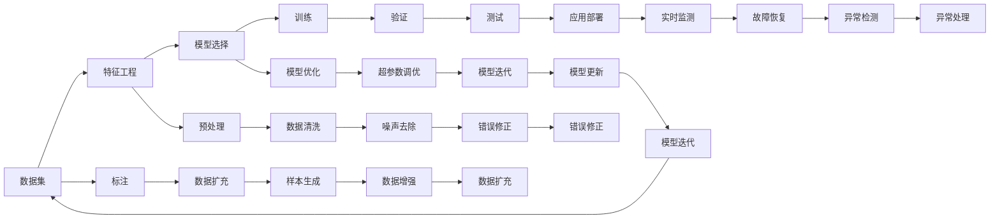

                 

# 构建更智能的世界：人类计算的应用场景

> 关键词：人工智能,计算机程序设计,智能应用,计算框架,机器学习,深度学习,编程语言

## 1. 背景介绍

### 1.1 问题由来

随着科技的飞速发展，人工智能（AI）已成为推动社会进步的关键力量。从最早的机器学习（ML）到深度学习（DL），再到如今的深度强化学习（RL），人类计算技术在各个领域发挥着越来越重要的作用。然而，尽管在算法和技术层面取得了巨大突破，如何更好地将这些技术应用于实际场景，尤其是提升人类生活质量和生产力，仍是当前面临的重要挑战。

### 1.2 问题核心关键点

本文聚焦于如何利用人工智能技术，构建更加智能和高效的世界，特别是在人类计算中的应用场景。我们将从以下几个关键点入手：

1. **智能推荐系统**：如电商推荐、视频内容推荐等，通过分析用户行为和偏好，提供个性化的产品或内容。
2. **医疗诊断系统**：利用AI技术进行疾病诊断和治疗方案推荐，提升医疗效率和精准度。
3. **自动驾驶**：实现车辆的自主导航和避障，提高交通安全和效率。
4. **智能制造**：通过AI优化生产流程和质量控制，提升制造业的自动化和智能化水平。
5. **自然语言处理**：使机器能理解、生成自然语言，支持智能客服、翻译、情感分析等应用。

这些应用场景展示了人工智能技术在多个领域的广泛应用，体现了人类计算的巨大潜力和未来发展方向。

## 2. 核心概念与联系

### 2.1 核心概念概述

要理解人类计算的应用场景，首先需要了解几个核心概念：

- **人工智能（AI）**：通过机器学习、深度学习等技术，使机器具备类似人类的智能能力。
- **机器学习（ML）**：让机器通过数据学习规律，进而进行预测、分类、聚类等任务。
- **深度学习（DL）**：一种特殊的机器学习方法，通过多层次的神经网络处理数据。
- **计算框架**：如TensorFlow、PyTorch等，提供高效的计算工具和算法库。
- **编程语言**：如Python、C++、R等，用于编写和运行AI程序。

这些概念之间的逻辑关系可以通过以下Mermaid流程图来展示：



这个流程图展示了AI技术的核心概念及其之间的关系：

1. AI通过ML和DL方法实现智能化。
2. 计算框架提供高效的计算支持。
3. 编程语言实现具体的AI程序。
4. 最终应用于智能应用场景。

### 2.2 核心概念原理和架构的 Mermaid 流程图



这个流程图展示了AI模型训练和应用的基本流程：

1. 数据预处理：包括数据清洗、特征工程、标注等步骤。
2. 模型选择与优化：选择适合任务的模型，并进行超参数调优和模型迭代。
3. 训练与验证：通过训练和验证过程，确保模型性能。
4. 测试与部署：在测试集上评估模型效果，并部署到实际应用中。
5. 实时监测与优化：持续监测模型性能，进行故障恢复和模型更新。

## 3. 核心算法原理 & 具体操作步骤

### 3.1 算法原理概述

在实际应用中，人工智能算法通常分为以下几个步骤：

1. **数据预处理**：包括数据清洗、特征提取、数据增强等步骤。
2. **模型选择与设计**：根据任务需求选择合适的模型架构。
3. **训练与验证**：通过训练过程优化模型参数，验证模型性能。
4. **测试与部署**：在测试集上评估模型效果，并将模型部署到实际应用中。
5. **实时监测与优化**：持续监测模型性能，进行模型更新和故障恢复。

### 3.2 算法步骤详解

#### 数据预处理

数据预处理是AI模型训练的第一步，其目的是提升数据质量，增强模型性能。常见的数据预处理步骤包括：

- **数据清洗**：去除缺失值、异常值、重复值等。
- **特征工程**：选择和构造有意义的特征，提升模型表达能力。
- **数据增强**：通过数据增强技术，丰富数据集，增强模型泛化能力。

#### 模型选择与设计

模型选择与设计是AI项目的关键步骤，不同的任务可能需要不同的模型。常见的模型包括：

- **线性回归**：用于预测数值型变量，如房价预测。
- **决策树**：用于分类和回归，易于解释和理解。
- **支持向量机（SVM）**：适用于小规模数据集和二分类问题。
- **随机森林**：结合多个决策树，提升模型性能和泛化能力。
- **神经网络**：通过多层感知机（MLP）、卷积神经网络（CNN）等，处理复杂任务。
- **深度学习模型**：如卷积神经网络（CNN）、循环神经网络（RNN）、长短期记忆网络（LSTM）、变换器（Transformer）等。

#### 训练与验证

模型训练是优化模型参数的过程，通过反向传播算法更新模型权重。常见的训练策略包括：

- **随机梯度下降（SGD）**：每次更新一个样本的梯度。
- **小批量随机梯度下降（Mini-batch SGD）**：每次更新一个批次的梯度。
- **自适应学习率优化器**：如Adam、Adagrad、RMSprop等，自动调整学习率。
- **早停法（Early Stopping）**：在验证集性能不再提升时停止训练，防止过拟合。
- **正则化**：如L1、L2正则化，避免过拟合。
- **Dropout**：随机丢弃神经元，防止过拟合。

#### 测试与部署

模型测试是评估模型性能的过程，常见的测试策略包括：

- **交叉验证**：将数据集分为训练集、验证集、测试集，交叉验证确保模型泛化能力。
- **ROC曲线**：用于分类任务的性能评估。
- **混淆矩阵**：用于分类任务的错误分类情况分析。
- **平均绝对误差（MAE）**：用于回归任务的性能评估。
- **均方误差（MSE）**：用于回归任务的性能评估。
- **精度（Accuracy）**：用于分类任务的性能评估。

模型部署是将模型应用于实际场景的过程，常见的部署方式包括：

- **模型训练与推理分离**：训练模型和推理过程分离，提高推理效率。
- **模型压缩与优化**：压缩模型参数，优化推理速度和内存使用。
- **模型集成与融合**：通过模型集成和融合，提升系统性能和鲁棒性。

#### 实时监测与优化

实时监测与优化是持续提升模型性能的过程，常见的监测策略包括：

- **数据流监控**：实时监控数据流，确保数据质量。
- **模型性能监控**：实时监控模型性能，及时发现和修复问题。
- **超参数调整**：根据实时性能，调整超参数，优化模型性能。
- **模型更新与重训练**：根据数据分布变化，更新模型并重新训练。
- **异常检测与处理**：实时检测异常情况，进行故障恢复。

### 3.3 算法优缺点

#### 优点

1. **自动化与智能化**：自动化的模型训练和推理过程，提升工作效率。
2. **高性能与高精度**：通过深度学习和神经网络，处理复杂任务，提升模型性能。
3. **可扩展性**：模型可以通过增加参数和层次，处理更复杂的任务。
4. **灵活性**：支持多种数据类型和任务类型，适应不同的应用场景。

#### 缺点

1. **数据依赖**：模型性能高度依赖数据质量，数据偏差可能影响模型效果。
2. **计算资源需求高**：深度学习模型通常需要大量的计算资源和存储空间。
3. **解释性不足**：复杂的模型结构和参数，难以解释模型的决策过程。
4. **过拟合风险**：模型可能在训练集上表现良好，但在测试集上表现较差。
5. **隐私与安全问题**：模型可能泄露用户隐私，存在安全风险。

## 4. 数学模型和公式 & 详细讲解 & 举例说明

### 4.1 数学模型构建

在AI中，常见的数学模型包括线性回归、逻辑回归、支持向量机、神经网络等。以下以线性回归模型为例，介绍其数学模型构建过程。

假设有一个包含n个样本的数据集，每个样本包含m个特征和1个目标变量。线性回归的数学模型为：

$$ y = \theta_0 + \sum_{i=1}^{m} \theta_i x_i $$

其中，$y$为目标变量，$x_i$为第i个特征，$\theta_0$为截距，$\theta_i$为第i个特征的权重。

### 4.2 公式推导过程

线性回归模型的目标是找到一个最优的权重向量$\theta$，使得模型在训练集上的预测值与实际值尽可能接近。常用的优化方法包括最小二乘法和梯度下降法。

#### 最小二乘法

最小二乘法的目标是最小化预测值与实际值之间的平方误差：

$$ \min_{\theta} \sum_{i=1}^{n} (y_i - \theta_0 - \sum_{j=1}^{m} \theta_j x_{ij})^2 $$

其中，$y_i$为第i个样本的实际值，$x_{ij}$为第i个样本的第j个特征。

最小二乘法的求解过程如下：

1. 将目标函数对$\theta$求偏导，得到偏导数矩阵。
2. 通过矩阵求逆或矩阵乘法，解出$\theta$。

#### 梯度下降法

梯度下降法通过迭代更新权重向量$\theta$，最小化预测值与实际值之间的误差：

$$ \theta = \theta - \alpha \frac{\partial \mathcal{L}(\theta)}{\partial \theta} $$

其中，$\alpha$为学习率，$\mathcal{L}(\theta)$为损失函数，$\frac{\partial \mathcal{L}(\theta)}{\partial \theta}$为损失函数对$\theta$的偏导数。

梯度下降法的迭代过程如下：

1. 初始化权重向量$\theta$。
2. 对于每个样本，计算预测值与实际值之间的误差。
3. 计算损失函数对$\theta$的偏导数。
4. 更新权重向量$\theta$。
5. 重复步骤2-4，直到达到停止条件。

### 4.3 案例分析与讲解

#### 案例一：电商推荐系统

电商推荐系统是一种常见的智能推荐应用，通过分析用户的历史购买记录和行为，推荐符合用户喜好的商品。以下是推荐系统的数学模型构建过程：

1. **数据预处理**：清洗和处理用户数据和商品数据，构建特征向量。
2. **模型选择与设计**：选择适合任务的模型，如协同过滤、基于内容的推荐、深度学习等。
3. **训练与验证**：通过用户行为数据训练模型，在验证集上评估模型性能。
4. **测试与部署**：在测试集上评估模型效果，并将模型部署到实际应用中。
5. **实时监测与优化**：持续监测模型性能，进行模型更新和优化。

#### 案例二：医疗诊断系统

医疗诊断系统通过分析患者的病历和实验室检测结果，进行疾病诊断和治疗方案推荐。以下是医疗诊断系统的数学模型构建过程：

1. **数据预处理**：清洗和处理病历数据和检测结果，构建特征向量。
2. **模型选择与设计**：选择适合任务的模型，如逻辑回归、支持向量机、深度学习等。
3. **训练与验证**：通过患者数据训练模型，在验证集上评估模型性能。
4. **测试与部署**：在测试集上评估模型效果，并将模型部署到实际应用中。
5. **实时监测与优化**：持续监测模型性能，进行模型更新和优化。

## 5. 项目实践：代码实例和详细解释说明

### 5.1 开发环境搭建

在实际开发中，需要搭建合适的开发环境。以下是一个Python开发环境的搭建流程：

1. **安装Anaconda**：从官网下载并安装Anaconda，用于创建独立的Python环境。
2. **创建并激活虚拟环境**：
```bash
conda create -n pytorch-env python=3.8 
conda activate pytorch-env
```
3. **安装PyTorch**：根据CUDA版本，从官网获取对应的安装命令。例如：
```bash
conda install pytorch torchvision torchaudio cudatoolkit=11.1 -c pytorch -c conda-forge
```
4. **安装TensorFlow**：
```bash
pip install tensorflow
```
5. **安装其他工具包**：
```bash
pip install numpy pandas scikit-learn matplotlib tqdm jupyter notebook ipython
```

完成上述步骤后，即可在`pytorch-env`环境中开始项目开发。

### 5.2 源代码详细实现

以下是一个简单的电商推荐系统的Python代码实现：

```python
import pandas as pd
import numpy as np
from sklearn.model_selection import train_test_split
from sklearn.linear_model import LogisticRegression
from sklearn.metrics import accuracy_score

# 加载数据集
data = pd.read_csv('data.csv')

# 数据预处理
X = data.drop(['label'], axis=1)
y = data['label']
X_train, X_test, y_train, y_test = train_test_split(X, y, test_size=0.2, random_state=42)

# 模型训练
model = LogisticRegression(solver='liblinear')
model.fit(X_train, y_train)

# 模型评估
y_pred = model.predict(X_test)
accuracy = accuracy_score(y_test, y_pred)
print(f'Accuracy: {accuracy:.2f}')
```

### 5.3 代码解读与分析

上述代码实现了简单的电商推荐系统的构建过程，包括以下几个关键步骤：

1. **数据加载**：使用Pandas加载数据集，进行数据清洗和处理。
2. **数据分割**：使用Scikit-learn的train_test_split函数将数据集分割为训练集和测试集。
3. **模型选择**：选择Logistic Regression模型，使用liblinear作为优化器。
4. **模型训练**：使用训练集数据训练模型，设置超参数。
5. **模型评估**：在测试集上评估模型性能，计算准确率。

## 6. 实际应用场景

### 6.1 智能推荐系统

智能推荐系统通过分析用户行为和偏好，推荐个性化的产品或内容。电商推荐、视频推荐、新闻推荐等应用广泛。通过深度学习模型，推荐系统可以实现高效、个性化的推荐服务。

#### 应用场景一：电商推荐

电商推荐系统通过分析用户的历史购买记录、浏览行为、评价信息等，推荐符合用户喜好的商品。以下是电商推荐系统的实现流程：

1. **数据收集与预处理**：收集用户行为数据，清洗和处理数据。
2. **特征工程**：选择和构造有意义的特征，如用户ID、商品ID、评分、浏览时间等。
3. **模型训练**：选择适合的模型，如协同过滤、基于内容的推荐、深度学习等。
4. **模型评估与优化**：在测试集上评估模型性能，进行超参数调优。
5. **实时推荐**：将模型部署到实时推荐系统中，根据用户行为实时推荐商品。

#### 应用场景二：视频推荐

视频推荐系统通过分析用户的历史观看记录和行为，推荐符合用户兴趣的视频内容。以下是视频推荐系统的实现流程：

1. **数据收集与预处理**：收集用户观看记录，清洗和处理数据。
2. **特征工程**：选择和构造有意义的特征，如用户ID、视频ID、观看时间、观看次数等。
3. **模型训练**：选择适合的模型，如协同过滤、基于内容的推荐、深度学习等。
4. **模型评估与优化**：在测试集上评估模型性能，进行超参数调优。
5. **实时推荐**：将模型部署到实时推荐系统中，根据用户行为实时推荐视频。

### 6.2 医疗诊断系统

医疗诊断系统通过分析患者的病历和实验室检测结果，进行疾病诊断和治疗方案推荐。以下是医疗诊断系统的实现流程：

1. **数据收集与预处理**：收集患者病历和检测结果，清洗和处理数据。
2. **特征工程**：选择和构造有意义的特征，如病历ID、检测结果、症状等。
3. **模型训练**：选择适合的模型，如逻辑回归、支持向量机、深度学习等。
4. **模型评估与优化**：在测试集上评估模型性能，进行超参数调优。
5. **实时诊断**：将模型部署到实时诊断系统中，根据患者信息实时诊断疾病。

### 6.3 自动驾驶

自动驾驶通过计算机视觉、深度学习和传感器融合技术，实现车辆的自主导航和避障。以下是自动驾驶系统的实现流程：

1. **数据收集与预处理**：收集道路图像、传感器数据，清洗和处理数据。
2. **特征工程**：选择和构造有意义的特征，如道路标记、车辆位置、速度、角度等。
3. **模型训练**：选择适合的模型，如卷积神经网络（CNN）、循环神经网络（RNN）等。
4. **模型评估与优化**：在测试集上评估模型性能，进行超参数调优。
5. **实时控制**：将模型部署到实时控制系统中，根据道路信息和传感器数据实时控制车辆。

### 6.4 未来应用展望

未来，随着AI技术的不断进步，人类计算的应用场景将更加广泛和深入。以下是几个可能的未来应用：

1. **智能制造**：通过AI优化生产流程和质量控制，提升制造业的自动化和智能化水平。
2. **智能医疗**：通过AI进行疾病诊断和治疗方案推荐，提升医疗效率和精准度。
3. **智能交通**：通过AI优化交通管理，提升交通流畅性和安全性。
4. **智能教育**：通过AI进行个性化教学，提升教育效果和效率。
5. **智能安防**：通过AI进行视频监控和分析，提升安全性和效率。

## 7. 工具和资源推荐

### 7.1 学习资源推荐

为了帮助开发者系统掌握AI技术，以下是一些优质的学习资源：

1. **《深度学习》书籍**：Ian Goodfellow等著，深入浅出地介绍了深度学习的原理和应用。
2. **Coursera深度学习课程**：Andrew Ng教授主讲，涵盖了深度学习的基础知识和应用案例。
3. **TensorFlow官方文档**：提供了详细的API文档和教程，帮助开发者快速上手TensorFlow。
4. **PyTorch官方文档**：提供了详细的API文档和教程，帮助开发者快速上手PyTorch。
5. **Kaggle竞赛**：提供了丰富的数据集和竞赛题目，帮助开发者练习和应用AI技术。

### 7.2 开发工具推荐

高效的开发离不开优秀的工具支持。以下是几款用于AI开发的工具：

1. **TensorFlow**：由Google主导开发的深度学习框架，生产部署方便，支持分布式计算。
2. **PyTorch**：由Facebook主导开发的深度学习框架，灵活性高，支持动态计算图。
3. **Jupyter Notebook**：提供了交互式的数据分析和代码编写环境，方便调试和协作。
4. **JupyterLab**：提供了更强大的开发环境和插件，支持多种编程语言和工具。
5. **GitHub**：提供了代码版本控制和协作功能，方便团队开发和项目管理。
6. **Anaconda**：提供了集成的科学计算工具和环境管理工具，方便环境搭建和维护。

### 7.3 相关论文推荐

以下是几篇奠基性的相关论文，推荐阅读：

1. **AlexNet**：Hinton等著，介绍了卷积神经网络（CNN）在图像识别任务上的应用。
2. **ResNet**：He等著，介绍了残差网络（ResNet）的设计和应用。
3. **Transformer**：Vaswani等著，介绍了Transformer模型在自然语言处理（NLP）任务上的应用。
4. **BERT**：Devlin等著，介绍了预训练语言模型BERT的设计和应用。
5. **GPT-3**：Brown等著，介绍了GPT-3在大规模语言处理任务上的应用。

## 8. 总结：未来发展趋势与挑战

### 8.1 研究成果总结

本文系统介绍了人工智能技术在人类计算中的应用场景，从数据预处理、模型训练、模型评估到模型部署，详细讲解了AI项目的实现流程。通过具体案例，展示了AI技术在电商推荐、医疗诊断、自动驾驶等领域的广泛应用。通过学习资源和开发工具推荐，帮助开发者掌握AI技术，应用到实际项目中。

### 8.2 未来发展趋势

未来，随着AI技术的不断进步，人类计算的应用场景将更加广泛和深入。以下是几个可能的未来发展趋势：

1. **深度学习和神经网络**：深度学习和神经网络将继续在AI项目中发挥重要作用，处理更复杂的数据和任务。
2. **自然语言处理（NLP）**：NLP技术将继续提升，支持更多的自然语言理解和生成任务。
3. **强化学习（RL）**：强化学习将应用于更多领域，提升系统的自动化和智能化水平。
4. **联邦学习**：联邦学习将应用于分布式数据场景，保护用户隐私和数据安全。
5. **跨模态学习**：跨模态学习将支持多种数据类型和任务类型，提升系统的泛化能力和鲁棒性。

### 8.3 面临的挑战

尽管AI技术已经取得了巨大进展，但在应用过程中仍然面临诸多挑战：

1. **数据质量与获取**：高质量的数据是AI项目的基础，如何获取和处理数据仍然是一个重要问题。
2. **计算资源需求高**：深度学习和神经网络需要大量的计算资源和存储空间，如何优化资源使用是一个重要问题。
3. **模型可解释性**：复杂的模型结构和参数，难以解释模型的决策过程，如何提高模型可解释性是一个重要问题。
4. **隐私与安全**：AI项目涉及大量数据和隐私，如何保护用户隐私和数据安全是一个重要问题。
5. **公平性与公正性**：AI模型可能存在偏见和歧视，如何确保公平性与公正性是一个重要问题。

### 8.4 研究展望

面对AI技术应用中的挑战，未来的研究需要在以下几个方面寻求新的突破：

1. **数据增强与扩充**：通过数据增强和扩充，提升数据质量和数量。
2. **模型优化与压缩**：通过模型优化和压缩，提高资源使用效率。
3. **模型解释与可理解性**：通过模型解释和可理解性技术，提升模型的可解释性和透明度。
4. **隐私保护与安全保障**：通过隐私保护和安全保障技术，保护用户隐私和数据安全。
5. **公平性与公正性**：通过公平性与公正性技术，确保模型的公平性与公正性。

## 9. 附录：常见问题与解答

### Q1: 什么是深度学习？

A: 深度学习是一种基于神经网络的机器学习方法，通过多层非线性变换，实现对复杂数据和任务的建模和处理。深度学习在图像识别、语音识别、自然语言处理等领域取得了显著成效。

### Q2: 深度学习与传统机器学习的区别？

A: 深度学习与传统机器学习的区别在于模型的复杂度和表达能力。深度学习模型通常包含多层次的神经网络，能够处理复杂的数据和任务，而传统机器学习模型通常较为简单，表达能力有限。

### Q3: 如何选择合适的机器学习算法？

A: 选择合适的机器学习算法需要考虑任务类型、数据特点、计算资源等因素。一般来说，对于分类和回归任务，可以使用逻辑回归、支持向量机等传统机器学习算法。对于图像和语音识别任务，可以使用卷积神经网络（CNN）、循环神经网络（RNN）等深度学习算法。

### Q4: 如何优化深度学习模型？

A: 深度学习模型的优化方法包括超参数调优、正则化、早停法、梯度下降等。超参数调优可以通过网格搜索、随机搜索等方法寻找最优参数。正则化可以通过L1、L2正则化等方法避免过拟合。早停法可以在验证集性能不再提升时停止训练，防止过拟合。梯度下降可以通过学习率调整、动量调整等方法优化模型性能。

### Q5: 如何实现深度学习模型的实时推理？

A: 深度学习模型的实时推理可以通过模型优化、模型压缩、推理加速等方法实现。模型优化和压缩可以通过剪枝、量化、知识蒸馏等方法减小模型尺寸，提高推理速度。推理加速可以通过GPU、TPU等硬件设备，并行计算，提高推理效率。

通过本文的系统梳理，可以看到，人工智能技术在人类计算中的应用场景极其广泛，具备巨大的潜力和发展空间。未来，随着AI技术的不断进步和应用领域的不断拓展，人类计算必将迎来更加智能和高效的时代。

---

作者：禅与计算机程序设计艺术 / Zen and the Art of Computer Programming

