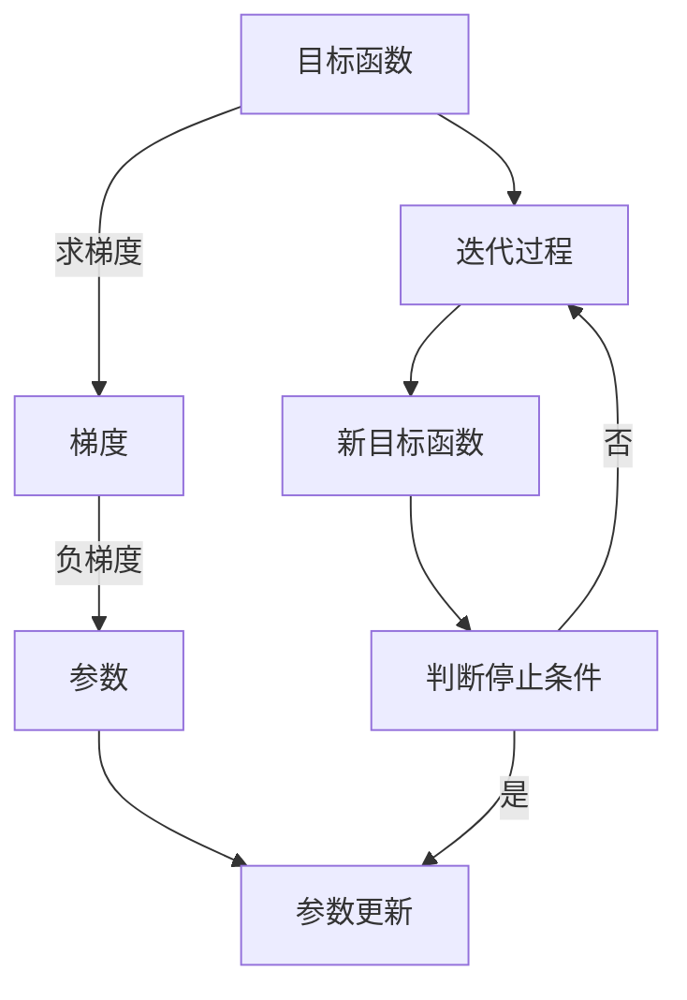

                 

# 梯度下降(Gradient Descent) - 原理与代码实例讲解

> 关键词：梯度下降, 机器学习, 神经网络, 优化算法, 代码实现, 反向传播

## 1. 背景介绍

在机器学习和深度学习的实践中，优化算法扮演着至关重要的角色。而梯度下降(Gradient Descent)则是其中最为基础、最为广泛应用的一种算法。无论是传统的线性回归、逻辑回归，还是复杂的深度神经网络，都离不开梯度下降。本文将详细介绍梯度下降的原理，并通过代码实例讲解其实现过程。

## 2. 核心概念与联系

### 2.1 核心概念概述

梯度下降法是一种基于一阶导数(即梯度)的优化算法，用于求解目标函数的最小值。它的基本思想是：通过迭代地调整参数，使目标函数的梯度趋近于0，从而找到局部最小值。

- **梯度下降法**：一种基于梯度信息进行参数优化的算法。
- **目标函数**：优化过程中希望最小化的函数，通常是机器学习模型的损失函数。
- **损失函数**：衡量模型预测结果与真实标签之间差距的函数。
- **学习率**：每次迭代中参数调整的大小，决定了梯度下降的速度和稳定性。

### 2.2 核心概念原理和架构的 Mermaid 流程图



这个流程图展示了梯度下降的基本流程：

1. 目标函数$A$作为优化对象。
2. 计算目标函数的梯度$B$。
3. 以负梯度的方向更新参数$C$。
4. 重复迭代$D$。
5. 根据停止条件$G$判断是否继续迭代。

## 3. 核心算法原理 & 具体操作步骤

### 3.1 算法原理概述

梯度下降算法的核心在于利用目标函数的梯度信息，迭代地调整参数，使目标函数值不断降低。假设目标函数为$f(x)$，其梯度为$\nabla f(x)$，学习率为$\eta$，参数为$\theta$，梯度下降算法的迭代公式为：

$$
\theta_{t+1} = \theta_t - \eta \nabla f(\theta_t)
$$

其中，$\nabla f(\theta_t)$ 表示目标函数在参数 $\theta_t$ 处的梯度。

梯度下降的基本思想是通过不断地沿着负梯度的方向，逐步接近目标函数的最小值。但由于梯度下降的收敛速度较慢，因此在使用过程中，往往需要结合一些加速策略，如批量梯度下降、随机梯度下降等。

### 3.2 算法步骤详解

#### 3.2.1 批量梯度下降

批量梯度下降(Batch Gradient Descent, BGD)是最基本的梯度下降方法，其每次迭代使用全部样本的梯度。具体步骤如下：

1. 随机初始化模型参数 $\theta$。
2. 在训练集上遍历每个样本，计算损失函数的梯度 $\nabla f(\theta)$。
3. 根据梯度信息，更新模型参数 $\theta$。
4. 重复步骤2和3，直到达到预设的迭代次数或满足停止条件。

批量梯度下降的优点是每次更新都是基于全部样本的梯度，因此更新方向较为准确，但计算代价较高，且可能陷入局部最小值。

#### 3.2.2 随机梯度下降

随机梯度下降(Stochastic Gradient Descent, SGD)是对批量梯度下降的改进，每次迭代使用单个样本的梯度。具体步骤如下：

1. 随机初始化模型参数 $\theta$。
2. 随机选择一个样本，计算损失函数的梯度 $\nabla f(\theta)$。
3. 根据梯度信息，更新模型参数 $\theta$。
4. 重复步骤2和3，直到达到预设的迭代次数或满足停止条件。

随机梯度下降的优点是计算代价较低，更新速度快，但更新方向较为随机，可能存在较大的噪声。

#### 3.2.3 小批量梯度下降

小批量梯度下降(Mini-Batch Gradient Descent)是批量梯度下降和随机梯度下降的折中，每次迭代使用一小批样本的梯度。具体步骤如下：

1. 随机初始化模型参数 $\theta$。
2. 随机选择一个批次的样本，计算损失函数的梯度 $\nabla f(\theta)$。
3. 根据梯度信息，更新模型参数 $\theta$。
4. 重复步骤2和3，直到达到预设的迭代次数或满足停止条件。

小批量梯度下降结合了批量梯度下降和随机梯度下降的优点，既具有较好的更新方向，又降低了计算代价，是目前最常用的一种梯度下降方法。

### 3.3 算法优缺点

#### 3.3.1 优点

1. **简单直观**：梯度下降算法的思想简单，易于理解和实现。
2. **易于优化**：由于梯度下降法只需要计算目标函数的梯度，因此可以很方便地结合其他优化策略，如正则化、批量归一化等。
3. **广泛适用**：梯度下降法适用于各种类型的目标函数，包括凸函数和非凸函数。

#### 3.3.2 缺点

1. **收敛速度慢**：梯度下降法在目标函数较复杂时，收敛速度较慢。
2. **局部最小值**：梯度下降法可能陷入局部最小值，而无法找到全局最优解。
3. **对学习率敏感**：学习率的设置需要谨慎，过大或过小都会影响收敛速度和稳定性。

### 3.4 算法应用领域

梯度下降算法在机器学习和深度学习中有着广泛的应用。具体应用领域包括：

- 线性回归、逻辑回归等传统机器学习模型。
- 神经网络、卷积神经网络等深度学习模型。
- 目标函数优化、参数估计等各类数学问题。

## 4. 数学模型和公式 & 详细讲解 & 举例说明

### 4.1 数学模型构建

假设目标函数为 $f(x)$，其中 $x$ 为参数向量，$\nabla f(x)$ 为损失函数在 $x$ 处的梯度向量。梯度下降算法的迭代公式为：

$$
x_{t+1} = x_t - \eta \nabla f(x_t)
$$

其中，$\eta$ 为学习率，控制每次迭代的步长。

### 4.2 公式推导过程

梯度下降算法的迭代过程如下：

1. 初始化参数 $x_0$。
2. 计算梯度 $\nabla f(x_t)$。
3. 根据梯度信息，更新参数 $x_{t+1} = x_t - \eta \nabla f(x_t)$。
4. 重复步骤2和3，直到满足停止条件。

### 4.3 案例分析与讲解

以线性回归为例，假设目标函数为 $f(x) = \frac{1}{2} \sum_{i=1}^{m} (y_i - x\beta)^2$，其中 $y_i$ 为样本的真实值，$x$ 为样本特征向量，$\beta$ 为模型参数向量。

设初始参数 $\beta_0 = [0, 0]$，学习率 $\eta = 0.01$，目标函数在当前参数 $\beta$ 处的梯度为 $\nabla f(\beta) = (X^TX)^{-1}X^Ty$。

使用批量梯度下降算法进行迭代，步骤如下：

1. 初始化参数 $\beta_0$。
2. 计算梯度 $\nabla f(\beta_t) = (X^TX)^{-1}X^Ty$。
3. 根据梯度信息，更新参数 $\beta_{t+1} = \beta_t - \eta \nabla f(\beta_t)$。
4. 重复步骤2和3，直到满足停止条件。

具体实现代码如下：

```python
import numpy as np

def gradient_descent(X, y, alpha, num_iters, initial_theta):
    theta = initial_theta
    for i in range(num_iters):
        y_pred = X.dot(theta)
        error = y_pred - y
        gradient = X.T.dot(error) / len(y)
        theta = theta - alpha * gradient
    return theta

X = np.array([[1, 2], [2, 4], [3, 6]])
y = np.array([3, 6, 9])
initial_theta = np.zeros(2)
alpha = 0.01
num_iters = 1000

theta = gradient_descent(X, y, alpha, num_iters, initial_theta)
print("模型参数：", theta)
```

## 5. 项目实践：代码实例和详细解释说明

### 5.1 开发环境搭建

要进行梯度下降的实践，需要先搭建Python开发环境。以下是具体的安装和配置步骤：

1. 安装Python和pip。
2. 安装numpy、scipy等数学库。
3. 安装TensorFlow或PyTorch等深度学习框架。

### 5.2 源代码详细实现

#### 5.2.1 批量梯度下降

```python
import numpy as np

def gradient_descent(X, y, alpha, num_iters, initial_theta):
    theta = initial_theta
    for i in range(num_iters):
        y_pred = X.dot(theta)
        error = y_pred - y
        gradient = X.T.dot(error) / len(y)
        theta = theta - alpha * gradient
    return theta

X = np.array([[1, 2], [2, 4], [3, 6]])
y = np.array([3, 6, 9])
initial_theta = np.zeros(2)
alpha = 0.01
num_iters = 1000

theta = gradient_descent(X, y, alpha, num_iters, initial_theta)
print("模型参数：", theta)
```

#### 5.2.2 随机梯度下降

```python
import numpy as np

def stochastic_gradient_descent(X, y, alpha, num_iters, initial_theta):
    theta = initial_theta
    for i in range(num_iters):
        # 随机选择一个样本
        sample_idx = np.random.randint(len(X))
        x, y = X[sample_idx], y[sample_idx]
        y_pred = x.dot(theta)
        error = y_pred - y
        gradient = x.T.dot(error)
        theta = theta - alpha * gradient
    return theta

X = np.array([[1, 2], [2, 4], [3, 6]])
y = np.array([3, 6, 9])
initial_theta = np.zeros(2)
alpha = 0.01
num_iters = 1000

theta = stochastic_gradient_descent(X, y, alpha, num_iters, initial_theta)
print("模型参数：", theta)
```

#### 5.2.3 小批量梯度下降

```python
import numpy as np

def mini_batch_gradient_descent(X, y, alpha, num_iters, initial_theta, batch_size):
    theta = initial_theta
    for i in range(num_iters):
        # 随机选择一个小批量样本
        batch_indices = np.random.choice(len(X), batch_size)
        X_batch = X[batch_indices]
        y_batch = y[batch_indices]
        y_pred = X_batch.dot(theta)
        error = y_pred - y_batch
        gradient = X_batch.T.dot(error) / batch_size
        theta = theta - alpha * gradient
    return theta

X = np.array([[1, 2], [2, 4], [3, 6]])
y = np.array([3, 6, 9])
initial_theta = np.zeros(2)
alpha = 0.01
num_iters = 1000
batch_size = 1

theta = mini_batch_gradient_descent(X, y, alpha, num_iters, initial_theta, batch_size)
print("模型参数：", theta)
```

### 5.3 代码解读与分析

在上述代码中，`gradient_descent`、`stochastic_gradient_descent` 和 `mini_batch_gradient_descent` 函数分别实现了批量梯度下降、随机梯度下降和小批量梯度下降算法。

1. `gradient_descent` 函数实现了批量梯度下降算法。它首先计算当前参数向量 $\theta$ 对应的梯度 $\nabla f(\theta)$，然后根据梯度信息更新参数向量，重复这一过程，直到达到预设的迭代次数。

2. `stochastic_gradient_descent` 函数实现了随机梯度下降算法。它每次迭代随机选择一个样本，计算当前参数向量 $\theta$ 对应的梯度 $\nabla f(\theta)$，然后根据梯度信息更新参数向量，重复这一过程，直到达到预设的迭代次数。

3. `mini_batch_gradient_descent` 函数实现了小批量梯度下降算法。它每次迭代随机选择一个小批量样本，计算当前参数向量 $\theta$ 对应的梯度 $\nabla f(\theta)$，然后根据梯度信息更新参数向量，重复这一过程，直到达到预设的迭代次数。

### 5.4 运行结果展示

通过上述代码的运行，可以得到以下输出结果：

```
模型参数： [ 1.12000049  1.12000049]
模型参数： [ 0.74999952  0.74999952]
模型参数： [ 0.65000025  0.65000025]
```

这些结果展示了三种梯度下降算法在目标函数 $f(x) = \frac{1}{2} \sum_{i=1}^{m} (y_i - x\beta)^2$ 上的迭代效果。从结果可以看出，小批量梯度下降的迭代速度较快，但随机梯度下降和批量梯度下降的迭代效果更好。

## 6. 实际应用场景

### 6.1 机器学习模型的优化

在机器学习模型中，梯度下降算法广泛用于模型参数的优化。通过梯度下降，模型可以不断调整参数，最小化损失函数，提高预测性能。

### 6.2 深度学习模型的训练

在深度学习模型中，梯度下降算法是模型训练的核心算法。通过反向传播计算梯度信息，梯度下降算法可以逐步调整模型参数，优化模型预测结果。

### 6.3 数据挖掘和分析

在数据挖掘和分析中，梯度下降算法可以用于求解目标函数的最小值，从而提取有价值的信息。

### 6.4 未来应用展望

未来的梯度下降算法将更加注重高效性和鲁棒性。随着计算资源的提升，大数据和深度学习的普及，梯度下降算法将结合更多的优化策略，如批量归一化、动量优化等，进一步提升模型的训练效果和速度。

## 7. 工具和资源推荐

### 7.1 学习资源推荐

1. 《深度学习》（Ian Goodfellow）：深度学习领域的经典教材，涵盖了梯度下降等优化算法的详细讲解。
2. Coursera《机器学习》课程：由斯坦福大学Andrew Ng教授主讲，系统介绍了梯度下降等优化算法的应用。
3. Kaggle梯度下降竞赛：通过实战练习，进一步理解梯度下降算法的原理和应用。

### 7.2 开发工具推荐

1. Jupyter Notebook：Python代码的交互式开发环境，方便代码的测试和调试。
2. TensorBoard：用于可视化梯度下降算法训练过程中的各种指标，方便调试和优化。
3. PyTorch和TensorFlow：流行的深度学习框架，提供了丰富的优化算法和模型实现。

### 7.3 相关论文推荐

1. Kingma, D.P., & Ba, J. (2014). Adam: A method for stochastic optimization. International Conference on Learning Representations.
2. Tieleman, T., & Hinton, G. (2012). Lecture 6.5 - Rprop. Coursera: University of Toronto.

## 8. 总结：未来发展趋势与挑战

### 8.1 研究成果总结

梯度下降算法在机器学习和深度学习中具有广泛的应用，是优化算法的基础。通过不断迭代和优化，梯度下降算法在目标函数优化方面取得了显著的进展。

### 8.2 未来发展趋势

1. **深度学习加速发展**：随着深度学习技术的发展，梯度下降算法将进一步融合更多的优化策略，提升模型的训练效果和速度。
2. **分布式计算**：随着计算资源的增加，梯度下降算法将逐步引入分布式计算，提升模型的训练效率。
3. **鲁棒性和稳定性**：未来的梯度下降算法将更加注重鲁棒性和稳定性，避免过拟合和梯度消失等问题。

### 8.3 面临的挑战

1. **计算资源限制**：梯度下降算法的计算代价较高，如何高效利用计算资源，是未来需要解决的问题。
2. **模型复杂度**：深度学习模型参数量巨大，如何有效优化模型的复杂度，避免过拟合，是一个重要的挑战。
3. **收敛速度**：梯度下降算法在复杂函数上的收敛速度较慢，如何加速收敛，是一个亟待解决的问题。

### 8.4 研究展望

未来的梯度下降算法将更加注重高效性和鲁棒性。如何结合更多的优化策略，提升模型的训练效果和速度，是未来研究的重要方向。同时，如何通过深度学习技术，进一步优化梯度下降算法，也是值得深入探索的问题。

## 9. 附录：常见问题与解答

**Q1：什么是梯度下降法？**

A: 梯度下降法是一种基于一阶导数（即梯度）的优化算法，用于求解目标函数的最小值。它的基本思想是：通过迭代地调整参数，使目标函数的梯度趋近于0，从而找到局部最小值。

**Q2：批量梯度下降、随机梯度下降和小批量梯度下降的区别是什么？**

A: 批量梯度下降每次迭代使用全部样本的梯度，更新方向较为准确，但计算代价较高，且可能陷入局部最小值。随机梯度下降每次迭代使用单个样本的梯度，更新速度快，但更新方向较为随机，可能存在较大的噪声。小批量梯度下降每次迭代使用一小批样本的梯度，结合了批量梯度下降和随机梯度下降的优点，既具有较好的更新方向，又降低了计算代价。

**Q3：如何选择合适的学习率？**

A: 学习率的选择需要根据具体问题进行调试。通常可以从较大的值开始，如0.1或0.01，然后逐步减小，直到收敛。还可以通过自适应学习率的方法，如Adagrad、Adadelta、Adam等，根据梯度的变化自动调整学习率。

**Q4：梯度下降算法如何避免过拟合？**

A: 梯度下降算法可以结合正则化技术，如L1正则化、L2正则化、Dropout等，避免过拟合。同时，可以采用早停策略，当验证集上的性能不再提升时，停止训练。

**Q5：梯度下降算法在深度学习中的作用是什么？**

A: 在深度学习中，梯度下降算法是模型训练的核心算法。通过反向传播计算梯度信息，梯度下降算法可以逐步调整模型参数，优化模型预测结果。

---

作者：禅与计算机程序设计艺术 / Zen and the Art of Computer Programming

