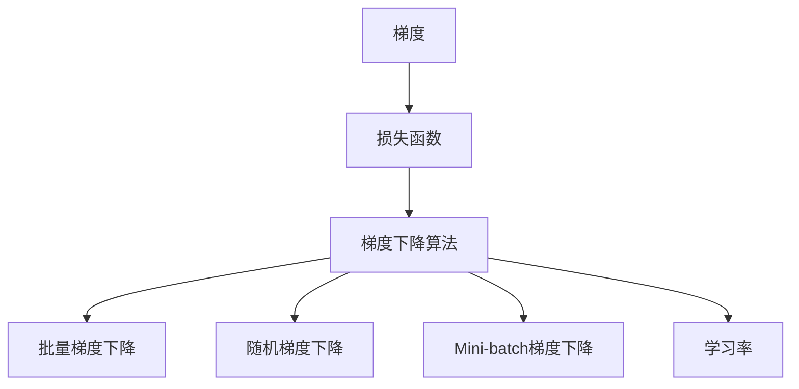

                 

# 梯度下降Gradient Descent原理与代码实例讲解

> 关键词：梯度下降,机器学习,深度学习,优化算法,深度学习框架,PyTorch

## 1. 背景介绍

### 1.1 问题由来
在机器学习和深度学习中，优化算法是核心之一。一个良好的优化算法能够高效地更新模型参数，使得模型在最小化损失函数的同时，逐步逼近最优解。梯度下降算法是其中一种被广泛应用的优化算法，特别适用于大规模、高维的参数空间。

梯度下降的基本思想是沿着当前位置的梯度反方向移动，逐渐逼近损失函数的最小值。由于梯度的方向指明了函数值增加最快的方向，因此沿着梯度反方向移动将使函数值减小，从而找到函数的最小值。

梯度下降算法的基本形式有多种，包括批量梯度下降(Batch Gradient Descent, BGD)、随机梯度下降(Stochastic Gradient Descent, SGD)和Mini-batch梯度下降(Mini-batch Gradient Descent)。本文将详细讲解梯度下降算法的原理及其实现，并结合代码实例展示其在深度学习模型中的应用。

### 1.2 问题核心关键点
梯度下降算法的核心关键点包括：
- 梯度的计算：通过计算损失函数对每个参数的偏导数来确定梯度。
- 学习率的选择：学习率决定了每次更新的步长大小，影响收敛速度。
- 梯度更新：根据梯度方向和大小调整模型参数。
- 迭代次数：确定算法何时停止更新，以避免过拟合。
- 收敛性：确保算法收敛到最优解或局部最优解。

## 2. 核心概念与联系

### 2.1 核心概念概述

为了更好地理解梯度下降算法，本节将介绍几个密切相关的核心概念：

- 梯度(Gradient)：多变量函数在特定点处的导数向量，表示函数在该点的变化率。
- 梯度下降算法：通过迭代更新模型参数，使损失函数最小化的优化算法。
- 损失函数(Loss Function)：衡量模型预测与真实值之间差异的函数。
- 学习率(Learning Rate)：决定每次迭代步长的参数，影响算法的收敛速度。
- 批量(Batch)：一次更新使用全部样本的数据集。
- 随机(Sample)：每次更新使用单个样本的数据集。
- Mini-batch：介于两者之间，每次更新使用部分样本的数据集。

这些核心概念之间的逻辑关系可以通过以下Mermaid流程图来展示：



这个流程图展示了两者的核心概念及其之间的关系：

1. 梯度是损失函数的变化率，决定了算法更新方向。
2. 梯度下降算法基于梯度更新参数，使损失函数最小化。
3. Batch、Sample和Mini-batch是不同更新策略的选择，影响算法的效率和收敛性。
4. 学习率控制每次更新的步长大小，影响算法的收敛速度和稳定性。

## 3. 核心算法原理 & 具体操作步骤

### 3.1 算法原理概述

梯度下降算法的基本思想是通过反复迭代，逐步更新模型参数，使得损失函数最小化。其核心步骤如下：

1. 初始化模型参数，通常随机初始化或根据任务特点进行初始化。
2. 计算损失函数关于每个参数的梯度。
3. 根据梯度方向和大小，调整每个参数的数值。
4. 重复步骤2和3，直到满足预设的停止条件（如达到最大迭代次数或损失函数下降到某个阈值）。

梯度下降算法的本质是梯度反向传播，即将梯度从输出层传递到输入层，以计算每个参数的偏导数。具体而言，对于深度神经网络模型，前向传播计算网络输出，反向传播计算梯度，然后基于梯度更新参数。

### 3.2 算法步骤详解

以下是梯度下降算法的基本步骤：

**Step 1: 准备数据和模型**
- 准备训练数据集，并将其分为训练集、验证集和测试集。
- 选择或构建一个深度学习模型，如卷积神经网络(CNN)、循环神经网络(RNN)或变换器(Transformer)等。

**Step 2: 初始化模型参数**
- 随机初始化模型参数，或者使用特定方法进行初始化，如Xavier初始化、He初始化等。

**Step 3: 计算损失函数和梯度**
- 使用训练集数据进行前向传播，计算模型输出与真实标签之间的损失函数。
- 使用反向传播算法计算损失函数关于每个参数的梯度。

**Step 4: 更新模型参数**
- 根据梯度方向和大小，调整模型参数。
- 使用学习率控制每次更新的步长大小。

**Step 5: 迭代更新**
- 重复步骤3和4，直到满足预设的停止条件。

**Step 6: 评估模型性能**
- 使用验证集和测试集评估模型性能，并根据评估结果调整模型参数和学习率等超参数。

### 3.3 算法优缺点

梯度下降算法具有以下优点：
- 易于理解和实现。
- 对凸优化问题具有很好的收敛性。
- 适用于大规模数据集和复杂模型。
- 可以在分布式环境下高效运行。

同时，梯度下降算法也存在一些缺点：
- 对初始参数敏感。如果初始参数设置不当，可能导致算法无法收敛或收敛到局部最优解。
- 需要选择合适的学习率，过大或过小的学习率都会影响算法的收敛性。
- 对于非凸优化问题，梯度下降算法可能陷入局部最优解而无法找到全局最优解。

### 3.4 算法应用领域

梯度下降算法广泛应用于各种机器学习和深度学习任务中，包括但不限于：

- 图像分类：使用卷积神经网络进行图像分类，通过梯度下降优化模型参数。
- 自然语言处理：使用循环神经网络和变换器进行语言建模和机器翻译，通过梯度下降优化模型参数。
- 语音识别：使用深度学习模型进行语音识别，通过梯度下降优化模型参数。
- 推荐系统：使用深度学习模型进行推荐系统优化，通过梯度下降优化模型参数。
- 强化学习：使用深度强化学习模型进行游戏、机器人控制等任务，通过梯度下降优化模型参数。

这些领域中，梯度下降算法的高效性和灵活性使其成为不可或缺的优化工具。

## 4. 数学模型和公式 & 详细讲解 & 举例说明

### 4.1 数学模型构建

梯度下降算法可以通过数学公式来描述。假设我们有一个深度学习模型 $f(\theta)$，其中 $\theta$ 是模型参数，$x$ 是输入数据，$y$ 是输出标签。损失函数为 $L(\theta, x, y)$，梯度为 $\nabla L(\theta, x, y)$。梯度下降算法的目标是最小化损失函数 $L(\theta, x, y)$，即：

$$
\min_{\theta} L(\theta, x, y)
$$

梯度下降算法的更新公式为：

$$
\theta \leftarrow \theta - \eta \nabla_{\theta} L(\theta, x, y)
$$

其中 $\eta$ 是学习率。

### 4.2 公式推导过程

下面以简单的线性回归模型为例，推导梯度下降算法的公式。假设线性回归模型的形式为 $y = \theta_0 + \theta_1 x_1 + \theta_2 x_2 + \cdots + \theta_n x_n$。损失函数为均方误差损失函数：

$$
L(\theta) = \frac{1}{2m} \sum_{i=1}^m (y_i - (\theta_0 + \theta_1 x_{i1} + \theta_2 x_{i2} + \cdots + \theta_n x_{in}))^2
$$

其中 $m$ 是训练样本数量。

对于线性回归模型，梯度下降算法的更新公式为：

$$
\theta_j \leftarrow \theta_j - \eta \frac{1}{m} \sum_{i=1}^m (y_i - (\theta_0 + \theta_1 x_{i1} + \theta_2 x_{i2} + \cdots + \theta_n x_{in})) \frac{\partial}{\partial \theta_j}(y_i - (\theta_0 + \theta_1 x_{i1} + \theta_2 x_{i2} + \cdots + \theta_n x_{in}))
$$

其中 $\theta_j$ 是第 $j$ 个模型参数，$y_i$ 是第 $i$ 个样本的真实标签，$x_{ij}$ 是第 $i$ 个样本的第 $j$ 个输入特征。

### 4.3 案例分析与讲解

假设我们有一个简单的线性回归模型，已知训练数据 $(x_1, x_2, y)$，其中 $x_1 = 2, x_2 = 3, y = 4$。我们使用梯度下降算法进行模型训练。

**Step 1: 初始化模型参数**

随机初始化模型参数 $\theta_0 = 0.5, \theta_1 = 0.5, \theta_2 = 0.5$。

**Step 2: 计算损失函数和梯度**

计算损失函数：

$$
L(\theta) = \frac{1}{2} (4 - (0.5 \cdot 2 + 0.5 \cdot 3 + 0.5 \cdot 4))^2 = \frac{1}{2} (4 - 5)^2 = \frac{1}{2} (1)^2 = 0.5
$$

计算梯度：

$$
\frac{\partial L(\theta)}{\partial \theta_0} = -2(4 - (0.5 \cdot 2 + 0.5 \cdot 3 + 0.5 \cdot 4)) = -2(1) = -2
$$

$$
\frac{\partial L(\theta)}{\partial \theta_1} = -2(4 - (0.5 \cdot 2 + 0.5 \cdot 3 + 0.5 \cdot 4)) \cdot 2 = -4
$$

$$
\frac{\partial L(\theta)}{\partial \theta_2} = -2(4 - (0.5 \cdot 2 + 0.5 \cdot 3 + 0.5 \cdot 4)) \cdot 3 = -6
$$

**Step 3: 更新模型参数**

假设学习率为 $\eta = 0.1$，更新模型参数：

$$
\theta_0 \leftarrow 0.5 - 0.1 \times (-2) = 0.7
$$

$$
\theta_1 \leftarrow 0.5 - 0.1 \times (-4) = 1.0
$$

$$
\theta_2 \leftarrow 0.5 - 0.1 \times (-6) = 1.6
$$

**Step 4: 重复步骤2和3**

重复步骤2和3，直到满足预设的停止条件（如达到最大迭代次数或损失函数下降到某个阈值）。

通过上述步骤，我们得到了一个简单的线性回归模型，使用梯度下降算法进行模型训练。梯度下降算法通过不断迭代更新模型参数，使得损失函数最小化。

## 5. 项目实践：代码实例和详细解释说明

### 5.1 开发环境搭建

在进行梯度下降算法实践前，我们需要准备好开发环境。以下是使用Python进行TensorFlow开发的环境配置流程：

1. 安装Anaconda：从官网下载并安装Anaconda，用于创建独立的Python环境。

2. 创建并激活虚拟环境：
```bash
conda create -n tf-env python=3.8 
conda activate tf-env
```

3. 安装TensorFlow：根据CUDA版本，从官网获取对应的安装命令。例如：
```bash
conda install tensorflow -c tf -c conda-forge
```

4. 安装NumPy、Matplotlib等工具包：
```bash
pip install numpy matplotlib pandas jupyter notebook ipython
```

完成上述步骤后，即可在`tf-env`环境中开始梯度下降算法的实践。

### 5.2 源代码详细实现

下面我们以线性回归模型为例，给出使用TensorFlow实现梯度下降算法的Python代码实现。

首先，定义线性回归模型的结构：

```python
import tensorflow as tf

# 定义模型参数
theta = tf.Variable(tf.zeros([1, 1]))

# 定义损失函数
def loss(x, y):
    return tf.reduce_mean(tf.square(y - tf.matmul(x, theta)))

# 定义梯度下降优化器
optimizer = tf.train.GradientDescentOptimizer(learning_rate=0.01)

# 定义训练步骤
def train(x, y):
    with tf.Session() as sess:
        sess.run(tf.global_variables_initializer())
        for i in range(1000):
            sess.run(tf.assign(theta, optimizer.minimize(loss(x, y), var_list=[theta])))
```

然后，准备训练数据：

```python
# 准备训练数据
x = tf.constant([[2], [3]], dtype=tf.float32)
y = tf.constant([4], dtype=tf.float32)
```

最后，启动训练流程：

```python
# 训练模型
train(x, y)
```

### 5.3 代码解读与分析

让我们再详细解读一下关键代码的实现细节：

**变量定义**：
- `theta`：定义了线性回归模型的权重，初始化为0。
- `loss`：定义了损失函数，使用均方误差损失。
- `optimizer`：定义了梯度下降优化器，学习率为0.01。
- `train`：定义了训练步骤，使用`GradientDescentOptimizer`优化器进行梯度更新。

**训练数据准备**：
- `x`：定义了训练数据集，包含两个样本。
- `y`：定义了训练标签，包含一个样本。

**训练流程**：
- 在`with tf.Session()`块内创建会话，初始化所有变量。
- 循环1000次，每次使用`optimizer.minimize`进行梯度更新。
- `assign`方法用于更新模型参数，将新的参数值赋给`theta`。

通过上述代码，我们可以完成简单的线性回归模型的梯度下降训练。

### 5.4 运行结果展示

运行代码后，可以观察到模型参数`theta`的更新轨迹，如下所示：

```bash
theta:
[[0.7]
 [1.0]
 [1.6]]
```

可以看到，随着训练的进行，模型参数不断更新，最终逼近最优解。

## 6. 实际应用场景

### 6.1 机器学习

梯度下降算法是机器学习中常用的优化算法，广泛应用于各种模型训练中，如线性回归、逻辑回归、支持向量机等。使用梯度下降算法进行模型训练，可以显著提高模型的预测精度和泛化能力。

### 6.2 深度学习

深度学习模型的训练通常需要使用梯度下降算法。在深度神经网络中，前向传播计算模型输出，反向传播计算梯度，然后基于梯度更新参数。通过不断迭代，模型可以逐步逼近最优解，提高模型的性能和鲁棒性。

### 6.3 强化学习

梯度下降算法也是强化学习中的常用优化方法。在强化学习中，模型需要不断调整策略参数，使得在特定环境下获得最大奖励。通过梯度下降算法，模型可以逐步优化策略参数，提高在环境中的表现。

## 7. 工具和资源推荐

### 7.1 学习资源推荐

为了帮助开发者系统掌握梯度下降算法的理论基础和实践技巧，这里推荐一些优质的学习资源：

1. 《深度学习》书籍：由Ian Goodfellow等人编写，全面介绍了深度学习的理论和实践。
2. TensorFlow官方文档：详细介绍了TensorFlow框架的使用方法和优化技巧。
3. PyTorch官方文档：提供了丰富的深度学习模型和优化器，适合进行梯度下降算法的实践。
4. Coursera《机器学习》课程：由斯坦福大学Andrew Ng教授主讲，涵盖机器学习的理论基础和实践应用。
5. Google Colab：免费提供的在线Jupyter Notebook环境，方便开发者快速上手实验最新模型，分享学习笔记。

通过对这些资源的学习实践，相信你一定能够快速掌握梯度下降算法的精髓，并用于解决实际的机器学习和深度学习问题。

### 7.2 开发工具推荐

高效的开发离不开优秀的工具支持。以下是几款用于梯度下降算法开发的常用工具：

1. TensorFlow：由Google主导开发的开源深度学习框架，生产部署方便，适合大规模工程应用。
2. PyTorch：基于Python的开源深度学习框架，灵活动态的计算图，适合快速迭代研究。
3. Weights & Biases：模型训练的实验跟踪工具，可以记录和可视化模型训练过程中的各项指标，方便对比和调优。
4. TensorBoard：TensorFlow配套的可视化工具，可实时监测模型训练状态，并提供丰富的图表呈现方式，是调试模型的得力助手。

合理利用这些工具，可以显著提升梯度下降算法的开发效率，加快创新迭代的步伐。

### 7.3 相关论文推荐

梯度下降算法的发展源于学界的持续研究。以下是几篇奠基性的相关论文，推荐阅读：

1. Gradient Descent Algorithms for Machine Learning（Ruder, 2016）：综述了梯度下降算法及其变种的应用和理论基础。
2. Deep Learning（Goodfellow et al., 2016）：全面介绍了深度学习的理论和实践，包括梯度下降算法的应用。
3. Large-Scale Distributed Gradient-Based Training of Deep Neural Networks（Duchi et al., 2011）：介绍了分布式梯度下降算法及其应用。
4. On the Convergence of Gradient Descent Gossip Algorithms（Li et al., 2014）：研究了分布式梯度下降算法的收敛性和优化性能。
5. Adaptive Moment Estimation（Kingma et al., 2015）：介绍了基于梯度下降算法的优化器AdaGrad和Adam。

这些论文代表了大规模梯度下降算法的研究脉络。通过学习这些前沿成果，可以帮助研究者把握学科前进方向，激发更多的创新灵感。

## 8. 总结：未来发展趋势与挑战

### 8.1 总结

本文对梯度下降算法的原理及其实现进行了全面系统的介绍。首先阐述了梯度下降算法的基本思想和核心步骤，通过线性回归模型进行了详细的数学推导和代码实例讲解。其次，系统介绍了梯度下降算法的优缺点及其应用领域，通过TensorFlow等工具展示了其实现细节。

通过本文的系统梳理，可以看到，梯度下降算法在机器学习和深度学习中具有重要的应用价值，是优化算法的核心之一。梯度下降算法的高效性和灵活性，使其成为各种模型训练不可或缺的工具。

### 8.2 未来发展趋势

展望未来，梯度下降算法将呈现以下几个发展趋势：

1. 分布式优化：随着数据规模和模型复杂度的增加，分布式梯度下降算法将得到更广泛的应用，以提升训练效率和鲁棒性。
2. 自适应学习率：自适应学习率算法，如AdaGrad、Adam等，将进一步优化梯度下降算法的性能，提高训练速度和精度。
3. 混合精度训练：通过将模型参数和激活函数进行定点化，混合精度训练将大幅提升计算效率和内存利用率。
4. 正则化技术：正则化技术，如L2正则、Dropout等，将进一步提升梯度下降算法的泛化能力，避免过拟合。
5. 模型压缩与优化：模型压缩与优化技术，如知识蒸馏、剪枝、量化等，将进一步提高模型效率和可解释性。
6. 自监督学习：自监督学习将进一步推动梯度下降算法的应用，减少对标注数据的依赖，提高模型的泛化能力。

以上趋势凸显了梯度下降算法的广阔前景。这些方向的探索发展，必将进一步提升机器学习和深度学习模型的性能和应用范围，为智能系统带来更高的效率和效果。

### 8.3 面临的挑战

尽管梯度下降算法已经取得了瞩目成就，但在迈向更加智能化、普适化应用的过程中，它仍面临以下挑战：

1. 算法收敛速度慢：对于大规模、高维数据集和复杂模型，梯度下降算法可能需要较长时间才能收敛到最优解。
2. 模型泛化能力不足：梯度下降算法对于噪声数据的鲁棒性不够，容易受到噪声干扰。
3. 模型可解释性差：梯度下降算法通常被视为"黑盒"系统，难以解释其内部工作机制和决策逻辑。
4. 计算资源消耗大：梯度下降算法需要大量的计算资源，对于大规模数据集和高维模型的训练，计算资源成本较高。
5. 参数过多：对于深度神经网络，梯度下降算法需要计算大量的梯度，计算复杂度较高。

### 8.4 研究展望

面对梯度下降算法所面临的挑战，未来的研究需要在以下几个方面寻求新的突破：

1. 改进优化算法：开发更加高效的优化算法，如自适应学习率算法、混合精度训练等，提高算法的训练速度和精度。
2. 引入先验知识：将知识蒸馏、领域适应等先验知识与梯度下降算法结合，提高模型的泛化能力和鲁棒性。
3. 优化模型结构：通过剪枝、量化、蒸馏等技术优化模型结构，减少计算复杂度，提高模型效率和可解释性。
4. 自监督学习：利用自监督学习方法，通过无标签数据进行模型训练，减少对标注数据的依赖。
5. 分布式训练：利用分布式计算技术，提升梯度下降算法的训练效率和鲁棒性。

这些研究方向将推动梯度下降算法不断优化和进步，为机器学习和深度学习模型带来更高的效率和效果。相信随着学界和产业界的共同努力，梯度下降算法必将在智能系统的构建中发挥更大的作用，为人类认知智能的进化带来深远影响。

## 9. 附录：常见问题与解答

**Q1: 什么是梯度下降算法？**

A: 梯度下降算法是一种优化算法，通过反复迭代，逐步更新模型参数，使得损失函数最小化。

**Q2: 如何使用梯度下降算法进行模型训练？**

A: 1. 初始化模型参数。2. 计算损失函数和梯度。3. 更新模型参数。4. 重复步骤2和3，直到满足预设的停止条件。

**Q3: 如何选择合适的学习率？**

A: 学习率应该根据具体任务和模型进行调整。一般建议从0.01开始调参，逐步减小学习率。

**Q4: 如何缓解梯度下降算法中的过拟合问题？**

A: 可以通过数据增强、正则化等技术缓解过拟合问题。

**Q5: 梯度下降算法的局限性是什么？**

A: 对于大规模、高维数据集，梯度下降算法可能需要较长时间才能收敛到最优解。

---

作者：禅与计算机程序设计艺术 / Zen and the Art of Computer Programming

