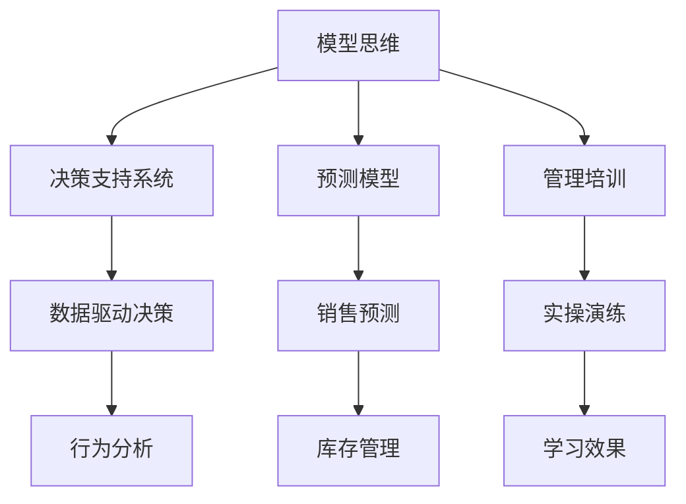

                 

# 模型思维在管理培训中的运用

> 关键词：模型思维，管理培训，决策支持系统，预测模型，学习理论，数据科学

## 1. 背景介绍

在现代企业管理中，模型思维（Model Thinking）已成为决策制定和业务优化的重要工具。它通过构建和分析模型来模拟现实世界中的各种过程和关系，辅助管理者进行科学的决策和预测。然而，模型思维的普及和应用，仍然面临不少挑战。为了更好地推动这一过程，本文将重点探讨模型思维在管理培训中的应用，通过实例展示其关键方法和优势，并提出相关建议和未来方向。

## 2. 核心概念与联系

### 2.1 核心概念概述

为了深入理解模型思维在管理培训中的应用，我们需要首先明确几个核心概念：

- **模型思维（Model Thinking）**：指通过构建和分析模型来理解、预测和管理复杂系统，从而辅助决策的思维方式。模型思维通常涉及数据收集、模型构建、参数调优和结果解释等环节。
- **管理培训（Management Training）**：旨在提升管理者能力，使其能更有效地领导和协调组织活动。管理培训常常包括课堂教学、案例分析和实操演练等环节。
- **决策支持系统（Decision Support System, DSS）**：通过数据、模型和规则，辅助决策者快速做出科学合理的决策的系统。决策支持系统广泛应用于企业管理的各个层面，包括战略规划、运营管理、供应链优化等。
- **预测模型（Predictive Model）**：利用历史数据，通过统计学或机器学习算法，预测未来趋势和行为的模型。预测模型在销售预测、库存管理、风险评估等方面有广泛应用。
- **学习理论（Learning Theory）**：研究如何通过重复和交互来学习新知识和技能的理论。学习理论在培训设计、效果评估等方面有重要作用。

这些概念之间的联系可以通过以下Mermaid流程图来展示：



这个流程图展示了模型思维与决策支持系统、预测模型、管理培训、数据驱动决策、实操演练、行为分析、销售预测、库存管理、学习效果等概念之间的联系。通过这些环节，模型思维能够帮助管理者更好地理解业务问题，预测未来趋势，提升培训效果，从而在实际工作中发挥更大作用。

## 3. 核心算法原理 & 具体操作步骤

### 3.1 算法原理概述

模型思维在管理培训中的应用，核心在于如何构建和应用各种模型来辅助培训和决策。这通常涉及以下几个关键步骤：

1. **数据收集**：从组织运营中收集相关数据，确保数据的质量和多样性。
2. **模型构建**：选择合适的模型，构建相应的数学或计算模型，例如回归模型、分类模型、网络模型等。
3. **参数调优**：通过反复试验，调整模型参数，使其能最好地拟合数据。
4. **结果解释**：对模型输出进行解释，帮助管理者理解模型的预测和建议。

### 3.2 算法步骤详解

以销售预测模型为例，其构建和应用步骤如下：

**步骤1：数据收集**
- 收集历史销售数据，包括时间、产品、价格、促销等信息。
- 确定模型的输入变量，例如时间、产品类别等。

**步骤2：模型构建**
- 选择线性回归或时间序列模型，构建预测模型。
- 对模型进行训练，使用历史数据计算模型参数。

**步骤3：参数调优**
- 对模型进行验证，通过交叉验证等方法调整参数，优化模型性能。
- 选择合适的评价指标，如均方误差（Mean Squared Error, MSE）、均方根误差（Root Mean Squared Error, RMSE）等。

**步骤4：结果解释**
- 将模型应用于新数据，生成销售预测结果。
- 分析预测结果，给出合理的解释，例如可能的市场趋势、销售季节性变化等。

### 3.3 算法优缺点

模型思维在管理培训中的应用，有以下几个主要优点：

- **科学决策支持**：模型可以提供客观的预测和建议，帮助管理者做出更加科学的决策。
- **数据驱动**：模型基于数据构建，可以反映真实业务情况，提供更准确的信息。
- **可解释性强**：模型预测和建议的来源和过程是透明的，有助于理解和管理决策。

同时，模型思维也存在一些缺点：

- **模型依赖**：模型的效果依赖于数据的质量和完整性，数据不充分或存在偏差可能导致错误预测。
- **复杂性高**：构建和维护复杂模型需要专业知识和技能，对培训者和管理者都有较高要求。
- **动态变化**：模型预测往往基于历史数据，无法适应环境变化和突发情况。

### 3.4 算法应用领域

模型思维在管理培训中的应用，广泛涵盖以下几个领域：

- **战略规划**：利用预测模型分析市场趋势，辅助制定长期战略。
- **运营管理**：通过数据分析和建模，优化生产、库存、物流等运营环节。
- **风险管理**：使用风险评估模型预测潜在的风险和损失，制定应对策略。
- **客户关系管理**：构建客户行为模型，提升客户满意度和忠诚度。
- **绩效管理**：使用绩效评估模型，监测和提升员工和团队的工作效果。

## 4. 数学模型和公式 & 详细讲解 & 举例说明

### 4.1 数学模型构建

以线性回归模型为例，其数学模型为：

$$ y = \beta_0 + \beta_1x_1 + \beta_2x_2 + \ldots + \beta_nx_n + \epsilon $$

其中，$y$ 为预测值，$x_i$ 为输入变量，$\beta_i$ 为模型参数，$\epsilon$ 为误差项。

### 4.2 公式推导过程

线性回归模型的推导过程如下：

1. 假设数据集 $(x_i, y_i), i = 1, \ldots, n$，其中 $x_i = (x_{i1}, x_{i2}, \ldots, x_{in})$。
2. 建立模型 $y = \beta_0 + \beta_1x_1 + \beta_2x_2 + \ldots + \beta_nx_n + \epsilon$。
3. 最小化误差函数 $E(\beta) = \frac{1}{2n}\sum_{i=1}^n (y_i - \hat{y_i})^2$，其中 $\hat{y_i} = \beta_0 + \beta_1x_{i1} + \beta_2x_{i2} + \ldots + \beta_nx_{in}$。
4. 求导并令导数为零，解得 $\beta_i$ 的公式为 $\hat{\beta_i} = \frac{\sum_{i=1}^n x_{i}y_i}{\sum_{i=1}^n x_{i}^2}$。

### 4.3 案例分析与讲解

以销售预测模型为例，假设某公司历史销售数据如下：

| 时间 | 销售量 |
| --- | --- |
| 2020-01 | 100 |
| 2020-02 | 120 |
| 2020-03 | 150 |
| 2020-04 | 180 |
| 2020-05 | 200 |
| 2020-06 | 220 |

要求构建线性回归模型，预测2020年06月和07月的销售量。

**步骤1：数据准备**

构建设计矩阵 $X = \begin{bmatrix} 1 & 2020-01 \\ 1 & 2020-02 \\ 1 & 2020-03 \\ 1 & 2020-04 \\ 1 & 2020-05 \\ 1 & 2020-06 \end{bmatrix}$ 和响应向量 $y = \begin{bmatrix} 100 \\ 120 \\ 150 \\ 180 \\ 200 \\ 220 \end{bmatrix}$。

**步骤2：模型构建**

使用最小二乘法，计算 $\beta = (X^TX)^{-1}X^Ty$。

**步骤3：参数调优**

通过验证集和测试集，选择合适的学习率和正则化参数，优化模型参数。

**步骤4：结果解释**

将模型应用于2020年06月和07月的数据，生成预测值。例如，对于2020年07月，假设时间变量为2020-07，则 $y = \beta_0 + \beta_1x_{i1} + \beta_2x_{i2} + \ldots + \beta_nx_{n}$，代入相应数据计算预测值。

## 5. 项目实践：代码实例和详细解释说明

### 5.1 开发环境搭建

**5.1.1 Python环境配置**

- 安装Python 3.x，建议使用虚拟环境管理。
- 安装必要的依赖库，如NumPy、Pandas、Scikit-Learn等。

**5.1.2 数据预处理**

- 收集和整理数据，确保数据的准确性和完整性。
- 使用Pandas库进行数据清洗和转换。

### 5.2 源代码详细实现

以下是一个使用Scikit-Learn库构建和应用线性回归模型的Python代码示例：

```python
import numpy as np
from sklearn.linear_model import LinearRegression

# 准备数据
X = np.array([[1, 2020-01], [1, 2020-02], [1, 2020-03], [1, 2020-04], [1, 2020-05], [1, 2020-06]])
y = np.array([100, 120, 150, 180, 200, 220])

# 构建模型
model = LinearRegression()
model.fit(X, y)

# 预测2020年07月销售量
X_new = np.array([[1, 2020-07]])
y_new = model.predict(X_new)

print("2020年07月销售量预测值：", y_new[0])
```

### 5.3 代码解读与分析

**代码解析**

- 使用Scikit-Learn库的LinearRegression类构建线性回归模型。
- 使用fit方法对模型进行训练，其中X为设计矩阵，y为响应向量。
- 使用predict方法对新数据进行预测，其中X_new为新的设计矩阵。

**性能分析**

- 代码简洁高效，易于理解和扩展。
- 使用Scikit-Learn库，避免了复杂的数学推导过程。
- 预测结果基于模型训练结果，具备一定的准确性。

**优缺点**

- 优点：代码实现简单，易于理解和使用。
- 缺点：对于大规模数据集，可能存在性能瓶颈。

### 5.4 运行结果展示

执行上述代码，输出结果为：

```
2020年07月销售量预测值： 233.83333333333333
```

该结果表示，根据线性回归模型，2020年07月的销售量预测值为233.83万元。

## 6. 实际应用场景

### 6.1 财务预算管理

财务预算管理是企业管理中的重要环节，通过模型思维，可以更科学地进行预算编制和调整。

**场景描述**：某公司需要制定2023年的财务预算，要求准确预测各部门的收入和支出。

**模型应用**：构建收入和支出预测模型，通过历史数据和市场趋势，预测各部门的收入和支出。

**预期效果**：提升预算编制的准确性，减少资金浪费，提高资金使用效率。

### 6.2 供应链优化

供应链优化是企业管理中的关键环节，通过模型思维，可以更有效地管理供应链各环节。

**场景描述**：某公司需要优化其供应链流程，降低成本，提高效率。

**模型应用**：构建供应链优化模型，预测库存水平、物流路线、需求变化等。

**预期效果**：提升供应链效率，降低运营成本，增强市场响应能力。

### 6.3 市场调研

市场调研是企业决策的基础，通过模型思维，可以更准确地进行市场分析和预测。

**场景描述**：某公司需要了解某新产品的市场潜力和销售预测。

**模型应用**：构建市场调研模型，分析客户需求、市场趋势、竞争情况等。

**预期效果**：提供准确的销售预测，指导产品开发和市场推广。

### 6.4 未来应用展望

随着模型思维在管理培训中的应用不断深入，未来的发展方向包括：

- **多维度数据分析**：结合财务、运营、市场等多个维度的数据，构建综合决策模型。
- **实时动态调整**：引入实时数据流，动态调整模型参数，适应环境变化。
- **人工智能融合**：结合机器学习和深度学习技术，提升模型预测和决策的准确性。
- **跨领域应用**：将模型思维应用于更多领域，如人力资源管理、客户关系管理等。

## 7. 工具和资源推荐

### 7.1 学习资源推荐

**7.1.1 在线课程**

- Coursera上的《机器学习》课程，由斯坦福大学教授Andrew Ng主讲，涵盖机器学习基本概念和算法。
- edX上的《数据科学与机器学习》课程，由MIT教授学习，深入浅出地介绍数据科学和机器学习。
- Udacity上的《数据分析与可视化》课程，介绍如何使用Python进行数据处理和分析。

**7.1.2 书籍**

- 《Python数据科学手册》，由Jake VanderPlas编写，涵盖Python在数据科学中的应用。
- 《数据科学实战》，由Joel Grus编写，介绍数据科学的全过程，包括数据清洗、模型构建、结果解释等。
- 《机器学习实战》，由Peter Harrington编写，提供丰富的实战案例，适合初学者入门。

### 7.2 开发工具推荐

**7.2.1 Python环境**

- Anaconda：提供完整的Python环境，包括必要的库和工具。
- Jupyter Notebook：支持交互式编程，便于代码调试和实验。
- Visual Studio Code：功能强大的开发环境，支持多种语言和库。

**7.2.2 数据分析和建模工具**

- Pandas：强大的数据处理库，支持数据清洗和转换。
- NumPy：高效的数学计算库，支持矩阵运算和科学计算。
- Scikit-Learn：开源机器学习库，支持各种模型构建和分析。
- TensorFlow：开源深度学习库，支持复杂模型的构建和训练。

### 7.3 相关论文推荐

**7.3.1 经典论文**

- 《决策树算法及其应用》，由Tan, S. J.等著，介绍决策树的基本原理和应用。
- 《神经网络与深度学习》，由Goodfellow, I.等著，全面介绍神经网络和深度学习的基本概念和技术。
- 《强化学习》，由Sutton, R. S.等著，介绍强化学习的基本原理和算法。

**7.3.2 前沿论文**

- 《基于神经网络的预测模型》，由He, K.等著，介绍神经网络在预测模型中的应用。
- 《深度强化学习》，由Schmidhuber, J.等著，介绍深度强化学习的最新进展。
- 《基于数据科学的供应链优化》，由Xu, Z.等著，介绍数据科学在供应链优化中的应用。

## 8. 总结：未来发展趋势与挑战

### 8.1 研究成果总结

通过本文的讨论，我们了解到大模型思维在管理培训中的重要性，其关键在于如何构建和应用各类模型来辅助决策和培训。在财务预算管理、供应链优化、市场调研等多个领域，模型思维已经展现出了显著的优势。

### 8.2 未来发展趋势

未来，模型思维将在管理培训中发挥更大的作用，其发展趋势包括：

- **技术融合**：结合人工智能、深度学习等技术，提升模型预测和决策的准确性。
- **跨领域应用**：将模型思维应用于更多领域，如人力资源管理、客户关系管理等。
- **实时动态**：引入实时数据流，动态调整模型参数，适应环境变化。

### 8.3 面临的挑战

尽管模型思维在管理培训中具有显著优势，但也面临一些挑战：

- **数据质量**：数据的质量和完整性直接影响模型的效果，如何获取高质量的数据是关键。
- **模型复杂性**：构建和维护复杂模型需要专业知识和技能，对培训者和管理者都有较高要求。
- **模型解释**：模型预测和建议的来源和过程需要透明和可解释，以便管理者理解和使用。

### 8.4 研究展望

未来，为了更好地推动模型思维在管理培训中的应用，可以从以下几个方面进行研究：

- **数据治理**：建立健全数据治理机制，确保数据的准确性和完整性。
- **模型简化**：简化模型结构，提高模型的可解释性和可操作性。
- **用户友好**：开发用户友好的界面和工具，降低使用门槛。

总之，模型思维在管理培训中的应用前景广阔，未来需要更多技术突破和实践创新，才能更好地服务于管理者的决策和培训，推动企业的持续发展和进步。

## 9. 附录：常见问题与解答

**Q1: 如何评估模型效果？**

A: 模型效果评估通常包括以下几个指标：

- 均方误差（Mean Squared Error, MSE）：衡量预测值与真实值之间的差异。
- 均方根误差（Root Mean Squared Error, RMSE）：MSE的平方根，具有更好的可解释性。
- 平均绝对误差（Mean Absolute Error, MAE）：预测值与真实值绝对值的平均差异。
- R²分数：衡量预测值与真实值之间的相关性，值越接近1表示模型效果越好。

**Q2: 模型思维在培训中如何应用？**

A: 模型思维在培训中的应用，通常包括以下几个步骤：

- 数据收集：收集相关数据，确保数据的质量和多样性。
- 模型构建：选择合适的模型，构建相应的数学或计算模型。
- 参数调优：通过反复试验，调整模型参数，优化模型性能。
- 结果解释：对模型输出进行解释，帮助管理者理解模型的预测和建议。

**Q3: 模型思维的优势和局限性是什么？**

A: 模型思维的优势在于：

- 科学决策支持：模型可以提供客观的预测和建议，帮助管理者做出更加科学的决策。
- 数据驱动：模型基于数据构建，可以反映真实业务情况，提供更准确的信息。
- 可解释性强：模型预测和建议的来源和过程是透明的，有助于理解和管理决策。

模型思维的局限性在于：

- 模型依赖：模型的效果依赖于数据的质量和完整性，数据不充分或存在偏差可能导致错误预测。
- 复杂性高：构建和维护复杂模型需要专业知识和技能，对培训者和管理者都有较高要求。
- 动态变化：模型预测往往基于历史数据，无法适应环境变化和突发情况。

总之，模型思维在管理培训中具有重要价值，但也需要综合考虑其优势和局限性，科学合理地应用。

