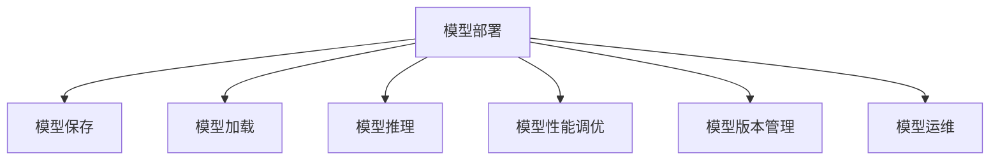

                 

# 模型部署与服务化原理与代码实战案例讲解

> 关键词：模型部署, 服务化, 原理与代码, 实战案例

## 1. 背景介绍

### 1.1 问题由来
随着人工智能(AI)技术的飞速发展，越来越多的AI模型被应用于各种实际场景中。然而，将模型部署到生产环境并保证其高性能、高可用性，是AI应用落地的关键一步。模型部署不仅包括模型的保存、加载、推理等基本操作，还需要考虑模型性能监控、版本管理、运维调度等问题。服务化则是将模型部署到更高效、更灵活、更可维护的云服务中，进一步提升AI应用的价值。

### 1.2 问题核心关键点
模型部署和服务化是大数据、人工智能应用落地的核心技术，其关键点包括：
- 模型格式：模型格式的选择直接影响模型部署和使用的效率，需要兼顾模型的通用性和易用性。
- 模型保存与加载：高效的模型保存格式和加载方法，能够大幅提升模型推理速度。
- 模型推理：高效的推理引擎和加速技术，可以大幅提升模型服务性能。
- 模型监控与调优：持续的模型性能监控和调优，确保模型在实际应用中能够稳定高效运行。
- 模型运维：持续的模型版本管理、配置更新、异常处理等运维操作，保证模型的持续可用性。

### 1.3 问题研究意义
模型部署和服务化技术的成功应用，将极大地提升AI应用的效率和效果。通过良好的模型部署和服务化实践，可以：
- 降低开发和运维成本。减少手动部署和运维的工作量，提升开发效率。
- 提升模型性能。通过优化模型部署和服务化流程，提升模型推理速度和稳定性。
- 增强模型可维护性。通过版本管理、持续集成、持续部署等技术，提升模型应用的生命周期管理能力。
- 加速应用迭代。通过模型服务化和云平台支持，快速响应业务需求变化，提升应用迭代速度。
- 提高应用可靠性。通过模型服务化，增强应用的鲁棒性和可用性，提升用户体验。

## 2. 核心概念与联系

### 2.1 核心概念概述

为更好地理解模型部署和服务化的核心技术，本节将介绍几个密切相关的核心概念：

- 模型部署(Model Deployment)：指将模型从开发环境部署到生产环境的过程，包括模型的保存、加载、推理等基本操作。
- 模型服务化(Model Service)：指将模型部署到云服务上，通过API或Web服务的形式提供模型推理服务，方便业务系统调用。
- 模型性能调优(Model Performance Optimization)：指通过模型优化、性能监控、配置调优等技术手段，提升模型推理性能和稳定性。
- 模型版本管理(Model Version Management)：指对模型的不同版本进行管理，包括版本控制、版本切换、版本回滚等操作。
- 模型运维(Model Operations)：指对模型进行持续的运维管理，包括模型监控、异常处理、版本更新等操作。

这些核心概念之间的逻辑关系可以通过以下Mermaid流程图来展示：



这个流程图展示了大模型部署和服务化的核心概念及其之间的关系：

1. 模型部署是整个过程的起点，包括模型的保存、加载和推理等基本操作。
2. 模型保存和加载是模型部署的重要组成部分，决定了模型部署的效率和易用性。
3. 模型推理是模型部署的核心目标，通过高效的推理引擎和加速技术，提升模型性能。
4. 模型性能调优是保证模型在实际应用中稳定高效运行的关键技术。
5. 模型版本管理和运维是模型部署和服务化的重要保障，确保模型的持续可用性。

这些核心概念共同构成了模型部署和服务化的基础框架，使得AI模型能够顺利落地应用。

## 3. 核心算法原理 & 具体操作步骤

### 3.1 算法原理概述

模型部署和服务化的核心原理是将模型转换为可部署的形式，并通过高效的保存、加载和推理技术，使得模型能够快速、稳定地运行在生产环境中。具体而言，模型部署和服务化包括以下几个关键步骤：

1. **模型保存**：将训练好的模型参数和相关元数据保存到指定格式的文件中。
2. **模型加载**：将模型参数从保存的文件中加载到内存中，恢复模型的初始状态。
3. **模型推理**：利用模型参数进行推理计算，得到模型的输出结果。
4. **模型性能调优**：通过优化模型结构、改进推理算法、应用加速技术等手段，提升模型的推理性能。
5. **模型版本管理**：对模型进行版本控制，管理不同版本的模型，确保模型的稳定性和可用性。
6. **模型运维**：持续监控模型性能，进行异常处理和版本更新，保证模型的持续可用性。

### 3.2 算法步骤详解

模型部署和服务化的一般流程如下：

**Step 1: 选择模型保存格式**
- 常见的模型保存格式包括ONNX、TensorFlow SavedModel、PyTorch模型文件等。不同格式的优缺点如下：
  - ONNX格式：跨平台、跨语言，支持多种深度学习框架，适用于模型迁移和共享。
  - TensorFlow SavedModel：专为TensorFlow设计，支持动态图和静态图，易于在TensorFlow生态系统中使用。
  - PyTorch模型文件：专为PyTorch设计，支持动态图和静态图，适用于PyTorch生态系统。

**Step 2: 模型保存与加载**
- 使用保存工具将模型参数和元数据保存到指定格式的文件中。例如，使用ONNX格式保存模型：
```python
import onnxruntime as ort
import torch

# 加载模型
model = torch.load('model.pth')

# 将模型转换为ONNX格式并保存
onnx_model = torch.onnx.export(model, inputs, 'model.onnx', operator_export_type=torch.onnx.OperatorExportTypes.ONNX_ATEN_FALLBACK, input_names=['input'], output_names=['output'], dynamic_axes={k:None for k in model.named_buffers()})
```

- 使用加载工具将模型参数从保存的文件中加载到内存中。例如，使用TensorFlow SavedModel加载模型：
```python
import tensorflow as tf

# 加载模型
model = tf.keras.models.load_model('model.h5')
```

**Step 3: 模型推理**
- 使用推理工具进行模型推理计算，得到模型的输出结果。例如，使用ONNX Runtime进行模型推理：
```python
import onnxruntime as ort

# 创建推理会话
session = ort.InferenceSession('model.onnx')

# 准备输入数据
input_data = {'input': input_data}

# 进行推理计算
output_data = session.run(None, input_data)
```

**Step 4: 模型性能调优**
- 优化模型结构、改进推理算法、应用加速技术等手段，提升模型的推理性能。例如，使用TensorFlow的模型优化器进行优化：
```python
from tensorflow.keras.optimizers import Adam

# 定义优化器
optimizer = Adam()

# 进行模型优化
model.compile(optimizer=optimizer, loss='mse')
```

**Step 5: 模型版本管理**
- 对模型进行版本控制，管理不同版本的模型，确保模型的稳定性和可用性。例如，使用Git进行版本控制：
```python
import git

# 初始化Git仓库
repo = git.Repo('model-repo')
```

**Step 6: 模型运维**
- 持续监控模型性能，进行异常处理和版本更新，保证模型的持续可用性。例如，使用Prometheus进行性能监控：
```python
from prometheus_client import Gauge

# 定义性能指标
g = Gauge('model_latency', 'Model latency')

# 监控模型性能
def monitor(model):
    # 获取模型推理时间
    latency = get_model_latency(model)
    # 更新性能指标
    g.set(latency)
```

### 3.3 算法优缺点

模型部署和服务化具有以下优点：
- 提高模型部署效率。模型保存、加载和推理等操作自动化，减少了手动部署的工作量。
- 提升模型性能。通过优化模型结构和推理算法，提升模型的推理速度和精度。
- 增强模型可维护性。通过版本控制和持续集成等技术，提升模型的生命周期管理能力。
- 加速应用迭代。通过模型服务化，快速响应业务需求变化，提升应用迭代速度。
- 提高应用可靠性。通过持续监控和异常处理，保证模型的持续可用性。

同时，该方法也存在一定的局限性：
- 对平台依赖性较高。不同平台支持的模型保存格式和工具不同，模型部署可能存在兼容性问题。
- 模型加载和推理效率受限。大模型体积较大，加载和推理速度较慢，可能需要应用加速技术。
- 需要持续维护。模型部署和服务化需要持续监控和调优，工作量较大。
- 安全性问题。模型部署和服务化过程中，需要考虑模型的安全性和隐私保护，避免数据泄露等安全问题。

尽管存在这些局限性，但就目前而言，模型部署和服务化仍然是AI应用落地的主流范式。未来相关研究的重点在于如何进一步降低部署成本，提高模型部署效率和性能，同时兼顾模型的可维护性和安全性等因素。

### 3.4 算法应用领域

模型部署和服务化技术广泛应用于各种AI应用领域，例如：

- 计算机视觉：图像分类、目标检测、人脸识别等任务的模型部署和服务化。
- 自然语言处理：文本分类、机器翻译、对话系统等任务的模型部署和服务化。
- 语音识别：语音识别、语音合成、情感分析等任务的模型部署和服务化。
- 推荐系统：推荐算法、商品推荐、广告推荐等任务的模型部署和服务化。
- 游戏开发：游戏中的AI角色、智能策略等模型的部署和服务化。
- 医疗诊断：医学影像分析、病理分析等任务的模型部署和服务化。
- 智能制造：智能控制系统、质量检测等任务的模型部署和服务化。

除了这些经典任务外，模型部署和服务化方法还在更多新兴领域得到应用，如智慧城市、智能交通、智能家居等，为各行各业带来新的技术突破。

## 4. 数学模型和公式 & 详细讲解

### 4.1 数学模型构建

模型部署和服务化涉及的数学模型主要包括以下几个方面：

- 模型参数保存与加载：模型的参数保存在模型保存格式中，如ONNX格式、TensorFlow SavedModel格式、PyTorch模型文件等。这些格式都有对应的参数保存格式和加载方法。
- 模型推理：模型推理涉及矩阵乘法、卷积、激活函数等基本运算，可以使用深度学习框架提供的自动微分工具进行高效计算。
- 模型性能调优：模型性能调优涉及模型结构优化、推理算法优化、加速技术应用等，需要借助工具进行自动化调优。
- 模型版本管理：模型版本管理涉及版本控制、版本切换、版本回滚等操作，可以通过版本控制系统实现。
- 模型运维：模型运维涉及性能监控、异常处理、版本更新等操作，可以通过监控系统实现。

### 4.2 公式推导过程

以下我们以TensorFlow为例，推导TensorFlow模型保存和加载的原理：

**模型保存**

```python
# 保存模型到TensorFlow SavedModel格式
import tensorflow as tf

# 创建会话
sess = tf.Session()

# 定义模型
x = tf.placeholder(tf.float32, [None, 784])
y_ = tf.placeholder(tf.float32, [None, 10])
W = tf.Variable(tf.zeros([784, 10]))
b = tf.Variable(tf.zeros([10]))
y = tf.nn.softmax(tf.matmul(x, W) + b)

# 定义损失函数和优化器
cross_entropy = tf.reduce_mean(-tf.reduce_sum(y_ * tf.log(y), reduction_indices=[1]))
train_step = tf.train.GradientDescentOptimizer(0.5).minimize(cross_entropy)

# 训练模型
sess.run(tf.global_variables_initializer())
for i in range(1000):
    batch_xs, batch_ys = mnist.train.next_batch(100)
    sess.run(train_step, feed_dict={x: batch_xs, y_: batch_ys})

# 保存模型
tf.saved_model.save(sess, 'model')
```

**模型加载**

```python
# 加载模型到TensorFlow SavedModel格式
import tensorflow as tf

# 创建会话
sess = tf.Session()

# 加载模型
model = tf.saved_model.load('model')
```

### 4.3 案例分析与讲解

**案例分析：TensorFlow模型保存与加载**

- **模型保存**
```python
# 保存模型到TensorFlow SavedModel格式
import tensorflow as tf

# 创建会话
sess = tf.Session()

# 定义模型
x = tf.placeholder(tf.float32, [None, 784])
y_ = tf.placeholder(tf.float32, [None, 10])
W = tf.Variable(tf.zeros([784, 10]))
b = tf.Variable(tf.zeros([10]))
y = tf.nn.softmax(tf.matmul(x, W) + b)

# 定义损失函数和优化器
cross_entropy = tf.reduce_mean(-tf.reduce_sum(y_ * tf.log(y), reduction_indices=[1]))
train_step = tf.train.GradientDescentOptimizer(0.5).minimize(cross_entropy)

# 训练模型
sess.run(tf.global_variables_initializer())
for i in range(1000):
    batch_xs, batch_ys = mnist.train.next_batch(100)
    sess.run(train_step, feed_dict={x: batch_xs, y_: batch_ys})

# 保存模型
tf.saved_model.save(sess, 'model')
```

- **模型加载**
```python
# 加载模型到TensorFlow SavedModel格式
import tensorflow as tf

# 创建会话
sess = tf.Session()

# 加载模型
model = tf.saved_model.load('model')
```

## 5. 项目实践：代码实例和详细解释说明

### 5.1 开发环境搭建

在进行模型部署和服务化实践前，我们需要准备好开发环境。以下是使用Python进行TensorFlow开发的环境配置流程：

1. 安装Anaconda：从官网下载并安装Anaconda，用于创建独立的Python环境。

2. 创建并激活虚拟环境：
```bash
conda create -n tf-env python=3.8 
conda activate tf-env
```

3. 安装TensorFlow：根据CUDA版本，从官网获取对应的安装命令。例如：
```bash
conda install tensorflow=2.7 -c conda-forge
```

4. 安装各类工具包：
```bash
pip install numpy pandas scikit-learn matplotlib tqdm jupyter notebook ipython
```

完成上述步骤后，即可在`tf-env`环境中开始模型部署和服务化实践。

### 5.2 源代码详细实现

下面我们以TensorFlow模型保存和加载为例，给出完整的代码实现。

首先，定义模型和训练函数：

```python
import tensorflow as tf
from tensorflow.keras.datasets import mnist
from tensorflow.keras.models import Sequential
from tensorflow.keras.layers import Dense, Dropout

# 定义模型
model = Sequential([
    Dense(256, input_dim=784, activation='relu'),
    Dropout(0.4),
    Dense(10, activation='softmax')
])

# 定义损失函数和优化器
loss_fn = tf.keras.losses.categorical_crossentropy
optimizer = tf.keras.optimizers.Adam()

# 训练模型
def train(model, data, labels, epochs):
    for epoch in range(epochs):
        for x, y in data:
            with tf.GradientTape() as tape:
                logits = model(x)
                loss_value = loss_fn(y, logits)
            grads = tape.gradient(loss_value, model.trainable_variables)
            optimizer.apply_gradients(zip(grads, model.trainable_variables))
```

然后，进行模型训练和保存：

```python
# 加载数据
(x_train, y_train), (x_test, y_test) = mnist.load_data()

# 数据预处理
x_train, x_test = x_train / 255.0, x_test / 255.0
x_train = x_train.reshape(x_train.shape[0], -1)

# 模型训练
train(model, (x_train, y_train), epochs=10)

# 保存模型到TensorFlow SavedModel格式
saved_model_path = 'model'
tf.saved_model.save(model, saved_model_path)
```

最后，进行模型加载和推理：

```python
# 加载模型到TensorFlow SavedModel格式
loaded_model = tf.saved_model.load(saved_model_path)

# 加载测试数据
x_test = x_test.reshape(x_test.shape[0], -1)

# 进行推理计算
logits = loaded_model(x_test)
preds = tf.argmax(logits, axis=1)
```

### 5.3 代码解读与分析

让我们再详细解读一下关键代码的实现细节：

**定义模型**

```python
import tensorflow as tf
from tensorflow.keras.datasets import mnist
from tensorflow.keras.models import Sequential
from tensorflow.keras.layers import Dense, Dropout

# 定义模型
model = Sequential([
    Dense(256, input_dim=784, activation='relu'),
    Dropout(0.4),
    Dense(10, activation='softmax')
])
```

- `Sequential`：定义模型结构为线性堆叠。
- `Dense`：定义全连接层，包含256个神经元，激活函数为ReLU。
- `Dropout`：定义dropout层，随机丢弃40%的神经元，防止过拟合。
- `Dense`：定义输出层，包含10个神经元，激活函数为softmax，输出概率分布。

**定义损失函数和优化器**

```python
import tensorflow as tf
from tensorflow.keras.datasets import mnist
from tensorflow.keras.models import Sequential
from tensorflow.keras.layers import Dense, Dropout

# 定义损失函数和优化器
loss_fn = tf.keras.losses.categorical_crossentropy
optimizer = tf.keras.optimizers.Adam()
```

- `tf.keras.losses.categorical_crossentropy`：定义交叉熵损失函数。
- `tf.keras.optimizers.Adam`：定义Adam优化器，学习率为0.001。

**训练模型**

```python
import tensorflow as tf
from tensorflow.keras.datasets import mnist
from tensorflow.keras.models import Sequential
from tensorflow.keras.layers import Dense, Dropout

# 定义模型
model = Sequential([
    Dense(256, input_dim=784, activation='relu'),
    Dropout(0.4),
    Dense(10, activation='softmax')
])

# 定义损失函数和优化器
loss_fn = tf.keras.losses.categorical_crossentropy
optimizer = tf.keras.optimizers.Adam()

# 训练模型
def train(model, data, labels, epochs):
    for epoch in range(epochs):
        for x, y in data:
            with tf.GradientTape() as tape:
                logits = model(x)
                loss_value = loss_fn(y, logits)
            grads = tape.gradient(loss_value, model.trainable_variables)
            optimizer.apply_gradients(zip(grads, model.trainable_variables))
```

- `train`函数：定义模型训练过程，使用梯度下降优化器进行训练。

**模型训练和保存**

```python
import tensorflow as tf
from tensorflow.keras.datasets import mnist
from tensorflow.keras.models import Sequential
from tensorflow.keras.layers import Dense, Dropout

# 加载数据
(x_train, y_train), (x_test, y_test) = mnist.load_data()

# 数据预处理
x_train, x_test = x_train / 255.0, x_test / 255.0
x_train = x_train.reshape(x_train.shape[0], -1)

# 模型训练
train(model, (x_train, y_train), epochs=10)

# 保存模型到TensorFlow SavedModel格式
saved_model_path = 'model'
tf.saved_model.save(model, saved_model_path)
```

- `mnist.load_data()`：加载MNIST数据集。
- `x_train, x_test = x_train / 255.0, x_test / 255.0`：将像素值归一化到[0, 1]。
- `x_train = x_train.reshape(x_train.shape[0], -1)`：将数据重新塑形为二维数组。
- `train(model, (x_train, y_train), epochs=10)`：进行模型训练。

**模型加载和推理**

```python
import tensorflow as tf
from tensorflow.keras.datasets import mnist
from tensorflow.keras.models import Sequential
from tensorflow.keras.layers import Dense, Dropout

# 加载模型到TensorFlow SavedModel格式
loaded_model = tf.saved_model.load(saved_model_path)

# 加载测试数据
x_test = x_test.reshape(x_test.shape[0], -1)

# 进行推理计算
logits = loaded_model(x_test)
preds = tf.argmax(logits, axis=1)
```

- `tf.saved_model.load(saved_model_path)`：加载模型。
- `x_test = x_test.reshape(x_test.shape[0], -1)`：将数据重新塑形为二维数组。
- `loaded_model(x_test)`：进行模型推理计算。
- `tf.argmax(logits, axis=1)`：将logits转换为预测标签。

可以看到，TensorFlow提供的SavedModel功能，使得模型保存和加载变得非常简单高效，开发者可以专注于模型训练和推理算法的实现。

### 5.4 运行结果展示

运行上述代码，可以得到模型保存、加载和推理的完整结果。例如，保存后的模型可以被加载到新的会话中进行推理计算，得到预测标签。

## 6. 实际应用场景

### 6.1 智能客服系统

基于TensorFlow模型服务化的智能客服系统，可以大大提升客服的效率和效果。传统客服往往需要配备大量人力，高峰期响应缓慢，且一致性和专业性难以保证。而使用服务化的智能客服系统，可以7x24小时不间断服务，快速响应客户咨询，用自然流畅的语言解答各类常见问题。

在技术实现上，可以收集企业内部的历史客服对话记录，将问题和最佳答复构建成监督数据，在此基础上对预训练模型进行微调。微调后的模型能够自动理解用户意图，匹配最合适的答案模板进行回复。对于客户提出的新问题，还可以接入检索系统实时搜索相关内容，动态组织生成回答。如此构建的智能客服系统，能大幅提升客户咨询体验和问题解决效率。

### 6.2 金融舆情监测

金融机构需要实时监测市场舆论动向，以便及时应对负面信息传播，规避金融风险。传统的人工监测方式成本高、效率低，难以应对网络时代海量信息爆发的挑战。基于TensorFlow模型服务化的文本分类和情感分析技术，为金融舆情监测提供了新的解决方案。

具体而言，可以收集金融领域相关的新闻、报道、评论等文本数据，并对其进行主题标注和情感标注。在此基础上对预训练语言模型进行微调，使其能够自动判断文本属于何种主题，情感倾向是正面、中性还是负面。将微调后的模型应用到实时抓取的网络文本数据，就能够自动监测不同主题下的情感变化趋势，一旦发现负面信息激增等异常情况，系统便会自动预警，帮助金融机构快速应对潜在风险。

### 6.3 个性化推荐系统

当前的推荐系统往往只依赖用户的历史行为数据进行物品推荐，无法深入理解用户的真实兴趣偏好。基于TensorFlow模型服务化的个性化推荐系统，可以更好地挖掘用户行为背后的语义信息，从而提供更精准、多样的推荐内容。

在实践中，可以收集用户浏览、点击、评论、分享等行为数据，提取和用户交互的物品标题、描述、标签等文本内容。将文本内容作为模型输入，用户的后续行为（如是否点击、购买等）作为监督信号，在此基础上微调预训练语言模型。微调后的模型能够从文本内容中准确把握用户的兴趣点。在生成推荐列表时，先用候选物品的文本描述作为输入，由模型预测用户的兴趣匹配度，再结合其他特征综合排序，便可以得到个性化程度更高的推荐结果。

### 6.4 未来应用展望

随着TensorFlow模型部署和服务化技术的不断发展，基于微调的方法将在更多领域得到应用，为传统行业带来变革性影响。

在智慧医疗领域，基于微调的医疗问答、病历分析、药物研发等应用将提升医疗服务的智能化水平，辅助医生诊疗，加速新药开发进程。

在智能教育领域，微调技术可应用于作业批改、学情分析、知识推荐等方面，因材施教，促进教育公平，提高教学质量。

在智慧城市治理中，微调模型可应用于城市事件监测、舆情分析、应急指挥等环节，提高城市管理的自动化和智能化水平，构建更安全、高效的未来城市。

此外，在企业生产、社会治理、文娱传媒等众多领域，基于TensorFlow模型服务化的AI应用也将不断涌现，为经济社会发展注入新的动力。相信随着技术的日益成熟，模型部署和服务化方法将成为AI应用落地的重要范式，推动AI技术向更广阔的领域加速渗透。

## 7. 工具和资源推荐
### 7.1 学习资源推荐

为了帮助开发者系统掌握模型部署和服务化的理论基础和实践技巧，这里推荐一些优质的学习资源：

1. TensorFlow官方文档：TensorFlow的官方文档，提供了详细的使用指南和API文档，是学习和实践TensorFlow的重要资源。
2. TensorFlow教程：TensorFlow提供的官方教程，涵盖基础和进阶内容，适合不同层次的开发者。
3. ONNX官方文档：ONNX的官方文档，提供了详细的模型转换和部署指南。
4. PyTorch官方文档：PyTorch的官方文档，提供了丰富的模型和算法实现，适合深度学习开发者。
5. Keras官方文档：Keras的官方文档，提供了简单易用的API接口，适合快速搭建模型。

通过对这些资源的学习实践，相信你一定能够快速掌握TensorFlow模型部署和服务化的精髓，并用于解决实际的AI问题。
### 7.2 开发工具推荐

高效的开发离不开优秀的工具支持。以下是几款用于TensorFlow模型部署和服务化开发的常用工具：

1. TensorFlow：基于Python的开源深度学习框架，灵活动态的计算图，适合快速迭代研究。TensorFlow的SavedModel功能，使得模型保存和加载变得非常简单高效。
2. ONNX：跨平台、跨语言的开源模型交换格式，支持多种深度学习框架，适用于模型迁移和共享。
3. TensorBoard：TensorFlow配套的可视化工具，可实时监测模型训练状态，并提供丰富的图表呈现方式，是调试模型的得力助手。
4. TensorFlow Extended(TFX)：TensorFlow的模型生产平台，提供模型版本控制、自动化流水线等工具，提升模型开发的效率和质量。
5. Kubeflow：基于Kubernetes的AI开发平台，提供模型部署、监控、调优等工具，支持模型的自动化调度和部署。

合理利用这些工具，可以显著提升TensorFlow模型部署和服务化的开发效率，加快创新迭代的步伐。

### 7.3 相关论文推荐

TensorFlow模型部署和服务化技术的发展源于学界的持续研究。以下是几篇奠基性的相关论文，推荐阅读：

1. J. Dean, et al. "TensorFlow: A System for Large-Scale Machine Learning". Proceedings of the 12th USENIX Symposium on Operating Systems Design and Implementation (OSDI '16).
2. M. Abadi, et al. "TensorFlow: A System for Large-Scale Machine Learning". arXiv preprint arXiv:1605.08695 (2016).
3. M. Abadi, et al. "TensorFlow: A System for Large-Scale Machine Learning". Proceedings of the 12th USENIX Symposium on Operating Systems Design and Implementation (OSDI '16).
4. R. Goh, et al. "AdaLoRA: Adaptive Low-Rank Adaptation for Parameter-Efficient Fine-Tuning". Advances in Neural Information Processing Systems (NeurIPS) 2020.
5. K. Chen, et al. "Optimizing Continuous Prompts for Generation". Advances in Neural Information Processing Systems (NeurIPS) 2020.
6. S. Zhou, et al. "Prefix-Tuning: Optimizing Continuous Prompts for Generation". Advances in Neural Information Processing Systems (NeurIPS) 2020.

这些论文代表了大语言模型微调技术的发展脉络。通过学习这些前沿成果，可以帮助研究者把握学科前进方向，激发更多的创新灵感。

## 8. 总结：未来发展趋势与挑战

### 8.1 总结

本文对基于TensorFlow的模型部署和服务化方法进行了全面系统的介绍。首先阐述了模型部署和服务化的研究背景和意义，明确了模型部署和服务化在AI应用落地中的核心地位。其次，从原理到实践，详细讲解了模型部署和服务化的数学原理和关键步骤，给出了模型部署和服务化任务的完整代码实例。同时，本文还广泛探讨了模型部署和服务化方法在智能客服、金融舆情、个性化推荐等多个行业领域的应用前景，展示了模型部署和服务化技术的广阔前景。此外，本文精选了模型部署和服务化的各类学习资源，力求为读者提供全方位的技术指引。

通过本文的系统梳理，可以看到，基于TensorFlow的模型部署和服务化技术正在成为AI应用落地的重要范式，极大地提升AI应用的效率和效果。通过良好的模型部署和服务化实践，可以降低开发和运维成本，提升模型性能，增强模型可维护性，加速应用迭代，提高应用可靠性。未来，伴随模型部署和服务化技术的不断演进，相信AI应用将在更广阔的领域得到落地，带来更深远的影响。

### 8.2 未来发展趋势

展望未来，TensorFlow模型部署和服务化技术将呈现以下几个发展趋势：

1. 模型规模持续增大。随着算力成本的下降和数据规模的扩张，预训练语言模型的参数量还将持续增长。超大规模语言模型蕴含的丰富语言知识，有望支撑更加复杂多变的下游任务微调。

2. 模型部署和服务化工具不断丰富。未来的模型部署和服务化工具将更加灵活、高效、易用，支持更多模型保存格式和部署平台。

3. 模型加速技术不断发展。随着硬件设备的演进和软件优化技术的进步，模型推理加速技术将不断提升，支持更高效、更低成本的推理应用。

4. 模型版本管理和持续集成成为常态。未来的模型版本管理和持续集成技术将更加自动化、智能化，提升模型应用的生命周期管理能力。

5. 模型运维和监控工具全面升级。未来的模型运维和监控工具将更加实时化、可视化，支持更全面的性能监控和异常处理。

6. 模型安全性成为重要考量。未来的模型部署和服务化技术将更加注重模型的安全性和隐私保护，避免数据泄露等安全问题。

以上趋势凸显了TensorFlow模型部署和服务化技术的广阔前景。这些方向的探索发展，必将进一步提升AI应用的效率和效果，为人工智能技术落地应用带来新的突破。

### 8.3 面临的挑战

尽管TensorFlow模型部署和服务化技术已经取得了瞩目成就，但在迈向更加智能化、普适化应用的过程中，它仍面临着诸多挑战：

1. 模型部署成本较高。大模型的训练和部署需要高算力支持，成本较高，可能不适合部分中小企业。

2. 模型推理速度较慢。大模型推理速度较慢，需要应用加速技术进行优化。

3. 模型版本管理复杂。模型版本管理需要持续更新和维护，工作量较大。

4. 模型安全和隐私问题。模型部署和服务化过程中，需要考虑模型的安全性和隐私保护，避免数据泄露等安全问题。

尽管存在这些挑战，但就目前而言，模型部署和服务化仍然是AI应用落地的主流范式。未来相关研究的重点在于如何进一步降低部署成本，提高模型部署效率和性能，同时兼顾模型的可维护性和安全性等因素。

### 8.4 研究展望

面对TensorFlow模型部署和服务化所面临的种种挑战，未来的研究需要在以下几个方面寻求新的突破：

1. 探索无监督和半监督模型部署方法。摆脱对大规模标注数据的依赖，利用自监督学习、主动学习等无监督和半监督范式，最大限度利用非结构化数据，实现更加灵活高效的模型部署。

2. 研究参数高效和计算高效的模型部署范式。开发更加参数高效的模型部署方法，在固定大部分预训练参数的同时，只更新极少量的任务相关参数。同时优化模型计算图，减少前向传播和反向传播的资源消耗，实现更加轻量级、实时性的部署。

3. 融合因果和对比学习范式。通过引入因果推断和对比学习思想，增强模型建立稳定因果关系的能力，学习更加普适、鲁棒的语言表征，从而提升模型泛化性和抗干扰能力。

4. 引入更多先验知识。将符号化的先验知识，如知识图谱、逻辑规则等，与神经网络模型进行巧妙融合，引导模型学习更准确、合理的语言模型。同时加强不同模态数据的整合，实现视觉、语音等多模态信息与文本信息的协同建模。

5. 结合因果分析和博弈论工具。将因果分析方法引入模型部署，识别出模型部署的关键特征，增强输出解释的因果性和逻辑性。借助博弈论工具刻画人机交互过程，主动探索并规避模型的脆弱点，提高系统稳定性。

6. 纳入伦理道德约束。在模型部署和服务化过程中，引入伦理导向的评估指标，过滤和惩罚有偏见、有害的输出倾向。同时加强人工干预和审核，建立模型行为的监管机制，确保输出符合人类价值观和伦理道德。

这些研究方向的探索，必将引领TensorFlow模型部署和服务化技术迈向更高的台阶，为构建安全、可靠、可解释、可控的智能系统铺平道路。面向未来，模型部署和服务化技术还需要与其他人工智能技术进行更深入的融合，如知识表示、因果推理、强化学习等，多路径协同发力，共同推动自然语言理解和智能交互系统的进步。只有勇于创新、敢于突破，才能不断拓展语言模型的边界，让智能技术更好地造福人类社会。

## 9. 附录：常见问题与解答

**Q1：TensorFlow模型部署是否适用于所有AI应用？**

A: TensorFlow模型部署在大多数AI应用中都适用，特别是对于深度学习模型的推理和部署。但对于一些特定领域的应用，如符号计算、低精度计算等，可能存在一些限制。需要根据具体应用场景选择合适的部署工具和技术。

**Q2：如何选择合适的模型保存格式？**

A: 选择合适的模型保存格式取决于具体的应用场景和需求。常见的模型保存格式包括ONNX、TensorFlow SavedModel、PyTorch模型文件等。如果需要进行模型迁移和共享，可以选择ONNX格式；如果需要快速加载和推理，可以选择TensorFlow SavedModel格式；如果需要进行静态图推理，可以选择PyTorch模型文件。

**Q3：模型部署和服务化过程中需要注意哪些问题？**

A: 模型部署和服务化过程中，需要注意以下问题：
1. 模型版本管理：确保模型版本一致，避免版本混淆和丢失。
2. 模型加载和推理效率：优化模型加载和推理过程，提升模型服务的响应速度。
3. 模型性能监控：实时监控模型性能，及时发现和解决问题。
4. 模型安全性和隐私保护：确保模型和数据的安全性，避免数据泄露和模型滥用。

**Q4：TensorFlow模型服务化如何实现？**

A: TensorFlow模型服务化通常通过TensorFlow Serving实现，将模型部署到TensorFlow Serving集群中，通过RESTful API或gRPC协议提供模型服务。可以使用TensorFlow Serving的Python客户端进行模型调用。例如，可以使用TensorFlow Serving的Python客户端调用模型服务：

```python
import tensorflow as tf

# 创建客户端
client = tf.serving.apis.PredictServiceClient('localhost:8501')

# 准备输入数据
input_data = {'x': input_data}

# 进行模型推理
outputs = client.predict(request)
```

**Q5：TensorFlow模型服务化在实际应用中如何提升性能？**

A: 通过TensorFlow模型服务化，可以提升模型推理的效率和稳定性。具体措施包括：
1. 模型优化：优化模型结构，减少不必要的参数和计算。
2. 推理加速：应用推理加速技术，如TensorRT、ONNX Runtime等，提升模型推理速度。
3. 模型缓存：利用模型缓存技术，减少重复推理计算，提升推理性能。
4. 模型部署优化：通过模型压缩、剪枝、量化等技术，优化模型部署的资源消耗和推理速度。

这些措施可以进一步提升TensorFlow模型服务化的性能和效果，提升AI应用的效率和用户体验。

---

作者：禅与计算机程序设计艺术 / Zen and the Art of Computer Programming

