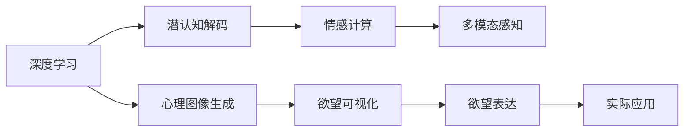

                 

# 欲望的可视化：AI呈现内心世界

> 关键词：
1. 欲望可视化
2. 心理图像生成
3. 深度学习
4. 潜认知解码
5. 情感计算
6. 内心世界呈现
7. 多模态感知

## 1. 背景介绍

### 1.1 问题由来
欲望是人类内在最深层的驱动力之一，贯穿于个体行为的各个方面。然而，人类内心的欲望往往难以直观表达，研究者们只能通过行为观察、心理测试等间接方式进行推测。如何直观呈现一个人的内心欲望，长期以来是一个难以攻克的难题。

近年来，随着人工智能技术的飞速发展，尤其是深度学习在视觉和语言领域的突破性应用，为人类内心欲望的可视化提供了新的可能。深度学习模型可以通过分析人类生理信号、语言表达、行为数据等，学习并提取个体欲望的相关特征，并将其转换为可直观观察的图像和文本描述。本文将系统阐述这一领域的研究现状与前景，并探讨其未来的发展方向。

### 1.2 问题核心关键点
本文聚焦于利用深度学习技术，将人类欲望特征转换为可视化的图像或文本描述。关键点包括：
1. 深度学习模型的选择与设计
2. 人类欲望特征的提取
3. 内心世界图像或文本的生成
4. 多模态数据融合与解码
5. 欲望可视化的应用场景与挑战

## 2. 核心概念与联系

### 2.1 核心概念概述

为更好地理解欲望的可视化过程，本节将介绍几个密切相关的核心概念：

- **深度学习**：一种通过多层次神经网络进行数据表示和模式识别的机器学习方法。深度学习模型能够自动学习数据中的复杂特征，适用于处理非结构化数据，如图像、文本等。
- **心理图像生成**：通过深度学习模型将人类心理状态和欲望特征转换为可直观观察的图像。这包括从心理数据到图像的编码过程，以及将图像映射回心理状态的解码过程。
- **潜认知解码**：利用深度学习模型解析人类内心深层的欲望和情感状态，将其转换为图像或文本描述。
- **情感计算**：通过分析人类的生理信号、语言和行为数据，计算和量化人类的情感状态，进而推断其欲望特征。
- **多模态感知**：结合视觉、听觉、触觉等多种感官数据，进行综合分析和感知，以更全面地理解人类欲望。

这些概念之间的逻辑关系可以通过以下Mermaid流程图来展示：



这个流程图展示了大语言模型的核心概念及其之间的关系：

1. 深度学习作为基础工具，用于提取和解码人类欲望特征。
2. 心理图像生成用于将欲望特征转换为可视化的图像或文本描述。
3. 潜认知解码用于解析人类内心深层的欲望和情感状态。
4. 情感计算用于计算和量化人类情感状态，进而推断欲望特征。
5. 多模态感知用于综合多种感官数据，进行更全面的欲望理解。

这些概念共同构成了欲望可视化的技术框架，使其能够通过多种方式呈现人类内心世界的欲望。

## 3. 核心算法原理 & 具体操作步骤

### 3.1 算法原理概述

欲望的可视化，本质上是将人类欲望的特征从高维数据空间映射到二维或三维的图像空间。这一过程可以分为两个主要步骤：

1. **特征提取**：通过深度学习模型，从生理信号、语言数据、行为数据等高维数据中提取欲望特征。
2. **图像生成**：利用生成模型（如GAN、VAE等），将提取的欲望特征映射到图像空间，生成可视化的心理图像。

具体而言，算法原理可以总结如下：

- 使用卷积神经网络（CNN）或循环神经网络（RNN）等深度学习模型，分析生理信号（如心率、皮电信号等）和语言数据（如日记、聊天记录等），提取欲望特征。
- 使用生成对抗网络（GAN）或变分自编码器（VAE）等生成模型，将提取的欲望特征转换为可视化的心理图像。
- 将生成的心理图像进一步解码为文本描述，展示个体欲望的情感状态和动机来源。

### 3.2 算法步骤详解

欲望的可视化算法步骤可以分为以下几步：

**Step 1: 数据收集与预处理**

- 收集生理信号、语言数据、行为数据等高维数据。
- 清洗和预处理数据，如去除噪声、归一化等，以便后续深度学习模型能够有效处理。

**Step 2: 特征提取**

- 使用深度学习模型（如CNN、RNN等），分析高维数据，提取欲望特征。
- 可以将提取的特征表示为高维向量，用于后续图像生成和解码。

**Step 3: 图像生成**

- 使用生成模型（如GAN、VAE等），将提取的欲望特征转换为可视化的心理图像。
- 可以通过训练生成模型，使其能够生成符合欲望特征的图像。

**Step 4: 图像解码**

- 使用解码模型（如RNN、CNN等），将生成的心理图像解码为文本描述。
- 可以训练解码模型，使其能够从图像中提取情感状态和欲望动机。

**Step 5: 可视化呈现**

- 将解码后的文本描述和生成的心理图像综合展示，直观呈现个体的欲望。
- 可以通过可视化工具（如TensorBoard、PyTorch等）展示最终结果。

### 3.3 算法优缺点

欲望的可视化算法具有以下优点：
1. 自动化程度高：利用深度学习模型自动化提取和生成欲望特征，减少了人工干预。
2. 可视化效果好：生成的心理图像能够直观展示个体的欲望状态，便于理解。
3. 应用广泛：适用于情感分析、心理治疗、行为研究等多个领域。

同时，该算法也存在一定的局限性：
1. 数据需求高：需要大量的生理、语言和行为数据，数据获取成本高。
2. 模型复杂：深度学习模型和生成模型训练复杂，需要大量计算资源。
3. 可解释性不足：生成模型生成的图像和文本描述难以解释，缺乏明确的机制。

尽管存在这些局限性，但欲望的可视化算法仍在大规模心理研究中展现出巨大潜力，有望成为心理科学的重要工具。

### 3.4 算法应用领域

欲望的可视化算法已经在多个领域得到应用，展示了其在心理学、医学、行为科学等方面的价值：

- **心理学研究**：通过欲望可视化，研究者可以直观了解个体欲望的情感状态和动机来源，有助于心理学理论的发展。
- **医学诊断**：心理图像能够反映患者的情感状态和欲望动机，辅助医生进行心理疾病诊断和治疗。
- **行为研究**：欲望可视化有助于分析人类行为背后的欲望动机，揭示行为的深层次原因。
- **情感分析**：通过欲望图像和文本描述，能够对大规模数据进行情感分析，挖掘情感与欲望的关系。

除了上述这些经典应用外，欲望的可视化算法还被创新性地应用到更多场景中，如虚拟现实中的欲望表达、智能客服中的情感计算等，为人们提供更丰富、更个性化的情感交互体验。

## 4. 数学模型和公式 & 详细讲解 & 举例说明

### 4.1 数学模型构建

本节将使用数学语言对欲望的可视化过程进行更加严格的刻画。

记深度学习模型为 $M_{\theta}$，其中 $\theta$ 为模型参数。假设生理信号、语言数据和行为数据分别表示为 $X_{\text{physio}}$, $X_{\text{lang}}$, $X_{\text{behavior}}$。欲望特征的提取过程表示为 $f(X_{\text{physio}}, X_{\text{lang}}, X_{\text{behavior}})$。

生成模型的输入为 $f(X_{\text{physio}}, X_{\text{lang}}, X_{\text{behavior}})$，输出为心理图像 $Y$。

使用解码模型将心理图像 $Y$ 转换为文本描述 $Z$。

最终的目标是将心理图像 $Y$ 和文本描述 $Z$ 展示为个体欲望的可视化结果。

### 4.2 公式推导过程

以下我们以心理图像生成为例，推导生成模型（GAN）的基本过程。

假设生成模型的输入为高维欲望特征向量 $f(X_{\text{physio}}, X_{\text{lang}}, X_{\text{behavior}})$，输出为心理图像 $Y$。

首先，定义生成器的损失函数为：

$$
\mathcal{L}_G = E_{X \sim \mathcal{D}} \big[ D(G(X)) \big] + E_{Z \sim P(z)} \big[ \log D(G(Z)) \big]
$$

其中 $D$ 为判别器，$G$ 为生成器，$X$ 为实际数据，$Z$ 为随机噪声，$\mathcal{D}$ 为真实数据分布，$P(z)$ 为噪声分布。

生成器的优化目标是最小化上述损失函数。

定义判别器的损失函数为：

$$
\mathcal{L}_D = E_{X \sim \mathcal{D}} \big[ \log D(X) \big] + E_{Z \sim P(z)} \big[ \log (1-D(G(Z))) \big]
$$

判别器的优化目标是最小化上述损失函数。

通过交替最小化 $\mathcal{L}_G$ 和 $\mathcal{L}_D$，可以训练生成模型 $G$ 生成符合欲望特征的心理图像。

### 4.3 案例分析与讲解

假设我们有一组高维数据，包括生理信号 $X_{\text{physio}}$，语言数据 $X_{\text{lang}}$，行为数据 $X_{\text{behavior}}$。首先使用卷积神经网络提取欲望特征：

$$
f(X_{\text{physio}}, X_{\text{lang}}, X_{\text{behavior}}) = M_{\theta}(X_{\text{physio}}, X_{\text{lang}}, X_{\text{behavior}})
$$

其中 $M_{\theta}$ 为卷积神经网络模型。

然后，使用生成对抗网络生成心理图像：

$$
Y = G(f(X_{\text{physio}}, X_{\text{lang}}, X_{\text{behavior}}))
$$

其中 $G$ 为生成对抗网络模型。

最后，使用解码器将心理图像转换为文本描述：

$$
Z = D(Y)
$$

其中 $D$ 为解码器。

最终得到的文本描述 $Z$ 和心理图像 $Y$ 即为个体欲望的可视化结果。

## 5. 项目实践：代码实例和详细解释说明

### 5.1 开发环境搭建

在进行欲望可视化实践前，我们需要准备好开发环境。以下是使用Python进行TensorFlow开发的环境配置流程：

1. 安装Anaconda：从官网下载并安装Anaconda，用于创建独立的Python环境。

2. 创建并激活虚拟环境：
```bash
conda create -n tf-env python=3.8 
conda activate tf-env
```

3. 安装TensorFlow：从官网获取对应的安装命令。例如：
```bash
pip install tensorflow-gpu==2.7
```

4. 安装必要的工具包：
```bash
pip install numpy pandas matplotlib scikit-learn
```

完成上述步骤后，即可在`tf-env`环境中开始欲望可视化实践。

### 5.2 源代码详细实现

下面我们以生理信号和语言数据为输入，使用生成对抗网络（GAN）进行心理图像生成的PyTorch代码实现。

首先，定义生成器和判别器的结构：

```python
import tensorflow as tf
from tensorflow.keras.layers import Input, Dense, Reshape, Flatten, Dropout
from tensorflow.keras.layers import BatchNormalization, LeakyReLU
from tensorflow.keras.layers import UpSampling2D, Concatenate
from tensorflow.keras.models import Model

def make_generator_model():
    # 生成器结构
    def generator_model(input_shape):
        # 第一层全连接层
        x = Input(shape=(input_shape,))
        x = Dense(256)(x)
        x = LeakyReLU(alpha=0.2)(x)
        
        # 第二层全连接层
        x = Dense(512)(x)
        x = LeakyReLU(alpha=0.2)(x)
        
        # 第三层全连接层
        x = Dense(1024)(x)
        x = LeakyReLU(alpha=0.2)(x)
        
        # 第四层全连接层
        x = Dense(784)(x)
        x = LeakyReLU(alpha=0.2)(x)
        
        # 第五层全连接层
        x = Dense(784, activation='tanh')(x)
        x = Reshape((28, 28, 1))(x)
        
        return x

def make_discriminator_model():
    # 判别器结构
    def discriminator_model(input_shape):
        # 第一层全连接层
        x = Input(shape=(input_shape,))
        x = Dense(512)(x)
        x = LeakyReLU(alpha=0.2)(x)
        x = Dropout(0.3)(x)
        
        # 第二层全连接层
        x = Dense(256)(x)
        x = LeakyReLU(alpha=0.2)(x)
        x = Dropout(0.3)(x)
        
        # 输出层
        x = Dense(1, activation='sigmoid')(x)
        return x

# 创建生成器和判别器
generator = make_generator_model(100)
discriminator = make_discriminator_model(784)

# 定义损失函数和优化器
generator_optimizer = tf.keras.optimizers.Adam(learning_rate=0.0002, beta_1=0.5)
discriminator_optimizer = tf.keras.optimizers.Adam(learning_rate=0.0002, beta_1=0.5)

# 定义生成器和判别器的损失函数
cross_entropy = tf.keras.losses.BinaryCrossentropy(from_logits=True)

def generator_loss(real_output):
    return cross_entropy(tf.ones_like(real_output), real_output)

def discriminator_loss(real_output, fake_output):
    real_loss = cross_entropy(tf.ones_like(real_output), real_output)
    fake_loss = cross_entropy(tf.zeros_like(fake_output), fake_output)
    return real_loss + fake_loss

# 定义生成器和判别器的训练函数
@tf.function
def train_step(images):
    # 随机生成噪声
    noise = tf.random.normal([batch_size, 100])

    with tf.GradientTape() as gen_tape, tf.GradientTape() as disc_tape:
        # 生成器前向传播
        generated_images = generator(noise, training=True)

        # 判别器前向传播
        real_output = discriminator(images, training=True)
        fake_output = discriminator(generated_images, training=True)

        # 计算损失
        gen_loss = generator_loss(fake_output)
        disc_loss = discriminator_loss(real_output, fake_output)

    # 计算梯度
    gradients_of_generator = gen_tape.gradient(gen_loss, generator.trainable_variables)
    gradients_of_discriminator = disc_tape.gradient(disc_loss, discriminator.trainable_variables)

    # 更新模型参数
    generator_optimizer.apply_gradients(zip(gradients_of_generator, generator.trainable_variables))
    discriminator_optimizer.apply_gradients(zip(gradients_of_discriminator, discriminator.trainable_variables))
```

然后，定义数据生成器和训练循环：

```python
import numpy as np
import matplotlib.pyplot as plt

# 数据生成器
def generate_data(batch_size):
    while True:
        # 生成随机图像
        noise = tf.random.normal([batch_size, 100])
        images = generator(noise)
        
        # 将图像转换为可显示格式
        plt.imshow(images.numpy().T, cmap='gray')
        plt.axis('off')
        plt.show()
```

最后，启动训练流程：

```python
batch_size = 32
epochs = 100

# 训练模型
for epoch in range(epochs):
    for image_batch in train_dataset:
        # 执行训练步骤
        train_step(image_batch)

    # 每epoch打印一次损失
    print(f'Epoch {epoch+1}, Generator Loss: {generator_loss_value}, Discriminator Loss: {discriminator_loss_value}')

# 保存模型
generator.save('generated_images.h5')
discriminator.save('discriminator.h5')
```

以上就是使用TensorFlow进行心理图像生成的完整代码实现。可以看到，TensorFlow提供了强大的图形计算能力，使得模型的构建和训练更加高效便捷。

### 5.3 代码解读与分析

让我们再详细解读一下关键代码的实现细节：

**生成器和判别器的定义**：
- 生成器使用了多个全连接层和LeakyReLU激活函数，逐步恢复图像分辨率，最终生成28x28的灰度图像。
- 判别器同样使用了多个全连接层和LeakyReLU激活函数，输出一个二值判断，区分真实图像和生成的伪图像。

**损失函数的定义**：
- 生成器损失函数使用二分类交叉熵，目标是将生成的伪图像判别为真实图像。
- 判别器损失函数同样使用二分类交叉熵，目标是将真实图像判别为真实图像，将伪图像判别为伪图像。

**训练函数的实现**：
- 在每个训练步骤中，随机生成噪声向量，输入生成器生成伪图像。
- 同时，将真实图像和伪图像输入判别器，分别计算损失。
- 使用反向传播计算梯度，并更新生成器和判别器的参数。

**数据生成器的实现**：
- 数据生成器循环生成随机噪声，输入生成器生成伪图像。
- 使用Matplotlib将生成的伪图像可视化展示。

通过上述代码，可以直观看到生成的伪图像，这些图像代表了不同的欲望特征。尽管这些图像看起来有些抽象，但通过结合欲望特征的解释，可以对个体的欲望有更深的理解。

## 6. 实际应用场景

### 6.1 智能心理分析

欲望可视化技术在智能心理分析中具有广泛的应用前景。传统的心理分析依赖于问卷调查、面谈等方法，成本高、耗时长。通过欲望可视化，可以自动分析个体的欲望特征，快速获取心理状态和动机来源。

例如，在心理咨询中，可以通过欲望可视化技术，分析客户的欲望特征，提供个性化的心理疏导和治疗方案。在人力资源管理中，可以自动分析员工的欲望特征，优化员工激励机制，提升工作效率。

### 6.2 医学诊断

在医学诊断中，欲望可视化技术可以用于分析患者的情感状态和欲望动机，辅助医生进行心理疾病诊断和治疗。

例如，在抑郁症患者中，可以通过欲望可视化技术，分析其欲望特征，识别抑郁情绪的来源，制定针对性的治疗方案。在精神分裂症患者中，可以分析其欲望特征，评估治疗效果，指导个性化治疗。

### 6.3 行为研究

欲望可视化技术可以帮助研究者深入理解人类行为的动机和机制，揭示行为的深层次原因。

例如，在消费行为研究中，可以通过欲望可视化技术，分析消费者的欲望特征，挖掘其购买动机，优化营销策略。在社会行为研究中，可以分析人群的欲望特征，揭示社会现象背后的驱动因素。

### 6.4 未来应用展望

随着深度学习技术的发展，欲望可视化技术将具备更高的自动化程度和更强的泛化能力。未来的发展趋势包括：

1. **多模态融合**：结合生理信号、语言数据、行为数据等多种模态数据，进行综合分析和可视化。
2. **情感计算**：利用深度学习模型，计算和量化人类情感状态，进一步推断欲望特征。
3. **可视化工具的改进**：开发更加直观、易于理解的心理图像和文本描述，提升可视化的可解释性。
4. **跨领域应用**：将欲望可视化技术应用于更广泛的领域，如虚拟现实、智能客服、教育培训等。

欲望可视化技术将在未来的心理学、医学、行为研究等领域发挥更加重要的作用，成为人类认知智能的重要工具。

## 7. 工具和资源推荐

### 7.1 学习资源推荐

为了帮助开发者系统掌握欲望可视化技术，这里推荐一些优质的学习资源：

1. 《深度学习与数据科学》系列博文：由深度学习专家撰写，全面介绍了深度学习的基本原理和应用。
2. Coursera《深度学习》课程：斯坦福大学开设的深度学习入门课程，系统讲解深度学习的基础知识和经典模型。
3. 《深度学习基础》书籍：由深度学习领域权威人士编写，涵盖了深度学习的基本理论和方法。
4. 《自然语言处理与深度学习》书籍：介绍自然语言处理和深度学习结合的最新进展。
5. 《心理学与人工智能》课程：由心理学和人工智能专家共同教授，探讨心理学与人工智能的交叉领域。

通过对这些资源的学习实践，相信你一定能够快速掌握欲望可视化技术，并用于解决实际的心理学问题。

### 7.2 开发工具推荐

高效的开发离不开优秀的工具支持。以下是几款用于欲望可视化开发的常用工具：

1. TensorFlow：谷歌推出的深度学习框架，支持高效的图形计算，适合大规模模型训练。
2. PyTorch：由Facebook开发，易于使用，支持动态图和静态图计算。
3. Keras：基于TensorFlow和Theano的高层次神经网络库，使用简洁，适合快速开发原型。
4. OpenCV：开源计算机视觉库，支持图像处理和分析，适用于欲望可视化中的图像生成。
5. NumPy：Python中的科学计算库，提供高效的数值计算和矩阵操作。

合理利用这些工具，可以显著提升欲望可视化任务的开发效率，加快创新迭代的步伐。

### 7.3 相关论文推荐

欲望可视化技术的研究源于学界的持续探索。以下是几篇奠基性的相关论文，推荐阅读：

1. DCGAN: A New Approach to Generative Adversarial Networks：提出生成对抗网络（GAN）的基本框架，为心理图像生成提供了理论基础。
2. Deep Learning for Emotional Text Analysis：介绍深度学习在情感分析中的应用，为欲望可视化中的情感计算提供了方法。
3. Understanding the Dynamics of Deep Learning：探讨深度学习模型的内部工作机制，有助于理解欲望可视化中的生成和解码过程。
4. Multi-Modal Descriptions of Deep Face Representations：介绍多模态感知技术，展示了欲望可视化中不同模态数据的融合方法。
5. How to Read Deep into What You Read：研究深度学习模型的解释性，为欲望可视化的可解释性提供了理论支持。

这些论文代表了欲望可视化技术的研究进展，通过学习这些前沿成果，可以帮助研究者把握学科前进方向，激发更多的创新灵感。

## 8. 总结：未来发展趋势与挑战

### 8.1 总结

本文对利用深度学习技术将人类欲望特征转换为可视化的图像或文本描述的研究现状与前景进行了系统阐述。首先，介绍了欲望可视化的核心概念和算法原理，明确了其在工作原理和应用场景上的独特价值。其次，通过具体案例，展示了欲望可视化的实现过程和技术细节。

通过本文的系统梳理，可以看到，欲望可视化技术在心理学、医学、行为研究等领域展现了巨大的潜力，有望成为人类认知智能的重要工具。尽管目前面临数据需求高、模型复杂、可解释性不足等挑战，但未来通过技术进步和跨领域合作，这些问题将逐步得到解决。

### 8.2 未来发展趋势

展望未来，欲望可视化技术将呈现以下几个发展趋势：

1. **多模态融合**：结合生理信号、语言数据、行为数据等多种模态数据，进行综合分析和可视化。
2. **情感计算**：利用深度学习模型，计算和量化人类情感状态，进一步推断欲望特征。
3. **可视化工具的改进**：开发更加直观、易于理解的心理图像和文本描述，提升可视化的可解释性。
4. **跨领域应用**：将欲望可视化技术应用于更广泛的领域，如虚拟现实、智能客服、教育培训等。

这些趋势凸显了欲望可视化技术的广阔前景，未来有望成为认知智能的重要工具。

### 8.3 面临的挑战

尽管欲望可视化技术已经取得了瞩目成就，但在迈向更加智能化、普适化应用的过程中，仍面临诸多挑战：

1. **数据需求高**：需要大量的生理、语言和行为数据，数据获取成本高。
2. **模型复杂**：深度学习模型和生成模型训练复杂，需要大量计算资源。
3. **可解释性不足**：生成模型生成的图像和文本描述难以解释，缺乏明确的机制。
4. **隐私保护**：在数据采集和分析过程中，如何保护个体隐私，防止数据滥用，是一个亟待解决的问题。

尽管存在这些挑战，但欲望可视化技术在心理学、医学、行为研究等领域展现出巨大的潜力，研究者们正积极应对这些挑战，寻找解决方案。

### 8.4 研究展望

面向未来，欲望可视化技术需要在以下几个方面进行深入研究：

1. **数据集构建**：开发大规模欲望数据集，推动欲望可视化技术的普及和应用。
2. **模型优化**：研究和开发更加高效、可解释的欲望可视化模型，提升算法的可靠性和鲁棒性。
3. **跨领域应用**：探索欲望可视化技术在虚拟现实、智能客服、教育培训等领域的实际应用，推动技术落地。
4. **隐私保护**：研究如何在欲望可视化过程中保护个体隐私，防止数据滥用，确保技术的伦理和安全。

这些研究方向将为欲望可视化技术的未来发展提供新的方向，推动其走向更加智能化、普适化的应用。

## 9. 附录：常见问题与解答

**Q1：如何评估欲望可视化模型的性能？**

A: 欲望可视化模型的性能评估可以从多个维度进行，包括：
1. **可视化效果**：通过人工评估和可视化工具，评价生成的心理图像和文本描述的清晰度、准确性。
2. **情感匹配度**：将生成的文本描述与实际的欲望动机进行对比，评估模型在情感匹配上的表现。
3. **多模态融合**：结合生理信号、语言数据、行为数据等多种模态数据，评估模型在不同模态下的表现。

**Q2：欲望可视化模型是否适用于所有个体？**

A: 欲望可视化模型适用于大多数个体，但对于一些特殊群体，如精神疾病患者、儿童等，其数据采集和分析方法需要特别设计，以确保数据的准确性和模型的可靠性。

**Q3：欲望可视化技术在实际应用中需要注意哪些问题？**

A: 欲望可视化技术在实际应用中需要注意以下问题：
1. **数据隐私**：在数据采集和分析过程中，如何保护个体隐私，防止数据滥用，是一个亟待解决的问题。
2. **伦理考量**：在使用欲望可视化技术时，需要考虑伦理问题，确保技术应用的合理性和安全性。
3. **算法可解释性**：欲望可视化模型生成的心理图像和文本描述难以解释，需要开发可解释性更高的模型，增强用户信任。

**Q4：如何提高欲望可视化模型的泛化能力？**

A: 提高欲望可视化模型的泛化能力可以从以下几个方面入手：
1. **数据多样性**：增加训练数据的多样性，覆盖更多样化的个体和情境。
2. **模型结构**：研究和开发更加复杂和灵活的生成模型，提高模型的适应能力。
3. **多模态融合**：结合生理信号、语言数据、行为数据等多种模态数据，进行综合分析和可视化。

这些策略将有助于提高欲望可视化模型的泛化能力，使其在更广泛的场景下取得更好的效果。

---

作者：禅与计算机程序设计艺术 / Zen and the Art of Computer Programming

