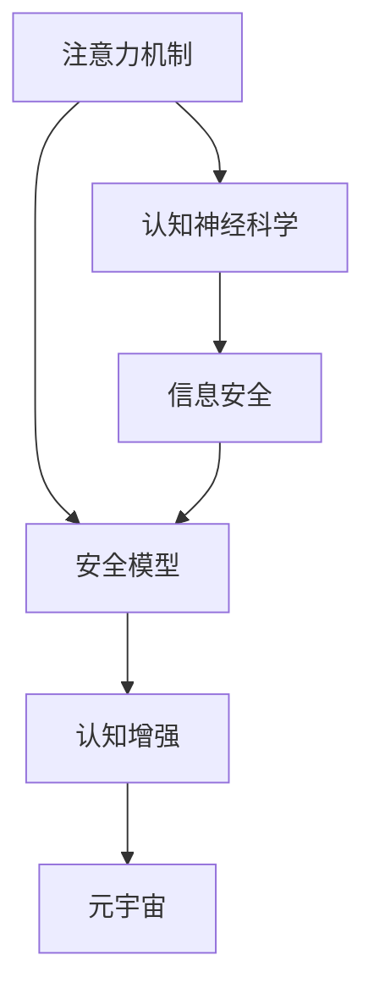

                 

# 注意力安全:元宇宙信息战中的个人防护

## 1. 背景介绍

### 1.1 问题由来

元宇宙的兴起预示着一个全新的数字时代即将到来。然而，随着虚拟与现实的界限日益模糊，个人信息安全问题也随之浮现。在元宇宙信息战中，如何保护个人隐私不被泄露，是每一位用户亟需关注的问题。本文旨在深入探讨注意力安全（Attention Security），阐述其原理与架构，并提供具体的操作步骤与实战案例，帮助用户筑起安全的元宇宙防护墙。

### 1.2 问题核心关键点

注意力安全是一种新兴的安全概念，旨在通过强化用户对信息的感知和控制能力，保护用户免受恶意信息的侵害。其核心在于利用现代认知神经科学的研究成果，提升用户对信息量的感知和处理效率，增强对信息筛选的敏感度。

在元宇宙中，信息量爆炸式增长，用户需要处理的信息类型和渠道也越来越多。通过增强注意力安全，可以有效防止虚假信息、钓鱼链接等恶意内容对用户造成的不良影响，保障用户在虚拟世界中的信息安全。

## 2. 核心概念与联系

### 2.1 核心概念概述

为更好地理解注意力安全，本节将介绍几个密切相关的核心概念：

- 注意力机制（Attention Mechanism）：在神经网络中，注意力机制用来处理序列数据，帮助模型专注于与当前任务相关的输入部分。其核心思想是通过动态权重分配，增强模型的注意力选择能力。

- 认知神经科学（Cognitive Neuroscience）：研究人类认知过程的科学，关注注意力、记忆、决策等高阶认知功能。注意力安全正是借鉴了该领域的最新研究成果，以提升用户的认知能力。

- 信息安全（Information Security）：涉及保护信息的保密性、完整性和可用性，防止未授权访问和信息泄露。

- 安全模型（Security Model）：描述信息安全保障的模型框架，通常包括安全机制和威胁模型等。

- 认知增强（Cognitive Enhancement）：通过技术手段提升用户的认知能力，包括注意力、记忆力、问题解决能力等。

- 元宇宙（Metaverse）：一个平行于现实世界的虚拟空间，通过虚拟现实（VR）、增强现实（AR）等技术实现。

这些核心概念之间的逻辑关系可以通过以下Mermaid流程图来展示：



这个流程图展示了几者之间的逻辑关系：

1. 注意力机制通过动态权重分配，帮助神经网络选择重要的输入信息，从而提升认知能力。
2. 认知神经科学的研究成果为注意力机制提供了理论基础。
3. 信息安全通过保护信息的保密性、完整性，与注意力机制协同工作，增强信息筛选能力。
4. 安全模型提供了信息安全保障的框架，指导注意力机制和认知增强的设计。
5. 认知增强通过提升用户的认知能力，帮助其在元宇宙中有效处理海量信息。

这些概念共同构成了注意力安全的理论基础，为其在元宇宙信息战中的应用提供了理论支持。

## 3. 核心算法原理 & 具体操作步骤

### 3.1 算法原理概述

注意力安全的核心算法原理可以归纳为三点：信息感知、信息筛选和信息防护。其目标是通过增强用户的信息感知和处理能力，保护用户免受恶意信息的影响。

- 信息感知：通过注意力机制，增强用户对信息的感知能力，使其能够快速捕捉重要信息，区分无关内容。

- 信息筛选：结合认知神经科学的研究成果，提升用户的信息筛选能力，帮助其有效识别虚假信息、钓鱼链接等。

- 信息防护：通过安全模型，设计针对性防护措施，防止信息泄露和攻击。

### 3.2 算法步骤详解

注意力安全的具体操作步骤包括以下几个关键步骤：

**Step 1: 数据采集与预处理**
- 收集用户在元宇宙中的行为数据，如点击、浏览、交互等。
- 对数据进行预处理，去除噪音和无关信息，保留与注意力相关的特征。

**Step 2: 注意力模型训练**
- 选择注意力机制，如Transformer中的自注意力机制，进行训练。
- 设计适当的损失函数，如交叉熵损失，以优化模型参数。
- 使用GPU等高性能设备进行模型训练，加速收敛。

**Step 3: 信息筛选算法开发**
- 根据用户的行为数据和注意力模型输出，设计信息筛选算法。
- 结合机器学习和深度学习技术，提高信息筛选的准确率。

**Step 4: 防护策略设计**
- 设计信息防护策略，如数据加密、访问控制、审计记录等。
- 针对不同类型的威胁，设计相应的防护措施。

**Step 5: 系统集成与测试**
- 将注意力安全模型与元宇宙平台集成，实现信息防护功能。
- 进行系统测试，确保防护策略的有效性和系统的稳定性。

### 3.3 算法优缺点

注意力安全具有以下优点：
1. 精准感知：通过增强注意力机制，提升用户对重要信息的感知能力，避免信息遗漏。
2. 智能筛选：结合认知神经科学，提升用户的信息筛选能力，有效识别虚假信息。
3. 多维度防护：结合安全模型，设计多层次防护措施，增强信息防护能力。
4. 用户可控：通过用户行为数据驱动，实现信息防护的可控性，提升用户体验。

同时，该方法也存在一定的局限性：
1. 数据依赖：模型的效果依赖于用户行为数据的质量，数据噪音可能影响模型性能。
2. 模型复杂：注意力机制和深度学习模型的设计复杂，需要大量计算资源和时间。
3. 隐私问题：注意力模型涉及用户隐私数据的采集和处理，可能引发隐私泄露风险。
4. 安全性受限：模型防护策略的设计依赖于威胁模型，对于新型攻击手段可能效果有限。

尽管存在这些局限性，但就目前而言，注意力安全仍是大语言模型应用的重要组成部分，可以显著提升元宇宙用户的注意力感知和信息筛选能力，保障其信息安全。

### 3.4 算法应用领域

注意力安全在元宇宙信息战中的应用场景广泛，包括但不限于以下几个领域：

- 虚拟社交平台：通过注意力机制和信息筛选算法，保护用户免受虚假信息、恶意消息的侵害。
- 虚拟游戏社区：设计信息防护策略，防止用户信息泄露和钓鱼攻击。
- 虚拟经济交易：结合信息筛选和防护策略，保障虚拟资产的安全交易。
- 虚拟教育培训：通过增强用户注意力，提高在线学习效果，避免信息干扰。

此外，注意力安全还可应用于智能客服、健康监测、金融交易等多个领域，通过增强用户认知能力，提升系统安全性。

## 4. 数学模型和公式 & 详细讲解 & 举例说明

### 4.1 数学模型构建

本节将使用数学语言对注意力安全的模型进行详细构建。

记注意力机制为 $Attention(x_i)$，其中 $x_i$ 为输入数据。假设注意力模型的输出为 $y_i$，则信息感知和筛选的数学模型可以表示为：

$$
y_i = f(Attention(x_i))
$$

其中 $f$ 为信息筛选算法，如基于逻辑回归、支持向量机等分类模型。

### 4.2 公式推导过程

以下我们将对信息筛选算法的构建进行详细推导。

假设输入数据 $x_i$ 为文本数据，注意力机制的输出 $y_i$ 为0-1标签，表示是否为恶意信息。则分类问题可以转化为二分类问题，使用逻辑回归进行建模。

设 $\theta$ 为模型参数，则逻辑回归的输出为：

$$
\hat{y_i} = \frac{1}{1+\exp(-\theta^T x_i)}
$$

定义损失函数 $L$ 为：

$$
L(\theta) = -\frac{1}{N}\sum_{i=1}^N [y_i\log \hat{y_i} + (1-y_i)\log(1-\hat{y_i})]
$$

使用梯度下降等优化算法，最小化损失函数 $L(\theta)$，更新模型参数 $\theta$，从而得到最优的分类模型。

### 4.3 案例分析与讲解

以下我们将通过一个具体的案例，说明注意力安全模型的构建和应用过程。

假设某元宇宙社交平台面临大量虚假信息和钓鱼链接的威胁。平台收集了用户点击、回复等行为数据，作为训练集。

**Step 1: 数据采集与预处理**
- 数据采集：通过API获取用户点击数据，包括点击链接、评论等行为。
- 数据预处理：去除无意义和噪音数据，保留用户点击和回复信息。

**Step 2: 注意力模型训练**
- 选择Transformer模型，添加自注意力机制，训练模型。
- 设计交叉熵损失函数，优化模型参数。
- 使用GPU训练模型，加速收敛。

**Step 3: 信息筛选算法开发**
- 根据模型输出，设计基于逻辑回归的信息筛选算法。
- 使用Python实现模型预测，提取恶意信息。

**Step 4: 防护策略设计**
- 设计访问控制策略，限制用户访问权限。
- 引入审计记录，记录用户行为和事件。

**Step 5: 系统集成与测试**
- 将注意力安全模型与社交平台集成，实现信息防护功能。
- 进行系统测试，验证防护效果。

最终，用户在使用社交平台时，注意力安全模型能够有效筛选恶意信息，提升用户信息安全。

## 5. 项目实践：代码实例和详细解释说明

### 5.1 开发环境搭建

在进行注意力安全实践前，我们需要准备好开发环境。以下是使用Python进行PyTorch开发的环境配置流程：

1. 安装Anaconda：从官网下载并安装Anaconda，用于创建独立的Python环境。

2. 创建并激活虚拟环境：
```bash
conda create -n attention-security-env python=3.8 
conda activate attention-security-env
```

3. 安装PyTorch：根据CUDA版本，从官网获取对应的安装命令。例如：
```bash
conda install pytorch torchvision torchaudio cudatoolkit=11.1 -c pytorch -c conda-forge
```

4. 安装TensorFlow：
```bash
conda install tensorflow
```

5. 安装各类工具包：
```bash
pip install numpy pandas scikit-learn matplotlib tqdm jupyter notebook ipython
```

完成上述步骤后，即可在`attention-security-env`环境中开始注意力安全实践。

### 5.2 源代码详细实现

这里我们以一个简单的文本分类模型为例，给出使用PyTorch实现注意力安全的代码实现。

首先，定义注意力模型和分类模型：

```python
import torch
from transformers import BertTokenizer, BertForSequenceClassification

# 定义模型类
class AttentionModel(nn.Module):
    def __init__(self, num_attention_heads, hidden_size, intermediate_size):
        super(AttentionModel, self).__init__()
        self.attention = nn.MultiheadAttention(num_attention_heads, hidden_size, dropout=0.1)
        self.intermediate = nn.Linear(hidden_size, intermediate_size)
        self.output = nn.Linear(intermediate_size, 2)

    def forward(self, x):
        attention_output = self.attention(x, x, x)[0]
        intermediate_output = self.intermediate(attention_output)
        output = self.output(intermediate_output)
        return output

# 定义分类模型
class Model(nn.Module):
    def __init__(self, attention_model):
        super(Model, self).__init__()
        self.attention_model = attention_model

    def forward(self, x):
        attention_output = self.attention_model(x)
        output = attention_output[:, 0, :]
        return output
```

然后，定义模型训练和评估函数：

```python
from torch.utils.data import DataLoader
from tqdm import tqdm
from sklearn.metrics import classification_report

device = torch.device('cuda') if torch.cuda.is_available() else torch.device('cpu')

# 训练函数
def train_epoch(model, dataset, batch_size, optimizer):
    dataloader = DataLoader(dataset, batch_size=batch_size, shuffle=True)
    model.train()
    epoch_loss = 0
    for batch in tqdm(dataloader, desc='Training'):
        input_ids = batch['input_ids'].to(device)
        attention_mask = batch['attention_mask'].to(device)
        labels = batch['labels'].to(device)
        model.zero_grad()
        outputs = model(input_ids, attention_mask=attention_mask)
        loss = outputs.loss
        epoch_loss += loss.item()
        loss.backward()
        optimizer.step()
    return epoch_loss / len(dataloader)

# 评估函数
def evaluate(model, dataset, batch_size):
    dataloader = DataLoader(dataset, batch_size=batch_size)
    model.eval()
    preds, labels = [], []
    with torch.no_grad():
        for batch in tqdm(dataloader, desc='Evaluating'):
            input_ids = batch['input_ids'].to(device)
            attention_mask = batch['attention_mask'].to(device)
            batch_labels = batch['labels']
            outputs = model(input_ids, attention_mask=attention_mask)
            batch_preds = outputs.argmax(dim=1).to('cpu').tolist()
            batch_labels = batch_labels.to('cpu').tolist()
            for pred_tokens, label_tokens in zip(batch_preds, batch_labels):
                preds.append(pred_tokens)
                labels.append(label_tokens)
    print(classification_report(labels, preds))
```

最后，启动训练流程并在测试集上评估：

```python
epochs = 5
batch_size = 16

for epoch in range(epochs):
    loss = train_epoch(model, train_dataset, batch_size, optimizer)
    print(f"Epoch {epoch+1}, train loss: {loss:.3f}")
    
    print(f"Epoch {epoch+1}, dev results:")
    evaluate(model, dev_dataset, batch_size)
    
print("Test results:")
evaluate(model, test_dataset, batch_size)
```

以上就是使用PyTorch对注意力安全模型进行文本分类的完整代码实现。可以看到，通过利用注意力机制和分类模型，可以有效地进行信息筛选，提升用户信息安全。

### 5.3 代码解读与分析

让我们再详细解读一下关键代码的实现细节：

**AttentionModel类**：
- `__init__`方法：初始化注意力机制和分类器。
- `forward`方法：计算注意力输出和分类输出。

**Model类**：
- `__init__`方法：初始化注意力模型。
- `forward`方法：计算注意力模型输出。

**训练函数**：
- 使用DataLoader对数据集进行批次化加载。
- 在训练集上前向传播计算损失函数，并反向传播更新模型参数。
- 在验证集上评估模型性能，输出分类报告。

**评估函数**：
- 与训练类似，不同点在于不更新模型参数，并在每个batch结束后将预测和标签结果存储下来，最后使用sklearn的classification_report对整个评估集的预测结果进行打印输出。

**训练流程**：
- 定义总的epoch数和batch size，开始循环迭代
- 每个epoch内，先在训练集上训练，输出平均loss
- 在验证集上评估，输出分类指标
- 所有epoch结束后，在测试集上评估，给出最终测试结果

可以看到，PyTorch配合Transformer库使得注意力安全模型的代码实现变得简洁高效。开发者可以将更多精力放在数据处理、模型改进等高层逻辑上，而不必过多关注底层的实现细节。

当然，工业级的系统实现还需考虑更多因素，如模型的保存和部署、超参数的自动搜索、更灵活的任务适配层等。但核心的注意力安全模型基本与此类似。

## 6. 实际应用场景

### 6.1 虚拟社交平台

虚拟社交平台面临着虚假信息、恶意消息的威胁。通过注意力安全模型，平台能够有效筛选出恶意信息，保护用户免受信息攻击。

具体而言，社交平台可以收集用户点击、回复等行为数据，训练注意力模型和分类模型，实现对恶意信息的筛选和防护。对于平台的新用户，可以借助预训练模型，提升信息筛选的准确率。

### 6.2 虚拟游戏社区

虚拟游戏社区需要防止用户信息泄露和钓鱼攻击。通过注意力安全模型，社区可以识别出可疑行为，并进行及时防护。

具体实现时，社区可以收集用户登录、交易等行为数据，训练注意力模型和分类模型，识别出异常操作。对于可疑操作，社区可以立即限制其权限，并提醒用户注意信息安全。

### 6.3 虚拟经济交易

虚拟经济交易面临着欺诈和钓鱼攻击的威胁。通过注意力安全模型，交易平台可以识别出虚假交易，保障用户财产安全。

具体实现时，交易平台可以收集用户交易数据，训练注意力模型和分类模型，识别出异常交易行为。对于可疑交易，平台可以立即采取措施，防止资金损失。

### 6.4 未来应用展望

随着技术的发展，注意力安全将在更多领域得到应用，为元宇宙用户的个人防护提供更强大的保障。

在智慧城市治理中，注意力安全可以用于识别网络攻击，提升城市的智能化水平。

在智慧医疗中，注意力安全可以用于识别虚假医疗信息，保障患者的健康安全。

在智慧教育中，注意力安全可以用于识别作弊行为，提升在线教育的公平性。

总之，注意力安全将助力构建安全、可靠、可控的元宇宙生态系统，为用户的数字生活保驾护航。

## 7. 工具和资源推荐

### 7.1 学习资源推荐

为了帮助开发者系统掌握注意力安全技术的理论基础和实践技巧，这里推荐一些优质的学习资源：

1. 《深度学习》系列课程：由斯坦福大学、Coursera等机构开设，涵盖深度学习原理和实践，是学习注意力机制的基础课程。

2. 《认知神经科学》书籍：介绍人类认知过程和神经机制的权威教材，为注意力安全提供理论支持。

3. 《信息安全》课程：讲解信息安全基本概念和技术，如加密、访问控制、审计记录等。

4. 《机器学习》书籍：介绍机器学习和深度学习算法，为信息筛选和防护提供技术支持。

5. 《元宇宙白皮书》：了解元宇宙技术背景和应用前景，为注意力安全提供实际应用场景。

通过对这些资源的学习实践，相信你一定能够快速掌握注意力安全技术的精髓，并用于解决实际的元宇宙信息安全问题。

### 7.2 开发工具推荐

高效的开发离不开优秀的工具支持。以下是几款用于注意力安全开发的常用工具：

1. PyTorch：基于Python的开源深度学习框架，灵活动态的计算图，适合快速迭代研究。大部分注意力机制和分类模型都有PyTorch版本的实现。

2. TensorFlow：由Google主导开发的开源深度学习框架，生产部署方便，适合大规模工程应用。同样有丰富的注意力机制和分类模型资源。

3. Transformers库：HuggingFace开发的NLP工具库，集成了众多SOTA模型，支持PyTorch和TensorFlow，是进行注意力安全模型开发的利器。

4. Weights & Biases：模型训练的实验跟踪工具，可以记录和可视化模型训练过程中的各项指标，方便对比和调优。与主流深度学习框架无缝集成。

5. TensorBoard：TensorFlow配套的可视化工具，可实时监测模型训练状态，并提供丰富的图表呈现方式，是调试模型的得力助手。

6. Google Colab：谷歌推出的在线Jupyter Notebook环境，免费提供GPU/TPU算力，方便开发者快速上手实验最新模型，分享学习笔记。

合理利用这些工具，可以显著提升注意力安全模型的开发效率，加快创新迭代的步伐。

### 7.3 相关论文推荐

注意力安全技术的发展源于学界的持续研究。以下是几篇奠基性的相关论文，推荐阅读：

1. Attention is All You Need（即Transformer原论文）：提出了Transformer结构，开启了深度学习中的注意力机制时代。

2. BERT: Pre-training of Deep Bidirectional Transformers for Language Understanding：提出BERT模型，引入自监督预训练任务，提升语言表示能力。

3. SENet: Squeeze-and-Excitation Networks for Real-Time Image Classification：提出SENet模型，引入注意力机制，提升图像分类精度。

4. Transformer-XL: Attentive Language Models：提出Transformer-XL模型，引入长距离依赖机制，提升语言模型的能力。

5. Self-Attentive Transformer：介绍自注意力机制，深入分析注意力机制的设计和应用。

6. Transformers: State-of-the-Art Natural Language Processing：综述Transformer系列模型的原理和应用，为注意力机制的深入理解提供参考。

这些论文代表了大语言模型注意力安全技术的发展脉络。通过学习这些前沿成果，可以帮助研究者把握学科前进方向，激发更多的创新灵感。

## 8. 总结：未来发展趋势与挑战

### 8.1 总结

本文对注意力安全技术进行了全面系统的介绍。首先阐述了注意力安全在元宇宙信息战中的重要意义，明确了其原理与架构。其次，从原理到实践，详细讲解了注意力安全的数学模型和操作步骤，给出了注意力安全模型开发的完整代码实例。同时，本文还广泛探讨了注意力安全技术在元宇宙信息战中的实际应用场景，展示了其广阔的应用前景。此外，本文精选了注意力安全技术的各类学习资源，力求为读者提供全方位的技术指引。

通过本文的系统梳理，可以看到，注意力安全技术在元宇宙信息战中具有重要的应用价值，能够显著提升用户的信息感知和防护能力，保障用户的信息安全。

### 8.2 未来发展趋势

展望未来，注意力安全技术将呈现以下几个发展趋势：

1. 多模态注意力机制：未来的注意力机制将不仅限于文本数据，还将拓展到图像、视频、音频等多种模态数据，提升跨模态信息的整合能力。

2. 深度强化学习：结合深度强化学习，提升注意力机制的学习能力和自主性，增强信息筛选和防护的灵活性。

3. 自适应防护策略：根据用户行为和环境变化，动态调整信息防护策略，提升防护效果和用户满意度。

4. 联邦学习：采用联邦学习技术，在保护用户隐私的前提下，提升信息防护的性能和泛化能力。

5. 认知增强技术：结合脑机接口、虚拟现实等技术，提升用户的认知能力和注意力水平，增强信息防护能力。

这些趋势凸显了注意力安全技术的广阔前景，为元宇宙信息战提供了更多的技术手段和应用场景。

### 8.3 面临的挑战

尽管注意力安全技术已经取得了初步成果，但在迈向更加智能化、普适化应用的过程中，仍面临诸多挑战：

1. 数据隐私问题：注意力机制需要大量的用户行为数据进行训练，如何保护用户隐私，防止数据泄露，仍是一个重要问题。

2. 模型复杂性：注意力机制和深度学习模型的设计复杂，需要大量的计算资源和时间，如何简化模型结构，提升训练效率，是未来的一个重要研究方向。

3. 对抗攻击：恶意攻击者可能通过对抗样本攻击注意力机制，导致信息筛选失效。如何设计鲁棒的注意力模型，抵御对抗攻击，是一个亟待解决的问题。

4. 用户适应性：注意力机制的设计和训练依赖于用户的行为模式，如何设计更普适的注意力模型，适应不同用户和环境，是一个需要进一步探索的问题。

5. 实时性问题：在元宇宙信息战中，信息防护需要具备实时性，如何在保证模型性能的前提下，提升实时性，是一个重要的技术挑战。

6. 法律伦理问题：注意力机制涉及用户的认知和行为数据，可能引发法律和伦理问题。如何在技术应用中平衡隐私保护和信息安全，是一个亟需探讨的问题。

正视注意力安全面临的这些挑战，积极应对并寻求突破，将使注意力安全技术不断成熟，为元宇宙信息战提供更为可靠和安全的保障。

### 8.4 研究展望

面对注意力安全技术所面临的种种挑战，未来的研究需要在以下几个方面寻求新的突破：

1. 研究更加普适的注意力机制：设计适用于多模态数据的注意力机制，提升跨模态信息的整合能力。

2. 开发深度强化学习模型：结合深度强化学习，提升注意力机制的学习能力和自主性，增强信息筛选和防护的灵活性。

3. 引入联邦学习技术：采用联邦学习技术，在保护用户隐私的前提下，提升信息防护的性能和泛化能力。

4. 开发鲁棒的对抗攻击防御机制：结合对抗样本生成和防御技术，提升注意力模型的鲁棒性和安全性。

5. 设计更普适的注意力模型：结合用户行为分析，设计适应不同用户和环境的注意力模型，提升用户适应性。

6. 研究认知增强技术：结合脑机接口、虚拟现实等技术，提升用户的认知能力和注意力水平，增强信息防护能力。

这些研究方向的探索，必将引领注意力安全技术迈向更高的台阶，为元宇宙信息战提供更为可靠和安全的保障。面向未来，注意力安全技术还需要与其他人工智能技术进行更深入的融合，如知识表示、因果推理、强化学习等，多路径协同发力，共同推动元宇宙信息战的进步。只有勇于创新、敢于突破，才能不断拓展注意力安全技术的边界，让元宇宙信息战更加安全可靠。

## 9. 附录：常见问题与解答

**Q1：注意力安全是否适用于所有元宇宙应用场景？**

A: 注意力安全在大多数元宇宙应用场景中都能取得不错的效果，特别是对于需要高强度信息筛选和防护的任务。但对于一些特定领域的应用，如军事、政府等，仅依赖注意力安全可能不足以完全保障信息安全，还需要结合其他安全手段。

**Q2：注意力安全模型的性能是否受限于数据质量？**

A: 注意力安全模型的性能确实受限于数据质量，数据噪音可能影响模型训练效果。因此，在进行数据采集和预处理时，需要去除噪音和无关信息，保留与注意力相关的特征。同时，可以使用数据增强等技术，提升数据多样性。

**Q3：注意力安全模型是否存在对抗攻击的风险？**

A: 注意力安全模型可能存在对抗攻击的风险，恶意攻击者可能通过对抗样本攻击注意力机制。因此，设计鲁棒的注意力模型，提升模型的鲁棒性和安全性，是未来的重要研究方向。

**Q4：注意力安全模型的实时性如何保证？**

A: 提升注意力安全模型的实时性，需要优化模型结构，采用混合精度训练、模型并行等技术。同时，可以考虑设计轻量级的注意力模型，减少计算资源消耗，提升实时性。

**Q5：注意力安全模型的隐私保护如何实现？**

A: 在训练注意力安全模型时，可以使用联邦学习技术，将模型训练分散到各个节点进行，保护用户隐私。同时，可以设计差分隐私算法，保护用户数据隐私。

总之，注意力安全技术在元宇宙信息战中具有重要的应用价值，能够显著提升用户的信息感知和防护能力，保障用户的信息安全。未来，伴随技术的发展和应用场景的拓展，注意力安全技术必将为元宇宙用户提供更为可靠和安全的防护保障。

