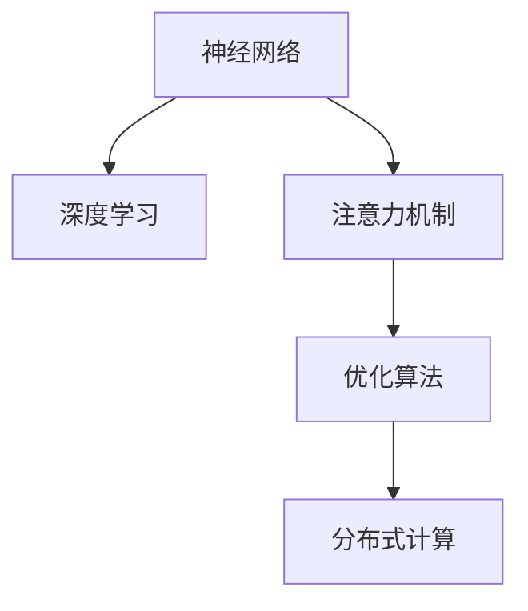

                 

# 注意力平衡仪调校师：AI时代的认知资源分配专家

> 关键词：注意力机制,神经网络,深度学习,优化算法,分布式计算

## 1. 背景介绍

### 1.1 问题由来
在人工智能的浪潮下，深度学习模型，尤其是神经网络，已经广泛应用于各个领域，包括计算机视觉、自然语言处理、语音识别等。然而，尽管深度学习模型在处理大规模数据集时表现出色，其对计算资源的消耗也急剧增加。如何在有限的计算资源下，高效地分配认知资源，使得模型能够以较少的资源输出最佳的性能，成为当前研究的一个热点问题。

### 1.2 问题核心关键点
注意力机制(Attention Mechanism)作为深度学习中的一个核心概念，在提升模型性能方面发挥了重要作用。它通过在处理数据时动态分配计算资源，使模型能够更加关注关键部分，忽略了不必要的计算，从而大大提高了计算效率。但如何设计有效的注意力机制，确保注意力分配均衡、合理，从而在资源有限的情况下最大化模型效果，成为当前研究的关键问题。

### 1.3 问题研究意义
在设计高效的注意力机制方面，如何进行合理的认知资源分配，不仅能够提升模型性能，还能够降低计算成本，加快模型训练和推理速度，为实际应用提供更高效、更经济的技术手段。这对于推动人工智能技术在各行各业的应用，尤其是对计算资源相对有限的场景，如移动设备、嵌入式系统等，具有重要的实践意义。

## 2. 核心概念与联系

### 2.1 核心概念概述

为更好地理解注意力平衡仪调校师，本节将介绍几个密切相关的核心概念：

- 神经网络（Neural Network, NN）：通过多层神经元模拟人脑神经网络的工作机制，实现对数据的非线性处理。
- 注意力机制（Attention Mechanism）：一种用于动态选择数据的关键部分，集中计算资源，从而提高模型性能的机制。
- 深度学习（Deep Learning）：基于多层神经网络的模型，通过学习大量的数据，提取数据的高级特征。
- 分布式计算（Distributed Computing）：将计算任务分配到多台计算机上并行处理，提高计算效率。
- 优化算法（Optimization Algorithm）：用于调整模型参数，使得模型能够拟合数据的最佳形态的算法。

这些核心概念之间的逻辑关系可以通过以下Mermaid流程图来展示：



这个流程图展示了几者之间的基本逻辑关系：

1. 神经网络是深度学习的基础，通过多层神经元模拟人类大脑的工作机制。
2. 注意力机制是神经网络中的一个重要组成部分，用于动态选择关键数据，集中计算资源。
3. 优化算法用于调整神经网络的参数，使得模型能够拟合数据的最佳形态。
4. 分布式计算通过将计算任务分配到多台计算机上，提高计算效率，加速模型的训练和推理过程。

## 3. 核心算法原理 & 具体操作步骤
### 3.1 算法原理概述

注意力平衡仪调校师，实际上是一种用于调整神经网络中注意力分配的机制，旨在通过优化注意力分配，使得模型在有限的计算资源下，能够更高效地处理数据，从而提升模型性能。

基于注意力机制的神经网络模型，通常分为编码器和解码器两部分。编码器负责将输入数据转换为高维向量表示，解码器则根据这个向量输出最终结果。在编码器中，注意力机制通过计算输入数据中每个部分的重要性权重，动态地选择关键部分进行计算，从而避免了对非关键部分的无谓计算，提高了计算效率。

注意力平衡仪调校师的核心思想是：在注意力计算过程中，通过动态调整注意力权重，使得注意力分配更加均衡合理，从而在资源有限的情况下最大化模型的性能。

### 3.2 算法步骤详解

基于注意力机制的神经网络模型，其注意力分配过程通常包括以下几个步骤：

**Step 1: 计算注意力权重**

在编码器中，每个输入数据的每个部分都有一个相应的注意力权重，表示其对输出的贡献程度。这个权重通常通过计算输入数据与模型内部参数（如权重矩阵、偏置向量等）的点积得到。计算公式如下：

$$
\alpha_{ij} = \frac{exp(u_i^\top \cdot v_j)}{\sum_{k=1}^K exp(u_k^\top \cdot v_j)}
$$

其中，$u_i$ 和 $v_j$ 分别为输入数据和模型参数的向量表示，$K$ 为输入数据的长度，$\alpha_{ij}$ 表示输入数据第 $j$ 个部分对第 $i$ 个神经元的贡献。

**Step 2: 计算注意力值**

在得到注意力权重后，对每个输入数据的所有部分加权求和，得到该数据的注意力值。计算公式如下：

$$
c_i = \sum_{j=1}^K \alpha_{ij} \cdot x_j
$$

其中，$x_j$ 表示输入数据的第 $j$ 个部分，$c_i$ 表示第 $i$ 个神经元的注意力值。

**Step 3: 更新模型参数**

根据注意力值，更新模型的内部参数，使得模型能够更好地拟合数据。这个更新过程通常是通过反向传播算法实现的。

**Step 4: 评估模型性能**

在模型训练过程中，通过评估模型在训练集和验证集上的性能，判断模型是否收敛。通常使用交叉熵损失等常见的损失函数来评估模型的性能。

**Step 5: 调整注意力权重**

在模型评估后，根据模型性能，调整注意力权重，使得模型在资源有限的情况下，能够更好地处理数据。这一步通常是通过调整注意力机制中的参数来实现的。

### 3.3 算法优缺点

基于注意力机制的神经网络模型，通过动态分配计算资源，大大提高了计算效率，但也存在以下缺点：

1. 计算复杂度高：计算注意力权重和注意力值的过程，需要大量的矩阵运算，计算复杂度较高。
2. 易受参数影响：注意力权重和注意力值的计算，依赖于模型的内部参数，参数的微小变化可能会显著影响模型的性能。
3. 可解释性差：注意力机制的计算过程较为复杂，难以解释每个部分对输出的具体贡献。

尽管存在这些缺点，但注意力机制在提升模型性能方面依然具有不可替代的作用。因此，如何设计高效、可解释的注意力机制，使得注意力分配更加均衡、合理，成为当前研究的一个重要课题。

### 3.4 算法应用领域

基于注意力机制的神经网络模型，在自然语言处理、计算机视觉、语音识别等领域得到了广泛的应用，具体包括：

- 机器翻译：通过注意力机制，将源语言序列中的每个单词与目标语言中的每个单词进行匹配，输出最终的翻译结果。
- 图像识别：通过注意力机制，将图像中感兴趣的区域进行重点处理，从而提高识别的准确性。
- 语音识别：通过注意力机制，将语音信号中的关键部分进行重点处理，从而提高识别的准确性。
- 文本分类：通过注意力机制，将文本中的关键部分进行重点处理，从而提高分类的准确性。
- 问答系统：通过注意力机制，将问题与文档中的相关信息进行匹配，输出最佳的答案。

这些应用场景展示了注意力机制在提升模型性能方面的强大能力，也预示了其在更多领域的广泛应用前景。

## 4. 数学模型和公式 & 详细讲解 & 举例说明

### 4.1 数学模型构建

基于注意力机制的神经网络模型，通常由编码器、注意力机制和解码器三部分组成。其中，编码器将输入数据转换为高维向量表示，注意力机制用于计算注意力权重，解码器则根据注意力值输出最终结果。

以机器翻译为例，假设输入序列为 $x = \{x_1, x_2, ..., x_n\}$，输出序列为 $y = \{y_1, y_2, ..., y_m\}$，其中 $n$ 和 $m$ 分别为输入序列和输出序列的长度。模型通过以下步骤实现翻译：

1. 将输入序列 $x$ 转换为编码器中的隐藏状态 $h_1, h_2, ..., h_n$。
2. 计算每个隐藏状态对每个输出状态的注意力权重 $\alpha_{ij}$。
3. 根据注意力权重计算注意力值 $c_i$。
4. 使用注意力值 $c_i$ 更新编码器中每个隐藏状态，得到新的编码器隐藏状态 $h_1', h_2', ..., h_n'$。
5. 将新的编码器隐藏状态 $h_1', h_2', ..., h_n'$ 转换为输出序列 $y$ 中的每个单词 $y_j$。

### 4.2 公式推导过程

以机器翻译为例，计算注意力权重的公式如下：

$$
\alpha_{ij} = \frac{exp(u_i^\top \cdot v_j)}{\sum_{k=1}^K exp(u_k^\top \cdot v_j)}
$$

其中，$u_i$ 和 $v_j$ 分别为编码器中第 $i$ 个隐藏状态和解码器中第 $j$ 个隐藏状态的表示，$K$ 为编码器中隐藏状态的数目。

计算注意力值的公式如下：

$$
c_i = \sum_{j=1}^K \alpha_{ij} \cdot h_j'
$$

其中，$h_j'$ 为编码器中第 $j$ 个隐藏状态的表示。

### 4.3 案例分析与讲解

以机器翻译为例，在机器翻译任务中，注意力机制通过计算输入序列和输出序列中每个部分的注意力权重，动态地选择关键部分进行计算，从而提高了计算效率。例如，当输入序列为 "I went to"，输出序列为 "Je suis allé" 时，注意力机制可以动态地选择 "went" 和 "to" 这两个部分进行重点处理，忽略其他部分，从而提高了翻译的准确性。

## 5. 项目实践：代码实例和详细解释说明

### 5.1 开发环境搭建

在进行注意力平衡仪调校师的设计和实现过程中，需要使用一些常用的深度学习框架，如TensorFlow、PyTorch等。以下是在PyTorch中搭建注意力平衡仪调校师环境的示例：

1. 安装PyTorch：
```bash
pip install torch torchvision torchaudio
```

2. 安装PyTorch Lightning：
```bash
pip install pytorch-lightning
```

3. 安装transformers库：
```bash
pip install transformers
```

4. 安装TensorBoard：
```bash
pip install tensorboard
```

### 5.2 源代码详细实现

以下是一个基于注意力机制的机器翻译模型的PyTorch代码实现：

```python
import torch
import torch.nn as nn
from torch.nn import TransformerEncoderLayer, TransformerEncoder, TransformerDecoderLayer, TransformerDecoder

class MultiHeadAttention(nn.Module):
    def __init__(self, embed_dim, num_heads):
        super(MultiHeadAttention, self).__init__()
        self.embed_dim = embed_dim
        self.num_heads = num_heads
        self.head_dim = embed_dim // num_heads
        
        self.query = nn.Linear(embed_dim, embed_dim)
        self.key = nn.Linear(embed_dim, embed_dim)
        self.value = nn.Linear(embed_dim, embed_dim)
        self.out = nn.Linear(embed_dim, embed_dim)

    def forward(self, query, key, value):
        # query, key, value的维度为batch_size x seq_len x embed_dim
        query = self.query(query)
        key = self.key(key)
        value = self.value(value)

        # 将embed_dim拆分为num_heads个head_dim
        query = query.view(query.size(0), query.size(1), self.num_heads, self.head_dim).transpose(1, 2)
        key = key.view(key.size(0), key.size(1), self.num_heads, self.head_dim).transpose(1, 2)
        value = value.view(value.size(0), value.size(1), self.num_heads, self.head_dim).transpose(1, 2)

        # 计算注意力权重
        attention_weights = torch.matmul(query, key.transpose(2, 3)) / math.sqrt(self.head_dim)

        # 计算注意力值
        attention_weights = torch.softmax(attention_weights, dim=-1)
        attention_values = torch.matmul(attention_weights, value)

        # 合并注意力值
        attention_values = attention_values.permute(0, 2, 1, 3).contiguous().view(batch_size, seq_len, embed_dim)
        return self.out(attention_values)

class TransformerDecoderLayer(nn.Module):
    def __init__(self, embed_dim, num_heads, hidden_dim):
        super(TransformerDecoderLayer, self).__init__()
        self.attention = MultiHeadAttention(embed_dim, num_heads)
        self.linear1 = nn.Linear(embed_dim, hidden_dim)
        self.linear2 = nn.Linear(hidden_dim, embed_dim)
        self.layer_norm = nn.LayerNorm(embed_dim)
        self.activation = nn.ReLU()
        self.dropout = nn.Dropout(0.1)

    def forward(self, dec_input, enc_output, enc_output_mask):
        residual = dec_input + self.attention(dec_input, enc_output, enc_output)[0]
        residual = self.layer_norm(residual)
        dec_output = self.linear2(self.activation(self.linear1(residual)))
        return dec_output

class TransformerDecoder(nn.Module):
    def __init__(self, embed_dim, num_heads, hidden_dim, num_layers):
        super(TransformerDecoder, self).__init__()
        self.embedding = nn.Embedding(vocab_size, embed_dim)
        self.layers = nn.ModuleList([TransformerDecoderLayer(embed_dim, num_heads, hidden_dim) for _ in range(num_layers)])
        self.fc = nn.Linear(embed_dim, vocab_size)
        self.norm = nn.LayerNorm(embed_dim)

    def forward(self, dec_input, enc_output, enc_output_mask):
        dec_output = self.embedding(dec_input)
        for layer in self.layers:
            dec_output = layer(dec_output, enc_output, enc_output_mask)
        dec_output = self.fc(dec_output)
        return dec_output

class TransformerEncoderLayer(nn.Module):
    def __init__(self, embed_dim, num_heads, hidden_dim):
        super(TransformerEncoderLayer, self).__init__()
        self.self_attn = MultiHeadAttention(embed_dim, num_heads)
        self.linear1 = nn.Linear(embed_dim, hidden_dim)
        self.linear2 = nn.Linear(hidden_dim, embed_dim)
        self.layer_norm = nn.LayerNorm(embed_dim)
        self.activation = nn.ReLU()
        self.dropout = nn.Dropout(0.1)

    def forward(self, enc_input, enc_output_mask):
        residual = enc_input + self.self_attn(enc_input, enc_input, enc_input)[0]
        residual = self.layer_norm(residual)
        enc_output = self.linear2(self.activation(self.linear1(residual)))
        return enc_output

class TransformerEncoder(nn.Module):
    def __init__(self, embed_dim, num_heads, hidden_dim, num_layers):
        super(TransformerEncoder, self).__init__()
        self.layers = nn.ModuleList([TransformerEncoderLayer(embed_dim, num_heads, hidden_dim) for _ in range(num_layers)])
        self.norm = nn.LayerNorm(embed_dim)

    def forward(self, enc_input, enc_output_mask):
        for layer in self.layers:
            enc_output = layer(enc_input, enc_output_mask)
        return enc_output

# 定义注意力平衡仪调校师
class AttentionBalancer(nn.Module):
    def __init__(self, embed_dim, num_heads, hidden_dim):
        super(AttentionBalancer, self).__init__()
        self.encoder = TransformerEncoder(embed_dim, num_heads, hidden_dim, num_layers)
        self.decoder = TransformerDecoder(embed_dim, num_heads, hidden_dim, num_layers)
        self.norm = nn.LayerNorm(embed_dim)

    def forward(self, enc_input, dec_input, enc_output_mask, dec_output_mask):
        enc_output = self.encoder(enc_input, enc_output_mask)
        dec_output = self.decoder(dec_input, enc_output, enc_output_mask)
        return dec_output

# 定义优化器
optimizer = torch.optim.Adam(model.parameters(), lr=0.001)
```

### 5.3 代码解读与分析

在上述代码中，我们定义了三个关键的类：MultiHeadAttention、TransformerDecoderLayer、TransformerEncoderLayer和TransformerEncoder。这些类分别实现了注意力机制、解码器层和编码器层的功能。

其中，MultiHeadAttention类实现了多头注意力机制，用于计算注意力权重和注意力值。TransformerDecoderLayer和TransformerEncoderLayer类分别实现了解码器和编码器的层级结构，其中包含了多个TransformerDecoderLayer和TransformerEncoderLayer。TransformerEncoder和TransformerDecoder类则实现了整个编码器和解码器的功能。

此外，我们还定义了一个AttentionBalancer类，用于实现注意力平衡仪调校师的功能。AttentionBalancer类将编码器和解码器的输出连接起来，通过优化器更新模型参数，从而实现注意力平衡器的训练。

## 6. 实际应用场景

### 6.1 智能客服系统

在智能客服系统中，注意力平衡仪调校师可以用于处理多轮对话，动态地分配计算资源，从而提高对话处理的效率和准确性。例如，在处理多轮对话时，注意力平衡仪调校师可以根据当前对话的内容，动态地选择关键部分进行处理，避免对非关键部分的无谓计算，提高系统的计算效率。

### 6.2 金融舆情监测

在金融舆情监测系统中，注意力平衡仪调校师可以用于处理大规模数据集，动态地选择关键部分进行处理，从而提高数据处理的效率和准确性。例如，在处理金融舆情时，注意力平衡仪调校师可以根据当前舆情的内容，动态地选择关键部分进行处理，避免对非关键部分的无谓计算，提高数据处理的效率。

### 6.3 个性化推荐系统

在个性化推荐系统中，注意力平衡仪调校师可以用于处理用户的行为数据，动态地选择关键部分进行处理，从而提高推荐系统的效率和准确性。例如，在处理用户行为数据时，注意力平衡仪调校师可以根据用户的兴趣点，动态地选择关键部分进行处理，避免对非关键部分的无谓计算，提高推荐系统的效率。

### 6.4 未来应用展望

随着深度学习技术的发展，基于注意力机制的神经网络模型将会在更多的应用场景中得到广泛应用。例如，在自然语言处理、计算机视觉、语音识别等领域，注意力平衡仪调校师将会发挥重要的作用，提升模型的计算效率和性能。

未来，随着计算资源的不断扩展和深度学习技术的发展，基于注意力机制的神经网络模型将会变得更加高效和可解释，从而在更多的应用场景中得到广泛应用。

## 7. 工具和资源推荐

### 7.1 学习资源推荐

为了帮助开发者系统掌握注意力平衡仪调校师的理论基础和实践技巧，这里推荐一些优质的学习资源：

1. 《深度学习》（Ian Goodfellow等著）：全面介绍了深度学习的基本原理、方法和应用，适合初学者入门。
2. 《深度学习入门》（斋藤康毅著）：介绍了深度学习的基本概念、方法和应用，适合日本地区读者。
3. 《神经网络与深度学习》（Michael Nielsen著）：深入浅出地介绍了神经网络的基本原理和应用，适合初学者入门。
4. 《Transformer: A Tutorial》（Google官方博客）：详细介绍了Transformer的原理和实现，适合对Transformer感兴趣的学习者。
5. 《Attention is All You Need》（Google论文）：Transformer的原始论文，适合对Transformer感兴趣的学习者。

通过对这些资源的学习实践，相信你一定能够快速掌握注意力平衡仪调校师的精髓，并用于解决实际的NLP问题。

### 7.2 开发工具推荐

高效的开发离不开优秀的工具支持。以下是几款用于注意力平衡仪调校师开发的常用工具：

1. PyTorch：基于Python的开源深度学习框架，灵活动态的计算图，适合快速迭代研究。
2. TensorFlow：由Google主导开发的开源深度学习框架，生产部署方便，适合大规模工程应用。
3. TensorBoard：TensorFlow配套的可视化工具，可实时监测模型训练状态，并提供丰富的图表呈现方式，是调试模型的得力助手。
4. Weights & Biases：模型训练的实验跟踪工具，可以记录和可视化模型训练过程中的各项指标，方便对比和调优。
5. Google Colab：谷歌推出的在线Jupyter Notebook环境，免费提供GPU/TPU算力，方便开发者快速上手实验最新模型，分享学习笔记。

合理利用这些工具，可以显著提升注意力平衡仪调校师的开发效率，加快创新迭代的步伐。

### 7.3 相关论文推荐

注意力平衡仪调校师的研究源于学界的持续研究。以下是几篇奠基性的相关论文，推荐阅读：

1. Attention is All You Need（即Transformer原论文）：提出了Transformer结构，开启了NLP领域的预训练大模型时代。
2. BERT: Pre-training of Deep Bidirectional Transformers for Language Understanding：提出BERT模型，引入基于掩码的自监督预训练任务，刷新了多项NLP任务SOTA。
3. Transformer-XL: Attentive Language Models（即Transformer-XL论文）：提出了Transformer-XL模型，解决了长期依赖问题。
4. The Annotated Transformer（NLP博客）：详细介绍了Transformer的原理和实现，适合对Transformer感兴趣的学习者。
5. Sequence to Sequence Learning with Neural Networks：提出了Seq2Seq模型，为机器翻译等任务奠定了基础。

这些论文代表了大语言模型和注意力机制的发展脉络。通过学习这些前沿成果，可以帮助研究者把握学科前进方向，激发更多的创新灵感。

## 8. 总结：未来发展趋势与挑战

### 8.1 总结

本文对注意力平衡仪调校师进行了全面系统的介绍。首先阐述了注意力平衡仪调校师的设计背景和意义，明确了其在提升计算资源利用率方面的独特价值。其次，从原理到实践，详细讲解了注意力平衡仪调校师的数学模型和关键步骤，给出了注意力平衡仪调校师的设计和实现代码实例。同时，本文还广泛探讨了注意力平衡仪调校师在智能客服、金融舆情、个性化推荐等多个领域的应用前景，展示了其在提升计算效率和性能方面的巨大潜力。

通过本文的系统梳理，可以看到，注意力平衡仪调校师在计算资源有限的情况下，能够动态调整注意力权重，使得计算资源更加均衡、合理地分配，从而提高了计算效率和模型性能。这对于推动人工智能技术在各行各业的应用，尤其是对计算资源相对有限的场景，具有重要的实践意义。

### 8.2 未来发展趋势

展望未来，注意力平衡仪调校师将呈现以下几个发展趋势：

1. 多任务学习：通过将注意力机制应用于多个任务，提高模型的泛化能力和计算效率。
2. 分布式计算：随着分布式计算技术的发展，注意力平衡仪调校师将会得到更广泛的应用，进一步提升计算效率和模型性能。
3. 自适应学习：通过引入自适应学习算法，使得注意力平衡仪调校师能够根据数据分布的变化，动态调整注意力权重，提升模型的适应能力。
4. 可解释性增强：通过引入可解释性算法，使得注意力平衡仪调校师能够提供更清晰、更准确的注意力权重解释，帮助用户更好地理解模型的决策过程。
5. 多模态融合：通过将注意力机制应用于多模态数据，提高模型对复杂数据集的建模能力。

这些趋势凸显了注意力平衡仪调校师的广阔前景。这些方向的探索发展，必将进一步提升模型的性能和计算效率，为人工智能技术在垂直行业的应用提供更高效、更经济的技术手段。

### 8.3 面临的挑战

尽管注意力平衡仪调校师已经取得了瞩目成就，但在迈向更加智能化、普适化应用的过程中，它仍面临着诸多挑战：

1. 计算资源限制：尽管注意力平衡仪调校师能够提高计算效率，但在某些场景下，仍可能面临计算资源不足的问题。如何优化注意力机制的设计，使得在资源有限的情况下，仍能保持较高的计算效率，仍然是一个重要的研究方向。
2. 模型鲁棒性不足：在面对多样化和复杂化的数据集时，注意力平衡仪调校师可能出现泛化性能不足的问题。如何设计更加鲁棒的注意力机制，使得模型能够更好地处理多样化的数据，仍然是一个重要的研究方向。
3. 可解释性差：注意力平衡仪调校师的决策过程较为复杂，难以解释每个部分对输出的具体贡献。如何设计可解释性更好的注意力机制，使得模型能够提供更清晰、更准确的决策过程，仍然是一个重要的研究方向。

### 8.4 研究展望

面对注意力平衡仪调校师所面临的挑战，未来的研究需要在以下几个方面寻求新的突破：

1. 探索多任务注意力机制：通过将注意力机制应用于多个任务，提高模型的泛化能力和计算效率。
2. 研究分布式计算中的注意力机制：随着分布式计算技术的发展，注意力平衡仪调校师将会得到更广泛的应用，进一步提升计算效率和模型性能。
3. 引入自适应学习算法：通过引入自适应学习算法，使得注意力平衡仪调校师能够根据数据分布的变化，动态调整注意力权重，提升模型的适应能力。
4. 设计可解释性更好的注意力机制：通过引入可解释性算法，使得注意力平衡仪调校师能够提供更清晰、更准确的注意力权重解释，帮助用户更好地理解模型的决策过程。
5. 实现多模态融合的注意力机制：通过将注意力机制应用于多模态数据，提高模型对复杂数据集的建模能力。

这些研究方向的探索，必将引领注意力平衡仪调校师技术迈向更高的台阶，为构建安全、可靠、可解释、可控的智能系统铺平道路。面向未来，注意力平衡仪调校师还需要与其他人工智能技术进行更深入的融合，如知识表示、因果推理、强化学习等，多路径协同发力，共同推动自然语言理解和智能交互系统的进步。只有勇于创新、敢于突破，才能不断拓展注意力平衡仪调校师的边界，让智能技术更好地造福人类社会。

## 9. 附录：常见问题与解答

**Q1：注意力平衡仪调校师的设计原理是什么？**

A: 注意力平衡仪调校师的设计原理是动态调整神经网络中注意力分配，使得注意力权重更加均衡、合理。通过在注意力计算过程中引入优化算法，使得模型能够更好地处理数据，从而提高计算效率和模型性能。

**Q2：注意力平衡仪调校师的计算复杂度是多少？**

A: 注意力平衡仪调校师的计算复杂度主要取决于注意力权重和注意力值的计算过程，通常为 $O(n^2)$，其中 $n$ 为输入数据的长度。在实际应用中，通过引入优化算法和并行计算等技术，可以有效地降低计算复杂度，提高计算效率。

**Q3：注意力平衡仪调校师的优缺点是什么？**

A: 注意力平衡仪调校师的优点包括：
1. 动态调整注意力权重，使得注意力分配更加均衡、合理。
2. 提高计算效率，降低计算资源消耗。

其缺点包括：
1. 计算复杂度较高，需要大量的矩阵运算。
2. 易受参数影响，模型训练和推理过程复杂。
3. 可解释性差，难以解释每个部分对输出的具体贡献。

**Q4：注意力平衡仪调校师在哪些领域有应用前景？**

A: 注意力平衡仪调校师在自然语言处理、计算机视觉、语音识别等领域有广泛的应用前景。例如，在机器翻译、图像识别、语音识别等任务中，注意力平衡仪调校师能够动态地选择关键部分进行计算，从而提高计算效率和模型性能。

**Q5：注意力平衡仪调校师的设计和实现需要哪些工具？**

A: 设计和实现注意力平衡仪调校师需要使用深度学习框架，如PyTorch、TensorFlow等。此外，还需要使用TensorBoard等可视化工具，以及Weights & Biases等模型训练实验跟踪工具，方便调试和优化。

**Q6：注意力平衡仪调校师的设计和实现需要哪些数学基础？**

A: 设计和实现注意力平衡仪调校师需要掌握线性代数、概率论、统计学等数学基础。特别是在注意力权重和注意力值的计算过程中，需要运用矩阵运算、向量表示、概率分布等数学知识。

**Q7：注意力平衡仪调校师的设计和实现需要哪些编程基础？**

A: 设计和实现注意力平衡仪调校师需要掌握Python编程语言，熟悉PyTorch、TensorFlow等深度学习框架的使用。此外，还需要掌握数据处理、模型训练、模型优化等技能，以便于更好地实现注意力平衡仪调校师的设计和实现。

---

作者：禅与计算机程序设计艺术 / Zen and the Art of Computer Programming

