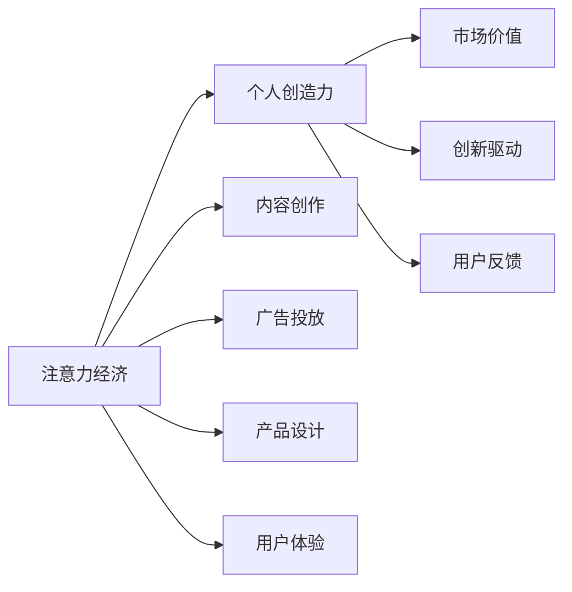

                 

# 注意力经济与个人创造力的关系

注意力经济（Attention Economy）是互联网时代的一种新型经济模式，基于争夺用户注意力资源的竞争。个人创造力（Individual Creativity）则指个体运用知识、技能、想象力等进行创新、设计、表达的能力。在注意力经济的大背景下，个人创造力作为一种稀缺资源，其价值和表现方式都在发生深刻变化。本文旨在探讨注意力经济与个人创造力之间的关系，分析其背后的影响因素，并提出一些策略以最大化个人创造力的价值。

## 1. 背景介绍

### 1.1 问题由来
随着互联网的普及和数字技术的快速发展，信息过载、注意力碎片化等问题日益凸显。这些现象对个人创造力的发挥产生了重大影响，也催生了注意力经济这一新的经济形态。注意力经济以争夺用户注意力为竞争焦点，形成了一种新的市场价值和生产方式。个人创造力作为知识创新的源泉，在此背景下如何发挥，成为值得深入探讨的问题。

### 1.2 问题核心关键点
1. **注意力经济与创造力的互动关系**：
   - 注意力经济如何影响个人创造力的发挥？
   - 个人创造力如何影响注意力经济的竞争格局？

2. **个人创造力的价值**：
   - 创造力在注意力经济中的实际应用场景有哪些？
   - 如何提升个人创造力的市场价值？

3. **策略与实践**：
   - 如何构建有效的注意力经济与个人创造力的协同机制？
   - 如何在注意力经济的框架下最大化个人创造力的潜力？

### 1.3 问题研究意义
研究注意力经济与个人创造力的关系，对于理解互联网时代经济新形态、提升个体创造力价值、探索创新驱动发展的路径具有重要意义。

## 2. 核心概念与联系

### 2.1 核心概念概述

- **注意力经济（Attention Economy）**：
  - 指在信息爆炸时代，通过争夺用户注意力来创造价值的新经济模式。核心在于吸引、保持和最大化用户的注意力，从而实现商业目的。

- **个人创造力（Individual Creativity）**：
  - 指个体运用知识、技能、想象力等进行创新、设计、表达的能力。创造力可以体现在艺术创作、科技创新、商业策划等多个领域。

- **互动关系**：
  - 注意力经济与个人创造力之间存在着复杂的互动关系。注意力经济需要高价值的创意内容来吸引用户，而个人创造力的发挥也离不开市场环境的支持。

### 2.2 核心概念原理和架构的 Mermaid 流程图



此流程图展示了注意力经济与个人创造力之间的互动关系。注意力经济通过内容创作、广告投放、产品设计和用户体验等手段吸引用户，进而提升个人创造力的市场价值，驱动更多的创新。同时，用户反馈也成为提升个人创造力的重要信息来源。

## 3. 核心算法原理 & 具体操作步骤

### 3.1 算法原理概述

在注意力经济与个人创造力的互动关系中，主要涉及以下几个算法原理：

- **内容推荐算法**：
  - 利用用户的历史行为数据和内容特征，推荐与用户兴趣相关的创意内容。这直接影响个人创造力的市场曝光和价值实现。

- **用户行为分析**：
  - 通过分析用户在不同平台上的行为数据，挖掘用户的兴趣偏好，指导内容创作和广告投放策略，从而最大化个人创造力的吸引力。

- **价值评估模型**：
  - 构建用户对创意内容价值的评估模型，用于衡量创造力的市场价值，指导创作方向和资源分配。

### 3.2 算法步骤详解

以下是注意力经济与个人创造力互动关系中的主要算法步骤：

**Step 1: 数据收集与预处理**
- 收集用户的历史行为数据（浏览、点赞、评论等）
- 收集创意内容特征数据（关键词、标签、风格等）
- 进行数据清洗和预处理，消除噪音，确保数据质量。

**Step 2: 内容推荐**
- 利用协同过滤、矩阵分解等推荐算法，根据用户兴趣推荐创意内容。
- 动态调整推荐策略，提高内容相关性和用户满意度。

**Step 3: 用户行为分析**
- 使用聚类、分类等算法，挖掘用户的兴趣偏好和行为模式。
- 结合时间序列分析，预测用户的未来行为趋势，指导内容创作和广告投放。

**Step 4: 价值评估**
- 构建价值评估模型，如基于用户的点击率、停留时间、分享次数等指标的评估体系。
- 使用机器学习算法对数据进行建模，实时更新模型参数，确保评估结果的准确性。

**Step 5: 反馈机制**
- 收集用户的反馈数据，如评分、评论、互动等。
- 根据用户反馈调整内容策略，提升创作质量。

### 3.3 算法优缺点

**优点**：
- 数据驱动：通过数据收集和分析，优化内容推荐和创作策略，提升个人创造力的市场价值。
- 实时调整：利用机器学习算法，实时分析用户行为，动态调整推荐策略，提高用户满意度。
- 精准评估：构建价值评估模型，准确衡量创造力的市场价值，指导创作方向。

**缺点**：
- 数据隐私：大量的用户行为数据收集和使用，涉及隐私保护问题。
- 算法偏见：推荐算法可能存在偏见，影响公平性。
- 过拟合风险：基于用户历史数据的推荐模型可能过拟合，导致推荐内容多样性不足。

### 3.4 算法应用领域

注意力经济与个人创造力的互动关系，广泛应用在以下领域：

1. **内容平台**：
   - 如YouTube、Bilibili、知乎等，通过个性化推荐提升内容价值，吸引更多用户关注。

2. **广告行业**：
   - 如Facebook、Google Adwords，通过精准投放广告，最大化创意内容的影响力。

3. **产品设计**：
   - 如美团、携程等O2O平台，通过分析用户行为，优化产品设计，提高用户体验。

4. **文化艺术**：
   - 如Coursera、Udemy等在线教育平台，通过推荐系统展示创意课程，提升课程吸引力。

5. **科技创新**：
   - 如Google、Microsoft等科技公司，通过用户行为分析，指导技术研发方向。

## 4. 数学模型和公式 & 详细讲解 & 举例说明

### 4.1 数学模型构建

以协同过滤推荐算法为例，构建用户-物品评分矩阵 $R \in \mathbb{R}^{N \times M}$，其中 $N$ 为用户数，$M$ 为物品数。设用户 $u$ 对物品 $i$ 的评分 $r_{ui}$ 为 $R_{ui}$。用户与物品间的相似度矩阵 $S \in \mathbb{R}^{N \times M}$，通过余弦相似度或皮尔逊相关系数计算。设 $A \in \mathbb{R}^{N \times K}$ 为用户特征矩阵，$B \in \mathbb{R}^{M \times K}$ 为物品特征矩阵，$K$ 为特征维度。

### 4.2 公式推导过程

协同过滤推荐算法的基本公式如下：

$$
\hat{r}_{ui} = \sum_{j=1}^{K} a_{uj} S_{ji} b_{ji}
$$

其中 $\hat{r}_{ui}$ 为用户 $u$ 对物品 $i$ 的预测评分，$a_{uj}$ 和 $b_{ji}$ 为物品 $i$ 和用户 $u$ 的特征向量，$S_{ji}$ 为物品 $i$ 和物品 $j$ 之间的相似度。

用户对物品的评分可以通过以下损失函数进行优化：

$$
L(R, \hat{R}) = \frac{1}{2N} \sum_{i=1}^{M} \sum_{u=1}^{N} (r_{ui} - \hat{r}_{ui})^2
$$

目标是最小化预测评分与真实评分之间的均方误差。

### 4.3 案例分析与讲解

以YouTube平台为例，分析其个性化推荐系统的工作原理。

1. **用户行为数据收集**：
   - 收集用户观看视频的记录、点赞、评论等行为数据。

2. **内容特征提取**：
   - 提取视频的标题、描述、标签等文本特征，进行向量化表示。

3. **协同过滤推荐**：
   - 通过余弦相似度计算用户与视频的相似度矩阵。
   - 利用矩阵分解算法分解用户特征和视频特征矩阵，进行预测评分。

4. **模型训练与评估**：
   - 使用交叉验证等方法，训练模型并评估推荐效果。
   - 根据用户反馈调整模型参数，提高推荐准确性。

## 5. 项目实践：代码实例和详细解释说明

### 5.1 开发环境搭建

以下是一个基于Python的协同过滤推荐系统的开发环境搭建流程：

1. 安装Python：确保Python 3.7以上版本。
2. 安装NumPy、SciPy等科学计算库。
3. 安装scikit-learn库，用于数据处理和机器学习算法实现。
4. 安装Pandas库，用于数据导入和处理。
5. 安装TensorFlow或PyTorch，用于构建和训练推荐模型。

### 5.2 源代码详细实现

```python
import numpy as np
from sklearn.metrics import mean_squared_error
from sklearn.decomposition import TruncatedSVD

# 构建用户-物品评分矩阵
R = np.array([
    [0, 1, 0, 3],
    [0, 0, 2, 1],
    [4, 0, 0, 2],
    [1, 0, 0, 0]
])

# 构建用户特征和物品特征矩阵
A = np.array([
    [0.1, 0.2, 0.3],
    [0.4, 0.5, 0.6],
    [0.7, 0.8, 0.9]
])
B = np.array([
    [0.3, 0.2, 0.1],
    [0.6, 0.5, 0.4],
    [0.9, 0.8, 0.7]
])

# 计算相似度矩阵
S = np.dot(A, B.T)

# 矩阵分解
svd = TruncatedSVD(n_components=2)
svd.fit(R)
X = svd.transform(A)
Y = svd.transform(B.T)

# 预测评分
Y_pred = np.dot(X, Y.T)

# 评估推荐效果
mse = mean_squared_error(R, Y_pred)
print(f"MSE: {mse}")
```

### 5.3 代码解读与分析

以上代码实现了基于矩阵分解的协同过滤推荐算法。通过构建用户-物品评分矩阵 $R$、用户特征矩阵 $A$、物品特征矩阵 $B$，计算相似度矩阵 $S$，并进行矩阵分解。通过矩阵乘法预测用户对物品的评分，使用均方误差评估推荐效果。

## 6. 实际应用场景

### 6.1 内容平台

**应用场景**：
- 用户通过观看、点赞、评论等行为，形成数据积累。
- 内容平台利用协同过滤、矩阵分解等算法，个性化推荐相关内容。

**效果**：
- 提升用户满意度，增加平台粘性。
- 提高创意内容的曝光率，增加内容创作者的市场价值。

### 6.2 广告行业

**应用场景**：
- 广告主根据目标用户的行为数据，定向投放广告。
- 通过点击率、转化率等指标评估广告效果。

**效果**：
- 提高广告投放的精准度，提升广告主的市场回报率。
- 吸引更多目标用户关注创意内容，增加用户对广告的点击和互动。

### 6.3 产品设计

**应用场景**：
- 用户在使用产品过程中，产生行为数据。
- 产品设计团队分析用户行为，优化产品功能。

**效果**：
- 提升用户的使用体验和满意度。
- 指导产品设计的创新方向，提高产品的市场竞争力。

### 6.4 文化艺术

**应用场景**：
- 在线教育平台根据用户的历史学习行为，推荐课程。
- 内容创作者通过课程销售等手段，获得市场回报。

**效果**：
- 提高课程的吸引力，增加用户的付费意愿。
- 促进创意内容的创作和传播，提升内容创作者的市场价值。

## 7. 工具和资源推荐

### 7.1 学习资源推荐

1. **Coursera《推荐系统》课程**：
   - 提供系统的推荐系统理论和算法讲解，适合初学者入门。

2. **《推荐系统实战》书籍**：
   - 详细介绍了推荐系统的开发流程和实现方法，并结合实际案例分析。

3. **Kaggle推荐系统竞赛**：
   - 通过参与竞赛，实战学习和提升推荐系统开发能力。

### 7.2 开发工具推荐

1. **TensorFlow**：
   - 深度学习框架，支持构建和训练推荐系统模型。

2. **PyTorch**：
   - 灵活的深度学习框架，适合进行创新实验和研究。

3. **Python的Scikit-learn库**：
   - 丰富的机器学习算法库，适用于数据处理和模型训练。

4. **Hadoop、Spark等大数据处理工具**：
   - 支持大规模数据处理，优化推荐系统的实时性。

### 7.3 相关论文推荐

1. **《协同过滤推荐算法综述》**：
   - 系统总结了协同过滤算法的原理和实现方法。

2. **《深度学习在推荐系统中的应用》**：
   - 介绍了深度学习在推荐系统中的多维应用，并结合最新研究进展。

3. **《用户行为分析与推荐系统》**：
   - 深入探讨了用户行为数据在推荐系统中的应用，并提出新的算法和模型。

## 8. 总结：未来发展趋势与挑战

### 8.1 研究成果总结

本文分析了注意力经济与个人创造力的互动关系，探讨了在注意力经济环境下提升个人创造力价值的策略和方法。通过协同过滤推荐算法等具体案例，展示了注意力经济在实际应用中的效果。

### 8.2 未来发展趋势

1. **个性化推荐算法的发展**：
   - 推荐算法将更加智能和精细，实现个性化推荐效果的优化。

2. **用户行为分析的深化**：
   - 通过更深入的行为分析，挖掘用户隐含的需求和偏好，提高推荐系统的精准度。

3. **数据隐私与伦理问题**：
   - 在数据收集和使用过程中，更加重视隐私保护和伦理问题。

4. **跨平台推荐系统**：
   - 构建跨平台的推荐系统，实现数据和用户的多样化整合，提升推荐效果。

### 8.3 面临的挑战

1. **数据隐私**：
   - 如何在保护用户隐私的同时，收集和使用有效的行为数据。

2. **算法偏见**：
   - 如何减少推荐算法中的偏见，确保公平性。

3. **过拟合风险**：
   - 如何在保证推荐效果的同时，避免模型的过拟合。

4. **计算效率**：
   - 如何在保证推荐效果的同时，提升系统的计算效率，满足实时性要求。

5. **用户接受度**：
   - 如何在用户接受和推荐效果之间取得平衡，提高用户满意度。

### 8.4 研究展望

未来，需要从以下几个方向进行深入研究：

1. **隐私保护与数据共享**：
   - 研究隐私保护技术，确保用户数据的合法使用。

2. **算法公平性**：
   - 发展公平性评估方法和算法，确保推荐系统的公平性。

3. **个性化与多样性**：
   - 如何在个性化推荐的同时，增加推荐内容的多样性。

4. **实时推荐系统**：
   - 构建实时推荐系统，提升推荐效果的及时性和准确性。

## 9. 附录：常见问题与解答

**Q1：如何平衡个性化推荐与数据隐私保护？**

A: 通过差分隐私技术（Differential Privacy）等方法，可以在保护用户隐私的同时，收集和使用有效的行为数据。具体来说，可以在数据收集过程中添加噪声，使得单个用户的隐私信息难以被识别，同时整体数据的统计性质不受影响。

**Q2：如何提高推荐系统的算法公平性？**

A: 通过公平性评估指标（如平等误差、机会差异等）和算法调整（如重采样、加权等），确保推荐系统的公平性。同时，结合用户反馈数据，动态调整推荐策略，减少算法偏见。

**Q3：如何处理推荐系统中的过拟合问题？**

A: 通过引入正则化技术、降低模型复杂度、增加训练数据等方法，可以有效缓解过拟合问题。同时，可以采用集成学习、模型剪枝等技术，提升推荐系统的泛化能力。

**Q4：如何优化推荐系统的实时性？**

A: 通过数据缓存、模型压缩、分布式计算等技术，提升推荐系统的实时性。同时，可以采用增量学习等方法，实现在线学习和更新。

**Q5：如何提升用户对推荐系统的接受度？**

A: 通过用户界面设计、推荐解释系统、个性化设置等方法，提高用户对推荐系统的接受度。同时，可以收集用户反馈数据，持续优化推荐系统。

---

作者：禅与计算机程序设计艺术 / Zen and the Art of Computer Programming

