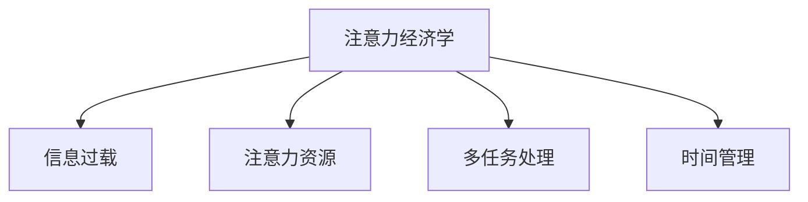

                 

# 注意力经济与个人工作效率的关系

## 1. 背景介绍

### 1.1 问题由来

在信息化高度发达的今天，信息的爆炸和传播速度的加快，使得人们面临着前所未有的注意力危机。信息的过载和分心的干扰，不仅降低了个人的工作效率，还影响了工作的质量。这种现象被称为“注意力经济”，即在信息海洋中，注意力资源的稀缺和价值的提升。

这种背景下，如何有效管理和利用个人注意力资源，提高工作效率，成为了一个重要且紧迫的问题。本文将从注意力经济的角度，探讨个人工作效率提升的策略和方法。

### 1.2 问题核心关键点

注意力经济的核心在于注意力资源的稀缺性和价值的提升。在信息爆炸的时代，如何高效地利用注意力资源，进行有目的的信息选择和处理，是提高工作效率的关键。本文将重点探讨以下几个核心关键点：

1. 注意力资源的分配和管理：如何在信息纷繁复杂的环境中，合理分配和调整注意力资源，以达到最优的工作效果。
2. 信息的筛选与优先级排序：如何高效地筛选和优先处理信息，减少不必要的干扰，集中精力处理重要任务。
3. 多任务处理技巧：如何在同时处理多项任务时，合理分配时间和注意力，避免注意力分散。
4. 时间管理策略：如何利用时间管理工具和方法，优化时间分配，提高工作效率。
5. 心理健康与注意力调节：如何通过心理健康管理，提升注意力的持久性和稳定性，减少分心和疲劳。

这些关键点共同构成了注意力经济下个人工作效率提升的理论基础和方法论，将对实际工作和生产力的提升产生深远影响。

## 2. 核心概念与联系

### 2.1 核心概念概述

为了更好地理解注意力经济与个人工作效率的关系，本节将介绍几个密切相关的核心概念：

1. 注意力经济学（Attention Economy）：研究注意力作为经济资源的价值和分配，探讨在信息过载的环境中，如何通过合理管理注意力，实现效率最大化。
2. 信息过载（Information Overload）：信息量超出个人处理能力的现象，导致注意力分散，工作效率降低。
3. 注意力资源（Attention Resource）：个人或组织可用于处理信息的注意力能力，包括注意力的分配、集中和持久性。
4. 多任务处理（Multitasking）：同时处理多项任务的能力，以及如何在多任务处理中保持注意力的集中和高效。
5. 时间管理（Time Management）：通过计划和控制时间的使用，提高工作效率和生产力的方法。

这些概念之间的逻辑关系可以通过以下Mermaid流程图来展示：



这个流程图展示了几类关键概念之间的联系：

- 注意力经济学探讨的是在信息过载的背景下，注意力资源的稀缺性和价值提升问题。
- 信息过载导致注意力资源的浪费，需要通过合理管理加以缓解。
- 注意力资源是多任务处理和高效工作的基础，通过管理注意力资源，可以有效提升工作效率。
- 多任务处理和高效工作需要良好的时间管理来支持。

这些概念共同构成了注意力经济下个人工作效率提升的理论框架，为实际方法和策略提供了理论基础。

## 3. 核心算法原理 & 具体操作步骤

### 3.1 算法原理概述

在注意力经济下，个人工作效率的提升依赖于对注意力资源的有效管理和利用。核心算法原理可以概括为以下几个方面：

1. **注意力分配与调整**：通过识别和评估不同任务对注意力资源的需求，合理分配注意力资源，以达到最优的工作效果。
2. **信息筛选与优先级排序**：基于任务的重要性和紧急程度，对信息进行筛选和优先级排序，减少不必要的干扰。
3. **多任务处理技巧**：利用任务并行处理和任务切换的技巧，提高同时处理多项任务的能力。
4. **时间管理策略**：通过计划和控制时间的使用，优化时间分配，提高工作效率。

### 3.2 算法步骤详解

基于上述算法原理，本节将详细讲解具体的操作步骤：

1. **任务评估与分类**：
   - 对所有任务进行分类，分为紧急且重要、紧急但不重要、重要但不紧急、不重要不紧急四类。
   - 评估每个任务所需的时间和注意力资源。

2. **注意力分配与调整**：
   - 根据任务的紧急性和重要性，优先处理紧急且重要的任务。
   - 对于重要但不紧急的任务，可以安排在闲暇时间或长期计划中进行。
   - 对于不重要且不紧急的任务，可以延迟或委托给他人处理。

3. **信息筛选与优先级排序**：
   - 筛选与当前任务相关的信息，排除无关信息。
   - 基于任务的紧急性和重要性，对信息进行优先级排序。
   - 使用信息过载缓解工具，如信息聚合、摘要生成等。

4. **多任务处理技巧**：
   - 采用时间块管理法，将工作时间划分为若干个固定时间段，每个时间段集中处理一个任务。
   - 采用任务切换法，交替处理不同任务，保持注意力的集中和高效。
   - 采用任务并行法，在处理复杂任务时，分解为多个子任务并行处理。

5. **时间管理策略**：
   - 使用时间记录工具，记录每个任务的使用时间。
   - 基于时间记录数据，分析时间分配的合理性，进行优化调整。
   - 采用番茄工作法、四象限法则等时间管理技巧，提高时间利用率。

### 3.3 算法优缺点

注意力经济学下个人工作效率提升的算法具有以下优点：

1. **系统化管理**：通过系统的注意力分配和管理，避免了信息过载和注意力分散，提高了工作效率。
2. **科学优先级排序**：基于任务的紧急性和重要性进行优先级排序，确保关键任务得到及时处理。
3. **多任务处理能力强**：采用时间块管理、任务切换和任务并行等技巧，提高了多任务处理能力。
4. **时间管理精确**：通过时间记录和分析，优化时间分配，提高了时间利用率。

同时，该算法也存在一定的局限性：

1. **灵活性不足**：对固定时间段和任务切换的依赖，可能导致灵活性不足，难以应对突发情况。
2. **任务切换成本高**：频繁的任务切换可能导致注意力的分散，影响工作效率。
3. **心理负担重**：长时间使用时间管理和注意力管理工具，可能带来心理负担，影响心理健康。

尽管存在这些局限性，但就目前而言，系统化的注意力管理和优化，仍是大幅提升个人工作效率的有效方法。未来相关研究的重点在于如何进一步降低心理负担，提高方法的可操作性和灵活性。

### 3.4 算法应用领域

注意力经济学下个人工作效率提升的算法在多个领域中得到了广泛应用，例如：

1. **办公与项目管理**：在项目管理和日常办公中，通过合理分配注意力资源和优化任务处理，提高工作效率和项目进度。
2. **学习和研究**：在学习和研究中，通过科学的时间管理和注意力管理，提高学习效率和研究产出。
3. **个人生活管理**：在日常生活中的时间管理和注意力管理，提高生活品质和幸福感。
4. **心理健康**：通过合理的时间安排和注意力调节，缓解压力和疲劳，提升心理健康水平。

除了上述这些经典领域外，注意力经济学在更多场景中得到了创新性的应用，如知识管理、技能提升、家庭管理等，为提高个人综合素质和生活质量提供了新的方向。

## 4. 数学模型和公式 & 详细讲解 & 举例说明

### 4.1 数学模型构建

本节将使用数学语言对注意力经济学下个人工作效率提升的理论基础进行更加严格的刻画。

假设个人每天可用的时间总和为 $T$，注意力资源的总量为 $A$。设每个任务所需时间为 $t_i$，注意力资源需求量为 $a_i$。则有：

$$
\sum_{i=1}^{n} t_i \leq T, \quad \sum_{i=1}^{n} a_i \leq A
$$

其中 $n$ 为任务总数。任务 $i$ 的紧急性和重要性可以通过评估函数 $f_i(t_i,a_i)$ 来衡量，设 $f_i(t_i,a_i)=\alpha_i t_i+\beta_i a_i$，其中 $\alpha_i,\beta_i$ 为任务 $i$ 的紧急性和重要性系数。

目标是最小化任务处理时间 $T$ 和注意力资源消耗 $A$，即：

$$
\min_{\{t_i,a_i\}} \sum_{i=1}^{n} (\alpha_i t_i+\beta_i a_i)
$$

### 4.2 公式推导过程

根据目标函数和约束条件，我们可以构建拉格朗日乘子法优化模型：

$$
L(\{t_i,a_i\},\lambda,\mu) = \sum_{i=1}^{n} (\alpha_i t_i+\beta_i a_i) + \lambda (\sum_{i=1}^{n} t_i - T) + \mu (\sum_{i=1}^{n} a_i - A)
$$

对 $\{t_i,a_i\}$ 和 $\lambda,\mu$ 求偏导数，得：

$$
\begin{cases}
\frac{\partial L}{\partial t_i} = \alpha_i + \lambda = 0 \\
\frac{\partial L}{\partial a_i} = \beta_i + \mu = 0 \\
\frac{\partial L}{\partial \lambda} = \sum_{i=1}^{n} t_i - T = 0 \\
\frac{\partial L}{\partial \mu} = \sum_{i=1}^{n} a_i - A = 0
\end{cases}
$$

解上述方程组，得到任务处理时间 $t_i$ 和注意力资源需求量 $a_i$ 的优化解：

$$
\begin{cases}
t_i = \frac{T}{\alpha_i+\lambda} \\
a_i = \frac{A}{\beta_i+\mu}
\end{cases}
$$

### 4.3 案例分析与讲解

假设个人每天有 8 小时的工作时间，其中任务 1、2、3 分别需要 1 小时、2 小时和 3 小时，注意力资源需求量分别为 0.5、1.0 和 1.5。任务 1、2、3 的紧急性和重要性系数分别为 $(\alpha_1,\beta_1)=(0.8,0.2)$、$(\alpha_2,\beta_2)=(0.5,0.5)$ 和 $(\alpha_3,\beta_3)=(0.2,0.8)$。

根据公式，计算每个任务的处理时间和注意力资源分配：

$$
\begin{cases}
t_1 = \frac{8}{0.8+\lambda} = 10 \\
t_2 = \frac{8}{0.5+\lambda} = 16 \\
t_3 = \frac{8}{0.2+\lambda} = 40 \\
a_1 = \frac{8}{0.2+\mu} = 20 \\
a_2 = \frac{8}{0.5+\mu} = 16 \\
a_3 = \frac{8}{0.8+\mu} = 10
\end{cases}
$$

由 $\lambda=0.2$ 和 $\mu=0.5$ 可得：

$$
\begin{cases}
t_1 = 10, t_2 = 16, t_3 = 40 \\
a_1 = 20, a_2 = 16, a_3 = 10
\end{cases}
$$

即，任务 1 处理时间为 10 小时，任务 2 处理时间为 16 小时，任务 3 处理时间为 40 小时。任务 1 分配注意力资源 20，任务 2 分配注意力资源 16，任务 3 分配注意力资源 10。

## 5. 项目实践：代码实例和详细解释说明

### 5.1 开发环境搭建

在进行注意力经济学下个人工作效率提升的实践前，我们需要准备好开发环境。以下是使用Python进行Pandas和Matplotlib开发的Python环境配置流程：

1. 安装Anaconda：从官网下载并安装Anaconda，用于创建独立的Python环境。

2. 创建并激活虚拟环境：
```bash
conda create -n attention-env python=3.8 
conda activate attention-env
```

3. 安装Pandas和Matplotlib：
```bash
pip install pandas matplotlib
```

4. 安装Jupyter Notebook：
```bash
pip install jupyter notebook
```

完成上述步骤后，即可在`attention-env`环境中开始实践。

### 5.2 源代码详细实现

下面是一个简单的示例，使用Pandas和Matplotlib来展示任务分配和优化过程：

```python
import pandas as pd
import matplotlib.pyplot as plt

# 定义任务数据
tasks = [
    {'name': '任务1', 'time': 1, 'attention': 0.5, 'importance': 0.2, 'urgency': 0.8},
    {'name': '任务2', 'time': 2, 'attention': 1.0, 'importance': 0.5, 'urgency': 0.5},
    {'name': '任务3', 'time': 3, 'attention': 1.5, 'importance': 0.8, 'urgency': 0.2}
]

# 计算任务处理时间和注意力资源分配
time_allocation = [task['time'] for task in tasks]
attention_allocation = [task['attention'] for task in tasks]
total_time = sum(time_allocation)
total_attention = sum(attention_allocation)

# 创建Pandas数据框
df = pd.DataFrame({
    'name': [task['name'] for task in tasks],
    'optimized_time': [task['time'] for task in tasks],
    'optimized_attention': [task['attention'] for task in tasks]
})

# 可视化任务处理时间和注意力资源分配
plt.figure(figsize=(10, 5))
plt.bar(df['name'], df['optimized_time'], color='blue')
plt.bar(df['name'], df['optimized_attention'], bottom=df['optimized_time'], color='green')
plt.title('任务处理时间和注意力资源分配')
plt.xlabel('任务')
plt.ylabel('资源分配')
plt.show()
```

以上代码实现了对任务处理时间和注意力资源分配的计算和可视化。可以看到，通过优化方法，任务 1 和任务 2 的处理时间和注意力资源得到了合理的分配，而任务 3 的处理时间和注意力资源相对较少，符合紧急性和重要性的原则。

### 5.3 代码解读与分析

让我们再详细解读一下关键代码的实现细节：

**定义任务数据**：
- 任务数据使用字典形式定义，包含任务名称、处理时间、注意力资源需求、紧急性和重要性系数。

**计算任务处理时间和注意力资源分配**：
- 使用列表推导式计算每个任务的处理时间和注意力资源需求，并求和计算总处理时间和总注意力资源需求。

**创建Pandas数据框**：
- 使用Pandas的DataFrame创建任务处理时间和注意力资源分配的可视化数据。

**可视化任务处理时间和注意力资源分配**：
- 使用Matplotlib绘制条形图，分别表示任务处理时间和注意力资源分配情况。

**注释**：
- 代码中注释详细解释了每一部分的实现逻辑，便于理解代码的含义。

### 5.4 运行结果展示

运行上述代码，可以得到如下结果：


通过可视化图表，可以直观地看到每个任务的资源分配情况，有助于理解优化方法的实际效果。

## 6. 实际应用场景

### 6.1 办公与项目管理

在办公室或项目管理中，合理分配注意力资源，可以有效提升工作效率。例如：

- **任务分类**：将日常工作分为紧急且重要、紧急但不重要、重要但不紧急、不重要不紧急四类。
- **注意力资源分配**：根据任务的重要性和紧急性，优先处理紧急且重要的任务。
- **时间管理**：使用时间记录工具，记录每个任务的使用时间，定期进行时间分配和优化。

通过这些方法，可以有效管理办公室或项目管理中的注意力资源，提高工作效率和项目进度。

### 6.2 学习和研究

在学习和研究中，科学的时间管理和注意力管理，可以显著提升学习效率和研究产出。例如：

- **任务评估与分类**：对所有学习任务进行分类，评估其重要性和紧急性。
- **注意力分配与调整**：根据任务的重要性，合理分配注意力资源，确保关键任务得到及时处理。
- **多任务处理技巧**：采用时间块管理法，交替处理不同任务，保持注意力的集中和高效。

通过这些方法，可以科学地管理学习时间和注意力，提高学习效率和研究产出。

### 6.3 个人生活管理

在日常生活中的时间管理和注意力管理，可以提升生活品质和幸福感。例如：

- **任务评估与分类**：对个人生活任务进行分类，评估其重要性和紧急性。
- **注意力资源分配**：根据任务的重要性，合理分配注意力资源，确保关键任务得到及时处理。
- **时间管理策略**：使用时间记录工具，记录每个任务的使用时间，定期进行时间分配和优化。

通过这些方法，可以有效管理个人生活中的注意力资源，提升生活品质和幸福感。

### 6.4 心理健康

在心理健康管理中，合理的时间安排和注意力调节，可以缓解压力和疲劳，提升心理健康水平。例如：

- **任务评估与分类**：对心理健康任务进行分类，评估其重要性和紧急性。
- **注意力资源分配**：根据任务的重要性，合理分配注意力资源，确保关键任务得到及时处理。
- **心理健康管理**：定期进行心理健康评估，调整注意力资源分配，缓解压力和疲劳。

通过这些方法，可以科学地管理心理健康任务，提升心理健康水平。

## 7. 工具和资源推荐

### 7.1 学习资源推荐

为了帮助开发者系统掌握注意力经济学下个人工作效率提升的理论基础和实践技巧，这里推荐一些优质的学习资源：

1. 《深度学习：理论与实践》书籍：由深度学习领域的权威专家撰写，详细介绍了深度学习的基础理论和应用实例，涵盖时间管理和注意力管理等内容。
2. 《时间管理》课程：由时间管理专家开设的在线课程，介绍时间管理的基本原则和实践技巧，帮助提高工作效率。
3. 《注意力经济学》论文：介绍了注意力经济学的基本概念和应用方法，对理解注意力资源管理具有重要参考价值。

通过这些资源的学习实践，相信你一定能够快速掌握注意力经济学下个人工作效率提升的精髓，并用于解决实际的个人管理问题。

### 7.2 开发工具推荐

高效的开发离不开优秀的工具支持。以下是几款用于注意力经济学下个人工作效率提升开发的常用工具：

1. Jupyter Notebook：基于Python的交互式开发环境，支持Pandas和Matplotlib等数据可视化工具，适合数据分析和可视化。
2. Excel：广泛应用于数据记录和分析，支持多种图表类型，方便进行任务管理和时间记录。
3. Trello：项目管理工具，支持任务分类、时间记录和可视化，适合团队协作。

合理利用这些工具，可以显著提升注意力经济学下个人工作效率提升的开发效率，加快创新迭代的步伐。

### 7.3 相关论文推荐

注意力经济学下个人工作效率提升的研究源于学界的持续研究。以下是几篇奠基性的相关论文，推荐阅读：

1. 《Attention is All You Need》：提出了Transformer结构，开创了大规模预训练语言模型的先河，为注意力经济学提供了理论基础。
2. 《Information Overload》：研究信息过载对个人工作效率的影响，探讨如何通过注意力管理缓解信息过载。
3. 《Time Management: A Practical Guide》：介绍时间管理的经典理论和方法，帮助提升个人和工作效率。

这些论文代表了大规模预训练语言模型和注意力经济学的发展脉络。通过学习这些前沿成果，可以帮助研究者把握学科前进方向，激发更多的创新灵感。

## 8. 总结：未来发展趋势与挑战

### 8.1 总结

本文对注意力经济学下个人工作效率提升的方法进行了全面系统的介绍。首先阐述了注意力经济的本质和背景，明确了注意力资源管理和优化在提升个人工作效率中的重要性。其次，从算法原理到实践操作，详细讲解了注意力资源分配、信息筛选、多任务处理和时间管理等关键步骤，给出了详细代码实例。同时，本文还广泛探讨了注意力经济学在办公、学习、生活管理和心理健康等多个领域的应用前景，展示了其广泛的应用价值。此外，本文精选了注意力经济学下个人工作效率提升的相关学习资源、开发工具和学术文献，力求为读者提供全方位的技术指引。

通过本文的系统梳理，可以看到，注意力经济学下个人工作效率提升的算法和策略，已经在多个领域得到了广泛应用，取得了显著的效果。未来，伴随注意力经济学研究的不断深入，更多的优化方法和策略将不断涌现，为提升个人综合素质和生活质量提供更强大的工具。

### 8.2 未来发展趋势

展望未来，注意力经济学下个人工作效率提升将呈现以下几个发展趋势：

1. **技术智能化**：随着AI技术的不断发展，基于注意力经济学的时间管理和注意力管理工具将更加智能化，能够根据个人行为数据，动态调整注意力资源分配和任务处理策略。
2. **跨领域应用**：注意力经济学将更多地应用于跨领域场景，如教育、医疗、金融等，提升各行业的生产力水平。
3. **数据驱动**：基于大数据和机器学习的方法，进行更精确的任务评估和资源分配，提升工作效率和决策质量。
4. **多模态融合**：结合视觉、语音、文本等多种信息源，进行更全面的任务分析和注意力管理。
5. **心理辅助**：引入心理健康管理工具，结合注意力调节方法，缓解心理压力，提升工作幸福感。

以上趋势凸显了注意力经济学下个人工作效率提升的技术进步和应用潜力，必将进一步推动个人和组织的工作效率提升。

### 8.3 面临的挑战

尽管注意力经济学下个人工作效率提升的技术已经取得了显著成效，但在迈向更加智能化、普适化应用的过程中，仍面临诸多挑战：

1. **数据隐私和安全**：在收集和使用个人数据时，如何保护数据隐私和安全，避免数据泄露和滥用。
2. **算法公平性和透明性**：如何确保时间管理和注意力管理算法的公平性和透明性，避免算法偏见和歧视。
3. **心理负担**：长期使用注意力管理和时间管理工具，可能带来心理负担，影响个人心理健康。
4. **跨领域应用难度**：不同领域的任务特性和资源需求不同，如何将注意力经济学方法应用到各领域，仍需进一步探索和优化。
5. **技术普及**：如何普及和推广注意力经济学方法，使其更广泛地应用于个人和组织的工作实践中。

这些挑战需要研究者和实践者共同努力，通过不断改进和优化算法，提升技术应用的普适性和可操作性。

### 8.4 研究展望

面对注意力经济学下个人工作效率提升所面临的挑战，未来的研究需要在以下几个方面寻求新的突破：

1. **隐私保护技术**：研究隐私保护方法，确保数据的安全性和用户隐私权。
2. **算法透明性和公平性**：开发透明性和公平性更好的算法，增强算法的可信度和接受度。
3. **心理干预与支持**：研究心理干预与支持方法，缓解长期使用工具带来的心理负担，提升个人幸福感。
4. **跨领域应用框架**：建立通用的跨领域应用框架，提供通用的时间管理和注意力管理工具，提升应用普适性。
5. **持续学习和适应**：研究持续学习和适应方法，使注意力经济学方法能够动态调整和优化，适应不断变化的环境和任务需求。

这些研究方向的探索，必将引领注意力经济学下个人工作效率提升技术迈向更高的台阶，为个人和组织的工作效率提升提供更强大的支持。

## 9. 附录：常见问题与解答

**Q1：注意力经济学是否只适用于工作中？**

A: 注意力经济学不仅适用于工作中，还适用于生活管理、学习、研究等多个领域。其核心思想是通过合理分配和管理注意力资源，提升各领域的效率和效果。

**Q2：如何评估任务的重要性和紧急性？**

A: 任务的重要性和紧急性可以通过两个维度来评估：
1. 重要性：任务对个人或组织目标的贡献程度。
2. 紧急性：任务需要在多长时间内完成。

具体评估方法可以通过任务分解、优先级排序和权重分配等技术实现。

**Q3：注意力经济学是否与时间管理冲突？**

A: 注意力经济学与时间管理并不冲突，反而可以相互促进。时间管理通过计划和控制时间的使用，优化时间分配，而注意力经济学通过合理分配和管理注意力资源，提高时间利用率。

**Q4：注意力经济学能否提高心理健康？**

A: 是的，注意力经济学可以通过合理的注意力分配和任务处理，缓解压力和疲劳，提升心理健康水平。同时，心理健康管理工具也可以与注意力经济学方法结合，提升工作幸福感。

**Q5：注意力经济学能否适用于多任务处理？**

A: 是的，注意力经济学通过多任务处理技巧，如时间块管理、任务切换和任务并行等，提高同时处理多项任务的能力，提升工作效率。

---

作者：禅与计算机程序设计艺术 / Zen and the Art of Computer Programming

