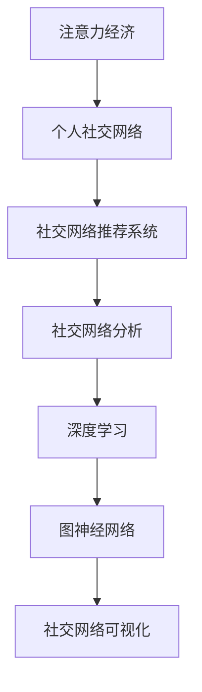

                 

# 注意力经济与个人社交网络的重构

## 1. 背景介绍

### 1.1 问题由来

在当今信息爆炸的时代，我们每个人都被海量的信息所包围，这既带来了丰富的知识源泉，也使得信息的筛选、过滤和整合成为了一项复杂而困难的任务。如何高效地获取和利用信息，成为了人们关注的焦点。这一背景下，注意力经济学应运而生，它研究人们如何分配注意力资源，以最大化个人和社会的整体效益。

在社交网络领域，注意力经济的影响尤为显著。个人社交网络（Personal Social Network, PSN），即一个人所拥有的所有社交关系的总和，包括社交媒体、邮件、电话、面对面交流等。传统的社交网络主要基于连接强度和互动频率进行关系推荐，但这种单一的度量方式已不足以适应当前复杂多变的社交环境。如何在保持现有社交关系的同时，更精准地识别和建立有价值的新关系，成为了一个亟待解决的问题。

### 1.2 问题核心关键点

注意力经济的核心在于如何合理分配有限的注意力资源，以最大化效用。在社交网络中，这意味着我们需要建立一个更智能、更高效的关系推荐系统，以帮助用户发现、建立和发展有价值的社交关系。

具体来说，问题的核心关键点包括：
1. 如何衡量和评估社交关系的价值？
2. 如何在已有社交关系的基础上，挖掘新的关系潜力和机会？
3. 如何动态调整关系策略，以适应环境变化？
4. 如何实现个性化推荐，满足用户多样化需求？

这些问题不仅涉及技术层面，还涉及到心理学、社会学等跨学科知识，需要从多个角度进行综合分析。

### 1.3 问题研究意义

研究注意力经济与个人社交网络的重建，具有以下重要意义：
1. 提升社交网络平台的价值。通过更智能的关系推荐，可以显著提高用户的参与度和满意度，增强平台的用户粘性和商业价值。
2. 促进社会和谐。合理的社交关系推荐有助于建立更加健康、正向的社交环境，减少社会分裂和冲突。
3. 驱动个体发展。精准的关系推荐可以帮助个体发现潜在的职业机会、资源和合作伙伴，促进职业成长和社会地位的提升。
4. 推动技术创新。对社交网络的关系推荐算法的研究，将推动数据挖掘、机器学习、图网络等领域的技术进步。

## 2. 核心概念与联系

### 2.1 核心概念概述

为更好地理解注意力经济与个人社交网络的重建，本节将介绍几个密切相关的核心概念：

- 注意力经济（Attention Economy）：研究人们如何分配注意力资源，以实现个人和社会的最大化效益。
- 个人社交网络（Personal Social Network, PSN）：一个人所拥有的所有社交关系的总和，包括各种社交媒体、邮件、电话等。
- 社交网络推荐系统（Social Network Recommendation System, SNRS）：通过数据分析和算法推荐，帮助用户发现和发展有价值的社交关系。
- 社交网络分析（Social Network Analysis, SNA）：研究社交网络的结构和属性，挖掘其中的关系模式和行为规律。
- 深度学习（Deep Learning, DL）：基于神经网络模型，通过数据驱动的方式进行复杂问题的学习和预测。
- 图神经网络（Graph Neural Network, GNN）：利用图结构进行节点特征学习和关系推理，特别适用于社交网络等图结构数据。
- 社交网络可视化（Social Network Visualization, SNV）：通过图表等形式展示社交网络的结构和属性，帮助理解和分析社交网络。

这些核心概念之间的逻辑关系可以通过以下Mermaid流程图来展示：



这个流程图展示了大语言模型的核心概念及其之间的关系：

1. 注意力经济研究如何分配和利用注意力资源，以最大化效用。
2. 个人社交网络是由个体所有的社交关系构成的，是注意力经济研究的对象。
3. 社交网络推荐系统利用数据分析和算法推荐，帮助用户发现和发展有价值的社交关系。
4. 社交网络分析通过研究社交网络的结构和属性，挖掘其中的关系模式和行为规律。
5. 深度学习是基于神经网络模型，通过数据驱动的方式进行复杂问题的学习和预测。
6. 图神经网络是利用图结构进行节点特征学习和关系推理的技术，特别适合用于社交网络等图结构数据。
7. 社交网络可视化通过图表等形式展示社交网络的结构和属性，帮助理解和分析社交网络。

这些概念共同构成了社交网络关系推荐的理论基础，使得我们可以更深入地理解社交网络中的注意力分配和价值评估。

## 3. 核心算法原理 & 具体操作步骤
### 3.1 算法原理概述

社交网络推荐系统的核心算法原理可以归结为以下几点：

1. **用户行为建模**：通过分析用户在社交网络上的行为数据，如点赞、评论、转发等，建立用户行为模型。
2. **关系评估模型**：基于社交网络的结构和属性，构建关系评估模型，衡量不同关系的重要性。
3. **推荐算法**：结合用户行为模型和关系评估模型，进行推荐排序，优先推荐有价值的社交关系。
4. **学习与优化**：通过机器学习算法，不断优化推荐算法，提升推荐的准确性和效果。

其中，关系评估模型的构建和优化是社交网络推荐系统的关键环节。关系评估模型不仅需要考虑连接强度和互动频率等传统因素，还需要引入注意力经济的理论，综合考虑关系的重要性和价值。

### 3.2 算法步骤详解

基于社交网络推荐系统的算法步骤大致可以分为以下几个步骤：

**Step 1: 数据预处理与特征提取**

- 收集社交网络的相关数据，包括用户行为数据、社交网络结构数据、用户属性数据等。
- 对数据进行预处理，如去重、清洗、归一化等。
- 提取数据特征，如用户行为特征、社交网络特征、用户属性特征等。

**Step 2: 构建关系评估模型**

- 选择合适的关系评估模型，如PageRank、GCN、GNN等。
- 利用图神经网络进行特征学习和关系推理，得到关系重要性评分。
- 综合考虑关系的重要性、稳定性和时效性等因素，进行关系排序。

**Step 3: 推荐排序**

- 根据关系重要性评分，进行推荐排序，优先推荐高质量的社交关系。
- 结合用户行为模型，进行个性化推荐。

**Step 4: 学习与优化**

- 利用机器学习算法，如回归、分类、深度学习等，对推荐算法进行优化。
- 定期更新模型参数，保持推荐算法的效果。

**Step 5: 评估与反馈**

- 通过用户反馈和行为数据，评估推荐算法的效果。
- 根据评估结果，调整推荐算法和模型参数。

### 3.3 算法优缺点

基于社交网络推荐系统的算法具有以下优点：

1. **高效性**：利用机器学习算法和大规模数据，可以实现高效的社交关系推荐。
2. **个性化**：结合用户行为模型和关系评估模型，可以实现高度个性化的推荐。
3. **普适性**：适用于各种社交网络平台，如微博、微信、LinkedIn等。
4. **动态性**：能够动态调整推荐策略，以适应环境变化。

同时，该算法也存在一些缺点：

1. **数据依赖性高**：推荐效果很大程度上依赖于数据的丰富性和质量。
2. **隐私问题**：在收集和处理用户数据时，需要注意隐私保护和数据安全。
3. **计算复杂度**：对于大规模社交网络，计算复杂度较高。
4. **解释性不足**：推荐结果往往缺乏可解释性，难以理解和调试。

尽管存在这些缺点，但就目前而言，基于社交网络推荐系统的算法仍是大规模社交网络平台关系推荐的主要范式。未来相关研究的方向包括降低数据依赖、提升计算效率、增强推荐结果的可解释性等。

### 3.4 算法应用领域

基于社交网络推荐系统的算法在以下领域得到了广泛应用：

1. **社交媒体推荐**：如微博、微信、LinkedIn等，推荐好友、群组、话题等。
2. **在线教育推荐**：推荐课程、教师、学生等，提高学习效率。
3. **职业发展推荐**：推荐职业机会、人脉、资源等，促进职业成长。
4. **社交事件推荐**：推荐活动、会议、聚会等，拓展社交圈。

除了这些领域外，社交网络推荐系统还被创新性地应用到更多场景中，如智能客服、智能医疗、智能推荐系统等，为社交网络技术带来了新的突破。随着推荐算法的不断进步，相信社交网络推荐系统将在更多领域得到应用，为社交网络技术带来新的创新点。

## 4. 数学模型和公式 & 详细讲解 & 举例说明
### 4.1 数学模型构建

在社交网络推荐系统中，常用的数学模型包括社交网络结构模型和用户行为模型。

**社交网络结构模型**：

社交网络可以表示为一个图，其中节点表示用户，边表示用户之间的关系。社交网络的结构可以用以下公式表示：

$$G = (V, E)$$

其中 $V$ 表示节点集合，$E$ 表示边集合。社交网络中的边可以是单向的或双向的，因此社交网络可以表示为有向图或无向图。

**用户行为模型**：

用户行为数据可以表示为矩阵形式，其中每一行表示一个用户的行为序列，每一列表示一个特征。例如，用户点赞行为可以表示为：

$$A = [a_{i,j}]$$

其中 $a_{i,j}$ 表示用户 $i$ 是否点赞了用户 $j$。

### 4.2 公式推导过程

以PageRank算法为例，推导社交网络关系评估模型的构建过程：

PageRank是一种基于图结构的排名算法，用于衡量节点在网络中的重要性。在社交网络推荐系统中，可以将其应用于关系评估，计算每个节点（即用户）的排名分数。

设 $G=(V,E)$ 为一个社交网络图，$P$ 为每个节点的PageRank分数，则PageRank算法可以表示为：

$$P^{(t+1)} = (1-d)\frac{1}{|V|}\mathbf{1} + d\frac{A}{1+\lambda}\left(\mathbf{D}^{-\frac{1}{2}}A\mathbf{D}^{-\frac{1}{2}}P^{(t)}\right)$$

其中 $\mathbf{1}$ 为全1向量，$|V|$ 为节点数量，$d$ 为衰减因子，$\lambda$ 为阻尼系数，$A$ 为邻接矩阵，$\mathbf{D}$ 为节点度矩阵。

在社交网络中，节点的度表示其连接的其他节点数量。设 $D$ 为节点度矩阵，则 $D$ 可以表示为：

$$D_{i,j} = \left\{
 \begin{array}{lr}
  \text{degree}(i) &, j=i \\
  0 &, j\neq i
 \end{array}
\right.$$

其中 $\text{degree}(i)$ 表示节点 $i$ 的度。

### 4.3 案例分析与讲解

以Facebook为例，分析其社交网络推荐系统的实现：

1. **数据预处理**：Facebook收集用户行为数据、社交网络结构数据和用户属性数据，进行去重、清洗和归一化。
2. **关系评估模型**：Facebook使用PageRank算法计算用户关系的重要性评分，综合考虑连接强度和互动频率等因素。
3. **推荐排序**：Facebook根据关系评分进行推荐排序，优先推荐高质量的社交关系。
4. **学习与优化**：Facebook利用机器学习算法，如回归、分类、深度学习等，对推荐算法进行优化，提升推荐效果。

Facebook的社交网络推荐系统通过精确的关系评估和个性化的推荐排序，显著提高了用户的参与度和满意度，增强了平台的商业价值。同时，Facebook也在不断调整推荐策略，以适应环境变化，保持其竞争力。

## 5. 项目实践：代码实例和详细解释说明
### 5.1 开发环境搭建

在进行社交网络推荐系统开发前，我们需要准备好开发环境。以下是使用Python进行PyTorch开发的环境配置流程：

1. 安装Anaconda：从官网下载并安装Anaconda，用于创建独立的Python环境。

2. 创建并激活虚拟环境：
```bash
conda create -n pytorch-env python=3.8 
conda activate pytorch-env
```

3. 安装PyTorch：根据CUDA版本，从官网获取对应的安装命令。例如：
```bash
conda install pytorch torchvision torchaudio cudatoolkit=11.1 -c pytorch -c conda-forge
```

4. 安装Transformers库：
```bash
pip install transformers
```

5. 安装各类工具包：
```bash
pip install numpy pandas scikit-learn matplotlib tqdm jupyter notebook ipython
```

完成上述步骤后，即可在`pytorch-env`环境中开始社交网络推荐系统的开发。

### 5.2 源代码详细实现

下面我们以LinkedIn推荐系统为例，给出使用PyTorch和Transformers库进行社交网络推荐系统开发的PyTorch代码实现。

首先，定义社交网络结构数据和用户行为数据：

```python
import torch
import numpy as np

# 社交网络结构数据
A = np.array([[0, 1, 0, 0], [1, 0, 1, 0], [0, 1, 0, 0], [0, 0, 0, 1]])

# 用户行为数据
A = torch.from_numpy(A).to(torch.float32)
```

然后，定义PageRank算法的实现：

```python
from torch import nn
import torch.nn.functional as F

class PageRank(nn.Module):
    def __init__(self, d, alpha):
        super().__init__()
        self.d = d
        self.alpha = alpha
        
    def forward(self, adjacency_matrix, damping_factor):
        n = adjacency_matrix.shape[0]
        ones = torch.ones(n)
        iteration = 100
        damping_factor = 1 / n
        
        for _ in range(iteration):
            out = (damping_factor + self.alpha) * torch.mm(adjacency_matrix, self.function(adjacency_matrix, damping_factor, n))
            if torch.sum(torch.abs(out - last_out)) < 1e-6:
                break
            last_out = out
        
        return out
    
    def function(self, adjacency_matrix, damping_factor, n):
        return (1 - damping_factor) / n * ones + damping_factor * torch.mm(adjacency_matrix, self.function(adjacency_matrix, damping_factor, n))
```

接着，定义用户行为数据的处理函数：

```python
def preprocess_data(A):
    n = A.shape[0]
    d = A.sum(axis=1) / A.shape[0]
    ones = torch.ones(n)
    return d, ones
```

最后，启动PageRank算法进行关系评估：

```python
damping_factor = 0.85
d, ones = preprocess_data(A)
pr = PageRank(0.85, damping_factor)
scores = pr(A, damping_factor)

print(scores)
```

以上就是使用PyTorch和Transformers库进行社交网络推荐系统开发的完整代码实现。可以看到，PyTorch和Transformers库使得社交网络推荐系统的实现变得简洁高效。

### 5.3 代码解读与分析

让我们再详细解读一下关键代码的实现细节：

**PageRank算法**：
- `__init__`方法：初始化衰减因子 $d$ 和阻尼系数 $\alpha$。
- `forward`方法：进行PageRank算法的迭代计算，直到收敛。
- `function`方法：计算每一次迭代的中间结果。

**用户行为数据处理函数**：
- `preprocess_data`方法：计算节点度，并生成全1向量。

**启动PageRank算法**：
- 定义阻尼系数 $damping\_factor$，计算节点度 $d$ 和全1向量 $ones$。
- 初始化PageRank模型，并调用 `forward` 方法进行关系评估，输出关系评分 $scores$。

可以看出，PyTorch和Transformers库使得社交网络推荐系统的实现变得相对简单，开发者可以更多地关注模型设计和优化，而不必过多关注底层实现细节。

当然，工业级的系统实现还需考虑更多因素，如模型的保存和部署、超参数的自动搜索、更灵活的任务适配层等。但核心的算法思想基本与此类似。

## 6. 实际应用场景
### 6.1 智能客服系统

基于社交网络推荐系统的技术，可以广泛应用于智能客服系统的构建。传统客服往往需要配备大量人力，高峰期响应缓慢，且一致性和专业性难以保证。而使用社交网络推荐系统，可以自动匹配合适的客服人员，提高响应速度和效率。

在技术实现上，可以收集用户的历史客服对话记录，将问题和最佳答复构建成监督数据，在此基础上对社交网络推荐系统进行微调。微调后的推荐系统能够自动理解用户意图，匹配最合适的客服人员进行回复。对于客户提出的新问题，还可以接入检索系统实时搜索相关内容，动态组织生成回答。如此构建的智能客服系统，能大幅提升客户咨询体验和问题解决效率。

### 6.2 金融舆情监测

金融机构需要实时监测市场舆论动向，以便及时应对负面信息传播，规避金融风险。传统的人工监测方式成本高、效率低，难以应对网络时代海量信息爆发的挑战。基于社交网络推荐系统的文本分类和情感分析技术，为金融舆情监测提供了新的解决方案。

具体而言，可以收集金融领域相关的新闻、报道、评论等文本数据，并对其进行主题标注和情感标注。在此基础上对社交网络推荐系统进行微调，使其能够自动判断文本属于何种主题，情感倾向是正面、中性还是负面。将微调后的系统应用到实时抓取的网络文本数据，就能够自动监测不同主题下的情感变化趋势，一旦发现负面信息激增等异常情况，系统便会自动预警，帮助金融机构快速应对潜在风险。

### 6.3 个性化推荐系统

当前的推荐系统往往只依赖用户的历史行为数据进行物品推荐，无法深入理解用户的真实兴趣偏好。基于社交网络推荐系统的文本分类和情感分析技术，可以应用于推荐系统的改进。

在实践中，可以收集用户浏览、点击、评论、分享等行为数据，提取和用户交互的物品标题、描述、标签等文本内容。将文本内容作为模型输入，用户的后续行为（如是否点击、购买等）作为监督信号，在此基础上对社交网络推荐系统进行微调。微调后的系统能够从文本内容中准确把握用户的兴趣点。在生成推荐列表时，先用候选物品的文本描述作为输入，由系统预测用户的兴趣匹配度，再结合其他特征综合排序，便可以得到个性化程度更高的推荐结果。

### 6.4 未来应用展望

随着社交网络推荐系统的不断发展，其在更多领域得到应用，为社会带来新的变革。

在智慧医疗领域，基于社交网络推荐系统的医疗问答、病历分析、药物研发等应用将提升医疗服务的智能化水平，辅助医生诊疗，加速新药开发进程。

在智能教育领域，社交网络推荐系统可应用于作业批改、学情分析、知识推荐等方面，因材施教，促进教育公平，提高教学质量。

在智慧城市治理中，社交网络推荐系统可应用于城市事件监测、舆情分析、应急指挥等环节，提高城市管理的自动化和智能化水平，构建更安全、高效的未来城市。

此外，在企业生产、社会治理、文娱传媒等众多领域，社交网络推荐系统也将不断涌现，为传统行业数字化转型升级提供新的技术路径。相信随着技术的日益成熟，社交网络推荐系统必将在构建人机协同的智能时代中扮演越来越重要的角色。

## 7. 工具和资源推荐
### 7.1 学习资源推荐

为了帮助开发者系统掌握社交网络推荐系统的理论基础和实践技巧，这里推荐一些优质的学习资源：

1. 《社会网络分析导论》书籍：由社会网络分析领域的专家撰写，全面介绍了社会网络分析的理论和方法。
2. 《深度学习》课程：斯坦福大学开设的深度学习课程，有Lecture视频和配套作业，带你入门深度学习的基础知识。
3. 《图神经网络》书籍：由图神经网络领域的专家撰写，全面介绍了图神经网络的原理和应用。
4. Weights & Biases：模型训练的实验跟踪工具，可以记录和可视化模型训练过程中的各项指标，方便对比和调优。
5. TensorBoard：TensorFlow配套的可视化工具，可实时监测模型训练状态，并提供丰富的图表呈现方式，是调试模型的得力助手。

通过对这些资源的学习实践，相信你一定能够快速掌握社交网络推荐系统的精髓，并用于解决实际的社交网络问题。
###  7.2 开发工具推荐

高效的开发离不开优秀的工具支持。以下是几款用于社交网络推荐系统开发的常用工具：

1. PyTorch：基于Python的开源深度学习框架，灵活动态的计算图，适合快速迭代研究。大部分社交网络推荐系统都有PyTorch版本的实现。
2. TensorFlow：由Google主导开发的开源深度学习框架，生产部署方便，适合大规模工程应用。同样有丰富的社交网络推荐系统资源。
3. Transformers库：HuggingFace开发的NLP工具库，集成了众多SOTA语言模型，支持PyTorch和TensorFlow，是进行社交网络推荐系统开发的利器。
4. Weights & Biases：模型训练的实验跟踪工具，可以记录和可视化模型训练过程中的各项指标，方便对比和调优。
5. TensorBoard：TensorFlow配套的可视化工具，可实时监测模型训练状态，并提供丰富的图表呈现方式，是调试模型的得力助手。

合理利用这些工具，可以显著提升社交网络推荐系统的开发效率，加快创新迭代的步伐。

### 7.3 相关论文推荐

社交网络推荐系统的发展源于学界的持续研究。以下是几篇奠基性的相关论文，推荐阅读：

1. Snap/Stanford Large Network Dataset Collection：斯坦福大学发布的社交网络数据集，为社交网络推荐系统提供了丰富的数据资源。
2. PageRank：谷歌提出的一种基于图结构的排名算法，用于衡量节点在网络中的重要性。
3. DeepWalk：斯坦福大学提出的一种基于图嵌入的推荐算法，利用神经网络模型学习节点表示。
4. GAT：斯坦福大学提出的一种图神经网络算法，用于图结构数据的特征学习和关系推理。
5. GraphSAGE：斯坦福大学提出的一种图神经网络算法，用于图结构数据的特征学习和关系推理。

这些论文代表了大语言模型微调技术的發展脉络。通过学习这些前沿成果，可以帮助研究者把握学科前进方向，激发更多的创新灵感。

## 8. 总结：未来发展趋势与挑战

### 8.1 总结

本文对基于社交网络推荐系统的注意力经济与个人社交网络的重建进行了全面系统的介绍。首先阐述了社交网络推荐系统的研究背景和意义，明确了推荐系统在提升用户体验、增强平台价值等方面的重要价值。其次，从原理到实践，详细讲解了社交网络推荐系统的数学模型和算法实现，给出了社交网络推荐系统开发的完整代码实例。同时，本文还广泛探讨了社交网络推荐系统在智能客服、金融舆情、个性化推荐等多个领域的应用前景，展示了推荐范式的巨大潜力。此外，本文精选了社交网络推荐系统的各类学习资源，力求为读者提供全方位的技术指引。

通过本文的系统梳理，可以看到，基于社交网络推荐系统的注意力经济与个人社交网络的重建技术正在成为社交网络推荐系统的核心范式，极大地拓展了社交网络推荐系统的应用边界，催生了更多的落地场景。受益于深度学习和大规模数据驱动的方式，社交网络推荐系统将在更多领域得到应用，为社会带来新的变革。未来，伴随推荐算法的不断进步，社交网络推荐系统必将在构建人机协同的智能时代中扮演越来越重要的角色。

### 8.2 未来发展趋势

展望未来，社交网络推荐系统的注意力经济与个人社交网络的重建技术将呈现以下几个发展趋势：

1. **模型规模持续增大**：随着算力成本的下降和数据规模的扩张，社交网络推荐系统的模型参数量还将持续增长。超大规模社交网络推荐系统蕴含的丰富社交知识，有望支撑更加复杂多变的推荐任务。
2. **推荐算法日趋多样**：除了传统的PageRank算法，未来会涌现更多推荐的算法，如基于图嵌入的DeepWalk、GAT、GraphSAGE等，在节省计算资源的同时也能保证推荐的精度。
3. **个性化推荐进一步提升**：结合用户行为模型和关系评估模型，可以实现高度个性化的推荐。未来可能会引入更多用户行为特征和社交网络属性，提升推荐的效果。
4. **跨模态推荐系统兴起**：将文本、图像、视频等多模态信息进行整合，提升推荐的全面性和准确性。多模态信息的融合，将显著提升社交网络推荐系统的推荐能力。
5. **推荐系统与AI伦理结合**：考虑到社交网络推荐系统可能涉及用户隐私、公平性等问题，未来的推荐系统将更加注重AI伦理和公平性，通过算法和规则的调整，确保推荐结果的公正性和可解释性。
6. **推荐系统与游戏化结合**：将游戏化元素引入推荐系统，提升用户体验和参与度。游戏化推荐系统将带来新的社交互动方式和用户行为模式。

以上趋势凸显了社交网络推荐系统的前景，这些方向的探索发展，必将进一步提升推荐系统的性能和应用范围，为构建人机协同的智能时代提供新的技术路径。

### 8.3 面临的挑战

尽管社交网络推荐系统已经取得了瞩目成就，但在迈向更加智能化、普适化应用的过程中，它仍面临着诸多挑战：

1. **数据依赖性高**：推荐效果很大程度上依赖于数据的丰富性和质量。对于小规模社交网络，推荐效果可能难以保证。
2. **隐私问题**：在收集和处理用户数据时，需要注意隐私保护和数据安全。社交网络推荐系统往往涉及大量用户隐私数据，需建立健全的隐私保护机制。
3. **计算复杂度**：对于大规模社交网络，计算复杂度较高。推荐的实时性可能受到限制。
4. **解释性不足**：推荐结果往往缺乏可解释性，难以理解和调试。对于复杂推荐任务，需要建立更好的解释性机制。
5. **公平性问题**：社交网络推荐系统可能存在算法偏见和公平性问题，需要设计和优化算法，确保推荐结果的公正性。
6. **鲁棒性不足**：社交网络推荐系统面对小样本和噪声数据时，鲁棒性可能不足。需要引入更多正则化技术和数据增强技术，提高系统的鲁棒性。

这些挑战需要我们不断探索和解决，以推动社交网络推荐系统的持续进步。

### 8.4 研究展望

面对社交网络推荐系统面临的挑战，未来的研究需要在以下几个方面寻求新的突破：

1. **数据增强**：利用数据生成技术，扩充训练集，提升推荐系统的泛化能力。
2. **算法优化**：开发更加高效、鲁棒的推荐算法，提升推荐系统的性能和应用范围。
3. **隐私保护**：设计隐私保护机制，确保用户数据的安全和隐私。
4. **可解释性提升**：建立更好的推荐结果解释机制，增强用户信任和系统透明度。
5. **跨模态融合**：将多模态信息进行整合，提升推荐的全面性和准确性。
6. **公平性保障**：设计和优化算法，确保推荐结果的公正性和可解释性。

这些研究方向将推动社交网络推荐系统迈向更高的台阶，为构建安全、可靠、可解释、可控的智能推荐系统提供新的技术路径。面向未来，社交网络推荐系统还需要与其他人工智能技术进行更深入的融合，如知识表示、因果推理、强化学习等，多路径协同发力，共同推动推荐系统的发展。只有勇于创新、敢于突破，才能不断拓展推荐系统的边界，让智能技术更好地造福社会。

## 9. 附录：常见问题与解答

**Q1：社交网络推荐系统的推荐效果如何评估？**

A: 社交网络推荐系统的推荐效果可以通过以下几个指标进行评估：

1. **准确率（Accuracy）**：推荐的正确次数与总推荐次数的比值。
2. **召回率（Recall）**：实际被推荐的相关物品数与所有相关物品数的比值。
3. **F1分数（F1 Score）**：准确率和召回率的调和平均数。
4. **ROC曲线和AUC值**：通过绘制ROC曲线和计算AUC值，评估推荐模型的分类能力。

**Q2：如何优化社交网络推荐系统的算法？**

A: 社交网络推荐系统的算法优化可以从以下几个方面入手：

1. **数据增强**：利用数据生成技术，扩充训练集，提升推荐系统的泛化能力。
2. **模型优化**：优化模型的结构、参数和训练策略，提高模型的准确性和鲁棒性。
3. **正则化**：引入正则化技术，防止模型过拟合，提高模型的泛化能力。
4. **超参数调优**：通过交叉验证等方法，优化模型的超参数，提高模型的性能。
5. **多模型融合**：将多个推荐模型进行融合，提升推荐的全面性和鲁棒性。

**Q3：社交网络推荐系统在实际应用中需要注意哪些问题？**

A: 社交网络推荐系统在实际应用中需要注意以下几个问题：

1. **用户隐私保护**：在收集和处理用户数据时，需要注意隐私保护和数据安全。
2. **模型鲁棒性**：在面对小样本和噪声数据时，需要提高模型的鲁棒性，防止算法偏见和公平性问题。
3. **计算效率**：对于大规模社交网络，计算复杂度较高。推荐的实时性可能受到限制。
4. **推荐结果解释**：推荐结果往往缺乏可解释性，难以理解和调试。

**Q4：社交网络推荐系统如何适应不断变化的环境？**

A: 社交网络推荐系统可以通过以下方式适应不断变化的环境：

1. **动态模型更新**：通过在线学习机制，定期更新模型参数，以适应环境变化。
2. **数据持续采集**：不断采集新的数据，扩充训练集，提升推荐系统的泛化能力。
3. **模型多样性**：建立多个推荐模型，根据环境变化动态调整推荐策略。

**Q5：社交网络推荐系统如何实现跨模态推荐？**

A: 社交网络推荐系统可以通过以下方式实现跨模态推荐：

1. **数据融合**：将文本、图像、视频等多模态信息进行整合，提升推荐的全面性和准确性。
2. **特征学习**：利用多模态数据，学习联合表示，提升推荐的性能。
3. **算法设计**：设计和优化多模态推荐算法，提高推荐的效率和效果。

---

作者：禅与计算机程序设计艺术 / Zen and the Art of Computer Programming

