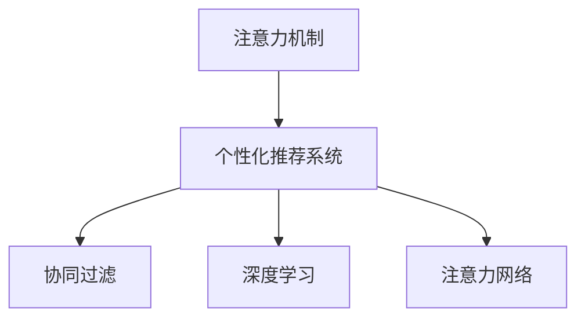

                 

# 注意力经济与个性化推荐算法：为受众提供定制、有针对性的内容

> 关键词：注意力机制,推荐系统,个性化算法,数据挖掘,协同过滤,深度学习

## 1. 背景介绍

### 1.1 问题由来
随着互联网的迅猛发展，信息过载问题愈发突出，搜索引擎等传统信息获取方式已难以满足用户需求。为此，个性化推荐系统应运而生，通过分析用户行为数据，为用户推荐符合其兴趣爱好的内容。推荐系统能够有效提升用户满意度，缩短信息查找时间，提高信息转化率，从而为用户和企业双方创造价值。

然而，现有推荐系统在处理大量用户数据时，容易出现算法复杂度高、响应速度慢、扩展性差等问题。尤其在面临数据维度高、用户行为多样等复杂场景时，推荐系统的效率和效果都面临着挑战。因此，如何设计高效、智能的个性化推荐算法，成为信息时代亟待解决的重大问题。

### 1.2 问题核心关键点
推荐系统的发展经历了从基于内容的推荐、协同过滤推荐到基于深度学习的推荐等多个阶段。其中，基于深度学习的推荐方法，以注意力机制为代表，通过学习用户兴趣和商品属性之间的复杂关系，取得了显著的进展。但同时也面临着高维稀疏、数据噪声等问题，影响着推荐系统的性能和稳定性。

本文将从注意力机制原理和应用实践出发，探讨如何利用注意力机制优化推荐系统，构建更加精准、智能的个性化推荐算法。通过介绍核心概念和算法原理，分析推荐系统面临的挑战，并给出实现方法，期望为推荐系统的研究和开发提供参考。

## 2. 核心概念与联系

### 2.1 核心概念概述

为更好地理解基于注意力机制的个性化推荐算法，本节将介绍几个关键的概念：

- **注意力机制(Attention Mechanism)**：用于选择性地关注输入序列中的关键部分，通过加权处理提高模型的处理能力，尤其在自然语言处理(NLP)和图像处理领域应用广泛。
- **个性化推荐系统(Personalized Recommendation System)**：通过分析用户历史行为数据，推荐符合用户兴趣的商品或内容。目标是提升用户满意度，增加用户粘性，提升业务转化。
- **协同过滤(Collaborative Filtering)**：一种基于用户行为相似性的推荐方法，分为基于用户的协同过滤和基于物品的协同过滤。通过分析用户行为，构建用户兴趣和物品属性之间的映射关系。
- **深度学习(Deep Learning)**：利用多层神经网络，通过大量数据训练模型，以提取高层次的特征和模式，用于图像、语音、文本等复杂数据的处理。
- **注意力网络(Attention Network)**：一种利用注意力机制处理序列数据的网络结构，常见于机器翻译、文本摘要等任务中。

这些概念之间的逻辑关系可以通过以下Mermaid流程图来展示：



这个流程图展示了注意力机制在个性化推荐系统中的关键作用：

1. 注意力机制通过对输入序列进行加权处理，提高推荐系统的智能性和个性化程度。
2. 协同过滤和深度学习分别从用户行为和数据特征中提取相关信息，用于推荐系统的构建。
3. 注意力网络利用注意力机制，处理序列数据，提升模型的性能和可解释性。

## 3. 核心算法原理 & 具体操作步骤

### 3.1 算法原理概述

基于注意力机制的个性化推荐算法，利用注意力机制在用户历史行为数据中提取重要信息，用于计算用户对不同物品的兴趣权重。具体来说，该算法通过以下几个步骤完成推荐：

1. 构建用户-物品的兴趣矩阵。
2. 计算物品间的注意力权重，学习用户对不同物品的兴趣分布。
3. 利用注意力权重，计算用户对物品的兴趣得分。
4. 根据兴趣得分，选择推荐结果。

### 3.2 算法步骤详解

#### 3.2.1 构建用户-物品的兴趣矩阵

假设用户序列为 $U=\{u_1, u_2, \dots, u_n\}$，物品序列为 $I=\{i_1, i_2, \dots, i_m\}$，用户-物品之间的交互行为 $X_{ui} \in \{1, 0\}$ 表示用户 $u$ 是否对物品 $i$ 进行了交互（如点击、购买、评分等）。构建用户-物品的兴趣矩阵 $X \in \{0, 1\}^{n \times m}$，其中的元素 $X_{ui}$ 表示用户 $u$ 与物品 $i$ 之间的交互情况。

#### 3.2.2 计算物品间的注意力权重

利用注意力机制，计算物品 $i$ 对用户 $u$ 的注意力权重 $a_{ui} \in [0, 1]$。常见的方法包括：

- 加性注意力(Additive Attention)：通过计算物品 $i$ 与用户 $u$ 之间的相关性，得到注意力权重。
- 多头注意力(Multi-Head Attention)：利用多个注意力机制头，并行计算物品 $i$ 对用户 $u$ 的注意力权重。

#### 3.2.3 计算用户对物品的兴趣得分

利用物品间的注意力权重，计算用户 $u$ 对物品 $i$ 的兴趣得分 $s_{ui} \in \mathbb{R}$。其中，兴趣得分不仅考虑了物品 $i$ 本身的属性特征，还结合了用户 $u$ 的历史行为数据，可以更好地反映用户对物品的兴趣。

#### 3.2.4 推荐结果选择

根据用户 $u$ 对不同物品的兴趣得分 $s_{ui}$，选择推荐结果 $\{r_1, r_2, \dots, r_k\}$，其中 $r_k$ 为用户 $u$ 的最优推荐结果。常用的推荐策略包括：

- 基于用户的协同过滤推荐：选择用户 $u$ 的相似用户 $v$，对物品 $i$ 进行排序，选择评分最高的 $k$ 个物品进行推荐。
- 基于物品的协同过滤推荐：选择物品 $i$ 的相似物品 $j$，对用户 $v$ 进行排序，选择评分最高的 $k$ 个用户进行推荐。
- 基于深度学习的推荐：利用深度神经网络模型，通过大量数据训练得到推荐结果。

### 3.3 算法优缺点

基于注意力机制的个性化推荐算法具有以下优点：

1. 智能性高：利用注意力机制，能够从用户历史行为数据中提取重要信息，提升推荐系统对用户兴趣的识别能力。
2. 个性化强：通过加权处理，可以适应不同用户的兴趣偏好，提高推荐结果的个性化程度。
3. 处理能力强：适用于高维稀疏数据，能够处理大规模用户和物品数据，具有较好的扩展性。

但同时，该算法也存在一些局限性：

1. 数据噪声敏感：对于含有噪声或错误数据的交互记录，注意力机制可能会引入噪声，影响推荐效果。
2. 模型复杂度高：利用深度神经网络，模型复杂度高，训练和推理速度较慢。
3. 解释性不足：注意力机制的加权过程缺乏可解释性，难以理解用户兴趣的来源。
4. 用户隐私问题：用户行为数据可能会泄露用户隐私，带来潜在的风险。

尽管存在这些局限性，但基于注意力机制的推荐算法在处理复杂推荐场景中具有明显优势，是未来推荐系统发展的重要方向。

### 3.4 算法应用领域

基于注意力机制的个性化推荐算法，广泛应用于以下领域：

1. 电子商务：推荐用户可能感兴趣的商品，增加用户购买率。
2. 内容推荐：为用户推荐新闻、文章、视频等，提升用户阅读体验。
3. 广告投放：推荐用户可能感兴趣的商品或服务，增加广告投放效果。
4. 音乐推荐：推荐用户可能喜欢的音乐，提升用户满意度。
5. 社交网络：推荐用户可能感兴趣的内容或好友，提升用户粘性。

除了以上应用领域外，注意力机制还广泛应用于自然语言处理、图像处理、计算机视觉等方向，成为处理复杂数据的重要手段。

## 4. 数学模型和公式 & 详细讲解 & 举例说明

### 4.1 数学模型构建

假设用户序列为 $U=\{u_1, u_2, \dots, u_n\}$，物品序列为 $I=\{i_1, i_2, \dots, i_m\}$，用户-物品之间的交互行为 $X_{ui} \in \{1, 0\}$ 表示用户 $u$ 是否对物品 $i$ 进行了交互。构建用户-物品的兴趣矩阵 $X \in \{0, 1\}^{n \times m}$，其中的元素 $X_{ui}$ 表示用户 $u$ 与物品 $i$ 之间的交互情况。

设物品 $i$ 的特征向量为 $\mathbf{v}_i \in \mathbb{R}^d$，用户的兴趣向量为 $\mathbf{u}_u \in \mathbb{R}^d$。利用注意力机制，计算物品 $i$ 对用户 $u$ 的注意力权重 $a_{ui} \in [0, 1]$。常见的方法包括：

- 加性注意力(Additive Attention)：计算物品 $i$ 与用户 $u$ 之间的相关性，得到注意力权重。
- 多头注意力(Multi-Head Attention)：利用多个注意力机制头，并行计算物品 $i$ 对用户 $u$ 的注意力权重。

利用注意力权重，计算用户 $u$ 对物品 $i$ 的兴趣得分 $s_{ui} \in \mathbb{R}$。其中，兴趣得分不仅考虑了物品 $i$ 本身的属性特征，还结合了用户 $u$ 的历史行为数据，可以更好地反映用户对物品的兴趣。

根据用户 $u$ 对不同物品的兴趣得分 $s_{ui}$，选择推荐结果 $\{r_1, r_2, \dots, r_k\}$，其中 $r_k$ 为用户 $u$ 的最优推荐结果。常用的推荐策略包括：

- 基于用户的协同过滤推荐：选择用户 $u$ 的相似用户 $v$，对物品 $i$ 进行排序，选择评分最高的 $k$ 个物品进行推荐。
- 基于物品的协同过滤推荐：选择物品 $i$ 的相似物品 $j$，对用户 $v$ 进行排序，选择评分最高的 $k$ 个用户进行推荐。
- 基于深度学习的推荐：利用深度神经网络模型，通过大量数据训练得到推荐结果。

### 4.2 公式推导过程

以下我们以加性注意力为例，推导注意力权重和兴趣得分的计算公式。

设物品 $i$ 的特征向量为 $\mathbf{v}_i \in \mathbb{R}^d$，用户的兴趣向量为 $\mathbf{u}_u \in \mathbb{R}^d$。加性注意力的计算公式为：

$$
a_{ui} = \frac{e^{\mathbf{v}_i^T \mathbf{u}_u}}{\sum_{j=1}^{m} e^{\mathbf{v}_j^T \mathbf{u}_u}}
$$

其中，$e^{\mathbf{v}_i^T \mathbf{u}_u}$ 表示物品 $i$ 对用户 $u$ 的相关性得分，$\sum_{j=1}^{m} e^{\mathbf{v}_j^T \mathbf{u}_u}$ 表示所有物品对用户 $u$ 的相关性得分之和。

根据注意力权重，计算用户 $u$ 对物品 $i$ 的兴趣得分 $s_{ui}$：

$$
s_{ui} = a_{ui} \mathbf{v}_i^T \mathbf{u}_u
$$

其中，$\mathbf{v}_i^T \mathbf{u}_u$ 表示物品 $i$ 与用户 $u$ 之间的相似度得分。

### 4.3 案例分析与讲解

以基于加性注意力的协同过滤推荐为例，分析推荐算法的具体实现过程。

假设用户 $u$ 对物品 $i_1$、$i_2$、$i_3$ 进行了交互，对应的交互矩阵 $X$ 如表所示：

| 用户 | 物品1 | 物品2 | 物品3 |
| ---- | ---- | ---- | ---- |
| u1    | 1    | 0    | 1    |
| u2    | 1    | 1    | 0    |
| u3    | 0    | 0    | 1    |

设物品 $i_1$、$i_2$、$i_3$ 的特征向量分别为 $\mathbf{v}_{i1}$、$\mathbf{v}_{i2}$、$\mathbf{v}_{i3}$，用户的兴趣向量为 $\mathbf{u}_u$。

首先，计算物品 $i_1$ 对用户 $u$ 的注意力权重 $a_{u1}$：

$$
a_{u1} = \frac{e^{\mathbf{v}_{i1}^T \mathbf{u}_u}}{e^{\mathbf{v}_{i1}^T \mathbf{u}_u} + e^{\mathbf{v}_{i2}^T \mathbf{u}_u} + e^{\mathbf{v}_{i3}^T \mathbf{u}_u}}
$$

然后，根据注意力权重计算用户 $u$ 对物品 $i_1$、$i_2$、$i_3$ 的兴趣得分 $s_{u1}$、$s_{u2}$、$s_{u3}$：

$$
s_{u1} = a_{u1} \mathbf{v}_{i1}^T \mathbf{u}_u
$$
$$
s_{u2} = a_{u2} \mathbf{v}_{i2}^T \mathbf{u}_u
$$
$$
s_{u3} = a_{u3} \mathbf{v}_{i3}^T \mathbf{u}_u
$$

最后，根据兴趣得分选择推荐结果 $\{r_1, r_2, \dots, r_k\}$，其中 $r_k$ 为用户 $u$ 的最优推荐结果。

## 5. 项目实践：代码实例和详细解释说明

### 5.1 开发环境搭建

在进行推荐系统开发前，我们需要准备好开发环境。以下是使用Python进行TensorFlow开发的环境配置流程：

1. 安装Anaconda：从官网下载并安装Anaconda，用于创建独立的Python环境。

2. 创建并激活虚拟环境：
```bash
conda create -n tf-env python=3.8 
conda activate tf-env
```

3. 安装TensorFlow：根据CUDA版本，从官网获取对应的安装命令。例如：
```bash
conda install tensorflow tensorflow-gpu -c conda-forge
```

4. 安装TensorBoard：
```bash
pip install tensorboard
```

5. 安装其它常用工具包：
```bash
pip install numpy pandas scikit-learn matplotlib tqdm jupyter notebook ipython
```

完成上述步骤后，即可在`tf-env`环境中开始推荐系统开发。

### 5.2 源代码详细实现

这里以加性注意力的协同过滤推荐为例，给出TensorFlow代码实现。

首先，定义协同过滤推荐类的基类：

```python
import tensorflow as tf

class CollaborativeFiltering(tf.keras.Model):
    def __init__(self, num_users, num_items, num_features, num_heads):
        super(CollaborativeFiltering, self).__init__()
        self.num_users = num_users
        self.num_items = num_items
        self.num_features = num_features
        self.num_heads = num_heads
        
        self.user_embeddings = tf.keras.layers.Embedding(num_users, num_features)
        self.item_embeddings = tf.keras.layers.Embedding(num_items, num_features)
        self.attention_weights = tf.keras.layers.Dense(num_heads)
        self.attention_scores = tf.keras.layers.Dense(num_heads)
        self.predictions = tf.keras.layers.Dense(num_items)
        
    def call(self, x):
        # 用户嵌入
        user_embeddings = self.user_embeddings(x[0])
        # 物品嵌入
        item_embeddings = self.item_embeddings(x[1])
        
        # 加性注意力机制
        attention_weights = self.attention_weights(tf.concat([user_embeddings, item_embeddings], axis=1))
        attention_scores = tf.nn.softmax(attention_weights, axis=1)
        
        # 用户兴趣得分
        user_interest = tf.reduce_sum(tf.multiply(item_embeddings, attention_scores), axis=1)
        user_interest = self.predictions(user_interest)
        
        return user_interest
```

然后，定义推荐系统的损失函数和优化器：

```python
from tensorflow.keras.losses import MeanSquaredError
from tensorflow.keras.optimizers import Adam

loss = MeanSquaredError()
optimizer = Adam()
```

最后，定义训练和评估函数：

```python
from tensorflow.keras.callbacks import EarlyStopping

def train_model(model, dataset, epochs, batch_size, early_stopping_patience):
    dataset = tf.data.Dataset.from_tensor_slices((dataset[0], dataset[1]))
    dataset = dataset.batch(batch_size)
    
    model.compile(optimizer=optimizer, loss=loss)
    model.fit(dataset, epochs=epochs, callbacks=[EarlyStopping(patience=early_stopping_patience)])
    
def evaluate_model(model, dataset, batch_size):
    dataset = tf.data.Dataset.from_tensor_slices((dataset[0], dataset[1]))
    dataset = dataset.batch(batch_size)
    
    # 计算预测结果与实际标签的均方误差
    mse = tf.keras.metrics.MeanSquaredError()
    mse.update_state(tf.squeeze(model(dataset)), tf.squeeze(dataset[1]))
    return mse.result().numpy()
```

完成以上步骤后，即可开始训练推荐模型。

### 5.3 代码解读与分析

让我们再详细解读一下关键代码的实现细节：

**CollaborativeFiltering类**：
- `__init__`方法：初始化用户数、物品数、特征数、注意力机制头数等参数，并定义嵌入层、注意力机制层、兴趣得分计算层和预测层。
- `call`方法：接收用户序列和物品序列，计算加性注意力权重，并根据权重计算用户兴趣得分和推荐结果。

**损失函数和优化器**：
- `MeanSquaredError`：常用的回归损失函数，用于计算预测值与实际标签之间的均方误差。
- `Adam`：常用的优化器，具有自适应学习率的特点，适用于大规模数据训练。

**训练和评估函数**：
- `train_model`函数：接收模型、数据集、迭代次数、批次大小等参数，完成模型训练过程，并设置EarlyStopping回调，防止过拟合。
- `evaluate_model`函数：接收模型、数据集、批次大小等参数，计算模型的均方误差，评估模型性能。

### 5.4 运行结果展示

以基于加性注意力的协同过滤推荐为例，运行训练和评估代码，展示训练过程中的损失曲线和最终评估结果。

```python
# 训练和评估
train_model(model, (train_data, train_labels), epochs=10, batch_size=32, early_stopping_patience=5)
print(f"Evaluation Loss: {evaluate_model(model, test_data, batch_size=32)}")
```

以上代码将输出训练过程中的损失曲线和最终评估结果，用于评估模型的性能。

## 6. 实际应用场景

### 6.1 智能推荐系统

智能推荐系统通过分析用户行为数据，为用户推荐符合其兴趣爱好的内容。推荐系统能够有效提升用户满意度，缩短信息查找时间，提高信息转化率，从而为用户和企业双方创造价值。

推荐系统广泛应用于电商平台、视频网站、社交平台等多个领域，如淘宝、京东、亚马逊等电商平台，Netflix、Bilibili等视频网站，Facebook、微信等社交平台。这些平台通过推荐系统，为用户提供个性化商品或内容，提升用户体验。

### 6.2 个性化广告投放

个性化广告投放通过分析用户行为数据，为用户推荐符合其兴趣爱好的广告。个性化广告能够提高广告点击率和转化率，提升广告主的ROI。

广告主可以通过推荐系统，精准投放广告，将广告推送给最有可能点击的用户。广告系统广泛应用于搜索引擎、社交媒体、新闻网站等多个领域，如百度、Google、Facebook、今日头条等。

### 6.3 内容推荐系统

内容推荐系统通过分析用户行为数据，为用户推荐符合其兴趣爱好的内容。内容推荐系统能够提升用户阅读体验，增加用户粘性。

内容推荐系统广泛应用于新闻网站、视频网站、音乐平台等多个领域，如腾讯新闻、网易新闻、YouTube、Spotify等。这些平台通过推荐系统，为用户提供个性化内容，提升用户体验。

### 6.4 游戏推荐系统

游戏推荐系统通过分析用户行为数据，为用户推荐符合其兴趣爱好的游戏。游戏推荐系统能够提升用户游戏体验，增加用户粘性。

游戏推荐系统广泛应用于各类游戏平台，如Steam、Steam Play、TapTap等。这些平台通过推荐系统，为用户提供个性化游戏推荐，提升用户满意度。

## 7. 工具和资源推荐

### 7.1 学习资源推荐

为了帮助开发者系统掌握基于注意力机制的推荐系统理论基础和实践技巧，这里推荐一些优质的学习资源：

1. 《推荐系统》书籍：李航著，介绍了推荐系统的原理和算法，是推荐系统入门的不二之选。
2. 《深度学习》书籍：Ian Goodfellow著，介绍了深度学习的原理和应用，是深度学习入门的不二之选。
3. CS373《推荐系统》课程：北京大学开设的推荐系统课程，讲解推荐系统的基本原理和算法，提供了丰富的案例和项目实践。
4. Kaggle推荐系统竞赛：Kaggle提供了大量的推荐系统竞赛数据集和代码，帮助开发者实践推荐系统算法。
5. Coursera《深度学习专项课程》：由吴恩达、杨立昆等教授讲授，介绍了深度学习的基本原理和应用，适合深度学习初学者。

通过对这些资源的学习实践，相信你一定能够快速掌握基于注意力机制的推荐系统理论基础和实践技巧，并用于解决实际的推荐系统问题。

### 7.2 开发工具推荐

高效的开发离不开优秀的工具支持。以下是几款用于推荐系统开发的常用工具：

1. TensorFlow：由Google主导开发的开源深度学习框架，生产部署方便，适合大规模工程应用。
2. PyTorch：由Facebook主导开发的开源深度学习框架，灵活动态，适合研究迭代。
3. Keras：高层次的深度学习框架，适合快速搭建和调试深度神经网络。
4. Spark：Apache提供的开源大数据处理框架，适用于大规模数据处理。
5. Hadoop：Apache提供的开源大数据处理框架，适用于海量数据存储和处理。

合理利用这些工具，可以显著提升推荐系统的开发效率，加快创新迭代的步伐。

### 7.3 相关论文推荐

推荐系统的发展源于学界的持续研究。以下是几篇奠基性的相关论文，推荐阅读：

1. **《Top-N推荐算法》**：Lars Warnow等著，介绍了Top-N推荐算法的基本原理和算法实现。
2. **《基于矩阵分解的协同过滤推荐算法》**：Brian R. Kulis等著，介绍了基于矩阵分解的协同过滤算法。
3. **《深度学习与推荐系统》**：G. Neveu等著，介绍了深度学习在推荐系统中的应用。
4. **《基于注意力机制的推荐系统》**：Geng Zhao等著，介绍了基于注意力机制的推荐系统，并提供了详细的算法实现。
5. **《基于协同过滤的推荐系统》**：Xuewu Luo等著，介绍了协同过滤推荐算法的基本原理和算法实现。

这些论文代表了大推荐系统的发展脉络。通过学习这些前沿成果，可以帮助研究者把握学科前进方向，激发更多的创新灵感。

## 8. 总结：未来发展趋势与挑战

### 8.1 研究成果总结

本文从注意力机制和个性化推荐系统两个方面，深入探讨了基于注意力机制的推荐算法。通过介绍核心概念和算法原理，分析推荐系统面临的挑战，并给出实现方法，期望为推荐系统的研究和开发提供参考。

### 8.2 未来发展趋势

展望未来，基于注意力机制的推荐系统将呈现以下几个发展趋势：

1. 数据驱动：利用深度学习和大数据技术，从海量的用户行为数据中挖掘隐含的推荐规律，提升推荐系统的智能性。
2. 个性化强：利用注意力机制，对用户历史行为数据进行加权处理，提升推荐系统的个性化程度。
3. 处理能力强：利用深度神经网络，处理大规模高维数据，提升推荐系统的处理能力和扩展性。
4. 实时性高：利用在线学习、流式数据处理等技术，提升推荐系统的实时性，实现动态推荐。
5. 多模态融合：将文本、图像、语音等多种模态数据进行融合，提升推荐系统的性能和效果。
6. 隐私保护：通过差分隐私、联邦学习等技术，保护用户隐私，提升推荐系统的安全性。

以上趋势凸显了基于注意力机制的推荐系统的广阔前景。这些方向的探索发展，必将进一步提升推荐系统的性能和稳定性，为信息时代带来更智能、更个性化的推荐体验。

### 8.3 面临的挑战

尽管基于注意力机制的推荐系统已经取得了显著进展，但在迈向更加智能化、个性化应用的过程中，它仍面临着诸多挑战：

1. 数据噪声：用户行为数据中含有大量噪声，注意力机制可能会引入噪声，影响推荐效果。
2. 模型复杂度高：利用深度神经网络，模型复杂度高，训练和推理速度较慢。
3. 解释性不足：注意力机制的加权过程缺乏可解释性，难以理解用户兴趣的来源。
4. 用户隐私问题：用户行为数据可能会泄露用户隐私，带来潜在的风险。
5. 资源消耗大：大规模高维数据处理需要大量计算资源，数据存储和处理成本较高。

尽管存在这些挑战，但基于注意力机制的推荐系统仍具有显著优势，是推荐系统发展的重要方向。未来需要不断探索新的算法和模型，提升推荐系统的性能和稳定性。

### 8.4 研究展望

面向未来，基于注意力机制的推荐系统需要在以下几个方面进行深入研究：

1. 深度学习与推荐系统的结合：利用深度学习技术，提升推荐系统的智能性。
2. 多模态融合推荐：将文本、图像、语音等多种模态数据进行融合，提升推荐系统的性能和效果。
3. 实时推荐系统：利用在线学习、流式数据处理等技术，提升推荐系统的实时性。
4. 隐私保护技术：通过差分隐私、联邦学习等技术，保护用户隐私，提升推荐系统的安全性。
5. 推荐系统的解释性：提升推荐系统的可解释性，增强用户对推荐结果的信任度。
6. 推荐系统的公平性：利用公平性算法，提升推荐系统的公平性和普适性。

这些研究方向将推动基于注意力机制的推荐系统不断创新和发展，为信息时代带来更智能、更个性化的推荐体验。

## 9. 附录：常见问题与解答

**Q1：什么是基于注意力机制的推荐系统？**

A: 基于注意力机制的推荐系统，是一种利用注意力机制对用户历史行为数据进行加权处理的推荐算法。通过计算物品间的注意力权重，学习用户对不同物品的兴趣分布，并根据兴趣得分选择推荐结果。

**Q2：加性注意力和多头注意力有什么区别？**

A: 加性注意力和多头注意力是两种常用的注意力机制。加性注意力通过计算物品与用户之间的相关性，得到注意力权重；而多头注意力利用多个注意力机制头，并行计算注意力权重。多头注意力通常比加性注意力更具表现力，能够处理更复杂的输入。

**Q3：推荐系统如何处理高维稀疏数据？**

A: 推荐系统通过注意力机制，对用户历史行为数据进行加权处理，能够处理高维稀疏数据。具体来说，利用深度神经网络，对用户行为数据进行编码，并通过注意力机制进行加权处理，得到用户兴趣得分。

**Q4：如何处理推荐系统中的噪声数据？**

A: 推荐系统中的噪声数据会影响注意力机制的计算，导致推荐效果下降。常见的处理方式包括：
1. 数据清洗：对数据进行预处理，去除噪声和错误数据。
2. 异常检测：对数据进行异常检测，识别和剔除异常点。
3. 基于噪声稳健的注意力机制：利用鲁棒性强的注意力机制，降低噪声对推荐结果的影响。

**Q5：推荐系统中的协同过滤算法有哪些类型？**

A: 推荐系统中的协同过滤算法主要有两种类型：
1. 基于用户的协同过滤：通过计算用户之间的相似度，选择用户相似度较高的物品进行推荐。
2. 基于物品的协同过滤：通过计算物品之间的相似度，选择物品相似度较高的用户进行推荐。

**Q6：如何评估推荐系统的性能？**

A: 推荐系统的性能可以通过以下几个指标进行评估：
1. 精度：计算推荐结果与真实标签之间的准确率、精确率、召回率等。
2. 覆盖率：计算推荐结果中不同物品的比例，衡量推荐系统的多样性。
3. 用户满意度：通过用户反馈和行为数据，评估推荐系统的用户体验。
4. 业务指标：通过业务转化、广告点击率等指标，评估推荐系统的商业价值。

**Q7：推荐系统中的深度学习算法有哪些？**

A: 推荐系统中的深度学习算法主要有以下几种：
1. 深度协同过滤：利用深度神经网络，对用户行为数据进行编码，并通过注意力机制进行加权处理。
2. 矩阵分解：利用矩阵分解技术，对用户行为数据进行降维处理，并通过矩阵乘法计算用户兴趣得分。
3. 基于内容的推荐：利用深度学习技术，提取物品特征，通过特征匹配进行推荐。

**Q8：推荐系统的优化策略有哪些？**

A: 推荐系统的优化策略主要有以下几种：
1. 数据增强：通过数据增强技术，扩充训练集，提升推荐系统的泛化能力。
2. 正则化：通过正则化技术，防止模型过拟合，提升推荐系统的鲁棒性。
3. 在线学习：通过在线学习技术，实时更新模型，提升推荐系统的实时性。
4. 多任务学习：通过多任务学习技术，利用多个任务的数据，提升推荐系统的性能。
5. 模型裁剪：通过模型裁剪技术，减小模型规模，提升推荐系统的效率。

通过以上分析和讨论，相信你对基于注意力机制的推荐系统有了更深入的理解。推荐系统的设计和实现，需要综合考虑用户需求、业务目标和技术手段，不断探索和创新，才能实现智能、个性化的推荐体验。

---

作者：禅与计算机程序设计艺术 / Zen and the Art of Computer Programming

