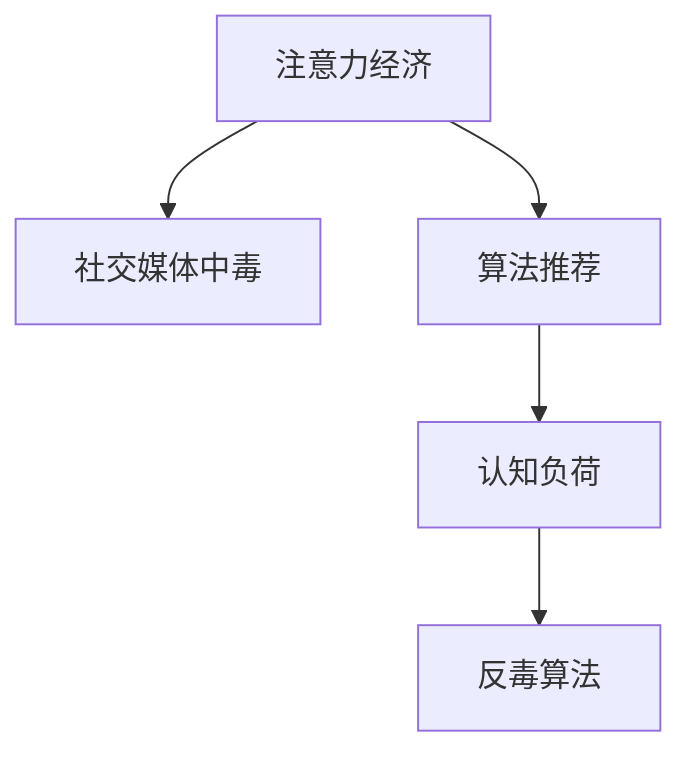

                 

# 注意力经济与社交媒体中毒：如何打破循环并获得自由

### 1. 背景介绍

#### 1.1 问题由来

在数字化时代，注意力成为了一种稀缺资源。在内容爆炸的社交媒体平台上，获取和保持用户的注意力成为了各个平台、内容创作者以及广告商的核心竞争力。这种对注意力的追逐和依赖，催生了一种新的经济形态：注意力经济。

然而，这种对注意力的追逐，也导致了用户的注意力过度分散和"中毒"现象的加剧。用户在各种信息流中不断切换，难以专注于重要内容，导致认知负荷增加、注意力疲劳和信息过载等问题。这种注意力分散和中毒现象，已经严重影响了用户的生产力和生活质量。

#### 1.2 问题核心关键点

注意力经济的核心在于如何通过技术手段，更高效地吸引、保持和利用用户的注意力。社交媒体中毒现象的根源在于用户对注意力资源的不合理利用，以及系统对用户注意力的过度操控。解决这一问题的关键在于如何重新设计用户与内容之间的关系，以及如何通过算法优化来引导用户更健康地使用社交媒体。

### 2. 核心概念与联系

#### 2.1 核心概念概述

为更好地理解注意力经济和社交媒体中毒现象，本节将介绍几个密切相关的核心概念：

- 注意力经济(Attention Economy)：通过吸引和保持用户的注意力，创造商业价值的一种经济模式。
- 社交媒体中毒(Social Media Addiction)：用户在社交媒体上过度沉溺，导致注意力分散和认知负荷增加的现象。
- 算法推荐(Algorithm Recommendation)：利用用户行为数据，通过机器学习算法对内容进行排序和推荐，以吸引用户注意力的过程。
- 认知负荷(Cognitive Load)：用户在使用过程中所承受的心理负担，过度负荷会导致认知疲劳和注意分散。
- 反毒算法(Anti-Toxic Algorithm)：旨在改善用户社交媒体使用体验，减少注意力分散和认知负荷的技术手段。

这些核心概念之间的逻辑关系可以通过以下Mermaid流程图来展示：



这个流程图展示了几大核心概念之间的关系：

1. 注意力经济通过算法推荐吸引用户注意力，但同时也可能导致社交媒体中毒。
2. 社交媒体中毒是由于认知负荷的增加，反毒算法旨在缓解这种负荷。

### 3. 核心算法原理 & 具体操作步骤

#### 3.1 算法原理概述

注意力经济的核心在于如何高效地吸引和保持用户的注意力，从而实现商业价值的最大化。社交媒体中毒的解决途径则在于如何通过算法优化，减轻用户认知负荷，引导其更健康地使用社交媒体。

目前，大多数社交媒体平台采用基于强化学习、协同过滤等算法的推荐系统，通过机器学习模型预测用户对内容的喜好程度，从而进行推荐排序。这种推荐系统在吸引用户注意力、提升用户留存率等方面发挥了重要作用。但同时，这种算法也加剧了用户的注意力分散和中毒现象。

具体来说，推荐系统通常会基于用户的历史行为数据，通过模型预测用户对各类内容的兴趣程度。例如，基于协同过滤的推荐算法会预测用户对相似用户喜欢的内容的偏好，而基于强化学习的推荐算法则会根据用户的操作反馈（如点击、点赞等）不断调整推荐策略。这种基于行为的推荐方式，虽然能够高效吸引用户注意力，但同时也容易导致用户过度沉溺，难以从信息流中自拔。

#### 3.2 算法步骤详解

基于算法的社交媒体推荐系统通常包括以下几个关键步骤：

**Step 1: 数据收集和预处理**
- 收集用户的行为数据，包括浏览记录、点赞、评论等。
- 对数据进行清洗和标准化处理，去除异常值和噪声。

**Step 2: 特征工程**
- 提取与用户行为相关的特征，如内容特征、用户特征、时间特征等。
- 使用特征工程技术（如PCA、特征选择等）减少特征维度和提高特征质量。

**Step 3: 模型训练**
- 选择合适的推荐模型，如协同过滤、矩阵分解、深度学习等。
- 使用用户历史数据进行模型训练，优化模型的参数。

**Step 4: 推荐排序**
- 对所有待推荐内容进行评分预测，根据评分排序。
- 选择合适的排序算法（如Top-k推荐、内容多样化推荐等）生成推荐列表。

**Step 5: 效果评估**
- 使用A/B测试等方法评估推荐系统的效果。
- 定期收集用户反馈，优化模型和策略。

#### 3.3 算法优缺点

基于算法的推荐系统有以下优点：
1. 高效吸引用户注意力。通过精准的推荐算法，可以最大化利用用户的时间和注意力资源。
2. 提升用户留存率。推荐系统能够持续吸引用户关注新内容，增加用户粘性。
3. 个性化推荐。能够根据用户的行为特征进行个性化定制，提升用户体验。

但同时，这种算法也存在以下缺点：
1. 加剧用户注意力分散。推荐算法倾向于推荐用户可能感兴趣但不一定需要的内容，导致用户注意力被过度分散。
2. 导致社交媒体中毒。用户过度依赖算法推荐，难以从中自拔，容易出现注意力分散和认知负荷增加的问题。
3. 可能加剧信息过载。过度推荐相关内容，可能导致用户信息过载，难以处理大量信息。

#### 3.4 算法应用领域

基于算法的推荐系统在多个领域得到了广泛应用，包括电商、视频、新闻等。这些平台通过推荐系统，可以显著提升用户活跃度和平台收入，是实现注意力经济的重要手段。

在电商领域，推荐系统根据用户的历史购买记录和浏览行为，为用户推荐可能感兴趣的商品，提升转化率和客单价。

在视频平台，推荐系统通过分析用户对视频的观看历史和互动数据，为用户推荐相关视频内容，增加用户停留时间和平台收入。

在新闻平台，推荐系统根据用户阅读历史和互动行为，推荐可能感兴趣的新闻，提升用户阅读量和平台流量。

### 4. 数学模型和公式 & 详细讲解 & 举例说明

#### 4.1 数学模型构建

假设社交媒体平台的推荐系统基于深度学习模型进行推荐，模型的输入为用户的特征向量 $x$ 和内容的特征向量 $y$，输出为推荐概率 $p(y|x)$。模型的训练目标为最大化预测准确率，即最小化损失函数 $L$。

**目标函数**：
$$
\min_{\theta} L(\theta) = \mathbb{E}_{(x,y)}[\ell(p(y|x),y)]
$$

其中 $\ell$ 为损失函数，如交叉熵损失。

#### 4.2 公式推导过程

在深度学习模型中，通常使用反向传播算法计算损失函数的梯度，并用于模型参数的更新。具体步骤如下：

**前向传播**：
$$
\hat{y} = f_\theta(x)
$$

其中 $f_\theta$ 为模型前向传播函数。

**计算损失**：
$$
\ell(p(y|x),y) = -(y\log p(y|x) + (1-y)\log(1-p(y|x)))
$$

**反向传播**：
$$
\frac{\partial L}{\partial \theta} = \frac{\partial \ell}{\partial p(y|x)} \frac{\partial p(y|x)}{\partial \theta}
$$

其中 $\frac{\partial \ell}{\partial p(y|x)}$ 为交叉熵损失的梯度，$\frac{\partial p(y|x)}{\partial \theta}$ 为模型输出的梯度。

#### 4.3 案例分析与讲解

以下以协同过滤推荐算法为例，说明基于算法的推荐系统的工作原理。

协同过滤算法基于用户行为数据，通过模型预测用户对未交互内容的评分。假设用户 $u$ 对内容 $i$ 的评分记为 $r_{ui}$，算法构建用户和内容的评分矩阵 $R$：

$$
R_{ui} = r_{ui}
$$

协同过滤算法的目标是最小化矩阵分解的误差，即：

$$
\min_{U,V} \|R-UV\|_F^2
$$

其中 $U$ 和 $V$ 分别为用户和内容的低秩矩阵，$\|R-UV\|_F^2$ 为矩阵分解的误差。

通过求解上述优化问题，得到用户和内容的潜在特征矩阵 $U$ 和 $V$，进而对新内容进行评分预测：

$$
\hat{r}_{ui} = \langle U_u, V_i \rangle
$$

其中 $\langle \cdot,\cdot \rangle$ 为向量点积，$\hat{r}_{ui}$ 为模型预测的用户对内容的评分。

### 5. 项目实践：代码实例和详细解释说明

#### 5.1 开发环境搭建

在进行社交媒体推荐系统开发前，我们需要准备好开发环境。以下是使用Python进行PyTorch开发的环境配置流程：

1. 安装Anaconda：从官网下载并安装Anaconda，用于创建独立的Python环境。

2. 创建并激活虚拟环境：
```bash
conda create -n pytorch-env python=3.8 
conda activate pytorch-env
```

3. 安装PyTorch：根据CUDA版本，从官网获取对应的安装命令。例如：
```bash
conda install pytorch torchvision torchaudio cudatoolkit=11.1 -c pytorch -c conda-forge
```

4. 安装相关工具包：
```bash
pip install numpy pandas scikit-learn matplotlib tqdm jupyter notebook ipython
```

完成上述步骤后，即可在`pytorch-env`环境中开始推荐系统开发。

#### 5.2 源代码详细实现

这里我们以协同过滤推荐算法为例，给出使用PyTorch实现社交媒体推荐系统的完整代码实现。

```python
import torch
import torch.nn as nn
import torch.optim as optim
import numpy as np

# 定义协同过滤模型
class CollaborativeFiltering(nn.Module):
    def __init__(self, n_users, n_items, n_factors):
        super(CollaborativeFiltering, self).__init__()
        self.user_factors = nn.Parameter(torch.randn(n_users, n_factors))
        self.item_factors = nn.Parameter(torch.randn(n_items, n_factors))
        self.rank_loss = nn.MSELoss()

    def forward(self, user_idx, item_idx):
        user_factors = self.user_factors[user_idx]
        item_factors = self.item_factors[item_idx]
        ratings = torch.matmul(user_factors, item_factors.t())
        return ratings
    
# 定义评分矩阵
n_users = 1000
n_items = 1000
n_factors = 50

R = np.random.rand(n_users, n_items)
user_idx = np.random.randint(0, n_users, size=(n_users, 10))
item_idx = np.random.randint(0, n_items, size=(n_items, 10))

R = torch.from_numpy(R).float()
user_idx = torch.from_numpy(user_idx).long()
item_idx = torch.from_numpy(item_idx).long()

# 定义模型和优化器
model = CollaborativeFiltering(n_users, n_items, n_factors)
optimizer = optim.Adam(model.parameters(), lr=0.01)

# 定义评分矩阵的损失函数
loss = model.loss(user_idx, item_idx)

# 训练模型
for epoch in range(100):
    optimizer.zero_grad()
    loss.backward()
    optimizer.step()

    if epoch % 10 == 0:
        print(f"Epoch {epoch+1}, Loss: {loss.item()}")
```

以上就是使用PyTorch对协同过滤推荐算法进行社交媒体推荐系统开发的完整代码实现。可以看到，利用PyTorch，我们可以用相对简洁的代码实现协同过滤算法，并进行高效的模型训练。

#### 5.3 代码解读与分析

让我们再详细解读一下关键代码的实现细节：

**CollaborativeFiltering类**：
- `__init__`方法：初始化用户和物品的潜在特征矩阵。
- `forward`方法：前向传播计算用户和物品的评分预测。

**训练流程**：
- 定义评分矩阵和用户、物品的交互索引。
- 定义模型和优化器，设置学习率。
- 定义损失函数，并进行模型训练。
- 在每个epoch输出损失，并在特定epoch输出模型评分预测结果。

可以看到，利用PyTorch，协同过滤算法的实现变得简洁高效。开发者可以将更多精力放在模型改进和数据处理上，而不必过多关注底层的实现细节。

### 6. 实际应用场景

#### 6.1 电商平台

基于协同过滤推荐算法的电商推荐系统，可以显著提升用户购物体验和平台转化率。电商平台的推荐系统通常采用用户-物品评分矩阵，通过协同过滤算法预测用户对新商品的评分，生成个性化推荐列表。用户可以根据推荐结果发现更多自己感兴趣的商品，增加购物决策的效率和满意度。

#### 6.2 视频平台

视频平台的推荐系统通常采用基于内容协同过滤和基于用户协同过滤两种方式。基于内容的协同过滤算法通过分析视频内容特征，为用户推荐相似的视频内容。基于用户的协同过滤算法则通过分析用户行为数据，为用户推荐其他用户喜欢的视频内容。

#### 6.3 新闻平台

新闻平台的推荐系统通常采用协同过滤和深度学习等算法。协同过滤算法根据用户的历史阅读记录，为用户推荐可能感兴趣的新闻。深度学习算法则通过分析用户阅读行为的深度特征，预测用户对新闻的兴趣程度，生成个性化推荐列表。

### 7. 工具和资源推荐

#### 7.1 学习资源推荐

为了帮助开发者系统掌握社交媒体推荐技术，这里推荐一些优质的学习资源：

1. 《推荐系统实战》系列博文：由推荐系统专家撰写，深入浅出地介绍了推荐系统原理、算法实现、应用场景等。

2. 《Deep Learning for Recommendation Systems》书籍：Google推荐团队编写的推荐系统经典著作，涵盖深度学习、协同过滤等多种推荐算法。

3. CS231n《深度学习》课程：斯坦福大学开设的深度学习明星课程，涵盖了多种推荐算法和模型，有Lecture视频和配套作业。

4. KDD Cup竞赛：KDD Cup推荐系统竞赛，涵盖推荐系统各个方面，是学习和实战推荐算法的绝佳机会。

5. RecSys会议：国际推荐系统顶级会议，汇集了大量推荐系统研究的最新进展和前沿技术，提供丰富的学习资源。

通过对这些资源的学习实践，相信你一定能够快速掌握社交媒体推荐技术，并应用于解决实际的推荐问题。

#### 7.2 开发工具推荐

高效的开发离不开优秀的工具支持。以下是几款用于社交媒体推荐系统开发的常用工具：

1. PyTorch：基于Python的开源深度学习框架，灵活动态的计算图，适合快速迭代研究。大部分推荐算法都有PyTorch版本的实现。

2. TensorFlow：由Google主导开发的开源深度学习框架，生产部署方便，适合大规模工程应用。同样有丰富的推荐算法资源。

3. HuggingFace Transformers库：用于自然语言处理的强大工具库，集成了多种推荐算法和模型，支持PyTorch和TensorFlow，是推荐系统开发的利器。

4. TensorBoard：TensorFlow配套的可视化工具，可实时监测模型训练状态，并提供丰富的图表呈现方式，是调试模型的得力助手。

5. Weights & Biases：模型训练的实验跟踪工具，可以记录和可视化模型训练过程中的各项指标，方便对比和调优。与主流深度学习框架无缝集成。

合理利用这些工具，可以显著提升社交媒体推荐系统的开发效率，加快创新迭代的步伐。

#### 7.3 相关论文推荐

社交媒体推荐技术的发展源于学界的持续研究。以下是几篇奠基性的相关论文，推荐阅读：

1. Collaborative Filtering for Implicit Feedback Datasets（1999年KDD论文）：提出了协同过滤算法的基本框架，奠定了推荐系统的基础。

2. SimRank: A Similarity-Based Ranking Algorithm for Recommender Systems（2007年SIGKDD论文）：提出基于图的相似性排序算法，用于推荐系统。

3. Wide & Deep Collaborative Filtering（2016年RecSys论文）：提出将深度学习和线性模型相结合的推荐算法，取得了显著效果。

4. Attention and Transformer-based Recommender Systems（2018年NeurIPS论文）：引入Transformer结构，用于推荐系统的用户表示学习。

5. Factorization Machines for Recommender Systems（2012年ICDM论文）：提出因子分解机算法，用于推荐系统的建模。

这些论文代表了大语言模型微调技术的发展脉络。通过学习这些前沿成果，可以帮助研究者把握学科前进方向，激发更多的创新灵感。

### 8. 总结：未来发展趋势与挑战

#### 8.1 总结

本文对基于算法的社交媒体推荐系统进行了全面系统的介绍。首先阐述了社交媒体推荐系统的工作原理和应用场景，明确了推荐系统在吸引用户注意力、提升用户体验方面的核心价值。其次，从原理到实践，详细讲解了推荐系统的数学模型和关键步骤，给出了推荐系统开发的完整代码实例。同时，本文还广泛探讨了推荐系统在电商、视频、新闻等领域的实际应用，展示了推荐系统的广阔前景。

通过本文的系统梳理，可以看到，基于算法的推荐系统已经成为社交媒体平台的核心竞争力，极大地提升了用户满意度和平台收入。未来，伴随推荐算法的不断演进，推荐系统的性能和用户体验还将进一步提升，成为注意力经济的关键推动力。

#### 8.2 未来发展趋势

展望未来，社交媒体推荐系统的研究将呈现以下几个发展趋势：

1. 推荐系统的多模态融合。未来的推荐系统将不仅考虑用户行为数据，还会融合多模态数据（如图像、音频、文本等），增强推荐的多样性和精准度。

2. 推荐系统的深度学习技术。深度学习在推荐系统中的应用将不断深化，通过深度神经网络建模，提升推荐系统的表达能力和泛化能力。

3. 推荐系统的自适应调整。未来的推荐系统将更加注重个性化和动态调整，根据用户的实时行为和反馈，实时调整推荐策略。

4. 推荐系统的跨领域应用。推荐系统将不仅仅局限于单一平台或领域，而是跨越多个平台和领域，实现跨平台的协同推荐。

5. 推荐系统的可持续性。未来的推荐系统将更加注重数据隐私和系统可持续性，减少对用户隐私的侵害，提升系统的可扩展性和可维护性。

这些趋势展示了社交媒体推荐系统未来的发展方向，必将推动推荐技术迈向更高的台阶，为用户的注意力管理提供更加智能、高效、个性化的解决方案。

#### 8.3 面临的挑战

尽管社交媒体推荐系统已经取得了显著成效，但在迈向更加智能化、个性化应用的过程中，它仍面临着诸多挑战：

1. 数据质量问题。推荐系统依赖于用户行为数据，但数据质量问题（如缺失值、噪声等）可能导致推荐系统效果下降。如何有效处理数据噪声和缺失值，将是重要研究方向。

2. 模型复杂性。随着深度学习在推荐系统中的应用，模型的复杂度不断增加，训练和推理的资源消耗也相应增加。如何在保证模型效果的同时，优化模型的计算资源消耗，提升系统效率，还需要更多研究和实践。

3. 推荐公平性。推荐系统可能存在算法偏见，导致某些用户群体的需求被忽略。如何设计公平、无偏差的推荐算法，确保推荐系统对所有用户群体公平对待，仍需深入研究。

4. 推荐系统的可解释性。推荐系统的内部决策过程缺乏可解释性，难以理解推荐结果的原因。如何增强推荐系统的可解释性，让用户信服推荐结果，也将是未来的一个重要研究方向。

5. 用户隐私保护。推荐系统需要大量的用户行为数据，如何保护用户隐私，防止数据泄露和滥用，将是未来的重要课题。

6. 推荐系统的鲁棒性。推荐系统在面对异常数据和恶意攻击时，容易受到干扰，导致推荐结果偏离正常水平。如何提高推荐系统的鲁棒性，确保推荐结果的稳定性和可靠性，还需要更多研究和实践。

这些挑战展示了社交媒体推荐系统未来发展中的难点，需要学界和业界共同努力，才能克服这些难题，实现推荐系统的可持续发展。

#### 8.4 研究展望

面对社交媒体推荐系统所面临的诸多挑战，未来的研究需要在以下几个方面寻求新的突破：

1. 探索更高效的推荐算法。开发更加高效、精简的推荐算法，减少资源消耗，提升推荐速度和精度。

2. 融合多模态数据。将多模态数据融合到推荐系统中，增强推荐的多样性和精准度。

3. 引入深度学习技术。利用深度学习技术，提升推荐系统的表达能力和泛化能力，增强系统的鲁棒性和公平性。

4. 注重推荐系统的可解释性。引入可解释性方法，增强推荐系统的透明度和可信度，让用户更信服推荐结果。

5. 设计公平推荐算法。设计公平、无偏差的推荐算法，确保推荐系统对所有用户群体公平对待。

6. 引入推荐系统的鲁棒性技术。引入鲁棒性技术，增强推荐系统面对异常数据和恶意攻击的抵抗能力。

7. 注重用户隐私保护。设计隐私保护机制，确保用户数据的安全和隐私保护。

这些研究方向展示了社交媒体推荐系统未来发展的方向，必将推动推荐技术不断向前发展，为用户的注意力管理提供更加智能、高效、个性化的解决方案。

### 9. 附录：常见问题与解答

**Q1：社交媒体推荐系统是否适用于所有用户群体？**

A: 社交媒体推荐系统通常采用用户行为数据进行推荐，对于行为数据少的用户群体（如新用户），推荐效果可能不佳。此时需要结合其他因素，如内容标签、用户属性等进行推荐。

**Q2：推荐系统如何处理用户隐私问题？**

A: 推荐系统需要大量用户行为数据，因此必须注重用户隐私保护。常用的方法包括：
1. 匿名化处理：对用户数据进行匿名化，去除个人标识信息。
2. 差分隐私：在数据收集和处理过程中，采用差分隐私技术，保护用户隐私。
3. 用户控制：让用户自行控制数据的使用范围和权限，增强用户信任。

**Q3：推荐系统如何避免信息过载问题？**

A: 推荐系统可以通过以下方法避免信息过载问题：
1. 多样性推荐：引入多样性约束，避免推荐过多相关内容。
2. 用户控制：让用户自行选择推荐结果的数量，控制信息量。
3. 动态调整：根据用户的实时反馈，动态调整推荐策略，减少信息过载。

**Q4：推荐系统如何避免推荐偏差问题？**

A: 推荐系统可以通过以下方法避免推荐偏差问题：
1. 多样性推荐：引入多样性约束，避免推荐过多相关内容。
2. 用户控制：让用户自行选择推荐结果的数量，控制信息量。
3. 动态调整：根据用户的实时反馈，动态调整推荐策略，减少信息过载。

**Q5：推荐系统如何增强推荐结果的可解释性？**

A: 推荐系统可以通过以下方法增强推荐结果的可解释性：
1. 引入可解释性模型：使用可解释性模型（如决策树、LIME等），提高推荐结果的可解释性。
2. 引入用户反馈：在推荐过程中引入用户反馈，增强推荐结果的可解释性。
3. 提供推荐理由：在推荐结果中提供推荐理由，解释推荐依据。

这些常见问题的解答展示了社交媒体推荐系统的应用细节，有助于开发者更好地理解推荐系统的原理和应用。

---

作者：禅与计算机程序设计艺术 / Zen and the Art of Computer Programming

