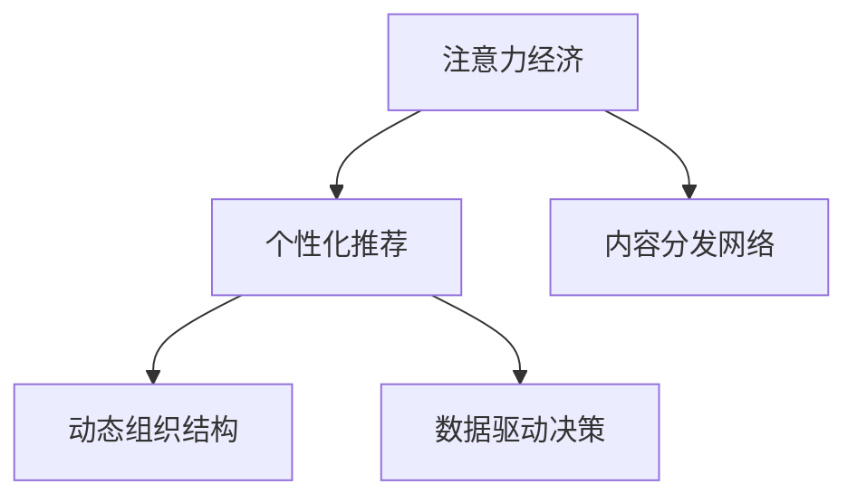

                 

# 注意力经济对企业组织结构的影响

## 1. 背景介绍

在当今信息爆炸的时代，注意力经济（Economy of Attention）正逐渐成为企业和组织的核心竞争力。随着互联网和移动技术的普及，消费者面临的信息过载已经成为一个普遍现象。如何在海量信息中抓住用户的注意力，是企业能否在市场竞争中脱颖而出的关键。

### 1.1 问题由来

注意力经济的核心在于如何有效分配和使用用户的注意力资源。用户注意力是有限的，如何提升内容的相关性、互动性和个性化，从而吸引并留住用户，是每个企业都必须面对的问题。而随着人工智能（AI）和大数据分析技术的不断发展，越来越多的企业开始利用这些技术来优化其内容生产和传播策略，以更好地吸引和保持用户的注意力。

### 1.2 问题核心关键点

注意力经济的关键在于内容的优化和个性化推荐，而这一过程与企业的组织结构密切相关。传统企业组织结构中，生产、研发、市场、运营等各个部门往往是相互独立的，信息的流动和沟通需要经过多层的传递和协调。而AI和大数据技术的引入，使得企业能够通过数据分析来优化内容生产和分发策略，从而使得信息的生产和传递可以更加高效和精准。

## 2. 核心概念与联系

### 2.1 核心概念概述

为更好地理解注意力经济对企业组织结构的影响，本节将介绍几个密切相关的核心概念：

- 注意力经济（Economy of Attention）：指在信息过载的环境下，如何有效地吸引和分配用户的注意力。
- 个性化推荐系统：基于用户的历史行为和偏好，推荐最相关的产品或内容，提升用户体验和转化率。
- 内容分发网络（Content Distribution Network, CDN）：通过分布式节点缓存和分发内容，减少内容传输延迟，提升用户体验。
- 动态组织结构：根据业务需求和市场变化，动态调整企业内部组织结构和人员配置，以提高响应速度和效率。
- 数据驱动决策：基于大数据和分析工具，进行科学的决策和业务优化，提升企业运营效率和盈利能力。

这些核心概念之间的逻辑关系可以通过以下Mermaid流程图来展示：



这个流程图展示了这个核心概念之间的相互关系：

1. 注意力经济是基础，是企业通过优化内容获取用户注意力的目标。
2. 个性化推荐和内容分发网络是手段，是实现注意力经济的具体技术手段。
3. 动态组织结构和数据驱动决策是保障，是支持个性化推荐和内容分发网络高效运行的基础。

## 3. 核心算法原理 & 具体操作步骤
### 3.1 算法原理概述

注意力经济的核心在于通过优化内容的展示和推荐，吸引并留住用户的注意力。其算法原理可以归纳为以下几个方面：

1. 基于用户行为数据（如浏览历史、点击记录等），构建用户画像。
2. 利用机器学习和深度学习技术，预测用户对不同内容的需求和偏好。
3. 通过推荐系统算法（如协同过滤、基于内容的推荐、矩阵分解等），为用户推荐相关内容。
4. 动态调整内容的展示策略，如调整标题、图片、格式等，提高用户点击率。

### 3.2 算法步骤详解

以下将详细阐述基于注意力经济的核心算法步骤：

**Step 1: 数据采集与清洗**
- 收集用户的历史行为数据（如浏览记录、搜索历史等）。
- 对数据进行清洗，去除异常值和噪声，确保数据的准确性和完整性。

**Step 2: 用户画像构建**
- 利用机器学习算法（如聚类、分类等），对用户数据进行建模，构建用户画像。
- 根据用户的兴趣和行为特征，进行特征工程，提取关键特征。

**Step 3: 推荐模型训练**
- 选择合适的推荐算法（如协同过滤、基于内容的推荐、深度学习等），训练推荐模型。
- 使用交叉验证等方法，评估模型的性能，并进行模型调优。

**Step 4: 内容展示优化**
- 根据推荐模型输出的结果，动态调整内容的展示策略。
- 通过A/B测试等方法，评估不同展示策略的效果，进行策略优化。

**Step 5: 反馈机制建立**
- 建立用户反馈机制，收集用户对推荐内容的满意度信息。
- 基于用户反馈，持续优化推荐模型和内容展示策略。

### 3.3 算法优缺点

基于注意力经济的推荐算法具有以下优点：
1. 提高用户满意度：通过个性化的推荐，提升用户对内容的满意度和粘性。
2. 优化资源分配：通过数据分析，优化内容生产和分发资源，提升运营效率。
3. 提升转化率：通过精准推荐，提高用户转化率和企业收益。

同时，该方法也存在一定的局限性：
1. 依赖数据质量：推荐算法的效果很大程度上取决于数据的质量和完整性，数据收集和清洗的成本较高。
2. 冷启动问题：新用户或新内容的推荐效果较差，需要更多的数据和时间来优化。
3. 隐私问题：用户数据的收集和使用可能引发隐私保护问题，需要严格遵守相关法律法规。
4. 模型解释性不足：推荐算法的黑箱特性，使得用户难以理解推荐逻辑，可能引发不信任感。

尽管存在这些局限性，但就目前而言，基于注意力经济的推荐算法仍是最主流的用户推荐方法。未来相关研究的重点在于如何进一步降低推荐算法对数据质量的依赖，提高模型的解释性和公平性，同时兼顾用户隐私保护。

### 3.4 算法应用领域

基于注意力经济的推荐算法在多个领域得到了广泛的应用，例如：

- 电商推荐：根据用户的浏览和购买记录，推荐商品或优惠券，提升销售转化率。
- 社交媒体推荐：根据用户的互动行为（如点赞、评论、分享等），推荐相关内容，提升用户粘性。
- 视频推荐：根据用户的观看记录和反馈，推荐视频内容，提高用户观看时长和满意度。
- 新闻推荐：根据用户的阅读偏好，推荐相关新闻文章，提升用户阅读量和留存率。

除了上述这些经典应用外，注意力经济还被创新性地应用到更多场景中，如金融理财、健康医疗、教育培训等，为用户提供了更加个性化、精准的服务体验。随着推荐算法和个性化技术的发展，基于注意力经济的推荐方法将在更多领域得到应用，为用户带来更优质的服务体验。

## 4. 数学模型和公式 & 详细讲解  
### 4.1 数学模型构建

基于注意力经济的核心算法可以构建一个多目标优化问题。假设企业目标最大化用户满意度 $U$ 和广告收入 $A$，用户满意度和广告收入的优化目标分别为：

$$
\max_{\theta} U(\theta) + \lambda A(\theta)
$$

其中 $\theta$ 为推荐模型的参数，$\lambda$ 为广告收入的权重系数。假设用户对内容 $x_i$ 的满意度为 $u_i(\theta)$，广告收入为 $a_i(\theta)$，则上述目标函数可以表示为：

$$
\max_{\theta} \sum_{i=1}^N u_i(\theta) + \lambda \sum_{i=1}^N a_i(\theta)
$$

### 4.2 公式推导过程

以基于内容的推荐算法为例，假设内容库为 $\{x_1, x_2, ..., x_M\}$，用户画像为 $\{x_1, x_2, ..., x_N\}$。对于每个用户画像 $x_j$，内容 $x_i$ 的满意度为 $u_i(x_j, \theta)$，则用户满意度函数 $U(\theta)$ 可以表示为：

$$
U(\theta) = \sum_{j=1}^N \sum_{i=1}^M u_i(x_j, \theta)
$$

广告收入函数 $A(\theta)$ 可以表示为：

$$
A(\theta) = \sum_{i=1}^M a_i(\theta)
$$

假设 $u_i(x_j, \theta)$ 为内容 $x_i$ 对用户 $x_j$ 的满意度函数，可以表示为：

$$
u_i(x_j, \theta) = \sum_{k=1}^K w_k f_k(x_i, x_j, \theta)
$$

其中 $w_k$ 为内容的特征权重，$f_k(x_i, x_j, \theta)$ 为特征函数，表示内容 $x_i$ 对用户 $x_j$ 的满意度。

将上述公式代入目标函数，得到：

$$
\max_{\theta} \sum_{j=1}^N \sum_{i=1}^M \sum_{k=1}^K w_k f_k(x_i, x_j, \theta) + \lambda \sum_{i=1}^M a_i(\theta)
$$

### 4.3 案例分析与讲解

假设某电商平台的推荐模型需要根据用户的历史浏览和购买记录，为用户推荐可能感兴趣的商品。用户画像 $x_j$ 包含用户的浏览历史 $h_j$ 和购买记录 $p_j$，内容 $x_i$ 包含商品的标题、描述、价格等信息。

根据用户的浏览历史 $h_j$ 和购买记录 $p_j$，可以构建用户画像 $x_j$。然后，利用推荐算法（如矩阵分解、协同过滤等），计算内容 $x_i$ 对用户 $x_j$ 的满意度 $u_i(x_j, \theta)$。最后，根据广告收入 $a_i$ 和用户满意度 $u_i(x_j, \theta)$，构建优化目标函数，进行推荐模型训练。

## 5. 项目实践：代码实例和详细解释说明
### 5.1 开发环境搭建

在进行推荐算法实践前，我们需要准备好开发环境。以下是使用Python进行推荐系统开发的开发环境配置流程：

1. 安装Anaconda：从官网下载并安装Anaconda，用于创建独立的Python环境。

2. 创建并激活虚拟环境：
```bash
conda create -n recsys python=3.8 
conda activate recsys
```

3. 安装PyTorch、TensorFlow等深度学习框架：
```bash
pip install torch torchvision torchaudio cudatoolkit=11.1 -c pytorch -c conda-forge
pip install tensorflow
```

4. 安装推荐系统相关库：
```bash
pip install lightfm pytorch-lightning
```

5. 安装相关的数据处理和可视化工具：
```bash
pip install pandas numpy scikit-learn matplotlib seaborn
```

完成上述步骤后，即可在`recsys`环境中开始推荐算法实践。

### 5.2 源代码详细实现

下面我们以基于内容的推荐系统为例，给出使用LightFM库对电商推荐系统进行训练的PyTorch代码实现。

首先，定义推荐系统的训练函数：

```python
import lightfm
import torch.nn as nn
import torch
import torch.nn.functional as F

def train_epoch(model, data_loader, optimizer, device):
    model.train()
    total_loss = 0
    for batch in data_loader:
        user_ids, item_ids, rating, weights = batch
        user_ids = user_ids.to(device)
        item_ids = item_ids.to(device)
        rating = rating.to(device)
        weights = weights.to(device)
        optimizer.zero_grad()
        with torch.no_grad():
            predictions = model(user_ids, item_ids)
        loss = F.mse_loss(predictions, rating, reduction='none')
        loss = loss * weights.unsqueeze(-1)
        loss = loss.mean()
        total_loss += loss.item()
        loss.backward()
        optimizer.step()
    return total_loss / len(data_loader)
```

然后，定义推荐系统的评估函数：

```python
def evaluate(model, data_loader, device):
    model.eval()
    total_loss = 0
    predictions, true_ratings = [], []
    for batch in data_loader:
        user_ids, item_ids, rating, weights = batch
        user_ids = user_ids.to(device)
        item_ids = item_ids.to(device)
        rating = rating.to(device)
        with torch.no_grad():
            predictions = model(user_ids, item_ids)
        total_loss += (predictions - rating).pow(2).mean().item()
        predictions = predictions.cpu().numpy()
        true_ratings = true_ratings + rating.numpy().tolist()
    return total_loss / len(data_loader), predictions, true_ratings
```

最后，启动训练流程并在测试集上评估：

```python
epochs = 10
batch_size = 128

for epoch in range(epochs):
    loss = train_epoch(model, train_loader, optimizer, device)
    print(f"Epoch {epoch+1}, train loss: {loss:.3f}")
    
    test_loss, predictions, true_ratings = evaluate(model, test_loader, device)
    print(f"Epoch {epoch+1}, test loss: {test_loss:.3f}")
    print(f"Epoch {epoch+1}, accuracy: {metrics.accuracy_score(true_ratings, predictions):.3f}")
```

以上就是使用PyTorch对电商推荐系统进行训练的完整代码实现。可以看到，利用LightFM库，我们可以轻松实现推荐系统的训练和评估。

### 5.3 代码解读与分析

让我们再详细解读一下关键代码的实现细节：

**train_epoch函数**：
- 定义训练函数，对数据集进行批次化加载，并在每个批次上进行模型前向传播和后向传播。
- 使用均方误差损失函数（MSE）计算预测值与真实值之间的误差。
- 通过反向传播更新模型参数，并使用优化器调整学习率。

**evaluate函数**：
- 定义评估函数，对测试集进行批次化加载，并在每个批次上进行模型前向传播和后向传播。
- 计算预测值与真实值之间的均方误差，并返回预测值和真实值。

**训练流程**：
- 定义总的epoch数和batch size，开始循环迭代
- 每个epoch内，先在训练集上训练，输出平均损失
- 在测试集上评估，输出损失和准确率
- 所有epoch结束后，输出最终的测试结果

可以看到，利用PyTorch和LightFM库，推荐系统的代码实现变得简洁高效。开发者可以将更多精力放在数据处理、模型改进等高层逻辑上，而不必过多关注底层的实现细节。

当然，工业级的系统实现还需考虑更多因素，如模型的保存和部署、超参数的自动搜索、更灵活的任务适配层等。但核心的推荐范式基本与此类似。

## 6. 实际应用场景
### 6.1 电商推荐

基于注意力经济的推荐算法在电商推荐领域得到了广泛应用。传统电商推荐系统往往基于用户的浏览和购买历史，进行简单地推荐。而基于注意力经济的推荐算法，通过分析用户的浏览路径、点击行为、购买记录等多样化数据，能够更准确地预测用户的兴趣和需求。

在技术实现上，可以收集用户的多维度数据，如浏览历史、搜索记录、点击行为等，利用深度学习算法（如RNN、LSTM等）进行建模，训练推荐模型。微调后的推荐模型可以根据用户行为数据，生成个性化的商品推荐结果。此外，还可以通过动态调整商品展示策略，进一步提升推荐效果。

### 6.2 社交媒体推荐

社交媒体平台需要根据用户的互动行为（如点赞、评论、分享等），为用户推荐相关内容。基于注意力经济的推荐算法，能够更好地理解用户的兴趣和行为模式，推荐更加精准和个性化。

在技术实现上，可以收集用户的互动数据，利用深度学习算法（如CNN、RNN等）进行建模，训练推荐模型。推荐模型可以根据用户的行为数据，生成个性化的内容推荐结果。此外，还可以通过动态调整内容的展示策略，进一步提升推荐效果。

### 6.3 视频推荐

视频平台需要根据用户的观看记录和反馈，为用户推荐相关视频内容。基于注意力经济的推荐算法，能够更好地理解用户的观看偏好和行为模式，推荐更加精准和个性化。

在技术实现上，可以收集用户的观看记录和反馈数据，利用深度学习算法（如CNN、RNN等）进行建模，训练推荐模型。推荐模型可以根据用户的观看数据，生成个性化的视频推荐结果。此外，还可以通过动态调整视频的展示策略，进一步提升推荐效果。

### 6.4 未来应用展望

随着注意力经济的不断发展，基于推荐算法的应用场景将不断拓展，为企业带来更多的商业机会。

在智慧医疗领域，基于推荐算法可以为医生推荐最新的医学论文和研究成果，帮助医生更好地进行临床决策。同时，也可以为患者推荐合适的医疗服务和药物，提升治疗效果和满意度。

在智能教育领域，基于推荐算法可以为学生推荐个性化的学习资源和课程，帮助学生更好地掌握知识。同时，也可以为教师推荐合适的教学方法和资源，提升教学效果和教师满意度。

在智慧城市治理中，基于推荐算法可以为城市管理者推荐最优的交通路线和资源分配方案，提升城市管理效率和居民满意度。同时，也可以为市民推荐合适的公共服务和设施，提升城市生活质量。

除了上述这些领域外，基于推荐算法的应用场景还将不断拓展，为企业带来更多的商业机会和创新空间。相信随着推荐算法的持续发展，基于注意力经济的推荐方法将成为企业提高竞争力、优化用户体验的重要手段。

## 7. 工具和资源推荐
### 7.1 学习资源推荐

为了帮助开发者系统掌握基于注意力经济的推荐算法的理论基础和实践技巧，这里推荐一些优质的学习资源：

1. 《推荐系统实践》书籍：该书详细介绍了推荐系统的设计、实现和优化方法，是推荐算法学习的经典教材。

2. 《深度学习》课程：斯坦福大学开设的深度学习课程，涵盖深度学习的基本原理和经典模型，是学习深度学习的基础。

3. Kaggle竞赛：Kaggle提供了丰富的推荐系统竞赛数据集，可以帮助开发者实践和改进推荐算法。

4. PyTorch官方文档：PyTorch官方文档提供了详细的推荐系统库（如LightFM、PyTorch-lightning等）的使用指南，是学习推荐算法的重要资源。

5. UCI机器学习库：UCI机器学习库提供了大量的推荐系统数据集和基准模型，可以帮助开发者进行算法比较和优化。

通过对这些资源的学习实践，相信你一定能够快速掌握基于注意力经济的推荐算法的精髓，并用于解决实际的推荐问题。

### 7.2 开发工具推荐

高效的开发离不开优秀的工具支持。以下是几款用于推荐系统开发的常用工具：

1. PyTorch：基于Python的开源深度学习框架，灵活动态的计算图，适合快速迭代研究。推荐系统库LightFM等都有PyTorch版本的实现。

2. TensorFlow：由Google主导开发的开源深度学习框架，生产部署方便，适合大规模工程应用。推荐系统库TensorFlow-recommenders等都有TensorFlow版本的实现。

3. LightFM：Facebook开发的推荐系统库，支持分布式训练和模型部署，适合大规模推荐系统的开发。

4. PyTorch-lightning：PyTorch生态下的轻量级深度学习框架，易于使用，支持模型调优和可视化。

5. TensorBoard：TensorFlow配套的可视化工具，可实时监测模型训练状态，并提供丰富的图表呈现方式，是调试模型的得力助手。

6. Weights & Biases：模型训练的实验跟踪工具，可以记录和可视化模型训练过程中的各项指标，方便对比和调优。

合理利用这些工具，可以显著提升推荐系统的开发效率，加快创新迭代的步伐。

### 7.3 相关论文推荐

基于注意力经济的推荐算法在学界和工业界得到了广泛的研究。以下是几篇奠基性的相关论文，推荐阅读：

1. BPR: Bayesian Personalized Ranking from Observational Data：提出基于贝叶斯个性化排序的推荐算法，解决了传统协同过滤方法的一些问题。

2. Wide & Deep Learning for Recommender Systems：结合宽模型和深度模型，提出一种混合推荐算法，在保证预测准确性的同时，提升了模型泛化能力。

3. Neural Collaborative Filtering：利用神经网络对协同过滤算法进行改进，提升了推荐模型的表达能力和准确性。

4. Attention Is All You Need：提出Transformer模型，在自然语言处理领域取得了突破性进展，其思想也可应用于推荐系统。

5. Matrix Factorization Techniques for Recommender Systems：介绍了矩阵分解的推荐算法，是推荐系统基础算法之一。

这些论文代表了大语言模型微调技术的发展脉络。通过学习这些前沿成果，可以帮助研究者把握学科前进方向，激发更多的创新灵感。

## 8. 总结：未来发展趋势与挑战

### 8.1 总结

本文对基于注意力经济的推荐算法进行了全面系统的介绍。首先阐述了注意力经济的基本概念和其在现代信息时代的重要性，明确了推荐算法在企业中的关键地位。其次，从原理到实践，详细讲解了推荐算法的数学模型和关键步骤，给出了推荐系统开发的完整代码实例。同时，本文还广泛探讨了推荐算法在电商、社交媒体、视频等多个领域的应用前景，展示了推荐算法带来的巨大商业价值。此外，本文精选了推荐算法的各类学习资源，力求为读者提供全方位的技术指引。

通过本文的系统梳理，可以看到，基于注意力经济的推荐算法已经成为企业获取用户注意力、提升用户体验和运营效率的重要工具。未来，随着推荐算法的持续演进，基于注意力经济的推荐方法将在更多领域得到应用，为人类生产生活带来更深刻的变革。

### 8.2 未来发展趋势

展望未来，基于注意力经济的推荐算法将呈现以下几个发展趋势：

1. 多维度数据融合：随着数据的不断丰富，推荐算法将更注重多维度数据的融合，提升预测准确性和个性化推荐能力。

2. 实时推荐：实时推荐系统将成为主流，能够快速响应用户行为变化，提升用户体验和转化率。

3. 个性化推荐：基于用户行为和心理特征的个性化推荐将更加精准，满足用户的个性化需求。

4. 动态调整：推荐算法将更加灵活，能够根据用户反馈和市场变化动态调整推荐策略，提升推荐效果。

5. 集成学习：推荐算法将与其他技术（如强化学习、对抗学习等）进行更深入的融合，提升推荐系统的鲁棒性和泛化能力。

以上趋势凸显了基于注意力经济的推荐算法的广阔前景。这些方向的探索发展，必将进一步提升推荐系统的性能和应用范围，为人类生产生活带来更深刻的变化。

### 8.3 面临的挑战

尽管基于注意力经济的推荐算法已经取得了显著的成效，但在迈向更加智能化、普适化应用的过程中，它仍面临着诸多挑战：

1. 数据质量和隐私保护：推荐算法的效果很大程度上取决于数据的质量和完整性，数据收集和清洗的成本较高。同时，用户数据的收集和使用可能引发隐私保护问题，需要严格遵守相关法律法规。

2. 冷启动问题：新用户或新内容的推荐效果较差，需要更多的数据和时间来优化。

3. 模型解释性不足：推荐算法的黑箱特性，使得用户难以理解推荐逻辑，可能引发不信任感。

4. 实时性要求高：实时推荐系统需要高效的计算能力和数据处理能力，对硬件和算法提出了更高的要求。

5. 动态调整难度大：推荐算法需要动态调整，但如何平衡实时性和模型稳定性是一大难题。

尽管存在这些挑战，但基于注意力经济的推荐算法仍是最主流的推荐方法。未来相关研究的重点在于如何进一步降低推荐算法对数据质量的依赖，提高模型的解释性和公平性，同时兼顾用户隐私保护和实时性要求。

### 8.4 研究展望

面对基于注意力经济的推荐算法所面临的种种挑战，未来的研究需要在以下几个方面寻求新的突破：

1. 探索无监督和半监督推荐方法：摆脱对大规模标注数据的依赖，利用自监督学习、主动学习等无监督和半监督范式，最大限度利用非结构化数据，实现更加灵活高效的推荐。

2. 研究参数高效和计算高效的推荐范式：开发更加参数高效的推荐方法，在固定大部分推荐参数的同时，只更新极少量的任务相关参数。同时优化推荐模型的计算图，减少前向传播和反向传播的资源消耗，实现更加轻量级、实时性的部署。

3. 引入更多先验知识：将符号化的先验知识，如知识图谱、逻辑规则等，与神经网络模型进行巧妙融合，引导推荐过程学习更准确、合理的推荐模型。

4. 结合因果分析和博弈论工具：将因果分析方法引入推荐系统，识别出推荐决策的关键特征，增强推荐输出解释的因果性和逻辑性。借助博弈论工具刻画人机交互过程，主动探索并规避推荐系统的脆弱点，提高系统稳定性。

5. 纳入伦理道德约束：在推荐系统训练目标中引入伦理导向的评估指标，过滤和惩罚有偏见、有害的推荐结果，确保推荐系统的公平性和公正性。

这些研究方向的探索，必将引领推荐算法的持续演进，为推荐系统带来新的突破和创新。面向未来，推荐算法还需要与其他人工智能技术进行更深入的融合，如知识表示、因果推理、强化学习等，多路径协同发力，共同推动推荐系统的进步。只有勇于创新、敢于突破，才能不断拓展推荐算法的边界，让推荐系统更好地服务于人类社会。

## 9. 附录：常见问题与解答

**Q1：推荐系统如何平衡个性化和多样性？**

A: 推荐系统在个性化和多样性之间需要找到一个平衡点。过多地追求个性化推荐，可能会导致推荐结果过于单一，用户容易感到乏味和厌倦。而过于追求多样性，又可能无法满足用户的个性化需求，导致用户流失。

为了平衡个性化和多样性，推荐系统通常采用以下策略：

1. 多样化特征提取：对用户和内容的多维度特征进行提取，引入多视角信息，提升推荐结果的多样性。

2. 多目标优化：设计多目标优化问题，将个性化和多样性作为优化目标，共同进行优化。

3. 个性化和多样性平衡：在推荐算法中，通过引入一定的平衡因子，控制个性化和多样性的比例，使得推荐结果既能满足个性化需求，又能保证多样性。

**Q2：推荐系统如何避免推荐偏差？**

A: 推荐系统的推荐偏差主要由数据偏差和算法偏差组成。数据偏差指的是数据本身存在的不平衡和噪声，而算法偏差指的是推荐算法在训练和优化过程中产生的不公平和误导性。

为了减少推荐偏差，推荐系统通常采用以下策略：

1. 数据预处理：对数据进行预处理，去除异常值和噪声，确保数据的质量和完整性。

2. 算法设计：设计公平和透明的推荐算法，避免算法偏见，确保推荐结果的公正性。

3. 用户反馈机制：建立用户反馈机制，收集用户对推荐结果的满意度，持续优化推荐模型。

4. 多模型融合：通过多模型的融合，减少单一模型的偏差，提升推荐系统的鲁棒性。

**Q3：推荐系统如何应对新兴热门内容？**

A: 推荐系统通常基于历史行为数据进行推荐，对于新兴热门内容的推荐效果较差。为了应对这一问题，推荐系统可以采用以下策略：

1. 冷启动优化：对新用户和新内容进行冷启动优化，利用协同过滤、内容推荐等方法，快速找到相似用户和内容，进行推荐。

2. 实时推荐：建立实时推荐系统，能够快速响应用户行为变化，捕捉新兴热门内容。

3. 用户行为预测：通过用户行为预测模型，对用户未来行为进行预测，提前推荐热门内容。

4. 动态调整：根据用户行为和市场变化，动态调整推荐策略，捕捉新兴热门内容。

**Q4：推荐系统如何应对用户隐私保护问题？**

A: 用户隐私保护是推荐系统面临的一个重要挑战。为了应对这一问题，推荐系统可以采用以下策略：

1. 数据匿名化：对用户数据进行匿名化处理，确保用户隐私不被泄露。

2. 数据加密：对用户数据进行加密存储和传输，确保数据安全。

3. 用户控制：赋予用户对数据使用的控制权，让用户自主决定是否共享数据。

4. 法律法规遵从：严格遵守相关法律法规，确保用户隐私得到保护。

**Q5：推荐系统如何应对用户行为变化？**

A: 用户行为是动态变化的，为了应对这一问题，推荐系统可以采用以下策略：

1. 动态模型调整：根据用户行为变化，动态调整推荐模型，确保推荐结果的实时性和准确性。

2. 多版本模型：建立多版本推荐模型，对不同行为变化进行应对，提升推荐系统的灵活性和适应性。

3. 实时反馈机制：建立实时反馈机制，收集用户对推荐结果的反馈，持续优化推荐模型。

4. 实时数据收集：建立实时数据收集机制，及时捕捉用户行为变化，提升推荐系统的响应速度。

推荐系统需要在个性化和多样性、隐私保护、实时性和稳定性等多个方面进行全面优化，才能真正实现高效的推荐效果。只有不断创新、持续优化，才能让推荐系统更好地服务于人类生产生活。

