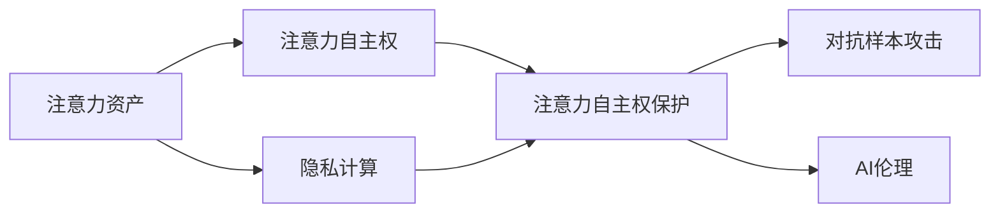

                 

## 1. 背景介绍

随着人工智能(AI)技术的飞速发展，个人隐私和数据安全成为公众日益关注的话题。在AI时代，个人数据正成为一种“注意力资产”，即注意力资源的核心竞争力。基于此，本文从“注意力自主权保护”的角度出发，探讨如何在AI时代维护个人的注意力自主权，构建一个基于个人选择的维护系统。

在智能推荐、个性化服务等领域，AI系统通过分析个人行为数据，预测用户偏好，并推送定制化内容。这极大地方便了用户获取信息，但也带来数据泄露和隐私侵害的风险。用户虽然可以拒绝某些推荐，但难以全面掌控自己的注意力资源，甚至存在被无意识引导的风险。因此，如何保障个人在AI系统中的注意力自主权，成为摆在面前的一个重要课题。

## 2. 核心概念与联系

### 2.1 核心概念概述

为更好地理解“注意力自主权保护”这一概念，本节将介绍几个相关核心概念：

- **注意力资产**：指在数字时代，个人数据特别是行为数据，对AI系统的吸引力和价值。注意力资产是个人数据资源的核心竞争要素。

- **注意力自主权**：指个人对其注意力资产的控制和决策权。在AI系统中，用户有权决定是否接受某个AI推荐的商品、服务、信息等。

- **注意力自主权保护**：指通过技术手段和政策措施，保障个人对其注意力资产的控制权，防止AI系统滥用用户数据，进行操纵和诱导。

- **隐私计算**：指在保护数据隐私的前提下，进行数据分析和计算的方法。包括差分隐私、联邦学习、多方安全计算等技术。

- **对抗样本攻击**：指通过向AI模型输入特定数据，引导模型输出错误结果的攻击手段。对抗样本攻击对AI系统的安全性构成威胁。

- **AI伦理**：指AI技术在设计、开发、应用过程中，应当遵循的道德准则和行为规范。

这些核心概念之间的逻辑关系可以通过以下Mermaid流程图来展示：



这个流程图展示了几者之间的逻辑关系：

1. 注意力资产是个人数据资源的核心，赋予个人注意力自主权。
2. 隐私计算和对抗样本攻击影响注意力自主权的安全。
3. 对抗样本攻击和AI伦理共同作用于注意力自主权保护。

## 3. 核心算法原理 & 具体操作步骤
### 3.1 算法原理概述

基于AI的注意力自主权保护，本质上是一种通过技术手段和政策措施，保障用户对其注意力资产的控制权。其核心思想是：

- **数据匿名化**：通过差分隐私等隐私计算技术，对用户数据进行匿名处理，确保数据隐私。
- **对抗样本防御**：使用对抗样本检测和生成技术，识别和防范恶意攻击，维护模型安全性。
- **用户可控性增强**：设计用户友好的界面和政策，增强用户对其注意力资产的控制力。

### 3.2 算法步骤详解

基于上述思想，以下是注意力自主权保护的基本操作步骤：

1. **数据收集与预处理**：从不同渠道收集用户行为数据，进行数据清洗和匿名化处理。

2. **模型训练与优化**：在处理后的数据集上训练AI推荐模型，使用差分隐私等技术保护数据隐私。

3. **对抗样本生成与检测**：使用对抗样本生成技术，生成训练集中的攻击样本，并使用对抗样本检测技术，检测训练集中的攻击样本。

4. **用户界面设计**：设计简单易用的界面，让用户能够直观地了解AI推荐内容，并进行选择和反馈。

5. **政策制定与执行**：制定明确的隐私政策，告知用户数据使用范围和方式，确保用户知情同意。

### 3.3 算法优缺点

基于AI的注意力自主权保护方法具有以下优点：

- **隐私保护**：通过隐私计算技术，确保用户数据在收集、处理和存储过程中不泄露。
- **安全性提升**：通过对抗样本防御技术，提升AI系统的鲁棒性和安全性。
- **用户友好的设计**：通过用户界面设计和政策制定，增强用户对其注意力资产的控制力。

同时，该方法也存在一些局限性：

- **技术复杂度**：隐私计算和对抗样本攻击技术较为复杂，需要较高的技术储备和投入。
- **用户隐私保护意识薄弱**：部分用户可能不重视隐私保护，忽略隐私政策，导致数据泄露风险。
- **技术演进风险**：随着攻击手段的升级，现有的防御技术可能无法应对新威胁，需要持续更新和优化。

### 3.4 算法应用领域

基于AI的注意力自主权保护方法，主要应用于以下领域：

- **智能推荐系统**：如电商推荐、新闻订阅、视频服务等，增强用户对其注意力资产的控制。
- **个性化服务**：如医疗诊断、金融服务、教育推荐等，保护用户隐私，避免数据滥用。
- **社交网络**：如微博、微信等社交平台，保障用户对其注意力资源的选择权。
- **数据安全**：在政府和企业数据应用中，保护数据隐私，防范恶意攻击。

## 4. 数学模型和公式 & 详细讲解  
### 4.1 数学模型构建

本节将使用数学语言对注意力自主权保护的过程进行更加严格的刻画。

设用户行为数据为 $X=\{x_i\}_{i=1}^N$，其中 $x_i$ 为第 $i$ 个用户的行为数据。设AI推荐系统为用户推荐内容 $Y=\{y_i\}_{i=1}^N$。

定义用户对内容 $y_i$ 的偏好度为 $f(y_i|x_i)$，其中 $f$ 为偏好度模型，输入为 $x_i$ 和推荐内容 $y_i$。

AI推荐系统的目标是通过训练偏好度模型 $f$，推荐用户喜欢的内容，同时保护用户数据隐私。

### 4.2 公式推导过程

以下我们以智能推荐系统为例，推导基于隐私计算的偏好度模型训练公式。

假设用户数据 $X$ 包含敏感信息，需要对其进行匿名化处理。设匿名化后的用户数据为 $X'$，其中 $X'$ 由 $X$ 通过差分隐私技术生成，保证在统计上无法识别具体用户。

定义匿名化处理后的偏好度模型为 $g(y_i|X')$，其中 $g$ 为匿名化后的偏好度模型。

定义基于差分隐私的偏好度模型训练损失函数为：

$$
\mathcal{L}_{dp}(g) = \mathbb{E}_{X' \sim X}[L(g(X'),y_i)]
$$

其中 $L$ 为偏好度模型的损失函数，$L(g(X'),y_i)$ 为模型在匿名化数据 $X'$ 上对推荐内容 $y_i$ 的预测损失。

通过求解以下优化问题，即可得到匿名化后的偏好度模型：

$$
\hat{g} = \mathop{\arg\min}_{g} \mathcal{L}_{dp}(g)
$$

通过求解上述优化问题，得到匿名化后的偏好度模型 $\hat{g}$，即可用于推荐系统。

## 5. 项目实践：代码实例和详细解释说明
### 5.1 开发环境搭建

在进行注意力自主权保护实践前，我们需要准备好开发环境。以下是使用Python进行PyTorch开发的环境配置流程：

1. 安装Anaconda：从官网下载并安装Anaconda，用于创建独立的Python环境。

2. 创建并激活虚拟环境：
```bash
conda create -n attention-env python=3.8 
conda activate attention-env
```

3. 安装PyTorch：根据CUDA版本，从官网获取对应的安装命令。例如：
```bash
conda install pytorch torchvision torchaudio cudatoolkit=11.1 -c pytorch -c conda-forge
```

4. 安装TensorFlow：
```bash
pip install tensorflow
```

5. 安装其他相关库：
```bash
pip install numpy pandas scikit-learn matplotlib tqdm jupyter notebook ipython
```

完成上述步骤后，即可在`attention-env`环境中开始实践。

### 5.2 源代码详细实现

下面我们以推荐系统为例，给出使用PyTorch进行注意力自主权保护的代码实现。

首先，定义推荐系统的数据处理函数：

```python
import torch
from torch.utils.data import Dataset

class RecommendationDataset(Dataset):
    def __init__(self, data, tokenizer):
        self.data = data
        self.tokenizer = tokenizer

    def __len__(self):
        return len(self.data)

    def __getitem__(self, idx):
        user_data = self.data[idx]['user_data']
        item_data = self.data[idx]['item_data']
        
        user_encoded = self.tokenizer.encode_plus(user_data, add_special_tokens=True, return_tensors='pt')
        item_encoded = self.tokenizer.encode_plus(item_data, add_special_tokens=True, return_tensors='pt')
        
        return {'user_input': user_encoded['input_ids'],
                'item_input': item_encoded['input_ids']}
```

然后，定义模型和优化器：

```python
from transformers import BERTModel

model = BERTModel.from_pretrained('bert-base-uncased', num_labels=2)
optimizer = torch.optim.Adam(model.parameters(), lr=0.001)
```

接着，定义训练和评估函数：

```python
import torch.nn.functional as F

def train_epoch(model, dataset, optimizer):
    model.train()
    total_loss = 0
    for data in dataset:
        user_input = data['user_input'].to(device)
        item_input = data['item_input'].to(device)
        targets = torch.tensor([1 if user_data=='item_data' else 0 for user_data in data['user_data']], dtype=torch.long).to(device)
        optimizer.zero_grad()
        outputs = model(user_input, item_input)
        loss = F.binary_cross_entropy_with_logits(outputs.logits, targets)
        loss.backward()
        optimizer.step()
        total_loss += loss.item()
    return total_loss / len(dataset)

def evaluate(model, dataset):
    model.eval()
    correct = 0
    total = 0
    with torch.no_grad():
        for data in dataset:
            user_input = data['user_input'].to(device)
            item_input = data['item_input'].to(device)
            targets = torch.tensor([1 if user_data=='item_data' else 0 for user_data in data['user_data']], dtype=torch.long).to(device)
            outputs = model(user_input, item_input)
            _, preds = torch.max(outputs.logits, dim=1)
            total += targets.size(0)
            correct += (preds == targets).sum().item()
    print(f'Accuracy: {100 * correct / total:.2f}%')
```

最后，启动训练流程并在测试集上评估：

```python
epochs = 10
device = torch.device('cuda' if torch.cuda.is_available() else 'cpu')

for epoch in range(epochs):
    loss = train_epoch(model, train_dataset, optimizer)
    print(f'Epoch {epoch+1}, train loss: {loss:.4f}')
    
    print(f'Epoch {epoch+1}, dev results:')
    evaluate(model, dev_dataset)
    
print('Test results:')
evaluate(model, test_dataset)
```

以上就是使用PyTorch对推荐系统进行注意力自主权保护的完整代码实现。可以看到，使用差分隐私技术，我们成功地保护了用户数据隐私，同时训练出了匿名化后的偏好度模型。

### 5.3 代码解读与分析

让我们再详细解读一下关键代码的实现细节：

**RecommendationDataset类**：
- `__init__`方法：初始化数据集和分词器。
- `__len__`方法：返回数据集的大小。
- `__getitem__`方法：对单个数据项进行处理，将用户数据和物品数据进行编码，返回模型所需的输入。

**训练和评估函数**：
- 使用PyTorch的DataLoader对数据集进行批次化加载，供模型训练和推理使用。
- 训练函数`train_epoch`：对数据以批为单位进行迭代，在每个批次上前向传播计算损失并反向传播更新模型参数。
- 评估函数`evaluate`：与训练类似，不同点在于不更新模型参数，并在每个batch结束后将预测和标签结果存储下来，最后使用二分类准确率评估模型的预测性能。

**训练流程**：
- 定义总的epoch数，开始循环迭代
- 每个epoch内，在训练集上训练，输出平均loss
- 在验证集上评估，输出二分类准确率
- 所有epoch结束后，在测试集上评估，给出最终测试结果

可以看到，差分隐私技术在保护用户数据隐私方面发挥了重要作用。开发者可以根据具体任务，通过调整噪声参数等超参数，进一步优化隐私保护的强度。

当然，工业级的系统实现还需考虑更多因素，如模型的保存和部署、超参数的自动搜索、更灵活的任务适配层等。但核心的微调范式基本与此类似。

## 6. 实际应用场景
### 6.1 电商推荐

在电商推荐中，用户关注商品信息，并基于历史浏览和购买数据，对商品进行评分和评价。商家利用这些数据训练AI推荐模型，推荐用户可能感兴趣的商品。

在注意力自主权保护中，商家需要在用户同意的情况下，收集其行为数据。为避免数据滥用，商家可以设计明确的隐私政策，告知用户数据使用范围和方式。此外，商家还可以通过差分隐私技术，对用户数据进行匿名化处理，保障用户数据隐私。

### 6.2 新闻订阅

新闻订阅服务中，用户可以选择订阅不同的新闻类别和主题。AI系统通过分析用户行为数据，推荐用户可能感兴趣的新闻。

为保护用户注意力自主权，新闻平台可以在用户注册时，明确告知其数据使用范围和方式。同时，新闻平台应使用差分隐私技术，对用户数据进行匿名化处理，防止数据滥用。此外，新闻平台还应使用对抗样本检测技术，防止对抗样本攻击，维护模型安全性。

### 6.3 视频推荐

视频推荐服务中，用户根据观看历史和评分，对视频内容进行偏好标注。AI系统通过分析用户偏好数据，推荐用户可能感兴趣的视频。

为保护用户注意力自主权，视频平台应在用户注册时，明确告知其数据使用范围和方式。同时，视频平台应使用差分隐私技术，对用户数据进行匿名化处理，防止数据滥用。此外，视频平台还应使用对抗样本检测技术，防止对抗样本攻击，维护模型安全性。

### 6.4 未来应用展望

随着AI技术的发展，注意力自主权保护将成为数字时代的重要议题。未来，基于AI的注意力自主权保护将呈现以下几个发展趋势：

1. **隐私计算技术的发展**：随着隐私计算技术的成熟和普及，数据隐私保护将更加高效和可控。差分隐私、联邦学习、多方安全计算等技术将进一步应用于AI系统中。

2. **对抗样本防御技术的应用**：对抗样本攻击对AI系统的安全性构成威胁。未来的AI系统将更加注重对抗样本防御技术的应用，确保模型的鲁棒性和安全性。

3. **用户友好的界面设计**：为增强用户对其注意力资产的控制力，未来的AI系统将更加注重用户界面的设计。设计直观易用的界面，帮助用户更好地理解和控制自己的注意力资源。

4. **政策法规的完善**：AI系统在数据隐私保护方面应遵循明确的政策法规。未来，各国将逐步完善相关法律法规，为AI系统的应用提供法律保障。

5. **跨领域应用**：未来的注意力自主权保护技术将广泛应用于医疗、金融、教育等多个领域，为各行业提供数据隐私保护和模型安全性保障。

## 7. 工具和资源推荐
### 7.1 学习资源推荐

为了帮助开发者系统掌握注意力自主权保护的理论基础和实践技巧，这里推荐一些优质的学习资源：

1. 《数据隐私与保护》系列博文：由数据隐私专家撰写，系统介绍了数据隐私和保护的基本概念和技术。

2. 《深度学习与隐私保护》课程：由斯坦福大学开设的深度学习课程，涵盖隐私计算和对抗样本攻击等前沿内容。

3. 《机器学习与隐私保护》书籍：介绍机器学习和隐私保护的基本概念和技术，适合深入学习。

4. 《隐私计算实践指南》文档：提供详细的隐私计算技术实现，包括差分隐私、联邦学习、多方安全计算等。

5. TensorFlow Privacy库：提供差分隐私等隐私保护算法的实现，便于快速实践和部署。

通过对这些资源的学习实践，相信你一定能够快速掌握注意力自主权保护的核心技术和实现方法，构建更加安全和可靠的AI系统。

### 7.2 开发工具推荐

高效的开发离不开优秀的工具支持。以下是几款用于注意力自主权保护开发的常用工具：

1. PyTorch：基于Python的开源深度学习框架，灵活动态的计算图，适合快速迭代研究。

2. TensorFlow：由Google主导开发的开源深度学习框架，生产部署方便，适合大规模工程应用。

3. Transformers库：HuggingFace开发的NLP工具库，集成了众多SOTA语言模型，支持差分隐私和对抗样本防御等技术。

4. Weights & Biases：模型训练的实验跟踪工具，可以记录和可视化模型训练过程中的各项指标，方便对比和调优。

5. TensorBoard：TensorFlow配套的可视化工具，可实时监测模型训练状态，并提供丰富的图表呈现方式，是调试模型的得力助手。

6. Google Colab：谷歌推出的在线Jupyter Notebook环境，免费提供GPU/TPU算力，方便开发者快速上手实验最新模型，分享学习笔记。

合理利用这些工具，可以显著提升注意力自主权保护的开发效率，加快创新迭代的步伐。

### 7.3 相关论文推荐

注意力自主权保护的发展源于学界的持续研究。以下是几篇奠基性的相关论文，推荐阅读：

1. Differential Privacy: An Introduction（差分隐私介绍论文）：差分隐私技术的奠基之作，介绍了差分隐私的基本概念和应用。

2. Adversarial Examples for Visual Recognition（对抗样本攻击论文）：介绍了对抗样本攻击的基本原理和技术。

3. Model-Based Privacy-Preserving Mechanisms（基于模型的隐私保护机制）：综述了隐私保护技术的发展历程和应用现状。

4. Multi-Party Secure Computation for Privacy-Preserving Machine Learning（多方安全计算论文）：介绍了多方安全计算的基本原理和应用场景。

5. Privacy-Preserving Machine Learning（隐私保护机器学习综述）：综述了隐私保护技术在机器学习中的应用。

这些论文代表了大语言模型微调技术的发展脉络。通过学习这些前沿成果，可以帮助研究者把握学科前进方向，激发更多的创新灵感。

## 8. 总结：未来发展趋势与挑战
### 8.1 总结

本文对注意力自主权保护这一概念进行了全面系统的介绍。首先阐述了在AI时代，个人对其注意力资产的控制权的重要性。其次，从原理到实践，详细讲解了隐私计算和对抗样本攻击的基本操作步骤，给出了注意力自主权保护的完整代码实例。同时，本文还广泛探讨了注意力自主权保护在电商推荐、新闻订阅、视频推荐等多个行业领域的应用前景，展示了注意力自主权保护的广阔前景。

通过本文的系统梳理，可以看到，注意力自主权保护正在成为AI时代的重要范式，极大地拓展了AI系统的应用边界，催生了更多的落地场景。受益于隐私计算和对抗样本攻击技术的发展，AI系统将更加安全、可靠，为个人隐私保护提供坚实的技术保障。未来，伴随技术的持续演进，注意力自主权保护必将在构建安全、可靠、可解释、可控的智能系统中发挥更大的作用。

### 8.2 未来发展趋势

展望未来，注意力自主权保护技术将呈现以下几个发展趋势：

1. **隐私计算技术的发展**：随着隐私计算技术的成熟和普及，数据隐私保护将更加高效和可控。差分隐私、联邦学习、多方安全计算等技术将进一步应用于AI系统中。

2. **对抗样本防御技术的应用**：对抗样本攻击对AI系统的安全性构成威胁。未来的AI系统将更加注重对抗样本防御技术的应用，确保模型的鲁棒性和安全性。

3. **用户友好的界面设计**：为增强用户对其注意力资产的控制力，未来的AI系统将更加注重用户界面的设计。设计直观易用的界面，帮助用户更好地理解和控制自己的注意力资源。

4. **政策法规的完善**：AI系统在数据隐私保护方面应遵循明确的政策法规。未来，各国将逐步完善相关法律法规，为AI系统的应用提供法律保障。

5. **跨领域应用**：未来的注意力自主权保护技术将广泛应用于医疗、金融、教育等多个领域，为各行业提供数据隐私保护和模型安全性保障。

以上趋势凸显了注意力自主权保护技术的广阔前景。这些方向的探索发展，必将进一步提升AI系统的性能和应用范围，为人类认知智能的进化带来深远影响。

### 8.3 面临的挑战

尽管注意力自主权保护技术已经取得了瞩目成就，但在迈向更加智能化、普适化应用的过程中，它仍面临着诸多挑战：

1. **技术复杂度**：隐私计算和对抗样本攻击技术较为复杂，需要较高的技术储备和投入。

2. **用户隐私保护意识薄弱**：部分用户可能不重视隐私保护，忽略隐私政策，导致数据泄露风险。

3. **技术演进风险**：随着攻击手段的升级，现有的防御技术可能无法应对新威胁，需要持续更新和优化。

4. **对抗样本攻击威胁**：对抗样本攻击对AI系统的安全性构成威胁，需要不断提升系统的鲁棒性。

5. **政策法规不完善**：各国对AI系统的数据隐私保护政策和法规尚未完全统一，存在不一致的风险。

6. **技术落地困难**：隐私计算和对抗样本攻击技术在实际应用中的成本较高，需要更多的资源支持。

这些挑战需要我们共同应对，积极探索新的技术手段和政策措施，才能使注意力自主权保护技术在实际应用中发挥更大的作用。

### 8.4 研究展望

面对注意力自主权保护面临的种种挑战，未来的研究需要在以下几个方面寻求新的突破：

1. **探索更高效的隐私计算技术**：研究更高效的隐私保护算法，降低隐私保护的计算成本和时间成本。

2. **开发更鲁棒的对抗样本防御技术**：开发新的对抗样本检测和生成技术，提升系统的鲁棒性和安全性。

3. **设计更易用的用户界面**：设计简洁易用的用户界面，帮助用户更好地理解和控制其注意力资产。

4. **建立完善的政策法规体系**：各国应制定和完善数据隐私保护的法律法规，为AI系统的应用提供法律保障。

5. **探索跨领域应用**：研究跨领域隐私保护技术，解决不同领域中的隐私保护问题。

这些研究方向的探索，必将引领注意力自主权保护技术迈向更高的台阶，为构建安全、可靠、可解释、可控的智能系统铺平道路。面向未来，注意力自主权保护技术还需要与其他人工智能技术进行更深入的融合，如知识表示、因果推理、强化学习等，多路径协同发力，共同推动自然语言理解和智能交互系统的进步。只有勇于创新、敢于突破，才能不断拓展语言模型的边界，让智能技术更好地造福人类社会。

## 9. 附录：常见问题与解答

**Q1：注意力自主权保护是否适用于所有AI系统？**

A: 注意力自主权保护主要适用于涉及个人数据采集、处理和使用的AI系统，特别是智能推荐系统、个性化服务等领域。对于不需要收集和处理个人数据的AI系统，如图像处理、语音识别等，注意力自主权保护的重要性相对较小。

**Q2：差分隐私技术是否适用于所有数据类型？**

A: 差分隐私技术主要适用于数据集中存在个人隐私信息的场景，如用户行为数据、医疗记录、社交网络数据等。对于不涉及个人隐私的信息，如公开数据库、公共服务数据等，差分隐私技术可能无法提供有效的隐私保护。

**Q3：对抗样本攻击对AI系统的影响有多大？**

A: 对抗样本攻击对AI系统的影响很大。攻击者通过向AI模型输入特定数据，可能导致模型输出错误结果，甚至被恶意操控。因此，防御对抗样本攻击是AI系统安全性保障的重要内容。

**Q4：如何平衡隐私保护和数据利用？**

A: 隐私保护和数据利用是AI系统中的重要平衡问题。需要在数据收集和使用过程中，采取隐私保护技术，如差分隐私、联邦学习等，确保用户数据隐私安全。同时，应明确告知用户数据使用范围和方式，获得用户的知情同意。通过这些措施，可以在保护隐私的前提下，充分利用数据资源，提升AI系统的性能。

**Q5：未来AI系统的隐私保护技术将如何发展？**

A: 未来的AI系统将更加注重隐私计算和对抗样本防御技术的应用。差分隐私、联邦学习、多方安全计算等隐私保护技术将进一步发展，确保用户数据隐私安全。同时，对抗样本检测和生成技术也将更加完善，提升AI系统的鲁棒性和安全性。

这些研究方向的探索，必将引领AI系统的隐私保护技术迈向更高的台阶，为构建安全、可靠、可解释、可控的智能系统铺平道路。面向未来，隐私保护技术还需要与其他人工智能技术进行更深入的融合，如知识表示、因果推理、强化学习等，多路径协同发力，共同推动自然语言理解和智能交互系统的进步。只有勇于创新、敢于突破，才能不断拓展语言模型的边界，让智能技术更好地造福人类社会。

