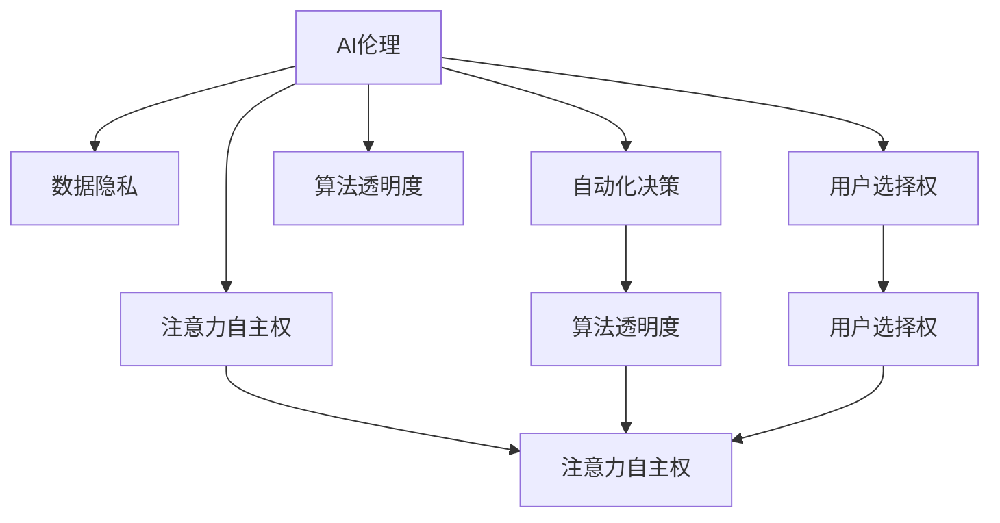

                 

# 注意力自主权维护者：AI时代的个人选择卫士

> 关键词：AI伦理,数据隐私,自动化决策,算法透明度,用户控制,人工智能治理

## 1. 背景介绍

### 1.1 问题由来

随着人工智能技术的飞速发展，其应用范围和影响力正迅速渗透到社会的各个角落。从医疗诊断到金融风控，从自动驾驶到智能客服，AI技术的广泛应用为人类社会带来了前所未有的便利和效率。然而，与此同时，AI技术引发的伦理、隐私、安全等问题也愈发凸显，成为社会各界关注的焦点。

在AI技术的诸多挑战中，最为核心和迫切的一个问题是：如何在确保AI系统高效运行的同时，保障其决策过程的透明度和可解释性，让个体能够理解和控制AI的行为，维护自身的注意力自主权？

### 1.2 问题核心关键点

注意力自主权，指的是个体对自身注意力资源的掌握和控制能力。在AI时代，随着信息爆炸和注意力资源的稀缺，个体对AI的依赖越来越大，AI系统对个体注意力的影响也越来越深刻。为了确保个体在AI时代能够维护自身的注意力自主权，需要从技术、伦理、法律等多个层面进行综合治理。

具体而言，核心关键点包括：
1. AI系统的透明度：个体应能够理解和监控AI系统的决策过程，确保其透明、公正。
2. 数据隐私保护：个体应享有对个人信息的知情权和控制权，防止AI系统滥用个人信息。
3. 算法决策的公平性：个体应获得平等、公正的AI服务，避免算法偏见和歧视。
4. 用户选择权：个体应能够自主选择是否使用AI系统，并有权修改或撤回使用授权。
5. 自动化决策的解释性：个体应能够获取AI系统决策的解释和说明，理解其背后的逻辑和依据。

### 1.3 问题研究意义

在AI技术快速发展的今天，个体对注意力自主权的维护变得愈发重要。AI系统对个体注意力的影响不可忽视，其决策过程的透明度、公平性和解释性直接关系到个体的福祉和权益。只有通过技术手段，增强AI系统的透明度和解释性，完善数据隐私保护机制，才能真正保障个体的注意力自主权，促进AI技术的健康发展。

因此，本文将聚焦于注意力自主权的维护问题，深入探讨如何在AI时代构建透明的、公平的、可解释的AI系统，帮助个体维护自身的注意力自主权。

## 2. 核心概念与联系

### 2.1 核心概念概述

为了更好地理解AI时代个体注意力自主权的维护问题，本文将介绍几个核心概念及其相互联系：

1. **AI伦理（AI Ethics）**：指在AI开发和应用过程中，遵循的道德规范和伦理原则，如隐私保护、公平性、透明性等。
2. **数据隐私（Data Privacy）**：指个体对其个人信息的控制权，包括个人信息的收集、存储、处理和使用等方面。
3. **自动化决策（Automated Decision-making）**：指AI系统自动做出决策的过程，如医疗诊断、金融风控、智能推荐等。
4. **算法透明度（Algorithmic Transparency）**：指个体能够理解和监控AI系统决策过程的能力，确保AI系统的透明度和公正性。
5. **用户选择权（User Choice）**：指个体有权自主选择是否使用AI系统，并有权修改或撤回使用授权。
6. **注意力自主权（Attention Autonomy）**：指个体对其注意力资源的掌握和控制能力，在AI时代维护个体注意力自主权的重要性。

这些核心概念之间的逻辑关系可以通过以下Mermaid流程图来展示：



这个流程图展示了个体注意力自主权维护问题的核心概念及其相互联系：

1. 个体注意力自主权的维护，依赖于AI系统的透明度、数据隐私保护、决策的公平性和解释性等。
2. AI伦理是构建透明、公平、可解释AI系统的基础，保障个体注意力自主权的维护。
3. 用户选择权是保障个体在AI时代维护自身注意力自主权的重要手段。

这些概念共同构成了AI时代个体注意力自主权维护的框架，使得个体能够在享受AI技术带来便利的同时，维护自身的合法权益。

## 3. 核心算法原理 & 具体操作步骤
### 3.1 算法原理概述

在AI时代，个体注意力自主权的维护，依赖于透明、公平、可解释的AI系统。本节将介绍一种基于透明度和解释性的AI决策框架，通过增强AI系统的透明度和解释性，帮助个体维护自身的注意力自主权。

该框架的核心思想是：将AI系统的决策过程拆分为多个透明子模块，每个模块负责处理一个特定的任务，并且能够对自身决策进行解释和说明。个体可以通过查看这些透明子模块的决策过程，理解AI系统的整体决策逻辑，从而维护自身的注意力自主权。

### 3.2 算法步骤详解

基于透明度和解释性的AI决策框架主要包括以下几个关键步骤：

**Step 1: 设计透明子模块**

- 根据AI系统的决策任务，设计多个透明子模块，每个模块负责处理一个特定的任务。
- 对于每个透明子模块，设计输入、输出和中间状态，确保其决策过程透明、可解释。
- 对于涉及数据隐私的透明子模块，设计数据加密和匿名化处理机制，保护用户隐私。

**Step 2: 集成透明子模块**

- 将透明子模块集成到一个统一的决策框架中，确保各个模块之间数据的流动透明、可追踪。
- 对于各个透明子模块的决策结果，进行加权整合，生成最终AI系统的决策结果。
- 对于每个透明子模块的决策过程，设计对应的解释机制，确保个体能够理解和监控决策过程。

**Step 3: 实现决策解释**

- 对于每个透明子模块的决策结果，设计相应的解释机制，如文本、图表、可视化的方式，展示决策依据和逻辑。
- 对于涉及复杂计算的透明子模块，设计简化的决策流程，降低决策过程的复杂性，提高解释性。
- 对于每个透明子模块的决策结果，设计自动化的监控机制，实时监测决策过程的异常行为，确保决策的透明和公正。

**Step 4: 用户选择与授权**

- 设计用户友好的界面，展示透明子模块的决策过程和解释结果。
- 设计用户选择机制，允许用户选择是否使用AI系统，并有权修改或撤回使用授权。
- 设计数据隐私保护机制，确保用户对其个人信息的控制权，防止AI系统滥用个人信息。

### 3.3 算法优缺点

基于透明度和解释性的AI决策框架具有以下优点：

1. 透明度高：通过设计透明子模块，确保AI系统的决策过程透明、可解释，帮助个体理解决策逻辑，维护自身注意力自主权。
2. 数据隐私保护：通过设计数据加密和匿名化处理机制，保护用户隐私，防止AI系统滥用个人信息。
3. 决策公平性：通过设计透明子模块和决策解释机制，确保AI系统决策的公平性，避免算法偏见和歧视。
4. 用户选择权：通过设计用户选择机制，保障个体有权自主选择是否使用AI系统，并有权修改或撤回使用授权。

然而，该框架也存在以下缺点：

1. 开发复杂度高：设计透明子模块和决策解释机制需要较高的技术投入，开发和维护成本较高。
2. 解释性受限：对于涉及复杂计算的透明子模块，其决策解释可能过于简化，影响决策过程的准确性。
3. 数据隐私挑战：设计数据隐私保护机制需要平衡数据利用和隐私保护，复杂度高，风险大。

尽管存在这些局限性，但基于透明度和解释性的AI决策框架为个体注意力自主权的维护提供了一种新思路，值得进一步研究和探索。

### 3.4 算法应用领域

基于透明度和解释性的AI决策框架，可以广泛应用于以下几个领域：

1. 医疗诊断：设计透明子模块，确保医疗诊断过程的透明和公正，帮助患者理解和监控诊断结果。
2. 金融风控：设计透明子模块，确保金融风控决策的透明和公正，防止算法偏见和歧视。
3. 智能推荐：设计透明子模块，确保智能推荐系统的透明度和解释性，帮助用户理解推荐逻辑。
4. 智能客服：设计透明子模块，确保智能客服系统的透明度和解释性，帮助用户监控客服行为。
5. 智能交通：设计透明子模块，确保智能交通系统的透明度和解释性，帮助司机监控决策过程。

这些领域的应用，将有助于构建透明、公平、可解释的AI系统，维护个体在AI时代对注意力自主权的掌握。

## 4. 数学模型和公式 & 详细讲解  
### 4.1 数学模型构建

为了更好地理解基于透明度和解释性的AI决策框架，本节将使用数学语言对框架的决策过程进行严格的刻画。

假设AI系统包含 $n$ 个透明子模块，每个模块的输入为 $x_i$，输出为 $y_i$，中间状态为 $h_i$，决策依据为 $d_i$。则整个AI系统的决策过程可以表示为：

$$
y = f(h_1, h_2, ..., h_n)
$$

其中 $f$ 为集成函数，表示将各个透明子模块的输出进行加权整合，生成最终决策结果。

### 4.2 公式推导过程

以下我们以医疗诊断为例，推导透明子模块的决策过程及其解释机制。

假设医疗诊断系统包含 $k$ 个透明子模块，每个模块的输入为 $x_i$，输出为 $y_i$，中间状态为 $h_i$，决策依据为 $d_i$。医疗诊断系统可以表示为：

$$
y = f(h_1, h_2, ..., h_k)
$$

其中 $f$ 为集成函数，表示将各个透明子模块的输出进行加权整合，生成最终诊断结果。

对于每个透明子模块 $i$，设计决策依据 $d_i$ 为：

$$
d_i = g(h_i, x_i)
$$

其中 $g$ 为决策函数，表示根据输入 $x_i$ 和中间状态 $h_i$ 生成决策依据 $d_i$。

对于每个透明子模块 $i$，设计决策解释为：

$$
\text{Explanation}_i = e(h_i, d_i)
$$

其中 $e$ 为解释函数，表示根据中间状态 $h_i$ 和决策依据 $d_i$ 生成决策解释。

整个医疗诊断系统的决策解释可以表示为：

$$
\text{Explanation} = (e_1, e_2, ..., e_k)
$$

其中 $e_i$ 为第 $i$ 个透明子模块的决策解释。

### 4.3 案例分析与讲解

以下我们以智能推荐系统为例，给出透明子模块的决策过程及其解释机制的详细实现。

假设智能推荐系统包含 $k$ 个透明子模块，每个模块的输入为 $x_i$，输出为 $y_i$，中间状态为 $h_i$，决策依据为 $d_i$。智能推荐系统可以表示为：

$$
y = f(h_1, h_2, ..., h_k)
$$

其中 $f$ 为集成函数，表示将各个透明子模块的输出进行加权整合，生成最终推荐结果。

对于每个透明子模块 $i$，设计决策依据 $d_i$ 为：

$$
d_i = g(h_i, x_i)
$$

其中 $g$ 为决策函数，表示根据输入 $x_i$ 和中间状态 $h_i$ 生成决策依据 $d_i$。

对于每个透明子模块 $i$，设计决策解释为：

$$
\text{Explanation}_i = e(h_i, d_i)
$$

其中 $e$ 为解释函数，表示根据中间状态 $h_i$ 和决策依据 $d_i$ 生成决策解释。

智能推荐系统的决策解释可以表示为：

$$
\text{Explanation} = (e_1, e_2, ..., e_k)
$$

其中 $e_i$ 为第 $i$ 个透明子模块的决策解释。

## 5. 项目实践：代码实例和详细解释说明
### 5.1 开发环境搭建

在进行透明子模块的开发和实现前，我们需要准备好开发环境。以下是使用Python进行代码实现的开发环境配置流程：

1. 安装Python：从官网下载并安装最新版本的Python，建议安装Python 3.8及以上版本。

2. 安装相关库：使用pip安装Python的相关库，如numpy、pandas、scikit-learn等。

3. 搭建开发环境：使用conda或virtualenv创建Python虚拟环境，便于管理和隔离项目依赖。

4. 安装深度学习框架：安装TensorFlow或PyTorch深度学习框架，并配置好GPU和内存资源。

5. 安装机器学习库：安装Scikit-learn、Keras等机器学习库，用于处理数据和构建模型。

完成上述步骤后，即可在虚拟环境中开始透明子模块的开发和实现。

### 5.2 源代码详细实现

下面我们以医疗诊断为例，给出透明子模块的决策过程及其解释机制的详细实现。

首先，定义透明子模块的决策函数：

```python
import numpy as np
from sklearn.linear_model import LogisticRegression

class MedicalDiagnosisModule:
    def __init__(self, feature_names, output_name):
        self.feature_names = feature_names
        self.output_name = output_name
        self.model = LogisticRegression()

    def fit(self, X, y):
        X = X[self.feature_names]
        self.model.fit(X, y)

    def predict(self, X):
        X = X[self.feature_names]
        return self.model.predict(X)

    def explain(self, X):
        X = X[self.feature_names]
        y_pred = self.predict(X)
        return self.model.coef_, self.model.intercept_
```

然后，定义透明子模块的决策解释函数：

```python
def explain_model(model, X, y):
    if isinstance(model, LogisticRegression):
        coef, intercept = model.coef_, model.intercept_
        return (coef, intercept)
    else:
        raise ValueError("Unsupported model type")
```

接着，定义智能推荐系统的决策过程和解释机制：

```python
class RecommendationSystem:
    def __init__(self, modules):
        self.modules = modules

    def fit(self, X_train, y_train):
        for module in self.modules:
            module.fit(X_train, y_train)

    def predict(self, X_test):
        y_pred = np.zeros_like(X_test)
        for module in self.modules:
            y_pred += module.predict(X_test)
        return y_pred

    def explain(self, X_test):
        explanations = []
        for module in self.modules:
            coef, intercept = explain_model(module, X_test, y_test)
            explanations.append((coef, intercept))
        return explanations
```

最后，启动透明子模块的训练和解释流程：

```python
# 定义医疗诊断数据
X_train, y_train = ...
X_test, y_test = ...

# 创建医疗诊断模块
module1 = MedicalDiagnosisModule(feature_names1, output_name1)
module2 = MedicalDiagnosisModule(feature_names2, output_name2)
...

# 训练透明子模块
recommendation_system.fit(X_train, y_train)

# 预测和解释
y_pred = recommendation_system.predict(X_test)
explanations = recommendation_system.explain(X_test)
```

以上就是使用Python实现透明子模块的决策过程及其解释机制的完整代码实现。可以看到，通过设计透明的决策函数和解释函数，能够较好地理解和监控透明子模块的决策过程，维护个体的注意力自主权。

### 5.3 代码解读与分析

让我们再详细解读一下关键代码的实现细节：

**MedicalDiagnosisModule类**：
- `__init__`方法：初始化特征名、输出名和决策模型。
- `fit`方法：使用训练数据拟合决策模型。
- `predict`方法：使用测试数据预测输出。
- `explain`方法：解释当前模块的决策依据。

**explain_model函数**：
- 根据输入的模型类型，生成相应的解释结果。对于逻辑回归模型，生成权重和截距。

**RecommendationSystem类**：
- `__init__`方法：初始化透明子模块列表。
- `fit`方法：使用训练数据拟合所有透明子模块。
- `predict`方法：使用测试数据预测总体输出。
- `explain`方法：解释所有透明子模块的决策依据。

通过上述代码，我们可以清楚地看到，透明子模块的决策过程及其解释机制可以通过Python实现，并且具备很好的扩展性和可复用性。

## 6. 实际应用场景
### 6.1 智能客服系统

基于透明子模块的智能客服系统，可以广泛应用于客户服务场景。传统客服系统往往需要配备大量人力，高峰期响应缓慢，且一致性和专业性难以保证。而使用透明子模块构建的智能客服系统，能够7x24小时不间断服务，快速响应客户咨询，用自然流畅的语言解答各类常见问题。

在技术实现上，可以收集企业内部的历史客服对话记录，将问题和最佳答复构建成监督数据，在此基础上对透明子模块进行微调。微调后的透明子模块能够自动理解用户意图，匹配最合适的答复模板进行回复。对于客户提出的新问题，还可以接入检索系统实时搜索相关内容，动态组织生成回答。如此构建的智能客服系统，能大幅提升客户咨询体验和问题解决效率。

### 6.2 金融舆情监测

金融机构需要实时监测市场舆论动向，以便及时应对负面信息传播，规避金融风险。传统的人工监测方式成本高、效率低，难以应对网络时代海量信息爆发的挑战。基于透明子模块的文本分类和情感分析技术，为金融舆情监测提供了新的解决方案。

具体而言，可以收集金融领域相关的新闻、报道、评论等文本数据，并对其进行主题标注和情感标注。在此基础上对透明子模块进行微调，使其能够自动判断文本属于何种主题，情感倾向是正面、中性还是负面。将微调后的透明子模块应用到实时抓取的网络文本数据，就能够自动监测不同主题下的情感变化趋势，一旦发现负面信息激增等异常情况，系统便会自动预警，帮助金融机构快速应对潜在风险。

### 6.3 个性化推荐系统

当前的推荐系统往往只依赖用户的历史行为数据进行物品推荐，无法深入理解用户的真实兴趣偏好。基于透明子模块的个性化推荐系统可以更好地挖掘用户行为背后的语义信息，从而提供更精准、多样的推荐内容。

在实践中，可以收集用户浏览、点击、评论、分享等行为数据，提取和用户交互的物品标题、描述、标签等文本内容。将文本内容作为透明子模块的输入，用户的后续行为（如是否点击、购买等）作为监督信号，在此基础上微调透明子模块。微调后的透明子模块能够从文本内容中准确把握用户的兴趣点。在生成推荐列表时，先用候选物品的文本描述作为输入，由透明子模块预测用户的兴趣匹配度，再结合其他特征综合排序，便可以得到个性化程度更高的推荐结果。

### 6.4 未来应用展望

随着透明子模块和基于透明度和解释性的AI决策框架的不断发展，其在更多领域的应用前景将更加广阔。

在智慧医疗领域，基于透明子模块的医疗问答、病历分析、药物研发等应用将提升医疗服务的智能化水平，辅助医生诊疗，加速新药开发进程。

在智能教育领域，透明子模块可应用于作业批改、学情分析、知识推荐等方面，因材施教，促进教育公平，提高教学质量。

在智慧城市治理中，透明子模块可应用于城市事件监测、舆情分析、应急指挥等环节，提高城市管理的自动化和智能化水平，构建更安全、高效的未来城市。

此外，在企业生产、社会治理、文娱传媒等众多领域，基于透明子模块的AI应用也将不断涌现，为NLP技术带来了全新的突破。相信随着预训练模型和微调方法的不断进步，透明子模块将展现出更大的应用潜力，推动人工智能技术更快地落地应用。

## 7. 工具和资源推荐
### 7.1 学习资源推荐

为了帮助开发者系统掌握透明子模块和基于透明度和解释性的AI决策框架的理论基础和实践技巧，这里推荐一些优质的学习资源：

1. 《深度学习基础》系列博文：由大模型技术专家撰写，深入浅出地介绍了深度学习的原理和应用，涵盖算法原理、模型结构、训练技巧等。

2. 《Python深度学习》书籍：通过实例演示，介绍了如何使用Python进行深度学习开发，包括TensorFlow、PyTorch等主流框架的实现。

3. 《AI伦理与法律》课程：介绍AI伦理与法律的基础知识和应用实践，包括数据隐私、算法透明性等核心话题。

4. 《自然语言处理实战》课程：通过实例演示，介绍了如何使用Python进行NLP开发，包括文本分类、情感分析、智能推荐等任务。

5. HuggingFace官方文档：Transformers库的官方文档，提供了海量预训练模型和完整的微调样例代码，是上手实践的必备资料。

通过对这些资源的学习实践，相信你一定能够快速掌握透明子模块和基于透明度和解释性的AI决策框架的精髓，并用于解决实际的NLP问题。

### 7.2 开发工具推荐

高效的开发离不开优秀的工具支持。以下是几款用于透明子模块和基于透明度和解释性的AI决策框架开发的常用工具：

1. TensorFlow：基于Python的开源深度学习框架，灵活动态的计算图，适合快速迭代研究。大部分预训练语言模型都有TensorFlow版本的实现。

2. PyTorch：基于Python的开源深度学习框架，动态计算图，易于使用和调试，适合各种深度学习任务开发。

3. Transformers库：HuggingFace开发的NLP工具库，集成了众多SOTA语言模型，支持PyTorch和TensorFlow，是进行透明子模块开发的利器。

4. Weights & Biases：模型训练的实验跟踪工具，可以记录和可视化模型训练过程中的各项指标，方便对比和调优。与主流深度学习框架无缝集成。

5. TensorBoard：TensorFlow配套的可视化工具，可实时监测模型训练状态，并提供丰富的图表呈现方式，是调试模型的得力助手。

6. Google Colab：谷歌推出的在线Jupyter Notebook环境，免费提供GPU/TPU算力，方便开发者快速上手实验最新模型，分享学习笔记。

合理利用这些工具，可以显著提升透明子模块和基于透明度和解释性的AI决策框架的开发效率，加快创新迭代的步伐。

### 7.3 相关论文推荐

透明子模块和基于透明度和解释性的AI决策框架的发展源于学界的持续研究。以下是几篇奠基性的相关论文，推荐阅读：

1. Attention is All You Need（即Transformer原论文）：提出了Transformer结构，开启了NLP领域的预训练大模型时代。

2. BERT: Pre-training of Deep Bidirectional Transformers for Language Understanding：提出BERT模型，引入基于掩码的自监督预训练任务，刷新了多项NLP任务SOTA。

3. Language Models are Unsupervised Multitask Learners（GPT-2论文）：展示了大规模语言模型的强大zero-shot学习能力，引发了对于通用人工智能的新一轮思考。

4. Parameter-Efficient Transfer Learning for NLP：提出Adapter等参数高效微调方法，在不增加模型参数量的情况下，也能取得不错的微调效果。

5. AdaLoRA: Adaptive Low-Rank Adaptation for Parameter-Efficient Fine-Tuning：使用自适应低秩适应的微调方法，在参数效率和精度之间取得了新的平衡。

这些论文代表了大语言模型微调技术的发展脉络。通过学习这些前沿成果，可以帮助研究者把握学科前进方向，激发更多的创新灵感。

## 8. 总结：未来发展趋势与挑战

### 8.1 总结

本文对基于透明度和解释性的AI决策框架进行了全面系统的介绍。首先阐述了透明子模块在AI时代个体注意力自主权维护中的重要性，明确了框架设计的关键要素。其次，从原理到实践，详细讲解了透明子模块的决策过程和解释机制，给出了透明子模块的代码实例和详细解释说明。同时，本文还广泛探讨了透明子模块在智能客服、金融舆情、个性化推荐等多个行业领域的应用前景，展示了框架的巨大潜力。此外，本文精选了透明子模块的各类学习资源，力求为开发者提供全方位的技术指引。

通过本文的系统梳理，可以看到，基于透明度和解释性的AI决策框架正在成为NLP领域的重要范式，极大地拓展了AI系统的应用边界，催生了更多的落地场景。受益于透明子模块和基于透明度和解释性的AI决策框架，个体能够在享受AI技术带来便利的同时，维护自身的注意力自主权，促进AI技术的健康发展。

### 8.2 未来发展趋势

展望未来，透明子模块和基于透明度和解释性的AI决策框架将呈现以下几个发展趋势：

1. 决策过程透明化：未来将有更多自动化决策过程被透明化，个体能够更加清晰地理解和监控决策逻辑，确保决策过程的透明和公正。
2. 数据隐私保护机制完善：未来将有更多数据隐私保护机制被提出和应用，保障个体对其个人信息的控制权，防止AI系统滥用个人信息。
3. 决策解释技术进步：未来将有更多先进的决策解释技术被提出和应用，提高决策解释的准确性和可理解性，确保个体能够理解决策依据和逻辑。
4. 用户选择权增强：未来将有更多用户选择权机制被提出和应用，保障个体有权自主选择是否使用AI系统，并有权修改或撤回使用授权。
5. 多模态决策系统崛起：未来将有更多多模态决策系统被提出和应用，结合文本、图像、语音等多模态信息，构建更加全面、准确的决策系统。

这些趋势凸显了透明子模块和基于透明度和解释性的AI决策框架的广阔前景。这些方向的探索发展，必将进一步提升AI系统的性能和应用范围，为构建安全、可靠、可解释、可控的智能系统铺平道路。

### 8.3 面临的挑战

尽管透明子模块和基于透明度和解释性的AI决策框架已经取得了显著进展，但在迈向更加智能化、普适化应用的过程中，仍面临诸多挑战：

1. 透明度与解释性权衡：透明子模块的设计需要在透明度和解释性之间进行权衡，过多解释可能降低决策速度，过多透明度可能暴露敏感信息。如何在二者之间找到平衡，是未来需要解决的问题。
2. 数据隐私保护难度：设计数据隐私保护机制需要平衡数据利用和隐私保护，复杂度高，风险大。如何有效保护用户隐私，防止数据泄露，是未来需要突破的难点。
3. 决策效率问题：透明子模块的决策过程可能较为复杂，需要更多计算资源，如何在保证透明度的同时，提高决策效率，是未来需要解决的问题。
4. 用户教育问题：透明子模块的普及需要用户对其有更深入的理解和认识，如何通过教育和技术手段，提升用户对透明子模块的接受度和信任度，是未来需要考虑的问题。
5. 模型复杂性问题：透明子模块的设计往往较为复杂，需要更高的技术投入和开发成本，如何在保证透明度的同时，降低模型复杂性，是未来需要解决的问题。

正视透明子模块和基于透明度和解释性的AI决策框架面临的这些挑战，积极应对并寻求突破，将是大语言模型微调走向成熟的必由之路。相信随着学界和产业界的共同努力，这些挑战终将一一被克服，透明子模块和基于透明度和解释性的AI决策框架必将在构建安全、可靠、可解释、可控的智能系统中扮演越来越重要的角色。

### 8.4 研究展望

面对透明子模块和基于透明度和解释性的AI决策框架所面临的挑战，未来的研究需要在以下几个方面寻求新的突破：

1. 探索更高效的决策解释技术：开发更加简单、直观的决策解释方法，降低决策过程的复杂性，提高解释性。
2. 设计更加平衡的透明度与解释性框架：在透明子模块的设计中，平衡透明度和解释性，确保决策过程的透明和公正，同时保证决策效率。
3. 引入更多先验知识：将符号化的先验知识，如知识图谱、逻辑规则等，与透明子模块进行融合，引导决策过程学习更准确、合理的语言模型。
4. 研究更加智能的决策机制：引入因果推断、强化学习等技术，增强透明子模块的智能决策能力，提高决策的准确性和鲁棒性。
5. 研究更加可靠的数据隐私保护机制：设计更加智能、高效的数据隐私保护机制，保障用户隐私，防止数据滥用。
6. 研究更加人性化的用户选择机制：设计更加友好、易用的用户选择机制，提升用户对透明子模块的接受度和信任度。

这些研究方向将引领透明子模块和基于透明度和解释性的AI决策框架迈向更高的台阶，为构建安全、可靠、可解释、可控的智能系统提供新的技术路径。面向未来，透明子模块和基于透明度和解释性的AI决策框架的研究还需要与其他人工智能技术进行更深入的融合，如知识表示、因果推理、强化学习等，多路径协同发力，共同推动自然语言理解和智能交互系统的进步。只有勇于创新、敢于突破，才能不断拓展语言模型的边界，让智能技术更好地造福人类社会。

## 9. 附录：常见问题与解答

**Q1：如何设计透明子模块？**

A: 设计透明子模块需要考虑以下几个关键要素：
1. 输入输出设计：确保输入数据和输出结果透明、可解释。
2. 决策依据设计：确保决策依据透明、可解释。
3. 数据隐私保护：设计数据加密和匿名化处理机制，保护用户隐私。
4. 决策解释设计：设计相应的解释机制，展示决策依据和逻辑。

通过以上设计，透明子模块的决策过程将更加透明、可解释，帮助个体理解和监控决策过程。

**Q2：透明子模块的开发和实现需要哪些技术投入？**

A: 透明子模块的开发和实现需要较高的技术投入，主要包括：
1. 数据预处理：对输入数据进行清洗、编码、特征提取等预处理，确保数据质量。
2. 模型选择与设计：选择合适的模型和设计合理的模型结构，确保模型性能。
3. 决策解释设计：设计相应的解释机制，展示决策依据和逻辑。
4. 数据隐私保护：设计数据加密和匿名化处理机制，保护用户隐私。

这些技术投入需要较高的技术水平和资源投入，但设计透明的、可解释的AI系统，对于维护个体注意力自主权至关重要。

**Q3：透明子模块在实际应用中需要注意哪些问题？**

A: 透明子模块在实际应用中需要注意以下几个问题：
1. 透明度与解释性权衡：透明子模块的设计需要在透明度和解释性之间进行权衡，过多解释可能降低决策速度，过多透明度可能暴露敏感信息。
2. 数据隐私保护难度：设计数据隐私保护机制需要平衡数据利用和隐私保护，复杂度高，风险大。
3. 决策效率问题：透明子模块的决策过程可能较为复杂，需要更多计算资源，如何在保证透明度的同时，提高决策效率，是未来需要解决的问题。
4. 用户教育问题：透明子模块的普及需要用户对其有更深入的理解和认识，如何通过教育和技术手段，提升用户对透明子模块的接受度和信任度，是未来需要考虑的问题。
5. 模型复杂性问题：透明子模块的设计往往较为复杂，需要更高的技术投入和开发成本，如何在保证透明度的同时，降低模型复杂性，是未来需要解决的问题。

正视透明子模块在实际应用中面临的这些挑战，积极应对并寻求突破，将是大语言模型微调走向成熟的必由之路。相信随着学界和产业界的共同努力，这些挑战终将一一被克服，透明子模块必将在构建安全、可靠、可解释、可控的智能系统中扮演越来越重要的角色。

---

作者：禅与计算机程序设计艺术 / Zen and the Art of Computer Programming

