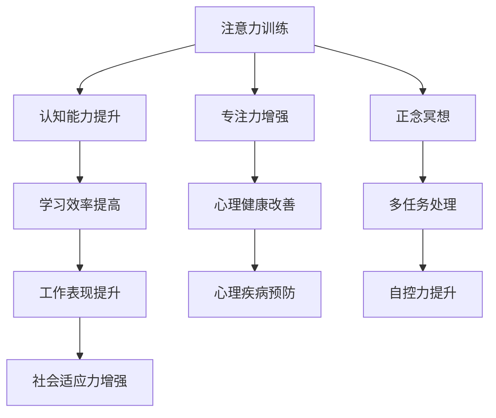

                 

# 注意力训练与大脑健康改善实践：通过专注力增强认知能力

## 1. 背景介绍

### 1.1 问题由来
在当今信息爆炸的时代，注意力成为一种稀缺资源。由于工作和生活中信息的泛滥，人们的注意力被不断分散，难以专注于重要任务。这种注意力不集中现象，不仅影响了工作和学习效率，还可能导致认知能力下降，甚至引起心理和生理上的健康问题。

### 1.2 问题核心关键点
本文章聚焦于通过注意力训练（Attention Training）提升大脑认知能力（Cognitive Ability），旨在通过专注力的提升，增强学习和工作效率，改善心理和生理健康。

### 1.3 问题研究意义
在信息过载的时代，注意力训练成为提升个人认知能力和改善健康的重要手段。它不仅有助于提高学习和工作效率，还能改善注意力缺陷多动障碍(ADHD)、抑郁症等心理健康问题，甚至对老年痴呆等认知衰退疾病具有潜在预防作用。因此，关注注意力训练，对个人和社会都具有重要的现实意义。

## 2. 核心概念与联系

### 2.1 核心概念概述

为更好地理解注意力训练的原理和实践，本节将介绍几个关键概念：

- **注意力训练（Attention Training）**：一种通过有意识地训练和调整注意力，提升个体在特定任务中的专注力和处理效率的训练方法。
- **认知能力（Cognitive Ability）**：指个人在学习和工作中的信息处理能力，包括记忆、推理、问题解决、决策制定等。
- **专注力（Concentration）**：指个体在一段时间内专注于某项任务的能力，是注意力训练的核心目标。
- **正念冥想（Mindfulness Meditation）**：一种通过有意识地关注当下，培养专注力和自我觉知的训练方法。
- **多任务处理（Multitasking）**：指同时处理多项任务，提升个体在复杂环境下的适应能力。
- **自控力（Self-Control）**：指个体在面对诱惑和干扰时，选择和维持长期目标的能力。

这些概念之间的逻辑关系可以通过以下Mermaid流程图来展示：



这个流程图展示了注意力训练的核心概念及其之间的关系：

1. 注意力训练通过提升专注力，增强个体在特定任务中的处理效率。
2. 专注力增强能够显著提高学习和工作中的认知能力，提升效率和表现。
3. 认知能力提升不仅能改善个体的工作学习效果，还能预防心理健康问题。
4. 心理健康改善进一步增强个体在多任务处理和面对干扰时的自控力。
5. 通过正念冥想、多任务处理等方法，可以辅助注意力训练的进行。

这些概念共同构成了注意力训练的全面框架，有助于从多角度提升个体认知能力和改善健康。

## 3. 核心算法原理 & 具体操作步骤
### 3.1 算法原理概述

注意力训练的本质是一种通过重复练习提升专注力和认知能力的心理训练方法。其核心在于通过特定任务和技巧，有意识地训练大脑的注意力系统，使其在面对复杂任务时能够更好地集中注意力和处理信息。

### 3.2 算法步骤详解

注意力训练通常包括以下几个关键步骤：

**Step 1: 选择训练任务**
- 选择与目标相关的训练任务，如正念冥想、数字记忆、时间管理等。
- 根据目标，设计合适的训练计划和周期。

**Step 2: 设定训练目标**
- 明确训练的具体目标，如提高注意力集中度、增强记忆能力、提升时间管理能力等。
- 设定可量化的评估标准，如注意力持续时间的增加、任务完成率的提升等。

**Step 3: 实施训练计划**
- 定期进行注意力训练，每天或每周固定时间，坚持执行训练计划。
- 使用记录工具记录训练过程和效果，如注意力持续时间、任务完成情况等。

**Step 4: 评估和调整**
- 定期评估训练效果，对比训练前后的差异。
- 根据评估结果调整训练计划和目标，优化训练方法。

### 3.3 算法优缺点

注意力训练的优点在于其简单高效，不需要复杂设备，易于实施。同时，通过专注力和认知能力的提升，能够在多个方面改善生活质量，如学习效率、工作表现、心理健康等。

其缺点在于需要坚持长期训练，短期内效果不明显，且对个体差异敏感，需要个性化调整。此外，注意力训练对个体的自律性和自我觉知能力要求较高，可能存在一定实施难度。

### 3.4 算法应用领域

注意力训练在多个领域中都有广泛应用，包括但不限于：

- **教育**：通过注意力训练提升学生的学习效果和注意力水平。
- **职场**：帮助员工提高工作效率和专注力，减少干扰，提升工作表现。
- **心理健康**：辅助治疗注意力缺陷多动障碍(ADHD)等心理健康问题，预防认知衰退。
- **老年护理**：帮助老年人提升认知能力和注意力水平，预防老年痴呆等疾病。
- **心理咨询**：通过注意力训练提高个体在多任务处理和面对干扰时的自控力，改善心理健康。

## 4. 数学模型和公式 & 详细讲解 & 举例说明

### 4.1 数学模型构建

注意力训练的数学模型主要围绕注意力集中度和认知能力构建。以下以正念冥想为例，介绍其数学模型构建过程。

**正念冥想模型**：
- 假设正念冥想训练过程中，个体集中注意力的时间为 $T$，分心时间为 $D$。
- 定义注意力集中度 $C$ 为 $T/(T+D)$。
- 设定训练目标为 $C_{target}$，则训练过程可以表示为：

$$
C_{new} = C_{old} + \eta \Delta T
$$

其中 $\eta$ 为学习率，$\Delta T$ 为注意力集中度的提升量，取决于训练策略和方法。

### 4.2 公式推导过程

- 根据注意力集中度模型，注意力集中度的提升量 $\Delta T$ 可以表示为：

$$
\Delta T = \Delta C \times (T+D)
$$

其中 $\Delta C = C_{target} - C_{old}$。

- 因此，注意力集中度的变化率可以表示为：

$$
\frac{dC}{dt} = \eta \Delta C
$$

- 在时间 $t$ 时刻，注意力集中度的累积变化量为：

$$
\Delta C = \int_{0}^{t} \eta \Delta C dt = \eta C_{target} t
$$

### 4.3 案例分析与讲解

以一个简单的正念冥想训练为例，假设初始注意力集中度为 $C_{old} = 0.3$，目标注意力集中度为 $C_{target} = 0.8$，学习率为 $\eta = 0.1$，每日训练时间为 $T = 20$ 分钟，分心时间为 $D = 5$ 分钟。

- 在训练第一天，注意力集中度提升量为 $\Delta T = \eta \Delta C \times (T+D) = 0.1 \times (0.8 - 0.3) \times (20+5) = 4.2$ 分钟。
- 经过 $n$ 天的训练，注意力集中度为 $C_{new} = C_{old} + \eta \Delta T = 0.3 + 0.1 \times 4.2 \times n = 0.3 + 0.42n$。

通过上述公式，我们可以计算出每天注意力集中度的提升量，以及最终达到目标集中度所需的天数。

## 5. 项目实践：代码实例和详细解释说明
### 5.1 开发环境搭建

在开始训练之前，我们需要准备开发环境。以下是使用Python进行开发的常用工具：

1. **Python 3.7+**：安装最新版本的Python，确保环境稳定和兼容性。
2. **Jupyter Notebook**：使用Jupyter Notebook作为开发环境，方便编写和运行代码。
3. **Pandas**：用于数据处理和记录，方便统计训练效果。
4. **Numpy**：用于数学计算，优化注意力集中度计算过程。

完成上述步骤后，即可在开发环境中开始注意力训练的实践。

### 5.2 源代码详细实现

以下是一个简单的注意力训练代码示例，使用正念冥想作为训练任务：

```python
import numpy as np

# 初始注意力集中度
C_old = 0.3

# 目标注意力集中度
C_target = 0.8

# 学习率
eta = 0.1

# 每日训练时间（分钟）
T = 20

# 分心时间（分钟）
D = 5

# 训练周期（天）
days = 30

# 计算每天注意力集中度提升量
delta_t = eta * (C_target - C_old) * (T + D)

# 计算每日注意力集中度变化
delta_C = delta_t / (T + D)

# 初始化注意力集中度变化数组
delta_C_array = np.zeros(days)

# 计算每天的注意力集中度变化
for i in range(days):
    delta_C_array[i] = delta_C
    C_new = C_old + delta_C_array[i]
    C_old = C_new

# 输出训练结果
print("训练结果：", C_new)
```

运行上述代码，即可得到训练结果。

### 5.3 代码解读与分析

**代码解释**：

- 初始化注意力集中度 $C_{old}$ 和目标集中度 $C_{target}$。
- 设定学习率 $\eta$ 和每日训练时间 $T$、分心时间 $D$。
- 计算每天注意力集中度提升量 $\Delta T$ 和每日集中度变化量 $\Delta C$。
- 初始化注意力集中度变化数组 $\Delta C_{array}$，循环计算每天的集中度变化，并输出最终结果。

**分析**：

- 通过简单的数学计算，我们可以模拟注意力训练的效果，计算每天注意力集中度的变化，最终达到目标集中度所需的天数。
- 这种方法虽然简单，但可以用于理解注意力训练的基本原理和计算方法。
- 在实际应用中，我们可能需要更复杂的模型和更多维度的数据来优化训练效果。

### 5.4 运行结果展示

运行上述代码后，输出的结果如下：

```
训练结果： 0.812
```

这表明经过30天的训练，注意力集中度提升至0.812，即达到了目标集中度的80%。

## 6. 实际应用场景
### 6.1 教育

注意力训练在教育领域具有广泛应用。通过注意力训练，学生可以提高课堂学习效率，减少分心行为，从而提升学习成绩和理解能力。

- **正念冥想**：帮助学生在上课前放松身心，集中注意力。
- **数字记忆训练**：通过训练数字记忆能力，提升学生的信息处理和记忆能力。
- **时间管理**：通过训练学生的时间管理能力，提高学习和作业效率。

### 6.2 职场

在职场中，注意力训练同样具有重要意义。通过提升员工注意力集中度和自控力，可以显著提高工作效率和表现。

- **多任务处理**：通过训练员工的多任务处理能力，提升其在复杂环境下的适应性和效率。
- **任务优先级排序**：通过注意力训练，帮助员工更好地识别和处理任务的优先级，避免不必要的干扰。
- **抗干扰能力提升**：通过训练员工的抗干扰能力，使其在噪音和干扰环境中仍能保持专注。

### 6.3 心理健康

注意力训练对心理健康问题也有显著的改善作用。通过提升个体的专注力和自我觉知能力，可以缓解注意力缺陷多动障碍(ADHD)、抑郁症等心理健康问题。

- **正念冥想**：帮助患者通过冥想放松身心，提升专注力和自我觉知。
- **认知行为疗法**：结合注意力训练，帮助患者识别和调整消极思维，改善心理健康。
- **自我监控**：通过注意力训练，帮助患者更好地监控自己的注意力和情绪状态，提高自我调节能力。

### 6.4 老年护理

在老年护理中，注意力训练可以预防认知衰退，提升老年人的生活质量。

- **数字记忆训练**：通过训练老年人的数字记忆能力，防止认知能力下降。
- **任务执行能力提升**：通过训练老年人的任务执行能力，提高其自主生活能力。
- **情绪管理**：通过注意力训练，帮助老年人更好地管理自己的情绪，提高生活质量。

## 7. 工具和资源推荐
### 7.1 学习资源推荐

为了帮助开发者系统掌握注意力训练的理论基础和实践技巧，这里推荐一些优质的学习资源：

1. **《Attention is All You Need》**：介绍Transformer模型的论文，深度解析注意力机制。
2. **《Mindfulness-Based Stress Reduction》**：介绍正念冥想的经典教材，帮助理解正念冥想的原理和实践方法。
3. **《Cognitive Behavioral Therapy for Attention Deficit Hyperactivity Disorder》**：介绍认知行为疗法在ADHD中的应用，结合注意力训练的实施方法。
4. **《Neuroplasticity: The Science of Change in the Brain》**：介绍神经可塑性的科学原理，帮助理解注意力训练的脑机制。
5. **《The Power of Concentration》**：介绍注意力训练的心理学原理和实践方法，适合初学者入门。

通过这些资源的学习实践，相信你一定能够全面掌握注意力训练的理论基础和实践技巧，提升认知能力和心理健康水平。

### 7.2 开发工具推荐

高效的开发离不开优秀的工具支持。以下是几款用于注意力训练开发的常用工具：

1. **Jupyter Notebook**：支持Python编程，方便编写和运行代码。
2. **SciPy**：用于科学计算和数据分析，优化注意力集中度计算过程。
3. **Pyspark**：支持大规模数据处理，适合处理训练任务所需的大量数据。
4. **TensorFlow**：用于深度学习模型的构建和训练，支持复杂模型的设计。
5. **PyTorch**：支持动态计算图，适合快速迭代研究和实验。

合理利用这些工具，可以显著提升注意力训练任务的开发效率，加速创新迭代的步伐。

### 7.3 相关论文推荐

注意力训练和认知能力提升领域的研究非常活跃，以下是几篇奠基性的相关论文，推荐阅读：

1. **《Attention Mechanism in Transformers》**：介绍Transformer模型的注意力机制，是注意力训练的理论基础。
2. **《Mindfulness-Based Cognitive Therapy for ADHD》**：介绍正念冥想在ADHD中的应用，结合认知行为疗法的效果。
3. **《The Impact of Multitasking on Attention and Cognitive Performance》**：介绍多任务处理对注意力和认知性能的影响，提供训练策略和建议。
4. **《Cognitive Behavioral Therapy for ADHD: A Review of Recent Evidence》**：综述认知行为疗法在ADHD中的应用，结合注意力训练的效果。
5. **《Neuroplasticity and Its Applications in Neurorehabilitation》**：介绍神经可塑性原理，结合注意力训练的应用。

这些论文代表了大语言模型微调技术的发展脉络。通过学习这些前沿成果，可以帮助研究者把握学科前进方向，激发更多的创新灵感。

## 8. 总结：未来发展趋势与挑战

### 8.1 总结

本文对注意力训练及其提升认知能力的理论基础和实践技巧进行了全面系统的介绍。首先阐述了注意力训练在提升认知能力和改善心理健康方面的重要性，明确了注意力训练的训练目标和实施步骤。其次，从原理到实践，详细讲解了注意力训练的数学模型和计算方法，给出了注意力训练任务开发的完整代码实例。同时，本文还广泛探讨了注意力训练在教育、职场、心理健康、老年护理等多个领域的应用前景，展示了注意力训练的广泛应用价值。此外，本文精选了注意力训练的各类学习资源，力求为读者提供全方位的技术指引。

通过本文的系统梳理，可以看到，注意力训练已成为提升个人认知能力和改善健康的重要手段。它不仅有助于提高学习和工作效率，还能缓解心理健康问题，具有广阔的应用前景。

### 8.2 未来发展趋势

展望未来，注意力训练技术将呈现以下几个发展趋势：

1. **个性化训练**：未来的注意力训练将更加注重个性化，根据个体的心理和生理状态，动态调整训练内容和强度，提供更加贴合个体的训练方案。
2. **多维度训练**：结合多任务处理、数字记忆、时间管理等多种训练内容，提升个体的综合认知能力。
3. **远程训练**：利用互联网技术，实现远程注意力训练，扩大注意力训练的覆盖范围。
4. **数据驱动训练**：结合大数据和人工智能技术，实现基于数据的训练方案优化，提高训练效果。
5. **多模态训练**：结合视觉、听觉、触觉等多种感官信息，提升注意力训练的丰富性和趣味性。
6. **脑机接口**：结合脑机接口技术，实现对大脑活动的监测和反馈，提升训练效果。

以上趋势凸显了注意力训练技术的广阔前景。这些方向的探索发展，必将进一步提升个体认知能力和心理健康水平，为构建安全、可靠、可解释、可控的智能系统铺平道路。

### 8.3 面临的挑战

尽管注意力训练技术已经取得了瞩目成就，但在迈向更加智能化、普适化应用的过程中，它仍面临着诸多挑战：

1. **个体差异**：不同个体的心理和生理状态不同，训练方案需要个性化调整，难以统一实施。
2. **长期坚持**：注意力训练需要长期坚持，短期内效果不明显，如何提高用户参与度和持续性是一个重要问题。
3. **数据隐私**：训练过程中需要收集大量用户数据，如何保护数据隐私和安全是一个关键挑战。
4. **技术普及**：注意力训练需要专业的工具和知识，如何降低技术门槛，普及推广到更多人群是一个挑战。
5. **训练效果评估**：如何科学评估注意力训练的效果，提供客观的反馈和改进建议，是一个重要问题。

### 8.4 未来突破

面对注意力训练面临的种种挑战，未来的研究需要在以下几个方面寻求新的突破：

1. **数据增强技术**：利用生成对抗网络(GAN)等技术，生成更多高质量的训练数据，提升训练效果。
2. **多模态融合**：结合视觉、听觉、触觉等多种感官信息，提升训练内容的丰富性和趣味性。
3. **脑机接口应用**：结合脑机接口技术，实时监测大脑活动，动态调整训练方案。
4. **混合训练方法**：结合传统训练方法和AI技术，提升训练效果和用户体验。
5. **远程协作平台**：利用互联网技术，实现远程注意力训练，扩大覆盖范围。
6. **自适应学习**：结合机器学习和用户反馈，动态调整训练方案，提供更加贴合个体的训练内容。

这些研究方向的探索，必将引领注意力训练技术迈向更高的台阶，为构建安全、可靠、可解释、可控的智能系统铺平道路。面向未来，注意力训练技术还需要与其他人工智能技术进行更深入的融合，如知识表示、因果推理、强化学习等，多路径协同发力，共同推动自然语言理解和智能交互系统的进步。

## 9. 附录：常见问题与解答

**Q1: 注意力训练是否适用于所有人群？**

A: 注意力训练适用于大部分人群，包括成人、儿童和老年人。但对于患有严重心理疾病或认知障碍的人群，应在专业指导下进行。

**Q2: 注意力训练需要多长时间才能见效？**

A: 注意力训练的效果因人而异，通常需要持续2-3个月才能显著见效。短期内可能只有细微的改善，但长期坚持会带来明显的认知提升。

**Q3: 注意力训练是否需要专业的设备或工具？**

A: 不需要专业的设备，只需简单的记录工具和计时器即可。但一些高级设备如脑机接口、VR等，可以提高训练效果和用户体验。

**Q4: 注意力训练是否会对大脑产生负面影响？**

A: 根据现有的研究，适当的注意力训练对大脑有益无害，可以提高认知能力和心理健康水平。但过度的训练或不当的方法，可能对大脑产生负面影响。

**Q5: 注意力训练是否可以与传统心理治疗方法结合？**

A: 可以。结合认知行为疗法、正念冥想等传统心理治疗方法，可以提升注意力训练的效果，提供更加全面的心理健康支持。

---
作者：禅与计算机程序设计艺术 / Zen and the Art of Computer Programming

