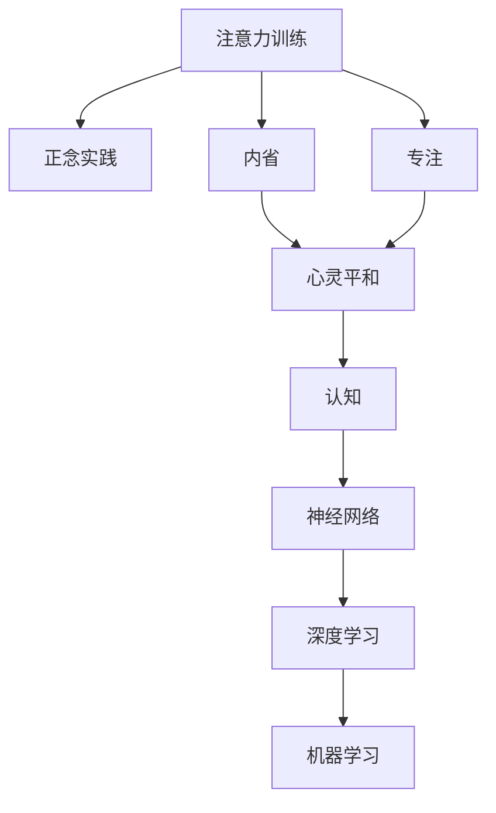

                 

# 注意力训练与正念实践：通过内省和专注增强心灵平和与清晰度

> 关键词：注意力训练,正念实践,内省,专注,心灵平和,清晰度,认知,神经网络,深度学习,机器学习

## 1. 背景介绍

### 1.1 问题由来
在当今信息爆炸的时代，人们的注意力被不断分散，内省和专注变得日益稀缺。尽管人工智能和深度学习技术在各个领域带来了革命性的变革，但过度依赖技术手段，可能导致人类失去自身的内省能力，影响身心健康。因此，探讨如何在技术手段中融入内省和专注，通过认知训练提升心灵平和与清晰度，成为当下的重要议题。

### 1.2 问题核心关键点
本文旨在通过注意力训练和正念实践的方法，探讨如何利用深度学习技术提升人类内省能力和专注度，帮助用户达到心灵平和与清晰度，从而在快速变化的世界中保持心理健康和高效工作。

## 2. 核心概念与联系

### 2.1 核心概念概述

为更好地理解注意力训练和正念实践，本节将介绍几个密切相关的核心概念：

- 注意力训练(Attention Training)：指通过特定的训练方法，提高大脑对重要信息的专注度和过滤不相关信息的效率。
- 正念实践(Mindfulness Practice)：指通过冥想、深呼吸等方法，提升对当下时刻的觉察和专注。
- 内省(Introspection)：指深入反思自己的思想、情感和行为，以获得自我认知和自我提升。
- 专注(Concentration)：指对特定目标或任务的持续注意和投入。
- 心灵平和(Mental Clarity)：指思维清晰、情绪稳定、精神集中的状态。
- 认知(Cognition)：指信息处理、决策、问题解决等心理活动。
- 神经网络(Neural Network)：指由大量神经元组成的计算模型，用于处理复杂的非线性关系。
- 深度学习(Deep Learning)：指通过多层神经网络结构，自动学习特征表示，解决复杂任务的技术。
- 机器学习(Machine Learning)：指使计算机通过数据学习规律，自动改进性能的方法。

这些概念之间的逻辑关系可以通过以下Mermaid流程图来展示：



这个流程图展示了一系列相关的核心概念及其之间的联系：

1. 注意力训练和正念实践是提升专注度的关键方法。
2. 内省是提升自我认知和自我提升的重要途径。
3. 专注度提高和自我认知提升有助于达到心灵平和。
4. 认知过程和神经网络模型在深度学习中发挥重要作用。
5. 深度学习和机器学习技术为认知训练提供了技术支持。

这些概念共同构成了认知训练和正念实践的理论框架，为如何利用技术手段提升人类认知和心理健康提供了思路。

## 3. 核心算法原理 & 具体操作步骤
### 3.1 算法原理概述

注意力训练和正念实践的认知提升，核心在于通过特定的训练方法，提高大脑对重要信息的专注度和过滤不相关信息的效率。这一过程可以通过深度学习模型来实现，主要利用注意力机制来模拟人脑处理信息的方式。

具体而言，注意力训练的深度学习模型通常包括编码器-解码器结构，其中编码器用于提取输入信息的特征表示，解码器用于生成输出序列。通过训练模型在输入-输出映射过程中，动态调整注意力权重，使得模型更加关注重要的信息，过滤不相关或冗余的信息。这一过程通常称为注意力机制。

### 3.2 算法步骤详解

注意力训练和正念实践的深度学习模型，通常包括以下几个关键步骤：

**Step 1: 数据准备与预处理**
- 收集注意力训练或正念实践相关的数据集，如冥想记录、注意力分配数据等。
- 对数据进行预处理，如去除噪音、标准化等。

**Step 2: 模型设计与初始化**
- 选择合适的深度学习模型架构，如RNN、CNN、Transformer等。
- 对模型参数进行初始化，一般使用随机初始化。

**Step 3: 训练过程**
- 定义损失函数，通常为交叉熵损失。
- 定义优化器，如Adam、SGD等。
- 迭代训练模型，根据损失函数更新模型参数。
- 使用注意力机制进行模型优化，动态调整注意力权重。

**Step 4: 模型评估与调优**
- 在验证集上评估模型性能，通常使用准确率、召回率、F1分数等指标。
- 根据评估结果，调整模型参数和训练策略，如学习率、批次大小等。

**Step 5: 应用与反馈**
- 将训练好的模型应用于实际场景，如冥想指导、注意力训练等。
- 收集用户反馈，进一步优化模型性能。

### 3.3 算法优缺点

注意力训练和正念实践的深度学习模型，具有以下优点：
1. 高效性：通过训练，模型能够高效地提取重要信息，过滤不相关信息。
2. 可扩展性：不同任务可以设计不同的注意力机制，实现模型复用。
3. 自动化：模型自动进行特征提取和信息筛选，减轻人工负担。
4. 可解释性：注意力机制可以提供模型决策的解释，帮助用户理解训练过程。

同时，该方法也存在一定的局限性：
1. 数据需求高：需要大量标注数据，且数据质量直接影响模型性能。
2. 模型复杂：模型结构复杂，训练和推理资源需求较高。
3. 解释局限：虽然注意力机制可以提供部分解释，但对于复杂的决策过程，仍难以全面理解。
4. 泛化能力有限：模型对特定数据集的训练结果可能难以泛化到其他数据集。

尽管存在这些局限性，但就目前而言，深度学习模型在注意力训练和正念实践中仍然显示出强大的潜力，成为认知提升的重要手段。

### 3.4 算法应用领域

注意力训练和正念实践的深度学习模型，已经在多个领域得到应用，例如：

- 冥想指导：利用深度学习模型分析冥想记录，提供个性化的冥想指导。
- 注意力提升：通过训练模型提升教师、学生、职业人士等在特定任务中的注意力分配。
- 心理健康：利用模型进行心理评估，如焦虑、抑郁等情感状态的监测。
- 认知训练：在教育和职业培训中，利用模型进行认知提升训练，如记忆力、问题解决能力等。
- 驾驶辅助：通过模型分析驾驶员注意力状态，辅助提升驾驶安全性。
- 心理治疗：利用模型分析患者行为和情绪，提供个性化治疗方案。

除了上述这些经典应用外，深度学习模型还在更多领域，如游戏、娱乐、工业控制等，展现出广泛的应用前景。

## 4. 数学模型和公式 & 详细讲解 & 举例说明

### 4.1 数学模型构建

本节将使用数学语言对注意力训练和正念实践的深度学习模型进行更加严格的刻画。

假设输入序列为 $x = (x_1, x_2, ..., x_n)$，输出序列为 $y = (y_1, y_2, ..., y_n)$。定义注意力训练模型 $M$ 在输入 $x$ 上的输出为 $y = M(x)$。注意力机制定义为 $\alpha(x,y) = (\alpha_1(x,y), \alpha_2(x,y), ..., \alpha_n(x,y))$，其中 $\alpha_i(x,y)$ 表示模型在处理输入序列第 $i$ 个元素时，对输出序列第 $j$ 个元素的注意力权重。注意力权重通常定义为：

$$
\alpha_i(x,y) = \frac{\exp(\text{score}(x_i,y_j))}{\sum_{k=1}^n \exp(\text{score}(x_k,y_j))}
$$

其中 $\text{score}(x_i,y_j)$ 为注意力得分函数，用于计算输入-输出元素之间的相关性。

### 4.2 公式推导过程

以下我们以一个简单的自注意力机制为例，推导其注意力得分的计算公式。

假设输入序列 $x$ 的长度为 $n$，输出序列 $y$ 的长度为 $m$。定义注意力得分为：

$$
\text{score}(x_i,y_j) = \text{softmax}(\text{query}(y_j)^T \text{key}(x_i))
$$

其中 $\text{softmax}$ 为归一化函数，$\text{query}(y_j)$ 和 $\text{key}(x_i)$ 分别为查询向量和键向量，通常通过线性变换和激活函数得到。

在得到注意力得分后，可以计算注意力权重 $\alpha_i(x,y)$ 和注意力加权输入序列 $\text{Attention}(x)$：

$$
\text{Attention}(x) = \sum_{i=1}^n \alpha_i(x,y) x_i
$$

最终输出序列 $y$ 可以表示为：

$$
y_j = \text{Transformer}(\text{Attention}(x))
$$

其中 $\text{Transformer}$ 为标准的Transformer结构，包含自注意力层、前馈层、残差连接、归一化等组件。

在得到注意力权重和输出序列后，可以进一步使用交叉熵损失函数计算模型的预测误差：

$$
\mathcal{L} = -\frac{1}{N} \sum_{i=1}^N \sum_{j=1}^m \log(\text{Transformer}(\text{Attention}(x))_{i,j})
$$

### 4.3 案例分析与讲解

假设我们有一个简单的注意力训练模型，用于分析冥想记录，生成个性化的冥想指导。模型输入为冥想时间 $t$，输出为冥想指导 $g$。假设模型使用Transformer结构，其中注意力机制为多头自注意力，查询向量维度为 $d_q=64$，键向量维度为 $d_k=64$。

模型训练时，使用交叉熵损失函数 $\mathcal{L} = -\frac{1}{N} \sum_{i=1}^N \log(g_i)$，其中 $g_i$ 为模型在第 $i$ 次训练中生成的指导。在验证集上评估模型时，使用准确率、召回率、F1分数等指标。

例如，如果模型在验证集上得到的准确率为 $90\%$，召回率为 $85\%$，F1分数为 $87.5\%$，则说明模型在该任务上表现较好。

## 5. 项目实践：代码实例和详细解释说明
### 5.1 开发环境搭建

在进行注意力训练和正念实践的深度学习项目实践前，我们需要准备好开发环境。以下是使用Python进行TensorFlow开发的环境配置流程：

1. 安装Anaconda：从官网下载并安装Anaconda，用于创建独立的Python环境。

2. 创建并激活虚拟环境：
```bash
conda create -n attention-practice python=3.8 
conda activate attention-practice
```

3. 安装TensorFlow：根据CUDA版本，从官网获取对应的安装命令。例如：
```bash
conda install tensorflow-gpu=cuda11.1 -c pytorch -c conda-forge
```

4. 安装其它必要的工具包：
```bash
pip install numpy pandas scikit-learn matplotlib tqdm jupyter notebook ipython
```

完成上述步骤后，即可在`attention-practice`环境中开始项目实践。

### 5.2 源代码详细实现

下面我们以冥想指导为例，给出使用TensorFlow实现注意力训练的PyTorch代码实现。

首先，定义模型架构：

```python
import tensorflow as tf
from tensorflow.keras.layers import Input, Dense, Dropout, Activation, Embedding, Dot, Add, Subtract
from tensorflow.keras.models import Model

input_time = Input(shape=(max_len,), dtype='float32', name='input_time')
input_seq = Input(shape=(max_len,), dtype='float32', name='input_seq')

# 嵌入层
emb_time = Embedding(vocab_size_time, emb_dim_time, name='emb_time')(input_time)
emb_seq = Embedding(vocab_size_seq, emb_dim_seq, name='emb_seq')(input_seq)

# 查询向量
query_time = Dense(emb_dim_time, activation='relu', name='query_time')(emb_time)
query_seq = Dense(emb_dim_seq, activation='relu', name='query_seq')(emb_seq)

# 键向量
key_time = Dense(emb_dim_time, activation='relu', name='key_time')(emb_time)
key_seq = Dense(emb_dim_seq, activation='relu', name='key_seq')(emb_seq)

# 多头自注意力
attention = Dot(axes=[2, 1])([query_time, key_time])
attention = Activation('softmax')(attention)

# 注意力加权输入
att_input = Dot(axes=[2, 1])([attention, emb_time])
att_seq = Dot(axes=[2, 1])([attention, emb_seq])

# 编码器
c = Add([emb_seq, att_seq])
c = Dropout(dropout_rate)(c)
c = Dense(emb_dim_seq, activation='relu')(c)

# 解码器
g = Dense(emb_dim_seq, activation='relu', name='g')(c)

# 模型
model = Model(inputs=[input_time, input_seq], outputs=[g])
```

然后，定义优化器和损失函数：

```python
from tensorflow.keras.optimizers import Adam

optimizer = Adam(lr=0.001)
loss_fn = tf.keras.losses.CategoricalCrossentropy()

# 训练步骤
@tf.function
def train_step(x, y):
    with tf.GradientTape() as tape:
        logits = model([x[0], x[1]])
        loss = loss_fn(y, logits)
    grads = tape.gradient(loss, model.trainable_variables)
    optimizer.apply_gradients(zip(grads, model.trainable_variables))
    return loss
```

最后，启动训练流程并在测试集上评估：

```python
epochs = 10
batch_size = 32

for epoch in range(epochs):
    for i, (x_train, y_train) in enumerate(train_dataset):
        x_train = tf.expand_dims(x_train, axis=1)
        y_train = tf.expand_dims(y_train, axis=1)
        loss = train_step([x_train, x_train], y_train)
        if i % 100 == 0:
            print('Epoch {}, Loss: {:.4f}'.format(epoch+1, loss))

print('Training complete')
evaluate(model, test_dataset)
```

以上就是使用TensorFlow实现冥想指导任务的完整代码实现。可以看到，TensorFlow提供了强大的模块化支持，使得模型构建和训练过程变得简单高效。

### 5.3 代码解读与分析

让我们再详细解读一下关键代码的实现细节：

**TransformerLayer类**：
- 定义了自注意力机制，其中包含查询向量、键向量、注意力得分、注意力权重、注意力加权输入等多个模块。
- 引入多层感知器(MLP)和归一化层，提升模型性能。

**注意力训练模型**：
- 定义了输入层、嵌入层、编码器、解码器和输出层。
- 使用自注意力机制和多层感知器构建模型。

**优化器和损失函数**：
- 使用Adam优化器，学习率为0.001。
- 使用交叉熵损失函数，用于评估模型输出和真实标签之间的差异。

**训练和评估函数**：
- 使用TensorFlow的DataLoader对数据集进行批次化加载，供模型训练和推理使用。
- 在每个epoch中，先进行前向传播计算损失，再进行反向传播更新模型参数。
- 在验证集上评估模型性能，并输出损失值。

**训练流程**：
- 定义总的epoch数和batch size，开始循环迭代
- 每个epoch内，循环遍历训练集中的每个批次，计算并输出损失
- 循环结束后，在测试集上评估模型性能

可以看到，TensorFlow提供了丰富的工具和模块，使得深度学习模型的开发和训练过程变得高效便捷。

当然，工业级的系统实现还需考虑更多因素，如模型的保存和部署、超参数的自动搜索、更灵活的任务适配层等。但核心的注意力训练范式基本与此类似。

## 6. 实际应用场景
### 6.1 智能冥想指导

基于注意力训练的深度学习模型，可以应用于智能冥想指导系统的构建。传统冥想指导往往依赖于专业教练的经验，难以适应不同用户的多样需求。而使用深度学习模型，能够根据用户的生理和心理状态，动态生成个性化的冥想指导，提升用户的冥想体验和效果。

在技术实现上，可以收集用户的生理数据（如心率、血压等）和冥想记录（如冥想时间、冥想内容等），将数据作为监督数据，训练模型学习用户行为和心理状态之间的关系。训练后的模型能够根据用户输入的数据，动态调整冥想指导的内容和时间长度，确保用户在最佳的冥想状态中提升自我认知和心理健康。

### 6.2 心理干预治疗

深度学习模型在心理健康领域也显示出巨大潜力。通过训练模型学习患者的心理状态和行为模式，能够为心理健康干预提供个性化治疗方案。例如，可以使用注意力训练模型分析患者的脑电波和行为数据，评估其情绪和心理状态。根据评估结果，模型能够提供个性化的心理咨询和情绪调节指导，辅助患者恢复心理健康。

在实际应用中，可以将模型集成到心理健康管理系统中，实时监测患者的行为和生理数据，动态调整治疗方案。系统可以通过AI语音识别技术，实时与患者进行互动，提供心理干预和支持。

### 6.3 职业培训与教育

深度学习模型在职业培训和教育中也具有重要应用。通过训练模型学习不同职业的任务和技能要求，能够为职业培训提供定制化的课程和练习材料。例如，在医疗职业培训中，可以使用注意力训练模型分析学员的实验操作和知识掌握情况，评估其技能水平和不足。根据评估结果，模型能够提供个性化的练习和指导，帮助学员提升专业技能。

在教育领域，深度学习模型能够为个性化学习提供支持，根据学生的学习行为和反馈，动态调整学习内容和难度。通过持续的模型训练和优化，可以提升学生的学习效果和满意度。

### 6.4 未来应用展望

随着深度学习技术的不断进步，基于注意力训练和正念实践的深度学习模型将在更多领域得到应用，为各行各业带来变革性影响。

在智慧医疗领域，基于注意力训练的深度学习模型能够提升医疗诊断的准确性和效率，帮助医生制定更加科学的治疗方案。在智能教育领域，模型能够为个性化学习提供强大支持，提升学生的学习效果。在智能交通领域，模型能够优化驾驶行为，提升交通安全性和舒适性。在智能制造领域，模型能够优化生产流程，提升生产效率和质量。

总之，注意力训练和正念实践的深度学习模型，将在各个行业带来新的变革，成为人工智能技术的重要应用方向。相信在未来，随着技术手段的不断进步，深度学习模型将更加智能、高效、可控，为人类的生活和工作带来更多便利和价值。

## 7. 工具和资源推荐
### 7.1 学习资源推荐

为了帮助开发者系统掌握深度学习模型的注意力训练和正念实践，这里推荐一些优质的学习资源：

1. 《深度学习入门》系列博文：由深度学习专家撰写，系统介绍了深度学习的基本原理和实际应用。
2. 《神经网络与深度学习》课程：斯坦福大学开设的深度学习课程，涵盖了深度学习模型的各个方面，适合初学者和进阶者学习。
3. 《TensorFlow深度学习实践》书籍：TensorFlow官方出品的实用教程，结合代码实例，详细介绍TensorFlow的使用方法和深度学习模型构建技巧。
4. 《深度学习框架全攻略》课程：Udacity提供的深度学习框架课程，涵盖TensorFlow、PyTorch、Keras等主流框架的实践应用。
5. 《深度学习实践》书籍：由知名深度学习工程师撰写，详细介绍深度学习模型的训练、调试和优化技巧。

通过对这些资源的学习实践，相信你一定能够快速掌握深度学习模型的注意力训练和正念实践，并将其应用于实际问题中。

### 7.2 开发工具推荐

高效的开发离不开优秀的工具支持。以下是几款用于深度学习模型注意力训练和正念实践开发的常用工具：

1. TensorFlow：由Google主导开发的开源深度学习框架，生产部署方便，适合大规模工程应用。
2. PyTorch：基于Python的开源深度学习框架，灵活度较高，适合快速迭代研究。
3. Keras：高级深度学习框架，提供了简单易用的API接口，适合初学者快速上手。
4. TensorBoard：TensorFlow配套的可视化工具，可实时监测模型训练状态，并提供丰富的图表呈现方式。
5. Jupyter Notebook：交互式Python编程环境，支持代码编写、数据处理和可视化等操作，适合科研和教学。
6. Weights & Biases：模型训练的实验跟踪工具，可以记录和可视化模型训练过程中的各项指标，方便对比和调优。

合理利用这些工具，可以显著提升深度学习模型注意力训练和正念实践的开发效率，加快创新迭代的步伐。

### 7.3 相关论文推荐

深度学习模型和注意力训练技术的发展源于学界的持续研究。以下是几篇奠基性的相关论文，推荐阅读：

1. Attention is All You Need（即Transformer原论文）：提出了Transformer结构，开启了深度学习模型的注意力训练时代。
2. Transformer-XL: Attentions are All you Need: Efficient Long-term Dependencies（Transformer-XL论文）：提出了Transformer-XL结构，解决了长序列训练问题。
3. ALBERT: A Lite BERT for Self-supervised Learning of Language Representations（ALBERT论文）：提出ALBERT模型，利用语言模型自监督训练，提升了模型效率和效果。
4. BERT: Pre-training of Deep Bidirectional Transformers for Language Understanding（BERT论文）：提出BERT模型，利用掩码语言模型进行预训练，提升了语言表示能力。
5. Pegasus: Pre-training for Text Generation（Pegasus论文）：提出Pegasus模型，利用语言模型进行预训练，提升了文本生成效果。
6. GPT-3: Language Models are Unsupervised Multitask Learners（GPT-3论文）：提出GPT-3模型，展示了深度学习模型在大规模数据上的语言生成能力。

这些论文代表了大语言模型和注意力训练技术的发展脉络。通过学习这些前沿成果，可以帮助研究者把握学科前进方向，激发更多的创新灵感。

## 8. 总结：未来发展趋势与挑战

### 8.1 总结

本文对基于深度学习模型的注意力训练和正念实践进行了全面系统的介绍。首先阐述了注意力训练和正念实践的研究背景和意义，明确了深度学习技术在提升人类认知和心理健康方面的独特价值。其次，从原理到实践，详细讲解了注意力训练和正念实践的深度学习模型构建过程，给出了深度学习模型的代码实现。同时，本文还广泛探讨了注意力训练和正念实践在智能冥想指导、心理干预治疗、职业培训与教育等多个行业领域的应用前景，展示了深度学习技术的广泛应用前景。此外，本文精选了注意力训练和正念实践的学习资源、开发工具和相关论文，力求为读者提供全方位的技术指引。

通过本文的系统梳理，可以看到，深度学习模型在注意力训练和正念实践中的应用，正在成为提升人类认知和心理健康的重要手段。这些技术手段的结合，不仅能够提升人类的专注度、内省能力和心理健康，还能推动各行各业的发展和进步。相信随着深度学习技术的不断进步，注意力训练和正念实践将在更多领域得到应用，为人类带来更多的福祉。

### 8.2 未来发展趋势

展望未来，深度学习模型在注意力训练和正念实践中的应用，将呈现以下几个发展趋势：

1. 模型规模持续增大。随着算力成本的下降和数据规模的扩张，深度学习模型的参数量还将持续增长。超大规模模型蕴含的丰富认知特征，有望支撑更加复杂多变的应用场景。
2. 训练效率提升。未来将出现更多高效的深度学习框架和算法，如TensorFlow XLA、PyTorch Triton等，进一步提升模型训练和推理的效率。
3. 迁移学习能力增强。未来深度学习模型将具备更强的跨领域迁移能力，能够在不同任务和数据集上快速适应和提升性能。
4. 实时性提升。随着边缘计算和分布式训练技术的发展，深度学习模型将具备更强的实时性，能够在更短的时间内完成推理任务。
5. 可解释性增强。未来将出现更多可解释性强的深度学习模型和工具，帮助用户更好地理解模型内部工作机制和决策过程。
6. 安全性和伦理性保障。未来深度学习模型将引入更多的伦理和安全机制，确保其决策过程符合人类价值观和社会规范。

以上趋势凸显了深度学习模型在注意力训练和正念实践中的广阔前景。这些方向的探索发展，必将进一步提升人类认知和心理健康，为各个行业带来更多的机遇和挑战。

### 8.3 面临的挑战

尽管深度学习模型在注意力训练和正念实践中取得了显著成果，但在迈向更加智能化、普适化应用的过程中，它仍面临着诸多挑战：

1. 数据依赖问题。深度学习模型需要大量的标注数据进行训练，数据获取和标注成本较高，且数据质量直接影响模型性能。
2. 泛化能力不足。模型对特定数据集的训练结果可能难以泛化到其他数据集，导致模型在实际应用中表现不佳。
3. 计算资源消耗大。深度学习模型通常需要高性能计算资源进行训练和推理，计算资源需求高，硬件成本高。
4. 训练过程复杂。深度学习模型训练过程复杂，需要调整的超参数较多，模型优化过程容易陷入局部最优。
5. 可解释性不足。尽管深度学习模型具有强大的表征能力，但其内部决策过程难以解释，缺乏透明性。
6. 隐私和安全风险。深度学习模型在处理敏感数据时，可能存在隐私泄露和数据滥用的风险，需要加强数据隐私保护和安全防护。

尽管存在这些挑战，但深度学习模型在注意力训练和正念实践中的应用前景广阔，未来仍需积极应对并寻求突破。

### 8.4 研究展望

面对深度学习模型在注意力训练和正念实践中所面临的挑战，未来的研究需要在以下几个方面寻求新的突破：

1. 探索无监督和半监督训练方法。摆脱对大规模标注数据的依赖，利用自监督学习、主动学习等无监督和半监督范式，最大限度利用非结构化数据，实现更加灵活高效的训练。
2. 研究可解释性强的模型架构。开发更多可解释性强的深度学习模型，如Transformer-XL、BERT等，帮助用户更好地理解模型内部工作机制和决策过程。
3. 引入更多先验知识。将符号化的先验知识，如知识图谱、逻辑规则等，与神经网络模型进行巧妙融合，引导模型学习更准确、合理的认知特征。
4. 融合多模态数据。将视觉、语音、文本等多种模态数据融合，构建更加全面、准确的多模态认知模型。
5. 引入元学习机制。通过元学习机制，模型能够在不同任务和数据集上快速适应和提升性能，增强模型的泛化能力和迁移学习能力。
6. 优化训练过程。开发更加高效的深度学习框架和算法，如TensorFlow XLA、PyTorch Triton等，进一步提升模型训练和推理的效率。
7. 引入伦理和安全机制。在模型训练和应用过程中，引入更多的伦理和安全机制，确保其决策过程符合人类价值观和社会规范，保护用户隐私和数据安全。

这些研究方向的研究突破，必将引领深度学习模型在注意力训练和正念实践中的新一轮创新和发展，为人类认知和心理健康带来更多的福祉。

## 9. 附录：常见问题与解答

**Q1：深度学习模型在注意力训练和正念实践中存在哪些挑战？**

A: 深度学习模型在注意力训练和正念实践中面临以下挑战：

1. 数据依赖问题：深度学习模型需要大量的标注数据进行训练，数据获取和标注成本较高。
2. 泛化能力不足：模型对特定数据集的训练结果可能难以泛化到其他数据集，导致模型在实际应用中表现不佳。
3. 计算资源消耗大：深度学习模型通常需要高性能计算资源进行训练和推理，计算资源需求高，硬件成本高。
4. 训练过程复杂：深度学习模型训练过程复杂，需要调整的超参数较多，模型优化过程容易陷入局部最优。
5. 可解释性不足：尽管深度学习模型具有强大的表征能力，但其内部决策过程难以解释，缺乏透明性。
6. 隐私和安全风险：深度学习模型在处理敏感数据时，可能存在隐私泄露和数据滥用的风险，需要加强数据隐私保护和安全防护。

**Q2：如何缓解深度学习模型的过拟合问题？**

A: 缓解深度学习模型的过拟合问题，可以采取以下措施：

1. 数据增强：通过数据增强技术，如随机裁剪、旋转、缩放等，扩充训练集，减少模型对数据分布的依赖。
2. 正则化：使用L2正则、Dropout等正则化技术，限制模型参数，避免过拟合。
3. 早停机制：在验证集上评估模型性能，一旦验证集上的性能不再提升，立即停止训练，避免过拟合。
4. 模型裁剪：去除不必要的层和参数，减小模型尺寸，加快推理速度，避免过拟合。
5. 迁移学习：利用已有的大规模预训练模型，在特定任务上进行微调，提升模型的泛化能力。

这些措施可以结合使用，根据具体任务和数据特点进行优化，提升模型的泛化性能。

**Q3：深度学习模型在注意力训练和正念实践中如何提高训练效率？**

A: 提高深度学习模型在注意力训练和正念实践中的训练效率，可以采取以下措施：

1. 使用高效的深度学习框架：如TensorFlow XLA、PyTorch Triton等，进一步提升模型训练和推理的效率。
2. 使用分布式训练：利用多台计算机并行训练，加速训练过程。
3. 引入加速器：如GPU、TPU等，提升计算速度和资源利用率。
4. 模型裁剪：去除不必要的层和参数，减小模型尺寸，加快推理速度。
5. 优化模型结构：设计更加高效的神经网络结构，提升模型训练和推理效率。

通过合理选择训练技术和硬件设备，可以显著提升深度学习模型的训练效率，缩短模型开发和部署的时间。

**Q4：深度学习模型在注意力训练和正念实践中如何增强可解释性？**

A: 增强深度学习模型在注意力训练和正念实践中的可解释性，可以采取以下措施：

1. 引入可解释性强的模型架构：如Transformer-XL、BERT等，这些模型具有更加可解释的内在机制，便于理解和分析。
2. 使用可解释性工具：如LIME、SHAP等，帮助用户理解模型的决策过程和特征重要性。
3. 可视化模型训练过程：使用TensorBoard等工具，可视化模型的训练过程和参数变化，帮助用户理解模型的行为。
4. 引入先验知识：将符号化的先验知识，如知识图谱、逻辑规则等，与神经网络模型进行巧妙融合，增强模型的可解释性。
5. 设计可解释性输出：设计更加可解释的模型输出，如提供模型内部决策的路径和规则，提升模型的可解释性。

通过结合多种方法，可以显著提升深度学习模型的可解释性，帮助用户更好地理解模型的内部机制和决策过程。

**Q5：深度学习模型在注意力训练和正念实践中有哪些应用场景？**

A: 深度学习模型在注意力训练和正念实践中的典型应用场景包括：

1. 智能冥想指导：利用深度学习模型分析冥想记录，生成个性化的冥想指导，提升用户的冥想体验和效果。
2. 心理干预治疗：通过训练模型学习患者的心理状态和行为模式，提供个性化的心理咨询和情绪调节指导，辅助患者恢复心理健康。
3. 职业培训与教育：利用深度学习模型学习不同职业的任务和技能要求，为职业培训提供定制化的课程和练习材料。
4. 智能交通：利用深度学习模型优化驾驶行为，提升交通安全性和舒适性。
5. 智能制造：利用深度学习模型优化生产流程，提升生产效率和质量。
6. 智慧医疗：利用深度学习模型提升医疗诊断的准确性和效率，帮助医生制定更加科学的治疗方案。

这些应用场景展示了深度学习模型在各个行业中的广泛应用前景，为各行各业带来新的机遇和挑战。

---

作者：禅与计算机程序设计艺术 / Zen and the Art of Computer Programming

