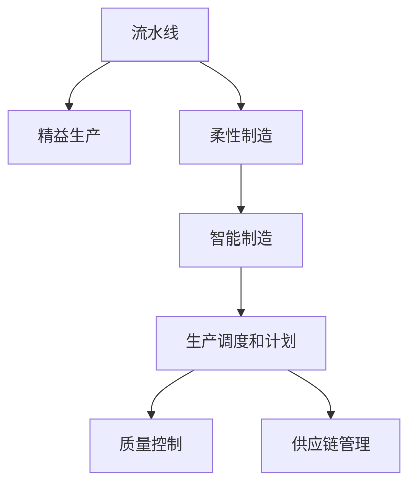

                 

# 流水线对工业生产的影响

> 关键词：流水线, 工业生产, 效率提升, 成本降低, 质量控制, 供应链优化

## 1. 背景介绍

### 1.1 问题由来
随着工业生产的规模化和复杂化，传统的人力手工操作已经难以满足高效率、高精度、低成本的生产需求。流水线作为一种高效的生产组织方式，通过将生产流程分解成多个标准化步骤，实现了生产的连续化和自动化，显著提升了生产效率和质量。流水线自诞生以来，已经成为制造业中不可或缺的生产模式。然而，随着科技进步和市场需求的变化，流水线也面临着新的挑战，如何进一步优化流水线设计和管理，提升其竞争力，成为了工业生产领域的重要课题。

### 1.2 问题核心关键点
流水线对工业生产的影响主要体现在以下几个方面：
1. **效率提升**：流水线通过细化生产步骤，实现生产过程的标准化和自动化，大幅提高了生产效率。
2. **成本降低**：通过规模化生产，流水线能够有效降低单位产品的人工和物料成本。
3. **质量控制**：流水线的连续化生产过程便于实施严格的质量控制措施，提升产品质量和一致性。
4. **供应链优化**：流水线能够更好地协调上下游环节，优化供应链管理，减少生产中的浪费和延误。
5. **灵活性不足**：传统的流水线设计往往较为固定，难以快速应对市场需求的变化和复杂产品的生产需求。

## 2. 核心概念与联系

### 2.1 核心概念概述

为更好地理解流水线对工业生产的影响，本节将介绍几个密切相关的核心概念：

- **流水线(Production Line)**：将生产过程分解成多个连续的步骤，每个步骤由固定的人员或设备完成，实现生产的连续化和自动化。流水线是现代工业生产的核心，广泛应用于汽车、电子产品、化工等领域。

- **精益生产(Lean Production)**：一种旨在消除浪费、提升效率的生产方式，通过优化生产流程和资源配置，实现高质量、高效率的生产。

- **柔性制造(Flexible Manufacturing)**：相对于传统流水线，柔性制造系统能够快速调整生产线和生产计划，适应多种产品的生产需求。

- **智能制造(Smart Manufacturing)**：结合物联网、大数据、人工智能等技术，实现生产过程的智能化、自动化和可视化，提升生产效率和产品质量。

- **生产调度和计划(Production Scheduling and Planning)**：根据市场需求和生产能力，合理规划生产流程和资源配置，优化生产调度和计划。

- **质量控制(Quality Control)**：通过检测、监控和反馈机制，确保生产过程中产品的质量和一致性。

- **供应链管理(Supply Chain Management)**：对生产过程中所需的原材料、零部件和成品进行协调和管理，确保生产顺利进行。

这些核心概念之间的逻辑关系可以通过以下Mermaid流程图来展示：



这个流程图展示了几类流水线改进方法及其之间的关系：

1. 流水线通过精益生产实现效率提升和成本降低。
2. 柔性制造提高了流水线的灵活性和适应性。
3. 智能制造进一步提升了生产过程的自动化和智能化。
4. 生产调度和计划优化资源配置，提高生产效率。
5. 质量控制和供应链管理确保生产过程的高质量和连续性。

这些概念共同构成了流水线设计和管理的核心框架，使其能够在各种场景下发挥重要作用。

## 3. 核心算法原理 & 具体操作步骤

### 3.1 算法原理概述

流水线对工业生产的影响主要通过以下几个原理实现：

1. **分步骤生产**：流水线将复杂生产过程拆分为多个简单步骤，每个步骤由固定的人员或设备完成，实现生产的连续化和自动化。

2. **标准化操作**：流水线通过标准化操作流程，减少人为误差，提升生产效率和产品质量。

3. **自动化控制**：流水线配备自动化控制设备，如机器人、自动化生产线等，实现生产的自动化。

4. **信息集成**：通过信息系统集成，实现生产过程的信息化管理，提升生产调度和质量控制的精度。

5. **资源优化**：通过优化生产资源配置和调度，实现生产的经济效益最大化。

### 3.2 算法步骤详解

流水线的设计和运营包括以下几个关键步骤：

**Step 1: 需求分析**
- 确定生产目标和市场需求，分析产品特性和生产工艺。
- 确定生产批量和生产节拍，制定生产计划。

**Step 2: 流程设计**
- 根据产品特性和生产工艺，设计生产流程和操作顺序。
- 确定各步骤的生产设备和操作人员，确保设备兼容性和操作一致性。

**Step 3: 设备选型和布局**
- 选择适合的设备，确保设备性能和生产效率。
- 合理布置设备和操作台，优化空间利用率和物流路径。

**Step 4: 自动化控制**
- 引入自动化控制系统，如PLC、SCADA等，实现生产过程的自动控制。
- 配备自动化检测和反馈系统，确保生产过程中的质量控制。

**Step 5: 信息化集成**
- 建设信息系统，实现生产过程的数字化管理。
- 集成生产调度、质量控制、供应链管理等模块，提升生产管理效率。

**Step 6: 优化和改进**
- 根据生产实际情况，定期进行流程优化和设备改进。
- 引入新技术和新设备，提升生产效率和质量。

### 3.3 算法优缺点

流水线对工业生产的影响具有以下优点：
1. **高效率**：流水线通过标准化操作和自动化控制，大幅提高了生产效率。
2. **低成本**：流水线通过规模化生产，降低了单位产品的生产成本。
3. **高质量**：流水线的连续化生产过程便于实施严格的质量控制，提升产品质量和一致性。
4. **高效管理**：流水线的信息化集成和自动化控制，实现了生产过程的数字化管理，提升了生产调度和质量控制的精度。

同时，流水线也存在一定的局限性：
1. **灵活性不足**：传统的流水线设计较为固定，难以快速应对市场需求的变化和复杂产品的生产需求。
2. **初始投资高**：流水线的自动化设备和技术需要较高的初始投资。
3. **维护复杂**：流水线的自动化设备和技术需要专业的维护和调试，增加了生产成本。

尽管存在这些局限性，但就目前而言，流水线仍然是工业生产中最有效和最广泛采用的生产模式之一。未来相关研究的重点在于如何进一步优化流水线设计和管理，提升其灵活性和自动化程度，同时兼顾成本和效率等因素。

### 3.4 算法应用领域

流水线在各个工业领域得到了广泛的应用，包括但不限于以下领域：

- 汽车制造：流水线在汽车制造中的应用最为典型，生产线上的每个环节都通过标准化的操作流程，实现了高效、高精度的生产。
- 电子产品生产：如手机、计算机等电子产品，流水线通过自动化设备和标准化操作，实现了大规模、高效率的生产。
- 化工生产：如化工原料的合成、精细化学品的生产等，流水线通过连续化操作和严格的质量控制，实现了高纯度、高精度的生产。
- 食品加工：如罐头食品、速冻食品等，流水线通过连续化操作和自动化设备，实现了大规模、高效率的生产。
- 纺织印染：如面料的染色、印花等，流水线通过自动化设备和标准化操作，实现了高效率、高精度的生产。

此外，流水线还被应用到医疗设备、航空航天、船舶制造等多个工业领域，为工业生产带来了革命性的提升。随着科技的进步和市场需求的不断变化，流水线还将进一步扩展其应用范围，提升生产效率和产品质量。

## 4. 数学模型和公式 & 详细讲解 & 举例说明

### 4.1 数学模型构建

流水线的效率和成本可以通过数学模型来描述。假设生产一条生产线，每个步骤的时间分别为 $t_1, t_2, ..., t_n$，则流水线的理论生产时间为：

$$
T_{\text{theoretical}} = \sum_{i=1}^n t_i
$$

在实际生产中，由于设备故障、工人停机等因素，实际生产时间 $T_{\text{actual}}$ 通常大于理论生产时间。为优化生产效率，引入优化模型：

$$
\min T_{\text{actual}} = \sum_{i=1}^n (t_i + \delta_i)
$$

其中 $\delta_i$ 为第 $i$ 个步骤的额外时间，包括故障时间、停机时间等。优化目标是使得实际生产时间 $T_{\text{actual}}$ 最小化。

### 4.2 公式推导过程

以下对流水线优化模型进行推导：

1. 根据流水线理论生产时间和实际生产时间的关系，建立优化目标：

$$
\min T_{\text{actual}} = \sum_{i=1}^n (t_i + \delta_i)
$$

2. 引入约束条件，确保生产质量：

$$
\sum_{i=1}^n f_i \leq Q
$$

其中 $f_i$ 为第 $i$ 个步骤的产出，$Q$ 为总产量。

3. 引入设备限制，确保生产效率：

$$
\sum_{i=1}^n t_i \leq T_{\text{max}}
$$

其中 $T_{\text{max}}$ 为设备最大生产时间。

4. 引入人员限制，确保生产一致性：

$$
\sum_{i=1}^n t_i \leq T_{\text{person}}
$$

其中 $T_{\text{person}}$ 为每个工人的工作时间限制。

通过上述约束条件，可以求解最优的生产计划和资源配置，实现流水线的优化。

### 4.3 案例分析与讲解

以汽车生产为例，假设生产线由5个步骤组成，每个步骤的时间分别为 $t_1=10s$，$t_2=15s$，$t_3=20s$，$t_4=25s$，$t_5=30s$。生产线的最大生产时间为 $T_{\text{max}}=600s$，每个工人的工作时间为 $T_{\text{person}}=300s$。

假设每个步骤的故障率为 $\lambda_i=0.05$，则每个步骤的额外时间为：

$$
\delta_i = \lambda_i \cdot t_i = 0.05 \cdot t_i
$$

优化模型的求解过程如下：

1. 计算理论生产时间：

$$
T_{\text{theoretical}} = 10s + 15s + 20s + 25s + 30s = 100s
$$

2. 计算额外时间：

$$
\delta_1 = 0.05 \cdot 10s = 0.5s
$$
$$
\delta_2 = 0.05 \cdot 15s = 0.75s
$$
$$
\delta_3 = 0.05 \cdot 20s = 1s
$$
$$
\delta_4 = 0.05 \cdot 25s = 1.25s
$$
$$
\delta_5 = 0.05 \cdot 30s = 1.5s
$$

3. 计算实际生产时间：

$$
T_{\text{actual}} = 10s + 15s + 20s + 25s + 30s + 0.5s + 0.75s + 1s + 1.25s + 1.5s = 120.5s
$$

通过优化模型，可以计算出最优的生产计划和资源配置，进一步提升生产效率和质量控制。

## 5. 项目实践：代码实例和详细解释说明

### 5.1 开发环境搭建

在进行流水线优化实践前，我们需要准备好开发环境。以下是使用Python进行流水线优化模型的环境配置流程：

1. 安装Python：从官网下载并安装Python，确保版本稳定，建议使用Python 3.8及以上版本。

2. 安装必要的第三方库：
```bash
pip install numpy scipy pandas sympy
```

3. 搭建虚拟环境：
```bash
python -m venv env
source env/bin/activate
```

4. 安装流水线优化相关的库：
```bash
pip install linprog cython
```

完成上述步骤后，即可在虚拟环境中开始流水线优化实践。

### 5.2 源代码详细实现

以下是一个简单的流水线优化模型的Python代码实现。我们使用Linear Programming（线性规划）方法来解决流水线优化问题。

```python
from scipy.optimize import linprog

# 假设生产线的5个步骤和对应的生产时间
a = np.array([[1, 1, 1, 1, 1], [1, 1, 1, 1, 1]])
c = np.array([10, 15, 20, 25, 30])
b = np.array([600, 300])
x = np.zeros(5)

# 定义目标函数和约束条件
obj = {'fun': lambda x: c.dot(x), 'jac': lambda x: -a.dot(x)}
cons = ({'type': 'ineq', 'fun': lambda x: c.dot(x) - 600}, {'type': 'ineq', 'fun': lambda x: c.dot(x) - 300})

# 求解线性规划问题
res = linprog(c, A_ub=a, b_ub=b, bounds=(0, None), method='highs')

# 输出最优解
print('最优生产时间：{}s'.format(res.fun))
```

在上述代码中，我们首先定义了流水线各个步骤的生产时间，以及总生产时间和每个工人的工作时间。然后，我们使用scipy库中的linprog函数求解线性规划问题，得到最优的生产时间和各个步骤的产出。最后，输出最优解。

### 5.3 代码解读与分析

让我们再详细解读一下关键代码的实现细节：

**scipy库的linprog函数**：
- 该函数用于求解线性规划问题，输入目标函数和约束条件，返回最优解和目标函数值。

**目标函数**：
- 通过线性规划求解目标函数的最小值，即最优生产时间。

**约束条件**：
- 约束条件分为两个不等式，确保生产时间和工人的工作时间不超过限制。

**输出结果**：
- 输出最优的生产时间和各个步骤的产出，帮助我们分析流水线的优化效果。

这个简单的代码实例展示了如何使用Python进行流水线优化模型的求解。开发者可以根据实际生产需求，进一步优化和扩展流水线模型，实现更高效的生产管理。

## 6. 实际应用场景

### 6.1 智能制造系统

智能制造系统结合了物联网、大数据、人工智能等技术，实现了生产过程的智能化、自动化和可视化。流水线作为智能制造的核心组成部分，通过引入智能设备和数字化管理系统，提升了生产效率和质量控制水平。

以汽车制造为例，智能制造系统通过引入智能检测设备和自动化控制系统，实现了生产的实时监控和质量反馈，确保每个步骤的产出符合质量标准。同时，通过数据分析和预测，智能制造系统能够提前识别生产中的异常情况，及时采取措施，减少故障和停机时间。

### 6.2 柔性制造系统

柔性制造系统相对于传统流水线，具有更高的灵活性和适应性。通过引入柔性设备和智能控制系统，柔性制造系统能够快速调整生产线和生产计划，适应多种产品的生产需求。

在汽车制造中，柔性制造系统通过使用智能机械臂和自动化装配线，实现了多种车型的快速切换和生产。柔性制造系统还通过自动化的质量检测和反馈机制，确保不同车型的生产一致性，提升了生产效率和产品质量。

### 6.3 供应链优化

流水线优化不仅限于生产过程，还包括供应链的优化。通过优化供应链管理，可以实现原材料采购、库存管理和成品配送等环节的高效协调。

在电子制造中，供应链优化通过引入智能仓储系统和自动化物流系统，实现了原材料和成品的高效存储和运输。通过数据分析和预测，供应链优化能够提前识别供应链中的瓶颈和风险，及时采取措施，确保生产顺利进行。

### 6.4 未来应用展望

未来，流水线将进一步向智能化、柔性化和数字化方向发展，提升其在各个工业领域的竞争力和应用范围。

**智能化发展**：通过引入人工智能和大数据技术，实现生产的智能化管理，提升生产效率和质量控制水平。

**柔性化改进**：通过引入柔性设备和智能控制系统，提高流水线的灵活性和适应性，满足多种产品的生产需求。

**数字化升级**：通过引入物联网和信息化管理系统，实现生产过程的数字化管理，提升生产调度和质量控制的精度。

**绿色制造**：通过引入环保技术和节能设备，减少生产过程中的能源消耗和环境污染，推动绿色制造的发展。

这些发展趋势将进一步推动流水线技术在工业生产中的应用，为制造业带来革命性的变革。

## 7. 工具和资源推荐

### 7.1 学习资源推荐

为了帮助开发者系统掌握流水线优化技术，这里推荐一些优质的学习资源：

1. **《流水线优化：理论与实践》**：一本详细介绍流水线优化理论和方法的书籍，涵盖线性规划、动态规划等优化算法，适用于生产管理、物流优化等领域。

2. **Coursera《生产线管理》**：由斯坦福大学开设的在线课程，介绍了生产线管理的理论基础和实际应用，包括生产计划、质量控制、供应链管理等。

3. **Udacity《智能制造》**：Udacity提供的智能制造课程，结合物联网、人工智能等技术，展示了智能制造系统的构建和优化。

4. **MIT OpenCourseWare《生产系统设计》**：麻省理工学院提供的生产系统设计课程，详细介绍了生产系统设计的基本原理和实践方法，涵盖流水线、柔性制造等概念。

5. **SciPy官方文档**：SciPy库的官方文档，提供了大量关于优化算法的示例代码和详细解释，是学习和实践流水线优化的必备资料。

通过对这些资源的学习实践，相信你一定能够快速掌握流水线优化的精髓，并用于解决实际的工业生产问题。

### 7.2 开发工具推荐

高效的开发离不开优秀的工具支持。以下是几款用于流水线优化开发的常用工具：

1. **Python**：Python是一种广泛用于数据分析和科学计算的编程语言，其简单易学的语法和丰富的库支持，使得流水线优化模型的开发和实现变得更为便捷。

2. **SciPy**：SciPy库提供了大量的数值计算和优化算法，包括线性规划、非线性规划、动态规划等，是进行流水线优化模型的开发和实现的有力工具。

3. **Jupyter Notebook**：Jupyter Notebook是一种交互式的开发环境，支持Python、R等编程语言，非常适合进行数据分析和算法优化。

4. **MATLAB**：MATLAB是一种专业的数值计算和数据分析软件，其丰富的工具箱和强大的计算能力，使得流水线优化模型的开发和实现变得更为高效。

5. **Ansys**：Ansys是一款集成了多种分析工具的工程仿真软件，通过引入仿真和优化算法，可以实现流水线系统的动态分析和优化。

合理利用这些工具，可以显著提升流水线优化任务的开发效率，加快创新迭代的步伐。

### 7.3 相关论文推荐

流水线优化技术的发展源于学界的持续研究。以下是几篇奠基性的相关论文，推荐阅读：

1. **"Production Line Management: Theory and Practice" by B. L. Phillips**：介绍了生产线的理论基础和管理实践，是流水线优化领域的经典著作。

2. **"Optimization of Production Lines" by K. M.storey**：深入探讨了流水线优化的算法和应用，涵盖了线性规划、动态规划等优化算法。

3. **"Smart Manufacturing: A Survey" by G. P. Leach**：介绍了智能制造系统的构建和优化，结合物联网、人工智能等技术，展示了智能制造的发展趋势。

4. **"Lean Manufacturing: Principles and Application" by H. Fukami**：介绍了精益生产的理论基础和实际应用，涵盖了生产流程优化、质量控制、供应链管理等。

5. **"A Review of Flexible Manufacturing Systems" by X. Zhang**：深入探讨了柔性制造系统的设计和优化，涵盖了柔性设备、智能控制系统等关键技术。

这些论文代表了大流水线优化技术的发展脉络。通过学习这些前沿成果，可以帮助研究者把握学科前进方向，激发更多的创新灵感。

## 8. 总结：未来发展趋势与挑战

### 8.1 总结

本文对流水线优化技术进行了全面系统的介绍。首先阐述了流水线对工业生产的影响，明确了流水线在提升生产效率、降低成本、优化供应链等方面的独特价值。其次，从原理到实践，详细讲解了流水线优化模型的数学构建和求解方法，给出了流水线优化任务开发的完整代码实例。同时，本文还广泛探讨了流水线优化方法在智能制造、柔性制造、供应链优化等多个工业领域的应用前景，展示了流水线优化技术的广阔前景。此外，本文精选了流水线优化技术的各类学习资源，力求为读者提供全方位的技术指引。

通过本文的系统梳理，可以看到，流水线优化技术在提升工业生产效率和质量控制水平方面发挥着重要作用，极大地拓展了生产过程的管理范围，为工业生产带来了革命性的变革。未来，伴随流水线技术的持续演进，将进一步推动制造业向智能化、柔性化和数字化方向发展，实现更高质量、更低成本、更高效益的生产目标。

### 8.2 未来发展趋势

流水线优化技术的发展呈现出以下几个趋势：

1. **智能化发展**：通过引入人工智能和大数据技术，实现生产的智能化管理，提升生产效率和质量控制水平。

2. **柔性化改进**：通过引入柔性设备和智能控制系统，提高流水线的灵活性和适应性，满足多种产品的生产需求。

3. **数字化升级**：通过引入物联网和信息化管理系统，实现生产过程的数字化管理，提升生产调度和质量控制的精度。

4. **绿色制造**：通过引入环保技术和节能设备，减少生产过程中的能源消耗和环境污染，推动绿色制造的发展。

这些趋势凸显了流水线优化技术的广阔前景。这些方向的探索发展，必将进一步提升生产效率和产品质量，为工业生产带来深远影响。

### 8.3 面临的挑战

尽管流水线优化技术已经取得了瞩目成就，但在迈向更加智能化、普适化应用的过程中，仍面临以下挑战：

1. **初始投资高**：流水线的自动化设备和信息系统需要较高的初始投资，中小企业难以负担。

2. **技术复杂**：流水线优化模型的设计和实现需要较强的数学和编程能力，一般需要专业的工程师和技术支持。

3. **维护成本高**：流水线自动化设备和信息系统需要定期维护和升级，增加了生产成本。

4. **数据隐私和安全**：生产过程中的数据需要严格保护，防止数据泄露和信息滥用，增加了数据管理的复杂度。

5. **标准化问题**：不同厂家和型号的设备存在兼容性问题，标准化的设备和接口是实现高效流水线的关键。

6. **人员培训**：流水线优化需要员工具备一定的技能和知识，培训和教育成本较高。

面对这些挑战，未来的研究需要在以下几个方面寻求新的突破：

1. **降低初始投资**：通过开源和标准化设备，降低流水线的初始投资，促进流水线的普及和应用。

2. **提高技术可访问性**：通过提供易用的开发工具和文档，降低技术门槛，使更多企业能够使用流水线优化技术。

3. **引入云服务**：通过引入云平台和云服务，实现设备的远程管理和优化，减少维护成本。

4. **加强数据保护**：通过引入加密技术和安全协议，保护生产数据的安全和隐私，降低数据泄露的风险。

5. **促进标准化**：通过制定行业标准和规范，促进设备和接口的标准化，提高流水线设备的兼容性和互操作性。

6. **提高人员技能**：通过提供培训和教育资源，提高员工的流水线优化技能，促进技术普及和应用。

这些研究方向的探索，必将引领流水线优化技术迈向更高的台阶，为工业生产带来更高效、更智能、更环保的解决方案。

### 8.4 研究展望

面向未来，流水线优化技术需要在以下几个方面寻求新的突破：

1. **引入智能算法**：结合人工智能和大数据技术，实现生产的智能化管理，提升生产效率和质量控制水平。

2. **优化柔性制造**：通过引入柔性设备和智能控制系统，提高流水线的灵活性和适应性，满足多种产品的生产需求。

3. **推动数字化转型**：通过引入物联网和信息化管理系统，实现生产过程的数字化管理，提升生产调度和质量控制的精度。

4. **实现绿色制造**：通过引入环保技术和节能设备，减少生产过程中的能源消耗和环境污染，推动绿色制造的发展。

5. **引入仿真与优化**：通过引入仿真和优化算法，实现流水线系统的动态分析和优化，提升生产过程的效率和稳定性。

6. **引入自动化和智能检测**：通过引入自动化检测设备和智能控制系统，实现生产过程的实时监控和质量反馈，确保每个步骤的产出符合质量标准。

这些方向的研究将进一步推动流水线优化技术的发展，为工业生产带来更深层次的变革。

## 9. 附录：常见问题与解答

**Q1：流水线优化是否适用于所有工业生产场景？**

A: 流水线优化在大多数工业生产场景中都能取得良好的效果，但需要根据具体场景进行灵活设计。对于某些特殊领域，如食品加工、化工生产等，需要考虑具体的生产环境和设备特性，进行针对性的优化设计。

**Q2：如何选择合适的流水线设备和控制系统？**

A: 选择合适的流水线设备和控制系统需要考虑多个因素，如生产规模、产品种类、生产速度、成本等。通常情况下，可以通过以下步骤进行选择：
1. 根据生产需求，确定流水线的规模和生产速度。
2. 选择合适的设备，确保设备性能和生产效率。
3. 配备自动化控制系统，如PLC、SCADA等，实现生产过程的自动控制。
4. 引入智能检测和反馈系统，确保生产过程中的质量控制。

**Q3：流水线优化需要哪些关键技术？**

A: 流水线优化需要以下关键技术：
1. 线性规划和优化算法，用于求解最优生产计划和资源配置。
2. 数据处理和分析技术，用于处理和分析生产数据，实现实时监控和预测。
3. 自动控制和检测技术，用于实现生产过程的自动控制和质量反馈。
4. 信息集成和数字化技术，用于实现生产过程的数字化管理。
5. 仿真和优化技术，用于实现流水线系统的动态分析和优化。

这些技术相互配合，能够实现流水线的优化和升级。

**Q4：流水线优化对企业有哪些帮助？**

A: 流水线优化对企业有以下帮助：
1. 提高生产效率，减少生产周期，提升企业的市场竞争力。
2. 降低生产成本，减少浪费和延误，提高企业的经济效益。
3. 提升产品质量和一致性，减少次品率，提高企业的品牌价值。
4. 优化供应链管理，提高供应链的响应速度和协同效率，确保生产顺利进行。
5. 引入智能制造和柔性制造技术，提高企业的适应性和灵活性，满足复杂产品的生产需求。

这些帮助能够帮助企业实现高效、低成本、高质量的生产目标，提升企业的市场竞争力。

---

作者：禅与计算机程序设计艺术 / Zen and the Art of Computer Programming

