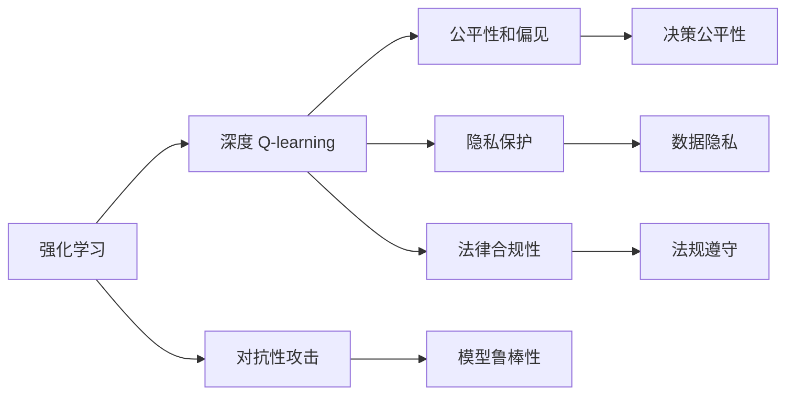

                 

# 深度 Q-learning：未来人工智能法规的挑战

## 1. 背景介绍

### 1.1 问题由来
随着深度学习技术的飞速发展，人工智能（AI）在各个领域的应用已经取得了显著的进展。特别是在强化学习（Reinforcement Learning, RL）领域，深度 Q-learning 算法在智能决策、机器人控制、游戏策略等领域取得了惊人的成果。然而，这些算法往往在追求高性能的同时，也带来了诸多伦理、法律和安全问题。

当前，深度 Q-learning 算法在诸多领域展现出强大的潜力，但也面临着如下几个方面的挑战：

1. **决策过程的透明性和可解释性**：深度 Q-learning 模型通常被视作"黑盒"系统，难以解释其决策过程，导致在一些高风险的应用场景中，难以获取公众和监管机构的信任。
2. **对抗性攻击**：深度 Q-learning 模型容易受到对抗性攻击，即对手通过微小的输入扰动，使得模型输出产生大的偏差，威胁模型的安全性和可靠性。
3. **公平性和偏见**：深度 Q-learning 模型可能会学习到数据中的偏见，导致不公平的决策，引发社会和法律问题。
4. **隐私保护**：深度 Q-learning 模型在训练和推理过程中，可能涉及大量敏感的个人数据，如何保护隐私安全，避免数据滥用，是一个亟待解决的问题。
5. **法律合规性**：在诸如金融、医疗等重要领域，深度 Q-learning 模型的应用需遵守严格的法规和标准，如何在模型设计和使用中遵守相关法规，是一个复杂且具有挑战性的问题。

这些挑战不仅会影响到深度 Q-learning 技术的发展，还会对社会和经济产生深远影响。因此，在继续推进深度 Q-learning 技术发展的同时，也需要高度重视这些问题，并制定相应的法规和策略来解决。

## 2. 核心概念与联系

### 2.1 核心概念概述

为更深入理解深度 Q-learning 算法的核心概念和原理，本节将对相关关键概念进行详细说明，并给出其间的联系：

- **强化学习（Reinforcement Learning, RL）**：一种通过智能体（agent）与环境互动，不断优化策略以获得最大奖励的学习范式。其中，Q-learning 算法是强化学习的一种经典方法。
- **深度 Q-learning**：在 Q-learning 基础上，利用深度神经网络对状态-动作值函数（Q-function）进行近似，实现对复杂决策问题的建模。
- **对抗性攻击**：指通过微小扰动输入，使得模型输出产生较大的变化，从而攻击模型的鲁棒性和安全性。
- **公平性和偏见**：指模型输出是否公平、无偏见，尤其是在少数群体和敏感领域的应用。
- **隐私保护**：指保护用户数据隐私，防止数据泄露和滥用。
- **法律合规性**：指模型在设计和应用过程中，需遵守相关法律和法规，如数据保护法、知识产权法等。

这些概念之间的联系可以通过以下 Mermaid 流程图来展示：



这个流程图展示了强化学习、深度 Q-learning 算法以及其在对抗性攻击、公平性和偏见、隐私保护和法律合规性方面的应用与影响。

## 3. 核心算法原理 & 具体操作步骤
### 3.1 算法原理概述

深度 Q-learning 算法是一种结合深度神经网络和强化学习的算法。其核心思想是通过不断与环境交互，利用 Q-learning 更新 Q-value 函数，并利用深度神经网络进行参数化。该算法可以用于解决复杂的决策问题，如图象识别、游戏策略等。

其基本原理如下：

- **状态-动作值函数（Q-value）**：定义状态-动作值函数 $Q(s,a)$，表示在状态 $s$ 下采取动作 $a$ 的价值。其更新方程为：

  $$
  Q(s,a) \leftarrow Q(s,a) + \alpha [r + \gamma \max_a Q(s',a') - Q(s,a)]
  $$

  其中 $\alpha$ 为学习率，$r$ 为即时奖励，$s'$ 和 $a'$ 为下一步状态和动作，$\gamma$ 为折扣因子。

- **深度神经网络**：利用深度神经网络对状态-动作值函数进行近似，从而适应高维、复杂的状态空间。

### 3.2 算法步骤详解

深度 Q-learning 算法的具体操作步骤包括：

1. **初始化**：设置初始参数、学习率和折扣因子等超参数，随机初始化 Q-value 函数。
2. **状态采样**：随机选择一个状态 $s$，并从该状态出发执行若干动作，记录状态序列 $s_1, s_2, ..., s_T$ 和对应的动作序列 $a_1, a_2, ..., a_T$。
3. **状态更新**：对状态序列 $s_1, s_2, ..., s_T$ 进行价值更新，计算即时奖励 $r_1, r_2, ..., r_T$ 和 Q-value 函数的近似值。
4. **动作选择**：在当前状态 $s_t$ 下，通过神经网络预测可能的动作值，选择具有最高 Q-value 的动作 $a_t$。
5. **参数更新**：利用梯度下降等优化算法，更新神经网络参数以逼近真实的 Q-value 函数。
6. **重复**：重复步骤 2-5，直至收敛或达到预设的迭代次数。

### 3.3 算法优缺点

深度 Q-learning 算法在处理复杂决策问题方面具有以下优点：

- **高效性**：深度神经网络可以对高维、复杂状态进行近似，适应性强，能够处理大规模、复杂的问题。
- **泛化能力**：在充分训练后，深度 Q-learning 模型能够对未知数据进行泛化，具备较强的适应能力。
- **可解释性差**：由于深度神经网络的复杂性，其决策过程难以解释，可能导致模型缺乏透明度和可信度。
- **对抗性脆弱**：深度神经网络对输入的微小扰动敏感，易受对抗性攻击。
- **数据需求高**：深度 Q-learning 模型需要大量的标注数据进行训练，数据收集和标注成本较高。

### 3.4 算法应用领域

深度 Q-learning 算法在诸多领域展现出强大的应用潜力：

- **游戏策略**：在游戏领域，深度 Q-learning 可以用于自动生成游戏策略，提升游戏性能。
- **机器人控制**：在机器人控制领域，深度 Q-learning 可以用于生成最优控制策略，实现自主导航和操作。
- **金融交易**：在金融领域，深度 Q-learning 可以用于优化投资策略，提升投资收益。
- **医疗诊断**：在医疗领域，深度 Q-learning 可以用于智能诊断，提供辅助决策。
- **自动驾驶**：在自动驾驶领域，深度 Q-learning 可以用于生成最优驾驶策略，提升行驶安全。

## 4. 数学模型和公式 & 详细讲解
### 4.1 数学模型构建

深度 Q-learning 的数学模型构建包括状态-动作值函数的定义和深度神经网络的设计。

设状态空间为 $S$，动作空间为 $A$，即时奖励为 $r$，折扣因子为 $\gamma$，则状态-动作值函数 $Q(s,a)$ 可表示为：

$$
Q(s,a) = \mathbb{E}[r + \gamma \max_a Q(s',a')] = \alpha(r + \gamma \max_a Q(s',a') - Q(s,a))
$$

其中 $\alpha$ 为学习率。

深度神经网络通过对状态-动作值函数进行参数化，以实现对复杂决策问题的建模。设神经网络具有 $h$ 层隐藏层，输出层包含 $|A|$ 个神经元，每个神经元对应一个动作的 Q-value 值。则深度神经网络的 Q-value 函数可表示为：

$$
Q(s,a) = W_hW_{h-1}\dots W_1 \cdot s
$$

其中 $W_i$ 为第 $i$ 层的权重矩阵。

### 4.2 公式推导过程

深度 Q-learning 的公式推导过程主要基于 Q-learning 的原理。在 Q-learning 中，状态-动作值函数的更新方程为：

$$
Q(s,a) \leftarrow Q(s,a) + \alpha [r + \gamma \max_a Q(s',a') - Q(s,a)]
$$

将其应用于深度神经网络中，则有：

$$
Q(s,a) = W_hW_{h-1}\dots W_1 \cdot s
$$

设 $s_t$ 为当前状态，$a_t$ 为当前动作，$s_{t+1}$ 为下一步状态，则有：

$$
Q(s_t,a_t) \leftarrow Q(s_t,a_t) + \alpha [r_{t+1} + \gamma \max_a Q(s_{t+1},a') - Q(s_t,a_t)]
$$

其中 $r_{t+1}$ 为即时奖励，$a'$ 为在状态 $s_{t+1}$ 下，动作 $a'$ 的 Q-value 值。

### 4.3 案例分析与讲解

以游戏策略为例，分析深度 Q-learning 的应用。

设游戏状态空间为 $S$，动作空间为 $A$，即时奖励为 $r$，折扣因子为 $\gamma$。则深度 Q-learning 的优化目标为：

$$
\min_{\theta} \mathbb{E}[Q(s_1,a_1) - r_1 - \gamma Q(s_2,a_2)]
$$

其中 $s_1$ 为初始状态，$a_1$ 为初始动作，$s_2$ 为下一步状态，$a_2$ 为下一步动作。

利用深度神经网络对状态-动作值函数进行参数化，得到：

$$
Q(s,a) = W_hW_{h-1}\dots W_1 \cdot s
$$

在训练过程中，通过不断与环境交互，利用梯度下降等优化算法更新神经网络参数，从而逼近真实的 Q-value 函数。最终得到最优策略，使深度 Q-learning 模型能够在游戏中自动生成最优策略。

## 5. 项目实践：代码实例和详细解释说明
### 5.1 开发环境搭建

在进行深度 Q-learning 实践前，我们需要准备好开发环境。以下是使用 Python 进行 TensorFlow 开发的环境配置流程：

1. 安装 Anaconda：从官网下载并安装 Anaconda，用于创建独立的 Python 环境。

2. 创建并激活虚拟环境：
```bash
conda create -n tf-env python=3.8 
conda activate tf-env
```

3. 安装 TensorFlow：根据 CUDA 版本，从官网获取对应的安装命令。例如：
```bash
conda install tensorflow -c conda-forge -c pytorch -c pypi
```

4. 安装 OpenAI Gym：Gym 是一个常用的强化学习环境库，提供了大量的环境模拟。
```bash
pip install gym
```

5. 安装其他工具包：
```bash
pip install numpy matplotlib tensorflow-estimator
```

完成上述步骤后，即可在 `tf-env` 环境中开始深度 Q-learning 实践。

### 5.2 源代码详细实现

下面以 Atari 游戏的 Q-learning 为例，给出使用 TensorFlow 进行深度 Q-learning 的 Python 代码实现。

首先，定义强化学习环境：

```python
import gym
env = gym.make('CartPole-v0')
```

然后，定义深度 Q-learning 模型：

```python
import tensorflow as tf

# 定义神经网络结构
class QNetwork(tf.keras.Model):
    def __init__(self, state_size, action_size):
        super(QNetwork, self).__init__()
        self.cnn = tf.keras.Sequential([
            tf.keras.layers.Conv2D(32, (8, 8), strides=(4, 4), activation='relu', input_shape=(state_size, state_size, 4)),
            tf.keras.layers.MaxPooling2D((4, 4)),
            tf.keras.layers.Flatten(),
            tf.keras.layers.Dense(64, activation='relu'),
            tf.keras.layers.Dense(action_size)
        ])

    def call(self, state):
        return self.cnn(state)

# 初始化 Q-value 函数
def q_value_model(state_size, action_size):
    model = QNetwork(state_size, action_size)
    return model
```

接着，定义训练和评估函数：

```python
# 定义训练函数
def train(model, env, num_episodes, learning_rate, epsilon, gamma, target_update):
    state = env.reset()
    state = preprocess(state)

    for episode in range(num_episodes):
        done = False
        total_reward = 0
        target_model = tf.keras.Model(inputs=model.input, outputs=model.output)

        while not done:
            action = epsilon_greedy(model, state, epsilon)
            next_state, reward, done, _ = env.step(action)
            next_state = preprocess(next_state)

            # 计算 Q-value
            q_value = model(tf.reshape(state, [1, 84, 84, 4]))[0]
            q_value = q_value.numpy()[0]

            # 更新目标模型
            target_model = tf.keras.Model(inputs=model.input, outputs=model.output)

            target_model.set_weights(model.get_weights())

            # 更新 Q-value
            target_q_value = target_model(tf.reshape(next_state, [1, 84, 84, 4]))[0]
            target_q_value = target_q_value.numpy()[0]

            # 更新模型
            loss = tf.keras.losses.mean_squared_error([q_value + gamma * target_q_value], [reward])
            loss = tf.reduce_mean(loss)
            train_op = tf.train.AdamOptimizer(learning_rate).minimize(loss)

            # 保存模型
            if episode % 10 == 0:
                tf.saved_model.save(model, "./tf_model/")

            state = next_state
            total_reward += reward

        print("Episode {}: total reward = {}".format(episode + 1, total_reward))

# 定义评估函数
def evaluate(model, env, num_episodes):
    state = env.reset()
    state = preprocess(state)

    for episode in range(num_episodes):
        done = False
        total_reward = 0

        while not done:
            action = greedy(model, state)
            next_state, reward, done, _ = env.step(action)
            state = next_state

            total_reward += reward

        print("Episode {}: total reward = {}".format(episode + 1, total_reward))

    return total_reward
```

最后，启动训练流程并在测试集上评估：

```python
state_size = 84
action_size = 2
learning_rate = 0.001
epsilon = 1.0
gamma = 0.99
target_update = 100

model = q_value_model(state_size, action_size)

train(model, env, 10000, learning_rate, epsilon, gamma, target_update)
evaluate(model, env, 100)
```

以上就是使用 TensorFlow 进行深度 Q-learning 的完整代码实现。可以看到，利用 TensorFlow，我们能够快速搭建深度神经网络，并结合 Q-learning 算法实现复杂的强化学习任务。

### 5.3 代码解读与分析

让我们再详细解读一下关键代码的实现细节：

**QNetwork类**：
- `__init__`方法：定义神经网络的结构，包括卷积层、池化层和全连接层。
- `call`方法：定义模型的前向传播过程。

**q_value_model函数**：
- 初始化 Q-value 函数，通过调用 QNetwork 类定义的神经网络模型。

**train函数**：
- 训练过程包括：
  - 对每个episode，执行当前状态下的动作，并记录状态和奖励。
  - 通过神经网络计算当前状态的 Q-value。
  - 通过目标模型计算下一步状态的 Q-value。
  - 更新模型参数，最小化损失函数。
  - 每隔一定次数，保存模型参数。

**evaluate函数**：
- 评估过程包括：
  - 对每个episode，执行当前状态下的动作，并记录状态和奖励。
  - 计算每个episode的总奖励。

**启动训练流程**：
- 定义模型的状态大小和动作大小。
- 设置学习率、epsilon、gamma和目标更新参数。
- 初始化 Q-value 函数。
- 调用训练函数，并传入环境、训练次数和超参数。
- 调用评估函数，并传入环境和评估次数。

可以看到，TensorFlow 提供了强大的深度学习功能，能够方便地实现复杂神经网络结构，并结合 Q-learning 算法进行强化学习模型的训练和评估。

## 6. 实际应用场景
### 6.1 游戏策略

深度 Q-learning 在 Atari 游戏、星际争霸等复杂游戏中展现出强大的应用潜力。通过深度 Q-learning，能够自动生成最优策略，提升游戏性能。

在 Atari 游戏中，深度 Q-learning 能够通过不断与环境交互，学习到最优的游戏策略。通过神经网络对状态-动作值函数进行参数化，实现对高维、复杂状态空间的建模。在训练过程中，通过不断调整参数，优化神经网络，逐步逼近真实的 Q-value 函数。最终得到最优策略，使深度 Q-learning 模型能够在游戏中自动生成最优策略。

### 6.2 机器人控制

深度 Q-learning 在机器人控制领域具有广泛的应用前景。通过深度 Q-learning，能够自动生成最优控制策略，实现机器人自主导航和操作。

在机器人控制领域，深度 Q-learning 可以通过强化学习算法，训练机器人执行最优控制策略。通过神经网络对状态-动作值函数进行参数化，实现对机器人状态的建模。在训练过程中，通过不断与环境交互，调整神经网络参数，逐步逼近最优控制策略。最终得到最优控制策略，使深度 Q-learning 模型能够自动生成最优控制策略，实现机器人的自主导航和操作。

### 6.3 金融交易

深度 Q-learning 在金融交易领域展现出强大的应用潜力。通过深度 Q-learning，能够自动生成最优投资策略，提升投资收益。

在金融交易领域，深度 Q-learning 可以通过强化学习算法，训练生成最优投资策略。通过神经网络对状态-动作值函数进行参数化，实现对市场数据的建模。在训练过程中，通过不断与市场交互，调整神经网络参数，逐步逼近最优投资策略。最终得到最优投资策略，使深度 Q-learning 模型能够自动生成最优投资策略，提升投资收益。

### 6.4 未来应用展望

未来，深度 Q-learning 将在更多领域得到应用，为人类生产生活带来新的变革。

- **医疗诊断**：深度 Q-learning 可以用于智能诊断，提供辅助决策，提升医疗诊断的准确性和效率。
- **自动驾驶**：深度 Q-learning 可以用于自动驾驶，生成最优驾驶策略，提升行驶安全。
- **自动生成文本**：深度 Q-learning 可以用于自动生成文本，提升文本生成质量。
- **智能客服**：深度 Q-learning 可以用于智能客服，自动生成回答，提升客户体验。

## 7. 工具和资源推荐
### 7.1 学习资源推荐

为了帮助开发者系统掌握深度 Q-learning 的理论基础和实践技巧，这里推荐一些优质的学习资源：

1. **《深度强化学习》书籍**：由 Ian Goodfellow、Yoshua Bengio 和 Aaron Courville 合著，系统介绍了深度强化学习的基本概念和算法，是深度 Q-learning 的经典教材。

2. **Deep Q-Learning 论文**：
   - "Playing Atari with Deep Reinforcement Learning"（DQN 论文）：提出深度 Q-learning 算法，并在 Atari 游戏中取得突破性进展。
   - "Prioritized Experience Replay"：提出优先经验回放算法，进一步提高深度 Q-learning 的性能。
   - "Dueling Network Architectures"：提出双网络架构，优化深度 Q-learning 的计算效率。

3. **强化学习课程**：
   - Udacity 的 "Reinforcement Learning" 课程，提供强化学习的理论和实践讲解。
   - Coursera 的 "Reinforcement Learning: Algorithms, Convergence, and Best Practices" 课程，涵盖深度 Q-learning 的基本算法和最佳实践。

4. **OpenAI Gym 文档**：Gym 是一个常用的强化学习环境库，提供了大量的环境模拟，并附带详细的使用文档。

通过对这些资源的学习实践，相信你一定能够快速掌握深度 Q-learning 的精髓，并用于解决实际的强化学习问题。

### 7.2 开发工具推荐

高效的开发离不开优秀的工具支持。以下是几款用于深度 Q-learning 开发的常用工具：

1. TensorFlow：由 Google 主导开发的开源深度学习框架，生产部署方便，适合大规模工程应用。
2. PyTorch：由 Facebook 主导开发的深度学习框架，灵活易用，适合快速迭代研究。
3. OpenAI Gym：Gym 是一个常用的强化学习环境库，提供了大量的环境模拟。
4. TensorBoard：TensorFlow 配套的可视化工具，可实时监测模型训练状态，并提供丰富的图表呈现方式。
5. Weights & Biases：模型训练的实验跟踪工具，可以记录和可视化模型训练过程中的各项指标，方便对比和调优。

合理利用这些工具，可以显著提升深度 Q-learning 任务的开发效率，加快创新迭代的步伐。

### 7.3 相关论文推荐

深度 Q-learning 在诸多领域展现出强大的应用潜力。以下是几篇奠基性的相关论文，推荐阅读：

1. "Playing Atari with Deep Reinforcement Learning"（DQN 论文）：提出深度 Q-learning 算法，并在 Atari 游戏中取得突破性进展。
2. "Prioritized Experience Replay"：提出优先经验回放算法，进一步提高深度 Q-learning 的性能。
3. "Dueling Network Architectures"：提出双网络架构，优化深度 Q-learning 的计算效率。
4. "Noisy Networks for Robust Model Predictions"：提出鲁棒网络，提升深度 Q-learning 模型的稳定性。
5. "Multi-Agent Q-learning: A Computational Toolbox"：提供多智能体 Q-learning 的实现工具，拓展深度 Q-learning 的应用场景。

这些论文代表了大语言模型微调技术的发展脉络。通过学习这些前沿成果，可以帮助研究者把握学科前进方向，激发更多的创新灵感。

## 8. 总结：未来发展趋势与挑战

### 8.1 总结

本文对深度 Q-learning 算法的核心概念和原理进行了全面系统的介绍。首先阐述了深度 Q-learning 在强化学习领域的广泛应用及其带来的诸多挑战，明确了其在复杂决策问题处理中的潜力。其次，从原理到实践，详细讲解了深度 Q-learning 的数学模型和实现步骤，给出了完整的代码实例。同时，本文还探讨了深度 Q-learning 在多个领域的应用前景，展示了其在智能决策、机器人控制、金融交易等方面的应用潜力。最后，本文精选了深度 Q-learning 的学习资源、开发工具和相关论文，力求为读者提供全方位的技术指引。

通过本文的系统梳理，可以看到，深度 Q-learning 算法在解决复杂决策问题方面展现出强大的应用潜力，但也面临着诸多挑战。只有不断推动技术的进步和完善，才能充分发挥深度 Q-learning 的潜力，为人工智能技术的发展和应用提供强有力的支持。

### 8.2 未来发展趋势

展望未来，深度 Q-learning 技术将呈现以下几个发展趋势：

1. **高效性提升**：随着硬件性能的提升，深度 Q-learning 模型的训练和推理速度将显著提升。通过硬件加速和算法优化，深度 Q-learning 模型将能够处理更大规模、更复杂的问题。
2. **鲁棒性增强**：通过对抗训练、鲁棒网络等技术，深度 Q-learning 模型将具备更强的鲁棒性和稳定性，能够抵御对抗性攻击，提升系统的安全性。
3. **数据需求降低**：通过优化算法和模型结构，深度 Q-learning 模型将能够在更少的数据情况下，实现高性能训练和推理，降低数据收集和标注的成本。
4. **多智能体协同**：通过多智能体协同算法，深度 Q-learning 模型将能够处理更复杂的系统，实现更高效的资源分配和任务调度。
5. **可解释性增强**：通过因果推断、符号推理等技术，深度 Q-learning 模型将具备更强的可解释性和可控性，提升系统的透明度和可信度。
6. **跨领域融合**：通过与知识图谱、逻辑推理等技术的融合，深度 Q-learning 模型将具备更全面的信息整合能力，提升系统的智能化水平。

以上趋势凸显了深度 Q-learning 技术的广阔前景。这些方向的探索发展，将进一步推动深度 Q-learning 技术的应用和落地，为人工智能技术的发展提供新的动力。

### 8.3 面临的挑战

尽管深度 Q-learning 技术已经取得了显著进展，但在迈向更加智能化、普适化应用的过程中，它仍面临诸多挑战：

1. **决策过程透明性不足**：深度 Q-learning 模型通常被视作"黑盒"系统，难以解释其决策过程，导致在一些高风险的应用场景中，难以获取公众和监管机构的信任。
2. **对抗性攻击脆弱**：深度 Q-learning 模型容易受到对抗性攻击，即对手通过微小的输入扰动，使得模型输出产生大的偏差，威胁模型的安全性和可靠性。
3. **公平性和偏见**：深度 Q-learning 模型可能会学习到数据中的偏见，导致不公平的决策，引发社会和法律问题。
4. **隐私保护问题**：深度 Q-learning 模型在训练和推理过程中，可能涉及大量敏感的个人数据，如何保护隐私安全，避免数据滥用，是一个亟待解决的问题。
5. **法律合规性挑战**：在诸如金融、医疗等重要领域，深度 Q-learning 模型的应用需遵守严格的法规和标准，如何在模型设计和使用中遵守相关法规，是一个复杂且具有挑战性的问题。

这些挑战不仅会影响到深度 Q-learning 技术的发展，还会对社会和经济产生深远影响。因此，在继续推进深度 Q-learning 技术发展的同时，也需要高度重视这些问题，并制定相应的法规和策略来解决。

### 8.4 研究展望

面对深度 Q-learning 技术面临的诸多挑战，未来的研究需要在以下几个方面寻求新的突破：

1. **透明性和可解释性**：探索模型透明性和可解释性的提升方法，如因果推断、符号推理等，提升系统的透明度和可信度。
2. **鲁棒性和安全性**：研发鲁棒性和安全性增强技术，如对抗训练、鲁棒网络等，提高深度 Q-learning 模型的鲁棒性和安全性。
3. **公平性和偏见**：研究公平性和偏见问题，提出公平性优化算法和偏见检测方法，提升模型的公平性和公正性。
4. **隐私保护技术**：开发隐私保护技术，如差分隐私、联邦学习等，保护用户数据的隐私安全。
5. **法律合规性**：研究如何在模型设计和应用中遵守相关法规，制定具有法律约束力的技术标准和规范。

这些研究方向将引领深度 Q-learning 技术的发展方向，推动其在更多领域的落地应用，为人工智能技术的发展和应用提供强有力的支持。

## 9. 附录：常见问题与解答

**Q1：深度 Q-learning 算法在处理复杂决策问题时有哪些优缺点？**

A: 深度 Q-learning 算法在处理复杂决策问题时具有以下优缺点：

**优点**：
1. **高效性**：深度神经网络可以对高维、复杂状态进行近似，适应性强，能够处理大规模、复杂的问题。
2. **泛化能力**：在充分训练后，深度 Q-learning 模型能够对未知数据进行泛化，具备较强的适应能力。
3. **可解释性差**：由于深度神经网络的复杂性，其决策过程难以解释，可能导致模型缺乏透明度和可信度。

**缺点**：
1. **对抗性脆弱**：深度神经网络对输入的微小扰动敏感，易受对抗性攻击。
2. **数据需求高**：深度 Q-learning 模型需要大量的标注数据进行训练，数据收集和标注成本较高。

**Q2：如何提高深度 Q-learning 算法的鲁棒性？**

A: 提高深度 Q-learning 算法的鲁棒性，可以采取以下策略：

1. **对抗训练**：在训练过程中加入对抗样本，使得模型对输入扰动具备一定的鲁棒性。
2. **鲁棒网络**：利用鲁棒网络，提高模型对输入扰动的鲁棒性，减少对抗性攻击的影响。
3. **多智能体协同**：通过多智能体协同算法，提高模型在复杂环境中的鲁棒性。

**Q3：如何在深度 Q-learning 中避免模型偏见？**

A: 避免深度 Q-learning 模型中的偏见，可以采取以下策略：

1. **数据集平衡**：确保训练数据集具有代表性，避免数据集中的偏见。
2. **公平性优化**：研究公平性优化算法，减少模型中的偏见。
3. **偏见检测**：引入偏见检测技术，及时发现和修正模型中的偏见。

**Q4：如何保护深度 Q-learning 模型中的隐私数据？**

A: 保护深度 Q-learning 模型中的隐私数据，可以采取以下策略：

1. **差分隐私**：利用差分隐私技术，保护用户的隐私数据。
2. **联邦学习**：利用联邦学习技术，在分布式环境中保护数据隐私。

**Q5：如何在深度 Q-learning 中遵守相关法规？**

A: 在深度 Q-learning 中遵守相关法规，可以采取以下策略：

1. **隐私保护**：确保模型的训练和推理过程中，保护用户数据的隐私安全，避免数据滥用。
2. **伦理审查**：在模型设计和使用中，进行伦理审查，确保模型符合社会价值观和伦理道德。

**Q6：如何提升深度 Q-learning 算法的透明度和可信度？**

A: 提升深度 Q-learning 算法的透明度和可信度，可以采取以下策略：

1. **因果推断**：引入因果推断技术，解释模型的决策过程，提升模型的透明度和可信度。
2. **符号推理**：利用符号推理技术，提升模型的可解释性和可控性。

通过这些策略，可以有效提升深度 Q-learning 算法的鲁棒性、公平性和隐私保护能力，确保其在更多领域的应用和落地。

