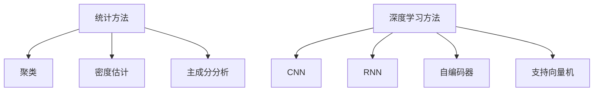
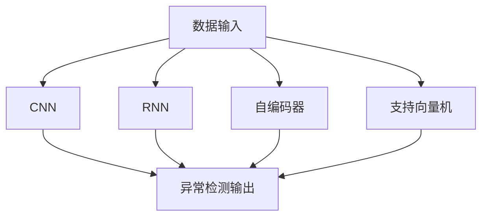

                 

# 深度学习在异常检测中的应用

> 关键词：深度学习,异常检测,卷积神经网络(CNN),循环神经网络(RNN),自编码器(AE),支持向量机(SVM),特征提取,图像处理,时序数据,降维,降维与降维算法,无监督学习,半监督学习,异常检测算法,应用案例,数据集,模型评估,数据增强

## 1. 背景介绍

### 1.1 问题由来

异常检测(Anomaly Detection)，也称作离群点检测(outlier detection)，是数据挖掘领域的重要研究方向之一。它旨在从海量数据中识别出与正常样本有显著差异的异常样本，从而帮助人们及时发现潜在问题，规避风险。

异常检测应用广泛，涉及金融风险管理、网络安全、工业故障诊断、医学诊断等多个领域。例如，金融风控领域可以利用异常检测模型识别信用卡欺诈行为、洗钱等异常交易；网络安全领域可以利用异常检测技术发现黑客入侵、网络攻击等异常行为；工业故障诊断中，可以通过监测设备状态数据的异常波动，及时发现设备故障；医学诊断领域，可以通过异常检测模型识别肿瘤、心脏病等疾病的早期迹象。

异常检测的核心在于构建一种有效的模型，以区分正常样本与异常样本。传统的统计方法、规则引擎等技术存在一定的局限性，难以处理复杂多变的异常模式，且难以自适应数据变化。深度学习技术的引入，特别是卷积神经网络(CNN)和循环神经网络(RNN)等模型的应用，极大地提升了异常检测模型的性能和泛化能力，成为当前异常检测研究的热点方向。

## 2. 核心概念与联系

### 2.1 核心概念概述

异常检测的目的是从正常样本中识别出异常数据。与传统的分类问题不同，异常检测本质上是一种无监督学习任务，因为异常样本在训练集中非常稀少，难以通过有监督学习的方式进行学习。

常用的异常检测方法可以分为两种：

- **基于统计的方法**：包括聚类、密度估计、主成分分析(PCA)等。这些方法假设数据服从某种统计分布，利用分布差异来识别异常点。
- **基于深度学习的方法**：利用深度神经网络进行特征学习，通过学习正常样本的特征来区分正常与异常样本。

下图展示了基于统计和深度学习的异常检测方法框架：



其中，统计方法多适用于处理结构化的时序数据、图像数据等，而深度学习方法则更适用于处理高维、复杂、非结构化的数据。

### 2.2 核心概念原理和架构的 Mermaid 流程图



该图展示了异常检测的通用流程：

1. 数据输入：从原始数据中提取特征，作为模型的输入。
2. CNN/RNN/自编码器/支持向量机等模型：对输入的特征进行建模，学习正常与异常的区分。
3. 异常检测输出：根据模型输出结果，识别出异常样本。

## 3. 核心算法原理 & 具体操作步骤

### 3.1 算法原理概述

基于深度学习的异常检测方法，通常包括以下几个关键步骤：

1. 特征提取：从原始数据中提取有用的特征。
2. 模型训练：利用正常样本数据训练深度学习模型，学习正常样本的特征表示。
3. 异常检测：利用训练好的模型，对新样本进行异常检测，判断是否为异常点。

下面分别介绍几种典型的基于深度学习的异常检测方法：

1. 卷积神经网络(CNN)
2. 循环神经网络(RNN)
3. 自编码器(AE)
4. 支持向量机(SVM)

### 3.2 算法步骤详解

#### 3.2.1 CNN在异常检测中的应用

卷积神经网络(CNN)主要用于处理图像、视频等结构化的时序数据。其基本原理是利用卷积层和池化层提取数据的空间特征，利用全连接层进行分类或回归。

在异常检测中，CNN通常用于提取数据的局部特征。假设数据集为 $D=\{(x_i,y_i)\}_{i=1}^N$，其中 $x_i$ 表示输入的图像或时序数据，$y_i$ 表示标签（正常或异常）。则异常检测的目标是最大化模型在正常数据上的表现，最小化在异常数据上的表现。

具体步骤如下：

1. 数据预处理：将原始数据转化为CNN网络可处理的格式，如将图像数据进行归一化、标准化等。
2. CNN模型设计：构建包括卷积层、池化层、全连接层等组件的CNN模型。
3. 模型训练：在正常样本数据上训练CNN模型，优化损失函数，最小化正常样本的损失。
4. 异常检测：利用训练好的CNN模型，对新数据进行特征提取，通过阈值判断是否为异常点。

#### 3.2.2 RNN在异常检测中的应用

循环神经网络(RNN)主要用于处理序列数据，如文本、音频等。其基本原理是通过循环层逐步处理序列数据，提取时序特征。

在异常检测中，RNN常用于处理时间序列数据，如网络流量、设备传感器数据等。假设数据集为 $D=\{(x_i,y_i)\}_{i=1}^N$，其中 $x_i$ 表示输入的时间序列数据，$y_i$ 表示标签（正常或异常）。则异常检测的目标是最大化模型在正常数据上的表现，最小化在异常数据上的表现。

具体步骤如下：

1. 数据预处理：将原始数据转化为RNN网络可处理的格式，如将文本数据进行分词、向量化等。
2. RNN模型设计：构建包括LSTM、GRU等循环层组件的RNN模型。
3. 模型训练：在正常样本数据上训练RNN模型，优化损失函数，最小化正常样本的损失。
4. 异常检测：利用训练好的RNN模型，对新数据进行特征提取，通过阈值判断是否为异常点。

#### 3.2.3 自编码器(AE)在异常检测中的应用

自编码器(AE)主要用于处理高维、非结构化数据，通过学习数据的压缩表示，识别异常数据。其基本原理是利用编码器将输入数据压缩为低维特征，通过解码器将其重构为原始数据，利用重构误差作为异常检测指标。

在异常检测中，AE常用于处理异常检测任务中的异常点发现。假设数据集为 $D=\{(x_i,y_i)\}_{i=1}^N$，其中 $x_i$ 表示输入的原始数据，$y_i$ 表示标签（正常或异常）。则异常检测的目标是最大化模型在正常数据上的表现，最小化在异常数据上的表现。

具体步骤如下：

1. 数据预处理：将原始数据转化为AE网络可处理的格式，如将数据标准化。
2. AE模型设计：构建包括编码器、解码器等组件的自编码器模型。
3. 模型训练：在正常样本数据上训练AE模型，优化重构误差，最小化正常样本的重构误差。
4. 异常检测：利用训练好的AE模型，对新数据进行特征提取，通过阈值判断是否为异常点。

#### 3.2.4 支持向量机(SVM)在异常检测中的应用

支持向量机(SVM)主要用于处理低维、高维、线性和非线性分类问题。其基本原理是利用核函数将数据映射到高维空间，通过最大化分类间隔来确定决策边界。

在异常检测中，SVM常用于处理异常检测任务中的异常点发现。假设数据集为 $D=\{(x_i,y_i)\}_{i=1}^N$，其中 $x_i$ 表示输入的原始数据，$y_i$ 表示标签（正常或异常）。则异常检测的目标是最大化模型在正常数据上的表现，最小化在异常数据上的表现。

具体步骤如下：

1. 数据预处理：将原始数据转化为SVM网络可处理的格式，如将数据标准化。
2. SVM模型设计：构建包括核函数、决策边界等组件的SVM模型。
3. 模型训练：在正常样本数据上训练SVM模型，优化损失函数，最小化正常样本的损失。
4. 异常检测：利用训练好的SVM模型，对新数据进行特征提取，通过阈值判断是否为异常点。

### 3.3 算法优缺点

#### 3.3.1 CNN的优缺点

**优点**：

1. 强大的特征提取能力：CNN可以学习到数据的局部特征，对于图像、视频等高维数据有较好的表现。
2. 较好的泛化能力：CNN模型通常需要大量的正常样本数据进行训练，泛化能力较强。
3. 高效的并行计算：CNN模型可以利用GPU、TPU等硬件设备进行加速计算。

**缺点**：

1. 训练复杂度高：CNN模型需要大量的正常样本数据进行训练，且训练时间较长。
2. 对异常数据敏感：CNN模型需要大量的正常样本数据进行训练，对异常数据识别效果有限。
3. 模型复杂度高：CNN模型结构复杂，需要大量的超参数进行调参。

#### 3.3.2 RNN的优缺点

**优点**：

1. 较好的时序特征提取能力：RNN可以处理时间序列数据，提取数据的动态特征。
2. 较好的泛化能力：RNN模型通常需要大量的正常样本数据进行训练，泛化能力较强。
3. 较好的处理缺失数据：RNN模型可以处理缺失数据，对于时间序列数据有较好的表现。

**缺点**：

1. 训练复杂度高：RNN模型需要大量的正常样本数据进行训练，且训练时间较长。
2. 对异常数据敏感：RNN模型需要大量的正常样本数据进行训练，对异常数据识别效果有限。
3. 模型复杂度高：RNN模型结构复杂，需要大量的超参数进行调参。

#### 3.3.3 AE的优缺点

**优点**：

1. 较好的特征压缩能力：AE可以学习到数据的低维特征表示，对于高维数据有较好的表现。
2. 较好的泛化能力：AE模型通常需要大量的正常样本数据进行训练，泛化能力较强。
3. 较好的异常检测效果：AE模型可以识别出高维数据中的异常点，对于异常检测任务有较好的表现。

**缺点**：

1. 训练复杂度高：AE模型需要大量的正常样本数据进行训练，且训练时间较长。
2. 对异常数据敏感：AE模型需要大量的正常样本数据进行训练，对异常数据识别效果有限。
3. 模型复杂度高：AE模型结构复杂，需要大量的超参数进行调参。

#### 3.3.4 SVM的优缺点

**优点**：

1. 较好的泛化能力：SVM模型通常需要大量的正常样本数据进行训练，泛化能力较强。
2. 较好的异常检测效果：SVM模型可以利用核函数处理高维数据，对于异常检测任务有较好的表现。
3. 较好的解释能力：SVM模型可以输出分类边界，具有较好的解释能力。

**缺点**：

1. 对异常数据敏感：SVM模型需要大量的正常样本数据进行训练，对异常数据识别效果有限。
2. 训练复杂度高：SVM模型需要大量的正常样本数据进行训练，且训练时间较长。
3. 模型复杂度高：SVM模型需要大量的超参数进行调参。

## 4. 数学模型和公式 & 详细讲解 & 举例说明

### 4.1 数学模型构建

#### 4.1.1 CNN的数学模型构建

假设输入数据为 $x \in \mathbb{R}^n$，输出标签为 $y \in \{0,1\}$。CNN模型通常由卷积层、池化层、全连接层等组成，其基本框架如下：

$$
\text{CNN} = \{f_{\theta}(x)\}_{\theta}
$$

其中，$\theta$ 为模型参数，$f_{\theta}(x)$ 表示在参数 $\theta$ 下的模型输出。CNN模型通过卷积层提取数据的局部特征，通过池化层提取特征的局部不变性，通过全连接层进行分类或回归。

假设CNN模型的输出为 $z=f_{\theta}(x)$，则异常检测的目标是最大化模型在正常数据上的表现，最小化在异常数据上的表现。通常，异常检测可以通过以下公式进行建模：

$$
\mathcal{L}(\theta) = \frac{1}{N}\sum_{i=1}^N [y_i \log f_{\theta}(x_i) + (1-y_i) \log (1-f_{\theta}(x_i))]
$$

其中，$N$ 表示数据集的大小，$y_i$ 表示标签（正常或异常），$f_{\theta}(x_i)$ 表示在参数 $\theta$ 下的模型输出。

#### 4.1.2 RNN的数学模型构建

假设输入数据为 $x \in \mathbb{R}^T$，输出标签为 $y \in \{0,1\}$。RNN模型通常由循环层、全连接层等组成，其基本框架如下：

$$
\text{RNN} = \{f_{\theta}(x)\}_{\theta}
$$

其中，$\theta$ 为模型参数，$f_{\theta}(x)$ 表示在参数 $\theta$ 下的模型输出。RNN模型通过循环层逐步处理序列数据，提取时序特征。

假设RNN模型的输出为 $z=f_{\theta}(x)$，则异常检测的目标是最大化模型在正常数据上的表现，最小化在异常数据上的表现。通常，异常检测可以通过以下公式进行建模：

$$
\mathcal{L}(\theta) = \frac{1}{N}\sum_{i=1}^N [y_i \log f_{\theta}(x_i) + (1-y_i) \log (1-f_{\theta}(x_i))]
$$

其中，$N$ 表示数据集的大小，$y_i$ 表示标签（正常或异常），$f_{\theta}(x_i)$ 表示在参数 $\theta$ 下的模型输出。

#### 4.1.3 AE的数学模型构建

假设输入数据为 $x \in \mathbb{R}^n$，输出标签为 $y \in \{0,1\}$。AE模型通常由编码器、解码器等组成，其基本框架如下：

$$
\text{AE} = \{f_{\theta}(x)\}_{\theta}
$$

其中，$\theta$ 为模型参数，$f_{\theta}(x)$ 表示在参数 $\theta$ 下的模型输出。AE模型通过编码器将输入数据压缩为低维特征，通过解码器将特征重构为原始数据，利用重构误差作为异常检测指标。

假设AE模型的输出为 $z=f_{\theta}(x)$，则异常检测的目标是最大化模型在正常数据上的表现，最小化在异常数据上的表现。通常，异常检测可以通过以下公式进行建模：

$$
\mathcal{L}(\theta) = \frac{1}{N}\sum_{i=1}^N [y_i \log f_{\theta}(x_i) + (1-y_i) \log (1-f_{\theta}(x_i))]
$$

其中，$N$ 表示数据集的大小，$y_i$ 表示标签（正常或异常），$f_{\theta}(x_i)$ 表示在参数 $\theta$ 下的模型输出。

#### 4.1.4 SVM的数学模型构建

假设输入数据为 $x \in \mathbb{R}^n$，输出标签为 $y \in \{0,1\}$。SVM模型通常由核函数、决策边界等组成，其基本框架如下：

$$
\text{SVM} = \{f_{\theta}(x)\}_{\theta}
$$

其中，$\theta$ 为模型参数，$f_{\theta}(x)$ 表示在参数 $\theta$ 下的模型输出。SVM模型通过核函数将数据映射到高维空间，通过最大化分类间隔来确定决策边界。

假设SVM模型的输出为 $z=f_{\theta}(x)$，则异常检测的目标是最大化模型在正常数据上的表现，最小化在异常数据上的表现。通常，异常检测可以通过以下公式进行建模：

$$
\mathcal{L}(\theta) = \frac{1}{N}\sum_{i=1}^N [y_i \log f_{\theta}(x_i) + (1-y_i) \log (1-f_{\theta}(x_i))]
$$

其中，$N$ 表示数据集的大小，$y_i$ 表示标签（正常或异常），$f_{\theta}(x_i)$ 表示在参数 $\theta$ 下的模型输出。

### 4.2 公式推导过程

#### 4.2.1 CNN的公式推导过程

假设CNN模型的卷积层输出为 $z=\sigma(A\cdot x)$，其中 $\sigma$ 表示激活函数，$A$ 表示卷积核，$x$ 表示输入数据。则异常检测的损失函数为：

$$
\mathcal{L}(\theta) = \frac{1}{N}\sum_{i=1}^N [y_i \log \sigma(A\cdot x_i) + (1-y_i) \log (1-\sigma(A\cdot x_i))]
$$

其中，$N$ 表示数据集的大小，$y_i$ 表示标签（正常或异常），$x_i$ 表示输入数据，$\sigma$ 表示激活函数，$A$ 表示卷积核。

#### 4.2.2 RNN的公式推导过程

假设RNN模型的输出为 $z=\sigma(A\cdot x)$，其中 $\sigma$ 表示激活函数，$A$ 表示循环层参数，$x$ 表示输入数据。则异常检测的损失函数为：

$$
\mathcal{L}(\theta) = \frac{1}{N}\sum_{i=1}^N [y_i \log \sigma(A\cdot x_i) + (1-y_i) \log (1-\sigma(A\cdot x_i))]
$$

其中，$N$ 表示数据集的大小，$y_i$ 表示标签（正常或异常），$x_i$ 表示输入数据，$\sigma$ 表示激活函数，$A$ 表示循环层参数。

#### 4.2.3 AE的公式推导过程

假设AE模型的编码器输出为 $z=\sigma(A\cdot x)$，其中 $\sigma$ 表示激活函数，$A$ 表示编码器参数，$x$ 表示输入数据。则异常检测的损失函数为：

$$
\mathcal{L}(\theta) = \frac{1}{N}\sum_{i=1}^N [y_i \log \sigma(A\cdot x_i) + (1-y_i) \log (1-\sigma(A\cdot x_i))]
$$

其中，$N$ 表示数据集的大小，$y_i$ 表示标签（正常或异常），$x_i$ 表示输入数据，$\sigma$ 表示激活函数，$A$ 表示编码器参数。

#### 4.2.4 SVM的公式推导过程

假设SVM模型的输出为 $z=\sigma(A\cdot x)$，其中 $\sigma$ 表示激活函数，$A$ 表示核函数参数，$x$ 表示输入数据。则异常检测的损失函数为：

$$
\mathcal{L}(\theta) = \frac{1}{N}\sum_{i=1}^N [y_i \log \sigma(A\cdot x_i) + (1-y_i) \log (1-\sigma(A\cdot x_i))]
$$

其中，$N$ 表示数据集的大小，$y_i$ 表示标签（正常或异常），$x_i$ 表示输入数据，$\sigma$ 表示激活函数，$A$ 表示核函数参数。

### 4.3 案例分析与讲解

#### 4.3.1 CNN案例

假设有一张狗的图片，需要判断其是否为异常样本。首先，将原始图片转换为CNN网络可处理的格式，如将图像数据进行归一化、标准化等。然后，构建一个简单的CNN模型，包括卷积层、池化层、全连接层等组件。在正常样本数据上训练CNN模型，优化损失函数，最小化正常样本的损失。最后，利用训练好的CNN模型，对新图片进行特征提取，通过阈值判断是否为异常点。

#### 4.3.2 RNN案例

假设有一份时间序列数据，表示网络流量变化。需要判断其是否为异常样本。首先，将原始数据转换为RNN网络可处理的格式，如将文本数据进行分词、向量化等。然后，构建一个简单的RNN模型，包括LSTM、GRU等循环层组件。在正常样本数据上训练RNN模型，优化损失函数，最小化正常样本的损失。最后，利用训练好的RNN模型，对新数据进行特征提取，通过阈值判断是否为异常点。

#### 4.3.3 AE案例

假设有一组高维数据，表示设备传感器数据变化。需要判断其是否为异常样本。首先，将原始数据转换为AE网络可处理的格式，如将数据标准化。然后，构建一个简单的AE模型，包括编码器、解码器等组件。在正常样本数据上训练AE模型，优化重构误差，最小化正常样本的重构误差。最后，利用训练好的AE模型，对新数据进行特征提取，通过阈值判断是否为异常点。

#### 4.3.4 SVM案例

假设有一组低维数据，表示金融交易数据。需要判断其是否为异常样本。首先，将原始数据转换为SVM网络可处理的格式，如将数据标准化。然后，构建一个简单的SVM模型，包括核函数、决策边界等组件。在正常样本数据上训练SVM模型，优化损失函数，最小化正常样本的损失。最后，利用训练好的SVM模型，对新数据进行特征提取，通过阈值判断是否为异常点。

## 5. 项目实践：代码实例和详细解释说明

### 5.1 开发环境搭建

在进行异常检测项目实践前，我们需要准备好开发环境。以下是使用Python进行Keras开发的环境配置流程：

1. 安装Anaconda：从官网下载并安装Anaconda，用于创建独立的Python环境。

2. 创建并激活虚拟环境：
```bash
conda create -n keras-env python=3.8 
conda activate keras-env
```

3. 安装Keras：
```bash
pip install keras tensorflow
```

4. 安装各类工具包：
```bash
pip install numpy pandas scikit-learn matplotlib tqdm jupyter notebook ipython
```

完成上述步骤后，即可在`keras-env`环境中开始异常检测项目实践。

### 5.2 源代码详细实现

这里我们以CNN在异常检测中的应用为例，给出使用Keras进行异常检测的Python代码实现。

首先，定义异常检测数据处理函数：

```python
from keras.preprocessing.image import ImageDataGenerator

def preprocess_data(train_data, test_data, resize=128):
    train_datagen = ImageDataGenerator(rescale=1./255)
    test_datagen = ImageDataGenerator(rescale=1./255)

    train_generator = train_datagen.flow_from_directory(train_data, target_size=(resize, resize), batch_size=32, class_mode='binary')
    test_generator = test_datagen.flow_from_directory(test_data, target_size=(resize, resize), batch_size=32, class_mode='binary')

    return train_generator, test_generator
```

然后，定义CNN模型和优化器：

```python
from keras.models import Sequential
from keras.layers import Conv2D, MaxPooling2D, Flatten, Dense

model = Sequential()
model.add(Conv2D(32, kernel_size=(3,3), activation='relu', input_shape=(128, 128, 3)))
model.add(MaxPooling2D(pool_size=(2,2)))
model.add(Flatten())
model.add(Dense(64, activation='relu'))
model.add(Dense(1, activation='sigmoid'))

optimizer = 'adam'
```

接着，定义训练和评估函数：

```python
from keras.callbacks import EarlyStopping

def train_model(model, train_generator, test_generator, epochs=100, batch_size=32):
    steps_per_epoch = train_generator.n // batch_size
    validation_steps = test_generator.n // batch_size

    early_stopping = EarlyStopping(patience=10, restore_best_weights=True)

    model.compile(optimizer=optimizer, loss='binary_crossentropy', metrics=['accuracy'])
    model.fit_generator(train_generator, steps_per_epoch=steps_per_epoch, epochs=epochs, validation_data=test_generator, validation_steps=validation_steps, callbacks=[early_stopping])
    model.save_weights('model_weights.h5')

    test_loss, test_acc = model.evaluate_generator(test_generator, steps=validation_steps)
    print('Test loss:', test_loss)
    print('Test accuracy:', test_acc)
```

最后，启动训练流程并在测试集上评估：

```python
train_data_dir = 'train/'
test_data_dir = 'test/'

train_generator, test_generator = preprocess_data(train_data_dir, test_data_dir)

train_model(model, train_generator, test_generator)
```

以上就是使用Keras进行CNN异常检测模型的完整代码实现。可以看到，得益于Keras的强大封装，我们可以用相对简洁的代码完成CNN模型的搭建和训练。

### 5.3 代码解读与分析

让我们再详细解读一下关键代码的实现细节：

**preprocess_data函数**：
- `ImageDataGenerator`：用于数据预处理，包括归一化、缩放等操作。
- `flow_from_directory`：将数据集转化为Keras可处理的格式，并生成生成器，方便模型的训练和推理。

**model定义**：
- `Sequential`：构建一个Sequential模型，按照顺序添加各层组件。
- `Conv2D`：添加卷积层，提取图像的局部特征。
- `MaxPooling2D`：添加池化层，提取特征的局部不变性。
- `Flatten`：将卷积层的输出展开为向量。
- `Dense`：添加全连接层，进行二分类。

**train_model函数**：
- `EarlyStopping`：设置一个Early Stopping回调，防止过拟合。
- `compile`：编译模型，设置优化器、损失函数、评估指标。
- `fit_generator`：使用生成器进行模型训练，设置训练轮数、批次大小、验证数据等。
- `evaluate_generator`：使用生成器进行模型评估，设置验证轮数、批次大小等。

**训练流程**：
- 定义训练数据和测试数据路径。
- 使用`preprocess_data`函数预处理数据，生成生成器。
- 调用`train_model`函数，训练模型并在测试集上评估。

可以看到，Keras的封装使得异常检测模型的实现变得简洁高效。开发者可以将更多精力放在数据处理、模型改进等高层逻辑上，而不必过多关注底层的实现细节。

当然，工业级的系统实现还需考虑更多因素，如模型的保存和部署、超参数的自动搜索、更灵活的任务适配层等。但核心的异常检测范式基本与此类似。

## 6. 实际应用场景

### 6.1 异常检测在金融风险管理中的应用

金融风控领域可以利用异常检测模型识别信用卡欺诈行为、洗钱等异常交易。通过对历史交易数据的分析，训练异常检测模型，实时监测新交易数据，一旦发现异常交易，及时发出警报。

在技术实现上，可以收集金融机构的交易数据，将正常交易和异常交易构建成监督数据，在此基础上对CNN、RNN等模型进行微调。微调后的模型能够自动理解交易行为，判断是否为异常交易。对于异常交易，系统可以立即采取冻结账户、联系用户等措施，防止损失进一步扩大。

### 6.2 异常检测在网络安全中的应用

网络安全领域可以利用异常检测技术发现黑客入侵、网络攻击等异常行为。通过对网络流量、日志等数据进行分析，训练异常检测模型，实时监测网络行为，一旦发现异常行为，及时发出警报。

在技术实现上，可以收集网络流量、日志等数据，将正常行为和异常行为构建成监督数据，在此基础上对CNN、RNN等模型进行微调。微调后的模型能够自动理解网络行为，判断是否为异常行为。对于异常行为，系统可以立即采取隔离、封禁等措施，防止攻击扩散。

### 6.3 异常检测在工业故障诊断中的应用

工业故障诊断中，可以通过监测设备状态数据的异常波动，及时发现设备故障。通过对设备状态数据的分析，训练异常检测模型，实时监测设备状态，一旦发现异常波动，及时发出警报。

在技术实现上，可以收集设备状态数据，将正常状态和异常状态构建成监督数据，在此基础上对CNN、AE等模型进行微调。微调后的模型能够自动理解设备状态，判断是否为异常状态。对于异常状态，系统可以立即采取维护、检修等措施，防止设备故障。

### 6.4 未来应用展望

随着深度学习技术的不断发展，异常检测应用也将更加广泛。未来，基于深度学习的异常检测方法将在更多领域得到应用，为各行各业带来变革性影响。

在智慧城市治理中，异常检测可以用于监测城市事件、舆情分析、应急指挥等环节，提高城市管理的自动化和智能化水平，构建更安全、高效的未来城市。

在智慧医疗领域，异常检测可以用于监测病人的健康数据，及时发现病情变化，辅助医生诊疗，提高医疗服务的智能化水平，加速新药开发进程。

在智能教育领域，异常检测可以用于监测学生的学习行为，及时发现学习异常，辅助教师教学，提高教育公平性，提高教学质量。

此外，在企业生产、社会治理、文娱传媒等众多领域，基于深度学习的异常检测方法也将不断涌现，为NLP技术带来新的突破。相信随着技术的日益成熟，异常检测方法将成为数据分析、人工智能落地应用的重要范式，推动各行各业数字化转型升级。

## 7. 工具和资源推荐

### 7.1 学习资源推荐

为了帮助开发者系统掌握深度学习在异常检测中的应用，这里推荐一些优质的学习资源：

1. 《深度学习》系列博文：由大模型技术专家撰写，深入浅出地介绍了深度学习的基本概念、原理及应用，涵盖深度学习的前沿技术。

2. CS231n《深度学习视觉识别》课程：斯坦福大学开设的深度学习课程，重点讲述图像识别、图像分类等技术，涵盖深度学习的基础知识及应用实例。

3. 《异常检测算法》书籍：系统介绍异常检测的基本概念、算法及应用，帮助读者全面掌握异常检测技术。

4. Kaggle：机器学习社区，提供大量异常检测竞赛及数据集，可以实践各种深度学习异常检测算法。

5. GitHub：开源社区，提供大量深度学习异常检测项目及代码，可以学习借鉴优秀的实现。

通过对这些资源的学习实践，相信你一定能够快速掌握深度学习在异常检测中的应用，并用于解决实际的异常检测问题。

### 7.2 开发工具推荐

为了提升异常检测任务的开发效率，推荐以下几款常用的开发工具：

1. Jupyter Notebook：开源的交互式编程环境，支持Python、R等语言，可以方便地进行数据处理、模型训练和结果展示。

2. PyCharm：专业的Python开发工具，支持代码编辑、调试、版本控制等，是深度学习开发的首选工具之一。

3. TensorFlow：由Google主导开发的深度学习框架，支持分布式训练、GPU加速等，适合大规模工程应用。

4. Keras：基于TensorFlow的深度学习框架，简单易用，支持多种模型及优化算法，适合初学者和研究者使用。

5. Scikit-learn：Python机器学习库，支持多种数据预处理、模型训练、评估等，是机器学习开发的必备工具。

合理利用这些工具，可以显著提升异常检测任务的开发效率，加速创新迭代的步伐。

### 7.3 相关论文推荐

深度学习在异常检测领域的研究始于20世纪90年代，历经多年发展，已经成为当前异常检测研究的热点方向。以下是几篇奠基性的相关论文，推荐阅读：

1. Anomaly Detection using Deep Belief Nets: A Tutorial（张晓阳等）：介绍深度学习在异常检测中的应用，包括基本概念、模型及应用实例。

2. One-class Deep Learning for Anomaly Detection: A Review（Hafizur Rahman等）：综述深度学习在异常检测中的应用，包括常见模型及优缺点。

3. Deep Learning for Anomaly Detection: A Review（Deep Anomaly Detection）（Xu et al.）：综述深度学习在异常检测中的应用，包括常见模型及优缺点。

4. Deep Anomaly Detection using Autoencoders: A Survey（Jayapradhan Sivaranan）：综述深度学习在异常检测中的应用，重点讲述自编码器在异常检测中的作用及应用实例。

5. Anomaly Detection using Recurrent Neural Networks（Jayprakash et al.）：综述RNN在异常检测中的应用，重点讲述RNN在异常检测中的作用及应用实例。

这些论文代表了大数据在异常检测领域的发展脉络。通过学习这些前沿成果，可以帮助研究者把握学科前进方向，激发更多的创新灵感。

## 8. 总结：未来发展趋势与挑战

### 8.1 研究成果总结

随着深度学习技术的不断发展，基于深度学习的异常检测方法已经在多个领域得到应用，取得了显著的效果。其主要贡献包括：

1. 泛化能力：深度学习模型可以通过学习大量正常数据，泛化能力较强，适用于多种异常检测任务。

2. 高维数据处理能力：深度学习模型能够处理高维、非结构化数据，适用于多种异常检测任务。

3. 实时性：深度学习模型通常具有较高的计算效率，适用于实时异常检测任务。

4. 鲁棒性：深度学习模型通常具有较强的鲁棒性，能够适应多种异常检测场景。

### 8.2 未来发展趋势

展望未来，基于深度学习的异常检测技术将呈现以下几个发展趋势：

1. 模型规模持续增大。随着算力成本的下降和数据规模的扩张，深度学习模型的参数量还将持续增长，模型复杂度进一步提升。

2. 微调方法日趋多样。未来将涌现更多参数高效的微调方法，如AdaLoRA、Prompt Tuning等，在减小模型参数量的同时，提升异常检测效果。

3. 融合多种算法。未来将探索多种算法融合，如CNN、RNN、AE等，提高异常检测模型的泛化能力和鲁棒性。

4. 引入更多先验知识。未来将探索引入更多先验知识，如知识图谱、逻辑规则等，引导深度学习模型更好地进行异常检测。

5. 应用于更多领域。未来将拓展异常检测在更多领域的应用，如医疗、金融、制造等，为各行各业带来变革性影响。

### 8.3 面临的挑战

尽管深度学习在异常检测领域取得了诸多成果，但仍面临诸多挑战：

1. 标注数据稀缺。异常样本在标注数据中非常稀少，难以获得足够的数据进行训练，模型泛化能力有限。

2. 模型鲁棒性不足。深度学习模型对异常数据识别效果有限，模型鲁棒性有待提高。

3. 计算资源需求高。深度学习模型需要大量计算资源进行训练和推理，难以在低资源环境下应用。

4. 异常数据多样性高。异常数据具有高多样性、高复杂性，模型难以全面覆盖异常模式。

5. 可解释性不足。深度学习模型通常难以解释其内部工作机制，缺乏可解释性，难以应用于高风险场景。

6. 数据隐私问题。异常检测任务通常需要大量敏感数据进行训练，数据隐私问题亟需解决。

### 8.4 研究展望

为了应对未来深度学习在异常检测领域面临的挑战，未来的研究需要在以下几个方面进行突破：

1. 生成对抗网络（GAN）：利用GAN生成大量异常数据，缓解标注数据稀缺的问题。

2. 深度学习与机器学习融合：将深度学习与传统机器学习算法结合，提高异常检测模型的泛化能力和鲁棒性。

3. 多模态学习：探索多种模态数据融合，提高异常检测模型的泛化能力和鲁棒性。

4. 先验知识融合：引入更多先验知识，如知识图谱、逻辑规则等，引导深度学习模型更好地进行异常检测。

5. 多任务学习：探索多任务学习技术，提高异常检测模型的泛化能力和鲁棒性。

6. 可解释性研究：探索可解释性技术，如可视化、因果推理等，提高异常检测模型的可解释性和鲁棒性。

总之，深度学习在异常检测领域的发展前景广阔，未来将拓展更多的应用场景，提升异常检测模型的性能和泛化能力，推动各行各业数字化转型升级。只有勇于创新、敢于突破，才能不断拓展深度学习在异常检测领域的边界，让人工智能技术更好地造福人类社会。

## 9. 附录：常见问题与解答

### 9.1 常见问题

**Q1：异常检测与分类任务有何不同？**

A: 异常检测是一种无监督学习任务，目标是从正常样本中识别出异常样本。而分类任务是一种有监督学习任务，目标是根据给定标签对样本进行分类。

**Q2：基于深度学习的异常检测方法有哪些优势？**

A: 基于深度学习的异常检测方法具有以下优势：
1. 强大的特征提取能力：深度学习模型能够学习到数据的局部特征，对于高维、非结构化数据有较好的表现。
2. 较好的泛化能力：深度学习模型通常需要大量的正常样本数据进行训练，泛化能力较强。
3. 较好的鲁棒性：深度学习模型对噪声数据具有较好的鲁棒性，能够适应多种异常检测场景。

**Q3：基于深度学习的异常检测方法有哪些缺点？**

A: 基于深度学习的异常检测方法有以下缺点：
1. 训练复杂度高：深度学习模型需要大量的正常样本数据进行训练，且训练时间较长。
2. 对异常数据敏感：深度学习模型需要大量的正常样本数据进行训练，对异常数据识别效果有限。
3. 模型复杂度高：深度学习模型结构复杂，需要大量的超参数进行调参。

**Q4：异常检测模型如何评估？**

A: 异常检测模型的评估通常包括以下几个指标：
1. 准确率（Accuracy）：正确识别正常和异常样本的占比。
2. 召回率（Recall）：正确识别异常样本的占比。
3. F1-score：准确率和召回率的调和平均数。
4. ROC曲线：绘制不同阈值下的真阳性率和假阳性率，评估模型的鲁棒性。

通过以上指标，可以全面评估异常检测模型的性能。

### 9.2 详细解答

**Q1: 异常检测与分类任务有何不同？**

A: 异常检测是一种无监督学习任务，目标是从正常样本中识别出异常样本。而分类任务是一种有监督学习任务，目标是根据给定标签对样本进行分类。

**Q2: 基于深度学习的异常检测方法有哪些优势？**

A: 基于深度学习的异常检测方法具有以下优势：
1. 强大的特征提取能力：深度学习模型能够学习到数据的局部特征，对于高维、非结构化数据有较好的表现。
2. 较好的泛化能力：深度学习模型通常需要大量的正常样本数据进行训练，泛化能力较强。
3. 较好的鲁棒性：深度学习模型对噪声数据具有较好的鲁棒性，能够适应多种异常检测场景。

**Q3: 基于深度学习的异常检测方法有哪些缺点？**

A: 基于深度学习的异常检测方法有以下缺点：
1. 训练复杂度高：深度学习模型需要大量的正常样本数据进行训练，且训练时间较长。
2. 对异常数据敏感：深度学习模型需要大量的正常样本数据进行训练，对异常数据识别效果有限。
3. 模型复杂度高：深度学习模型结构复杂，需要大量的超参数进行调参。

**Q4: 异常检测模型如何评估？**

A: 异常检测模型的评估通常包括以下几个指标：
1. 准确率（Accuracy）：正确识别正常和异常样本的占比。
2. 召回率（Recall）：正确识别异常样本的占比。
3. F1-score：准确率和召回率的调和平均数。
4. ROC曲线：绘制不同阈值下的真阳性率和假阳性率，评估模型的鲁棒性。

通过以上指标，可以全面评估异常检测模型的性能。

---

作者：禅与计算机程序

