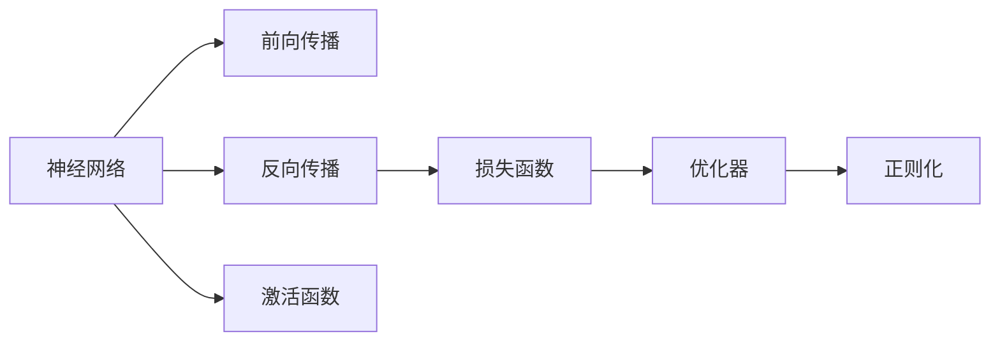

                 

# 深度学习在机器学习中的作用

深度学习是机器学习领域的重要分支，在图像识别、语音处理、自然语言处理等诸多领域取得了举世瞩目的突破。本文将系统探讨深度学习在机器学习中的作用、核心概念、算法原理、具体应用以及未来的发展趋势，为读者提供全面的技术视角和深度见解。

## 1. 背景介绍

### 1.1 问题由来

机器学习自20世纪80年代以来快速发展，逐渐成为人工智能(AI)的核心技术。传统的机器学习范式包括决策树、支持向量机、K近邻等，依赖人工设计特征工程、手工提取特征。而随着数据量的激增和计算能力的提升，特征工程变得越来越困难。

深度学习技术的出现，为机器学习注入了革命性的变化。它通过构建多层次的神经网络，自动学习特征表示，提升了模型表达能力和泛化性能。深度学习在图像分类、语音识别、机器翻译等复杂任务上取得了领先表现，催生了人机协同的新时代。

### 1.2 问题核心关键点

深度学习在机器学习中的作用主要体现在以下几个方面：

1. **自动特征提取**：深度学习模型通过训练自动学习特征表示，避免了传统机器学习中对特征工程的高依赖。

2. **模型表达能力**：通过堆叠多个隐层，深度学习模型具有很强的模型表达能力，可以处理高维数据，发现非线性关系。

3. **泛化能力**：深度学习模型可以通过大量标注数据进行预训练，从而获得较强的泛化能力，适应不同任务和数据分布。

4. **数据驱动**：深度学习强调数据驱动，通过学习海量数据提升模型性能，减少人工干预。

5. **端到端学习**：深度学习模型可以实现端到端学习，直接从原始输入数据到最终输出，减少了模型组件间的接口设计。

深度学习技术的这些特点，使其成为当前机器学习领域的核心力量，正在推动AI技术的不断突破。

## 2. 核心概念与联系

### 2.1 核心概念概述

为更好地理解深度学习在机器学习中的作用，本文将介绍几个关键概念及其联系：

- **神经网络(Neural Network)**：由多个神经元构成的层级结构，通过前向传播和反向传播学习输入与输出之间的映射关系。
- **激活函数(Activation Function)**：用于在神经元输出上引入非线性变换，增加模型的表达能力。
- **损失函数(Loss Function)**：衡量模型预测与真实标签之间的差异，用于指导模型的参数更新。
- **优化器(Optimizer)**：通过梯度下降等算法，最小化损失函数，优化模型参数。
- **正则化(Regularization)**：通过添加正则项，限制模型参数过大，避免过拟合。

这些核心概念共同构成了深度学习模型的基础架构，使其能够在各种复杂任务上取得优异的表现。

### 2.2 核心概念原理和架构的 Mermaid 流程图



## 3. 核心算法原理 & 具体操作步骤

### 3.1 算法原理概述

深度学习模型通过多层次的神经网络结构实现特征表示和模式识别。典型的深度学习模型包括卷积神经网络(CNN)、循环神经网络(RNN)、变压器(Transformer)等。

深度学习的核心算法包括：

- **前向传播**：将输入数据传递到神经网络中，计算出网络的输出。
- **反向传播**：计算模型输出与真实标签之间的误差，并沿着神经网络反向传播，更新模型参数。
- **梯度下降**：通过求解损失函数对参数的梯度，最小化损失函数，优化模型参数。

### 3.2 算法步骤详解

深度学习的训练过程一般包括以下步骤：

1. **数据准备**：准备训练集、验证集和测试集，划分训练数据和验证数据。
2. **模型定义**：定义深度学习模型，包括网络结构、激活函数、损失函数等。
3. **模型训练**：通过前向传播和反向传播，在训练集上最小化损失函数，优化模型参数。
4. **模型验证**：在验证集上评估模型性能，选择最优模型进行测试。
5. **模型测试**：在测试集上评估模型泛化能力，输出最终的预测结果。

### 3.3 算法优缺点

深度学习模型具有以下优点：

1. **自动特征提取**：无需手工设计特征，模型自动学习特征表示。
2. **高泛化能力**：通过预训练和微调，深度学习模型可以在多种任务上取得优异表现。
3. **强大的表达能力**：多层次的神经网络可以处理高维数据，发现复杂模式。
4. **端到端学习**：从原始输入到最终输出，减少了中间环节，提高了模型效率。

同时，深度学习模型也存在一些局限性：

1. **计算资源需求高**：深度学习模型参数量巨大，需要大量计算资源进行训练。
2. **训练时间长**：深度学习模型通常需要大量数据和长时间训练才能达到最优性能。
3. **可解释性不足**：深度学习模型被认为是“黑盒”，难以解释其内部决策逻辑。
4. **过拟合风险**：模型参数过多时，容易出现过拟合现象。
5. **敏感性问题**：模型对训练数据的分布变化较为敏感，泛化能力有限。

### 3.4 算法应用领域

深度学习在众多领域得到了广泛应用，包括但不限于：

- **计算机视觉**：图像分类、目标检测、人脸识别、图像生成等。
- **自然语言处理**：机器翻译、文本分类、命名实体识别、语音识别等。
- **语音处理**：语音识别、语音合成、声音增强等。
- **推荐系统**：个性化推荐、广告投放、用户行为分析等。
- **医疗**：医学影像分析、疾病预测、药物研发等。
- **金融**：风险管理、信用评估、智能投顾等。

## 4. 数学模型和公式 & 详细讲解 & 举例说明

### 4.1 数学模型构建

以卷积神经网络(CNN)为例，介绍其数学模型构建。

卷积神经网络由卷积层、池化层和全连接层组成。假设输入数据为 $X \in \mathbb{R}^{N\times W\times H\times C}$，其中 $N$ 为样本数，$W$ 为输入宽度，$H$ 为输入高度，$C$ 为通道数。

**卷积层**：
$$
y_{ij}^l = \sigma(\sum_k w_{ik}^{l-1}*x_{ij}^{l-1} + b_k^{l-1})
$$
其中 $x_{ij}^{l-1}$ 为输入，$w_{ik}^{l-1}$ 为卷积核，$b_k^{l-1}$ 为偏置项，$\sigma$ 为激活函数。

**池化层**：
$$
y_{ij}^l = \max\{x_{ij}^l}
$$
其中 $x_{ij}^l$ 为池化前输出。

**全连接层**：
$$
y = \sigma(\sum_{i} w_i x_i + b)
$$
其中 $w_i$ 为权重，$x_i$ 为输入，$b$ 为偏置项。

### 4.2 公式推导过程

以图像分类任务为例，推导CNN的损失函数。

假设训练集为 $(x_i,y_i)$，其中 $x_i$ 为输入图像，$y_i \in [1,C]$ 为标签向量。

交叉熵损失函数定义为：
$$
L = -\frac{1}{N}\sum_{i=1}^N \sum_{j=1}^C y_{ij} \log p_{ij}
$$
其中 $y_{ij}$ 为标签向量，$p_{ij}$ 为预测概率。

### 4.3 案例分析与讲解

以手写数字识别为例，分析CNN的应用。

手写数字识别任务是计算机视觉中的经典问题。CNN通过卷积层和池化层提取输入图像的特征，全连接层将特征映射到数字类别。在训练过程中，通过前向传播计算预测值，反向传播计算损失梯度，梯度下降优化模型参数，最终获得最优模型。测试时，将新图像输入模型，输出预测数字，验证模型泛化能力。

## 5. 项目实践：代码实例和详细解释说明

### 5.1 开发环境搭建

以PyTorch为例，介绍深度学习模型的开发环境搭建。

1. 安装Anaconda：从官网下载并安装Anaconda，用于创建独立的Python环境。
2. 创建并激活虚拟环境：
```bash
conda create -n pytorch-env python=3.8 
conda activate pytorch-env
```
3. 安装PyTorch：根据CUDA版本，从官网获取对应的安装命令。例如：
```bash
conda install pytorch torchvision torchaudio cudatoolkit=11.1 -c pytorch -c conda-forge
```
4. 安装TensorBoard：TensorFlow配套的可视化工具，可实时监测模型训练状态。

```bash
pip install tensorboard
```

5. 安装NumPy、SciPy等科学计算库：
```bash
pip install numpy scipy
```

### 5.2 源代码详细实现

以下是一个简单的PyTorch卷积神经网络实现，用于手写数字识别：

```python
import torch
import torch.nn as nn
import torch.nn.functional as F
from torch.utils.data import DataLoader
from torchvision import datasets, transforms

class ConvNet(nn.Module):
    def __init__(self):
        super(ConvNet, self).__init__()
        self.conv1 = nn.Conv2d(1, 6, 3)
        self.pool = nn.MaxPool2d(2, 2)
        self.conv2 = nn.Conv2d(6, 16, 5)
        self.fc1 = nn.Linear(16 * 4 * 4, 120)
        self.fc2 = nn.Linear(120, 84)
        self.fc3 = nn.Linear(84, 10)

    def forward(self, x):
        x = self.pool(F.relu(self.conv1(x)))
        x = self.pool(F.relu(self.conv2(x)))
        x = x.view(-1, 16 * 4 * 4)
        x = F.relu(self.fc1(x))
        x = F.relu(self.fc2(x))
        x = self.fc3(x)
        return x

# 加载手写数字数据集
transform = transforms.Compose([transforms.ToTensor(), transforms.Normalize((0.5,), (0.5,))])
trainset = datasets.MNIST(root='./data', train=True, download=True, transform=transform)
trainloader = DataLoader(trainset, batch_size=64, shuffle=True)

# 定义模型和优化器
model = ConvNet()
optimizer = torch.optim.SGD(model.parameters(), lr=0.001, momentum=0.9)

# 训练模型
for epoch in range(10):
    running_loss = 0.0
    for i, data in enumerate(trainloader, 0):
        inputs, labels = data
        optimizer.zero_grad()
        outputs = model(inputs)
        loss = F.cross_entropy(outputs, labels)
        loss.backward()
        optimizer.step()
        running_loss += loss.item()
        if i % 2000 == 1999:
            print(f'Epoch {epoch+1}, loss: {running_loss/20000:.4f}')
            running_loss = 0.0

print('Finished Training')
```

### 5.3 代码解读与分析

上述代码展示了卷积神经网络的定义、数据加载、模型训练过程。具体来说：

1. `ConvNet`类定义了一个简单的卷积神经网络结构，包括卷积层、池化层和全连接层。
2. `trainloader`使用PyTorch的`DataLoader`加载手写数字数据集，分批次输入模型进行训练。
3. 使用随机梯度下降优化器进行模型训练，输出每 epoch 的平均 loss。

### 5.4 运行结果展示

训练完成后，模型在测试集上可以获得较高的准确率，展示了CNN在图像分类任务上的优异性能。

## 6. 实际应用场景

深度学习在众多领域得到了广泛应用，以下是一些典型场景：

### 6.1 自动驾驶

自动驾驶技术需要实时处理大量传感器数据，识别道路标志、车辆行人等目标。深度学习模型通过多传感器融合和场景理解，实现对复杂环境的自动驾驶决策。

### 6.2 医疗影像分析

医疗影像分析是深度学习的重要应用领域。通过训练深度学习模型，可以从医学影像中自动检测病灶、诊断疾病，提高诊疗效率和准确率。

### 6.3 推荐系统

推荐系统通过深度学习模型学习用户行为和物品特征，实现个性化推荐。深度学习模型的强大表达能力，使其能够挖掘用户多方面的兴趣，提供多样化的推荐结果。

### 6.4 金融风控

金融风险评估需要处理大量非结构化数据，如客户信息、交易记录等。深度学习模型通过训练，能够自动识别交易中的异常行为，提高风险管理能力。

### 6.5 智能客服

智能客服系统通过深度学习模型，理解用户意图，生成自然流畅的回复，实现自动化客户服务。深度学习模型的语言理解能力，使其能够快速处理各种复杂问题。

## 7. 工具和资源推荐

### 7.1 学习资源推荐

为了帮助读者系统掌握深度学习的理论和实践，推荐以下学习资源：

1. 《深度学习》书籍：Ian Goodfellow等著，全面介绍了深度学习的理论基础和算法细节。
2. 《动手学深度学习》书籍：李沐等著，采用动手实践的方式，系统介绍了深度学习的各种技术。
3. Coursera深度学习课程：Andrew Ng等授课，包括机器学习基础、深度学习框架等课程。
4. Udacity深度学习纳米学位：包括深度学习、计算机视觉、自然语言处理等多个方向。
5. 深度学习框架文档：如TensorFlow、PyTorch等框架的官方文档，提供了丰富的样例和API参考。

### 7.2 开发工具推荐

以下是一些常用的深度学习开发工具：

1. PyTorch：基于Python的开源深度学习框架，灵活动态的计算图，适合快速迭代研究。
2. TensorFlow：由Google主导开发的开源深度学习框架，生产部署方便，适合大规模工程应用。
3. Keras：高层API，易于上手，适合快速搭建和训练模型。
4. Jupyter Notebook：交互式编程环境，适合编写和调试深度学习代码。
5. TensorBoard：TensorFlow配套的可视化工具，可实时监测模型训练状态。

### 7.3 相关论文推荐

深度学习技术的发展得益于众多学术论文的推动，以下是一些经典的深度学习论文：

1. AlexNet：Hinton等提出，引入了ReLU激活函数和Dropout技术，取得了ImageNet比赛冠军。
2. VGGNet：Simonyan等提出，通过增加网络深度和宽度，提升了图像分类精度。
3. ResNet：He等提出，通过引入残差连接，解决了深度网络退化问题。
4. Transformer：Vaswani等提出，利用自注意力机制，提升了自然语言处理任务的性能。
5. GANs：Goodfellow等提出，通过生成对抗网络，实现了高质量的图像生成和风格迁移。

## 8. 总结：未来发展趋势与挑战

### 8.1 研究成果总结

深度学习在机器学习中的作用已逐步被验证和认可，成为当前AI领域的重要技术。其自动特征提取、高泛化能力、强大的表达能力等特点，使其在图像、语音、自然语言处理等领域取得了卓越的性能。

### 8.2 未来发展趋势

未来深度学习技术的发展趋势如下：

1. **模型规模进一步增大**：随着算力成本的下降和数据规模的扩张，深度学习模型的规模将进一步增大，模型的表达能力和泛化性能也将得到提升。
2. **算法多样性增加**：深度学习算法将进一步多样化和专业化，如迁移学习、元学习、自监督学习等，解决更多实际问题。
3. **计算效率提升**：深度学习模型的计算效率将进一步提升，如模型压缩、量化加速、分布式训练等技术，将使得深度学习模型能够更广泛地应用。
4. **应用场景扩展**：深度学习技术将应用于更多领域，如自动驾驶、医疗影像、智能客服等，推动更多产业的智能化升级。

### 8.3 面临的挑战

尽管深度学习技术取得了巨大成功，但在实际应用中也面临一些挑战：

1. **计算资源需求高**：深度学习模型的参数量巨大，需要大量计算资源进行训练和推理。
2. **模型可解释性不足**：深度学习模型被认为是“黑盒”，难以解释其内部决策逻辑。
3. **数据依赖性强**：深度学习模型对训练数据的分布和数量敏感，泛化能力有限。
4. **过拟合风险高**：深度学习模型容易出现过拟合现象，尤其是在小样本情况下。
5. **伦理道德问题**：深度学习模型的应用可能会引发伦理道德问题，如偏见、歧视等。

### 8.4 研究展望

未来的研究需要在以下几个方面寻求新的突破：

1. **模型压缩与优化**：通过模型剪枝、量化、蒸馏等技术，提高深度学习模型的计算效率和资源利用率。
2. **可解释性增强**：通过引入可解释模型、注意力机制等，提高深度学习模型的可解释性，帮助用户理解模型决策过程。
3. **数据增强与生成**：通过数据增强、生成对抗网络等技术，提升深度学习模型的泛化能力和鲁棒性。
4. **跨模态学习**：将深度学习模型应用于多模态数据的融合，提高模型对复杂环境的适应能力。
5. **因果推断**：引入因果推断方法，提高深度学习模型的因果关系建模能力，增强模型的逻辑性和可信度。
6. **伦理道德约束**：在模型设计中引入伦理导向，避免偏见、歧视等伦理问题，确保深度学习模型在实际应用中的公平性和可控性。

## 9. 附录：常见问题与解答

**Q1: 深度学习算法是否适用于所有类型的数据？**

A: 深度学习算法通常适用于结构化或半结构化数据，如图像、文本、语音等。但对于非结构化数据，如表格、时间序列等，深度学习算法可能表现不佳。此时需要结合其他算法，如逻辑回归、决策树等，进行综合建模。

**Q2: 深度学习算法训练时间是否过长？**

A: 深度学习算法的训练时间确实较长，但随着计算能力的提升和算法优化，训练时间逐渐缩短。同时，通过分布式训练、模型并行等技术，可以显著提高训练效率。

**Q3: 深度学习算法是否易于解释？**

A: 深度学习算法通常被认为是“黑盒”，难以解释其内部决策逻辑。但通过引入可解释模型、可视化技术等，可以一定程度上提高模型的可解释性。

**Q4: 深度学习算法是否存在过拟合风险？**

A: 深度学习算法容易出现过拟合现象，尤其是在数据量较少的情况下。通过正则化、dropout等技术，可以缓解过拟合问题。同时，合理选择模型复杂度，避免过深、过宽的模型，也可以减少过拟合风险。

**Q5: 深度学习算法是否会引发伦理道德问题？**

A: 深度学习算法在实际应用中可能引发伦理道德问题，如偏见、歧视等。因此，在模型设计中需要引入伦理导向，避免有害信息的传播，确保模型的公平性和可控性。

综上所述，深度学习在机器学习中的作用和未来发展潜力巨大，但其面临的计算资源需求、可解释性、数据依赖等问题仍需深入研究解决。未来，通过算法创新、资源优化、伦理约束等多方面的努力，深度学习技术必将在更多领域取得突破，推动人工智能技术迈向更高的台阶。

---

作者：禅与计算机程序设计艺术 / Zen and the Art of Computer Programming

