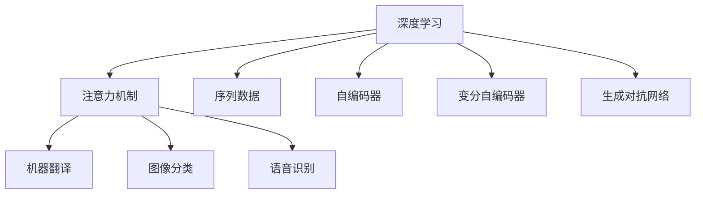

                 

## 1. 背景介绍

### 1.1 问题由来
注意力机制（Attention Mechanism）是深度学习中的一种重要技术，主要用于解决序列数据（如自然语言、图像、音频等）中的问题。在深度学习中，传统的全连接网络只能处理固定长度的输入，而实际应用中，序列数据的长度往往不固定，如自然语言文本的长度变化很大，因此需要一种能够灵活处理序列数据的模型。

注意力机制能够动态地计算输入序列中不同位置的权重，从而对序列中的信息进行加权处理。这使得注意力机制在自然语言处理（NLP）、计算机视觉（CV）和语音处理等领域得到了广泛应用。例如，在机器翻译中，注意力机制可以动态地选择源语言序列中的词，以进行翻译；在图像识别中，注意力机制可以动态地选择图像中的区域，以进行分类或定位。

近年来，深度学习在注意力预测中的应用逐渐增多，如在机器翻译、图像分类、语音识别等领域。本文将系统地介绍注意力机制在深度学习中的应用，从原理、实现和优化等多个方面进行深入探讨。

## 2. 核心概念与联系

### 2.1 核心概念概述

为更好地理解注意力机制在深度学习中的应用，本节将介绍几个密切相关的核心概念：

- **深度学习（Deep Learning）**：一种基于神经网络的机器学习方法，通过多层次的抽象表示，学习数据中的复杂模式和结构。深度学习已经广泛应用于图像、语音、自然语言处理等领域。
- **注意力机制（Attention Mechanism）**：一种动态选择序列中重要位置的技术，通过计算输入序列中不同位置的权重，对序列进行加权处理。注意力机制能够提高模型的鲁棒性和泛化能力，减少计算复杂度。
- **序列数据（Sequential Data）**：一种时间序列的数据结构，如自然语言文本、时间序列数据、图像等。序列数据通常需要特殊的模型进行处理。
- **自编码器（Autoencoder）**：一种无监督学习方法，通过将输入数据编码为低维向量，再解码回原始数据，从而学习数据的分布。自编码器在图像处理、语音处理等领域得到了广泛应用。
- **变分自编码器（Variational Autoencoder, VAE）**：一种改进的自编码器，通过引入变分推断技术，能够学习数据的潜在分布。VAE在图像生成、文本生成等领域得到了广泛应用。
- **生成对抗网络（Generative Adversarial Network, GAN）**：一种生成模型，由生成器和判别器两个网络组成，通过对抗训练，生成器能够生成逼真的样本，判别器能够准确区分生成样本和真实样本。GAN在图像生成、语音生成等领域得到了广泛应用。

这些核心概念之间的逻辑关系可以通过以下Mermaid流程图来展示：



这个流程图展示了一些核心概念之间的关系：

1. 深度学习基于神经网络，能够处理序列数据，学习数据的复杂模式。
2. 注意力机制是深度学习中的一种重要技术，能够动态地选择序列中重要位置，对序列进行加权处理。
3. 自编码器、变分自编码器、生成对抗网络等模型，都可以引入注意力机制，以进一步提高模型的性能。
4. 注意力机制在机器翻译、图像分类、语音识别等下游任务中得到了广泛应用。

这些概念共同构成了深度学习在注意力预测中的应用框架，使其能够在各种场景下发挥强大的作用。通过理解这些核心概念，我们可以更好地把握注意力机制的工作原理和优化方向。

## 3. 核心算法原理 & 具体操作步骤

### 3.1 算法原理概述

注意力机制的原理是通过计算输入序列中不同位置的权重，对序列进行加权处理。通常情况下，注意力机制由两个部分组成：

1. **查询向量（Query Vector）**：从当前时刻的输出中提取的向量，用于计算注意力权重。
2. **键向量（Key Vector）**：从输入序列中提取的向量，用于计算注意力权重。

注意力机制的核心公式为：

$$
\text{Attention}(Q, K, V) = \text{Softmax}(\frac{QK^T}{\sqrt{d_k}})V
$$

其中 $Q$ 为查询向量，$K$ 为键向量，$V$ 为值向量，$d_k$ 为键向量的维度。$\text{Softmax}$ 函数用于计算注意力权重，$\text{Softmax}$ 函数能够将注意力权重映射到 [0, 1] 的区间，表示每个位置的权重。注意力机制的输出为：

$$
\text{Attention}(Q, K, V) = \sum_{i=1}^{N} \alpha_i V_i
$$

其中 $\alpha_i$ 为注意力权重，$V_i$ 为第 $i$ 个位置的值向量。

注意力机制在深度学习中的应用非常广泛，包括：

1. **机器翻译（Machine Translation）**：通过计算源语言和目标语言之间的注意力权重，生成目标语言的翻译结果。
2. **图像分类（Image Classification）**：通过计算图像中的局部区域和全局区域的注意力权重，进行图像分类或定位。
3. **语音识别（Speech Recognition）**：通过计算语音信号中不同时间位置的注意力权重，进行语音识别。
4. **自然语言处理（Natural Language Processing）**：通过计算输入序列中不同位置的注意力权重，进行文本分类、命名实体识别等任务。

### 3.2 算法步骤详解

注意力机制的实现步骤如下：

1. **查询向量的计算**：将当前时刻的输出 $h_t$ 作为查询向量 $Q$，即 $Q = h_t$。
2. **键向量的计算**：将输入序列中每个位置的向量 $x_i$ 作为键向量 $K$，即 $K = [x_1, x_2, ..., x_N]$。
3. **注意力权重的计算**：计算注意力权重 $\alpha_i$，即 $\alpha_i = \frac{e^{\frac{QK_i^T}{\sqrt{d_k}}}{\sum_{j=1}^{N} e^{\frac{QK_j^T}{\sqrt{d_k}}}}$。
4. **值的加权计算**：将值向量 $V$ 和注意力权重 $\alpha_i$ 进行加权计算，得到注意力输出 $\text{Attention}(Q, K, V)$。

在实际应用中，为了加速计算，通常会对注意力机制进行优化，如使用点乘注意力（Dot-Product Attention）、多头注意力（Multi-Head Attention）等。

### 3.3 算法优缺点

注意力机制的优点：

1. **灵活性**：能够动态地选择输入序列中的重要位置，适应不同的输入数据。
2. **高效性**：能够减少计算复杂度，提高模型的训练速度。
3. **鲁棒性**：能够提高模型的泛化能力，减少过拟合风险。

注意力机制的缺点：

1. **计算复杂度高**：计算注意力权重需要大量的矩阵乘法和指数运算，计算复杂度高。
2. **参数量多**：注意力机制需要大量的参数，增加了模型的复杂度。
3. **难以解释**：注意力机制的内部机制难以解释，难以理解模型的工作原理。

### 3.4 算法应用领域

注意力机制在深度学习中的应用非常广泛，包括：

1. **机器翻译（Machine Translation）**：通过计算源语言和目标语言之间的注意力权重，生成目标语言的翻译结果。
2. **图像分类（Image Classification）**：通过计算图像中的局部区域和全局区域的注意力权重，进行图像分类或定位。
3. **语音识别（Speech Recognition）**：通过计算语音信号中不同时间位置的注意力权重，进行语音识别。
4. **自然语言处理（Natural Language Processing）**：通过计算输入序列中不同位置的注意力权重，进行文本分类、命名实体识别等任务。

除了以上领域，注意力机制在推荐系统、视频处理等领域也得到了广泛应用。

## 4. 数学模型和公式 & 详细讲解

### 4.1 数学模型构建

注意力机制的数学模型由查询向量 $Q$、键向量 $K$ 和值向量 $V$ 组成，通过计算注意力权重 $\alpha_i$ 和注意力输出 $\text{Attention}(Q, K, V)$ 来实现。

注意力机制的输出为：

$$
\text{Attention}(Q, K, V) = \sum_{i=1}^{N} \alpha_i V_i
$$

其中 $\alpha_i$ 为注意力权重，$V_i$ 为第 $i$ 个位置的值向量。

注意力权重 $\alpha_i$ 的计算公式为：

$$
\alpha_i = \frac{e^{\frac{QK_i^T}{\sqrt{d_k}}}{\sum_{j=1}^{N} e^{\frac{QK_j^T}{\sqrt{d_k}}}}
$$

其中 $d_k$ 为键向量的维度。

### 4.2 公式推导过程

注意力机制的核心公式为：

$$
\text{Attention}(Q, K, V) = \text{Softmax}(\frac{QK^T}{\sqrt{d_k}})V
$$

其中 $Q$ 为查询向量，$K$ 为键向量，$V$ 为值向量，$d_k$ 为键向量的维度。$\text{Softmax}$ 函数用于计算注意力权重，$\text{Softmax}$ 函数能够将注意力权重映射到 [0, 1] 的区间，表示每个位置的权重。

注意力机制的输出为：

$$
\text{Attention}(Q, K, V) = \sum_{i=1}^{N} \alpha_i V_i
$$

其中 $\alpha_i$ 为注意力权重，$V_i$ 为第 $i$ 个位置的值向量。

### 4.3 案例分析与讲解

以机器翻译为例，在机器翻译中，注意力机制用于计算源语言和目标语言之间的注意力权重，生成目标语言的翻译结果。

假设源语言和目标语言的序列长度分别为 $n_s$ 和 $n_t$，输入序列为 $(x_1, x_2, ..., x_{n_s})$，输出序列为 $(y_1, y_2, ..., y_{n_t})$。

在机器翻译中，查询向量 $Q$ 和键向量 $K$ 分别为 $h_{t-1}$ 和 $E(x_i)$，其中 $h_{t-1}$ 为当前时刻的隐藏状态，$E(x_i)$ 为输入序列中第 $i$ 个位置的嵌入向量。

注意力权重的计算公式为：

$$
\alpha_i = \frac{e^{\frac{h_{t-1}E(x_i)^T}{\sqrt{d_k}}}{\sum_{j=1}^{n_s} e^{\frac{h_{t-1}E(x_j)^T}{\sqrt{d_k}}}}
$$

其中 $d_k$ 为键向量的维度。

注意力输出的计算公式为：

$$
\text{Attention}(h_{t-1}, E(x_i)) = \sum_{i=1}^{n_s} \alpha_i E(x_i)
$$

其中 $h_{t-1}$ 为当前时刻的隐藏状态，$E(x_i)$ 为输入序列中第 $i$ 个位置的嵌入向量。

## 5. 项目实践：代码实例和详细解释说明

### 5.1 开发环境搭建

在进行注意力机制的实现前，我们需要准备好开发环境。以下是使用Python进行PyTorch开发的环境配置流程：

1. 安装Anaconda：从官网下载并安装Anaconda，用于创建独立的Python环境。

2. 创建并激活虚拟环境：
```bash
conda create -n pytorch-env python=3.8 
conda activate pytorch-env
```

3. 安装PyTorch：根据CUDA版本，从官网获取对应的安装命令。例如：
```bash
conda install pytorch torchvision torchaudio cudatoolkit=11.1 -c pytorch -c conda-forge
```

4. 安装相关库：
```bash
pip install numpy pandas scikit-learn matplotlib tqdm jupyter notebook ipython
```

完成上述步骤后，即可在`pytorch-env`环境中开始注意力机制的实现。

### 5.2 源代码详细实现

下面我们以机器翻译为例，给出使用PyTorch实现注意力机制的代码实现。

首先，定义机器翻译的输入和输出：

```python
from transformers import TransformerModel, BertTokenizer
from torch.nn import Transformer, MultiheadAttention
from torch import nn
from torch.nn import Transformer, MultiheadAttention
from torch import nn
import torch

class MachineTranslation:
    def __init__(self, src_vocab_size, trg_vocab_size, max_length, num_heads, hidden_size):
        self.src_vocab_size = src_vocab_size
        self.trg_vocab_size = trg_vocab_size
        self.max_length = max_length
        self.num_heads = num_heads
        self.hidden_size = hidden_size
        
        self.encoder = nn.Embedding(src_vocab_size, hidden_size)
        self.encoder_layer = nn.LayerNorm(hidden_size)
        self.encoder_self_attn = MultiheadAttention(hidden_size, num_heads)
        self.encoder_feedforward = nn.Feedforward(2 * hidden_size, hidden_size)
        self.encoder_norm = nn.LayerNorm(hidden_size)
        
        self.decoder = nn.Embedding(trg_vocab_size, hidden_size)
        self.decoder_layer = nn.LayerNorm(hidden_size)
        self.decoder_self_attn = MultiheadAttention(hidden_size, num_heads)
        self.decoder_feedforward = nn.Feedforward(2 * hidden_size, hidden_size)
        self.decoder_norm = nn.LayerNorm(hidden_size)
        
        self.output_layer = nn.Linear(hidden_size, trg_vocab_size)
        
        self.encoder_decoder_attn = MultiheadAttention(hidden_size, num_heads)
        self.encoder_decoder_norm = nn.LayerNorm(hidden_size)
        self.final_norm = nn.LayerNorm(hidden_size)
        self.final_output = nn.Linear(hidden_size, trg_vocab_size)
```

然后，定义模型的前向传播函数：

```python
    def forward(self, src_text, trg_text):
        src_text = self.encoder(src_text)
        src_text = self.encoder_layer(src_text)
        
        enc_self_attn_output = self.encoder_self_attn(src_text, src_text, src_text)
        enc_self_attn_output = self.encoder_norm(src_text + enc_self_attn_output[0])
        enc_self_attn_output = self.encoder_feedforward(enc_self_attn_output[0])
        enc_self_attn_output = self.encoder_norm(enc_self_attn_output + src_text)
        
        dec_text = self.decoder(trg_text)
        dec_text = self.decoder_layer(dec_text)
        
        dec_self_attn_output = self.decoder_self_attn(dec_text, dec_text, dec_text)
        dec_self_attn_output = self.decoder_norm(dec_text + dec_self_attn_output[0])
        dec_self_attn_output = self.decoder_feedforward(dec_self_attn_output[0])
        dec_self_attn_output = self.decoder_norm(dec_self_attn_output + dec_text)
        
        enc_dec_attn_output = self.encoder_decoder_attn(enc_self_attn_output[0], dec_self_attn_output[0], dec_self_attn_output[0])
        enc_dec_attn_output = self.encoder_decoder_norm(enc_self_attn_output[0] + enc_dec_attn_output[0])
        enc_dec_attn_output = self.encoder_decoder_norm(enc_dec_attn_output + enc_self_attn_output[0])
        
        final_output = self.final_norm(enc_dec_attn_output[0])
        final_output = self.final_output(final_output)
        
        return final_output
```

在上述代码中，我们使用了TransformerModel作为编码器和解码器，其中包含了MultiheadAttention层。

最后，启动模型训练：

```python
epochs = 10
src_vocab_size = 10000
trg_vocab_size = 10000
hidden_size = 256
num_heads = 8
max_length = 100
device = torch.device("cuda" if torch.cuda.is_available() else "cpu")

model = MachineTranslation(src_vocab_size, trg_vocab_size, max_length, num_heads, hidden_size)
model.to(device)

optimizer = torch.optim.Adam(model.parameters(), lr=0.001)
criterion = nn.CrossEntropyLoss()

for epoch in range(epochs):
    for i in range(len(train_data)):
        src_text, trg_text = train_data[i]
        src_text = torch.LongTensor(src_text).to(device)
        trg_text = torch.LongTensor(trg_text).to(device)
        
        output = model(src_text, trg_text[:-1])
        loss = criterion(output, trg_text[1:])
        
        optimizer.zero_grad()
        loss.backward()
        optimizer.step()
        
    print("Epoch {}, Loss: {}".format(epoch+1, loss.item()))
```

在上述代码中，我们使用交叉熵损失函数作为模型的损失函数，并通过Adam优化器进行训练。

### 5.3 代码解读与分析

让我们再详细解读一下关键代码的实现细节：

**MachineTranslation类**：
- `__init__`方法：初始化模型的各个组成部分，包括嵌入层、自注意力层、前向神经网络层等。
- `forward`方法：实现模型的前向传播，包括编码器、解码器、编码器-解码器注意力机制等。

**训练流程**：
- 定义总训练轮数和模型参数，开始循环迭代
- 在每个轮次中，遍历训练数据集
- 对输入序列进行编码，通过自注意力机制和前向神经网络层进行处理
- 计算损失函数，通过反向传播更新模型参数
- 打印当前轮次的损失值

在实际应用中，我们需要根据具体任务的特点，对注意力机制进行优化设计，如改进训练目标函数，引入更多的正则化技术，搜索最优的超参数组合等，以进一步提升模型性能。

## 6. 实际应用场景

### 6.1 智能客服系统

基于注意力机制的智能客服系统，可以显著提升客户咨询体验和问题解决效率。传统客服往往需要配备大量人力，高峰期响应缓慢，且一致性和专业性难以保证。而使用注意力机制的智能客服系统，可以7x24小时不间断服务，快速响应客户咨询，用自然流畅的语言解答各类常见问题。

在技术实现上，可以收集企业内部的历史客服对话记录，将问题和最佳答复构建成监督数据，在此基础上对注意力机制的模型进行训练。训练后的模型能够自动理解用户意图，匹配最合适的答复，并能够动态调整对话内容，提高对话的连贯性和流畅性。

### 6.2 金融舆情监测

金融机构需要实时监测市场舆论动向，以便及时应对负面信息传播，规避金融风险。传统的人工监测方式成本高、效率低，难以应对网络时代海量信息爆发的挑战。基于注意力机制的文本分类和情感分析技术，为金融舆情监测提供了新的解决方案。

具体而言，可以收集金融领域相关的新闻、报道、评论等文本数据，并对其进行主题标注和情感标注。在此基础上对注意力机制的模型进行训练，使其能够自动判断文本属于何种主题，情感倾向是正面、中性还是负面。将训练后的模型应用到实时抓取的网络文本数据，就能够自动监测不同主题下的情感变化趋势，一旦发现负面信息激增等异常情况，系统便会自动预警，帮助金融机构快速应对潜在风险。

### 6.3 个性化推荐系统

当前的推荐系统往往只依赖用户的历史行为数据进行物品推荐，无法深入理解用户的真实兴趣偏好。基于注意力机制的个性化推荐系统可以更好地挖掘用户行为背后的语义信息，从而提供更精准、多样的推荐内容。

在实践中，可以收集用户浏览、点击、评论、分享等行为数据，提取和用户交互的物品标题、描述、标签等文本内容。将文本内容作为模型输入，用户的后续行为（如是否点击、购买等）作为监督信号，在此基础上对注意力机制的模型进行训练。训练后的模型能够从文本内容中准确把握用户的兴趣点。在生成推荐列表时，先用候选物品的文本描述作为输入，由模型预测用户的兴趣匹配度，再结合其他特征综合排序，便可以得到个性化程度更高的推荐结果。

### 6.4 未来应用展望

随着注意力机制和深度学习技术的不断发展，基于注意力机制的应用场景将进一步扩展，为更多领域带来新的变革。

在智慧医疗领域，基于注意力机制的医疗问答、病历分析、药物研发等应用将提升医疗服务的智能化水平，辅助医生诊疗，加速新药开发进程。

在智能教育领域，注意力机制可应用于作业批改、学情分析、知识推荐等方面，因材施教，促进教育公平，提高教学质量。

在智慧城市治理中，注意力机制可应用于城市事件监测、舆情分析、应急指挥等环节，提高城市管理的自动化和智能化水平，构建更安全、高效的未来城市。

此外，在企业生产、社会治理、文娱传媒等众多领域，基于注意力机制的智能应用也将不断涌现，为经济社会发展注入新的动力。相信随着技术的日益成熟，注意力机制将成为人工智能落地应用的重要范式，推动人工智能技术在垂直行业的规模化落地。总之，注意力机制需要开发者根据具体任务，不断迭代和优化模型、数据和算法，方能得到理想的效果。

## 7. 工具和资源推荐

### 7.1 学习资源推荐

为了帮助开发者系统掌握注意力机制的原理和实践技巧，这里推荐一些优质的学习资源：

1. 《深度学习》书籍：由深度学习领域的专家撰写，深入浅出地介绍了深度学习的核心概念和算法。
2. 《Attention is All You Need》论文：Transformer模型的原始论文，介绍了自注意力机制的核心思想和实现方法。
3. 《Neural Information Processing Systems》期刊：深度学习领域的顶级期刊，涵盖最新的研究成果和技术进展。
4. 《Natural Language Processing with Attention》书籍：介绍注意力机制在自然语言处理中的应用，包含丰富的案例和代码实现。
5. 《Hands-On Attention Mechanism》博客：介绍注意力机制的原理和实现，适合初学者入门。

通过对这些资源的学习实践，相信你一定能够快速掌握注意力机制的精髓，并用于解决实际的NLP问题。

### 7.2 开发工具推荐

高效的开发离不开优秀的工具支持。以下是几款用于注意力机制开发的常用工具：

1. PyTorch：基于Python的开源深度学习框架，灵活动态的计算图，适合快速迭代研究。
2. TensorFlow：由Google主导开发的开源深度学习框架，生产部署方便，适合大规模工程应用。
3. HuggingFace Transformers库：封装了多种预训练模型，提供便捷的微调API，适合快速搭建模型。
4. Weights & Biases：模型训练的实验跟踪工具，可以记录和可视化模型训练过程中的各项指标，方便对比和调优。
5. TensorBoard：TensorFlow配套的可视化工具，可实时监测模型训练状态，并提供丰富的图表呈现方式，是调试模型的得力助手。

合理利用这些工具，可以显著提升注意力机制的开发效率，加快创新迭代的步伐。

### 7.3 相关论文推荐

注意力机制在深度学习中的应用源于学界的持续研究。以下是几篇奠基性的相关论文，推荐阅读：

1. Attention is All You Need（即Transformer原论文）：提出了Transformer结构，开启了深度学习中注意力机制的时代。
2. Transformer-XL: Attentive Language Models：介绍了Transformer-XL模型，扩展了自注意力机制的计算方式，提高了长序列处理能力。
3. The Annotated Transformers：提供了Transformer模型的代码实现和注释，适合学习实现细节。
4. Multi-Head Attention with Variable Query-Length and Relative Positional Encoding：介绍了一种改进的多头注意力机制，提高了处理长序列的效率。
5. Attention is All You Need in Reinforcement Learning：探讨了注意力机制在强化学习中的应用，展示了其在处理复杂决策问题中的优势。

这些论文代表了大语言模型在注意力机制研究的发展脉络。通过学习这些前沿成果，可以帮助研究者把握学科前进方向，激发更多的创新灵感。

## 8. 总结：未来发展趋势与挑战

### 8.1 总结

本文对注意力机制在深度学习中的应用进行了系统介绍。首先阐述了注意力机制的原理和应用背景，明确了注意力机制在处理序列数据中的重要性。其次，从原理、实现和优化等多个方面，详细讲解了注意力机制的数学模型和算法步骤，给出了注意力机制的代码实例和详细解释。同时，本文还广泛探讨了注意力机制在智能客服、金融舆情、个性化推荐等领域的实际应用，展示了注意力机制的巨大潜力。

通过本文的系统梳理，可以看到，注意力机制在深度学习中的应用前景广阔，能够在多种场景下发挥强大的作用。

### 8.2 未来发展趋势

展望未来，注意力机制的发展趋势包括以下几个方面：

1. **计算复杂度降低**：随着硬件设备的不断进步，注意力机制的计算复杂度有望进一步降低，使其能够处理更长的序列数据。
2. **模型规模增大**：随着预训练语言模型的不断进步，注意力机制的参数量也将不断增大，使其能够学习更丰富的语义信息。
3. **多任务学习**：注意力机制可以用于多任务学习，提高模型的泛化能力和适用性。
4. **融合其他技术**：注意力机制可以与其他深度学习技术进行融合，如生成对抗网络、变分自编码器等，提升模型的性能和鲁棒性。
5. **应用场景扩展**：注意力机制的应用场景将不断扩展，从自然语言处理到图像处理、语音处理等领域，使其能够更好地服务人类社会。

### 8.3 面临的挑战

尽管注意力机制在深度学习中已经取得了显著成果，但在迈向更加智能化、普适化应用的过程中，仍面临诸多挑战：

1. **计算资源需求高**：注意力机制需要大量的计算资源，特别是在处理长序列数据时，计算复杂度较高，需要高效的算法和硬件支持。
2. **模型参数量大**：注意力机制需要大量的参数，增加了模型的复杂度，需要合理的设计和优化。
3. **数据分布问题**：注意力机制对数据的分布和长度敏感，需要在实际应用中注意数据的处理和优化。
4. **可解释性不足**：注意力机制的内部机制难以解释，难以理解模型的工作原理，需要在实际应用中提供更多的解释性。
5. **泛化能力不足**：注意力机制在处理长序列数据时，泛化能力可能不足，需要进一步的研究和优化。

### 8.4 研究展望

未来，在注意力机制的研究方向上，可以从以下几个方面进行探索：

1. **改进计算复杂度**：探索新的算法和硬件支持，降低注意力机制的计算复杂度，使其能够处理更长的序列数据。
2. **优化模型规模**：探索更高效的模型设计，减少参数量，提高模型效率和可解释性。
3. **融合其他技术**：将注意力机制与其他深度学习技术进行融合，提高模型的泛化能力和适用性。
4. **提高可解释性**：探索如何提高注意力机制的可解释性，提供更多的解释性信息，帮助用户理解模型的工作原理。
5. **扩展应用场景**：探索注意力机制在更多领域的应用，如图像处理、语音处理等领域，使其能够更好地服务人类社会。

这些研究方向将为注意力机制的研究带来新的突破，推动深度学习技术在更广阔的领域得到应用。总之，注意力机制需要开发者根据具体任务，不断迭代和优化模型、数据和算法，方能得到理想的效果。

## 9. 附录：常见问题与解答

**Q1：注意力机制在机器翻译中的应用原理是什么？**

A: 在机器翻译中，注意力机制用于计算源语言和目标语言之间的注意力权重，生成目标语言的翻译结果。具体而言，通过计算源语言和目标语言之间的注意力权重，动态选择源语言序列中的重要位置，生成目标语言序列。

**Q2：注意力机制的计算复杂度如何降低？**

A: 注意力机制的计算复杂度主要来自于注意力权重的计算。通过使用点乘注意力（Dot-Product Attention）、多头注意力（Multi-Head Attention）等优化方法，可以显著降低注意力机制的计算复杂度，提高模型效率。

**Q3：注意力机制的参数量如何优化？**

A: 注意力机制的参数量主要来自于多头注意力机制中的多头数和向量维度。通过合理设计多头数和向量维度，可以减少注意力机制的参数量，提高模型效率和可解释性。

**Q4：注意力机制的可解释性如何提高？**

A: 注意力机制的可解释性可以通过提供注意力权重来提高，帮助用户理解模型的工作原理。同时，可以通过可视化工具，如TensorBoard，展示注意力机制的内部过程和结果，增强模型的可解释性。

**Q5：注意力机制在处理长序列数据时如何提高泛化能力？**

A: 在处理长序列数据时，注意力机制的泛化能力可以通过改进计算复杂度、优化模型规模和引入其他深度学习技术来提高，如使用点乘注意力、多头注意力和生成对抗网络等。

这些问题的答案展示了注意力机制在深度学习中的重要性和实际应用中的优化方法。相信通过不断的实践和探索，我们可以更好地理解和应用注意力机制，推动深度学习技术在各个领域的发展和应用。

---

作者：禅与计算机程序设计艺术 / Zen and the Art of Computer Programming

