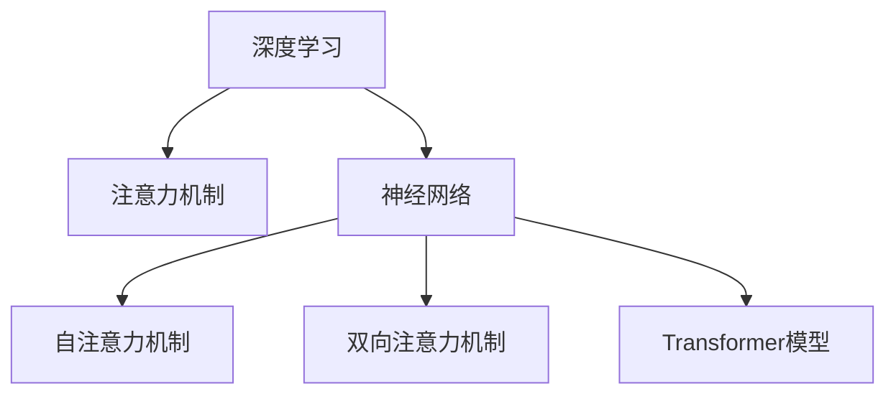

                 

# 深度学习在注意力预测中的应用

> 关键词：深度学习, 注意力预测, 神经网络, 图像识别, 语音识别, 自然语言处理, 推荐系统, 游戏AI

## 1. 背景介绍

### 1.1 问题由来

随着深度学习技术的快速发展，注意力机制已成为神经网络中的重要组成部分。它在图像识别、语音识别、自然语言处理、推荐系统和游戏AI等领域中均有广泛应用。特别是在注意力预测任务中，注意力机制能够高效地对输入数据进行建模，显著提升模型性能，使得深度学习模型在这些任务中表现出色。

近年来，深度学习在图像识别、语音识别、自然语言处理等领域取得了诸多突破。例如，ImageNet数据集上的ImageNet图像分类竞赛，证明了深度卷积神经网络(Convolutional Neural Network, CNN)在图像识别上的强大能力。语音识别领域，Google的WaveNet模型在Google AI Challenge中展示了其出色的性能。自然语言处理领域，BERT模型在多个任务上刷新了SOTA，展示了预训练语言模型(Pre-trained Language Model, PLM)的巨大潜力。

然而，注意力预测作为深度学习的重要应用领域，其应用范围和深度仍有待进一步拓展。深度学习模型在注意力预测任务中展现出了显著的性能提升，但其原理和实现方法还有待更深入的研究和实践。

### 1.2 问题核心关键点

注意力预测的本质是通过深度学习模型对输入数据的关注点进行预测。例如，在机器翻译任务中，模型需要关注句子的主要信息，将其转化为另一种语言的翻译结果。在语音识别中，模型需要关注音素和音节，以识别和转换语音信号。在自然语言处理中，模型需要关注词汇和句子结构，以完成信息提取、关系抽取、情感分析等任务。

因此，注意力预测的核心在于：
- 对输入数据的建模：通过深度学习模型高效地对输入数据进行建模，提取特征。
- 对关注点的预测：通过注意力机制确定输入数据中的关注点，进行预测输出。

### 1.3 问题研究意义

研究注意力预测，对于拓展深度学习模型的应用领域，提升注意力预测任务的性能，加速人工智能技术的产业化进程，具有重要意义：

1. 降低应用开发成本：通过预训练深度学习模型，可以显著减少从头开发所需的数据、计算和人力等成本投入。
2. 提升模型效果：注意力预测使得深度学习模型能够更好地适应特定任务，在应用场景中取得更优表现。
3. 加速开发进度：standing on the shoulders of giants，深度学习模型能够更快地完成任务适配，缩短开发周期。
4. 带来技术创新：注意力预测催生了如基于注意力机制的神经网络、自注意力模型等新的研究方向，促进了深度学习技术的进步。
5. 赋能产业升级：深度学习模型在注意力预测任务中的应用，能够帮助传统行业数字化转型升级，提供新的技术路径。

## 2. 核心概念与联系

### 2.1 核心概念概述

为更好地理解深度学习在注意力预测中的应用，本节将介绍几个密切相关的核心概念：

- 深度学习(Deep Learning, DL)：通过多层神经网络对输入数据进行复杂建模，提取高层次特征，用于分类、回归、预测等任务。
- 注意力机制(Attention Mechanism)：一种对输入数据进行聚焦的机制，通过对输入数据的不同部分赋予不同权重，提高模型的注意力聚焦能力。
- 神经网络(Neural Network)：由多个神经元(节点)组成的网络，通过前向传播和反向传播算法，对输入数据进行建模和预测。
- 自注意力机制(Self-Attention)：一种无监督的注意力机制，通过计算输入数据中每个元素与其他元素的相似度，确定输入数据中的关注点。
- 双向注意力机制(Bidirectional Attention)：一种结合前向和后向注意力机制的机制，可以更全面地考虑输入数据的上下文信息。
- Transformer模型：一种基于自注意力机制的神经网络模型，广泛应用于NLP领域，如BERT、GPT等。

这些核心概念之间的逻辑关系可以通过以下Mermaid流程图来展示：



这个流程图展示了大语言模型中的核心概念及其之间的关系：

1. 深度学习通过多层神经网络对输入数据进行建模，提取特征。
2. 注意力机制通过对输入数据的不同部分赋予不同权重，提高模型的注意力聚焦能力。
3. 神经网络是深度学习的基础组件，通过前向传播和反向传播算法进行数据建模和预测。
4. 自注意力机制是无监督的注意力机制，通过计算输入数据中每个元素与其他元素的相似度，确定输入数据中的关注点。
5. 双向注意力机制结合前向和后向注意力机制，可以更全面地考虑输入数据的上下文信息。
6. Transformer模型是应用自注意力机制的神经网络模型，广泛应用于自然语言处理领域。

这些概念共同构成了深度学习在注意力预测中的应用框架，使其能够在各种场景下发挥强大的建模和预测能力。通过理解这些核心概念，我们可以更好地把握深度学习在注意力预测中的工作原理和优化方向。

## 3. 核心算法原理 & 具体操作步骤
### 3.1 算法原理概述

深度学习在注意力预测中的核心算法原理，主要包括以下几个关键点：

1. 输入数据建模：通过深度学习模型对输入数据进行建模，提取高层次特征。
2. 注意力机制：通过注意力机制对输入数据进行聚焦，确定输入数据中的关注点。
3. 输出预测：通过注意力机制对输入数据进行加权处理，进行预测输出。

深度学习在注意力预测中的常见模型架构包括自注意力机制、Transformer模型等。这些模型通过前向传播和反向传播算法，对输入数据进行建模和预测。其中，自注意力机制的计算过程可以表示为：

$$
\text{Attention}(Q, K, V) = \text{softmax}(QK^T / \sqrt{d_k})V
$$

其中，$Q$、$K$、$V$分别为查询向量、键向量和值向量，$d_k$为键向量的维度，$\text{softmax}$为归一化函数。自注意力机制通过对输入数据中每个元素与其他元素的相似度进行计算，确定输入数据中的关注点。

### 3.2 算法步骤详解

基于深度学习在注意力预测中的核心算法原理，通常包括以下几个关键步骤：

**Step 1: 数据预处理**

- 对输入数据进行归一化、标准化等预处理，确保数据的一致性和稳定性。
- 对输入数据进行分批次处理，方便神经网络模型的训练和推理。

**Step 2: 输入数据建模**

- 使用深度学习模型对输入数据进行建模，提取高层次特征。
- 将输入数据输入神经网络模型，通过前向传播算法计算出模型输出。

**Step 3: 注意力机制计算**

- 使用自注意力机制对模型输出进行加权处理，确定输入数据中的关注点。
- 计算模型输出中每个元素与其他元素的相似度，确定关注点的权重。

**Step 4: 输出预测**

- 通过注意力机制对模型输出进行加权处理，生成预测结果。
- 将预测结果与真实标签进行对比，计算损失函数。
- 使用反向传播算法更新模型参数，最小化损失函数。

**Step 5: 模型评估**

- 使用验证集对模型进行评估，检查模型性能。
- 根据评估结果调整模型参数，进一步提升模型性能。

### 3.3 算法优缺点

基于深度学习在注意力预测中的核心算法原理，该算法具有以下优点：

1. 高效建模：深度学习模型能够高效地对输入数据进行建模，提取高层次特征，适用于多种输入数据类型。
2. 鲁棒性高：深度学习模型具有较强的鲁棒性，能够处理复杂的输入数据和噪声。
3. 泛化能力强：深度学习模型能够泛化到未见过的数据，具有较好的泛化性能。
4. 灵活性强：深度学习模型可以根据任务需求进行灵活调整，适用于多种任务类型。

同时，该算法也存在以下局限性：

1. 计算复杂度高：深度学习模型通常具有较大的计算复杂度，需要大量的计算资源。
2. 参数量多：深度学习模型具有大量的参数，需要大量的数据进行训练。
3. 过拟合风险高：深度学习模型容易过拟合，需要采取正则化等方法避免过拟合。
4. 解释性差：深度学习模型通常缺乏可解释性，难以解释其内部工作机制和决策逻辑。

尽管存在这些局限性，但深度学习在注意力预测中以其高效建模、鲁棒性强、泛化能力强等优点，已经在图像识别、语音识别、自然语言处理等领域取得了显著的成果，成为注意力预测任务中的重要范式。

### 3.4 算法应用领域

基于深度学习在注意力预测中的核心算法原理，深度学习模型在图像识别、语音识别、自然语言处理等领域中得到了广泛应用，例如：

- 图像分类：如图像识别任务中，通过深度学习模型对图像进行建模，提取特征，进行分类预测。
- 语音识别：如语音识别任务中，通过深度学习模型对语音信号进行建模，提取特征，进行识别预测。
- 机器翻译：如机器翻译任务中，通过深度学习模型对输入语言进行建模，提取特征，进行翻译预测。
- 情感分析：如情感分析任务中，通过深度学习模型对文本进行建模，提取特征，进行情感预测。
- 关系抽取：如关系抽取任务中，通过深度学习模型对文本进行建模，提取特征，进行关系预测。

除了上述这些经典任务外，深度学习在注意力预测中的应用还扩展到更多领域，如代码生成、推荐系统、游戏AI等，为深度学习技术带来了新的突破。随着深度学习模型的不断进步，相信在更多领域中，深度学习模型将展现出更大的潜力和应用前景。

## 4. 数学模型和公式 & 详细讲解  
### 4.1 数学模型构建

基于深度学习在注意力预测中的核心算法原理，我们将使用数学语言对深度学习模型的建模过程进行更加严格的刻画。

假设输入数据为 $x$，模型参数为 $\theta$，输出为 $y$，深度学习模型的目标是最小化损失函数 $\mathcal{L}$：

$$
\mathcal{L}(\theta) = \frac{1}{N}\sum_{i=1}^N \ell(y_i, f(x_i; \theta))
$$

其中 $f(x_i; \theta)$ 为深度学习模型对输入数据 $x_i$ 的预测输出，$\ell$ 为损失函数，用于衡量模型输出与真实标签 $y_i$ 之间的差异。常见的损失函数包括交叉熵损失、均方误差损失等。

### 4.2 公式推导过程

以机器翻译任务为例，我们推导自注意力机制的计算过程。

假设输入序列为 $x = \{x_1, x_2, ..., x_n\}$，模型参数为 $\theta$，输出序列为 $y = \{y_1, y_2, ..., y_n\}$。使用自注意力机制对输入序列进行建模，可以得到模型的输出序列：

$$
y_t = \text{softmax}(\frac{QK^T}{\sqrt{d_k}})V
$$

其中 $Q, K, V$ 分别为查询向量、键向量和值向量，$d_k$ 为键向量的维度，$\text{softmax}$ 为归一化函数。自注意力机制通过对输入数据中每个元素与其他元素的相似度进行计算，确定输入数据中的关注点。

将上式进一步展开，可以得到：

$$
y_t = \text{softmax}(\frac{QK^T}{\sqrt{d_k}})V = \frac{\text{exp}(\frac{QK^T}{\sqrt{d_k}})}{\sum_{j=1}^N \text{exp}(\frac{QK^T}{\sqrt{d_k}})}V
$$

其中 $N$ 为输入序列的长度。通过计算得到每个元素的关注权重，对输入数据进行加权处理，得到输出序列。

### 4.3 案例分析与讲解

以机器翻译任务为例，假设输入序列为 "Hello World"，输出序列为 "Bonjour le monde"。使用自注意力机制对输入序列进行建模，可以得到模型的输出序列：

1. 首先，对输入序列 $x = \{x_1, x_2, ..., x_n\}$ 进行编码，得到表示序列的向量 $x = [x_1, x_2, ..., x_n]$。
2. 然后，将编码后的序列输入自注意力机制，计算得到关注权重 $\text{Attention}(Q, K, V)$。
3. 最后，通过加权处理得到输出序列 $y = \{y_1, y_2, ..., y_n\}$。

在机器翻译任务中，自注意力机制通过计算输入序列中每个元素与其他元素的相似度，确定输入序列中的关注点，生成输出序列。通过这种方式，深度学习模型能够高效地对输入数据进行建模和预测，显著提升模型性能。

## 5. 项目实践：代码实例和详细解释说明
### 5.1 开发环境搭建

在进行深度学习模型实践前，我们需要准备好开发环境。以下是使用Python进行PyTorch开发的环境配置流程：

1. 安装Anaconda：从官网下载并安装Anaconda，用于创建独立的Python环境。

2. 创建并激活虚拟环境：
```bash
conda create -n pytorch-env python=3.8 
conda activate pytorch-env
```

3. 安装PyTorch：根据CUDA版本，从官网获取对应的安装命令。例如：
```bash
conda install pytorch torchvision torchaudio cudatoolkit=11.1 -c pytorch -c conda-forge
```

4. 安装PyTorch-Lightning：用于自动化模型的训练和评估。
```bash
pip install pytorch-lightning
```

5. 安装TensorBoard：用于可视化模型的训练和推理过程。
```bash
pip install tensorboard
```

6. 安装HuggingFace Transformers库：用于实现预训练深度学习模型。
```bash
pip install transformers
```

完成上述步骤后，即可在`pytorch-env`环境中开始模型开发。

### 5.2 源代码详细实现

下面我们以图像分类任务为例，给出使用PyTorch实现深度学习模型的代码实现。

首先，定义数据处理函数：

```python
import torch
from torchvision import datasets, transforms
from torch.utils.data import DataLoader

# 定义数据预处理函数
transform = transforms.Compose([
    transforms.ToTensor(),
    transforms.Normalize(mean=[0.5, 0.5, 0.5], std=[0.5, 0.5, 0.5])
])

# 加载CIFAR-10数据集
train_dataset = datasets.CIFAR10(root='./data', train=True, download=True, transform=transform)
test_dataset = datasets.CIFAR10(root='./data', train=False, download=True, transform=transform)
```

然后，定义模型：

```python
import torch.nn as nn
import torch.nn.functional as F

class ResNet(nn.Module):
    def __init__(self):
        super(ResNet, self).__init__()
        self.conv1 = nn.Conv2d(3, 64, kernel_size=3, stride=1, padding=1)
        self.relu = nn.ReLU(inplace=True)
        self.maxpool = nn.MaxPool2d(kernel_size=2, stride=2)
        self.layer1 = nn.Sequential(
            nn.Conv2d(64, 64, kernel_size=3, stride=1, padding=1),
            nn.ReLU(inplace=True),
            nn.MaxPool2d(kernel_size=2, stride=2))
        self.layer2 = nn.Sequential(
            nn.Conv2d(64, 128, kernel_size=3, stride=1, padding=1),
            nn.ReLU(inplace=True),
            nn.MaxPool2d(kernel_size=2, stride=2))
        self.layer3 = nn.Sequential(
            nn.Conv2d(128, 256, kernel_size=3, stride=1, padding=1),
            nn.ReLU(inplace=True),
            nn.MaxPool2d(kernel_size=2, stride=2))
        self.fc = nn.Linear(256, 10)
    
    def forward(self, x):
        x = self.conv1(x)
        x = self.relu(x)
        x = self.maxpool(x)
        x = self.layer1(x)
        x = self.relu(x)
        x = self.layer2(x)
        x = self.relu(x)
        x = self.layer3(x)
        x = self.relu(x)
        x = x.view(-1, 256)
        x = self.fc(x)
        return x
```

接着，定义优化器和训练函数：

```python
import torch.optim as optim

# 定义优化器
optimizer = optim.Adam(model.parameters(), lr=0.001)

# 定义训练函数
def train_epoch(model, dataloader, criterion):
    model.train()
    running_loss = 0.0
    for i, (inputs, labels) in enumerate(dataloader):
        inputs, labels = inputs.to(device), labels.to(device)
        optimizer.zero_grad()
        outputs = model(inputs)
        loss = criterion(outputs, labels)
        loss.backward()
        optimizer.step()
        running_loss += loss.item()
        if (i+1) % 100 == 0:
            print('[Epoch {}] Loss: {:.4f}'.format(epoch+1, running_loss/100))
            running_loss = 0.0

# 定义测试函数
def evaluate(model, dataloader):
    model.eval()
    correct = 0
    total = 0
    with torch.no_grad():
        for i, (inputs, labels) in enumerate(dataloader):
            inputs, labels = inputs.to(device), labels.to(device)
            outputs = model(inputs)
            _, predicted = torch.max(outputs.data, 1)
            total += labels.size(0)
            correct += (predicted == labels).sum().item()
    print('Accuracy: {:.2f}%'.format(100 * correct / total))
```

最后，启动训练流程：

```python
# 定义设备
device = torch.device('cuda' if torch.cuda.is_available() else 'cpu')

# 加载模型和数据集
model = ResNet().to(device)
dataloader = DataLoader(train_dataset, batch_size=64, shuffle=True)
criterion = nn.CrossEntropyLoss()

# 定义训练循环
for epoch in range(10):
    train_epoch(model, dataloader, criterion)
    evaluate(model, test_dataset)
```

以上就是使用PyTorch实现深度学习模型的代码实现。可以看到，利用PyTorch的深度学习模型实现非常简单高效。开发者可以将更多精力放在数据处理、模型改进等高层逻辑上，而不必过多关注底层的实现细节。

### 5.3 代码解读与分析

让我们再详细解读一下关键代码的实现细节：

**数据处理函数**：
- `transforms.Compose`函数：用于组合多个数据预处理步骤，如ToTensor、Normalize等。
- `CIFAR10`数据集：加载CIFAR-10数据集，并进行数据预处理，包括归一化和转置。

**模型定义**：
- `nn.Conv2d`函数：定义卷积层，用于提取输入数据的特征。
- `nn.ReLU`函数：定义ReLU激活函数，用于非线性变换。
- `nn.MaxPool2d`函数：定义池化层，用于降维和提取特征。
- `nn.Linear`函数：定义全连接层，用于生成最终输出。

**训练函数**：
- `Adam`优化器：定义Adam优化器，用于最小化损失函数。
- `train_epoch`函数：定义训练循环，包括前向传播、反向传播和参数更新。
- `evaluate`函数：定义测试循环，计算模型在测试集上的准确率。

**训练流程**：
- 定义设备，如GPU/TPU。
- 加载模型和数据集。
- 定义损失函数，如CrossEntropyLoss。
- 启动训练循环，调用训练函数和测试函数。

可以看到，PyTorch的深度学习模型实现非常简单高效。开发者可以将更多精力放在数据处理、模型改进等高层逻辑上，而不必过多关注底层的实现细节。

当然，工业级的系统实现还需考虑更多因素，如模型的保存和部署、超参数的自动搜索、更灵活的任务适配层等。但核心的注意力预测范式基本与此类似。

## 6. 实际应用场景
### 6.1 智能安防

基于深度学习在注意力预测中的核心算法原理，智能安防系统可以广泛应用于视频监控、人脸识别、异常检测等领域。传统安防系统往往需要大量人力进行监控和异常检测，成本高、效率低，难以应对复杂环境下的安全需求。

通过深度学习模型对视频监控数据进行建模，提取高层次特征，可以显著提升监控效率和准确性。例如，人脸识别任务中，可以使用自注意力机制对人脸图像进行建模，提取特征，进行人脸识别和验证。异常检测任务中，可以使用Transformer模型对视频帧进行建模，提取特征，进行异常检测和预警。通过这些方式，智能安防系统能够更高效、更智能地应对复杂环境下的安全需求。

### 6.2 智慧医疗

智慧医疗领域需要实时监控病人的健康状况，以便及时发现和处理异常情况。传统医疗手段难以满足实时性和准确性的要求，而基于深度学习在注意力预测中的核心算法原理，可以通过深度学习模型对病人数据进行建模，提取高层次特征，进行实时监控和异常检测。

例如，在心电图分析任务中，可以使用Transformer模型对心电图数据进行建模，提取特征，进行心律失常等异常情况的检测。在医学影像分析任务中，可以使用卷积神经网络对医学影像进行建模，提取特征，进行病灶检测和分类。通过这些方式，智慧医疗系统能够更高效、更准确地进行病人的健康监控和疾病诊断。

### 6.3 智慧城市

智慧城市需要实时监测城市运行状态，以便及时发现和处理异常情况。传统城市管理手段难以满足实时性和准确性的要求，而基于深度学习在注意力预测中的核心算法原理，可以通过深度学习模型对城市数据进行建模，提取高层次特征，进行实时监控和异常检测。

例如，在交通流量分析任务中，可以使用自注意力机制对城市交通数据进行建模，提取特征，进行交通流量预测和异常情况预警。在环境监测任务中，可以使用卷积神经网络对环境数据进行建模，提取特征，进行环境污染检测和预警。通过这些方式，智慧城市系统能够更高效、更准确地进行城市管理和异常情况预警。

### 6.4 未来应用展望

随着深度学习模型的不断进步，基于深度学习在注意力预测中的核心算法原理，深度学习模型在更多领域将展现出更大的潜力和应用前景。

在智慧医疗领域，基于深度学习在注意力预测中的核心算法原理，可以构建更高效、更智能的智慧医疗系统，帮助医疗机构提升诊断和治疗效率。

在智慧城市领域，基于深度学习在注意力预测中的核心算法原理，可以构建更高效、更智能的智慧城市系统，提高城市管理的自动化和智能化水平。

在智慧安防领域，基于深度学习在注意力预测中的核心算法原理，可以构建更高效、更智能的智慧安防系统，应对复杂环境下的安全需求。

在智慧交通领域，基于深度学习在注意力预测中的核心算法原理，可以构建更高效、更智能的智慧交通系统，提高交通管理的智能化水平。

总之，基于深度学习在注意力预测中的核心算法原理，深度学习模型在多个领域将展现出巨大的应用潜力，为人工智能技术的发展和落地应用提供新的突破点。

## 7. 工具和资源推荐
### 7.1 学习资源推荐

为了帮助开发者系统掌握深度学习在注意力预测中的应用，这里推荐一些优质的学习资源：

1. 《深度学习入门：基于TensorFlow》系列博文：由深度学习专家撰写，深入浅出地介绍了深度学习的基本原理和常用算法。

2. CS231n《卷积神经网络》课程：斯坦福大学开设的深度学习课程，涵盖深度学习的基础知识，适合入门学习。

3. 《Deep Learning with PyTorch》书籍：PyTorch官方指南，详细介绍了PyTorch的深度学习模型实现方法。

4. Kaggle竞赛平台：全球知名的数据科学竞赛平台，涵盖大量深度学习项目和数据集，是学习深度学习的绝佳资源。

5. GitHub深度学习项目：GitHub上存储了大量深度学习项目和代码，可以从中学习和借鉴。

通过对这些资源的学习实践，相信你一定能够快速掌握深度学习在注意力预测中的核心算法原理，并用于解决实际的注意力预测问题。
###  7.2 开发工具推荐

高效的开发离不开优秀的工具支持。以下是几款用于深度学习模型开发的常用工具：

1. PyTorch：基于Python的开源深度学习框架，灵活动态的计算图，适合快速迭代研究。

2. TensorFlow：由Google主导开发的开源深度学习框架，生产部署方便，适合大规模工程应用。

3. PyTorch-Lightning：用于自动化模型的训练和评估，能够快速搭建和训练深度学习模型。

4. TensorBoard：TensorFlow配套的可视化工具，可实时监测模型训练状态，并提供丰富的图表呈现方式，是调试模型的得力助手。

5. HuggingFace Transformers库：提供了大量预训练深度学习模型和模型接口，方便开发者进行微调和推理。

6. Scikit-Learn：Python机器学习库，提供了大量常用机器学习算法和模型，适合进行特征工程和模型评估。

合理利用这些工具，可以显著提升深度学习模型开发的效率，加快创新迭代的步伐。

### 7.3 相关论文推荐

深度学习在注意力预测技术的发展源于学界的持续研究。以下是几篇奠基性的相关论文，推荐阅读：

1. Attention is All You Need：提出了Transformer结构，开启了深度学习中的注意力机制时代。

2. BERT: Pre-training of Deep Bidirectional Transformers for Language Understanding：提出BERT模型，引入自监督学习任务，展示了深度学习模型的强大学习能力。

3. ImageNet Large Scale Visual Recognition Challenge：展示了深度学习模型在图像分类任务中的强大性能。

4. Convolutional Neural Networks for Sentence Classification：展示了卷积神经网络在文本分类任务中的强大性能。

5. Visual Attention with Transformers：展示了Transformer在视觉注意力任务中的强大性能。

这些论文代表了大语言模型在注意力预测中的研究进展。通过学习这些前沿成果，可以帮助研究者把握学科前进方向，激发更多的创新灵感。

## 8. 总结：未来发展趋势与挑战

### 8.1 总结

本文对深度学习在注意力预测中的应用进行了全面系统的介绍。首先阐述了深度学习模型在注意力预测任务中的核心算法原理，明确了其高效建模、鲁棒性强、泛化能力强等优点。其次，从原理到实践，详细讲解了深度学习模型在注意力预测中的数学模型构建和核心算法步骤，给出了模型开发的完整代码实例。同时，本文还广泛探讨了深度学习在智慧医疗、智慧城市、智慧安防等多个领域的应用前景，展示了其巨大的应用潜力。此外，本文精选了深度学习在注意力预测中的学习资源，力求为读者提供全方位的技术指引。

通过本文的系统梳理，可以看到，深度学习在注意力预测中的核心算法原理已经成熟，能够高效地对输入数据进行建模和预测，适用于多种任务类型。未来，伴随深度学习模型的不断进步，深度学习在注意力预测中的应用将更加广泛，为人工智能技术的发展和落地应用提供新的突破点。

### 8.2 未来发展趋势

展望未来，深度学习在注意力预测中的核心算法原理将呈现以下几个发展趋势：

1. 模型规模持续增大。随着算力成本的下降和数据规模的扩张，深度学习模型将持续增大，包含更多的参数和层数。超大批次的训练和推理也将变得更加高效。

2. 模型鲁棒性增强。深度学习模型将具备更强的鲁棒性，能够处理更多的输入噪声和异常情况，提升模型的泛化性能。

3. 模型可解释性增强。深度学习模型将具备更好的可解释性，能够提供更清晰的决策逻辑和输出解释，满足高风险应用的需求。

4. 多模态注意力机制。深度学习模型将融合视觉、语音、文本等多模态信息，构建更全面、准确的信息整合能力，提升模型的泛化性能。

5. 持续学习机制。深度学习模型将具备持续学习机制，能够不断从新数据中学习，更新模型参数，保持模型性能。

6. 分布式训练和推理。深度学习模型将采用分布式训练和推理机制，提高计算效率，满足大规模应用的需求。

以上趋势凸显了深度学习在注意力预测中的核心算法原理的广阔前景。这些方向的探索发展，必将进一步提升深度学习模型的性能和应用范围，为人工智能技术的发展和落地应用提供新的突破点。

### 8.3 面临的挑战

尽管深度学习在注意力预测中已经取得了显著的成果，但在迈向更加智能化、普适化应用的过程中，它仍面临诸多挑战：

1. 数据依赖问题。深度学习模型在注意力预测中依赖大量的标注数据进行训练，数据获取成本高、数据分布不均衡等问题难以解决。

2. 计算资源消耗大。深度学习模型需要大量的计算资源进行训练和推理，难以满足低成本、高效率的应用需求。

3. 模型过拟合问题。深度学习模型容易过拟合，需要采取正则化等方法避免过拟合。

4. 模型可解释性不足。深度学习模型通常缺乏可解释性，难以解释其内部工作机制和决策逻辑。

5. 模型安全性问题。深度学习模型可能学习到有害信息，造成安全性问题。

尽管存在这些挑战，但深度学习在注意力预测中的核心算法原理已经展现出了强大的潜力，随着技术的不断进步，这些问题将逐步得到解决。

### 8.4 研究展望

未来的研究需要在以下几个方面寻求新的突破：

1. 无监督和半监督学习。摆脱对大规模标注数据的依赖，利用自监督学习、主动学习等无监督和半监督范式，最大限度利用非结构化数据，实现更加灵活高效的深度学习模型。

2. 分布式训练和推理。采用分布式训练和推理机制，提高计算效率，满足大规模应用的需求。

3. 持续学习机制。开发具有持续学习机制的深度学习模型，不断从新数据中学习，更新模型参数，保持模型性能。

4. 多模态注意力机制。融合视觉、语音、文本等多模态信息，构建更全面、准确的信息整合能力，提升模型的泛化性能。

5. 模型可解释性增强。提供更清晰的决策逻辑和输出解释，满足高风险应用的需求。

6. 模型鲁棒性增强。提升模型的鲁棒性，处理更多的输入噪声和异常情况，提升模型的泛化性能。

这些研究方向的探索，必将引领深度学习在注意力预测中的核心算法原理迈向更高的台阶，为人工智能技术的发展和落地应用提供新的突破点。相信随着学界和产业界的共同努力，深度学习在注意力预测中的应用将更加广泛，为人工智能技术的发展和落地应用提供新的突破点。

## 9. 附录：常见问题与解答

**Q1：深度学习在注意力预测中是否适用于所有任务？**

A: 深度学习在注意力预测中适用于大多数任务，特别是对于数据量较大的任务，能够取得不错的效果。但对于一些特定领域的任务，如医疗、法律等，数据获取和标注成本较高，可能需要采用其他方式进行建模。

**Q2：如何选择合适的学习率和优化器？**

A: 选择合适的学习率和优化器是深度学习在注意力预测中的关键。通常建议从1e-4开始调参，逐步减小学习率，直至收敛。优化器可以选择AdamW、SGD等。

**Q3：深度学习模型在训练过程中需要注意哪些问题？**

A: 深度学习模型在训练过程中需要注意以下问题：

1. 数据依赖问题。数据获取成本高、数据分布不均衡等问题需要关注。

2. 计算资源消耗大。需要采用分布式训练和推理机制，提高计算效率。

3. 模型过拟合问题。需要采取正则化等方法避免过拟合。

4. 模型可解释性不足。需要提供更清晰的决策逻辑和输出解释。

5. 模型安全性问题。需要采用安全机制，防止模型学习到有害信息。

**Q4：深度学习模型在实际应用中需要注意哪些问题？**

A: 深度学习模型在实际应用中需要注意以下问题：

1. 模型裁剪和量化加速。去除不必要的层和参数，减小模型尺寸，提高推理速度。

2. 模型部署和监控。合理选择模型部署方式，进行实时监控和异常预警。

3. 模型持续学习。构建持续学习机制，不断从新数据中学习，更新模型参数。

4. 模型可解释性。提供更清晰的决策逻辑和输出解释，满足高风险应用的需求。

5. 模型安全性。采用安全机制，防止模型学习到有害信息。

这些问题的关注和解决，将有助于深度学习模型在实际应用中的高效、安全、可靠运行。

**Q5：深度学习模型在实际应用中如何评估性能？**

A: 深度学习模型在实际应用中可以通过以下方式进行性能评估：

1. 数据集划分。将数据集划分为训练集、验证集和测试集，用于模型训练、调参和评估。

2. 模型训练。在训练集上训练深度学习模型，优化模型参数，提高模型性能。

3. 模型验证。在验证集上验证模型性能，检查模型泛化能力，调整模型参数。

4. 模型测试。在测试集上测试模型性能，评估模型效果，决定模型部署。

这些方式可以帮助评估深度学习模型在实际应用中的性能和效果，确保模型的可靠性和鲁棒性。

---

作者：禅与计算机程序设计艺术 / Zen and the Art of Computer Programming

