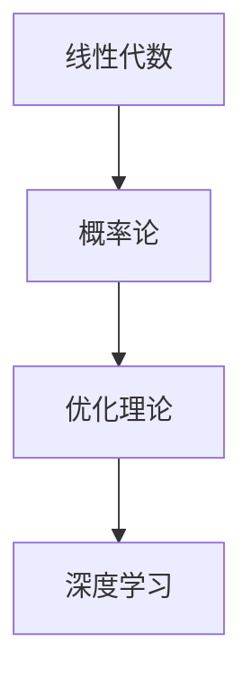

                 

# 深度学习数学基础：线性代数、概率论和优化理论

> 关键词：深度学习, 线性代数, 概率论, 优化理论, 梯度下降, 反向传播, 正则化

## 1. 背景介绍

深度学习（Deep Learning）作为人工智能领域的核心技术之一，正在被广泛应用到各种场景中，包括计算机视觉、自然语言处理、语音识别等。然而，深度学习算法的核心在于其数学基础，特别是线性代数、概率论和优化理论。本文将详细探讨这些数学基础，以期帮助读者更好地理解和掌握深度学习算法。

## 2. 核心概念与联系

### 2.1 核心概念概述

为了更好地理解深度学习的数学基础，我们将详细解释几个关键概念：

- **线性代数**：线性代数是数学的一个分支，主要研究向量和矩阵及其运算。在深度学习中，向量表示输入数据，矩阵表示模型参数，而向量运算和矩阵乘法则是深度学习的核心运算。

- **概率论**：概率论是研究随机事件及其概率的数学分支。在深度学习中，概率论被用来描述数据的不确定性和模型的输出概率。

- **优化理论**：优化理论主要研究如何求解最优化问题，其目标是找到函数的最小值或最大值。在深度学习中，优化理论用于训练神经网络，找到最优的模型参数。

### 2.2 核心概念原理和架构的 Mermaid 流程图



这个流程图展示了深度学习的数学基础中，线性代数、概率论和优化理论之间的关系。线性代数提供了矩阵和向量的基本运算，概率论描述了数据和模型的统计特性，而优化理论用于求解深度学习模型的最优参数。

## 3. 核心算法原理 & 具体操作步骤

### 3.1 算法原理概述

深度学习算法基于神经网络模型，其核心在于通过反向传播算法进行模型参数的优化。反向传播算法通过链式法则计算梯度，并更新模型参数，以最小化损失函数。

### 3.2 算法步骤详解

#### 3.2.1 数据准备

首先，需要将原始数据转换为神经网络可以处理的向量形式。这包括将图像数据展开为向量，将文本数据转化为词向量等。

#### 3.2.2 模型构建

然后，构建神经网络模型。通常包括输入层、隐藏层和输出层。隐藏层包含多个神经元，每个神经元接收前一层的输出，并产生下一层的输入。

#### 3.2.3 损失函数定义

定义一个损失函数来度量模型预测与真实标签之间的差异。常用的损失函数包括均方误差、交叉熵等。

#### 3.2.4 反向传播

使用反向传播算法计算梯度，并更新模型参数。反向传播算法将损失函数对模型参数的梯度反向传递回输入层，从而更新每个神经元的权重。

#### 3.2.5 优化算法

选择一种优化算法，如梯度下降法、Adam等，来更新模型参数。优化算法通过调整学习率、动量等超参数，使得损失函数最小化。

### 3.3 算法优缺点

深度学习的优点在于其强大的表达能力和自适应能力，能够自动学习复杂的特征表示。但同时，深度学习也存在一些缺点，如需要大量标注数据、训练时间长、模型可解释性差等。

### 3.4 算法应用领域

深度学习在计算机视觉、自然语言处理、语音识别等领域都有广泛应用。例如，卷积神经网络（CNN）被用于图像分类和目标检测，循环神经网络（RNN）被用于语言建模和机器翻译，而生成对抗网络（GAN）被用于图像生成和图像修复等。

## 4. 数学模型和公式 & 详细讲解 & 举例说明

### 4.1 数学模型构建

深度学习模型通常由输入层、多个隐藏层和输出层组成。输入层接收原始数据，隐藏层通过一系列的矩阵乘法和非线性激活函数进行特征提取，输出层则将特征映射为预测结果。

### 4.2 公式推导过程

以一个简单的全连接神经网络为例，其数学模型可以表示为：

$$
y = f(Wx + b)
$$

其中，$x$ 表示输入数据，$W$ 表示权重矩阵，$b$ 表示偏置项，$f$ 表示激活函数。在反向传播算法中，损失函数 $L$ 对模型参数 $W$ 和 $b$ 的梯度可以通过链式法则计算得到：

$$
\frac{\partial L}{\partial W} = \frac{\partial L}{\partial y} \frac{\partial y}{\partial W} = \frac{\partial L}{\partial y} f'(Wx + b)
$$

$$
\frac{\partial L}{\partial b} = \frac{\partial L}{\partial y} f'(Wx + b)
$$

其中，$f'(z)$ 表示激活函数的导数。

### 4.3 案例分析与讲解

以手写数字识别为例，神经网络模型可以表示为：

$$
y = f(Wx + b)
$$

其中，$x$ 表示输入的28x28像素图像，$y$ 表示对应的10个数字标签。通过反向传播算法，可以更新模型参数 $W$ 和 $b$，使得模型能够准确预测手写数字。

## 5. 项目实践：代码实例和详细解释说明

### 5.1 开发环境搭建

在搭建深度学习开发环境时，需要使用Python编程语言和常用的深度学习框架，如TensorFlow、PyTorch等。还需要安装NumPy、Pandas、Scikit-learn等科学计算库。

### 5.2 源代码详细实现

以下是一个简单的全连接神经网络的Python代码实现，使用PyTorch框架：

```python
import torch
import torch.nn as nn
import torch.optim as optim

# 定义神经网络模型
class Net(nn.Module):
    def __init__(self):
        super(Net, self).__init__()
        self.fc1 = nn.Linear(784, 500)
        self.fc2 = nn.Linear(500, 10)
        
    def forward(self, x):
        x = x.view(-1, 784)
        x = torch.relu(self.fc1(x))
        x = self.fc2(x)
        return x

# 准备数据集
train_loader = torch.utils.data.DataLoader(train_dataset, batch_size=64, shuffle=True)
test_loader = torch.utils.data.DataLoader(test_dataset, batch_size=64, shuffle=False)

# 定义模型和优化器
net = Net()
optimizer = optim.SGD(net.parameters(), lr=0.01)
criterion = nn.CrossEntropyLoss()

# 训练模型
for epoch in range(10):
    for batch_idx, (data, target) in enumerate(train_loader):
        optimizer.zero_grad()
        output = net(data)
        loss = criterion(output, target)
        loss.backward()
        optimizer.step()
        
# 测试模型
correct = 0
total = 0
with torch.no_grad():
    for data, target in test_loader:
        output = net(data)
        _, predicted = torch.max(output.data, 1)
        total += target.size(0)
        correct += (predicted == target).sum().item()
        
print('Accuracy of the network on the 10000 test images: %d %%' % (100 * correct / total))
```

### 5.3 代码解读与分析

上述代码实现了全连接神经网络的训练和测试过程。首先，定义了神经网络模型和数据集。然后，使用SGD优化器对模型进行训练，交叉熵损失函数作为模型训练的评价指标。最后，测试模型的准确率。

## 6. 实际应用场景

### 6.1 计算机视觉

在计算机视觉领域，深度学习被广泛用于图像分类、目标检测、图像分割等任务。例如，使用卷积神经网络（CNN）进行图像分类，使用区域卷积网络（R-CNN）进行目标检测。

### 6.2 自然语言处理

在自然语言处理领域，深度学习被用于文本分类、情感分析、机器翻译等任务。例如，使用循环神经网络（RNN）进行文本分类，使用Transformer模型进行机器翻译。

### 6.3 语音识别

在语音识别领域，深度学习被用于语音识别、语音合成等任务。例如，使用卷积神经网络（CNN）进行语音识别，使用循环神经网络（RNN）进行语音合成。

## 7. 工具和资源推荐

### 7.1 学习资源推荐

1. **《深度学习》（Ian Goodfellow等著）**：全面介绍深度学习的原理和应用，适合初学者和专业人士。

2. **《TensorFlow官方文档》**：详细介绍TensorFlow的使用方法和API，是深度学习开发的必备资源。

3. **《PyTorch官方文档》**：详细介绍PyTorch的使用方法和API，适合深度学习开发的进阶学习。

4. **Coursera深度学习课程**：由斯坦福大学Andrew Ng教授讲授，适合初学者入门。

5. **DeepLearning.AI深度学习课程**：由深度学习领域的知名专家讲授，适合深度学习进阶学习。

### 7.2 开发工具推荐

1. **TensorFlow**：由Google开发的深度学习框架，支持分布式计算，适用于大规模模型训练。

2. **PyTorch**：由Facebook开发的深度学习框架，支持动态计算图，适合快速原型开发。

3. **Keras**：基于TensorFlow和Theano的高级API，易于上手，适合快速原型开发。

4. **MXNet**：由Amazon开发的深度学习框架，支持分布式计算，适用于大规模模型训练。

### 7.3 相关论文推荐

1. **《深度学习》（Ian Goodfellow等著）**：全面介绍深度学习的原理和应用，适合初学者和专业人士。

2. **《TensorFlow官方文档》**：详细介绍TensorFlow的使用方法和API，是深度学习开发的必备资源。

3. **《PyTorch官方文档》**：详细介绍PyTorch的使用方法和API，适合深度学习开发的进阶学习。

4. **Coursera深度学习课程**：由斯坦福大学Andrew Ng教授讲授，适合初学者入门。

5. **DeepLearning.AI深度学习课程**：由深度学习领域的知名专家讲授，适合深度学习进阶学习。

## 8. 总结：未来发展趋势与挑战

### 8.1 研究成果总结

深度学习技术在计算机视觉、自然语言处理、语音识别等领域取得了显著成果，推动了人工智能技术的发展。未来，深度学习将继续在这些领域发挥重要作用，并拓展到更多的新兴领域，如自动驾驶、医疗诊断等。

### 8.2 未来发展趋势

未来，深度学习的发展趋势包括：

1. **模型规模增大**：随着算力的提升，深度学习模型的规模将继续增大，能够处理更加复杂的任务。

2. **模型结构优化**：未来的深度学习模型将更加高效，能够处理更大规模的数据，提高计算效率。

3. **数据驱动**：未来的深度学习将更加依赖于大规模数据，通过数据驱动的方式进行模型训练。

4. **跨领域应用**：深度学习将更加广泛地应用于各个领域，推动跨领域的创新和应用。

### 8.3 面临的挑战

尽管深度学习技术取得了显著进展，但仍面临一些挑战，包括：

1. **数据需求**：深度学习需要大量的标注数据，获取高质量标注数据的成本较高。

2. **模型复杂度**：深度学习模型的复杂度较高，训练和推理速度较慢。

3. **模型可解释性**：深度学习模型的黑盒特性使得其可解释性较差，难以进行有效的调试和优化。

### 8.4 研究展望

未来的研究应重点关注以下几个方面：

1. **数据增强**：通过数据增强技术，提高数据多样性，减少数据需求。

2. **模型压缩**：通过模型压缩技术，提高计算效率，降低模型复杂度。

3. **可解释性**：通过可解释性技术，提高模型的可解释性，便于调试和优化。

4. **跨领域应用**：推动深度学习在更多领域的应用，拓展深度学习的边界。

总之，深度学习的未来发展前景广阔，但也需要不断克服挑战，推动技术的进步。只有在这些方面的不断探索和创新，才能使深度学习技术在未来发挥更大的作用。

## 9. 附录：常见问题与解答

### 9.1 常见问题

**Q1: 深度学习算法中为什么需要反向传播算法？**

**A1:** 反向传播算法用于计算损失函数对模型参数的梯度，从而更新模型参数，使得模型输出与真实标签尽可能接近。反向传播算法基于链式法则，能够高效地计算梯度，并更新模型参数。

**Q2: 深度学习算法中如何防止过拟合？**

**A2:** 防止过拟合的方法包括：数据增强、正则化、Dropout等。数据增强可以增加数据多样性，防止模型对训练数据过度拟合；正则化可以通过惩罚模型复杂度，防止模型对训练数据过度拟合；Dropout可以随机关闭一些神经元，防止模型对某些特征过度依赖。

**Q3: 深度学习算法中如何优化模型参数？**

**A3:** 深度学习算法通常使用梯度下降算法优化模型参数。梯度下降算法通过不断迭代更新模型参数，使得损失函数最小化。常用的梯度下降算法包括批量梯度下降（BGD）、随机梯度下降（SGD）、动量梯度下降（Momentum）等。

**Q4: 深度学习算法中如何处理缺失数据？**

**A4:** 处理缺失数据的方法包括：均值填补、中位数填补、KNN填补等。均值填补将缺失值替换为该特征的均值，中位数填补将缺失值替换为该特征的中位数，KNN填补通过寻找与缺失值最相似的样本进行填补。

**Q5: 深度学习算法中如何处理类别不平衡数据？**

**A5:** 处理类别不平衡数据的方法包括：过采样、欠采样、SMOTE等。过采样可以通过复制少数类别样本来平衡数据，欠采样可以通过删除多数类别样本来平衡数据，SMOTE可以通过生成合成样本来平衡数据。

总之，深度学习算法在实际应用中需要根据具体问题进行选择和优化，通过不断实践和探索，才能取得更好的效果。

