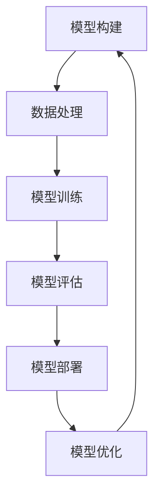

                 

# 深度学习框架原理与代码实战案例讲解

> 关键词：深度学习框架,PyTorch, TensorFlow, Keras, ONNX, 模型部署, 自动化机器学习, 实战案例

## 1. 背景介绍

深度学习作为人工智能的核心技术之一，在图像、语音、自然语言处理等领域展现了强大的应用潜力。然而，深度学习的模型复杂度高，训练数据需求大，模型的构建、训练和部署涉及到多种工具和库的协作，这对开发者提出了极高的要求。因此，深度学习框架应运而生，它们提供了强大的工具库和高效的操作界面，大大降低了深度学习的开发门槛，使得深度学习得以快速落地应用。

本文将围绕深度学习框架展开，先介绍常见深度学习框架，然后结合实际案例，详细讲解其在深度学习开发、训练和部署中的使用方法。通过本文的学习，你将掌握深度学习框架的原理与代码实战技巧，提升深度学习项目的开发效率和质量。

## 2. 核心概念与联系

### 2.1 核心概念概述

为了更好地理解深度学习框架，我们先从一些核心概念入手：

- **深度学习框架**：一种为深度学习模型的设计、训练和部署提供高度抽象的工具集，使得开发者可以方便地进行模型构建、数据处理、优化器选择、模型评估等操作。常见深度学习框架包括PyTorch、TensorFlow、Keras等。
- **模型构建**：使用深度学习框架提供的接口，设计并搭建深度学习模型。如定义输入层、隐藏层、输出层，选择激活函数、优化器、损失函数等。
- **数据处理**：对训练数据和测试数据进行预处理，如数据增强、数据标准化、数据归一化等，使得模型能够更好地学习数据分布。
- **模型训练**：使用深度学习框架提供的优化器算法，如梯度下降、Adam、Adagrad等，对模型进行迭代训练，更新模型参数以最小化损失函数。
- **模型评估**：使用测试数据集对训练好的模型进行性能评估，常用的评估指标包括准确率、召回率、F1-score等。
- **模型部署**：将训练好的模型封装成标准化的形式，部署到不同的硬件平台（如CPU、GPU、移动设备）和软件环境（如云端、本地、嵌入式系统）中。

这些核心概念之间的关系可以通过以下Mermaid流程图来展示：



这个流程图展示了深度学习开发的全流程：从模型构建开始，经过数据处理、模型训练、模型评估，最终完成模型部署。其中，模型优化是一个循环迭代的过程，不断优化模型以提升性能。

## 3. 核心算法原理 & 具体操作步骤

### 3.1 算法原理概述

深度学习框架提供的核心算法包括：

- **自动微分**：自动微分算法，如反向传播算法，用于计算模型参数的梯度。
- **优化算法**：用于更新模型参数，使得损失函数最小化。如梯度下降算法、Adam算法等。
- **正则化**：用于避免模型过拟合，如L1正则化、L2正则化、Dropout等。
- **数据增强**：通过对训练数据进行变换，扩充数据集。如图像旋转、翻转、裁剪等。
- **模型集成**：将多个模型的预测结果进行加权平均，提升模型性能。

这些算法的原理和使用方法将在后面的章节中进行详细介绍。

### 3.2 算法步骤详解

以PyTorch框架为例，介绍深度学习模型的构建、训练和部署步骤：

**Step 1: 环境搭建**

首先，需要安装Python和相关深度学习框架，如PyTorch。可以使用以下命令进行安装：

```bash
pip install torch torchvision torchaudio
```

**Step 2: 模型构建**

定义模型的结构，如卷积神经网络（CNN）、循环神经网络（RNN）、变分自编码器（VAE）等。这里以简单的线性回归模型为例，展示模型构建过程：

```python
import torch.nn as nn
import torch.optim as optim

# 定义线性回归模型
class LinearRegression(nn.Module):
    def __init__(self, input_size, output_size):
        super(LinearRegression, self).__init__()
        self.linear = nn.Linear(input_size, output_size)

    def forward(self, x):
        out = self.linear(x)
        return out

# 创建模型实例
model = LinearRegression(input_size=1, output_size=1)
```

**Step 3: 数据处理**

对训练数据和测试数据进行预处理，包括数据标准化、数据归一化等。这里以MNIST手写数字识别为例，展示数据预处理过程：

```python
import torch
import torchvision
import torchvision.transforms as transforms

# 定义数据预处理方式
transform = transforms.Compose([
    transforms.ToTensor(),
    transforms.Normalize((0.5,), (0.5,))
])

# 加载MNIST数据集
trainset = torchvision.datasets.MNIST(root='./data', train=True, download=True, transform=transform)
trainloader = torch.utils.data.DataLoader(trainset, batch_size=64, shuffle=True)

# 加载测试数据集
testset = torchvision.datasets.MNIST(root='./data', train=False, download=True, transform=transform)
testloader = torch.utils.data.DataLoader(testset, batch_size=64, shuffle=False)
```

**Step 4: 模型训练**

使用深度学习框架提供的优化器算法进行模型训练。这里以Adam优化器和均方误差（MSE）损失函数为例，展示模型训练过程：

```python
# 定义损失函数
criterion = nn.MSELoss()

# 定义优化器
optimizer = optim.Adam(model.parameters(), lr=0.01)

# 模型训练过程
for epoch in range(10):
    running_loss = 0.0
    for i, data in enumerate(trainloader, 0):
        inputs, labels = data
        optimizer.zero_grad()
        outputs = model(inputs)
        loss = criterion(outputs, labels)
        loss.backward()
        optimizer.step()
        running_loss += loss.item()
        if i % 100 == 99:
            print('[%d, %5d] loss: %.3f' % (epoch + 1, i + 1, running_loss / 100))
            running_loss = 0.0
```

**Step 5: 模型评估**

使用测试数据集对训练好的模型进行性能评估，以MNIST手写数字识别为例，展示模型评估过程：

```python
# 定义评估函数
def evaluate(model, testloader):
    correct = 0
    total = 0
    with torch.no_grad():
        for data in testloader:
            images, labels = data
            outputs = model(images)
            _, predicted = torch.max(outputs.data, 1)
            total += labels.size(0)
            correct += (predicted == labels).sum().item()
    print('Accuracy of the network on the 10000 test images: %d %%' % (100 * correct / total))

# 模型评估过程
evaluate(model, testloader)
```

**Step 6: 模型部署**

将训练好的模型部署到不同的硬件平台和软件环境中进行应用。这里以部署到CPU和GPU为例，展示模型部署过程：

```python
# 将模型部署到CPU
model_cpu = model.to('cpu')

# 将模型部署到GPU
model_cuda = model.cuda()

# 使用CPU部署的模型进行预测
inputs_cpu = inputs.to('cpu')
outputs_cpu = model_cpu(inputs_cpu)

# 使用GPU部署的模型进行预测
inputs_cuda = inputs.to('cuda')
outputs_cuda = model_cuda(inputs_cuda)
```

以上步骤展示了深度学习模型从构建、训练到部署的全过程，具体实现方式会根据不同的深度学习框架和模型结构有所不同。

### 3.3 算法优缺点

深度学习框架的优势包括：

- **高层次抽象**：提供了高层次的API，降低了深度学习的开发门槛。
- **高效计算**：优化了计算图和自动微分算法，提高了模型的训练速度。
- **丰富的工具库**：提供了丰富的工具库和插件，如数据处理、模型可视化等。

深度学习框架的缺点包括：

- **学习成本高**：框架的使用需要一定的学习成本，特别是对新手而言。
- **调试困难**：深度学习模型的调试过程复杂，需要多方面的知识和技能。
- **依赖性强**：深度学习框架的性能依赖于底层硬件和操作系统，可能存在兼容性问题。

## 4. 数学模型和公式 & 详细讲解 & 举例说明

### 4.1 数学模型构建

以线性回归模型为例，其数学模型可以表示为：

$$ y = \mathbf{X} \mathbf{w} + b $$

其中，$y$ 为输出向量，$\mathbf{X}$ 为输入矩阵，$\mathbf{w}$ 为权重向量，$b$ 为偏置项。

### 4.2 公式推导过程

线性回归模型的损失函数为均方误差（MSE）：

$$ \mathcal{L} = \frac{1}{2N} \sum_{i=1}^N (y_i - \mathbf{X}_i \mathbf{w} - b)^2 $$

其中，$N$ 为样本数量。

通过反向传播算法，可以计算出模型参数的梯度：

$$ \frac{\partial \mathcal{L}}{\partial \mathbf{w}} = \frac{1}{N} \sum_{i=1}^N (\mathbf{X}_i \mathbf{w} + b - y_i) \mathbf{X}_i^T $$
$$ \frac{\partial \mathcal{L}}{\partial b} = \frac{1}{N} \sum_{i=1}^N (\mathbf{X}_i \mathbf{w} + b - y_i) $$

### 4.3 案例分析与讲解

以线性回归模型为例，展示深度学习框架TensorFlow的使用。

首先，定义线性回归模型：

```python
import tensorflow as tf
import tensorflow_datasets as tfds

# 定义线性回归模型
class LinearRegression(tf.keras.Model):
    def __init__(self, input_size, output_size):
        super(LinearRegression, self).__init__()
        self.linear = tf.keras.layers.Dense(units=output_size)

    def call(self, x):
        x = self.linear(x)
        return x

# 创建模型实例
model = LinearRegression(input_size=1, output_size=1)
```

然后，定义损失函数和优化器：

```python
# 定义损失函数
criterion = tf.keras.losses.MeanSquaredError()

# 定义优化器
optimizer = tf.keras.optimizers.Adam(learning_rate=0.01)
```

最后，进行模型训练：

```python
# 模型训练过程
for epoch in range(10):
    running_loss = 0.0
    for i, data in enumerate(trainloader, 0):
        inputs, labels = data
        optimizer.zero_grad()
        outputs = model(inputs)
        loss = criterion(outputs, labels)
        loss.backward()
        optimizer.apply_gradients(zip([grad], [param]))
        running_loss += loss.numpy().item()
        if i % 100 == 99:
            print('[%d, %5d] loss: %.3f' % (epoch + 1, i + 1, running_loss / 100))
            running_loss = 0.0
```

以上步骤展示了使用TensorFlow进行线性回归模型训练的全过程，包括模型构建、损失函数定义、优化器选择、模型训练等。

## 5. 项目实践：代码实例和详细解释说明

### 5.1 开发环境搭建

深度学习框架的开发环境搭建相对简单，通常需要安装Python和相应的深度学习框架。这里以PyTorch为例，展示开发环境的搭建过程：

1. 安装Anaconda，并创建虚拟环境：

   ```bash
   conda create -n pytorch-env python=3.8
   conda activate pytorch-env
   ```

2. 安装PyTorch：

   ```bash
   conda install pytorch torchvision torchaudio cudatoolkit=11.1 -c pytorch -c conda-forge
   ```

3. 安装其他必要的工具包：

   ```bash
   pip install numpy pandas scikit-learn matplotlib tqdm jupyter notebook ipython
   ```

完成以上步骤后，即可在`pytorch-env`环境中开始深度学习项目的开发。

### 5.2 源代码详细实现

以下以MNIST手写数字识别为例，展示深度学习模型在PyTorch框架下的详细实现：

```python
import torch
import torch.nn as nn
import torch.optim as optim
import torchvision
import torchvision.transforms as transforms

# 定义数据预处理方式
transform = transforms.Compose([
    transforms.ToTensor(),
    transforms.Normalize((0.5,), (0.5,))
])

# 加载MNIST数据集
trainset = torchvision.datasets.MNIST(root='./data', train=True, download=True, transform=transform)
trainloader = torch.utils.data.DataLoader(trainset, batch_size=64, shuffle=True)

# 加载测试数据集
testset = torchvision.datasets.MNIST(root='./data', train=False, download=True, transform=transform)
testloader = torch.utils.data.DataLoader(testset, batch_size=64, shuffle=False)

# 定义模型结构
class ConvNet(nn.Module):
    def __init__(self):
        super(ConvNet, self).__init__()
        self.conv1 = nn.Conv2d(1, 32, kernel_size=3, stride=1, padding=1)
        self.pool = nn.MaxPool2d(kernel_size=2, stride=2)
        self.conv2 = nn.Conv2d(32, 64, kernel_size=3, stride=1, padding=1)
        self.fc1 = nn.Linear(64 * 4 * 4, 512)
        self.fc2 = nn.Linear(512, 10)

    def forward(self, x):
        x = self.pool(F.relu(self.conv1(x)))
        x = self.pool(F.relu(self.conv2(x)))
        x = x.view(-1, 64 * 4 * 4)
        x = F.relu(self.fc1(x))
        x = self.fc2(x)
        return x

# 创建模型实例
model = ConvNet()

# 定义损失函数
criterion = nn.CrossEntropyLoss()

# 定义优化器
optimizer = optim.Adam(model.parameters(), lr=0.001)

# 模型训练过程
for epoch in range(10):
    running_loss = 0.0
    for i, data in enumerate(trainloader, 0):
        inputs, labels = data
        optimizer.zero_grad()
        outputs = model(inputs)
        loss = criterion(outputs, labels)
        loss.backward()
        optimizer.step()
        running_loss += loss.item()
        if i % 100 == 99:
            print('[%d, %5d] loss: %.3f' % (epoch + 1, i + 1, running_loss / 100))
            running_loss = 0.0
```

以上代码展示了使用PyTorch进行卷积神经网络（CNN）模型训练的全过程，包括模型构建、损失函数定义、优化器选择、模型训练等。

### 5.3 代码解读与分析

**模型构建**：定义卷积神经网络（CNN）模型，包括卷积层、池化层、全连接层等。

**损失函数**：定义交叉熵损失函数，用于衡量模型预测结果与真实标签之间的差异。

**优化器**：定义Adam优化器，用于更新模型参数以最小化损失函数。

**模型训练**：通过循环迭代训练过程，逐步更新模型参数，直至损失函数收敛。

## 6. 实际应用场景

深度学习框架在实际应用中有着广泛的应用场景，如计算机视觉、自然语言处理、语音识别等领域。以下是一些典型的应用场景：

### 6.1 计算机视觉

深度学习框架在计算机视觉领域的应用非常广泛，包括图像分类、目标检测、语义分割等。以图像分类为例，深度学习框架提供了丰富的卷积神经网络（CNN）模型，如VGG、ResNet、Inception等，可以快速搭建并训练模型。

### 6.2 自然语言处理

深度学习框架在自然语言处理领域的应用包括文本分类、情感分析、机器翻译等。以文本分类为例，深度学习框架提供了循环神经网络（RNN）、长短期记忆网络（LSTM）、注意力机制（Attention）等模型，可以快速搭建并训练模型。

### 6.3 语音识别

深度学习框架在语音识别领域的应用包括语音转文本、说话人识别、语种识别等。以语音转文本为例，深度学习框架提供了卷积神经网络（CNN）、循环神经网络（RNN）、长短期记忆网络（LSTM）等模型，可以快速搭建并训练模型。

## 7. 工具和资源推荐

### 7.1 学习资源推荐

为了帮助开发者系统掌握深度学习框架的原理与代码实战技巧，这里推荐一些优质的学习资源：

1. PyTorch官方文档：提供了全面的API参考和示例代码，是学习和使用PyTorch的最佳资源。

2. TensorFlow官方文档：提供了丰富的API参考和示例代码，是学习和使用TensorFlow的最佳资源。

3. Keras官方文档：提供了简洁易用的API接口和示例代码，是学习和使用Keras的最佳资源。

4. ONNX官方文档：提供了ONNX模型转换工具和示例代码，是学习和使用ONNX的最佳资源。

5. 《深度学习实战》（Ian Goodfellow著）：深入浅出地介绍了深度学习的基本概念和实用技巧，是学习和使用深度学习的经典教材。

### 7.2 开发工具推荐

深度学习框架的开发离不开优秀的工具支持。以下是几款常用的开发工具：

1. PyTorch：提供了动态计算图和自动微分算法，支持GPU加速，是深度学习开发的利器。

2. TensorFlow：提供了静态计算图和分布式计算支持，是深度学习开发的强大工具。

3. Keras：提供了简洁易用的API接口，支持多种深度学习框架的兼容性，是深度学习开发的便捷工具。

4. ONNX：提供了模型转换工具和API接口，支持多种深度学习框架的模型迁移，是深度学习开发的桥梁工具。

5. TensorBoard：提供了模型训练的可视化工具，方便实时监测模型训练状态。

6. Weights & Biases：提供了模型训练的实验跟踪工具，方便记录和分析模型训练过程中的各项指标。

### 7.3 相关论文推荐

深度学习框架的研究源于学界的持续探索。以下是几篇奠基性的相关论文，推荐阅读：

1. "Deep Learning" by Ian Goodfellow, Yoshua Bengio, and Aaron Courville：全面介绍了深度学习的基本概念和理论基础，是深度学习研究的经典教材。

2. "Convolutional Neural Networks for Visual Recognition" by LeCun et al.：介绍了卷积神经网络（CNN）的基本原理和应用，是深度学习研究的重要论文。

3. "LSTM: A Search Space Odyssey" by Hochreiter et al.：介绍了长短期记忆网络（LSTM）的基本原理和应用，是深度学习研究的重要论文。

4. "Attention Is All You Need" by Vaswani et al.：介绍了注意力机制（Attention）的基本原理和应用，是深度学习研究的重要论文。

5. "Theano: A Python Library for Deep Learning" by Beal et al.：介绍了Theano框架的基本原理和应用，是深度学习研究的重要论文。

这些论文代表了大深度学习框架的发展脉络，通过学习这些前沿成果，可以帮助研究者把握学科前进方向，激发更多的创新灵感。

## 8. 总结：未来发展趋势与挑战

### 8.1 总结

本文对深度学习框架进行了全面系统的介绍，从核心概念到实战案例，详细讲解了深度学习框架的原理与代码实战技巧。通过本文的学习，你将掌握深度学习框架的构建、训练和部署方法，提升深度学习项目的开发效率和质量。

深度学习框架已经成为深度学习开发的重要工具，使得深度学习的应用范围和效率大大提升。未来，深度学习框架将继续在深度学习研究和应用中发挥重要作用，推动深度学习技术的进一步发展。

### 8.2 未来发展趋势

展望未来，深度学习框架的发展趋势包括：

1. 自动化机器学习（AutoML）：通过自动化机器学习工具，快速构建和优化深度学习模型。

2. 分布式训练：通过分布式训练技术，加速深度学习模型的训练过程。

3. 可解释性增强：通过模型解释工具，增强深度学习模型的可解释性，提升模型透明性。

4. 跨平台部署：通过模型压缩和优化技术，将深度学习模型部署到不同的硬件平台和软件环境。

5. 新算法的引入：引入新的深度学习算法和优化器，提升深度学习模型的性能。

6. 新模型的涌现：涌现更多新型的深度学习模型，如Transformer、GPT等，提升深度学习模型的效果。

### 8.3 面临的挑战

尽管深度学习框架已经取得了显著成就，但在迈向更加智能化、普适化应用的过程中，它仍面临诸多挑战：

1. 开发门槛高：深度学习框架的学习和使用需要一定的技术基础，对初学者而言较难上手。

2. 调试困难：深度学习模型的调试过程复杂，需要多方面的知识和技能。

3. 资源消耗大：深度学习模型的计算资源消耗大，对硬件和软件环境要求高。

4. 模型泛化性不足：深度学习模型可能出现过拟合现象，导致模型泛化性不足。

5. 模型可解释性不足：深度学习模型通常缺乏可解释性，难以解释其内部工作机制和决策逻辑。

6. 模型安全性不足：深度学习模型可能存在安全隐患，如模型注入、对抗攻击等。

### 8.4 研究展望

未来，深度学习框架的研究方向包括：

1. 自动化机器学习：通过自动化机器学习工具，快速构建和优化深度学习模型。

2. 分布式训练：通过分布式训练技术，加速深度学习模型的训练过程。

3. 可解释性增强：通过模型解释工具，增强深度学习模型的可解释性，提升模型透明性。

4. 跨平台部署：通过模型压缩和优化技术，将深度学习模型部署到不同的硬件平台和软件环境。

5. 新算法的引入：引入新的深度学习算法和优化器，提升深度学习模型的性能。

6. 新模型的涌现：涌现更多新型的深度学习模型，如Transformer、GPT等，提升深度学习模型的效果。

通过不断突破深度学习框架的瓶颈，提升深度学习模型的性能和可解释性，增强深度学习模型的可扩展性和可重用性，深度学习框架必将为深度学习研究和应用带来更多创新和突破。

## 9. 附录：常见问题与解答

**Q1: 深度学习框架有哪些主流选择？**

A: 主流深度学习框架包括PyTorch、TensorFlow、Keras等。PyTorch提供了动态计算图和自动微分算法，支持GPU加速，是深度学习开发的利器。TensorFlow提供了静态计算图和分布式计算支持，是深度学习开发的强大工具。Keras提供了简洁易用的API接口，支持多种深度学习框架的兼容性，是深度学习开发的便捷工具。

**Q2: 深度学习框架学习需要多少前置知识？**

A: 深度学习框架的学习需要一定的Python编程基础和机器学习基础。对于初学者而言，可以先从Python编程开始，再学习深度学习的基础概念和常用算法。可以参考深度学习框架官方文档和在线课程，逐步提升学习水平。

**Q3: 如何选择合适的深度学习框架？**

A: 选择合适的深度学习框架需要考虑应用场景、性能需求、开发效率等因素。PyTorch适合动态计算图和自动微分算法，TensorFlow适合分布式计算和静态计算图，Keras适合快速搭建和可视化模型。可以根据具体需求进行选择，并结合实际项目进行评估。

**Q4: 深度学习框架的优化有哪些常用技巧？**

A: 深度学习框架的优化技巧包括模型剪枝、量化加速、模型并行等。模型剪枝通过去除冗余参数，减少模型大小和计算量。量化加速通过将浮点模型转为定点模型，压缩存储空间，提高计算效率。模型并行通过将模型分布在多个GPU或TPU上进行并行计算，提高训练速度。

**Q5: 深度学习框架在实际应用中如何部署？**

A: 深度学习框架在实际应用中可以通过模型压缩、模型优化、模型量化等技术进行部署。模型压缩通过去除冗余参数，减少模型大小和计算量。模型优化通过调整模型结构和超参数，提高模型性能。模型量化通过将浮点模型转为定点模型，压缩存储空间，提高计算效率。

通过本文的系统梳理，可以看到，深度学习框架已经成为深度学习开发的重要工具，使得深度学习的应用范围和效率大大提升。未来，深度学习框架将继续在深度学习研究和应用中发挥重要作用，推动深度学习技术的进一步发展。面向未来，深度学习框架还需要与其他人工智能技术进行更深入的融合，如知识表示、因果推理、强化学习等，多路径协同发力，共同推动深度学习技术的前进步伐。只有勇于创新、敢于突破，才能不断拓展深度学习框架的边界，让深度学习技术更好地造福人类社会。

