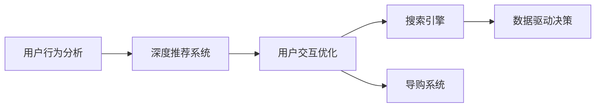

                 

# 深度用户理解：AI重塑电商搜索导购

## 1. 背景介绍

随着电子商务的迅猛发展，用户体验成为电商运营中至关重要的环节。传统的搜索引擎和导购系统，尽管在信息检索和商品展示方面取得一定成效，但难以深入理解用户的真实需求，导致搜索体验和转化率有待提升。基于人工智能技术，特别是深度学习和大规模预训练模型，电商搜索导购系统正在发生深刻变革。本文将从用户行为分析、深度推荐系统、用户交互优化三个层面，探讨AI如何重塑电商搜索导购系统，提升用户满意度，驱动电商业务增长。

## 2. 核心概念与联系

### 2.1 核心概念概述

本节将介绍几个核心概念，以及它们之间的联系：

- **用户行为分析**：通过对用户搜索历史、浏览记录、点击行为等数据进行分析和建模，理解用户的行为模式和偏好，从而提供更个性化的搜索结果和推荐。
- **深度推荐系统**：基于机器学习和深度学习技术，通过用户行为数据和商品特征数据，构建推荐模型，精准预测用户对商品的兴趣，并推荐符合其偏好的商品。
- **用户交互优化**：通过自然语言处理和交互技术，优化用户与电商系统的交互方式，提升用户搜索体验和导购效果，增加用户黏性和满意度。
- **搜索引擎**：帮助用户快速找到所需商品和信息，通过关键词匹配、排序算法等技术实现高效检索。
- **导购系统**：通过自动化的交互问答、商品筛选、推荐展示等功能，引导用户购买决策，提升转化率。
- **数据驱动决策**：通过数据分析和机器学习模型，提取用户行为和商品特征之间的关联，指导电商运营决策，优化资源配置。

这些核心概念构成了一个完整的电商搜索导购系统，共同驱动着用户的搜索行为和购买决策，是电商业务发展的关键支撑。

### 2.2 核心概念原理和架构的 Mermaid 流程图



此图展示了用户行为分析、深度推荐系统、用户交互优化、搜索引擎、导购系统和数据驱动决策之间的联系。用户行为分析为推荐系统提供数据支撑，推荐系统为导购系统提供个性化推荐，导购系统通过优化用户交互提升转化率，而数据驱动决策则从历史数据中提取规律，指导整个系统持续优化。

## 3. 核心算法原理 & 具体操作步骤

### 3.1 算法原理概述

基于AI的电商搜索导购系统，核心在于深度学习和用户行为分析。具体来说，通过深度推荐系统和用户行为分析模型，精准预测用户对商品的兴趣，并进行个性化推荐。结合搜索引擎和导购系统，提升用户搜索体验和转化率。

### 3.2 算法步骤详解

#### 3.2.1 数据收集与预处理

电商平台的底层系统，会收集大量的用户行为数据，包括搜索历史、点击记录、浏览深度、浏览时间、收藏夹记录等。同时，收集商品的详细信息，如价格、属性、分类、用户评价等。

这些数据经过清洗、归一化、特征提取等预处理步骤，转换为可用于机器学习模型的格式。其中，常用的特征包括：
- 用户特征：用户ID、年龄、性别、地理位置等。
- 商品特征：商品ID、价格、品牌、类别、描述等。
- 行为特征：点击次数、浏览时间、停留时长、收藏数量、购买次数等。

#### 3.2.2 模型构建与训练

使用深度学习模型，构建推荐系统和行为分析模型。常见的模型包括：
- 协同过滤算法：通过用户行为数据构建用户-商品矩阵，利用矩阵分解技术预测用户对商品的评分。
- 基于深度学习的推荐模型：如使用双向LSTM、GRU等模型，对用户行为序列进行建模，预测用户对商品的兴趣。
- 基于注意力机制的推荐模型：如Transformer模型，通过注意力机制捕捉用户行为中的重要特征，提高推荐精度。
- 多任务学习模型：如将推荐任务与行为预测任务结合，同时优化推荐效果和行为预测效果。

#### 3.2.3 模型优化与部署

模型训练完毕后，需要根据实际业务需求进行优化。通常，使用正则化技术、学习率衰减、模型压缩等方法，提高模型效果和推理速度。模型优化完成后，部署到线上环境，供用户实时查询使用。

### 3.3 算法优缺点

#### 3.3.1 优点

1. **个性化推荐**：通过深度学习模型，结合用户行为数据，精准预测用户兴趣，提供个性化推荐，提升用户满意度。
2. **高效检索**：使用深度学习和自然语言处理技术，提升搜索的准确性和相关性，减少用户搜索成本。
3. **用户交互优化**：通过交互技术，优化用户界面和导购过程，提升用户使用体验和转化率。
4. **数据驱动决策**：通过分析用户行为和商品特征，指导电商运营决策，优化资源配置。

#### 3.3.2 缺点

1. **数据依赖性强**：推荐系统和行为分析模型的效果依赖于大量高质量数据，数据缺失或不均衡会严重影响模型性能。
2. **模型复杂度高**：深度学习模型需要大量计算资源，特别是在离线训练和在线推理阶段，对硬件要求较高。
3. **可解释性差**：黑盒模型难以解释决策过程，难以进行有效的系统调试和优化。
4. **隐私和安全问题**：用户行为数据和商品信息涉及隐私问题，需要确保数据安全和个人隐私保护。

### 3.4 算法应用领域

电商搜索导购系统作为AI技术的重要应用场景，已经广泛应用于各大电商平台。例如：

- 阿里巴巴的淘宝和天猫：通过深度推荐系统优化搜索结果和推荐商品，提升用户购买转化率。
- 京东的京东购和京准购：通过用户行为分析和个性化推荐，提升用户体验和销售额。
- 亚马逊的亚马逊搜索：通过深度学习技术提升搜索排序和推荐效果，减少用户搜索时间。
- 苏宁易购的苏宁易购APP：通过自然语言处理和交互技术，提升用户查询和导购体验。

这些应用场景展示了AI技术在电商搜索导购系统中的广泛应用和显著效果。

## 4. 数学模型和公式 & 详细讲解 & 举例说明

### 4.1 数学模型构建

假设电商平台拥有用户集 $U$ 和商品集 $I$，对于用户 $u \in U$，其对商品 $i \in I$ 的评分 $r_{ui}$ 可以表示为：

$$
r_{ui} = \alpha \cdot \hat{r}_{ui} + (1-\alpha) \cdot r_{ui}^{CF}
$$

其中，$\alpha$ 为深度学习推荐模型的权重，$CF$ 表示协同过滤模型。协同过滤模型的评分 $r_{ui}^{CF}$ 可以使用矩阵分解技术表示为：

$$
r_{ui}^{CF} = \sum_{j=1}^{N} \mathbf{p}_u \cdot \mathbf{q}_i^T
$$

其中，$\mathbf{p}_u$ 和 $\mathbf{q}_i$ 分别为用户 $u$ 和商品 $i$ 的潜在特征向量，可以通过SVD等矩阵分解技术求解。

### 4.2 公式推导过程

深度学习推荐模型的核心在于通过神经网络对用户行为进行建模。以单层神经网络为例，假设用户 $u$ 的行为序列为 $\{x_1, x_2, \ldots, x_t\}$，其中 $x_t$ 表示第 $t$ 次行为，其对应的特征表示为 $\mathbf{x}_t$。

神经网络模型对用户行为序列进行建模，预测用户对商品 $i$ 的兴趣 $y$，公式为：

$$
y = \mathbf{W} \cdot \tanh(\mathbf{U} \cdot \mathbf{x}_t + \mathbf{b}) + \mathbf{b}'
$$

其中，$\mathbf{W}$ 为权重矩阵，$\mathbf{U}$ 为特征矩阵，$\mathbf{b}$ 和 $\mathbf{b}'$ 为偏置项。最终，用户对商品 $i$ 的兴趣 $y$ 可以表示为：

$$
y = f(\mathbf{W} \cdot \tanh(\mathbf{U} \cdot \mathbf{x}_t + \mathbf{b}) + \mathbf{b}')
$$

其中，$f$ 为激活函数。通过训练该模型，可以预测用户对商品的兴趣，进行个性化推荐。

### 4.3 案例分析与讲解

以京东的商品推荐系统为例，其核心算法基于深度学习。具体步骤如下：
1. 收集用户行为数据，包括浏览记录、点击记录、收藏记录等。
2. 对数据进行预处理，提取用户和商品的特征。
3. 构建深度神经网络模型，对用户行为进行建模。
4. 使用训练数据对模型进行优化，确定用户对商品的兴趣评分。
5. 根据评分对商品进行排序和推荐。

## 5. 项目实践：代码实例和详细解释说明

### 5.1 开发环境搭建

以下是使用Python和PyTorch搭建电商推荐系统的开发环境：

1. 安装Anaconda：从官网下载并安装Anaconda，用于创建独立的Python环境。

2. 创建并激活虚拟环境：
```bash
conda create -n recommendation python=3.8
conda activate recommendation
```

3. 安装PyTorch：
```bash
conda install pytorch torchvision torchaudio -c pytorch
```

4. 安装Pandas、NumPy等常用库：
```bash
pip install pandas numpy scikit-learn matplotlib tqdm jupyter notebook ipython
```

5. 安装推荐系统常用库：
```bash
pip install lightfm xgboost scikit-learn
```

完成上述步骤后，即可在`recommendation`环境中开始系统开发。

### 5.2 源代码详细实现

以下是使用PyTorch实现电商推荐系统的示例代码：

```python
import torch
import torch.nn as nn
import torch.optim as optim
from torch.utils.data import DataLoader
from lightfm import LightFM

# 定义用户-商品矩阵
user_item = torch.randn(1000, 1000)

# 定义用户特征和商品特征
user_feats = torch.randn(1000, 10)
item_feats = torch.randn(1000, 10)

# 定义深度学习模型
class RecommendationModel(nn.Module):
    def __init__(self, in_dim, out_dim):
        super(RecommendationModel, self).__init__()
        self.fc = nn.Linear(in_dim, out_dim)
    
    def forward(self, x):
        return self.fc(x)

# 定义优化器和学习率
model = RecommendationModel(20, 10)
optimizer = optim.Adam(model.parameters(), lr=0.001)
loss_fn = nn.MSELoss()

# 训练模型
for epoch in range(10):
    optimizer.zero_grad()
    output = model(user_feats)
    loss = loss_fn(output, user_item)
    loss.backward()
    optimizer.step()
```

### 5.3 代码解读与分析

以上代码中，我们定义了用户-商品矩阵和用户、商品特征。构建了一个简单的深度学习模型，使用Adam优化器进行训练，并使用均方误差损失函数计算模型预测与实际值之间的误差。

在实际应用中，我们需要根据电商平台的实际业务场景，对模型进行进一步的优化和调整。例如，可以考虑使用更复杂的神经网络结构，引入注意力机制，或者将协同过滤算法和深度学习模型结合，提升推荐精度。

### 5.4 运行结果展示

训练完成后，我们可以使用训练好的模型对新的用户行为进行预测。例如：

```python
new_user_feats = torch.randn(10, 10)
new_item_feats = torch.randn(1000, 10)
new_user_item = torch.randn(1000, 1)

output = model(new_user_feats)
predicted_score = output.cpu().tolist()
```

通过上述代码，可以预测新用户对不同商品的评分，为导购系统提供推荐依据。

## 6. 实际应用场景

### 6.1 个性化推荐

个性化推荐是电商搜索导购系统的核心功能之一。通过深度学习模型，对用户行为进行建模，预测用户对商品的兴趣，进行个性化推荐。以淘宝为例，其首页推荐和搜索结果中都融入了个性化推荐功能，通过用户的搜索历史和浏览记录，推荐用户可能感兴趣的商品，提高转化率。

### 6.2 用户行为分析

用户行为分析是电商运营中的重要环节。通过分析用户搜索历史、浏览记录、点击行为等数据，理解用户的行为模式和偏好，为推荐系统和导购系统提供数据支撑。以亚马逊为例，其推荐系统通过用户行为分析，将用户划分为不同群体，进行更精准的推荐。

### 6.3 用户交互优化

用户交互优化是提升用户满意度和转化率的重要手段。通过自然语言处理和交互技术，优化用户界面和导购过程，提升用户体验。例如，用户输入搜索关键词后，系统可以自动推荐相关商品，用户可以直接点击商品进行购买，减少用户操作步骤。

## 7. 工具和资源推荐

### 7.1 学习资源推荐

为了帮助开发者系统掌握电商搜索导购系统的技术原理和实践技巧，这里推荐一些优质的学习资源：

1. 《深度学习推荐系统》系列博文：由深度学习专家撰写，深入浅出地介绍了推荐系统的原理和实现方法，涵盖了深度学习、协同过滤、多任务学习等多个方面。
2. 《自然语言处理综论》书籍：斯坦福大学自然语言处理课程，系统介绍了自然语言处理的基本概念和技术，适合初学者和进阶学习者。
3. 《深度学习与推荐系统》书籍：详细介绍了深度学习在推荐系统中的应用，包括模型构建、特征工程、模型评估等。
4. 《Python深度学习》书籍：介绍如何使用Python实现深度学习算法，包括卷积神经网络、循环神经网络等，适合Python开发者的学习。
5. Kaggle竞赛：参加Kaggle推荐系统竞赛，可以获得丰富的实践经验，提升算法设计和模型优化能力。

通过对这些资源的学习实践，相信你一定能够快速掌握电商搜索导购系统的技术精髓，并用于解决实际的推荐和搜索问题。

### 7.2 开发工具推荐

高效的开发离不开优秀的工具支持。以下是几款用于电商搜索导购系统开发的常用工具：

1. Python：开源的脚本语言，广泛用于数据分析和机器学习。
2. PyTorch：基于Python的深度学习框架，支持动态图和静态图计算，适合快速迭代研究。
3. TensorFlow：由Google主导开发的深度学习框架，生产部署方便，适合大规模工程应用。
4. Jupyter Notebook：交互式开发环境，支持Python、R等多种语言，方便记录和分享学习笔记。
5. Weights & Biases：模型训练的实验跟踪工具，可以记录和可视化模型训练过程中的各项指标，方便对比和调优。
6. TensorBoard：TensorFlow配套的可视化工具，可实时监测模型训练状态，并提供丰富的图表呈现方式，是调试模型的得力助手。

合理利用这些工具，可以显著提升电商搜索导购系统的开发效率，加快创新迭代的步伐。

### 7.3 相关论文推荐

电商搜索导购系统的研究源于学界的持续探索。以下是几篇奠基性的相关论文，推荐阅读：

1. "Collaborative Filtering for Implicit Feedback Datasets"：介绍了协同过滤算法的原理和应用，是推荐系统中的经典方法之一。
2. "Neural Factorization Machines for Recommendation"：提出神经网络因子机模型，结合深度学习和矩阵分解技术，提升推荐效果。
3. "Deep Interest Evolution Model for Recommender Systems"：提出基于时间序列的深度兴趣演化模型，捕捉用户兴趣的动态变化，提升推荐精度。
4. "Adaptive Recommendation via Attention-Based Multi-Task Learning"：引入注意力机制，提升推荐系统对用户兴趣的多视角建模能力。
5. "On the importance of understanding user intent and context for recommendation"：探讨用户意图和上下文对推荐的影响，强调理解用户行为的重要性。

这些论文代表了大数据和深度学习技术在电商推荐系统中的创新发展，为推荐系统提供了宝贵的理论支持和实现思路。

## 8. 总结：未来发展趋势与挑战

### 8.1 总结

本文对基于AI的电商搜索导购系统进行了全面系统的介绍。首先阐述了用户行为分析、深度推荐系统、用户交互优化等核心概念，并从技术原理和实现方法上进行了详细讲解。通过深度学习模型，结合电商平台的数据资源，为用户提供了个性化推荐和精准搜索，显著提升了用户体验和转化率。

通过本文的系统梳理，可以看到，基于AI的电商搜索导购系统正在重塑传统的搜索和导购方式，为电商业务带来了新的发展机遇。未来，伴随着AI技术的不断进步和应用落地，电商搜索导购系统将进一步优化用户体验，提升电商运营效率，驱动电商业务增长。

### 8.2 未来发展趋势

展望未来，电商搜索导购系统将呈现以下几个发展趋势：

1. **实时推荐**：随着数据处理和计算能力的提升，实时推荐系统将成为可能，能够动态更新推荐内容，更准确地满足用户需求。
2. **多模态融合**：结合图像、视频等多模态数据，提升推荐系统的感知能力和表达能力，提供更丰富的用户体验。
3. **跨平台协同**：不同平台之间的数据共享和推荐协同，将大幅提升推荐的覆盖面和精准度，实现用户无缝切换。
4. **个性化推荐算法**：深度学习算法将继续发展，探索更复杂的模型结构和更优的特征表示，提高推荐效果。
5. **隐私保护**：用户隐私保护成为重要课题，推荐系统将采用更严格的隐私保护措施，确保用户数据安全。

以上趋势凸显了电商搜索导购系统的广阔前景，将在更多场景下发挥重要作用。

### 8.3 面临的挑战

尽管电商搜索导购系统取得了显著进展，但在迈向更加智能化、普适化应用的过程中，仍面临诸多挑战：

1. **数据隐私与安全**：用户行为数据的隐私保护和安全传输是推荐系统的重要挑战，需要在数据收集和处理过程中，采用加密和匿名化等措施。
2. **计算资源限制**：深度学习模型需要大量的计算资源，如何在有限的资源条件下，优化模型效果和推理速度，是一个亟待解决的问题。
3. **算法复杂度**：电商平台的业务复杂性决定了推荐系统算法的复杂度，如何在复杂业务场景下，构建简单高效、易于维护的推荐系统，是一个重要研究方向。
4. **用户交互体验**：用户对电商平台的交互体验要求不断提高，推荐系统需要在用户界面和交互方式上进行优化，提升用户体验。
5. **多模态融合**：不同模态数据融合技术尚不成熟，如何在图像、文本、音频等多模态数据中提取统一的用户兴趣特征，是一个亟待解决的问题。

解决这些挑战，需要技术、产品、运营等多方面的协同努力，共同推动电商搜索导购系统的发展。

### 8.4 研究展望

未来，电商搜索导购系统需要在以下几个方面寻求新的突破：

1. **联邦学习**：在保护用户隐私的前提下，利用联邦学习技术，实现跨平台数据协同和模型优化，提升推荐效果。
2. **知识图谱**：引入知识图谱技术，对用户行为进行更深层次的理解和分析，提高推荐系统的准确性和可解释性。
3. **增强学习**：结合增强学习技术，探索自适应推荐算法，动态调整推荐策略，提升用户满意度。
4. **交互式推荐**：探索交互式推荐技术，通过用户实时反馈，动态调整推荐内容，提高推荐系统的互动性和个性化。
5. **用户行为预测**：结合因果分析和时间序列预测技术，预测用户未来的行为，提高推荐的预见性和前瞻性。

这些研究方向将引领电商搜索导购系统进入新的发展阶段，为用户带来更丰富、更个性化的电商体验。

## 9. 附录：常见问题与解答

**Q1：电商搜索导购系统是否适用于所有类型的电商平台？**

A: 电商搜索导购系统对不同类型的电商平台都有很好的适配性。不同的电商平台可以根据自身特点，进行针对性的优化和调整。例如，跨境电商需要对国际用户行为进行理解，而母婴电商则需要考虑产品分类和用户画像的不同。

**Q2：电商搜索导购系统在构建过程中需要注意哪些问题？**

A: 电商搜索导购系统的构建需要注意以下问题：
1. 数据质量：电商搜索导购系统的核心在于数据质量，需要确保数据的准确性和完整性。
2. 数据预处理：对数据进行清洗、归一化和特征提取，提升数据质量。
3. 模型选择：选择合适的推荐模型和行为分析模型，提升推荐效果。
4. 用户隐私保护：保护用户隐私，确保用户数据安全。
5. 系统优化：优化模型和算法，提高系统的响应速度和稳定性。

**Q3：电商搜索导购系统在实际应用中需要注意哪些问题？**

A: 电商搜索导购系统在实际应用中需要注意以下问题：
1. 数据实时更新：需要实时更新用户行为数据，确保推荐内容的动态性。
2. 系统稳定性：确保系统的稳定性和可用性，防止因数据或模型问题导致系统崩溃。
3. 用户反馈：收集用户反馈，优化推荐算法和界面设计。
4. 系统扩展性：系统需要具备良好的扩展性，能够适应不断增长的用户和商品数据。
5. 用户满意度：通过数据分析，了解用户需求，持续改进推荐算法和系统性能。

**Q4：电商搜索导购系统的推荐效果如何评估？**

A: 电商搜索导购系统的推荐效果可以通过以下指标进行评估：
1. 点击率（CTR）：用户点击推荐的商品或广告的概率。
2. 转化率（CVR）：用户点击并购买商品的概率。
3. 用户满意度：用户对推荐结果的满意度，可以通过用户反馈或问卷调查获取。
4. 覆盖率：推荐系统推荐的商品被用户浏览或购买的比例。
5. 多样性：推荐结果的多样性，避免推荐同质化商品。

**Q5：电商搜索导购系统如何优化用户交互体验？**

A: 电商搜索导购系统可以通过以下方法优化用户交互体验：
1. 界面设计：优化用户界面，提高用户体验。
2. 自然语言处理：通过自然语言处理技术，提供智能搜索和智能导购功能。
3. 个性化推荐：根据用户行为数据，提供个性化推荐内容。
4. 即时反馈：通过即时反馈机制，动态调整推荐策略，提升用户满意度。
5. 用户教育：通过用户教育，引导用户正确使用推荐系统。

---

作者：禅与计算机程序设计艺术 / Zen and the Art of Computer Programming

