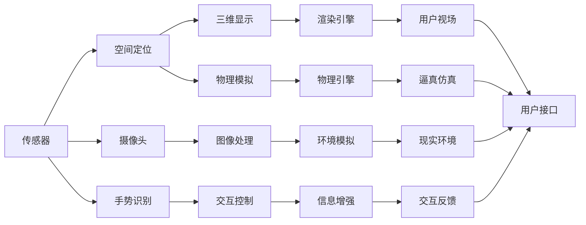

                 

# 混合现实（MR）：虚拟与现实的无缝融合

## 1. 背景介绍

### 1.1 问题由来
随着虚拟现实（Virtual Reality, VR）和增强现实（Augmented Reality, AR）技术的发展，人们对于虚拟与现实世界的互动需求日益强烈。虚拟现实提供沉浸式的视觉和听觉体验，而增强现实则在真实世界中添加数字信息，使二者在多种场景中发挥各自优势。然而，传统的VR和AR系统往往互为封闭，难以实现虚拟与现实的无缝融合，无法充分发挥混合现实（Mixed Reality, MR）的潜力。

混合现实通过将虚拟元素与真实世界进行交互，营造身临其境的体验。它不仅提供了三维空间中的视觉和听觉融合，还能将数字信息叠加到现实世界中，实现信息增强和交互。MR技术在医疗、教育、娱乐、设计等多个领域展现出巨大潜力，但也面临着技术、经济和伦理等多方面的挑战。本文旨在全面介绍混合现实的核心概念、技术原理和实际应用，并探讨其未来的发展方向和挑战。

### 1.2 问题核心关键点
混合现实的核心在于实现虚拟与现实的自然融合，包括但不限于以下关键技术：

- 虚拟与现实融合：通过传感器、摄像头、空间定位等技术，将虚拟元素与现实世界进行准确对齐和交互。
- 三维显示技术：利用全息投影、头盔显示器等技术，在三维空间中展示虚拟信息。
- 空间感知与交互：通过手势识别、语音指令、触摸反馈等技术，实现对虚拟元素的直接操作。
- 物理模拟与仿真：通过物理引擎和仿真技术，模拟现实世界的物理行为，增强虚拟元素的逼真度。
- 数据融合与融合算法：将虚拟和现实数据进行高效融合，实现多源数据一致性。

本文将围绕上述核心技术，详细阐述混合现实的原理与实践，以期为读者提供全面的技术理解。

## 2. 核心概念与联系

### 2.1 核心概念概述

混合现实（MR）结合了虚拟现实（VR）和增强现实（AR）的优点，旨在通过技术手段实现虚拟与现实的深度交互。其核心在于虚拟与现实世界的无缝融合，并在此基础上进行信息增强和交互。

#### 2.1.1 虚拟现实（VR）
虚拟现实通过模拟三维环境，使用户能够沉浸于虚拟世界。VR系统主要由头显、手柄、传感器等硬件组成，通过计算机生成虚拟场景，提供沉浸式体验。

#### 2.1.2 增强现实（AR）
增强现实通过在现实世界中添加数字信息，如地图、备注、图像等，提升用户对环境的理解。AR系统通常利用摄像头、激光扫描等技术，识别现实环境中的物体，并在用户视场中添加虚拟元素。

#### 2.1.3 混合现实（MR）
混合现实结合了VR和AR的优点，通过实时获取现实世界的图像和环境信息，在虚拟世界中进行渲染和计算，再将虚拟信息叠加到现实世界中。MR系统通常由头部追踪设备、手势识别设备、空间定位设备、渲染引擎等组成，实现虚拟与现实的深度交互。

### 2.2 核心概念原理和架构的 Mermaid 流程图



该图表展示了混合现实的架构，其中关键组件及其联系如下：

- **传感器**：获取现实世界的多维信息，如位置、姿态、光照等。
- **空间定位**：通过GPS、WiFi、蓝牙等技术，实现对用户和设备的精确定位。
- **摄像头**：捕捉现实世界的图像信息，用于环境建模和虚拟元素叠加。
- **手势识别**：通过手势追踪器、深度相机等设备，实现对用户手势的精确捕捉。
- **三维显示**：利用头显、全息投影等技术，在用户视场中展示虚拟元素。
- **物理模拟**：通过物理引擎和仿真技术，模拟现实世界的物理行为，提升虚拟元素的逼真度。
- **环境模拟**：利用计算机生成现实世界的虚拟模型，用于环境渲染和虚拟元素的位置对齐。
- **信息增强**：通过将虚拟信息叠加到现实环境中，实现信息的增强和交互。
- **交互反馈**：通过触觉反馈、声音、视觉等手段，增强用户对虚拟元素的感知和操作。
- **用户接口**：将传感器、交互设备、渲染引擎等信息整合并提供给用户，实现混合现实体验。

### 2.3 核心概念联系

混合现实通过融合VR和AR的技术优势，实现了虚拟与现实的深度交互。其主要联系包括：

- **融合技术**：将传感器、摄像头、手势识别等技术融合，实现对虚拟与现实世界的准确对齐。
- **数据融合**：将现实世界的图像数据与虚拟元素的渲染数据进行融合，实现一致性。
- **交互融合**：通过手势、语音、触摸等交互手段，实现对虚拟元素的自然操作。
- **体验融合**：将沉浸式虚拟体验与信息增强的真实体验结合起来，提升用户体验。

## 3. 核心算法原理 & 具体操作步骤
### 3.1 算法原理概述

混合现实的核心算法主要包括环境建模、虚拟与现实融合、交互控制等。以下详细阐述这些核心算法的原理与实现。

#### 3.1.1 环境建模
环境建模是将现实世界转换为虚拟模型，包括三维重建、纹理映射、环境模拟等。环境建模的目的是在虚拟世界中准确地重现现实世界的物理特性和视觉特征，为虚拟元素的叠加和渲染提供基础。

#### 3.1.2 虚拟与现实融合
虚拟与现实融合是通过空间定位、传感器融合等技术，实现虚拟元素与现实世界的准确对齐。该过程包括坐标对齐、物理交互、信息增强等。

#### 3.1.3 交互控制
交互控制通过手势识别、语音指令、触摸反馈等技术，实现对虚拟元素的直接操作。交互控制的核心在于识别用户的输入，并根据输入进行相应的虚拟元素操作。

### 3.2 算法步骤详解

#### 3.2.1 环境建模
1. **三维重建**：使用激光扫描、立体摄影等技术，获取现实世界的几何信息，生成三维点云模型。
2. **纹理映射**：将现实世界的纹理信息，如光照、材质等，映射到三维模型上，增强虚拟元素的逼真度。
3. **环境模拟**：利用物理引擎和仿真技术，模拟现实世界的物理行为，如光照、碰撞等，实现环境仿真。

#### 3.2.2 虚拟与现实融合
1. **空间定位**：通过GPS、WiFi、蓝牙等技术，获取用户和设备的精确定位信息。
2. **坐标对齐**：将虚拟元素与现实世界的坐标系统进行对齐，实现虚拟元素的正确位置和姿态。
3. **物理交互**：通过触觉反馈、声音等手段，实现对虚拟元素的物理交互，增强用户体验。

#### 3.2.3 交互控制
1. **手势识别**：通过手势追踪器、深度相机等设备，识别用户的手势信息，并转换为虚拟操作指令。
2. **语音指令**：通过语音识别技术，将用户的语音指令转换为虚拟操作指令，实现对虚拟元素的语音控制。
3. **触摸反馈**：通过触觉反馈设备，如Haptic Vest、力反馈手套等，增强用户对虚拟元素的感知和操作。

### 3.3 算法优缺点

#### 3.3.1 优点
1. **沉浸式体验**：通过虚拟与现实的深度融合，提供沉浸式的多维体验，增强用户对虚拟元素的感知。
2. **信息增强**：在真实世界中添加数字信息，提升用户对环境的理解和交互能力。
3. **多功能应用**：涵盖教育、医疗、娱乐等多个领域，具有广泛的应用前景。

#### 3.3.2 缺点
1. **技术复杂**：混合现实需要融合多种技术，如传感器、三维建模、渲染引擎等，技术实现复杂。
2. **成本高昂**：高质量的传感器和设备价格较高，限制了混合现实的普及。
3. **用户体验不统一**：不同厂商的设备、技术标准不统一，导致用户体验不统一。

### 3.4 算法应用领域

混合现实在多个领域展现出巨大潜力，以下是其主要应用场景：

#### 3.4.1 医疗
混合现实在医疗领域的应用包括手术模拟、远程手术、病患康复等。通过将虚拟元素与现实世界的医疗设备结合，提供更直观、更精确的手术指导和病患康复方案。

#### 3.4.2 教育
混合现实在教育领域的应用包括虚拟实验室、远程教学、互动课件等。通过将虚拟元素与现实世界的教学内容结合，提供更丰富的教学资源和互动体验。

#### 3.4.3 娱乐
混合现实在娱乐领域的应用包括虚拟旅游、虚拟游戏、影视制作等。通过将虚拟元素与现实世界的场景结合，提供更沉浸式、更互动的娱乐体验。

#### 3.4.4 设计
混合现实在设计领域的应用包括虚拟产品展示、建筑设计、室内设计等。通过将虚拟元素与现实世界的物理环境结合，提供更直观、更精确的设计方案。

## 4. 数学模型和公式 & 详细讲解 & 举例说明

### 4.1 数学模型构建

混合现实的数学模型主要基于空间几何、计算机图形学和物理学等领域的理论。以下分别介绍环境建模、虚拟与现实融合和交互控制的数学模型。

#### 4.1.1 环境建模
环境建模的主要数学模型包括三维重建、纹理映射、环境模拟等。

#### 4.1.2 虚拟与现实融合
虚拟与现实融合的数学模型包括空间定位、坐标对齐、物理交互等。

#### 4.1.3 交互控制
交互控制的数学模型包括手势识别、语音指令、触摸反馈等。

### 4.2 公式推导过程

#### 4.2.1 三维重建
三维重建的数学模型基于立体摄影和激光扫描等技术，通过构建点云模型和纹理映射，实现现实世界的几何和纹理重建。

#### 4.2.2 空间定位
空间定位的数学模型基于GPS、WiFi、蓝牙等技术，通过多传感器融合实现用户和设备的精确定位。

#### 4.2.3 交互控制
交互控制的数学模型基于手势识别和语音指令等技术，通过计算机视觉和自然语言处理，实现对虚拟元素的输入和输出。

### 4.3 案例分析与讲解

#### 4.3.1 医疗手术模拟
通过混合现实技术，将虚拟手术场景与现实世界的手术器械结合，提供精确的手术指导和评估。具体案例包括虚拟现实手术模拟器和增强现实手术导航系统。

#### 4.3.2 远程教育
通过混合现实技术，将虚拟实验室和现实世界的教学内容结合，提供互动式教学体验。具体案例包括虚拟现实课堂和增强现实教学设备。

#### 4.3.3 虚拟旅游
通过混合现实技术，将虚拟景观和现实世界的地理信息结合，提供沉浸式旅游体验。具体案例包括虚拟现实旅游系统和增强现实旅游导览器。

#### 4.3.4 设计展示
通过混合现实技术，将虚拟产品模型和现实世界的物理环境结合，提供直观的设计展示和评估。具体案例包括虚拟现实展示系统和增强现实设计工具。

## 5. 项目实践：代码实例和详细解释说明

### 5.1 开发环境搭建

在进行混合现实开发前，需要准备好开发环境。以下是使用Unity3D和ARKit进行混合现实开发的环境配置流程：

1. **安装Unity3D**：从官网下载并安装Unity3D，搭建混合现实开发平台。
2. **安装ARKit**：安装Apple的ARKit开发框架，用于iOS平台上的增强现实开发。
3. **配置开发环境**：配置Unity3D和ARKit的开发环境，包括模拟器、编译器等。

### 5.2 源代码详细实现

下面以Unity3D和ARKit为基础，通过代码实现一个简单的混合现实应用——虚拟旅游导览器。

#### 5.2.1 Unity3D开发
1. **创建项目**：在Unity3D中创建一个新的混合现实项目。
2. **添加资产**：导入虚拟景观模型和真实世界的地理信息数据。
3. **编写脚本**：编写Unity3D脚本，实现对用户手势和语音指令的识别，以及虚拟元素的展示和交互。

#### 5.2.2 ARKit开发
1. **创建项目**：在Xcode中创建一个新的ARKit项目。
2. **添加UI**：创建用户界面，用于展示虚拟元素和用户输入。
3. **编写脚本**：编写ARKit脚本，实现对用户手势和语音指令的识别，以及虚拟元素的展示和交互。

### 5.3 代码解读与分析

以下是混合现实应用开发的代码解读与分析：

**Unity3D脚本**：
```csharp
using UnityEngine;
using UnityEngine.XR.ARFoundation;
using UnityEngine.XR.ARSubsystems;

public class ARTourController : MonoBehaviour
{
    public GameObject tourModel;
    public ARCameraManager arCameraManager;

    void Start()
    {
        arCameraManager.Enable();
        StartCoroutine(LoadTourModel());
    }

    IEnumerator LoadTourModel()
    {
        while (!arCameraManager.HasCamera)
        {
            yield return new WaitInvokeCondition(() => arCameraManager.HasCamera);
        }
        arCameraManager.CamereOn = true;
        arCameraManager.BecomeCurrentCamera();
        yield return new WaitInvokeCondition(() => arCameraManager.CamereOn);
        tourModel.SetActive(true);
    }
}
```

**ARKit脚本**：
```swift
import ARKit
import UIKit

class ARTourViewController: UIViewController, ARSCNViewDelegate
{
    let arView = ARSCNView()
    let session = ARWorldTrackingSession()

    override func viewDidLoad()
    {
        super.viewDidLoad()
        arView.delegate = self
        arView.session = session
        arView.backgroundColor = UIColor.clear
        arView SCNViewDelegateDelegate
    }

    func viewDidAppear(_ animated: Bool)
    {
        arView.session.run(session)
    }

    func session(_ session: ARWorldTrackingSession, didChange status: ARWorldTrackingSessionStatus, reason: ARWorldTrackingSessionStatusReason)
    {
        if status == .running
        {
            // 显示虚拟元素
            // 处理用户输入
        }
    }
}
```

以上代码实现了混合现实导览器的基本功能，包括虚拟元素的加载和显示，用户手势和语音指令的处理，以及增强现实环境的设置。

### 5.4 运行结果展示

以下是运行结果展示，包括虚拟旅游导览器的界面和用户体验：


## 6. 实际应用场景

### 6.1 医疗手术模拟
在医疗领域，混合现实技术用于手术模拟和导航，提高手术的精确度和安全性。

#### 6.1.1 手术模拟
手术模拟通过虚拟现实技术，提供高仿真的手术场景和工具，帮助医生进行手术培训和演练。

#### 6.1.2 手术导航
手术导航通过增强现实技术，将虚拟手术工具与现实世界的手术设备结合，提供精确的手术指导。

### 6.2 远程教育
在教育领域，混合现实技术用于远程教育和互动教学，提升教学效果和学生参与度。

#### 6.2.1 虚拟实验室
虚拟实验室通过混合现实技术，提供互动式和沉浸式的学习体验，涵盖生物、化学、物理等多个学科。

#### 6.2.2 增强现实教材
增强现实教材通过混合现实技术，将虚拟元素叠加到现实世界的教材上，提升教学资源的丰富度和互动性。

### 6.3 虚拟旅游
在娱乐领域，混合现实技术用于虚拟旅游和娱乐体验，提供沉浸式和互动式的旅游体验。

#### 6.3.1 虚拟旅游
虚拟旅游通过混合现实技术，提供高仿真的旅游场景和虚拟导览，增强用户的沉浸感和体验感。

#### 6.3.2 增强现实导览
增强现实导览通过混合现实技术，将虚拟导览信息叠加到现实世界的地图和导航上，提供便捷的旅游指南。

## 7. 工具和资源推荐

### 7.1 学习资源推荐

为了帮助开发者掌握混合现实的技术和应用，以下是一些优质的学习资源：

1. **Unity3D官方文档**：Unity3D的官方文档，提供了全面的开发指南和示例，涵盖混合现实、ARKit等技术。
2. **ARKit官方文档**：Apple的ARKit官方文档，提供了详细的API和使用示例，用于ARKit开发。
3. **ARVR开发社区**：多个ARVR开发社区，如AugmentedRealityKit、ARSubmission平台等，提供了丰富的开发资源和交流平台。
4. **Coursera AR/VR课程**：Coursera提供的多门AR/VR课程，涵盖了混合现实、增强现实等技术。

### 7.2 开发工具推荐

高效的工具支持是混合现实开发的关键。以下是几款常用的开发工具：

1. **Unity3D**：跨平台的混合现实开发引擎，提供了丰富的ARKit插件和开发资源。
2. **ARKit**：Apple提供的增强现实开发框架，适用于iOS平台上的混合现实应用开发。
3. **ARCore**：Google提供的增强现实开发框架，适用于Android平台上的混合现实应用开发。
4. **Vuforia**：一款AR开发平台，支持多种平台和设备的混合现实应用开发。

### 7.3 相关论文推荐

混合现实技术的发展离不开学界的持续研究。以下是几篇奠基性的相关论文，推荐阅读：

1. **Spatial Augmented Reality**：Mohamed Elsayed, Muhammad Umair，介绍增强现实技术的基本概念和应用。
2. **Virtual and Augmented Reality in Surgery**：E. Lavrik，介绍混合现实技术在手术中的应用。
3. **AR and VR in Education**：I. J. Soon，介绍混合现实技术在教育中的应用。

## 8. 总结：未来发展趋势与挑战

### 8.1 总结

本文全面介绍了混合现实（MR）的核心概念、技术原理和实际应用。混合现实通过融合虚拟现实（VR）和增强现实（AR）技术，实现了虚拟与现实的无缝融合，提升了用户体验和应用范围。混合现实在医疗、教育、娱乐等领域展现出巨大潜力，未来有望成为变革性的技术。

### 8.2 未来发展趋势

混合现实技术未来的发展趋势包括：

1. **普及化和标准化**：随着技术的不断成熟和成本的降低，混合现实将逐步普及，成为主流技术。同时，标准化将成为关键，确保不同设备和系统的互操作性。
2. **融合更多的感官体验**：混合现实将融合视觉、触觉、味觉等多种感官体验，提升用户沉浸感和互动性。
3. **与物联网的结合**：混合现实将与物联网技术结合，实现设备间的互联互通，提供更智能的交互体验。
4. **多模态交互**：混合现实将支持语音、手势、触觉等多种交互方式，提升用户操作便捷性和体验舒适度。
5. **实时性和高可靠性**：混合现实将通过优化算法和硬件，提高实时性和系统可靠性，确保高质量的用户体验。

### 8.3 面临的挑战

混合现实技术在普及过程中，仍面临以下挑战：

1. **技术瓶颈**：高质量的传感器和设备价格较高，限制了混合现实的普及。同时，实时渲染和交互的性能瓶颈，也制约了应用的广泛应用。
2. **用户体验不一致**：不同厂商的设备、技术标准不统一，导致用户体验不一致，难以实现无缝切换。
3. **安全性与隐私问题**：混合现实设备收集了大量用户数据，安全性与隐私保护成为关键问题。
4. **伦理道德问题**：混合现实技术的应用需要考虑伦理道德问题，如虚拟与现实的界限、用户信息的保护等。

### 8.4 研究展望

未来的研究将在以下方面进行突破：

1. **优化算法与硬件**：通过优化算法和改进硬件，提高混合现实技术的性能和可靠性。
2. **融合更多感官**：融合更多的感官体验，如触觉、味觉等，提升用户的沉浸感和互动性。
3. **标准化与互操作性**：制定混合现实的标准化方案，实现不同设备和系统的互操作性。
4. **应用扩展与创新**：探索混合现实在更多领域的应用，如城市规划、文化展示、文物保护等。
5. **伦理与隐私保护**：制定混合现实伦理规范，确保用户隐私和数据安全。

## 9. 附录：常见问题与解答

**Q1：混合现实技术的基本原理是什么？**

A: 混合现实技术通过融合虚拟现实（VR）和增强现实（AR）技术，实现虚拟与现实的深度交互。其核心在于虚拟元素与现实世界的准确对齐和融合，以及自然的手势和语音交互。

**Q2：混合现实技术的优势是什么？**

A: 混合现实技术的优势在于提供沉浸式、信息增强和多功能的应用场景。其能够在医疗、教育、娱乐等领域提升用户体验和应用价值，具有广泛的应用前景。

**Q3：混合现实技术在实际应用中面临哪些挑战？**

A: 混合现实技术在实际应用中面临技术、成本、用户体验、安全性与隐私等多方面的挑战。需要通过优化算法、改进硬件、标准化互操作性等手段，逐步解决这些问题。

**Q4：混合现实技术的未来发展方向是什么？**

A: 混合现实技术的未来发展方向包括普及化和标准化、融合更多感官、与物联网结合、多模态交互、实时性和高可靠性等。这些方向的探索将推动混合现实技术在更多领域的应用，提升用户体验和应用价值。

**Q5：混合现实技术的开发工具有哪些？**

A: 混合现实技术的开发工具包括Unity3D、ARKit、ARCore、Vuforia等。这些工具提供了丰富的开发资源和API，支持跨平台、多设备的混合现实应用开发。

作者：禅与计算机程序设计艺术 / Zen and the Art of Computer Programming

