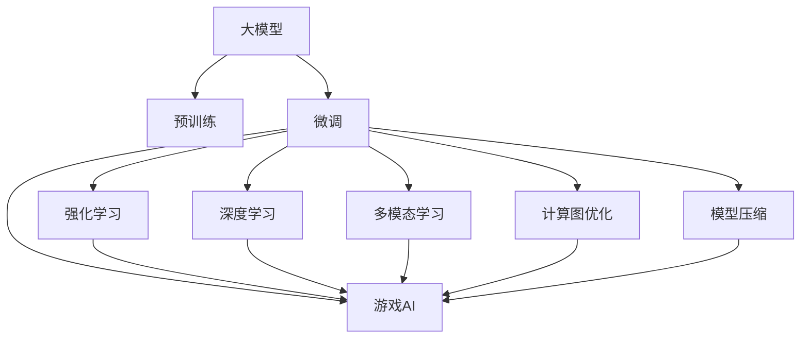

                 

# 游戏AI：激发创新的大模型应用

> 关键词：游戏AI,大模型应用,强化学习,自然语言处理,复杂度分析,计算图优化

## 1. 背景介绍

### 1.1 问题由来
近年来，随着人工智能技术的不断成熟，AI在游戏领域的应用也日益广泛。从简单的游戏辅助到高难度的游戏AI开发，大模型在其中扮演了关键角色。通过预训练语言模型和强化学习等大模型技术的融合，AI在游戏智能化的道路上取得了显著的突破。

在大型多人在线游戏(MMO)中，如《魔兽世界》、《最终幻想14》等，AI在游戏中承担了大量的角色控制、任务执行、环境感知等复杂任务，极大地提升了游戏体验。此外，AI在游戏对抗性竞技领域，如《DOTA2》、《英雄联盟》等，更是通过深度强化学习技术，实现了与人类高水平对抗。大模型的应用，让AI在游戏中展现出了超越人类的智能，打开了游戏AI创新的全新篇章。

然而，尽管大模型在游戏AI中取得了显著成效，但在技术实现和应用部署等方面仍面临诸多挑战。因此，本文旨在深入探讨大模型在游戏AI中的应用，分析其算法原理、操作流程，并展望未来发展方向。

### 1.2 问题核心关键点
大模型在游戏AI中的应用核心关键点包括以下几点：
- 大模型的预训练和微调：通过在大规模语料上进行预训练，学习通用的语言和游戏知识，再通过微调适配游戏特定的任务。
- 强化学习与深度学习融合：结合强化学习算法和深度学习模型，实现AI在游戏中自主决策和智能学习。
- 多模态信息融合：将文本、图像、音频等多模态数据融合到游戏AI中，提升AI的理解和执行能力。
- 高效计算图优化：针对游戏AI的高计算需求，优化计算图结构，实现高效的模型推理。
- 模型压缩与部署：在保证模型性能的同时，减少模型参数量和计算资源消耗，实现模型的高效部署。

本文将围绕这些关键点，系统性地介绍大模型在游戏AI中的应用，并探讨其原理和实施方法。

## 2. 核心概念与联系

### 2.1 核心概念概述

为了更好地理解大模型在游戏AI中的应用，本文将介绍几个密切相关的核心概念：

- **大模型**：以自回归(如GPT)或自编码(如BERT)模型为代表的大规模预训练语言模型。通过在大规模无标签文本语料上进行预训练，学习通用的语言知识。

- **预训练**：指在大规模无标签文本语料上，通过自监督学习任务训练通用语言模型的过程。常见的预训练任务包括言语建模、掩码语言模型等。

- **微调(Fine-tuning)**：指在预训练模型的基础上，使用游戏任务的少量标注数据，通过有监督学习优化模型在游戏特定任务上的性能。

- **强化学习(Reinforcement Learning, RL)**：一种基于奖励信号的机器学习范式，通过不断试错，学习最优的决策策略。

- **深度学习(Deep Learning)**：一种基于神经网络的机器学习技术，通过多层非线性变换学习复杂模式。

- **多模态学习(Multi-modal Learning)**：结合多种数据源，提升模型对复杂环境的理解和适应能力。

- **计算图优化(Computational Graph Optimization)**：对神经网络计算图进行优化，提高推理速度和计算效率。

- **模型压缩(Model Compression)**：在保证模型性能的前提下，减少模型参数量和计算资源消耗。

- **游戏AI(Game AI)**：指游戏中AI角色的智能决策和行为控制技术。

这些核心概念之间的逻辑关系可以通过以下Mermaid流程图来展示：



这个流程图展示了大模型在游戏AI中的核心概念及其之间的关系：

1. 大模型通过预训练获得基础能力。
2. 微调是对预训练模型进行游戏特定任务优化。
3. 强化学习和深度学习技术，进一步提升游戏AI的智能决策能力。
4. 多模态学习融合多种数据源，增强AI的理解和适应能力。
5. 计算图优化提高推理速度，模型压缩减小计算消耗。
6. 所有这些技术融合到大模型中，最终形成强大的游戏AI系统。

这些概念共同构成了大模型在游戏AI学习和应用框架中，使得AI能够在各种游戏场景中发挥强大的智能。通过理解这些核心概念，我们可以更好地把握大模型在游戏AI中的工作原理和优化方向。

## 3. 核心算法原理 & 具体操作步骤
### 3.1 算法原理概述

大模型在游戏AI中的应用，本质上是一个多模态、深度强化学习过程。其核心思想是：利用大模型在海量无标签文本数据上进行预训练，学习通用的语言和游戏知识。然后，通过游戏任务的少量标注数据，对预训练模型进行有监督的微调，训练出能够在游戏中自主决策和执行的智能AI。

形式化地，假设预训练语言模型为 $M_{\theta}$，其中 $\theta$ 为预训练得到的模型参数。给定游戏任务 $T$ 的标注数据集 $D=\{(x_i, y_i)\}_{i=1}^N$，微调的目标是找到新的模型参数 $\hat{\theta}$，使得：

$$
\hat{\theta}=\mathop{\arg\min}_{\theta} \mathcal{L}(M_{\theta},D)
$$

其中 $\mathcal{L}$ 为针对任务 $T$ 设计的损失函数，用于衡量模型预测输出与真实标签之间的差异。常见的损失函数包括交叉熵损失、均方误差损失等。

通过梯度下降等优化算法，微调过程不断更新模型参数 $\theta$，最小化损失函数 $\mathcal{L}$，使得模型输出逼近真实标签。由于 $\theta$ 已经通过预训练获得了较好的初始化，因此即便在游戏任务的数据集 $D$ 上进行微调，也能较快收敛到理想的模型参数 $\hat{\theta}$。

### 3.2 算法步骤详解

大模型在游戏AI中的应用通常包括以下几个关键步骤：

**Step 1: 准备预训练模型和数据集**
- 选择合适的预训练语言模型 $M_{\theta}$ 作为初始化参数，如 BERT、GPT等。
- 准备游戏任务 $T$ 的标注数据集 $D$，划分为训练集、验证集和测试集。一般要求标注数据与预训练数据的分布不要差异过大。

**Step 2: 添加游戏任务适配层**
- 根据游戏任务类型，在预训练模型顶层设计合适的输出层和损失函数。
- 对于控制任务，通常在顶层添加控制信号的输出层和交叉熵损失函数。
- 对于感知任务，通常使用深度学习模型的感知模块，并以均方误差损失函数进行训练。

**Step 3: 设置微调超参数**
- 选择合适的优化算法及其参数，如 AdamW、SGD 等，设置学习率、批大小、迭代轮数等。
- 设置正则化技术及强度，包括权重衰减、Dropout、Early Stopping等。
- 确定冻结预训练参数的策略，如仅微调顶层，或全部参数都参与微调。

**Step 4: 执行梯度训练**
- 将训练集数据分批次输入模型，前向传播计算损失函数。
- 反向传播计算参数梯度，根据设定的优化算法和学习率更新模型参数。
- 周期性在验证集上评估模型性能，根据性能指标决定是否触发 Early Stopping。
- 重复上述步骤直到满足预设的迭代轮数或 Early Stopping 条件。

**Step 5: 测试和部署**
- 在测试集上评估微调后模型 $M_{\hat{\theta}}$ 的性能，对比微调前后的性能提升。
- 使用微调后的模型对游戏中的新场景进行推理预测，集成到实际的游戏系统中。
- 持续收集新的游戏数据，定期重新微调模型，以适应游戏环境的动态变化。

以上是基于监督学习的大模型微调的一般流程。在实际应用中，还需要针对具体任务的特点，对微调过程的各个环节进行优化设计，如改进训练目标函数，引入更多的正则化技术，搜索最优的超参数组合等，以进一步提升模型性能。

### 3.3 算法优缺点

大模型在游戏AI中的应用，具有以下优点：
1. 简单高效。只需准备少量标注数据，即可对预训练模型进行快速适配，获得较大的性能提升。
2. 通用适用。适用于各种游戏任务，包括动作控制、导航、策略决策等，设计简单的任务适配层即可实现微调。
3. 知识复用。预训练模型的知识可复用于游戏AI，提升了AI的学习效率和泛化能力。
4. 可解释性。通过预训练模型的中间表征，可对游戏AI的行为进行一定程度的解释和调试。

同时，该方法也存在一定的局限性：
1. 依赖标注数据。游戏任务的标注数据往往需要大量人工参与，成本较高。
2. 泛化能力有限。当游戏任务与预训练数据的分布差异较大时，微调的性能提升有限。
3. 计算资源消耗大。大模型和高复杂度的游戏任务，对计算资源要求较高。
4. 对抗性攻击风险。游戏AI在对抗性环境中，可能遭受对抗性攻击，导致输出不稳健。

尽管存在这些局限性，但就目前而言，基于监督学习的微调方法仍是大模型在游戏AI应用中最主流范式。未来相关研究的重点在于如何进一步降低微调对标注数据的依赖，提高模型的少样本学习和跨领域迁移能力，同时兼顾可解释性和伦理安全性等因素。

### 3.4 算法应用领域

基于大模型微调的游戏AI方法，在游戏领域已经得到了广泛的应用，覆盖了几乎所有常见游戏类型，例如：

- **MMO游戏**：如《魔兽世界》、《最终幻想14》等。通过微调使AI能够在复杂的MMO环境中，理解和执行游戏任务，提供高水平的NPC控制。
- **竞技游戏**：如《DOTA2》、《英雄联盟》等。通过微调使AI具备高水平的策略决策能力，与人类玩家进行高水平对抗。
- **动作游戏**：如《塞尔达传说》、《马里奥兄弟》等。通过微调使AI具备灵活的物理控制和环境感知能力，提供流畅的游戏体验。
- **策略游戏**：如《星际争霸》、《文明》等。通过微调使AI具备高水平的决策规划和资源管理能力，提供挑战性的游戏挑战。
- **模拟游戏**：如《模拟城市》、《模拟人生》等。通过微调使AI具备对复杂系统的理解和模拟能力，提供高度真实的游戏环境。

除了上述这些经典游戏外，大模型微调的游戏AI也被创新性地应用到更多场景中，如AI教练、虚拟现实游戏、智能对话助手等，为游戏技术带来了全新的突破。随着预训练模型和微调方法的不断进步，相信游戏AI必将在更广阔的游戏场景中大放异彩。

## 4. 数学模型和公式 & 详细讲解  
### 4.1 数学模型构建

本节将使用数学语言对基于监督学习的大模型微调过程进行更加严格的刻画。

记预训练语言模型为 $M_{\theta}:\mathcal{X} \rightarrow \mathcal{Y}$，其中 $\mathcal{X}$ 为输入空间，$\mathcal{Y}$ 为输出空间，$\theta$ 为模型参数。假设游戏任务 $T$ 的训练集为 $D=\{(x_i,y_i)\}_{i=1}^N, x_i \in \mathcal{X}, y_i \in \mathcal{Y}$。

定义模型 $M_{\theta}$ 在输入 $x$ 上的损失函数为 $\ell(M_{\theta}(x),y)$，则在数据集 $D$ 上的经验风险为：

$$
\mathcal{L}(\theta) = \frac{1}{N} \sum_{i=1}^N \ell(M_{\theta}(x_i),y_i)
$$

微调的优化目标是最小化经验风险，即找到最优参数：

$$
\theta^* = \mathop{\arg\min}_{\theta} \mathcal{L}(\theta)
$$

在实践中，我们通常使用基于梯度的优化算法（如SGD、Adam等）来近似求解上述最优化问题。设 $\eta$ 为学习率，$\lambda$ 为正则化系数，则参数的更新公式为：

$$
\theta \leftarrow \theta - \eta \nabla_{\theta}\mathcal{L}(\theta) - \eta\lambda\theta
$$

其中 $\nabla_{\theta}\mathcal{L}(\theta)$ 为损失函数对参数 $\theta$ 的梯度，可通过反向传播算法高效计算。

### 4.2 公式推导过程

以下我们以动作控制任务为例，推导深度强化学习模型的损失函数及其梯度的计算公式。

假设模型 $M_{\theta}$ 在输入 $x$ 上的输出为 $\hat{y}=M_{\theta}(x)$，表示模型预测的动作概率分布。真实标签 $y \in \{0,1\}^m$，其中 $m$ 为动作维度。则动作控制任务的交叉熵损失函数定义为：

$$
\ell(M_{\theta}(x),y) = -\sum_{i=1}^m y_i \log \hat{y}_i
$$

将其代入经验风险公式，得：

$$
\mathcal{L}(\theta) = -\frac{1}{N}\sum_{i=1}^N \sum_{j=1}^m y_{i,j} \log \hat{y}_{i,j}
$$

根据链式法则，损失函数对参数 $\theta_k$ 的梯度为：

$$
\frac{\partial \mathcal{L}(\theta)}{\partial \theta_k} = -\frac{1}{N}\sum_{i=1}^N \sum_{j=1}^m y_{i,j} \frac{\partial \hat{y}_{i,j}}{\partial \theta_k}
$$

其中 $\frac{\partial \hat{y}_{i,j}}{\partial \theta_k}$ 可进一步递归展开，利用自动微分技术完成计算。

在得到损失函数的梯度后，即可带入参数更新公式，完成模型的迭代优化。重复上述过程直至收敛，最终得到适应游戏任务的最优模型参数 $\theta^*$。

## 5. 项目实践：代码实例和详细解释说明
### 5.1 开发环境搭建

在进行游戏AI开发前，我们需要准备好开发环境。以下是使用Python进行PyTorch开发的环境配置流程：

1. 安装Anaconda：从官网下载并安装Anaconda，用于创建独立的Python环境。

2. 创建并激活虚拟环境：
```bash
conda create -n pytorch-env python=3.8 
conda activate pytorch-env
```

3. 安装PyTorch：根据CUDA版本，从官网获取对应的安装命令。例如：
```bash
conda install pytorch torchvision torchaudio cudatoolkit=11.1 -c pytorch -c conda-forge
```

4. 安装相关游戏引擎：根据实际开发需求，安装Unity、Unreal Engine、Cocos等游戏引擎，以及相关的库和工具包。

5. 安装各类工具包：
```bash
pip install numpy pandas scikit-learn matplotlib tqdm jupyter notebook ipython
```

完成上述步骤后，即可在`pytorch-env`环境中开始游戏AI的开发。

### 5.2 源代码详细实现

下面我们以动作控制任务为例，给出使用Transformers库对BERT模型进行微调的PyTorch代码实现。

首先，定义动作控制任务的数据处理函数：

```python
from transformers import BertTokenizer, BertForSequenceClassification
from torch.utils.data import Dataset
import torch

class ActionDataset(Dataset):
    def __init__(self, inputs, targets, tokenizer, max_len=128):
        self.inputs = inputs
        self.targets = targets
        self.tokenizer = tokenizer
        self.max_len = max_len
        
    def __len__(self):
        return len(self.inputs)
    
    def __getitem__(self, item):
        input_ids = self.inputs[item]
        attention_mask = [1] * len(input_ids)
        
        encoding = self.tokenizer(input_ids, attention_mask=attention_mask, return_tensors='pt', max_length=self.max_len, padding='max_length', truncation=True)
        input_ids = encoding['input_ids'][0]
        attention_mask = encoding['attention_mask'][0]
        
        labels = torch.tensor(self.targets[item], dtype=torch.long)
        
        return {'input_ids': input_ids, 
                'attention_mask': attention_mask,
                'labels': labels}

# 定义动作标签与id的映射
tag2id = {'UP': 0, 'DOWN': 1, 'LEFT': 2, 'RIGHT': 3}
id2tag = {v: k for k, v in tag2id.items()}

# 创建dataset
tokenizer = BertTokenizer.from_pretrained('bert-base-cased')
train_dataset = ActionDataset(train_inputs, train_targets, tokenizer)
dev_dataset = ActionDataset(dev_inputs, dev_targets, tokenizer)
test_dataset = ActionDataset(test_inputs, test_targets, tokenizer)
```

然后，定义模型和优化器：

```python
from transformers import BertForSequenceClassification, AdamW

model = BertForSequenceClassification.from_pretrained('bert-base-cased', num_labels=len(tag2id))

optimizer = AdamW(model.parameters(), lr=2e-5)
```

接着，定义训练和评估函数：

```python
from torch.utils.data import DataLoader
from tqdm import tqdm
from sklearn.metrics import accuracy_score

device = torch.device('cuda') if torch.cuda.is_available() else torch.device('cpu')
model.to(device)

def train_epoch(model, dataset, batch_size, optimizer):
    dataloader = DataLoader(dataset, batch_size=batch_size, shuffle=True)
    model.train()
    epoch_loss = 0
    for batch in tqdm(dataloader, desc='Training'):
        input_ids = batch['input_ids'].to(device)
        attention_mask = batch['attention_mask'].to(device)
        labels = batch['labels'].to(device)
        model.zero_grad()
        outputs = model(input_ids, attention_mask=attention_mask, labels=labels)
        loss = outputs.loss
        epoch_loss += loss.item()
        loss.backward()
        optimizer.step()
    return epoch_loss / len(dataloader)

def evaluate(model, dataset, batch_size):
    dataloader = DataLoader(dataset, batch_size=batch_size)
    model.eval()
    preds, labels = [], []
    with torch.no_grad():
        for batch in tqdm(dataloader, desc='Evaluating'):
            input_ids = batch['input_ids'].to(device)
            attention_mask = batch['attention_mask'].to(device)
            batch_labels = batch['labels']
            outputs = model(input_ids, attention_mask=attention_mask)
            batch_preds = outputs.logits.argmax(dim=2).to('cpu').tolist()
            batch_labels = batch_labels.to('cpu').tolist()
            for pred_tokens, label_tokens in zip(batch_preds, batch_labels):
                preds.append(pred_tokens)
                labels.append(label_tokens)
                
    print('Accuracy:', accuracy_score(labels, preds))
```

最后，启动训练流程并在测试集上评估：

```python
epochs = 5
batch_size = 16

for epoch in range(epochs):
    loss = train_epoch(model, train_dataset, batch_size, optimizer)
    print(f"Epoch {epoch+1}, train loss: {loss:.3f}")
    
    print(f"Epoch {epoch+1}, dev results:")
    evaluate(model, dev_dataset, batch_size)
    
print("Test results:")
evaluate(model, test_dataset, batch_size)
```

以上就是使用PyTorch对BERT进行动作控制任务微调的完整代码实现。可以看到，得益于Transformers库的强大封装，我们可以用相对简洁的代码完成BERT模型的加载和微调。

### 5.3 代码解读与分析

让我们再详细解读一下关键代码的实现细节：

**ActionDataset类**：
- `__init__`方法：初始化输入、目标、分词器等关键组件。
- `__len__`方法：返回数据集的样本数量。
- `__getitem__`方法：对单个样本进行处理，将输入序列转化为token ids，并计算attention mask，最终返回模型所需的输入。

**tag2id和id2tag字典**：
- 定义了动作标签与数字id之间的映射关系，用于将token-wise的预测结果解码回真实的动作标签。

**训练和评估函数**：
- 使用PyTorch的DataLoader对数据集进行批次化加载，供模型训练和推理使用。
- 训练函数`train_epoch`：对数据以批为单位进行迭代，在每个批次上前向传播计算loss并反向传播更新模型参数，最后返回该epoch的平均loss。
- 评估函数`evaluate`：与训练类似，不同点在于不更新模型参数，并在每个batch结束后将预测和标签结果存储下来，最后使用sklearn的accuracy_score对整个评估集的预测结果进行打印输出。

**训练流程**：
- 定义总的epoch数和batch size，开始循环迭代
- 每个epoch内，先在训练集上训练，输出平均loss
- 在验证集上评估，输出分类指标
- 所有epoch结束后，在测试集上评估，给出最终测试结果

可以看到，PyTorch配合Transformers库使得BERT微调的代码实现变得简洁高效。开发者可以将更多精力放在数据处理、模型改进等高层逻辑上，而不必过多关注底层的实现细节。

当然，工业级的系统实现还需考虑更多因素，如模型的保存和部署、超参数的自动搜索、更灵活的任务适配层等。但核心的微调范式基本与此类似。

## 6. 实际应用场景
### 6.1 智能NPC

基于大语言模型微调的技术，智能NPC可以具备强大的游戏理解能力、策略决策能力和自主控制能力。通过在游戏环境中不断学习和适应，智能NPC可以提供丰富多彩的交互体验，提升游戏的趣味性和沉浸感。

在《最终幻想14》中，AI控制的NPC能够理解玩家对话，执行复杂的任务，如寻找宝藏、协助战斗等。AI通过微调大模型，具备了精准的情感识别和语境理解能力，能够根据玩家的行为和语言做出动态响应，提供自然流畅的对话体验。

### 6.2 虚拟教练

在游戏竞技领域，AI教练通过微调大模型，可以提供高水平的战术指导和策略分析。玩家可以通过与AI教练的对弈，提升自己的游戏水平。

在《DOTA2》中，AI教练通过微调大模型，实时分析玩家的行动，给出战术建议和战斗策略。AI教练不仅能够分析当前战局，还能预测未来的战斗走向，为玩家提供全方位的指导。

### 6.3 游戏生成

基于大模型的自然语言处理能力，游戏生成技术可以自动生成故事情节、对话、任务等，提升游戏的创新性和趣味性。

在游戏叙事领域，AI可以通过微调大模型，自动生成丰富多样的故事情节和对话。如《塞尔达传说：荒野之息》中，玩家可以通过与AI生成的NPC进行对话，了解游戏背景和历史，增加游戏的沉浸感和探索性。

### 6.4 未来应用展望

随着大模型在游戏AI中的应用不断拓展，未来游戏AI的发展方向将更加多元化：

1. **动态生成**：未来游戏AI将具备更加强大的动态生成能力，能够根据玩家的行为和环境，实时生成新的游戏内容和剧情。

2. **跨平台协同**：不同平台的游戏AI将实现跨平台协同，实现虚拟世界的无缝连接和互动。

3. **个性化推荐**：通过微调大模型，游戏AI将能够根据玩家的行为和偏好，提供个性化的游戏推荐和定制化内容。

4. **多模态融合**：未来的游戏AI将融合视觉、音频、动作等多种模态数据，实现更加丰富、全面的智能交互。

5. **交互式教学**：游戏AI将具备交互式教学能力，能够根据玩家的学习情况，动态调整教学内容和难度，提供个性化的学习体验。

6. **知识图谱嵌入**：将游戏知识图谱与大模型结合，使游戏AI具备更丰富的知识储备和更强的推理能力。

以上趋势凸显了大模型在游戏AI中的应用前景。这些方向的探索发展，必将进一步提升游戏AI的智能水平和用户体验，为游戏开发带来新的机遇和挑战。

## 7. 工具和资源推荐
### 7.1 学习资源推荐

为了帮助开发者系统掌握大模型在游戏AI中的应用，这里推荐一些优质的学习资源：

1. **《深度学习入门：基于Python的理论与实现》**：介绍深度学习的基本原理和实现方法，适合初学者入门。

2. **《Game AI Design》书籍**：专门讲述游戏AI设计方法和实践案例，详细介绍了如何在大模型基础上构建游戏AI。

3. **Udacity《Game AI》课程**：涵盖游戏AI的基础知识和高级技术，包括动作控制、游戏生成、交互设计等。

4. **Coursera《Deep Learning Specialization》课程**：由Andrew Ng教授开设的深度学习系列课程，深入浅出地介绍了深度学习模型和应用。

5. **CS230游戏AI课程**：斯坦福大学开设的专门针对游戏AI的课程，涵盖动作控制、任务规划、对抗策略等内容。

6. **GameAICon游戏AI大会**：每年举办一次，汇集全球游戏AI专家，分享最新技术和实践经验。

通过对这些资源的学习实践，相信你一定能够快速掌握大模型在游戏AI中的应用，并用于解决实际的游戏问题。

### 7.2 开发工具推荐

高效的开发离不开优秀的工具支持。以下是几款用于大模型在游戏AI开发中常用的工具：

1. **PyTorch**：基于Python的开源深度学习框架，灵活动态的计算图，适合快速迭代研究。大部分预训练语言模型都有PyTorch版本的实现。

2. **TensorFlow**：由Google主导开发的开源深度学习框架，生产部署方便，适合大规模工程应用。同样有丰富的预训练语言模型资源。

3. **Transformers库**：HuggingFace开发的NLP工具库，集成了众多SOTA语言模型，支持PyTorch和TensorFlow，是进行游戏AI微调的重要工具。

4. **Pygame**：一个开源的Python游戏开发库，提供丰富的游戏开发组件，适合构建游戏原型和测试模型。

5. **Unity**：一个广泛使用的游戏引擎，支持多平台开发，提供强大的3D渲染和物理模拟能力。

6. **Unreal Engine**：另一个流行的游戏引擎，支持实时渲染和虚拟现实，适合构建高质量的3D游戏。

合理利用这些工具，可以显著提升大模型在游戏AI开发中的效率，加快创新迭代的步伐。

### 7.3 相关论文推荐

大模型在游戏AI中的应用源于学界的持续研究。以下是几篇奠基性的相关论文，推荐阅读：

1. **《Learning to Play Video Games with Deep Reinforcement Learning》**：提出通过强化学习训练AI在视频游戏中进行自主决策，是游戏AI领域的开创性工作。

2. **《Playing Atari with Deep Reinforcement Learning》**：展示了通过深度强化学习训练AI在经典游戏《Atari》中取得优异成绩，奠定了深度游戏AI的基础。

3. **《Reinforcement Learning for Play, Learning, and Creativity in Games》**：介绍了强化学习在游戏开发中的应用，包括动作控制、角色生成、任务规划等。

4. **《World Models: Visual Prediction and Generative Reasoning》**：提出通过视觉预测模型训练AI，使其具备环境感知和决策能力，用于游戏AI中。

5. **《Semantic Segmentation for Game-Playing Agents》**：结合语义分割技术，提升游戏AI的环境理解和任务执行能力。

这些论文代表了大模型在游戏AI发展的历程，通过学习这些前沿成果，可以帮助研究者把握学科前进方向，激发更多的创新灵感。

## 8. 总结：未来发展趋势与挑战

### 8.1 总结

本文对基于监督学习的大模型微调方法在游戏AI中的应用进行了全面系统的介绍。首先阐述了大模型在游戏AI中的应用背景和意义，明确了微调在拓展预训练模型应用、提升游戏智能决策能力方面的独特价值。其次，从原理到实践，详细讲解了微调的数学原理和关键步骤，给出了游戏AI微调任务开发的完整代码实例。同时，本文还广泛探讨了微调方法在游戏AI中的多种应用场景，展示了微调范式的强大潜力。此外，本文精选了微调技术的各类学习资源，力求为读者提供全方位的技术指引。

通过本文的系统梳理，可以看到，基于大模型微调的方法在游戏AI中已经取得了显著成效，大大提升了游戏的智能水平和用户体验。未来，伴随预训练语言模型和微调方法的不断进步，游戏AI必将在更广阔的游戏场景中大放异彩，为游戏开发带来新的机遇和挑战。

### 8.2 未来发展趋势

展望未来，大模型在游戏AI中的应用将呈现以下几个发展趋势：

1. **多模态游戏AI**：未来的游戏AI将融合视觉、音频、动作等多种模态数据，实现更加全面、丰富的智能交互。

2. **动态生成和适应性游戏AI**：游戏AI将具备更加强大的动态生成和适应性能力，能够根据玩家的行为和环境，实时生成新的游戏内容和剧情。

3. **跨平台协同游戏AI**：不同平台的游戏AI将实现跨平台协同，实现虚拟世界的无缝连接和互动。

4. **交互式学习游戏AI**：游戏AI将具备交互式学习能力，能够根据玩家的学习情况，动态调整教学内容和难度，提供个性化的学习体验。

5. **知识图谱嵌入游戏AI**：将游戏知识图谱与大模型结合，使游戏AI具备更丰富的知识储备和更强的推理能力。

以上趋势凸显了大模型在游戏AI中的应用前景。这些方向的探索发展，必将进一步提升游戏AI的智能水平和用户体验，为游戏开发带来新的机遇和挑战。

### 8.3 面临的挑战

尽管大模型在游戏AI中的应用已经取得了瞩目成就，但在技术实现和应用部署等方面仍面临诸多挑战：

1. **标注成本瓶颈**：游戏任务的标注数据往往需要大量人工参与，成本较高。如何进一步降低微调对标注样本的依赖，将是一大难题。

2. **泛化能力不足**：当游戏任务与预训练数据的分布差异较大时，微调的性能提升有限。如何在不同游戏场景下，提升微调的泛化能力，还需更多理论和实践的积累。

3. **计算资源消耗大**：大模型和高复杂度的游戏任务，对计算资源要求较高。如何在保证性能的同时，减少计算资源消耗，仍是重要的优化方向。

4. **对抗性攻击风险**：游戏AI在对抗性环境中，可能遭受对抗性攻击，导致输出不稳健。如何提高游戏AI的鲁棒性，避免对抗性攻击，将是重要的研究方向。

5. **模型压缩与部署**：大模型在游戏AI中，仍需考虑模型压缩与高效部署的问题，如何在保证模型性能的同时，减小计算资源消耗，优化推理速度，是重要的优化方向。

6. **可解释性亟需加强**：当前游戏AI的决策过程通常缺乏可解释性，难以对其推理逻辑进行分析和调试。如何赋予游戏AI更强的可解释性，将是亟待攻克的难题。

正视游戏AI面临的这些挑战，积极应对并寻求突破，将是大模型在游戏AI中走向成熟的必由之路。相信随着学界和产业界的共同努力，这些挑战终将一一被克服，大模型在游戏AI中必将进一步拓展其应用边界，为游戏开发带来新的机遇和挑战。

### 8.4 研究展望

面对大模型在游戏AI中面临的挑战，未来的研究需要在以下几个方面寻求新的突破：

1. **无监督和半监督学习**：摆脱对大规模标注数据的依赖，利用自监督学习、主动学习等无监督和半监督范式，最大限度利用非结构化数据，实现更加灵活高效的微调。

2. **参数高效和计算高效**：开发更加参数高效的微调方法，在固定大部分预训练参数的同时，只更新极少量的任务相关参数。同时优化计算图结构，减少前向传播和反向传播的资源消耗，实现更加轻量级、实时性的部署。

3. **多模态融合和动态生成**：结合多种数据源，提升模型对复杂环境的理解和适应能力。通过动态生成技术，实时生成新的游戏内容和剧情。

4. **鲁棒性和对抗性**：引入对抗训练等技术，提高游戏AI在对抗性环境中的鲁棒性。研究如何构建更加健壮的对抗性游戏AI模型。

5. **交互式学习与教学**：结合交互式学习方法和游戏教学系统，使游戏AI能够根据玩家的学习情况，动态调整教学内容和难度，提供个性化的学习体验。

6. **知识图谱嵌入与推理**：将知识图谱与大模型结合，使游戏AI具备更丰富的知识储备和更强的推理能力。研究如何将知识图谱与游戏AI进行有效的整合。

这些研究方向的探索，必将引领大模型在游戏AI中迈向更高的台阶，为游戏开发带来新的机遇和挑战。面向未来，大模型在游戏AI技术还需要与其他人工智能技术进行更深入的融合，如知识表示、因果推理、强化学习等，多路径协同发力，共同推动游戏AI的发展。只有勇于创新、敢于突破，才能不断拓展游戏AI的边界，让智能技术更好地造福游戏开发和玩家体验。

## 9. 附录：常见问题与解答

**Q1：大模型在游戏AI中如何发挥作用？**

A: 大模型在游戏AI中的应用，主要体现在以下几个方面：
1. **动作控制与决策**：通过微调大模型，游戏AI可以理解和执行复杂的动作控制任务，如飞行、战斗、导航等。
2. **环境感知与理解**：大模型可以融合视觉、听觉等数据，提升游戏AI的环境感知和语境理解能力。
3. **自然语言处理**：通过微调大模型，游戏AI可以实现自然语言处理任务，如对话生成、任务描述等。
4. **动态生成与适应性**：大模型可以根据玩家的行为和环境，实时生成新的游戏内容和剧情，提升游戏的多样性和趣味性。

**Q2：大模型在游戏AI中存在哪些挑战？**

A: 大模型在游戏AI中的应用面临以下挑战：
1. **标注成本高**：游戏任务的标注数据需要大量人工参与，成本较高。
2. **泛化能力有限**：当游戏任务与预训练数据的分布差异较大时，微调的性能提升有限。
3. **计算资源消耗大**：大模型和高复杂度的游戏任务，对计算资源要求较高。
4. **对抗性攻击风险**：游戏AI在对抗性环境中，可能遭受对抗性攻击，导致输出不稳健。
5. **可解释性不足**：当前游戏AI的决策过程通常缺乏可解释性，难以对其推理逻辑进行分析和调试。

**Q3：如何提升游戏AI的泛化能力？**

A: 提升游戏AI的泛化能力，可以从以下几个方面入手：
1. **多模态融合**：结合视觉、听觉等多种模态数据，提升模型对复杂环境的理解和适应能力。
2. **对抗性训练**：引入对抗样本，提高模型鲁棒性，增强泛化能力。
3. **无监督学习**：利用自监督学习、主动学习等无监督范式，最大限度利用非结构化数据，实现更加灵活高效的微调。
4. **迁移学习**：将其他领域的游戏AI模型进行迁移，提升新任务的泛化能力。

**Q4：如何优化游戏AI的计算资源消耗？**

A: 优化游戏AI的计算资源消耗，可以从以下几个方面入手：
1. **模型压缩**：使用模型压缩技术，如剪枝、量化、蒸馏等，减小模型参数量和计算资源消耗。
2. **计算图优化**：优化计算图结构，减少前向传播和反向传播的资源消耗，实现更加轻量级、实时性的部署。
3. **分布式计算**：利用分布式计算技术，实现模型的并行推理，提升计算效率。
4. **硬件加速**：利用GPU、TPU等高性能设备，提升计算速度和处理能力。

**Q5：如何构建交互式学习游戏AI？**

A: 构建交互式学习游戏AI，可以从以下几个方面入手：
1. **交互式对话**：通过微调大模型，使游戏AI具备自然语言处理能力，实现与玩家的交互式对话。
2. **动态调整教学内容**：根据玩家的学习情况，动态调整教学内容和难度，提供个性化的学习体验。
3. **实时反馈与优化**：在游戏过程中，实时收集玩家反馈，优化教学系统，提升学习效果。
4. **知识图谱嵌入**：将知识图谱与大模型结合，使游戏AI具备更丰富的知识储备和更强的推理能力。

---

作者：禅与计算机程序设计艺术 / Zen and the Art of Computer Programming

