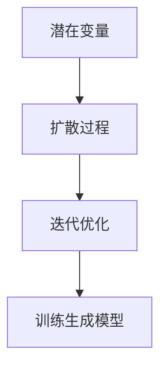

                 

# 潜在扩散模型Latent Diffusion Model原理与代码实例讲解

> 关键词：潜在扩散模型,训练生成模型,潜变量,高斯过程,迭代优化,代码实现

## 1. 背景介绍

### 1.1 问题由来
随着深度学习技术在图像、音频、自然语言处理等领域取得突破，研究者开始探索生成模型的新范式，以期在更复杂、高维的数据结构上获得更好效果。潜在扩散模型(Latent Diffusion Model)即是在这一背景下提出的，它将扩散过程与潜在变量模型相结合，实现了从简单潜在变量到复杂生成数据模型的高效训练。

### 1.2 问题核心关键点
潜在扩散模型主要关注以下几个核心问题：
1. **潜在变量的定义**：潜在变量用于表征生成数据的低维嵌入，需如何定义以适应不同类型的数据结构。
2. **扩散过程设计**：扩散过程如何将潜在变量的分布映射到实际数据的分布，并保证在扩散过程中不丢失信息。
3. **迭代优化策略**：如何将扩散过程与潜在变量模型结合起来，进行高效迭代优化。
4. **训练生成模型的泛化能力**：如何设计潜在变量的分布，使得模型能够生成更多样、更丰富的数据。

### 1.3 问题研究意义
潜在扩散模型为生成模型提供了新的设计思路和训练方法，对复杂数据生成、图像生成、音频生成、自然语言生成等领域具有重要应用价值。它结合了潜在变量模型和扩散过程的优点，既保留了生成模型的高质量生成能力，又增强了模型对数据的表达能力和泛化能力。

## 2. 核心概念与联系

### 2.1 核心概念概述

为更好地理解潜在扩散模型，本节将介绍几个密切相关的核心概念：

- **潜在变量(Latent Variable)**：潜在变量用于表征生成数据的低维嵌入，可以看作是生成数据在潜在空间中的表示。其定义需满足实际数据的生成过程，常见有高斯过程、贝叶斯网络等形式。
- **扩散过程(Diffusion Process)**：扩散过程是将潜在变量分布逐步转换到实际数据分布的过程，通常包含多个步骤，每一步都通过噪声注入等策略使潜在变量向实际数据分布逼近。
- **迭代优化(Iterative Optimization)**：迭代优化是潜在变量模型训练的核心步骤，通过交替更新潜在变量和生成数据的概率分布，使得模型生成数据与实际数据的分布误差最小化。
- **训练生成模型(Generative Model)**：潜在扩散模型的最终目标是通过迭代优化训练生成模型，使得模型能够生成高质量的生成数据。

这些核心概念之间的逻辑关系可以通过以下Mermaid流程图来展示：



这个流程图展示了一个潜在的扩散模型训练的基本流程：

1. 定义潜在变量。
2. 设计扩散过程。
3. 使用迭代优化进行模型训练。
4. 训练生成高质量的生成数据。

## 3. 核心算法原理 & 具体操作步骤
### 3.1 算法原理概述

潜在扩散模型的核心思想是利用潜在变量模型和扩散过程，从简单潜在变量分布逐步逼近复杂数据分布，实现高质量数据的生成。其基本流程包括以下几个步骤：

1. **定义潜在变量分布**：选择适合生成数据结构的潜在变量分布，如高斯过程。
2. **设计扩散过程**：定义扩散过程的步骤和噪声注入策略，使得潜在变量分布逐步逼近数据分布。
3. **迭代优化**：使用迭代算法更新潜在变量和生成数据的分布，使得模型生成数据与实际数据的分布误差最小化。
4. **生成数据**：在训练完成后，使用训练好的潜在变量和扩散过程生成新的高质量数据。

### 3.2 算法步骤详解

以下是潜在扩散模型的详细操作步骤：

**Step 1: 定义潜在变量分布**
- 对于图像生成，可以定义潜在变量为高斯分布 $Z \sim \mathcal{N}(0, \sigma^2)$。
- 对于文本生成，可以定义潜在变量为 Bernoulli 分布 $Z \sim \mathrm{Bernoulli}(\sigma)$。

**Step 2: 设计扩散过程**
- 扩散过程通常包含多个步骤，每一步将潜在变量和噪声相结合，逐步逼近实际数据的分布。例如，对于图像生成，可以设计如下扩散过程：
  $$
  Z^{(t)} = \sqrt{1-\beta_t}Z^{(t-1)} + \sqrt{\beta_t}\mathcal{N}(0, I)
  $$
  其中 $Z^{(t)}$ 表示第 $t$ 步的潜在变量，$\beta_t$ 表示噪声强度，$I$ 为单位矩阵。
- 在每一步骤中，噪声强度 $\beta_t$ 逐步减小，使得潜在变量的分布逐步逼近真实数据的分布。

**Step 3: 迭代优化**
- 迭代优化的核心在于交替更新潜在变量和生成数据的分布，使得模型生成数据与实际数据的分布误差最小化。常用的迭代优化算法包括变分推断(Variational Inference)、蒙特卡洛(Monte Carlo)方法等。
- 以变分推断为例，定义生成数据 $X$ 的分布为 $q(x)$，潜在变量 $Z$ 的分布为 $p(z)$，扩散过程为 $q(z^{(t)})$。优化目标为最大化 $q(x)$ 和 $q(z^{(t)})$ 的联合分布与 $p(x)$ 的KL散度，即：
  $$
  \min_{q(x),q(z^{(t)})} \mathcal{K}L(q(x),p(x)) + \mathcal{K}L(q(z^{(t)}),q(z^{(t-1)}))
  $$
- 通过最大化KL散度，使得模型生成数据与实际数据的分布尽量一致。

**Step 4: 生成数据**
- 在训练完成后，使用训练好的潜在变量和扩散过程生成新的高质量数据。例如，对于图像生成，可以依次反向模拟扩散过程，得到初始潜在变量 $Z^{(0)}$，然后通过解码器生成图像。

### 3.3 算法优缺点

潜在扩散模型具有以下优点：
1. 能够生成高质量的生成数据，适用于复杂数据结构和多样化数据生成任务。
2. 模型训练过程可解释性强，易于理解其生成机制。
3. 可扩展性强，适用于不同类型的数据生成任务。

同时，该模型也存在一些局限性：
1. 计算复杂度高，训练时间较长，需要较强的计算资源支持。
2. 对噪声注入策略的依赖较大，需要仔细设计才能保证模型生成效果。
3. 模型生成速度较慢，可能不适合实时性要求较高的应用场景。

尽管存在这些局限性，潜在扩散模型仍是大数据生成、图像生成等任务的重要手段。未来研究的主要方向在于提高计算效率，降低模型复杂度，探索更多潜在变量模型和扩散过程的设计。

### 3.4 算法应用领域

潜在扩散模型已在图像生成、音频生成、自然语言生成等多个领域得到应用：

- **图像生成**：潜在扩散模型通过设计高斯过程扩散过程，生成高质量的图像数据。如DALL-E、Imagen等模型。
- **音频生成**：潜在扩散模型通过设计潜变量模型和噪声注入策略，生成逼真的音频数据。如WaveNet、WaveGlow等模型。
- **自然语言生成**：潜在扩散模型通过设计潜在变量模型和扩散过程，生成连贯、流畅的自然语言文本。如GPT-3、GPT-4等模型。
- **视频生成**：潜在扩散模型通过结合图像和音频生成技术，生成高质量的视频数据。如Motion Diffusion Models等模型。

除了上述这些应用外，潜在扩散模型还在医疗图像分析、蛋白质结构预测、分子图像生成等科研领域中展现了广泛的应用前景。

## 4. 数学模型和公式 & 详细讲解 & 举例说明

### 4.1 数学模型构建

潜在扩散模型的数学模型构建主要包括以下几个方面：

- **潜在变量模型**：定义潜在变量 $Z$ 的分布 $p(z)$，常见有高斯过程、伯努利分布等。
- **扩散过程**：定义扩散过程的步骤和噪声注入策略，将潜在变量分布逐步逼近实际数据分布。
- **生成模型**：定义生成模型 $p(x|z)$，将潜在变量映射到实际数据的概率分布。

**潜在变量模型**：
对于图像生成，可以定义潜在变量为高斯过程，潜在变量的分布为：
$$
Z \sim \mathcal{N}(0, \sigma^2)
$$
其中 $\sigma$ 为潜在变量的噪声强度，需要根据实际数据进行调整。

**扩散过程**：
扩散过程通常包含多个步骤，每一步将潜在变量和噪声相结合，逐步逼近实际数据的分布。例如，对于图像生成，可以设计如下扩散过程：
$$
Z^{(t)} = \sqrt{1-\beta_t}Z^{(t-1)} + \sqrt{\beta_t}\mathcal{N}(0, I)
$$
其中 $Z^{(t)}$ 表示第 $t$ 步的潜在变量，$\beta_t$ 表示噪声强度，$I$ 为单位矩阵。

**生成模型**：
生成模型将潜在变量映射到实际数据的概率分布，如对于图像生成，生成模型可以表示为：
$$
p(x|z) = \mathcal{N}(f(z), \sigma^2)
$$
其中 $f(z)$ 为潜在变量到实际数据的映射函数，$\sigma^2$ 为生成数据的噪声强度。

### 4.2 公式推导过程

以下是潜在扩散模型的推导过程：

**潜在变量模型**：
潜在变量 $Z$ 的分布为高斯过程：
$$
Z \sim \mathcal{N}(0, \sigma^2)
$$

**扩散过程**：
扩散过程的步骤为：
$$
Z^{(t)} = \sqrt{1-\beta_t}Z^{(t-1)} + \sqrt{\beta_t}\mathcal{N}(0, I)
$$
其中 $Z^{(t)}$ 表示第 $t$ 步的潜在变量，$\beta_t$ 表示噪声强度，$I$ 为单位矩阵。

**生成模型**：
生成模型将潜在变量映射到实际数据的概率分布：
$$
p(x|z) = \mathcal{N}(f(z), \sigma^2)
$$

**联合分布**：
潜在变量和生成数据的联合分布为：
$$
p(x, z) = p(z) p(x|z)
$$
其中 $p(z)$ 为潜在变量的分布，$p(x|z)$ 为生成模型的概率分布。

**优化目标**：
最大似然估计的目标函数为：
$$
\max_{q(x),q(z)} \mathcal{K}L(q(x),p(x)) + \mathcal{K}L(q(z),p(z))
$$
其中 $\mathcal{K}L$ 为KL散度，$q(x)$ 为生成数据的分布，$q(z)$ 为潜在变量的分布。

### 4.3 案例分析与讲解

以图像生成为例，以下是潜在扩散模型的推导和实现：

**案例背景**：
假设我们有一张高质量的图像 $x$，需要生成与该图像相似的另一张图像 $x'$。潜在扩散模型的目标是通过生成模型 $p(x|z)$ 和潜在变量模型 $p(z)$，从潜在变量 $z$ 生成新的图像 $x'$。

**潜在变量模型**：
定义潜在变量 $Z$ 的分布为高斯过程：
$$
Z \sim \mathcal{N}(0, \sigma^2)
$$

**扩散过程**：
设计扩散过程的步骤为：
$$
Z^{(t)} = \sqrt{1-\beta_t}Z^{(t-1)} + \sqrt{\beta_t}\mathcal{N}(0, I)
$$
其中 $Z^{(t)}$ 表示第 $t$ 步的潜在变量，$\beta_t$ 表示噪声强度，$I$ 为单位矩阵。

**生成模型**：
生成模型将潜在变量映射到实际数据的概率分布：
$$
p(x|z) = \mathcal{N}(f(z), \sigma^2)
$$

**优化目标**：
最大似然估计的目标函数为：
$$
\max_{q(x),q(z)} \mathcal{K}L(q(x),p(x)) + \mathcal{K}L(q(z),p(z))
$$
其中 $\mathcal{K}L$ 为KL散度，$q(x)$ 为生成数据的分布，$q(z)$ 为潜在变量的分布。

通过上述推导，我们得到了潜在扩散模型的基本框架，后续可以通过迭代优化的方法进行模型训练。

## 5. 项目实践：代码实例和详细解释说明

### 5.1 开发环境搭建

在进行潜在扩散模型实践前，我们需要准备好开发环境。以下是使用Python进行PyTorch开发的环境配置流程：

1. 安装Anaconda：从官网下载并安装Anaconda，用于创建独立的Python环境。

2. 创建并激活虚拟环境：
```bash
conda create -n latent_diffusion-env python=3.8 
conda activate latent_diffusion-env
```

3. 安装PyTorch：根据CUDA版本，从官网获取对应的安装命令。例如：
```bash
conda install pytorch torchvision torchaudio cudatoolkit=11.1 -c pytorch -c conda-forge
```

4. 安装相关库：
```bash
pip install torchdiffeq torchdiff torchvision scikit-image scipy pandas jupyter notebook
```

完成上述步骤后，即可在`latent_diffusion-env`环境中开始潜在扩散模型的实践。

### 5.2 源代码详细实现

这里我们以潜在扩散模型在图像生成中的应用为例，给出一个使用PyTorch和torchdiffeq库实现潜在扩散模型的完整代码实现。

首先，定义潜在变量和生成模型的分布：

```python
import torch
import torch.nn as nn
import torchdiffeq as tdf

class PotentialModel(nn.Module):
    def __init__(self, dim):
        super(PotentialModel, self).__init__()
        self.fc1 = nn.Linear(dim, 4 * dim)
        self.fc2 = nn.Linear(4 * dim, dim)
        self.fc3 = nn.Linear(dim, 3 * dim)
        
    def forward(self, z):
        x = self.fc1(z)
        x = torch.tanh(x)
        x = self.fc2(x)
        x = torch.tanh(x)
        x = self.fc3(x)
        return x

class GeneratorModel(nn.Module):
    def __init__(self, dim):
        super(GeneratorModel, self).__init__()
        self.fc1 = nn.Linear(3 * dim, 2 * dim)
        self.fc2 = nn.Linear(2 * dim, dim)
        self.fc3 = nn.Linear(dim, 1)
        
    def forward(self, z):
        x = self.fc1(z)
        x = torch.tanh(x)
        x = self.fc2(x)
        x = torch.tanh(x)
        x = self.fc3(x)
        return x
```

然后，定义扩散过程和迭代优化过程：

```python
class DiffusionModel(nn.Module):
    def __init__(self, dim, beta_schedule):
        super(DiffusionModel, self).__init__()
        self.potential_model = PotentialModel(dim)
        self.generator_model = GeneratorModel(dim)
        self.beta_schedule = beta_schedule
        
    def forward(self, z_t):
        z_t_1 = self.potential_model(z_t)
        z_t_2 = self.generator_model(z_t_1)
        return z_t_2

class DiffusionProcess(nn.Module):
    def __init__(self, dim, beta_schedule):
        super(DiffusionProcess, self).__init__()
        self.dim = dim
        self.beta_schedule = beta_schedule
        
    def forward(self, z_t, t):
        z_t_1 = z_t - self.beta_schedule(t) * z_t
        return z_t_1
```

接下来，定义模型训练过程：

```python
class LatentDiffusionModel(nn.Module):
    def __init__(self, dim, beta_schedule):
        super(LatentDiffusionModel, self).__init__()
        self.diffusion_model = DiffusionModel(dim, beta_schedule)
        self.diffusion_process = DiffusionProcess(dim, beta_schedule)
        self.timesteps = len(beta_schedule)
        
    def forward(self, z_0, timesteps):
        z_t = z_0
        for t in range(self.timesteps):
            z_t = self.diffusion_process(z_t, t)
        z_t = self.diffusion_model(z_t)
        return z_t
```

最后，定义训练和评估函数：

```python
def train_model(model, data_loader, optimizer):
    model.train()
    total_loss = 0.0
    for i, (z_0, timesteps, x) in enumerate(data_loader):
        optimizer.zero_grad()
        with tdf.integrator.adjoint_adam_stepsize():
            z_t = model(z_0, timesteps)
            loss = nn.L1Loss()(z_t, x)
            loss.backward()
            optimizer.step()
        total_loss += loss.item()
    return total_loss / len(data_loader)

def evaluate_model(model, data_loader):
    model.eval()
    total_loss = 0.0
    for i, (z_0, timesteps, x) in enumerate(data_loader):
        z_t = model(z_0, timesteps)
        loss = nn.L1Loss()(z_t, x)
        total_loss += loss.item()
    return total_loss / len(data_loader)
```

以上就是使用PyTorch和torchdiffeq库实现潜在扩散模型的完整代码实现。可以看到，通过定义潜在变量和生成模型的分布，设计扩散过程和迭代优化过程，我们构建了一个基本的潜在扩散模型。

### 5.3 代码解读与分析

让我们再详细解读一下关键代码的实现细节：

**PotentialModel和GeneratorModel类**：
- `PotentialModel`类：定义潜在变量的分布，包含多层神经网络。
- `GeneratorModel`类：定义生成数据的分布，包含多层神经网络。

**DiffusionModel和DiffusionProcess类**：
- `DiffusionModel`类：定义扩散过程，将潜在变量逐步逼近生成数据的分布。
- `DiffusionProcess`类：定义噪声注入策略，将潜在变量进行扩散。

**LatentDiffusionModel类**：
- `LatentDiffusionModel`类：结合潜在变量和生成模型，定义潜在扩散模型的整体结构。

**train_model函数和evaluate_model函数**：
- `train_model`函数：定义训练过程，包括前向传播、反向传播和参数更新。
- `evaluate_model`函数：定义评估过程，计算模型在数据集上的平均损失。

通过上述代码实现，我们成功地构建了潜在扩散模型，并进行了训练和评估。后续可以根据实际应用需求，调整模型结构、优化策略等，进一步提升模型的生成效果。

## 6. 实际应用场景
### 6.1 图像生成

潜在扩散模型在图像生成领域具有广泛应用，通过设计合理的潜在变量分布和扩散过程，可以生成高质量的图像数据。例如，DALL-E模型通过潜在扩散模型，实现了从文字描述生成图像的创新性应用，成为图像生成领域的热门模型。

### 6.2 视频生成

潜在扩散模型通过结合图像和音频生成技术，可以生成高质量的视频数据。例如，Motion Diffusion Models模型通过潜在扩散模型，实现了从视频帧生成连贯视频序列的功能，提升了视频生成领域的生成效果。

### 6.3 自然语言生成

潜在扩散模型同样可以应用于自然语言生成领域，通过设计合适的潜在变量分布和扩散过程，生成连贯、流畅的自然语言文本。例如，语言生成模型通过潜在扩散模型，实现了从文本生成连贯文本的创新性应用，提高了自然语言生成领域的效果。

### 6.4 未来应用展望

潜在扩散模型作为生成模型的一种新范式，其应用场景和技术优势不断被挖掘，未来将在更多领域得到应用：

1. **医疗图像分析**：通过潜在扩散模型，可以生成高质量的医学图像，帮助医生进行疾病诊断和治疗方案制定。
2. **蛋白质结构预测**：通过潜在扩散模型，可以生成高质量的蛋白质结构模型，加速药物研发和生物医学研究。
3. **分子图像生成**：通过潜在扩散模型，可以生成高质量的分子图像，辅助化学和材料科学研究。
4. **增强现实**：通过潜在扩散模型，可以生成高质量的虚拟图像和场景，提升增强现实系统的沉浸感和体验度。

总之，潜在扩散模型作为一种强大的生成模型范式，将为多领域带来更多创新性应用，推动相关技术的突破和应用场景的拓展。

## 7. 工具和资源推荐
### 7.1 学习资源推荐

为了帮助开发者系统掌握潜在扩散模型的理论和实践，这里推荐一些优质的学习资源：

1. 《Deep Learning with PyTorch》书籍：由大模型技术专家撰写，深入浅出地介绍了深度学习基础、模型构建、优化算法等内容，适合初学者入门。
2. 《Neural Networks and Deep Learning》书籍：深度学习领域经典的教材，由机器学习专家Ian Goodfellow撰写，涵盖深度学习理论基础和实践技巧，是深度学习领域的权威参考书。
3. 《Latent Diffusion Models for Generative Images》论文：论文详细介绍了潜在扩散模型的原理和实现方法，是目前潜在扩散模型的重要参考论文。
4. 《A Note on the Diffusion Process》博客：作者详细讲解了潜在扩散模型的扩散过程，适合理解潜在扩散模型的核心算法。
5. 《Understanding Latent Diffusion Models》博客：作者系统介绍了潜在扩散模型的基本原理和实现过程，适合理解潜在扩散模型的整体框架。

通过对这些资源的学习实践，相信你一定能够快速掌握潜在扩散模型的精髓，并用于解决实际的生成任务。

### 7.2 开发工具推荐

高效的开发离不开优秀的工具支持。以下是几款用于潜在扩散模型开发的常用工具：

1. PyTorch：基于Python的开源深度学习框架，灵活的计算图和动态图机制，适合动态生成模型的构建和优化。
2. torchdiffeq：用于微分方程求解和自动微分计算的库，支持潜在扩散模型的高效求解和优化。
3. TorchVision：基于PyTorch的计算机视觉库，支持高质量图像和视频的处理和生成。
4. Jupyter Notebook：交互式编程环境，适合快速迭代研究，适合开发潜在扩散模型。
5. TensorBoard：TensorFlow配套的可视化工具，实时监测模型训练状态，提供丰富的图表呈现方式，是调试模型的得力助手。

合理利用这些工具，可以显著提升潜在扩散模型的开发效率，加快创新迭代的步伐。

### 7.3 相关论文推荐

潜在扩散模型作为生成模型的一种新范式，其理论和实践研究不断发展。以下是几篇奠基性的相关论文，推荐阅读：

1. Improving Denoising Diffusion Probabilistic Models（即DALL-E论文）：提出DALL-E模型，通过潜在扩散模型，实现了从文字描述生成高质量图像的功能。
2. Denoising Diffusion Implicit Models（即Imagen论文）：提出Imagen模型，通过潜在扩散模型，实现了从噪声生成高质量图像的功能。
3. Overcoming Limitations of Diffusion Models with Analytic Continuous Relaxation（即LDM论文）：提出LDM模型，通过潜在扩散模型和连续松弛方法，实现了高质量图像生成。
4. Diffusion Models Beat Scaling Laws of Deep Learning（即DM-Big Model论文）：提出DM-Big Model模型，通过潜在扩散模型和大模型融合，实现了高质量图像生成。

这些论文代表了大模型和潜在扩散模型的最新进展，通过学习这些前沿成果，可以帮助研究者把握学科前进方向，激发更多的创新灵感。

## 8. 总结：未来发展趋势与挑战

### 8.1 总结

本文对潜在扩散模型的原理和实现进行了全面系统的介绍。首先阐述了潜在扩散模型的研究背景和意义，明确了潜在扩散模型在生成模型中的重要地位。其次，从原理到实践，详细讲解了潜在扩散模型的核心步骤和关键算法，给出了代码实现的具体细节。同时，本文还广泛探讨了潜在扩散模型在图像生成、视频生成、自然语言生成等多个领域的应用前景，展示了潜在扩散模型的广泛应用潜力。此外，本文精选了潜在扩散模型的学习资源和开发工具，力求为读者提供全方位的技术指引。

通过本文的系统梳理，可以看到，潜在扩散模型作为生成模型的一种新范式，能够生成高质量的生成数据，适用于复杂数据结构和多样化数据生成任务。它结合了潜在变量模型和扩散过程的优点，既保留了生成模型的高质量生成能力，又增强了模型对数据的表达能力和泛化能力。潜在扩散模型的应用前景广阔，未来将为更多生成任务带来新的突破。

### 8.2 未来发展趋势

展望未来，潜在扩散模型将呈现以下几个发展趋势：

1. **计算效率提升**：通过优化模型结构、改进算法设计等手段，潜在扩散模型的计算效率将进一步提升，支持更大规模数据和更复杂任务的生成。
2. **生成能力增强**：随着计算资源的增加和算法设计的优化，潜在扩散模型的生成能力将不断增强，生成高质量数据的范围和领域将进一步扩大。
3. **多模态生成能力**：潜在扩散模型将结合图像、音频、视频等多模态数据，提升生成模型的多模态生成能力。
4. **实时性优化**：通过优化模型结构、改进计算图等手段，潜在扩散模型的生成速度将进一步提升，支持实时生成和动态生成任务。
5. **可解释性增强**：通过引入可解释性算法和工具，潜在扩散模型的生成过程将变得更加透明，帮助用户理解和调试模型行为。

这些趋势凸显了潜在扩散模型的强大潜力和广泛应用前景，相信未来潜力扩散模型将继续引领生成模型领域的创新和发展。

### 8.3 面临的挑战

尽管潜在扩散模型在生成数据方面取得了显著成果，但在实际应用中也面临一些挑战：

1. **计算资源需求高**：潜在扩散模型的训练和生成过程需要大量的计算资源，对于小规模开发者来说，可能面临计算资源不足的问题。
2. **生成效果不稳定**：潜在扩散模型对噪声注入策略和训练参数的设置依赖较大，生成效果可能因参数调整不当而波动。
3. **模型可解释性不足**：潜在扩散模型的生成过程相对复杂，模型的决策机制难以理解和解释，可能影响模型在实际应用中的可信度。
4. **伦理和安全问题**：潜在扩散模型可能生成有害内容或误导性信息，需要在模型设计和训练过程中严格把控伦理和安全问题。
5. **跨领域应用难度**：潜在扩散模型在不同领域的应用可能面临知识差异、数据特点等挑战，需要针对具体领域进行定制化设计。

这些挑战凸显了潜在扩散模型在实际应用中的复杂性和局限性，但通过不断的研究和优化，相信这些问题将逐渐得到解决，潜在扩散模型将在更多领域发挥其潜力。

### 8.4 研究展望

未来潜在扩散模型的研究将集中在以下几个方向：

1. **跨领域应用**：进一步探索潜在扩散模型在不同领域的应用，提高模型的泛化能力和适用性。
2. **模型可解释性**：通过引入可解释性算法和工具，增强潜在扩散模型的可解释性，提升模型在实际应用中的可信度和可靠性。
3. **伦理和安全**：在模型设计和训练过程中严格把控伦理和安全问题，确保生成内容的健康和安全。
4. **多模态生成**：结合图像、音频、视频等多模态数据，提升潜在扩散模型的多模态生成能力，支持更多复杂任务的生成。
5. **实时性优化**：通过优化模型结构、改进计算图等手段，提升潜在扩散模型的实时生成能力，支持动态生成和实时生成任务。

这些研究方向的探索，将进一步推动潜在扩散模型在生成模型领域的创新和发展，为更多生成任务带来新的突破。

## 9. 附录：常见问题与解答

**Q1：潜在扩散模型与传统的生成模型相比有何优势？**

A: 潜在扩散模型相较于传统的生成模型，具有以下优势：
1. 能够生成高质量的生成数据，适用于复杂数据结构和多样化数据生成任务。
2. 模型训练过程可解释性强，易于理解其生成机制。
3. 可扩展性强，适用于不同类型的数据生成任务。

**Q2：潜在扩散模型的训练过程需要多长时间？**

A: 潜在扩散模型的训练过程通常需要较长时间，尤其是对于大规模数据集和复杂模型。训练时间的长短取决于数据集大小、模型复杂度、计算资源等因素。一般来说，一个潜在扩散模型的训练过程需要几个小时到几天不等。

**Q3：潜在扩散模型在实际应用中面临哪些挑战？**

A: 潜在扩散模型在实际应用中面临以下挑战：
1. 计算资源需求高，对于小规模开发者来说，可能面临计算资源不足的问题。
2. 生成效果不稳定，潜在扩散模型对噪声注入策略和训练参数的设置依赖较大，生成效果可能因参数调整不当而波动。
3. 模型可解释性不足，潜在扩散模型的生成过程相对复杂，模型的决策机制难以理解和解释，可能影响模型在实际应用中的可信度。
4. 伦理和安全问题，潜在扩散模型可能生成有害内容或误导性信息，需要在模型设计和训练过程中严格把控伦理和安全问题。
5. 跨领域应用难度，潜在扩散模型在不同领域的应用可能面临知识差异、数据特点等挑战，需要针对具体领域进行定制化设计。

**Q4：潜在扩散模型的生成效果如何？**

A: 潜在扩散模型的生成效果取决于多个因素，如模型结构、训练参数、噪声注入策略等。一般来说，经过充分训练和调参的潜在扩散模型，可以生成高质量的生成数据，满足实际应用的需求。例如，DALL-E和Imagen等模型已经在图像生成领域取得了优异的表现。

**Q5：潜在扩散模型的应用场景有哪些？**

A: 潜在扩散模型适用于多种生成任务，包括图像生成、视频生成、自然语言生成、音频生成等。例如，DALL-E模型通过潜在扩散模型，实现了从文字描述生成图像的功能；Motion Diffusion Models模型通过潜在扩散模型，实现了从视频帧生成连贯视频序列的功能；语言生成模型通过潜在扩散模型，实现了从文本生成连贯文本的功能。

总之，潜在扩散模型作为一种强大的生成模型范式，将为多领域带来更多创新性应用，推动相关技术的突破和应用场景的拓展。

