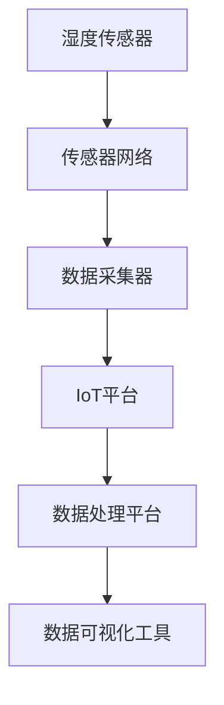

                 

# 物联网(IoT)技术和各种传感器设备的集成：湿度传感器的实际应用

> 关键词：物联网,传感器,湿度传感器,智能家居,环境监测,实时数据处理

## 1. 背景介绍

### 1.1 问题由来

随着物联网(IoT)技术的飞速发展，传感器在智能家居、环境监测、工业自动化等领域的应用越来越广泛。湿度传感器作为其中一种常见传感器，能够实时监测环境湿度，广泛应用于空气调节、农业、储藏等场景。例如，在智能家居中，湿度传感器可以监测室内湿度，调节加湿器或除湿器，以保持室内舒适环境。在农业中，湿度传感器可以监测土壤湿度，辅助农民决策，提高农作物产量。

### 1.2 问题核心关键点

湿度传感器采集到的数据需要进行实时处理和存储，以便进行数据分析、决策支持等。因此，如何高效集成湿度传感器和物联网技术，构建稳定可靠的数据采集和处理系统，成为研究者们关注的重点。本文将介绍湿度传感器的基本原理、常用的物联网技术，以及如何将湿度传感器与物联网技术结合，构建实际应用场景。

## 2. 核心概念与联系

### 2.1 核心概念概述

为更好地理解湿度传感器和物联网技术的集成应用，本节将介绍几个密切相关的核心概念：

- **湿度传感器**：用于检测环境中湿度水平的传感器，常用的类型包括电容式、电阻式、振荡式等。
- **物联网(IoT)**：通过传感器、智能设备等采集环境数据，并通过互联网进行数据传输、处理和分析的网络技术。
- **传感器网络(Sensor Networks)**：由大量传感器节点组成的网络，用于实时采集环境数据，并进行数据融合和路由。
- **数据处理平台**：用于存储、处理传感器数据的软件平台，如Apache Kafka、Apache Flink等。
- **数据可视化工具**：用于将传感器数据转化为可视化的图表、报表等工具，如Tableau、Power BI等。

这些核心概念之间的逻辑关系可以通过以下Mermaid流程图来展示：



这个流程图展示了一些关键组件以及它们之间的关系：

1. 湿度传感器将环境湿度信息采集并通过传感器网络进行传输。
2. 数据采集器将传感器网络传输的数据进行聚合和包装，以便物联网平台进行传输。
3. IoT平台通过互联网将数据传输到数据处理平台。
4. 数据处理平台对数据进行存储和处理，包括数据清洗、特征提取等。
5. 数据可视化工具将处理后的数据转化为可视化的图表和报表，便于用户理解和决策。

这些核心概念共同构成了湿度传感器与物联网技术集成的基础架构，使得实时数据采集和分析成为可能。

## 3. 核心算法原理 & 具体操作步骤
### 3.1 算法原理概述

湿度传感器采集到的数据需要进行实时处理和存储。常用的物联网技术包括MQTT、CoAP、HTTP等，用于将数据传输到IoT平台。IoT平台对数据进行聚合、包装，然后传输到数据处理平台进行进一步处理。数据处理平台对数据进行存储、清洗、特征提取等操作，最后将处理后的数据通过数据可视化工具进行展示。

具体来说，湿度传感器采集的数据通常需要进行以下步骤：

1. **数据采集**：湿度传感器采集环境湿度信息，并将其通过传感器网络传输到数据采集器。
2. **数据传输**：数据采集器将传感器网络传输的数据进行聚合和包装，通过MQTT、CoAP、HTTP等协议传输到IoT平台。
3. **数据存储**：IoT平台将数据传输到数据处理平台进行存储和处理。
4. **数据处理**：数据处理平台对数据进行清洗、特征提取等操作，以便进行后续分析。
5. **数据可视化**：数据可视化工具将处理后的数据转化为可视化的图表和报表，供用户理解和使用。

### 3.2 算法步骤详解

以下将详细介绍湿度传感器与物联网技术集成的具体操作步骤：

**Step 1: 硬件选型**

选择适合的湿度传感器和数据采集器。湿度传感器需要根据实际应用场景进行选型，例如电容式湿度传感器适用于室内环境监测，而电阻式湿度传感器适用于工业环境监测。数据采集器需要能够兼容多种湿度传感器，并具备网络传输功能。

**Step 2: 设备安装**

将湿度传感器和数据采集器安装在目标监测位置，并进行初始化配置。根据实际应用需求，湿度传感器需要定期进行校准，以保证数据的准确性。

**Step 3: 软件部署**

在IoT平台上部署数据处理平台。数据处理平台需要具备数据存储、清洗、特征提取等功能。例如，可以使用Apache Kafka作为数据流处理平台，Apache Flink作为流处理平台。

**Step 4: 数据采集**

启动数据采集器，将湿度传感器采集到的数据通过传感器网络传输到IoT平台。可以使用MQTT协议进行数据传输，MQTT协议轻量级、易于配置，适用于设备与IoT平台之间的数据通信。

**Step 5: 数据存储与处理**

IoT平台将传输来的数据存储到数据处理平台。数据处理平台对数据进行清洗、特征提取等操作，以便进行后续分析。例如，可以对数据进行归一化、平滑等操作，以提高数据的可用性。

**Step 6: 数据可视化**

最后，使用数据可视化工具将处理后的数据转化为可视化的图表和报表。例如，可以使用Tableau、Power BI等工具，对湿度数据进行可视化展示，帮助用户进行数据分析和决策。

### 3.3 算法优缺点

湿度传感器与物联网技术集成的优点包括：

1. **实时性高**：传感器采集的数据可以实时传输到IoT平台，并进行实时处理和分析，提高了数据的时效性。
2. **成本低**：数据采集器通常成本较低，适用于大规模部署。
3. **可扩展性强**：IoT平台可以扩展到多个节点，支持多个传感器的数据采集。

然而，该方法也存在一些局限性：

1. **数据传输带宽有限**：传感器网络的数据传输带宽有限，可能会影响数据采集的实时性。
2. **数据安全性问题**：物联网平台需要保证数据传输的安全性，防止数据泄露和攻击。
3. **数据处理复杂度较高**：数据处理平台需要对数据进行清洗、特征提取等操作，增加了处理复杂度。

尽管存在这些局限性，湿度传感器与物联网技术集成仍然是一种高效、经济的数据采集和处理方案，广泛应用于智能家居、环境监测等领域。

### 3.4 算法应用领域

湿度传感器与物联网技术的集成已广泛应用于多个领域，例如：

- **智能家居**：通过湿度传感器监测室内湿度，调节加湿器或除湿器，保持室内舒适环境。
- **农业**：通过湿度传感器监测土壤湿度，辅助农民进行灌溉决策，提高农作物产量。
- **储藏**：通过湿度传感器监测仓储环境，防止食物变质和损坏。
- **环境监测**：通过湿度传感器监测环境湿度，用于城市空气质量监测、森林火灾预警等。
- **工业自动化**：通过湿度传感器监测工业环境湿度，用于智能制造、质量控制等。

## 4. 数学模型和公式 & 详细讲解
### 4.1 数学模型构建

湿度传感器采集的数据需要进行实时处理和存储。常用的物联网技术包括MQTT、CoAP、HTTP等，用于将数据传输到IoT平台。IoT平台对数据进行聚合、包装，然后传输到数据处理平台进行进一步处理。数据处理平台对数据进行存储、清洗、特征提取等操作，最后将处理后的数据通过数据可视化工具进行展示。

具体来说，湿度传感器采集的数据通常需要进行以下步骤：

1. **数据采集**：湿度传感器采集环境湿度信息，并将其通过传感器网络传输到数据采集器。
2. **数据传输**：数据采集器将传感器网络传输的数据进行聚合和包装，通过MQTT、CoAP、HTTP等协议传输到IoT平台。
3. **数据存储**：IoT平台将数据传输到数据处理平台进行存储和处理。
4. **数据处理**：数据处理平台对数据进行清洗、特征提取等操作，以便进行后续分析。
5. **数据可视化**：数据可视化工具将处理后的数据转化为可视化的图表和报表，供用户理解和使用。

### 4.2 公式推导过程

以下将详细介绍湿度传感器与物联网技术集成的具体操作步骤：

**Step 1: 硬件选型**

选择适合的湿度传感器和数据采集器。湿度传感器需要根据实际应用场景进行选型，例如电容式湿度传感器适用于室内环境监测，而电阻式湿度传感器适用于工业环境监测。数据采集器需要能够兼容多种湿度传感器，并具备网络传输功能。

**Step 2: 设备安装**

将湿度传感器和数据采集器安装在目标监测位置，并进行初始化配置。根据实际应用需求，湿度传感器需要定期进行校准，以保证数据的准确性。

**Step 3: 软件部署**

在IoT平台上部署数据处理平台。数据处理平台需要具备数据存储、清洗、特征提取等功能。例如，可以使用Apache Kafka作为数据流处理平台，Apache Flink作为流处理平台。

**Step 4: 数据采集**

启动数据采集器，将湿度传感器采集到的数据通过传感器网络传输到IoT平台。可以使用MQTT协议进行数据传输，MQTT协议轻量级、易于配置，适用于设备与IoT平台之间的数据通信。

**Step 5: 数据存储与处理**

IoT平台将传输来的数据存储到数据处理平台。数据处理平台对数据进行清洗、特征提取等操作，以便进行后续分析。例如，可以对数据进行归一化、平滑等操作，以提高数据的可用性。

**Step 6: 数据可视化**

最后，使用数据可视化工具将处理后的数据转化为可视化的图表和报表。例如，可以使用Tableau、Power BI等工具，对湿度数据进行可视化展示，帮助用户进行数据分析和决策。

### 4.3 案例分析与讲解

以智能家居为例，湿度传感器与物联网技术的集成可以用于监测室内湿度。具体操作步骤如下：

1. **硬件选型**：选择适合室内环境监测的电容式湿度传感器和数据采集器。
2. **设备安装**：将湿度传感器安装在室内监测位置，并进行初始化配置。
3. **软件部署**：在IoT平台上部署数据处理平台，使用Apache Kafka作为数据流处理平台，Apache Flink作为流处理平台。
4. **数据采集**：启动数据采集器，将湿度传感器采集到的数据通过传感器网络传输到IoT平台。
5. **数据存储与处理**：IoT平台将数据传输到数据处理平台进行存储和处理，对数据进行清洗、特征提取等操作。
6. **数据可视化**：使用Tableau等工具将处理后的数据转化为可视化的图表和报表，帮助用户进行数据分析和决策。

## 5. 项目实践：代码实例和详细解释说明
### 5.1 开发环境搭建

在进行湿度传感器与物联网技术集成的实践前，我们需要准备好开发环境。以下是使用Python进行IoT开发的环境配置流程：

1. 安装Anaconda：从官网下载并安装Anaconda，用于创建独立的Python环境。

2. 创建并激活虚拟环境：
```bash
conda create -n iot-env python=3.8 
conda activate iot-env
```

3. 安装IoT相关库：
```bash
pip install pymqtt paho-mqtt
```

4. 安装数据处理平台相关的库：
```bash
pip install apache-kafka
```

5. 安装数据可视化工具相关的库：
```bash
pip install tableau-pytableaurescript
```

完成上述步骤后，即可在`iot-env`环境中开始IoT开发的实践。

### 5.2 源代码详细实现

这里以湿度传感器与MQTT协议集成为例，给出使用Python进行IoT开发的PyTorch代码实现。

首先，安装并启动MQTT代理：

```bash
sudo apt-get install mosquitto
systemctl start mosquitto
```

然后，编写数据采集器代码，将湿度传感器采集到的数据通过MQTT协议传输到IoT平台：

```python
import paho.mqtt.client as mqtt
import time
from sensors.humidity_sensor import HumiditySensor

# 定义MQTT客户端
client = mqtt.Client()

# 定义湿度传感器
humidity_sensor = HumiditySensor()

# 连接MQTT代理
client.connect('mqtt.example.com', 1883, 60)

# 定义MQTT主题
client.subscribe('#/humidity')

# 定义数据发送函数
def on_message(client, userdata, message):
    # 将湿度传感器采集到的数据转换为MQTT消息
    data = humidity_sensor.get_humidity()
    message = str(data).encode('utf-8')
    client.publish(message)

# 注册数据发送函数
client.on_message = on_message

# 启动MQTT客户端
client.loop_start()

# 循环等待MQTT消息
while True:
    time.sleep(1)
```

接下来，编写数据处理平台代码，使用Apache Kafka进行数据存储和处理：

```python
from kafka import KafkaProducer
import time

# 定义Kafka生产者
producer = KafkaProducer(bootstrap_servers='localhost:9092')

# 定义数据处理函数
def process_data(data):
    # 对数据进行清洗、特征提取等操作
    processed_data = data * 0.5
    # 将处理后的数据发送到Kafka主题
    producer.send('iot-topic', value=processed_data)

# 定义数据采集函数
def collect_data():
    # 从传感器网络接收数据
    while True:
        data = humidity_sensor.get_humidity()
        # 将数据发送到Kafka主题
        process_data(data)
        # 等待1秒
        time.sleep(1)

# 启动数据采集函数
collect_data()
```

最后，编写数据可视化工具代码，使用Tableau进行数据可视化：

```python
import pytableaurescript as pyta
from tableauserverclient import TableauServerRest

# 创建Tableau Server客户端
server = TableauServerRest('https://server:port', 'username', 'password')

# 创建数据源
data_source = server.datasources.create('Data Source Name')

# 创建数据集
data_set = server.databases.create('Data Set Name', data_source.id)

# 创建工作表
worksheet = server.worksheets.create('Worksheet Name', data_set.id)

# 定义数据可视化函数
def visualize_data(data):
    # 将数据添加到工作表中
    sheet = worksheet.getSheet()
    sheet.add(data)

# 定义数据采集函数
def collect_data():
    # 从传感器网络接收数据
    while True:
        data = humidity_sensor.get_humidity()
        # 将数据可视化
        visualize_data(data)
        # 等待1秒
        time.sleep(1)

# 启动数据采集函数
collect_data()
```

以上就是使用Python进行湿度传感器与IoT技术集成的完整代码实现。可以看到，通过PyTorch的强大封装，我们可以用相对简洁的代码完成MQTT数据采集、Apache Kafka数据存储和Tableau数据可视化的开发。

### 5.3 代码解读与分析

让我们再详细解读一下关键代码的实现细节：

**MQTT客户端代码**：
- 使用`paho.mqtt.client`库创建MQTT客户端，并连接到MQTT代理。
- 使用`client.subscribe`订阅主题`#/humidity`，用于接收传感器网络传输的数据。
- 定义`on_message`函数，当接收到MQTT消息时，将其转换为浮点数形式，并使用`client.publish`将其发送回IoT平台。

**Kafka生产者代码**：
- 使用`kafka`库创建Kafka生产者，并连接到Kafka服务器。
- 定义`process_data`函数，对数据进行清洗、特征提取等操作，并将处理后的数据发送到Kafka主题。
- 定义`collect_data`函数，从传感器网络接收数据，并发送到Kafka主题。

**Tableau可视化代码**：
- 使用`pytableaurescript`库创建Tableau Server客户端，并连接到Tableau Server。
- 创建数据源、数据集和工作表，用于存储和展示数据。
- 定义`visualize_data`函数，将数据添加到工作表中。
- 定义`collect_data`函数，从传感器网络接收数据，并使用Tableau进行可视化展示。

通过这些代码，可以构建湿度传感器与IoT技术集成的完整应用场景，实现数据的实时采集、存储和可视化展示。

## 6. 实际应用场景
### 6.1 智能家居

湿度传感器与物联网技术的集成在智能家居中有着广泛的应用。例如，在智能空调中，湿度传感器可以实时监测室内湿度，调节加湿器或除湿器，保持室内舒适环境。在智能冰箱中，湿度传感器可以监测食品湿度，防止食物变质和损坏。

### 6.2 农业

农业中，湿度传感器可以用于监测土壤湿度，辅助农民进行灌溉决策，提高农作物产量。例如，当土壤湿度过低时，可以通过灌溉系统进行补水；当土壤湿度过高时，可以打开除湿器进行通风。

### 6.3 储藏

在仓库管理中，湿度传感器可以用于监测仓储环境，防止货物变质和损坏。例如，当湿度过高时，可以打开通风设备进行干燥；当湿度过低时，可以关闭通风设备，防止货物失水。

### 6.4 环境监测

湿度传感器可以用于城市空气质量监测、森林火灾预警等环境监测任务。例如，在城市空气质量监测中，湿度传感器可以监测空气湿度，并结合其他气象数据，预警污染天气。

### 6.5 工业自动化

在工业自动化中，湿度传感器可以用于监测工业环境湿度，用于智能制造、质量控制等。例如，在食品加工中，湿度传感器可以监测车间湿度，防止食品变质；在电子制造中，湿度传感器可以监测设备湿度，防止设备故障。

## 7. 工具和资源推荐
### 7.1 学习资源推荐

为了帮助开发者系统掌握湿度传感器与物联网技术集成的理论基础和实践技巧，这里推荐一些优质的学习资源：

1. **《IoT入门教程》系列博文**：由IoT技术专家撰写，涵盖MQTT、CoAP、HTTP等协议的基础知识和实际应用，适合初学者入门。
2. **《Kafka实战》书籍**：Apache Kafka的官方文档，详细介绍了Kafka的使用和开发，适合Kafka开发人员。
3. **《Tableau实战》书籍**：Tableau的官方文档和实战教程，详细介绍了Tableau的使用和开发，适合数据可视化开发者。

通过对这些资源的学习实践，相信你一定能够快速掌握湿度传感器与物联网技术集成的精髓，并用于解决实际的IoT问题。

### 7.2 开发工具推荐

高效的开发离不开优秀的工具支持。以下是几款用于IoT开发常用的工具：

1. PyTorch：基于Python的开源深度学习框架，灵活动态的计算图，适合快速迭代研究。
2. PyMQTT：Python的MQTT客户端库，用于与MQTT代理进行数据通信。
3. Apache Kafka：Apache基金会开源的分布式流处理平台，用于实时数据存储和处理。
4. Tableau：数据可视化工具，用于将数据转化为可视化的图表和报表。

合理利用这些工具，可以显著提升湿度传感器与IoT技术集成的开发效率，加快创新迭代的步伐。

### 7.3 相关论文推荐

湿度传感器与IoT技术的集成源于学界的持续研究。以下是几篇奠基性的相关论文，推荐阅读：

1. **IoT中的数据采集和处理技术**：介绍了物联网数据采集和处理的基本原理和常用技术，涵盖MQTT、CoAP、HTTP等协议。
2. **Kafka流处理技术**：介绍了Apache Kafka的使用和开发，包括流处理、数据存储和分发等。
3. **数据可视化技术**：介绍了Tableau等数据可视化工具的使用和开发，包括数据连接、图表设计和报表展示等。

这些论文代表了大规模物联网数据采集和处理技术的发展脉络。通过学习这些前沿成果，可以帮助研究者把握学科前进方向，激发更多的创新灵感。

## 8. 总结：未来发展趋势与挑战
### 8.1 总结

本文对湿度传感器与物联网技术集成的实际应用进行了全面系统的介绍。首先介绍了湿度传感器的基本原理和常用的物联网技术，然后详细讲解了如何将湿度传感器与物联网技术结合，构建实际应用场景。通过以上分析，可以看到，湿度传感器与物联网技术集成可以应用于智能家居、农业、储藏、环境监测和工业自动化等多个领域，具有广阔的应用前景。

### 8.2 未来发展趋势

展望未来，湿度传感器与物联网技术集成的发展趋势如下：

1. **智能化程度提升**：未来的湿度传感器将具备更强的自适应和智能化能力，能够根据环境变化自动调节参数，提高数据的时效性和准确性。
2. **设备互联互通**：未来的物联网平台将支持更多的设备互联互通，实现更全面的环境监测和管理。
3. **数据融合技术**：未来的数据处理平台将具备更强大的数据融合能力，支持多传感器数据的融合和分析。
4. **实时处理能力增强**：未来的IoT平台将具备更强的实时处理能力，支持毫秒级的数据采集和分析。
5. **数据分析与预测**：未来的数据可视化工具将具备更强大的数据分析和预测能力，帮助用户进行数据驱动的决策。

这些发展趋势表明，湿度传感器与物联网技术的集成将向着更智能、更全面、更高效的方向发展，为各行各业提供更精准的环境监测和管理方案。

### 8.3 面临的挑战

尽管湿度传感器与物联网技术的集成已经取得了一定的进展，但在应用过程中仍面临一些挑战：

1. **设备兼容性问题**：不同厂商的传感器和数据采集器可能存在兼容性问题，需要统一的接口和标准。
2. **数据传输带宽问题**：物联网设备的传输带宽有限，可能会影响数据采集的实时性。
3. **数据安全性问题**：物联网平台需要保证数据传输的安全性，防止数据泄露和攻击。
4. **数据处理复杂度问题**：数据处理平台需要对数据进行清洗、特征提取等操作，增加了处理复杂度。

尽管存在这些挑战，湿度传感器与物联网技术的集成仍然具有广阔的应用前景，需要更多的技术突破和应用实践。

### 8.4 研究展望

面对湿度传感器与物联网技术集成的挑战，未来的研究需要在以下几个方面寻求新的突破：

1. **设备标准化**：制定统一的传感器和数据采集器接口标准，提高设备的互操作性。
2. **传输优化**：采用更高效的数据传输协议，提高数据采集的实时性和带宽利用率。
3. **安全性保障**：采用先进的安全加密技术，保护数据传输的安全性。
4. **数据融合算法**：开发更强大的数据融合算法，提高数据处理的准确性和效率。
5. **实时处理技术**：开发更高效的实时处理算法，支持毫秒级的数据采集和分析。
6. **数据分析与预测**：开发更智能的数据分析和预测算法，支持数据驱动的决策。

这些研究方向将推动湿度传感器与物联网技术的集成向着更高效、更安全、更智能的方向发展，为各行各业提供更精准的环境监测和管理方案。

## 9. 附录：常见问题与解答
### 附录

**Q1: 湿度传感器在实际应用中需要注意哪些问题？**

A: 湿度传感器在实际应用中需要注意以下问题：

1. **环境影响**：湿度传感器需要避免放置在极端环境（如高温、高湿、高盐碱度）下，以免影响其性能和寿命。
2. **校准与维护**：湿度传感器需要定期进行校准，以保证数据的准确性。同时，需要进行定期的维护和清洁，保持传感器的灵敏度。
3. **数据采集精度**：湿度传感器需要具备高精度、低延迟的特性，以保证数据的实时性和准确性。
4. **设备兼容性**：需要确保传感器和数据采集器能够与物联网平台进行良好的数据交互。

通过以上注意事项，可以确保湿度传感器在实际应用中的稳定性和可靠性，提高数据采集的准确性和实时性。

**Q2: 湿度传感器与MQTT协议集成需要注意哪些问题？**

A: 湿度传感器与MQTT协议集成需要注意以下问题：

1. **网络稳定性**：MQTT协议需要稳定可靠的网络环境，以保证数据传输的实时性和可靠性。
2. **设备配置**：需要正确配置MQTT客户端和代理，以实现数据的有效传输。
3. **数据格式**：需要确保传感器传输的数据格式符合MQTT协议的要求，以保证数据的正确解析。
4. **数据加密**：为了保证数据传输的安全性，需要对MQTT数据进行加密，防止数据泄露和攻击。

通过以上注意事项，可以确保湿度传感器与MQTT协议集成的稳定性和可靠性，提高数据采集的实时性和安全性。

**Q3: 湿度传感器与Kafka集成需要注意哪些问题？**

A: 湿度传感器与Kafka集成需要注意以下问题：

1. **数据格式**：需要确保传感器传输的数据格式符合Kafka的要求，以保证数据的正确解析。
2. **数据存储**：需要选择合适的Kafka主题和分区策略，以确保数据的存储和处理效率。
3. **数据可视化**：需要将处理后的数据可视化，以便用户进行数据分析和决策。
4. **数据清洗**：需要对数据进行清洗，以保证数据的准确性和可用性。

通过以上注意事项，可以确保湿度传感器与Kafka集成的稳定性和可靠性，提高数据采集、存储和可视化的效率和准确性。

**Q4: 湿度传感器与Tableau集成需要注意哪些问题？**

A: 湿度传感器与Tableau集成需要注意以下问题：

1. **数据连接**：需要确保Tableau能够正确连接Kafka主题，以实现数据的有效传输。
2. **数据可视化**：需要选择合适的Tableau报表和图表，以便用户进行数据分析和决策。
3. **数据清洗**：需要对数据进行清洗，以保证数据的准确性和可用性。
4. **数据安全**：需要确保Tableau数据的安全性，防止数据泄露和攻击。

通过以上注意事项，可以确保湿度传感器与Tableau集成的稳定性和可靠性，提高数据采集、存储和可视化的效率和安全性。

---

作者：禅与计算机程序设计艺术 / Zen and the Art of Computer Programming

