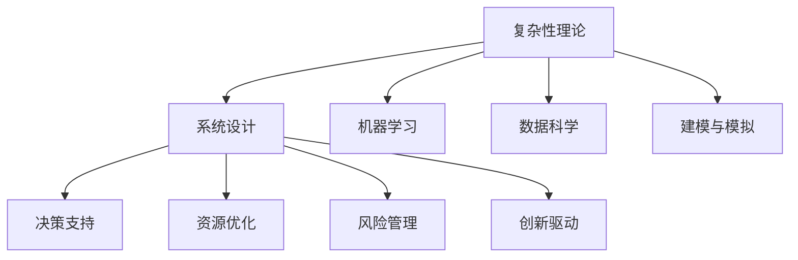

                 

# 理解世界的复杂性：从结构到洞见

> 关键词：复杂性理论,系统设计,机器学习,数据科学,建模与模拟

## 1. 背景介绍

### 1.1 问题由来

当今世界正处于一个快速变化与高度复杂性的时期，从个体到组织，从经济到社会，都在面临前所未有的挑战。面对这样的环境，理解与应对复杂性变得尤为重要。信息技术的飞速发展，使得人们可以通过数据和模型来探索和预测复杂系统。机器学习和数据科学技术提供了一种新的视角，通过模型结构来解析和模拟复杂性，从而获得更深刻的洞见。

### 1.2 问题核心关键点

理解复杂性的核心关键点在于：
1. **系统结构**：系统是由什么组成的，组件之间如何相互关联？
2. **动态行为**：系统如何随时间变化？
3. **目标与动机**：系统的目标是什么？驱动其动态行为的原因是什么？
4. **影响因素**：系统受哪些因素影响？
5. **适应性**：系统如何适应变化？

这些关键点构成了理解复杂性的基础，需要综合运用结构分析、动态建模、目标识别、影响因素识别和适应性分析等方法。机器学习与数据科学技术通过构建模型，帮助捕捉这些关键点，进而洞察系统的本质特征和行为模式。

### 1.3 问题研究意义

理解复杂性对于解决现实世界中的问题具有重要意义：
1. **决策支持**：通过理解和模拟复杂性，可以提供更准确和及时的决策支持。
2. **资源优化**：识别系统的关键因素，优化资源分配，提高效率。
3. **风险管理**：预测和规避风险，降低不确定性。
4. **创新驱动**：发现隐藏的机会和改进空间，促进创新和变革。

在企业、政府、科学研究等领域，理解复杂性已经成为提升竞争力和应对挑战的关键能力。

## 2. 核心概念与联系

### 2.1 核心概念概述

为更好地理解复杂性理论，本节将介绍几个密切相关的核心概念：

- **复杂性理论**：研究系统复杂性的科学，关注系统行为、相互作用和结构，旨在揭示系统动态的规律性。
- **系统设计**：通过构建模型和工具，解决复杂系统问题，实现优化和适应。
- **机器学习**：一种通过算法和统计模型，使计算机系统能够从数据中学习并做出决策的能力。
- **数据科学**：结合统计学、数据分析和领域知识，处理和解释复杂数据集，提炼知识的过程。
- **建模与模拟**：使用数学模型和仿真工具，模拟和预测系统的行为，优化系统设计。

这些核心概念之间的逻辑关系可以通过以下Mermaid流程图来展示：



这个流程图展示出复杂性理论与其他概念的相互联系：

1. **复杂性理论**提供了系统复杂性的基础框架，是理解和解决复杂问题的理论依据。
2. **系统设计**在此基础上，通过构建模型和工具，解决复杂问题。
3. **机器学习**与**数据科学**作为技术手段，帮助分析和解释复杂数据，提炼知识。
4. **建模与模拟**通过数学模型和仿真工具，模拟和预测系统行为，优化系统设计。

通过这些概念，我们可以理解如何通过结构分析和动态建模等方法，运用机器学习与数据科学技术，对复杂系统进行理解和优化。

## 3. 核心算法原理 & 具体操作步骤
### 3.1 算法原理概述

理解复杂性的算法原理主要涉及以下几个方面：

- **结构分析**：通过网络分析、层次分析等方法，揭示系统组件间的相互关系和结构特征。
- **动态建模**：使用微分方程、差分方程等数学工具，描述系统随时间的变化过程。
- **目标识别**：通过优化算法、强化学习等方法，识别系统的目标和驱动力。
- **影响因素识别**：通过回归分析、因子分析等方法，识别影响系统行为的关键因素。
- **适应性分析**：通过演化算法、博弈论等方法，研究系统如何适应环境和变化。

这些算法原理共同构成了理解复杂性的基础方法，帮助我们从结构、动态、目标、影响因素和适应性等角度，全面分析复杂系统。

### 3.2 算法步骤详解

理解复杂性的具体算法步骤包括以下几个关键环节：

**Step 1: 数据收集与预处理**

- 收集系统相关的数据，包括时间序列数据、空间分布数据、交互数据等。
- 清洗和预处理数据，去除异常值、填补缺失值、标准化数据格式等。

**Step 2: 模型构建**

- 根据系统结构特征，选择合适的模型，如回归模型、状态空间模型、动态系统模型等。
- 确定模型参数，根据数据集进行训练，通过优化算法最小化误差。
- 对模型进行验证和测试，确保其准确性和可靠性。

**Step 3: 分析与解释**

- 通过模型进行结构分析和动态模拟，揭示系统的关键结构特征和动态行为。
- 识别系统的目标和驱动力，分析影响系统行为的关键因素。
- 研究系统的适应性，探索系统的动态演化机制。

**Step 4: 结果应用**

- 根据分析结果，制定决策方案，优化系统设计。
- 实施优化方案，监控系统行为，确保系统按预期运行。
- 持续收集数据，不断迭代优化，提升系统性能。

### 3.3 算法优缺点

理解复杂性的算法具有以下优点：
1. **全面性**：能够从多个角度全面分析复杂系统，提供综合的洞见。
2. **准确性**：通过数据驱动的模型，提高分析和预测的准确性。
3. **灵活性**：能够适应不同类型和规模的复杂系统，灵活应用。

同时，该算法也存在一些局限性：
1. **复杂性高**：模型构建和分析过程复杂，需要专业的知识和技能。
2. **数据需求高**：高质量的数据是模型准确性的基础，获取和处理数据成本高。
3. **模型假设**：模型的假设可能不适用于所有系统，需仔细校验。
4. **解释性差**：部分复杂模型难以解释，缺乏透明性。

尽管有这些局限性，但理解复杂性的算法对于处理高度复杂系统问题仍具有重要的理论意义和实际价值。未来研究需要关注如何简化模型构建过程，提高模型可解释性，以及如何更好地应用在实际场景中。

### 3.4 算法应用领域

理解复杂性的算法已在多个领域得到广泛应用：

- **金融风险管理**：通过动态建模和目标识别，评估和预测金融市场的风险。
- **供应链管理**：分析供应链网络结构和动态行为，优化库存和物流。
- **城市规划**：研究城市交通系统和基础设施的复杂性，制定优化策略。
- **生物系统**：通过网络分析和动态建模，理解生物系统的结构和功能。
- **社会网络**：研究社会网络结构和社会行为，揭示社会系统的动态特征。

这些应用展示了理解复杂性的算法在解决实际问题中的广泛应用潜力。

## 4. 数学模型和公式 & 详细讲解 & 举例说明
### 4.1 数学模型构建

在理解复杂性的过程中，数学模型起着关键作用。以下是几个常见的数学模型及其构建方法：

**线性回归模型**：用于描述变量之间的线性关系，模型如下：

$$
y = \beta_0 + \beta_1 x_1 + \beta_2 x_2 + \cdots + \beta_n x_n + \epsilon
$$

其中 $y$ 为响应变量，$x_1, x_2, \cdots, x_n$ 为自变量，$\beta_0, \beta_1, \beta_2, \cdots, \beta_n$ 为回归系数，$\epsilon$ 为误差项。

**状态空间模型**：用于描述系统的动态行为，模型如下：

$$
x_{t+1} = A x_t + B u_t + \omega_t
$$
$$
y_t = C x_t + D u_t + \varepsilon_t
$$

其中 $x_t$ 为系统状态向量，$u_t$ 为输入向量，$y_t$ 为输出向量，$A, B, C, D$ 为系统参数，$\omega_t, \varepsilon_t$ 为系统扰动和测量噪声。

**演化算法**：用于模拟系统的适应性，模型如下：

$$
x_{t+1} = f(x_t, u_t)
$$

其中 $x_t$ 为系统状态，$u_t$ 为控制变量，$f$ 为系统动态函数。

### 4.2 公式推导过程

以下是几个关键模型的推导过程：

**线性回归模型推导**：

给定一组训练数据 $(x_1, y_1), (x_2, y_2), \cdots, (x_n, y_n)$，最小化误差函数：

$$
J(\beta) = \frac{1}{2} \sum_{i=1}^n (y_i - \hat{y_i})^2
$$

其中 $\hat{y_i} = \beta_0 + \beta_1 x_{1i} + \beta_2 x_{2i} + \cdots + \beta_n x_{ni}$。

通过求偏导数和求解方程组，可以得到回归系数 $\beta$ 的表达式：

$$
\beta = (X^T X)^{-1} X^T Y
$$

其中 $X = \begin{bmatrix} 1 & x_{1} & x_{2} & \cdots & x_{n} \end{bmatrix}$，$Y = \begin{bmatrix} y_1 & y_2 & \cdots & y_n \end{bmatrix}$。

**状态空间模型推导**：

状态空间模型可以表示为：

$$
\begin{bmatrix} x_{t+1} \\ y_t \end{bmatrix} = \begin{bmatrix} A & B \\ C & D \end{bmatrix} \begin{bmatrix} x_t \\ u_t \end{bmatrix} + \begin{bmatrix} \omega_t \\ \varepsilon_t \end{bmatrix}
$$

通过对方程进行离散化，可以得到状态更新方程：

$$
x_{t+1} = A x_t + B u_t + \omega_t
$$

和输出方程：

$$
y_t = C x_t + D u_t + \varepsilon_t
$$

其中 $\omega_t$ 和 $\varepsilon_t$ 为系统的过程噪声和测量噪声。

### 4.3 案例分析与讲解

**案例分析**：

假设有一个生产流程，输入变量为原料量和设备状态，输出变量为产品产量。可以通过线性回归模型和状态空间模型来模拟和预测这一过程：

**线性回归模型**：

给定多组输入数据 $(x_1, y_1), (x_2, y_2), \cdots, (x_n, y_n)$，通过最小二乘法求解回归系数 $\beta$，得到模型：

$$
y = \beta_0 + \beta_1 x_1 + \beta_2 x_2 + \cdots + \beta_n x_n + \epsilon
$$

通过拟合模型，可以预测在不同原料量和设备状态下的产品产量。

**状态空间模型**：

假设系统状态向量为 $x_t = [原料量, 设备状态]$，输入向量为 $u_t = [生产时间, 设备维护]$，输出向量为 $y_t = [产品产量]$。通过构建状态空间模型：

$$
x_{t+1} = \begin{bmatrix} a & b \\ c & d \end{bmatrix} \begin{bmatrix} x_t \\ u_t \end{bmatrix} + \begin{bmatrix} \omega_t \\ \varepsilon_t \end{bmatrix}
$$

和输出方程：

$$
y_t = C x_t + D u_t + \varepsilon_t
$$

通过模拟和预测，可以优化原料使用和设备维护，提高生产效率。

## 5. 项目实践：代码实例和详细解释说明
### 5.1 开发环境搭建

在进行复杂性理解与建模实践前，我们需要准备好开发环境。以下是使用Python进行机器学习和数据科学开发的常用环境配置流程：

1. 安装Anaconda：从官网下载并安装Anaconda，用于创建独立的Python环境。

2. 创建并激活虚拟环境：
```bash
conda create -n ml-env python=3.8 
conda activate ml-env
```

3. 安装必要的库：
```bash
conda install numpy pandas matplotlib scikit-learn statsmodels seaborn
```

4. 配置Jupyter Notebook：
```bash
jupyter notebook --allow-root --notebook-dir=. --NotebookApp.cachedir=/tmp
```

5. 安装TensorFlow和PyTorch：
```bash
pip install tensorflow torch
```

完成上述步骤后，即可在`ml-env`环境中开始建模实践。

### 5.2 源代码详细实现

下面是使用Python和Scikit-learn库对线性回归模型进行建模的代码实现：

```python
import numpy as np
from sklearn.linear_model import LinearRegression
from sklearn.metrics import mean_squared_error

# 创建数据集
X = np.array([[1, 2, 3], [4, 5, 6], [7, 8, 9]])
y = np.array([3, 7, 11])

# 创建模型并拟合
model = LinearRegression()
model.fit(X, y)

# 预测并评估
y_pred = model.predict(X)
mse = mean_squared_error(y, y_pred)
print(f"MSE: {mse}")
```

### 5.3 代码解读与分析

在上述代码中，我们首先创建了一个包含输入变量 $x_1, x_2, x_3$ 和输出变量 $y$ 的简单数据集。然后，使用Scikit-learn库中的`LinearRegression`模型，对数据集进行拟合，得到线性回归模型。最后，使用`predict`方法对新数据进行预测，并计算预测误差的均方误差(MSE)。

输出结果展示了预测误差的均方误差，用于评估模型的拟合效果。

## 6. 实际应用场景
### 6.1 智能供应链管理

智能供应链管理是一个典型的复杂性理解与应用场景。供应链系统由多个环节组成，包括供应商、制造商、物流商、零售商等，各环节相互依赖、动态交互。通过对供应链的动态行为进行建模和分析，可以优化库存管理、降低成本、提高响应速度。

在实践中，可以收集供应链的历史数据，包括原料采购量、生产计划、运输时间等，并对其进行结构分析和动态建模。通过对供应链网络结构和动态行为的理解，可以优化生产计划、库存管理，确保供应链的高效运行。

### 6.2 城市交通系统

城市交通系统是一个复杂的多层次系统，涉及交通流、车辆、道路、行人等多个动态元素。通过对交通系统的结构和动态行为进行理解，可以优化交通流控制、减少交通拥堵，提高交通系统的效率。

在实践中，可以收集交通数据，包括车辆位置、车速、红绿灯状态等，并对其进行结构分析和动态建模。通过优化交通信号灯控制、实施交通拥堵治理策略，可以提升城市交通系统的运行效率。

### 6.3 金融市场预测

金融市场是一个高度动态的复杂系统，市场参与者众多，信息流动复杂。通过对金融市场的结构和动态行为进行理解，可以预测市场趋势、评估风险，为投资决策提供支持。

在实践中，可以收集金融市场的历史数据，包括股票价格、交易量、经济指标等，并对其进行结构分析和动态建模。通过对市场的动态行为进行预测，可以制定更有效的投资策略，降低投资风险。

### 6.4 未来应用展望

未来，随着数据采集技术的不断进步，复杂性理解与应用将覆盖更多领域，包括医疗、环境、生态等。通过深入理解和建模，可以为这些领域提供更有效的决策支持和技术方案。

在医疗领域，通过对病人数据、治疗方案、疾病传播进行建模和分析，可以优化医疗资源配置、提高诊疗效率、降低医疗成本。

在环境保护领域，通过对生态系统的结构和动态行为进行理解，可以制定更有效的环境保护策略，促进生态平衡和可持续发展。

## 7. 工具和资源推荐
### 7.1 学习资源推荐

为了帮助开发者系统掌握复杂性理解与建模的理论基础和实践技巧，这里推荐一些优质的学习资源：

1. 《复杂性理论导论》系列书籍：全面介绍复杂性理论的基本概念和应用方法。
2. 《系统动力学与建模》课程：由MIT开放课程提供的系统动力学基础课程，深入讲解系统动力学模型。
3. 《机器学习》课程：斯坦福大学提供的机器学习课程，涵盖机器学习的基础和高级内容。
4. 《数据科学导论》书籍：由MIT教授提供的系统性学习资源，涵盖数据科学的全过程。
5. 《复杂系统建模与仿真》书籍：详细讲解复杂系统建模和仿真方法，提供丰富的案例分析。

通过对这些资源的学习实践，相信你一定能够快速掌握复杂性理解与建模的精髓，并用于解决实际的复杂问题。

### 7.2 开发工具推荐

高效的开发离不开优秀的工具支持。以下是几款用于复杂性理解与建模开发的常用工具：

1. Python：基于Python的开源数据分析与建模工具，适用于快速迭代研究。
2. R：基于R语言的数据分析和建模工具，适用于统计分析和可视化。
3. Matplotlib和Seaborn：用于绘制数据可视化图表，帮助理解和展示数据分析结果。
4. Jupyter Notebook：提供交互式代码环境，方便开发者进行数据分析和模型验证。
5. TensorFlow和PyTorch：用于构建和训练复杂系统模型，支持深度学习和强化学习等高级技术。

合理利用这些工具，可以显著提升复杂性理解与建模的开发效率，加快创新迭代的步伐。

### 7.3 相关论文推荐

复杂性理解与应用的发展源于学界的持续研究。以下是几篇奠基性的相关论文，推荐阅读：

1. "A Theory of Complexity" by H. Gell-Mann: 提出了复杂性理论的基本框架，奠定了复杂性研究的基础。
2. "The Self-Organized Criticality" by B. Mandelbrot: 揭示了复杂系统中的自组织临界性，提出了混沌理论的基础模型。
3. "Complex Adaptive Systems" by H. R. Iveson: 研究了复杂适应系统的动态行为和演化过程，提供了系统设计的理论基础。
4. "Machine Learning Yearning" by A. Ng: 系统讲解了机器学习在复杂性理解中的应用，提供了实践指南。
5. "Data Science for Business" by Foster Provost and Tom Fawcett: 介绍了数据科学在复杂系统中的应用，提供了实际案例分析。

这些论文代表了大规模复杂性理解与应用的发展脉络。通过学习这些前沿成果，可以帮助研究者把握学科前进方向，激发更多的创新灵感。

## 8. 总结：未来发展趋势与挑战
### 8.1 总结

本文对复杂性理解与应用进行了全面系统的介绍。首先阐述了复杂性理论的基本概念和应用意义，明确了理解复杂性的重要性。其次，从原理到实践，详细讲解了复杂性理解与建模的数学原理和关键步骤，给出了建模任务开发的完整代码实例。同时，本文还广泛探讨了复杂性理解与建模在智能供应链、城市交通、金融市场等多个行业领域的应用前景，展示了复杂性理论的广阔前景。

通过本文的系统梳理，可以看到，理解复杂性对于解决现实世界中的问题具有重要意义，复杂性理解与建模技术已经成为处理复杂系统问题的重要工具。未来，伴随数据采集技术的不断进步和模型技术的持续演进，复杂性理解与应用必将在更多领域得到应用，为人类认知智能的进化带来深远影响。

### 8.2 未来发展趋势

展望未来，复杂性理解与应用将呈现以下几个发展趋势：

1. **多模态数据整合**：未来的复杂性理解与建模将更多地考虑多模态数据的整合，如文本、图像、音频等多种数据形式，全面刻画复杂系统的特征。
2. **动态交互建模**：复杂系统通常是动态的，未来的建模方法将更多地考虑系统的动态交互过程，模拟系统的演化行为。
3. **增强智能与决策支持**：复杂性理解与建模将更多地与智能技术和决策支持系统结合，提供实时和动态的决策建议。
4. **跨领域应用**：复杂性理论将在更多领域得到应用，如医疗、环境、生态等，提供科学决策和技术支持。
5. **深度学习与强化学习**：结合深度学习与强化学习技术，提升复杂系统模型的精度和适应性。

以上趋势凸显了复杂性理解与建模技术的广阔前景。这些方向的探索发展，必将进一步提升复杂系统模型的性能和应用范围，为人类认知智能的进化带来深远影响。

### 8.3 面临的挑战

尽管复杂性理解与应用技术已经取得了显著进展，但在迈向更加智能化、普适化应用的过程中，仍面临诸多挑战：

1. **数据复杂性**：复杂系统通常涉及大量复杂数据，数据收集、处理和分析成本高昂。如何提高数据采集和处理的效率，将是关键挑战。
2. **模型复杂性**：复杂系统模型通常复杂，难以理解和解释。如何简化模型，提高可解释性，将是重要的研究方向。
3. **多学科交叉**：复杂系统涉及多个学科领域，如数学、工程、社会科学等。如何整合不同学科的知识，形成协同创新的体系，将是重要的研究方向。
4. **资源消耗**：复杂系统模型通常需要高性能计算资源，如何优化资源使用，降低成本，将是重要的研究方向。
5. **社会影响**：复杂性理解与应用技术可能带来伦理和社会问题，如何规范其应用，保障其安全性，将是重要的研究方向。

正视这些挑战，积极应对并寻求突破，将是大规模复杂性理解与应用走向成熟的必由之路。相信随着学界和产业界的共同努力，这些挑战终将一一被克服，复杂性理解与应用必将在构建人机协同的智能时代中扮演越来越重要的角色。

### 8.4 研究展望

未来的研究需要在以下几个方面寻求新的突破：

1. **数据驱动的复杂性建模**：通过大数据和深度学习技术，提高复杂系统模型的精度和适应性。
2. **增强现实与虚拟现实**：结合增强现实与虚拟现实技术，提供复杂系统可视化的手段，提升复杂系统理解与应用的效果。
3. **多学科融合**：整合不同学科领域的知识和技术，形成系统化的方法论和工具。
4. **伦理与社会研究**：研究复杂性理解与应用技术对伦理和社会的影响，制定规范和标准，保障其安全性。
5. **跨领域应用**：将复杂性理解与应用技术应用于更多领域，提供科学决策和技术支持。

这些研究方向将引领复杂性理解与应用技术的不断发展，为人类认知智能的进化带来深远影响。

## 9. 附录：常见问题与解答
### Q1: 什么是复杂性理论？

A: 复杂性理论是一门研究复杂系统的科学，旨在揭示系统行为的规律性和动态特征。它关注系统结构和功能之间的关系，以及系统如何适应环境变化。

### Q2: 机器学习和复杂性理论有何关系？

A: 机器学习是复杂性理论的重要应用领域之一，通过构建和训练模型，机器学习可以帮助理解复杂系统的行为和动态。机器学习技术提供了数据驱动的方法，可以帮助分析、预测和优化复杂系统。

### Q3: 复杂性理解与应用有何实际意义？

A: 复杂性理解与应用技术在多个领域具有重要应用意义，如智能供应链管理、城市交通系统、金融市场预测等。通过对复杂系统的理解和建模，可以为决策提供科学依据，优化资源配置，提高系统效率，降低成本，降低风险，提升决策的科学性和有效性。

### Q4: 如何应对复杂性理解与应用技术面临的挑战？

A: 应对复杂性理解与应用技术面临的挑战需要多方面的努力，包括提高数据采集和处理的效率，简化模型，提高可解释性，整合不同学科的知识，优化资源使用，规范其应用，保障其安全性。只有综合运用多学科的知识和技术，才能真正解决复杂性问题。

### Q5: 未来复杂性理解与应用技术的发展方向是什么？

A: 未来复杂性理解与应用技术的发展方向包括多模态数据整合、动态交互建模、增强智能与决策支持、跨领域应用、深度学习与强化学习等。这些方向将推动复杂系统建模技术的进步，为人类认知智能的进化带来深远影响。

---
作者：禅与计算机程序设计艺术 / Zen and the Art of Computer Programming

