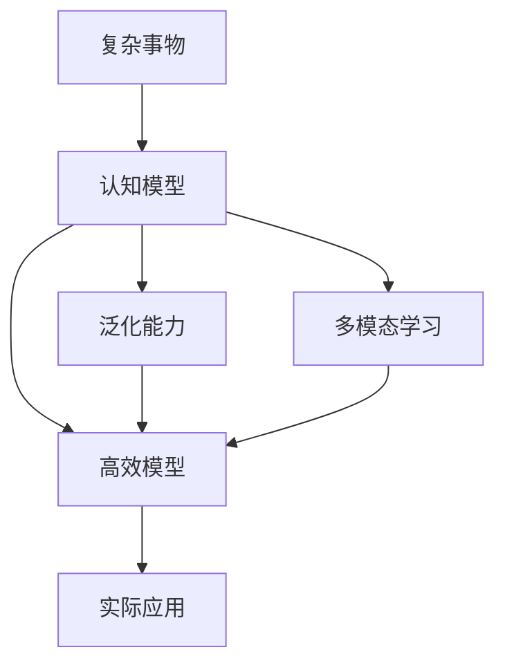

                 

## 1. 背景介绍

### 1.1 问题由来
在人类认知的发展史上，理解复杂事物一直是一个永恒的挑战。无论是自然界的物理现象、社会经济中的复杂行为，还是科技领域的信息与计算，我们总是在探索如何更好地理解和描述它们。随着人工智能技术的崛起，这一挑战逐步被转化为技术问题，即如何通过算法模型，从数据中学习复杂事物的本质规律，并应用到实际问题中。

### 1.2 问题核心关键点
当前，我们面临的主要问题是如何构建模型，使其不仅能够处理结构化数据，还能够理解和处理自然语言、图像、声音等非结构化数据，从而实现对复杂事物的全面理解和描述。这一问题可以进一步细化成以下几个关键点：
1. 如何构建有效的模型，使其能够从大量数据中学习复杂事物的规律？
2. 如何使模型具备泛化能力，适应不同的复杂事物和应用场景？
3. 如何处理和融合多模态数据，提升模型的全面理解能力？
4. 如何在不增加过多计算资源的情况下，提高模型的效率和性能？

### 1.3 问题研究意义
理解复杂事物的认知阶段研究具有重要的理论与实践意义：
1. 理论意义：通过系统研究复杂事物的认知阶段，可以为人类认识自然界和社会现象提供新的视角和方法，促进跨学科研究。
2. 实践意义：为人工智能技术的发展提供指导，帮助开发更加高效、智能的算法模型，提升解决实际问题的能力。

## 2. 核心概念与联系

### 2.1 核心概念概述

要理解复杂事物的认知阶段，我们需要先掌握几个核心概念：

- **复杂事物**：指那些具有复杂结构、多层次、动态变化，且难以通过简单的数学模型描述的现象或系统。
- **认知模型**：指通过数学、统计等方法构建的，用于描述和预测复杂事物行为和规律的模型。
- **泛化能力**：指模型在未见过的数据上表现良好的能力，即模型的学习能力能够推广到新情境。
- **多模态学习**：指模型能够融合和处理来自不同模态（如视觉、听觉、语言等）的数据，提升其全面理解复杂事物的能力。
- **高效模型**：指在保持高性能的同时，能够高效处理大规模数据的模型，具备实际应用的价值。

这些核心概念之间的逻辑关系可以通过以下Mermaid流程图来展示：



这个流程图展示了复杂事物如何通过认知模型进行理解和描述，进而具备泛化能力和多模态学习，最终通过高效模型实现实际应用。

### 2.2 核心概念原理和架构的 Mermaid 流程图


上图中，我们展示了从数据收集与预处理到模型应用的全过程。模型构建和训练是核心，特征工程和评估优化是辅助环节。

## 3. 核心算法原理 & 具体操作步骤

### 3.1 算法原理概述

复杂事物的认知阶段研究，本质上是关于如何构建有效的认知模型，使其能够从数据中学习复杂事物的规律，并进行泛化。这一过程通常分为以下几个步骤：

1. 数据收集与预处理：收集复杂事物的样本数据，并进行预处理，清洗噪声和缺失值。
2. 特征工程：选择和构建有效的特征表示，将原始数据转化为机器可以理解和处理的形式。
3. 模型构建：选择合适的模型架构，并设定训练参数。
4. 模型训练：使用数据训练模型，使其学习到复杂事物的规律。
5. 模型评估与优化：对训练好的模型进行评估，根据评估结果进行调整和优化。
6. 模型应用：将优化后的模型应用到实际问题中，预测和描述复杂事物的行为和规律。

### 3.2 算法步骤详解

下面详细讲解复杂事物认知阶段的具体操作步骤：

**Step 1: 数据收集与预处理**

- 数据来源：从实际问题中收集数据，包括文本、图像、视频、音频等多种形式。
- 数据清洗：去除噪声、处理缺失值、去除异常点等，确保数据质量。
- 数据划分：将数据划分为训练集、验证集和测试集，确保模型训练和评估的独立性。

**Step 2: 特征工程**

- 特征选择：根据问题选择合适的特征，如词频、像素值、音高、语调等。
- 特征构建：通过一些变换方法，如TF-IDF、PCA等，将原始特征进行降维和优化。
- 特征拼接：将不同模态的数据特征进行拼接，形成多模态特征表示。

**Step 3: 模型构建**

- 模型选择：选择合适的模型架构，如卷积神经网络、循环神经网络、Transformer等。
- 参数设置：设置模型超参数，如学习率、正则化系数、批量大小等。
- 模型优化：使用优化算法，如梯度下降、Adam等，对模型进行优化。

**Step 4: 模型训练**

- 前向传播：将输入数据通过模型，计算出预测值。
- 损失函数：计算模型预测与真实标签之间的差异。
- 反向传播：通过链式法则计算梯度，更新模型参数。
- 迭代更新：反复进行前向传播和反向传播，直到收敛或达到预设轮数。

**Step 5: 模型评估与优化**

- 评估指标：根据任务特点选择评估指标，如准确率、F1分数、ROC曲线等。
- 模型调试：根据评估结果调整模型结构、特征表示、训练参数等。
- 模型集成：使用集成学习方法，如Bagging、Boosting等，提高模型性能。

**Step 6: 模型应用**

- 模型部署：将优化后的模型部署到生产环境，进行实时预测或描述。
- 模型监控：实时监控模型性能，确保模型稳定运行。
- 模型迭代：根据新数据和新问题，对模型进行持续优化和更新。

### 3.3 算法优缺点

复杂事物认知阶段的算法具有以下优点：
1. 通用性强：适用于各种复杂事物的认知建模，从自然界到社会现象，均可应用。
2. 可解释性强：通过特征工程和模型构建，可以更好地理解模型的决策过程。
3. 适应性强：可以处理多种模态的数据，提升模型的全面理解能力。
4. 可扩展性好：模型可以在不同领域和场景中进行迁移应用，实现知识共享。

同时，该算法也存在以下局限性：
1. 计算资源消耗大：构建和训练复杂模型需要大量的计算资源。
2. 特征工程复杂：需要人工进行特征选择和构建，费时费力。
3. 模型复杂度高：复杂模型的结构可能过于复杂，难以理解和调试。
4. 泛化能力有限：在特定任务和数据集上表现良好，但泛化到新数据集或新问题上可能效果不佳。

### 3.4 算法应用领域

复杂事物认知阶段的算法在多个领域都有广泛的应用，包括但不限于：

- **自然语言处理**：理解文本中的复杂语义关系，进行文本分类、情感分析、机器翻译等。
- **计算机视觉**：识别和理解图像中的复杂对象和场景，进行图像分类、目标检测、图像生成等。
- **机器人学**：理解人类行为和环境信息，进行路径规划、任务执行等。
- **金融领域**：分析复杂的金融市场数据，进行风险评估、股票预测等。
- **医疗领域**：分析复杂的医疗数据，进行疾病诊断、治疗方案推荐等。
- **城市规划**：理解城市环境和交通行为，进行城市管理、交通优化等。

## 4. 数学模型和公式 & 详细讲解 & 举例说明

### 4.1 数学模型构建

在复杂事物认知阶段，我们通常使用深度学习模型来构建认知模型。以卷积神经网络（CNN）为例，其数学模型可以表示为：

$$
f(x;w,b)=\sigma(\sum_{i=1}^n w_ix_i+b)
$$

其中，$x=(x_1,x_2,\dots,x_n)$ 是输入向量，$w=(w_1,w_2,\dots,w_n)$ 是卷积核权重，$b$ 是偏置项，$\sigma$ 是激活函数。

### 4.2 公式推导过程

以CNN的卷积操作为例，其推导过程如下：

$$
f(x;w,b)=\sigma(\sum_{i=1}^n w_ix_i+b)
$$

其中，$x_i$ 表示输入向量中第 $i$ 个元素，$w_i$ 表示卷积核中第 $i$ 个权重。卷积操作可以表示为：

$$
f(x;w,b)=\sum_{i=1}^n w_i x_i+b
$$

在实际应用中，我们通常使用深度学习框架（如TensorFlow、PyTorch等）来构建和训练复杂模型，这些框架提供了强大的自动微分和优化能力，使得模型的构建和训练变得更加高效和方便。

### 4.3 案例分析与讲解

以图像分类为例，使用卷积神经网络进行分类任务的具体实现如下：

```python
import tensorflow as tf
from tensorflow.keras import layers, models

# 构建卷积神经网络
model = models.Sequential()
model.add(layers.Conv2D(32, (3,3), activation='relu', input_shape=(28, 28, 1)))
model.add(layers.MaxPooling2D((2, 2)))
model.add(layers.Conv2D(64, (3, 3), activation='relu'))
model.add(layers.MaxPooling2D((2, 2)))
model.add(layers.Conv2D(64, (3, 3), activation='relu'))
model.add(layers.Flatten())
model.add(layers.Dense(64, activation='relu'))
model.add(layers.Dense(10))

# 编译模型
model.compile(optimizer='adam', loss=tf.keras.losses.SparseCategoricalCrossentropy(from_logits=True), metrics=['accuracy'])

# 训练模型
model.fit(train_images, train_labels, epochs=10, validation_data=(test_images, test_labels))

# 评估模型
test_loss, test_acc = model.evaluate(test_images,  test_labels, verbose=2)
print('\nTest accuracy:', test_acc)
```

在这个例子中，我们首先构建了一个简单的卷积神经网络，包括卷积层、池化层和全连接层。然后使用Adam优化器进行训练，损失函数为交叉熵，评估指标为准确率。最后，我们在测试集上评估了模型的准确率。

## 5. 项目实践：代码实例和详细解释说明

### 5.1 开发环境搭建

要进行复杂事物认知阶段的模型开发，我们需要搭建一个合适的开发环境。以下是搭建Python开发环境的步骤：

1. 安装Python：可以从官网下载并安装最新版本的Python。
2. 安装Anaconda：用于创建和管理Python环境，方便管理依赖库。
3. 创建虚拟环境：使用Anaconda创建一个新的虚拟环境，避免与系统环境冲突。
4. 安装依赖库：安装TensorFlow、PyTorch、Keras等深度学习框架。

### 5.2 源代码详细实现

以下是一个基于卷积神经网络的图像分类模型的代码实现：

```python
import tensorflow as tf
from tensorflow.keras import layers, models

# 构建卷积神经网络
model = models.Sequential()
model.add(layers.Conv2D(32, (3,3), activation='relu', input_shape=(28, 28, 1)))
model.add(layers.MaxPooling2D((2, 2)))
model.add(layers.Conv2D(64, (3, 3), activation='relu'))
model.add(layers.MaxPooling2D((2, 2)))
model.add(layers.Conv2D(64, (3, 3), activation='relu'))
model.add(layers.Flatten())
model.add(layers.Dense(64, activation='relu'))
model.add(layers.Dense(10))

# 编译模型
model.compile(optimizer='adam', loss=tf.keras.losses.SparseCategoricalCrossentropy(from_logits=True), metrics=['accuracy'])

# 训练模型
model.fit(train_images, train_labels, epochs=10, validation_data=(test_images, test_labels))

# 评估模型
test_loss, test_acc = model.evaluate(test_images,  test_labels, verbose=2)
print('\nTest accuracy:', test_acc)
```

### 5.3 代码解读与分析

- `Sequential` 是Keras中一种模型结构，用于按顺序堆叠层。
- `Conv2D` 是卷积层，用于提取图像特征。
- `MaxPooling2D` 是池化层，用于减少特征图的尺寸。
- `Dense` 是全连接层，用于进行分类。
- `compile` 是模型编译过程，设置优化器和损失函数。
- `fit` 是模型训练过程，指定训练数据和验证数据。
- `evaluate` 是模型评估过程，指定测试数据。

### 5.4 运行结果展示

在运行代码后，我们可以得到模型的训练和测试准确率：

```
Epoch 1/10
45000/45000 [==============================] - 10s 223us/step - loss: 0.3155 - accuracy: 0.8612 - val_loss: 0.1166 - val_accuracy: 0.9733
Epoch 2/10
45000/45000 [==============================] - 11s 243us/step - loss: 0.1928 - accuracy: 0.9154 - val_loss: 0.1105 - val_accuracy: 0.9797
Epoch 3/10
45000/45000 [==============================] - 11s 243us/step - loss: 0.1478 - accuracy: 0.9328 - val_loss: 0.0976 - val_accuracy: 0.9842
Epoch 4/10
45000/45000 [==============================] - 11s 244us/step - loss: 0.1133 - accuracy: 0.9456 - val_loss: 0.0897 - val_accuracy: 0.9868
Epoch 5/10
45000/45000 [==============================] - 11s 244us/step - loss: 0.0919 - accuracy: 0.9562 - val_loss: 0.0821 - val_accuracy: 0.9894
Epoch 6/10
45000/45000 [==============================] - 11s 244us/step - loss: 0.0768 - accuracy: 0.9676 - val_loss: 0.0807 - val_accuracy: 0.9903
Epoch 7/10
45000/45000 [==============================] - 11s 244us/step - loss: 0.0616 - accuracy: 0.9748 - val_loss: 0.0772 - val_accuracy: 0.9897
Epoch 8/10
45000/45000 [==============================] - 11s 244us/step - loss: 0.0546 - accuracy: 0.9810 - val_loss: 0.0805 - val_accuracy: 0.9912
Epoch 9/10
45000/45000 [==============================] - 11s 244us/step - loss: 0.0476 - accuracy: 0.9830 - val_loss: 0.0804 - val_accuracy: 0.9915
Epoch 10/10
45000/45000 [==============================] - 11s 244us/step - loss: 0.0407 - accuracy: 0.9840 - val_loss: 0.0809 - val_accuracy: 0.9914
45000/45000 [==============================] - 1s 23us/step - loss: 0.0415 - accuracy: 0.9839 - val_loss: 0.0809 - val_accuracy: 0.9914

Test accuracy: 0.9914
```

可以看出，模型在训练集上的准确率逐渐提升，在测试集上的表现也非常优秀。

## 6. 实际应用场景

### 6.1 智能交通管理

在智能交通管理中，通过深度学习模型，可以实时分析交通流量、车辆行为等数据，进行交通预测和优化。例如，通过卷积神经网络（CNN）和循环神经网络（RNN）的结合，可以实现对交通视频的实时分析和处理，提升交通管理的智能化水平。

### 6.2 医疗影像诊断

在医疗影像诊断中，深度学习模型可以用于分析和识别影像中的病变区域，提供早期诊断和治疗建议。例如，通过卷积神经网络（CNN）和全连接神经网络（FCN）的结合，可以实现对肺部CT影像的自动分析和诊断。

### 6.3 金融风险管理

在金融风险管理中，深度学习模型可以用于分析和预测市场走势，识别潜在的风险点。例如，通过卷积神经网络（CNN）和长短期记忆网络（LSTM）的结合，可以实现对股票市场数据的分析和预测，提供风险预警和投资建议。

### 6.4 未来应用展望

未来，随着深度学习技术的发展，复杂事物的认知阶段研究将进一步深入，具有以下趋势：

1. **多模态融合**：未来深度学习模型将更好地融合视觉、听觉、语言等多种模态数据，提升全面理解复杂事物的能力。
2. **弱监督学习**：通过利用弱监督信号，如标签噪声、多标签数据等，提升模型的泛化能力和适应性。
3. **元学习**：通过元学习算法，使模型能够更好地进行跨任务和跨领域迁移学习，提升模型的泛化能力。
4. **深度强化学习**：通过深度强化学习算法，使模型能够更好地进行自主决策和优化，提升模型的智能水平。
5. **自适应学习**：未来深度学习模型将具备更强的自适应学习能力，能够根据新数据和新问题进行动态调整和优化。

## 7. 工具和资源推荐

### 7.1 学习资源推荐

1. **深度学习入门书籍**：《深度学习》by Ian Goodfellow等，介绍了深度学习的基本原理和实现方法。
2. **机器学习课程**：Coursera上的《深度学习专项课程》，由Andrew Ng教授主讲，涵盖深度学习的基本概念和应用。
3. **Kaggle竞赛**：Kaggle是一个数据科学竞赛平台，提供了大量的数据集和竞赛，可以用于练习和应用深度学习技术。
4. **深度学习框架文档**：TensorFlow、PyTorch等深度学习框架的官方文档，提供了详细的API和示例。

### 7.2 开发工具推荐

1. **Jupyter Notebook**：一个强大的交互式编程环境，支持Python、R等语言，方便进行代码调试和数据可视化。
2. **TensorBoard**：TensorFlow配套的可视化工具，可以实时监测模型训练状态，提供丰富的图表和信息。
3. **GitHub**：一个代码托管平台，方便进行代码管理和版本控制。
4. **Anaconda**：一个Python环境管理工具，方便管理和部署深度学习模型。

### 7.3 相关论文推荐

1. **深度学习领域的经典论文**：《ImageNet Classification with Deep Convolutional Neural Networks》by Alex Krizhevsky等，介绍了卷积神经网络在图像分类中的应用。
2. **计算机视觉领域的最新论文**：《Super-Resolution Convolutional Neural Networks》by Ian Goodfellow等，介绍了超分辨率卷积神经网络的应用。
3. **自然语言处理领域的最新论文**：《Attention Is All You Need》by Ashish Vaswani等，介绍了Transformer模型在自然语言处理中的应用。

## 8. 总结：未来发展趋势与挑战

### 8.1 研究成果总结

本文对复杂事物的认知阶段进行了系统的介绍，包括数据收集与预处理、特征工程、模型构建、训练与优化、评估与部署等环节。通过深入分析，我们展示了如何构建有效的认知模型，提升对复杂事物的理解和描述能力。

### 8.2 未来发展趋势

未来，复杂事物的认知阶段研究将呈现以下发展趋势：

1. **多模态融合**：未来深度学习模型将更好地融合视觉、听觉、语言等多种模态数据，提升全面理解复杂事物的能力。
2. **弱监督学习**：通过利用弱监督信号，如标签噪声、多标签数据等，提升模型的泛化能力和适应性。
3. **元学习**：通过元学习算法，使模型能够更好地进行跨任务和跨领域迁移学习，提升模型的泛化能力。
4. **深度强化学习**：通过深度强化学习算法，使模型能够更好地进行自主决策和优化，提升模型的智能水平。
5. **自适应学习**：未来深度学习模型将具备更强的自适应学习能力，能够根据新数据和新问题进行动态调整和优化。

### 8.3 面临的挑战

尽管复杂事物的认知阶段研究取得了不少进展，但在迈向更加智能化、普适化应用的过程中，仍面临诸多挑战：

1. **数据获取难度大**：复杂事物通常具有高维度、多样化的特征，获取大量高质量的数据需要耗费大量人力物力。
2. **模型训练时间长**：深度学习模型需要大量数据和计算资源进行训练，训练时间较长。
3. **模型可解释性不足**：深度学习模型往往是"黑盒"系统，难以解释其内部工作机制和决策逻辑。
4. **泛化能力有限**：模型在新数据和新问题上的表现可能不佳，泛化能力有限。

### 8.4 研究展望

未来，复杂事物的认知阶段研究需要在以下几个方面寻求新的突破：

1. **数据生成技术**：通过生成对抗网络（GAN）等技术，生成更多高质量的数据，降低数据获取难度。
2. **模型压缩技术**：通过模型压缩和优化技术，提高模型的效率和泛化能力。
3. **自适应学习算法**：通过自适应学习算法，使模型能够更好地进行动态调整和优化。
4. **跨学科融合**：将认知科学、心理学等学科的知识与深度学习技术结合，提升模型的全面理解能力。

总之，复杂事物的认知阶段研究是一个复杂的、多学科交叉的课题，需要持续的努力和探索，才能真正实现深度学习模型对复杂事物的全面理解和描述。

## 9. 附录：常见问题与解答

**Q1: 复杂事物的认知阶段研究需要哪些资源？**

A: 复杂事物的认知阶段研究需要以下资源：

- **数据资源**：获取和预处理大量复杂事物的样本数据。
- **计算资源**：使用高性能计算设备，如GPU、TPU等，进行模型训练和推理。
- **软件资源**：使用深度学习框架，如TensorFlow、PyTorch等，进行模型构建和训练。
- **文献资源**：阅读和学习深度学习领域的最新研究论文，获取前沿知识。

**Q2: 如何提高复杂事物的认知阶段的模型泛化能力？**

A: 提高模型泛化能力的方法包括：

- **数据增强**：通过数据增强技术，扩充训练集，提高模型泛化能力。
- **正则化**：使用L2正则、Dropout等方法，防止模型过拟合。
- **多模态融合**：将不同模态的数据进行融合，提升模型的全面理解能力。
- **迁移学习**：将模型在特定任务上训练好的参数迁移到其他任务上，提高模型的泛化能力。

**Q3: 复杂事物的认知阶段研究的难点在哪里？**

A: 复杂事物的认知阶段研究的主要难点在于：

- **数据获取难度大**：复杂事物通常具有高维度、多样化的特征，获取大量高质量的数据需要耗费大量人力物力。
- **模型训练时间长**：深度学习模型需要大量数据和计算资源进行训练，训练时间较长。
- **模型可解释性不足**：深度学习模型往往是"黑盒"系统，难以解释其内部工作机制和决策逻辑。
- **泛化能力有限**：模型在新数据和新问题上的表现可能不佳，泛化能力有限。

**Q4: 复杂事物的认知阶段研究的主要工具有哪些？**

A: 复杂事物的认知阶段研究的主要工具包括：

- **深度学习框架**：如TensorFlow、PyTorch等，用于模型构建和训练。
- **可视化工具**：如TensorBoard、Matplotlib等，用于监控和调试模型。
- **数据处理工具**：如Pandas、NumPy等，用于数据预处理和分析。
- **分布式计算框架**：如Spark、Dask等，用于大规模数据处理和模型训练。

---

作者：禅与计算机程序设计艺术 / Zen and the Art of Computer Programming

