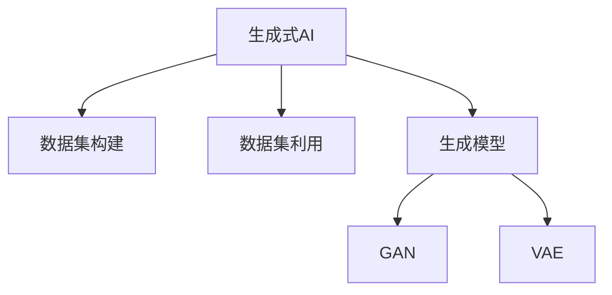

                 

# 生成式 AI：数据集的未来

## 1. 背景介绍

### 1.1 问题由来

随着深度学习技术的发展，生成式人工智能（Generative AI）正在成为新一轮技术变革的趋势。与传统的判别式模型不同，生成式模型可以生成符合特定分布的新数据，具有广泛的应用前景。例如，GAN模型可以通过对抗训练生成逼真的图像，而语言生成模型可以产生高质量的自然语言文本。然而，生成式AI面临的最大挑战之一是数据集的质量和规模，这直接影响了模型的生成质量和稳定性。

### 1.2 问题核心关键点

生成式AI的核心在于如何高效地利用数据集，生成高质量、多样化的新数据。其中，数据集的质量和规模、生成模型的复杂度和多样性、以及生成过程的训练策略，都是影响生成结果的关键因素。因此，如何高效地构建和利用数据集，是生成式AI研究的核心问题。

### 1.3 问题研究意义

研究生成式AI的数据集构建和利用方法，对于提升生成模型的生成质量和稳定性，拓展生成式AI的应用场景，具有重要意义：

1. **数据集构建**：高质量、大规模的数据集是生成模型训练的基础，可以显著提升模型的生成能力。
2. **数据集利用**：通过高效的数据集利用方法，可以极大地降低生成模型的训练和推理成本。
3. **生成质量提升**：合理的数据集构建和利用方法，可以提升生成模型的多样性和质量，减少生成样本的过拟合和偏差。
4. **应用拓展**：高质量的数据集和高效的生成方法，可以推动生成式AI在更多领域的应用，如医疗、金融、游戏等。
5. **技术创新**：数据集构建和利用的研究，会催生新的生成技术，如数据增强、对抗生成等。

## 2. 核心概念与联系

### 2.1 核心概念概述

为更好地理解生成式AI的数据集构建和利用方法，本节将介绍几个密切相关的核心概念：

- **生成式AI**：通过训练生成模型，生成符合特定分布的新数据。例如，GAN、VAE、语言生成模型等。
- **数据集构建**：指从原始数据中提取、清洗、标注、合成等步骤，构建高质量的数据集，为模型训练提供基础。
- **数据集利用**：指如何高效地利用已有数据集，如数据增强、迁移学习、对抗生成等方法。
- **生成模型**：通过训练，能够生成符合特定分布的新数据的模型。
- **对抗生成网络（GAN）**：一种通过对抗训练生成逼真图像的生成模型。
- **变分自编码器（VAE）**：一种生成模型，通过学习数据分布的参数化表示，生成新数据。

这些核心概念之间的逻辑关系可以通过以下Mermaid流程图来展示：



这个流程图展示了生成式AI的核心概念及其之间的关系：

1. 生成式AI通过训练生成模型，生成新数据。
2. 数据集构建是生成模型训练的基础。
3. 数据集利用是提升生成模型性能的重要手段。
4. GAN和VAE是常见的生成模型类型。

这些概念共同构成了生成式AI的框架，使得生成式模型能够生成高质量、多样化的新数据。通过理解这些核心概念，我们可以更好地把握生成式AI的生成过程和优化方向。

## 3. 核心算法原理 & 具体操作步骤

### 3.1 算法原理概述

生成式AI的核心在于通过训练生成模型，生成符合特定分布的新数据。其核心思想是：通过学习数据的概率分布，生成新样本，使得生成的样本与真实数据具有相似的概率分布。

形式化地，假设原始数据集为 $D=\{(x_i,y_i)\}_{i=1}^N, x_i \in \mathcal{X}, y_i \in \mathcal{Y}$。其中 $x_i$ 为输入，$y_i$ 为标签。生成式AI的目标是找到一个生成模型 $G$，使得生成的数据 $G(z)$ 与真实数据 $x_i$ 具有相似的分布。

通过优化损失函数，生成模型 $G$ 的学习过程可以描述为：

$$
\min_{G} \mathbb{E}_{x \sim P_X}[\log D(G(x))] + \mathbb{E}_{x \sim P_X}[\log (1-D(G(x)))]
$$

其中 $P_X$ 为真实数据分布，$D$ 为判别器，$z$ 为生成器的输入噪声。

### 3.2 算法步骤详解

生成式AI的训练过程通常包括以下几个关键步骤：

**Step 1: 数据预处理**
- 收集和清洗原始数据，去除噪声和异常值。
- 将数据转换为模型所需格式，如图像数据转化为像素矩阵。
- 对数据进行归一化、标准化等预处理操作，使数据在模型中更加稳定。

**Step 2: 数据增强**
- 通过旋转、裁剪、缩放等操作，扩充训练集的多样性。
- 通过扰动、混合等方法，提高模型的鲁棒性。

**Step 3: 构建生成模型**
- 选择合适的生成模型，如GAN、VAE等。
- 设计模型的架构，如卷积神经网络、循环神经网络等。
- 确定模型的超参数，如学习率、批大小、迭代次数等。

**Step 4: 对抗训练**
- 训练判别器 $D$ 和生成器 $G$ 进行对抗训练。
- 通过交替训练，提高生成样本的质量。

**Step 5: 评估与优化**
- 在验证集上评估生成模型的性能。
- 根据评估结果调整模型超参数，优化生成模型。

### 3.3 算法优缺点

生成式AI具有以下优点：
1. 生成能力强大。生成式AI可以生成高质量、多样化的新数据，提升模型对新样本的适应能力。
2. 数据需求低。生成式AI可以利用少量标注数据进行训练，具有较低的标注成本。
3. 应用广泛。生成式AI可以应用于图像生成、文本生成、语音生成等多个领域。

同时，生成式AI也存在一些局限性：
1. 生成样本质量不稳定。生成式AI生成的样本质量受训练数据、超参数等多种因素影响，容易发生过拟合和欠拟合。
2. 生成过程复杂。生成式AI的训练过程较为复杂，需要大量的计算资源和时间。
3. 对抗攻击风险。生成的样本可能被用于对抗攻击，影响系统的安全性。

尽管存在这些局限性，但生成式AI在图像生成、文本生成等领域的广泛应用，已经展示了其强大的潜力。未来相关研究的方向，还在于进一步提升生成样本的质量和多样性，降低生成过程的计算成本，以及应对对抗攻击等挑战。

### 3.4 算法应用领域

生成式AI已经在图像生成、文本生成、语音生成等多个领域取得了显著的成果，具体应用包括：

- **图像生成**：GAN模型可以生成逼真的图像，如面部表情、风景图像等。
- **文本生成**：语言生成模型可以生成自然流畅的文本，如新闻报道、文学作品等。
- **语音生成**：语音生成模型可以生成合成的语音，如语音助手、语音翻译等。
- **音乐生成**：音乐生成模型可以生成各种风格的音乐，如流行、摇滚等。
- **视频生成**：视频生成模型可以生成逼真的视频内容，如电影、广告等。

除了这些经典应用外，生成式AI还在自然语言处理、游戏模拟、虚拟现实等领域展示出了巨大的应用潜力。

## 4. 数学模型和公式 & 详细讲解 & 举例说明

### 4.1 数学模型构建

本节将使用数学语言对生成式AI的生成过程进行更加严格的刻画。

记生成模型为 $G: \mathcal{Z} \rightarrow \mathcal{X}$，其中 $\mathcal{Z}$ 为生成器输入空间，$\mathcal{X}$ 为生成器输出空间。生成模型的目标是最小化生成样本与真实样本之间的差距。

定义生成样本的损失函数为：

$$
\mathcal{L}(G) = \mathbb{E}_{x \sim P_X}[\log D(G(x))]
$$

其中 $D$ 为判别器，$P_X$ 为真实数据分布。生成模型的训练目标是最小化上述损失函数。

### 4.2 公式推导过程

以GAN为例，推导生成器和判别器的损失函数及其梯度。

定义生成器和判别器的损失函数分别为：

$$
\mathcal{L}_G = \mathbb{E}_{z \sim P_Z}[\log D(G(z))]
$$
$$
\mathcal{L}_D = \mathbb{E}_{x \sim P_X}[\log D(x)] + \mathbb{E}_{z \sim P_Z}[\log (1-D(G(z)))]
$$

其中 $P_Z$ 为生成器输入噪声分布。

通过梯度上升法，判别器和生成器的更新规则分别为：

$$
\frac{\partial \mathcal{L}_D}{\partial D(x)} = D(x)
$$
$$
\frac{\partial \mathcal{L}_G}{\partial G(z)} = -\nabla_{z}D(G(z))
$$

将更新规则代入损失函数，得到生成器和判别器的梯度更新公式：

$$
G_{\theta} \leftarrow G_{\theta} - \eta \nabla_{\theta}\mathcal{L}_G
$$
$$
D_{\phi} \leftarrow D_{\phi} - \eta \nabla_{\phi}\mathcal{L}_D
$$

其中 $\eta$ 为学习率，$\theta$ 和 $\phi$ 分别表示生成器和判别器的参数。

通过上述更新公式，生成器和判别器交替训练，逐步优化生成模型的性能。

### 4.3 案例分析与讲解

以生成式AI在图像生成中的应用为例，分析其原理和步骤。

首先，收集和清洗图像数据集，如图像分割、物体检测等。然后，对数据进行预处理，如归一化、标准化等操作，使其符合模型的输入要求。

接着，构建GAN模型，选择适当的生成器和判别器架构，如卷积神经网络（CNN）。设计模型的超参数，如学习率、批大小、迭代次数等。

在训练过程中，先训练判别器 $D$，使其能够区分真实样本和生成样本。然后训练生成器 $G$，使其生成的样本尽可能逼真。通过交替训练，逐步优化生成器生成样本的质量。

最后，在验证集上评估生成器的性能，调整超参数，优化生成器。在测试集上生成新样本，并进行质量评估。

## 5. 项目实践：代码实例和详细解释说明

### 5.1 开发环境搭建

在进行生成式AI的实践前，我们需要准备好开发环境。以下是使用Python进行TensorFlow进行图像生成任务开发的简单流程：

1. 安装Anaconda：从官网下载并安装Anaconda，用于创建独立的Python环境。

2. 创建并激活虚拟环境：
```bash
conda create -n tf-env python=3.8 
conda activate tf-env
```

3. 安装TensorFlow：根据CUDA版本，从官网获取对应的安装命令。例如：
```bash
conda install tensorflow=2.7 
```

4. 安装其他必要的工具包：
```bash
pip install numpy scipy matplotlib tensorflow_datasets
```

完成上述步骤后，即可在`tf-env`环境中开始生成式AI的实践。

### 5.2 源代码详细实现

下面我们以GAN模型生成手写数字为例，给出使用TensorFlow进行图像生成任务的代码实现。

首先，定义手写数字生成数据集：

```python
import tensorflow_datasets as tfds

# 加载手写数字数据集
dataset, info = tfds.load('mnist', split='train', with_info=True, as_supervised=True)

# 数据预处理
def preprocess_function(x, y):
    x = tf.cast(x, tf.float32) / 255.0
    x = (x - 0.5) / 0.5
    return x, y

train_dataset = dataset.map(preprocess_function)
train_dataset = train_dataset.shuffle(10000).batch(64)
```

然后，定义GAN模型：

```python
import tensorflow as tf
from tensorflow.keras import layers

# 定义生成器
def make_generator_model():
    model = tf.keras.Sequential()
    model.add(layers.Dense(7*7*256, use_bias=False, input_shape=(100,)))
    model.add(layers.BatchNormalization())
    model.add(layers.LeakyReLU())
    model.add(layers.Reshape((7, 7, 256)))

    model.add(layers.Conv2DTranspose(128, (5, 5), strides=(1, 1), padding='same', use_bias=False))
    model.add(layers.BatchNormalization())
    model.add(layers.LeakyReLU())
    model.add(layers.Conv2DTranspose(64, (5, 5), strides=(2, 2), padding='same', use_bias=False))
    model.add(layers.BatchNormalization())
    model.add(layers.LeakyReLU())
    model.add(layers.Conv2DTranspose(1, (5, 5), strides=(2, 2), padding='same', use_bias=False, activation='tanh'))

    return model

# 定义判别器
def make_discriminator_model():
    model = tf.keras.Sequential()
    model.add(layers.Conv2D(64, (5, 5), strides=(2, 2), padding='same', input_shape=[28, 28, 1]))
    model.add(layers.LeakyReLU())
    model.add(layers.Dropout(0.3))
    model.add(layers.Conv2D(128, (5, 5), strides=(2, 2), padding='same'))
    model.add(layers.LeakyReLU())
    model.add(layers.Dropout(0.3))
    model.add(layers.Flatten())
    model.add(layers.Dense(1))

    return model

# 定义生成器和判别器的损失函数和优化器
generator = make_generator_model()
discriminator = make_discriminator_model()
generator.compile(loss='binary_crossentropy', optimizer=tf.keras.optimizers.Adam(1e-4))
discriminator.compile(loss='binary_crossentropy', optimizer=tf.keras.optimizers.Adam(1e-4))

```

接着，定义训练函数：

```python
@tf.function
def train_step(images):
    noise = tf.random.normal([BATCH_SIZE, 100])

    with tf.GradientTape() as gen_tape, tf.GradientTape() as disc_tape:
        generated_images = generator(noise, training=True)

        real_output = discriminator(images, training=True)
        fake_output = discriminator(generated_images, training=True)

        gen_loss = cross_entropy_loss(fake_output, tf.ones_like(fake_output))
        disc_loss = cross_entropy_loss(real_output, tf.ones_like(real_output)) + cross_entropy_loss(fake_output, tf.zeros_like(fake_output))

    gradients_of_generator = gen_tape.gradient(gen_loss, generator.trainable_variables)
    gradients_of_discriminator = disc_tape.gradient(disc_loss, discriminator.trainable_variables)

    generator.optimizer.apply_gradients(zip(gradients_of_generator, generator.trainable_variables))
    discriminator.optimizer.apply_gradients(zip(gradients_of_discriminator, discriminator.trainable_variables))

def train(dataset):
    EPOCHS = 100
    BATCH_SIZE = 64

    for epoch in range(EPOCHS):
        for image_batch in dataset:
            train_step(image_batch)

        # 在每个epoch结束时生成新样本
        if (epoch + 1) % 10 == 0:
            generate_images(generator, epoch + 1)
```

最后，生成新图像并显示：

```python
def generate_images(model, epoch):
    rng = tf.random.normal([16, 100])
    predictions = model(rng, training=False)

    fig = plt.figure(figsize=(4, 4))
    for i in range(predictions.shape[0]):
        plt.subplot(4, 4, i + 1)
        plt.imshow(predictions[i, :, :, 0], cmap='gray')
        plt.axis('off')
    plt.savefig(f'images/{epoch}.png')
    plt.show()

# 生成新图像
generate_images(generator, EPOCHS)
```

以上就是使用TensorFlow进行GAN图像生成任务的完整代码实现。可以看到，TensorFlow通过Keras API的简单封装，使得图像生成任务的代码实现变得相对简洁高效。

### 5.3 代码解读与分析

让我们再详细解读一下关键代码的实现细节：

**GAN模型**：
- `make_generator_model`和`make_discriminator_model`函数：分别定义生成器和判别器的架构。
- `generator.compile`和`discriminator.compile`：分别编译生成器和判别器的损失函数和优化器。

**训练函数**：
- `train_step`函数：定义每个训练步骤的具体操作，包括生成器训练和判别器训练。
- `train(dataset)`函数：定义训练循环，对每个batch进行训练。
- `generate_images`函数：生成新图像并保存。

可以看到，TensorFlow通过Keras API的简单封装，使得图像生成任务的代码实现变得相对简洁高效。开发者可以将更多精力放在模型改进和训练策略的优化上，而不必过多关注底层的实现细节。

当然，工业级的系统实现还需考虑更多因素，如模型的保存和部署、超参数的自动搜索、更灵活的损失函数设计等。但核心的生成过程基本与此类似。

## 6. 实际应用场景

### 6.1 自动图像标注

生成式AI可以在图像生成任务上取得显著成果，而在自动图像标注任务上同样具有广泛的应用前景。例如，对于没有标注的图像数据，可以使用生成式AI生成相应的标注信息，提升图像标注的效率和准确性。

在技术实现上，可以收集大量已标注的图像数据，训练生成式模型生成标注信息。然后将生成的标注信息与真实标注进行对比，逐步优化生成模型的性能。生成的标注信息可以应用于图像搜索、图像分类、图像分割等多个领域，极大地提升图像处理系统的智能化水平。

### 6.2 数字艺术创作

生成式AI在数字艺术创作领域也展示了巨大的潜力。通过训练生成模型，生成逼真的艺术作品，如绘画、雕塑等，可以显著降低艺术创作的成本，提升艺术创作的速度和质量。

在技术实现上，可以收集大量的艺术作品数据，训练生成模型，生成新作品。同时，通过生成模型，可以将不同的艺术风格、艺术家风格进行融合，创造出新的艺术作品，为艺术创作提供新的思路和灵感。

### 6.3 虚拟现实

生成式AI在虚拟现实（VR）领域也具有广泛的应用前景。通过生成逼真的虚拟场景和角色，可以为用户提供沉浸式的体验，推动虚拟现实技术的普及和应用。

在技术实现上，可以收集大量的真实场景数据，训练生成模型，生成虚拟场景和角色。同时，结合计算机视觉、自然语言处理等技术，可以为虚拟现实系统提供更加逼真、交互性强的用户体验。

### 6.4 未来应用展望

随着生成式AI技术的不断进步，其在更多领域的应用前景将更加广阔。未来，生成式AI将在医疗、金融、游戏等多个领域得到广泛应用，为各行各业带来新的变革。

在医疗领域，生成式AI可以生成逼真的医疗影像、虚拟手术模拟等，提升医疗诊断和治疗的效率和精度。在金融领域，生成式AI可以生成逼真的金融数据、预测市场趋势等，为金融决策提供支持。在游戏领域，生成式AI可以生成逼真的游戏场景、角色等，提升游戏体验和互动性。

## 7. 工具和资源推荐

### 7.1 学习资源推荐

为了帮助开发者系统掌握生成式AI的理论基础和实践技巧，这里推荐一些优质的学习资源：

1. 《Deep Learning》系列书籍：由深度学习领域的权威专家撰写，系统介绍了深度学习的基础理论和应用技术，包括生成式AI的多个范式。
2. Coursera的《Deep Learning Specialization》课程：由深度学习领域的顶级专家Andrew Ng讲授，涵盖深度学习的多个主题，包括生成式AI。
3. arXiv.org：深度学习领域的顶级论文发布平台，定期发布生成式AI的最新研究成果，跟踪最新技术进展。
4. GitHub上的深度学习项目：许多优秀的深度学习项目公开在GitHub上，通过阅读这些项目代码，可以学习到生成式AI的实际应用和实现细节。

通过对这些资源的学习实践，相信你一定能够快速掌握生成式AI的精髓，并用于解决实际的AI问题。

### 7.2 开发工具推荐

高效的开发离不开优秀的工具支持。以下是几款用于生成式AI开发的常用工具：

1. TensorFlow：由Google主导开发的开源深度学习框架，生产部署方便，适合大规模工程应用。
2. PyTorch：基于Python的开源深度学习框架，灵活动态的计算图，适合快速迭代研究。
3. Keras：Keras API的简单封装，提供了高层次的深度学习模型接口，使得模型构建更加简单高效。
4. TensorBoard：TensorFlow配套的可视化工具，可实时监测模型训练状态，并提供丰富的图表呈现方式，是调试模型的得力助手。
5. Weights & Biases：模型训练的实验跟踪工具，可以记录和可视化模型训练过程中的各项指标，方便对比和调优。

合理利用这些工具，可以显著提升生成式AI的开发效率，加快创新迭代的步伐。

### 7.3 相关论文推荐

生成式AI的研究源于学界的持续研究。以下是几篇奠基性的相关论文，推荐阅读：

1. Generative Adversarial Nets（GAN原论文）：提出GAN模型，通过对抗训练生成逼真图像。
2. Variational Autoencoders（VAE论文）：提出VAE模型，通过学习数据分布的参数化表示，生成新数据。
3. Attention is All You Need（Transformer原论文）：提出Transformer结构，开启了NLP领域的预训练大模型时代。
4. Semi-Supervised Text Generation with Continuous Representation Learning（语言生成模型论文）：提出语言生成模型，通过多任务学习提升生成模型的性能。
5. Discrete Variational Autoencoders：提出离散变分自编码器，通过离散化处理提高生成模型的生成质量。

这些论文代表了大生成式AI研究的发展脉络。通过学习这些前沿成果，可以帮助研究者把握学科前进方向，激发更多的创新灵感。

## 8. 总结：未来发展趋势与挑战

### 8.1 总结

本文对生成式AI的数据集构建和利用方法进行了全面系统的介绍。首先阐述了生成式AI的研究背景和意义，明确了生成式AI在图像生成、文本生成等领域的应用价值。其次，从原理到实践，详细讲解了生成式AI的训练过程和关键步骤，给出了生成式AI任务开发的完整代码实例。同时，本文还广泛探讨了生成式AI在更多领域的应用前景，展示了生成式AI的广泛应用潜力。此外，本文精选了生成式AI的学习资源、开发工具和相关论文，力求为读者提供全方位的技术指引。

通过本文的系统梳理，可以看到，生成式AI在图像生成、文本生成等领域取得了显著的成果，具有广阔的应用前景。未来，随着生成式AI技术的不断进步，生成式AI将在更多领域得到应用，为各行各业带来新的变革。

### 8.2 未来发展趋势

展望未来，生成式AI的发展趋势如下：

1. 数据驱动的生成模型：未来的生成模型将更加依赖数据，通过大数据驱动生成过程，生成高质量、多样化的新数据。
2. 生成模型的小样本学习：未来的生成模型将能够在小样本条件下生成高质量的样本，提升生成模型的泛化能力。
3. 多模态生成：生成式AI将能够同时处理视觉、语音、文本等多种模态的数据，实现多模态数据的协同生成。
4. 生成模型的可解释性：未来的生成模型将具有更强的可解释性，能够提供生成过程的因果关系和逻辑推理。
5. 生成模型的应用拓展：生成式AI将应用于更多领域，如医疗、金融、游戏等，为这些领域带来新的变革。

以上趋势凸显了生成式AI的广泛应用前景。这些方向的探索发展，必将进一步提升生成式AI的生成质量和多样性，推动生成式AI技术的落地应用。

### 8.3 面临的挑战

尽管生成式AI在图像生成、文本生成等领域取得了显著成果，但在迈向更加智能化、普适化应用的过程中，仍面临诸多挑战：

1. 数据质量和规模：高质量、大规模的数据集是生成模型训练的基础，但数据收集、标注成本高昂。
2. 生成样本质量不稳定：生成式AI生成的样本质量受训练数据、超参数等多种因素影响，容易发生过拟合和欠拟合。
3. 计算资源消耗高：生成式AI的训练和推理过程计算成本高，需要高性能设备支持。
4. 对抗攻击风险：生成的样本可能被用于对抗攻击，影响系统的安全性。
5. 可解释性不足：生成式AI的生成过程较为复杂，难以解释其内部工作机制和决策逻辑。

尽管存在这些挑战，但生成式AI在图像生成、文本生成等领域的广泛应用，已经展示了其强大的潜力。未来相关研究的重点在于进一步提升生成样本的质量和多样性，降低生成过程的计算成本，以及应对对抗攻击等挑战。

### 8.4 研究展望

面对生成式AI所面临的种种挑战，未来的研究需要在以下几个方面寻求新的突破：

1. 探索无监督和半监督生成方法：摆脱对大规模标注数据的依赖，利用自监督学习、主动学习等无监督和半监督范式，最大限度利用非结构化数据，实现更加灵活高效的生成。
2. 研究参数高效和计算高效的生成方法：开发更加参数高效的生成方法，在固定大部分生成器参数的情况下，只更新极少量的生成样本。同时优化生成模型的计算图，减少前向传播和反向传播的资源消耗，实现更加轻量级、实时性的部署。
3. 引入因果分析和博弈论工具：将因果分析方法引入生成模型，识别出模型决策的关键特征，增强生成输出解释的因果性和逻辑性。借助博弈论工具刻画人机交互过程，主动探索并规避模型的脆弱点，提高系统稳定性。
4. 纳入伦理道德约束：在生成模型训练目标中引入伦理导向的评估指标，过滤和惩罚有偏见、有害的输出倾向。同时加强人工干预和审核，建立生成模型行为的监管机制，确保生成内容的公正性和安全性。
5. 多模态数据的整合：将符号化的先验知识，如知识图谱、逻辑规则等，与神经网络模型进行巧妙融合，引导生成模型学习更准确、合理的语言模型。同时加强不同模态数据的整合，实现视觉、语音等多模态信息与文本信息的协同生成。

这些研究方向的探索，必将引领生成式AI技术迈向更高的台阶，为构建安全、可靠、可解释、可控的智能系统铺平道路。面向未来，生成式AI还需要与其他人工智能技术进行更深入的融合，如知识表示、因果推理、强化学习等，多路径协同发力，共同推动生成式AI技术的进步。

## 9. 附录：常见问题与解答

**Q1：生成式AI是否可以用于生成假新闻？**

A: 生成式AI可以生成逼真的文本内容，但应用不当可能导致假新闻的生成。因此，需要严格限制生成式AI在新闻、广告等敏感领域的应用，避免生成有害内容。

**Q2：生成式AI生成的内容是否具有版权问题？**

A: 生成式AI生成的内容属于原作者的智力成果，具有版权。在使用生成式AI生成的内容时，需要遵守相关法律法规，尊重版权。

**Q3：生成式AI生成的内容是否具有真实性？**

A: 生成式AI生成的内容虽然逼真，但不具有真实性。需要结合其他技术手段，如文本验证、信息比对等，对生成内容进行进一步验证，确保内容的真实性。

**Q4：生成式AI生成的内容是否具有可信性？**

A: 生成式AI生成的内容虽然逼真，但不具有可信性。需要结合领域知识、专家意见等，对生成内容进行进一步审核，确保内容的可信性。

**Q5：生成式AI生成的内容是否具有普适性？**

A: 生成式AI生成的内容虽然可以生成多种风格的文本，但不具有普适性。需要结合具体应用场景，对生成内容进行进一步筛选，确保内容与场景的契合度。

这些问题的回答展示了生成式AI在实际应用中需要注意的伦理和安全问题，进一步强调了生成式AI技术的规范应用和责任担当。总之，生成式AI需要兼顾技术和伦理的平衡，在促进技术发展的同时，维护社会的和谐稳定。

---

作者：禅与计算机程序设计艺术 / Zen and the Art of Computer Programming

