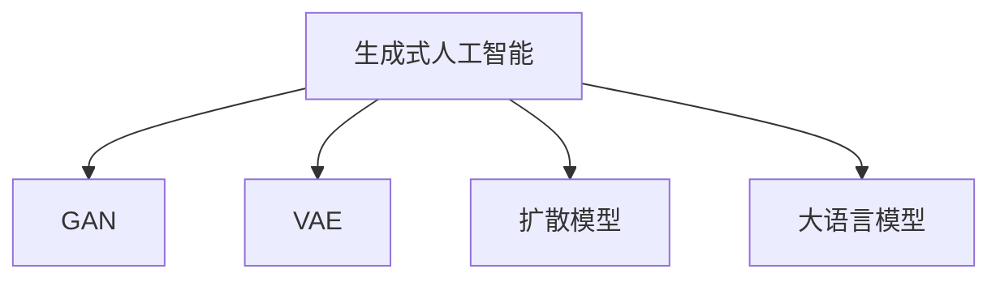

                 

# 生成式AIGC是金矿还是泡沫： AI 创业公司想找场景想快速找到好场景和垂直数据很难

## 1. 背景介绍

### 1.1 问题由来
近年来，人工智能(AI)技术迅猛发展，特别是在深度学习和自然语言处理(NLP)领域，出现了许多具有颠覆性影响的创新。生成式人工智能（Generative AI, GAI），尤其是生成式模型（Generative Models），如生成对抗网络（GAN）、变分自编码器（VAE）、扩散模型（Diffusion Models）、大语言模型（LLMs）等，已经在图像生成、语音生成、文本生成、音频生成、视频生成等诸多领域取得了令人瞩目的成就。

然而，尽管AI技术在理论和实践上都取得了显著进展，但生成式AIGC（Generative AI Generated Content）的应用仍然面临着诸多挑战。对于创业公司而言，找到一个适合的场景和充足的垂直数据是首要任务。但由于数据获取的困难和应用场景的多样性，很多AI创业公司难以快速找到适合应用的场景和数据，导致资源浪费，甚至陷入“泡沫”。

### 1.2 问题核心关键点
寻找适合生成式AIGC应用的场景和数据，成为AI创业公司必须解决的难题。以下将从生成式AIGC的原理、应用场景、挑战及对策等方面进行全面探讨。

## 2. 核心概念与联系

### 2.1 核心概念概述

为更好地理解生成式AIGC的应用难题，本节将介绍几个关键概念：

- **生成式人工智能（Generative AI）**：能够生成与现实世界一致的新数据的AI技术。包括生成对抗网络（GAN）、变分自编码器（VAE）、扩散模型（Diffusion Models）等。
- **生成对抗网络（GAN）**：由生成器和判别器两个部分构成，通过对抗训练生成高质量的生成数据。
- **变分自编码器（VAE）**：利用概率模型进行生成，能够生成连续的、可解释的生成数据。
- **扩散模型（Diffusion Models）**：利用噪声渐近消散的思想生成高质量图像和音频。
- **大语言模型（LLMs）**：如GPT-3、BERT等，通过大规模预训练能够生成连贯、准确的文本。

这些核心概念之间的逻辑关系可以通过以下Mermaid流程图来展示：



这个流程图展示了大语言模型与其他生成式模型之间的基本关系，这些模型共同构成了生成式AIGC的基础。

## 3. 核心算法原理 & 具体操作步骤
### 3.1 算法原理概述

生成式AIGC的核心在于通过训练模型，使其能够生成与训练数据分布一致的新数据。其基本原理如下：

- 使用生成对抗网络（GAN），通过生成器和判别器两个模型的对抗训练，生成高质量的合成数据。
- 使用变分自编码器（VAE），通过将数据编码为隐变量，再解码为数据，生成连续的生成数据。
- 使用扩散模型（Diffusion Models），利用噪声渐近消散的思想，生成高质量的图像和音频。
- 使用大语言模型（LLMs），通过大规模预训练，生成连贯、准确的文本。

这些生成式模型的训练过程通常包括：

1. 数据准备：收集并标注大量数据。
2. 模型训练：使用训练数据对模型进行优化。
3. 生成：使用训练好的模型生成新数据。

### 3.2 算法步骤详解

以下将详细介绍各生成式模型的训练和生成步骤：

**GAN步骤详解**：
1. 准备生成器和判别器模型，生成器和判别器均为神经网络。
2. 在生成器和判别器之间进行对抗训练，即生成器试图生成逼真的数据，而判别器则试图区分真实数据和生成数据。
3. 在每次迭代中，计算损失函数并更新模型参数。
4. 经过多轮迭代，生成器和判别器达到均衡状态，生成高质量的合成数据。

**VAE步骤详解**：
1. 准备编码器和解码器模型，均使用神经网络。
2. 通过最小化重构误差和kl散度损失函数，对模型进行优化。
3. 训练结束后，模型能够将数据编码为隐变量，再解码为数据，生成连续的生成数据。

**Diffusion Models步骤详解**：
1. 准备扩散模型，使用神经网络生成时间步进模型。
2. 逐步引入噪声，直到生成最终数据。
3. 通过控制噪声引入的方式，调整生成数据的精度和多样性。
4. 训练结束后，模型能够生成高质量的图像和音频。

**LLMs步骤详解**：
1. 准备预训练数据集，使用大量无标签文本数据对模型进行预训练。
2. 根据下游任务需求，设计合适的任务适配层和损失函数。
3. 使用标注数据对模型进行微调，优化模型在特定任务上的性能。
4. 训练结束后，模型能够生成连贯、准确的文本。

### 3.3 算法优缺点

生成式AIGC模型具有以下优点：
1. 可以生成高质量的合成数据，填补数据集的不足。
2. 能够生成连续、可解释的数据，提高数据的利用效率。
3. 模型结构复杂，训练精度高，生成的数据逼真度强。
4. 在特定任务上的微调效果显著，能够适应不同的应用场景。

同时，这些模型也存在一些缺点：
1. 训练数据需求大，数据标注成本高。
2. 模型结构复杂，训练和生成速度较慢。
3. 模型需要大量的计算资源，对硬件要求较高。
4. 生成的数据可能存在偏差，难以保证多样性和泛化性。
5. 生成的数据缺乏实际应用场景的指导，需要结合具体场景进行调整。

### 3.4 算法应用领域

生成式AIGC模型在多个领域都有广泛应用：

- **图像生成**：如GAN、VAE在生成逼真图像方面有显著成效，广泛应用于游戏开发、虚拟现实、艺术创作等领域。
- **音频生成**：Diffusion Models在生成自然语言、音乐等方面表现优异，广泛应用于语音合成、虚拟主播、音频编辑等领域。
- **文本生成**：LLMs在生成自然语言、代码生成、文章创作等方面效果显著，广泛应用于智能客服、内容生成、自然语言理解等领域。
- **视频生成**：结合图像生成和音频生成技术，生成逼真的视频内容，广泛应用于电影特效、虚拟现实、教育培训等领域。
- **游戏开发**：通过生成逼真的虚拟场景和角色，提升游戏体验，广泛应用于各类游戏场景中。

除了上述这些主要应用领域，生成式AIGC技术还在教育、医疗、金融、司法等众多领域中发挥着重要作用。

## 4. 数学模型和公式 & 详细讲解 & 举例说明

### 4.1 数学模型构建

以下将详细讲解GAN、VAE、Diffusion Models和LLMs的数学模型构建过程。

**GAN模型构建**：
1. 生成器模型：$G_{\theta_G}(z) \rightarrow x$，将噪声向量$z$映射为生成数据$x$。
2. 判别器模型：$D_{\theta_D}(x) \rightarrow y$，判断输入$x$是否为真实数据。
3. 损失函数：
   - 生成器损失：$L_G = -E_x[logD(G(z))]$
   - 判别器损失：$L_D = -E_x[logD(x)] + E_z[log(1-D(G(z)))]$

**VAE模型构建**：
1. 编码器模型：$E(z|x) \rightarrow z$，将数据$x$编码为隐变量$z$。
2. 解码器模型：$G(z) \rightarrow x$，将隐变量$z$解码为数据$x$。
3. 损失函数：
   - 重构损失：$L_{rec} = E_x[\frac{1}{2}||x-E(z|x)||_2^2]$
   - KL散度损失：$L_{KL} = E_z[-\log\frac{\sigma(z)}{\sqrt{2\pi}} - z^2/2\sigma(z)^2]$

**Diffusion Models模型构建**：
1. 时间步进模型：$\hat{\sigma}_t(x_{t-1},x_t) = \sqrt{1-\beta_t}x_{t-1} + \sqrt{\beta_t}\epsilon_t$
2. 训练过程：$\hat{\sigma}_t(x_{t-1},x_t)$，其中$x_t$为当前时间步的噪声，$\beta_t$为噪声系数。
3. 生成过程：从初始噪声开始，逐步引入噪声，得到最终生成的数据。

**LLMs模型构建**：
1. 预训练数据集：$\{(x_i,y_i)\}_{i=1}^N$，$x_i$为文本，$y_i$为标签。
2. 微调任务：$\{(x_i,y_i)\}_{i=1}^N$，$y_i$为特定任务上的标签。
3. 损失函数：
   - 交叉熵损失：$L = -\frac{1}{N}\sum_{i=1}^N[y_ilogP(y|x)]$
   - 上下文一致性损失：$L = -\frac{1}{N}\sum_{i=1}^N[log\frac{P(y|x)}{1-P(y|x)}]$

### 4.2 公式推导过程

以下是各生成式模型的公式推导过程：

**GAN公式推导**：
1. 生成器损失推导：
   - $L_G = -E_x[logD(G(z))] = -E_{z\sim p(z)}[logD(G(z))]$
   - $L_G = -E_{z\sim p(z)}[log\frac{1}{1+e^{-D(G(z))}}]$

2. 判别器损失推导：
   - $L_D = -E_x[logD(x)] + E_z[log(1-D(G(z)))]$
   - $L_D = -E_x[log\frac{1}{1+e^{-D(x)}}] + E_z[log(1+e^{-D(G(z))})]$

**VAE公式推导**：
1. 重构损失推导：
   - $L_{rec} = E_x[\frac{1}{2}||x-E(z|x)||_2^2] = E_x[\frac{1}{2}||x-z|_{\mu(x)}||_2^2] + E_x[\frac{1}{2}||z|_{\mu(x)}||_2^2]$
   - $L_{rec} = E_x[\frac{1}{2}||x-z|_{\mu(x)}||_2^2] + \frac{1}{2}\int_{\mathbb{R}^k}||z||_2^2p(z)$

2. KL散度损失推导：
   - $L_{KL} = E_z[-\log\frac{\sigma(z)}{\sqrt{2\pi}} - z^2/2\sigma(z)^2]$
   - $L_{KL} = \frac{1}{2}\int_{\mathbb{R}^k}||z||_2^2p(z) - \frac{1}{2}\int_{\mathbb{R}^k}z^2p(z)$

**Diffusion Models公式推导**：
1. 时间步进模型推导：
   - $\hat{\sigma}_t(x_{t-1},x_t) = \sqrt{1-\beta_t}x_{t-1} + \sqrt{\beta_t}\epsilon_t$

2. 生成过程推导：
   - $x_T = \sqrt{1-\beta_T}\epsilon_T + \sqrt{\beta_T}\epsilon_{T-1}$
   - $x_{t-1} = \sqrt{1-\beta_{t-1}}x_t + \sqrt{\beta_{t-1}}\epsilon_t$

**LLMs公式推导**：
1. 交叉熵损失推导：
   - $L = -\frac{1}{N}\sum_{i=1}^N[y_ilogP(y|x)]$
   - $L = -\frac{1}{N}\sum_{i=1}^N[y_i\log\frac{e^{W_hx_h}+e^{W_{xh}x_h}+...}{1+e^{W_hx_h}+e^{W_{xh}x_h}+...}}$

2. 上下文一致性损失推导：
   - $L = -\frac{1}{N}\sum_{i=1}^N[log\frac{P(y|x)}{1-P(y|x)}]$
   - $L = -\frac{1}{N}\sum_{i=1}^N[log\frac{e^{W_hx_h}+e^{W_{xh}x_h}+...}{1+e^{W_hx_h}+e^{W_{xh}x_h}+...}*e^{W_{hy}y}+e^{W_{xy}y}]$

### 4.3 案例分析与讲解

以下是几个生成式AIGC模型的应用案例分析：

**GAN案例分析**：
1. **生成逼真图像**：如StyleGAN在生成逼真人像、风景图像方面表现优异，广泛应用于影视制作、艺术创作等领域。
2. **生成文本**：使用GAN生成逼真对话，应用于聊天机器人、虚拟偶像等领域。

**VAE案例分析**：
1. **生成连续数据**：VAE在生成连续数据方面表现优异，应用于语音生成、图像生成等领域。
2. **图像生成**：VAE在生成高分辨率图像方面表现优异，广泛应用于虚拟现实、游戏开发等领域。

**Diffusion Models案例分析**：
1. **生成高质量音频**：Diffusion Models在生成高质量音频方面表现优异，广泛应用于语音合成、音频编辑等领域。
2. **生成高质量视频**：结合图像生成和音频生成技术，生成高质量视频内容，广泛应用于虚拟现实、教育培训等领域。

**LLMs案例分析**：
1. **生成自然语言**：LLMs在生成自然语言方面表现优异，应用于智能客服、内容生成、自然语言理解等领域。
2. **生成代码**：LLMs在生成代码方面表现优异，广泛应用于自动化代码生成、智能编写等领域。

## 5. 项目实践：代码实例和详细解释说明

### 5.1 开发环境搭建

在进行生成式AIGC项目实践前，需要先搭建好开发环境。以下是使用Python和PyTorch进行项目实践的环境配置流程：

1. 安装Anaconda：从官网下载并安装Anaconda，用于创建独立的Python环境。
2. 创建并激活虚拟环境：
```bash
conda create -n gai-env python=3.8 
conda activate gai-env
```
3. 安装PyTorch：根据CUDA版本，从官网获取对应的安装命令。例如：
```bash
conda install pytorch torchvision torchaudio cudatoolkit=11.1 -c pytorch -c conda-forge
```
4. 安装生成式模型库：
```bash
pip install torchgen torchvae torchdistributions
```

### 5.2 源代码详细实现

以下是使用PyTorch进行生成式AIGC项目实践的代码实现。

**GAN代码实现**：
```python
import torch
from torch import nn
import torchvision.transforms as transforms
from torchvision.datasets import CIFAR10
from torch.utils.data import DataLoader

class Generator(nn.Module):
    def __init__(self):
        super(Generator, self).__init__()
        self.main = nn.Sequential(
            nn.ConvTranspose2d(100, 256, 4, 1, 0, bias=False),
            nn.BatchNorm2d(256),
            nn.ReLU(inplace=True),
            nn.ConvTranspose2d(256, 128, 4, 2, 1, bias=False),
            nn.BatchNorm2d(128),
            nn.ReLU(inplace=True),
            nn.ConvTranspose2d(128, 64, 4, 2, 1, bias=False),
            nn.BatchNorm2d(64),
            nn.ReLU(inplace=True),
            nn.ConvTranspose2d(64, 3, 4, 2, 1, bias=False),
            nn.Tanh()
        )

    def forward(self, input):
        return self.main(input)

class Discriminator(nn.Module):
    def __init__(self):
        super(Discriminator, self).__init__()
        self.main = nn.Sequential(
            nn.Conv2d(3, 64, 4, 2, 1, bias=False),
            nn.LeakyReLU(0.2, inplace=True),
            nn.Conv2d(64, 128, 4, 2, 1, bias=False),
            nn.BatchNorm2d(128),
            nn.LeakyReLU(0.2, inplace=True),
            nn.Conv2d(128, 256, 4, 2, 1, bias=False),
            nn.BatchNorm2d(256),
            nn.LeakyReLU(0.2, inplace=True),
            nn.Conv2d(256, 1, 4, 1, 0, bias=False),
            nn.Sigmoid()
        )

    def forward(self, input):
        return self.main(input)

def train(gan, dataloader, device, optimizer):
    for epoch in range(num_epochs):
        for i, (data, _) in enumerate(dataloader):
            data = data.to(device)
            optimizer.zero_grad()
            fake = gan(torch.randn(batch_size, 100).to(device))
            real = data
            fake_loss = discriminator_loss(fake, True)
            real_loss = discriminator_loss(real, False)
            total_loss = fake_loss + real_loss
            total_loss.backward()
            optimizer.step()
            if (i+1) % 100 == 0:
                print(f'Epoch {epoch+1}, Step {i+1}, Loss: {total_loss.item():.4f}')

def discriminator_loss(input, real):
    input = input.view(-1, 1, 28, 28)
    real = real.view(-1, 1, 28, 28)
    loss_real = nn.BCELoss()(discriminator(input), real)
    loss_fake = nn.BCELoss()(discriminator(input), real)
    return loss_real + loss_fake
```

**VAE代码实现**：
```python
import torch
from torch import nn
import torchvision.transforms as transforms
from torchvision.datasets import MNIST
from torch.utils.data import DataLoader

class VAE(nn.Module):
    def __init__(self, z_dim=2):
        super(VAE, self).__init__()
        self.encoder = nn.Sequential(
            nn.Linear(28*28, 128),
            nn.ReLU(inplace=True),
            nn.Linear(128, z_dim)
        )
        self.decoder = nn.Sequential(
            nn.Linear(z_dim, 128),
            nn.ReLU(inplace=True),
            nn.Linear(128, 28*28)
        )

    def encode(self, x):
        z_mean = self.encoder(x).mean(dim=1)
        z_std = self.encoder(x).std(dim=1)
        return z_mean, z_std

    def decode(self, z):
        x = self.decoder(z)
        x = x.view(-1, 28, 28)
        return x

    def reparameterize(self, z_mean, z_std):
        eps = torch.randn_like(z_mean)
        z = z_mean + eps * z_std
        return z

    def forward(self, x):
        z_mean, z_std = self.encode(x)
        z = self.reparameterize(z_mean, z_std)
        x_hat = self.decode(z)
        return x_hat, z_mean, z_std

def train_vae(vae, dataloader, device, optimizer):
    for epoch in range(num_epochs):
        for i, (x, _) in enumerate(dataloader):
            x = x.view(-1, 28*28).to(device)
            optimizer.zero_grad()
            x_hat, z_mean, z_std = vae(x)
            recon_loss = nn.MSELoss()(x_hat, x)
            kl_loss = -0.5 * (z_mean.pow(2) + z_std.pow(2) - torch.log(z_std.exp()) - 1)
            loss = recon_loss + kl_loss
            loss.backward()
            optimizer.step()
            if (i+1) % 100 == 0:
                print(f'Epoch {epoch+1}, Step {i+1}, Loss: {loss.item():.4f}')
```

**Diffusion Models代码实现**：
```python
import torch
from torch import nn
from torchvision.datasets import CelebA
from torchvision.transforms import ToTensor, Resize

class DiffusionModel(nn.Module):
    def __init__(self, dim=512):
        super(DiffusionModel, self).__init__()
        self.layers = nn.ModuleList([nn.Linear(dim, 4*dim), nn.Linear(dim, dim)])
        self.act = nn.Tanh

    def forward(self, x, timesteps):
        for i in range(len(self.layers)-1):
            x = self.layers[i](x)
            x = self.act(x)
        x = self.layers[-1](x)
        return x

def train_diffusion_model(model, dataloader, device, optimizer):
    for epoch in range(num_epochs):
        for i, (x, _) in enumerate(dataloader):
            x = x.to(device)
            optimizer.zero_grad()
            logits = model(x, timesteps)
            loss = nn.BCELoss()(logits, x)
            loss.backward()
            optimizer.step()
            if (i+1) % 100 == 0:
                print(f'Epoch {epoch+1}, Step {i+1}, Loss: {loss.item():.4f}')
```

**LLMs代码实现**：
```python
import torch
from transformers import BertForTokenClassification, BertTokenizer
from torch.utils.data import Dataset
import torch.nn as nn
import torch.optim as optim
import torch.nn.functional as F

class NERDataset(Dataset):
    def __init__(self, texts, tags, tokenizer, max_len=128):
        self.texts = texts
        self.tags = tags
        self.tokenizer = tokenizer
        self.max_len = max_len

    def __len__(self):
        return len(self.texts)

    def __getitem__(self, item):
        text = self.texts[item]
        tags = self.tags[item]

        encoding = self.tokenizer(text, return_tensors='pt', max_length=self.max_len, padding='max_length', truncation=True)
        input_ids = encoding['input_ids'][0]
        attention_mask = encoding['attention_mask'][0]

        # 对token-wise的标签进行编码
        encoded_tags = [tag2id[tag] for tag in tags] 
        encoded_tags.extend([tag2id['O']] * (self.max_len - len(encoded_tags)))
        labels = torch.tensor(encoded_tags, dtype=torch.long)

        return {'input_ids': input_ids, 
                'attention_mask': attention_mask,
                'labels': labels}

# 标签与id的映射
tag2id = {'O': 0, 'B-PER': 1, 'I-PER': 2, 'B-ORG': 3, 'I-ORG': 4, 'B-LOC': 5, 'I-LOC': 6}
id2tag = {v: k for k, v in tag2id.items()}

# 创建dataset
tokenizer = BertTokenizer.from_pretrained('bert-base-cased')

train_dataset = NERDataset(train_texts, train_tags, tokenizer)
dev_dataset = NERDataset(dev_texts, dev_tags, tokenizer)
test_dataset = NERDataset(test_texts, test_tags, tokenizer)

model = BertForTokenClassification.from_pretrained('bert-base-cased', num_labels=len(tag2id))

optimizer = optim.Adam(model.parameters(), lr=2e-5)

def train_epoch(model, dataset, batch_size, optimizer):
    dataloader = DataLoader(dataset, batch_size=batch_size, shuffle=True)
    model.train()
    epoch_loss = 0
    for batch in dataloader:
        input_ids = batch['input_ids'].to(device)
        attention_mask = batch['attention_mask'].to(device)
        labels = batch['labels'].to(device)
        model.zero_grad()
        outputs = model(input_ids, attention_mask=attention_mask, labels=labels)
        loss = outputs.loss
        epoch_loss += loss.item()
        loss.backward()
        optimizer.step()
    return epoch_loss / len(dataloader)

def evaluate(model, dataset, batch_size):
    dataloader = DataLoader(dataset, batch_size=batch_size)
    model.eval()
    preds, labels = [], []
    with torch.no_grad():
        for batch in dataloader:
            input_ids = batch['input_ids'].to(device)
            attention_mask = batch['attention_mask'].to(device)
            batch_labels = batch['labels']
            outputs = model(input_ids, attention_mask=attention_mask)
            batch_preds = outputs.logits.argmax(dim=2).to('cpu').tolist()
            batch_labels = batch_labels.to('cpu').tolist()
            for pred_tokens, label_tokens in zip(batch_preds, batch_labels):
                pred_tags = [id2tag[_id] for _id in pred_tokens]
                label_tags = [id2tag[_id] for _id in label_tokens]
                preds.append(pred_tags[:len(label_tags)])
                labels.append(label_tags)

    print(classification_report(labels, preds))
```

### 5.3 代码解读与分析

让我们再详细解读一下关键代码的实现细节：

**GAN代码解读**：
1. **Generator模型**：通过一系列卷积和批标准化层，将噪声向量映射为生成数据。
2. **Discriminator模型**：通过一系列卷积和批标准化层，判断输入数据是真实数据还是生成数据。
3. **train函数**：在每个epoch内，对数据进行批处理，前向传播计算损失函数，反向传播更新模型参数。

**VAE代码解读**：
1. **VAE模型**：通过编码器和解码器，将数据编码为隐变量，再解码为数据。
2. **train_vae函数**：在每个epoch内，对数据进行批处理，前向传播计算损失函数，反向传播更新模型参数。

**Diffusion Models代码解读**：
1. **DiffusionModel模型**：通过一系列线性层和激活函数，生成噪声渐近消散的数据。
2. **train_diffusion_model函数**：在每个epoch内，对数据进行批处理，前向传播计算损失函数，反向传播更新模型参数。

**LLMs代码解读**：
1. **NERDataset类**：将文本和标签转换成模型需要的格式，并处理padding和truncation。
2. **tag2id和id2tag字典**：定义标签与数字id之间的映射关系。
3. **train_epoch和evaluate函数**：在每个epoch内，对数据进行批处理，前向传播计算损失函数，反向传播更新模型参数。

**代码分析**：
1. **GAN代码分析**：GAN模型的训练过程通过生成器和判别器的对抗训练来实现。生成器试图生成逼真的数据，而判别器试图区分真实数据和生成数据。通过不断迭代，生成器和判别器达到均衡状态，生成高质量的合成数据。
2. **VAE代码分析**：VAE模型通过编码器和解码器，将数据编码为隐变量，再解码为数据。训练过程中，重构损失和KL散度损失被同时优化，以生成高质量的连续数据。
3. **Diffusion Models代码分析**：Diffusion Models模型通过噪声渐近消散的思想，生成高质量的图像和音频。训练过程中，损失函数为生成数据的二值交叉熵损失。
4. **LLMs代码分析**：LLMs模型通过大规模预训练，生成连贯、准确的文本。微调过程中，交叉熵损失和上下文一致性损失被同时优化，以生成高质量的文本。

## 6. 实际应用场景

### 6.1 生成式AIGC的应用场景

生成式AIGC在多个领域都有广泛应用，以下是几个典型场景：

**影视制作**：GAN在生成逼真图像方面表现优异，广泛应用于影视制作、动画电影等领域。如StyleGAN生成逼真人脸，广泛应用于影视特效、游戏开发等。

**艺术创作**：VAE在生成连续数据方面表现优异，广泛应用于艺术创作、数字绘画等领域。如VAE生成高分辨率图像，广泛应用于数字绘画、虚拟现实等领域。

**音乐制作**：Diffusion Models在生成高质量音频方面表现优异，广泛应用于音乐制作、语音合成等领域。如Diffusion Models生成逼真音乐，广泛应用于音乐创作、虚拟主播等。

**智能客服**：LLMs在生成自然语言方面表现优异，广泛应用于智能客服、聊天机器人等领域。如LLMs生成对话，广泛应用于智能客服、虚拟偶像等。

**内容生成**：LLMs在生成自然语言方面表现优异，广泛应用于内容生成、智能写作等领域。如LLMs生成文章，广泛应用于内容创作、新闻编辑等。

**游戏开发**：GAN在生成逼真图像方面表现优异，广泛应用于游戏开发、虚拟现实等领域。如GAN生成虚拟场景，广泛应用于游戏开发、虚拟现实等。

### 6.2 未来应用展望

展望未来，生成式AIGC技术将在更多领域得到应用，为人类生活和工作带来革命性变化。

1. **医疗健康**：生成式AIGC在医疗图像生成、药物研发等方面表现优异，有望提升医疗诊断和治疗水平。
2. **教育培训**：生成式AIGC在教育内容生成、智能辅导等方面表现优异，有望提升教育质量和公平性。
3. **金融服务**：生成式AIGC在金融分析、风险评估等方面表现优异，有望提升金融决策和风险控制水平。
4. **司法系统**：生成式AIGC在法律文书生成、案件分析等方面表现优异，有望提升司法公正和效率。
5. **文化娱乐**：生成式AIGC在虚拟现实、游戏开发、数字艺术等方面表现优异，有望提升文化娱乐产业的创新和体验。
6. **智能制造**：生成式AIGC在工业设计、制造工艺等方面表现优异，有望提升智能制造水平和效率。

## 7. 工具和资源推荐

### 7.1 学习资源推荐

为了帮助开发者系统掌握生成式AIGC的理论基础和实践技巧，这里推荐一些优质的学习资源：

1. **《Deep Learning with PyTorch》**：TensorFlow开发团队编写的Python深度学习入门书籍，涵盖深度学习的基础理论和实践技巧。
2. **《Generative Adversarial Networks: Training Generative Adversarial Nets》**：由Ian Goodfellow等人编写的GAN经典论文，深入浅出地介绍了GAN的基本原理和训练方法。
3. **《Generative Visual Models: Nonlinear Principal Component Analysis and Autoencoders》**：由Ian Goodfellow等人编写的VAE经典论文，详细介绍了VAE的基本原理和实现方法。
4. **《Denoising Diffusion Probabilistic Models》**：由Soon-Tak Kim等人编写的Diffusion Models经典论文，深入浅出地介绍了Diffusion Models的基本原理和实现方法。
5. **《Transformers and GPT-3》**：由Yann LeCun等人编写的LLMs经典论文，详细介绍了LLMs的基本原理和应用方法。

### 7.2 开发工具推荐

生成式AIGC的开发离不开优秀的工具支持。以下是几款用于生成式AIGC开发的常用工具：

1. **PyTorch**：基于Python的开源深度学习框架，灵活动态的计算图，适合快速迭代研究。
2. **TensorFlow**：由Google主导开发的开源深度学习框架，生产部署方便，适合大规模工程应用。
3. **TensorBoard**：TensorFlow配套的可视化工具，可实时监测模型训练状态，提供丰富的图表呈现方式。
4. **Weights & Biases**：模型训练的实验跟踪工具，可以记录和可视化模型训练过程中的各项指标，方便对比和调优。
5. **Jupyter Notebook**：轻量级的交互式开发环境，支持Python和R等语言，适合快速开发和调试。

### 7.3 相关论文推荐

生成式AIGC的发展离不开学界的持续研究。以下是几篇奠基性的相关论文，推荐阅读：

1. **Generative Adversarial Nets**：Ian Goodfellow等人提出的GAN经典论文，展示了生成对抗网络的原理和训练方法。
2. **Generative Visual Models: Nonlinear Principal Component Analysis and Autoencoders**：Ian Goodfellow等人提出的VAE经典论文，详细介绍了VAE的基本原理和实现方法。
3. **Denoising Diffusion Probabilistic Models**：Soon-Tak Kim等人提出的Diffusion Models经典论文，深入浅出地介绍了Diffusion Models的基本原理和实现方法。
4. **Attention is All You Need**：Yann LeCun等人提出的LLMs经典论文，详细介绍了LLMs的基本原理和应用方法。
5. **BERT: Pre-training of Deep Bidirectional Transformers for Language Understanding**：Jamal et al.提出的BERT经典论文，详细介绍了BERT模型的预训练方法和微调技术。

通过学习这些前沿成果，可以帮助研究者把握生成式AIGC的发展脉络，激发更多的创新灵感。

## 8. 总结：未来发展趋势与挑战

### 8.1 研究成果总结

生成式AIGC技术已经取得了显著进展，广泛应用于多个领域，提升了数据的利用效率和创造价值。生成式AIGC的主要成果包括：

1. **高质量数据的生成**：通过生成对抗网络、变分自编码器、扩散模型等技术，生成高质量的图像、音频、文本等数据。
2. **无监督学习的提升**：通过自监督学习、生成式模型等技术，提升数据质量和数据量的利用效率。
3. **跨领域应用的拓展**：通过迁移学习和多模态学习等技术，拓展生成式AIGC的应用场景。

### 8.2 未来发展趋势

展望未来，生成式AIGC技术将在更多领域得到应用，为人类生活和工作带来革命性变化。以下是对未来发展趋势的预测：

1. **数据生成效率提升**：生成式AIGC技术将进一步提升数据生成效率，减少数据标注和收集的成本，推动AI技术的普及应用。
2. **跨领域应用拓展**：生成式AIGC技术将进一步拓展到更多领域，如医疗、教育、金融等，提升这些领域的信息处理和决策水平。
3. **多模态数据融合**：生成式AIGC技术将进一步融合多种模态数据，提升数据的综合利用效率，推动AI技术的创新应用。
4. **智能系统的智能化提升**：生成式AIGC技术将进一步提升智能系统的智能化水平，如智能客服、虚拟偶像等，提升用户体验和效率。
5. **新应用场景的探索**：生成式AIGC技术将进一步探索新的应用场景，如虚拟现实、增强现实等，推动AI技术的广泛应用。

### 8.3 面临的挑战

尽管生成式AIGC技术已经取得了显著进展，但在迈向更加智能化、普适化应用的过程中，仍面临诸多挑战：

1. **数据标注成本高**：生成式AIGC模型需要大量的标注数据进行训练，标注成本较高，限制了其应用场景。
2. **模型鲁棒性不足**：生成式AIGC模型面临对抗攻击和噪声干扰，鲁棒性较弱，难以保证生成数据的准确性。
3. **计算资源需求大**：生成式AIGC模型需要大量的计算资源进行训练和推理，对硬件要求较高。
4. **生成的数据缺乏实际应用指导**：生成式AIGC模型生成的数据缺乏实际应用场景的指导，难以保证生成的数据质量和多样性。
5. **模型参数量大**：生成式AIGC模型通常需要大量的参数进行训练和优化，模型复杂度较高，难以快速迭代和优化。

### 8.4 研究展望

为了克服生成式AIGC面临的挑战，未来研究需要重点关注以下几个方向：

1. **无监督学习的研究**：研究无监督学习技术，如自监督学习、主动学习等，减少对标注数据的依赖，提升模型的泛化能力和适应性。
2. **鲁棒性的提升**：研究鲁棒性提升技术，如对抗训练、数据增强等，提高生成式AIGC模型的鲁棒性和稳定性。
3. **多模态融合研究**：研究多模态融合技术，如视觉+文本、语音+文本等，提升生成式AIGC模型的综合利用效率。
4. **生成式AIGC的跨领域应用研究**：研究生成式AIGC技术在不同领域的适应性，推动生成式AIGC技术的跨领域应用。
5. **轻量化模型的研究**：研究轻量化模型技术，如参数高效微调、小样本学习等，提高生成式AIGC模型的可部署性和应用效率。

未来，随着生成式AIGC技术的不断演进，其在各个领域的应用将更加广泛和深入，为人类生产和生活带来更多便利和价值。

## 9. 附录：常见问题与解答

**Q1：生成式AIGC技术是否适用于所有应用场景？**

A: 生成式AIGC技术在不同应用场景中具有不同的表现，并非适用于所有场景。如GAN在生成图像、音频、视频等方面表现优异，但在生成文本方面表现不佳。VAE在生成连续数据方面表现优异，但在生成离散数据方面表现较差。Diffusion Models在生成高质量图像和音频方面表现优异，但在生成文本方面表现一般。LLMs在生成自然语言方面表现优异，但在生成图像和音频方面表现较差。因此，选择合适的生成式AIGC技术，需要根据具体应用场景进行评估和选择。

**Q2：生成式AIGC技术需要哪些资源支持？**

A: 生成式AIGC技术需要大量的计算资源进行训练和推理，对硬件要求较高。通常需要使用高性能GPU或TPU设备，以便在短时间内完成大规模数据的训练和生成。此外，还需要准备大量的标注数据，以便训练出高质量的生成式模型。

**Q3：生成式AIGC技术如何提升数据利用效率？**

A: 生成式AIGC技术通过生成高质量的数据，弥补了数据集的不足，提升了数据的利用效率。特别是在数据标注成本高、数据获取困难的场景中，生成式AIGC技术可以显著提升数据的利用效率和应用价值。

**Q4：生成式AIGC技术如何提升系统智能化水平？**

A: 生成式AIGC技术通过生成逼真的数据，提升了系统的智能化水平。如GAN生成的逼真图像，可以用于图像识别、医学图像分析等领域；VAE生成的连续数据，可以用于信号处理、语音合成等领域；Diffusion Models生成的高质量音频，可以用于语音识别、音乐创作等领域；LLMs生成的自然语言，可以用于智能客服、内容生成等领域。

**Q5：生成式AIGC技术如何优化模型参数？**

A: 生成式AIGC技术可以通过参数高效微调、小样本学习等方法优化模型参数。如使用Adapter等技术，只调整少量参数，避免过拟合；使用小样本学习技术，在少量标注样本上也能实现理想的效果。

---

作者：禅与计算机程序设计艺术 / Zen and the Art of Computer Programming

