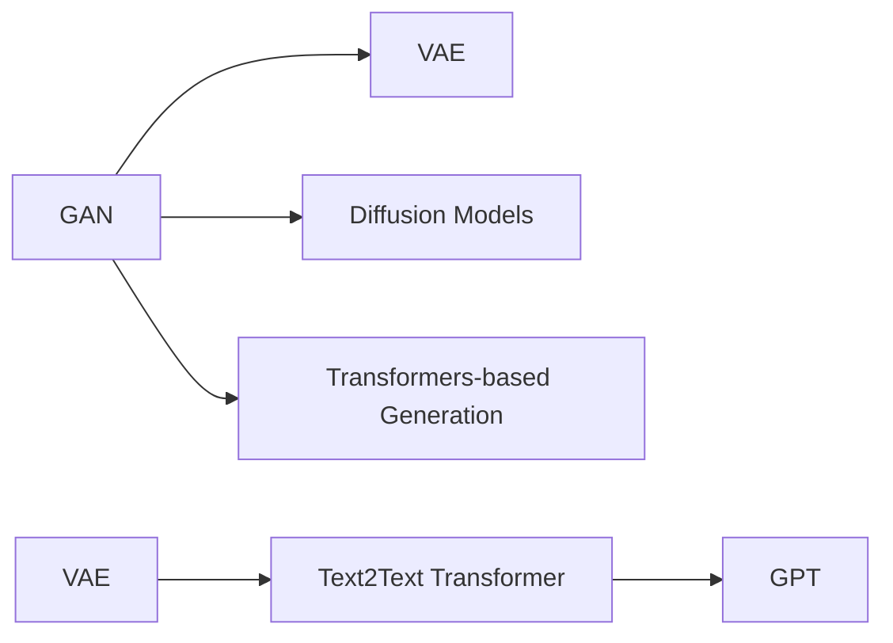

                 

## 1. 背景介绍

### 1.1 问题由来

近年来，生成式人工智能（Generative AI, GAI）技术迅速发展，其核心代表是生成对抗网络（Generative Adversarial Network, GAN）、变分自编码器（Variational Autoencoder, VAE）、扩散模型（Diffusion Models）等，这些技术不仅能生成高质量的图像、音频、文本等内容，还能在自然语言处理（Natural Language Processing, NLP）、推荐系统、游戏生成等领域展现强大的潜力。生成式AI不仅在学术界备受关注，也在产业界逐步落地，驱动了众多产业的数字化转型升级。然而，生成式AI在带来巨大价值的同时，也引发了一系列问题，如道德伦理、版权归属、商业变现等，使得业界对生成式AI的价值和前景产生诸多争议。

### 1.2 问题核心关键点

生成式AI的价值和前景主要集中在以下几个方面：

1. **技术成熟度**：生成式AI的核心算法技术逐步成熟，如图像生成领域的GAN、 diffusion models，文本生成领域的GPT系列、Text2Text Transformer等，已能生成高质量内容，逼真度不断提升。
2. **应用广度**：生成式AI技术的应用领域迅速扩大，从游戏、娱乐、广告、影视到医疗、教育、金融、法律等诸多行业，未来具有广阔的应用前景。
3. **商业模式探索**：尽管生成式AI的商业模式尚在探索，但其独特的商业价值已受到广泛关注。通过版权变现、平台服务、内容创造、个性化推荐等方式，未来有望开辟新的商业领域。
4. **伦理与社会影响**：生成式AI引发的伦理问题，如版权、隐私、偏见等，需要引起全社会的关注和讨论。如何在保障技术进步的同时，妥善处理这些问题，成为重要的课题。
5. **产业合作与投资**：生成式AI正成为热门投资领域，各大科技巨头、创业公司、投资机构纷纷布局，未来有望带来巨大的商业回报。

## 2. 核心概念与联系

### 2.1 核心概念概述

为了更好地理解生成式AI的价值与未来发展，本节将介绍几个关键概念：

- **生成式AI (Generative AI)**：一种能够从随机噪声生成数据的技术，如GAN、VAE、扩散模型等，能够生成逼真的图像、音频、文本等内容，推动NLP、计算机视觉、音频生成等领域的发展。
- **对抗网络（Generative Adversarial Network, GAN）**：一种通过对抗生成器和判别器相互博弈的方式生成数据的技术，能够在图像、音频、视频等多个领域生成高质量内容。
- **变分自编码器（Variational Autoencoder, VAE）**：一种利用变分推断技术进行编码和解码生成数据的模型，能够在图像、文本等领域生成合理的分布式表示。
- **扩散模型（Diffusion Models）**：一种基于随机过程逐步引入噪声来生成数据的方法，能够在图像生成、视频生成等领域产生高质量内容。
- **生成对抗网络（Generative Adversarial Network, GAN）**：一种由生成器和判别器构成的对抗训练结构，能够在图像生成、音频生成等领域生成逼真内容。

这些概念之间的联系可以通过以下Mermaid流程图来展示：



这个流程图展示了大语言模型与生成式AI之间的联系：

1. GAN能够生成逼真的图像、音频内容，对视觉、音频等领域产生重大影响。
2. VAE能够生成逼真的图像、文本内容，适合对数据分布进行建模。
3. 扩散模型基于随机过程逐步引入噪声生成数据，已在图像、视频等领域应用。
4. Transformer系列模型可用于文本生成、图像生成等领域，通过改进成为高精度的生成模型。
5. 在文本生成领域，VAE与Text2Text Transformer、GPT等结合，用于生成高质量文本内容。

## 3. 核心算法原理 & 具体操作步骤
### 3.1 算法原理概述

生成式AI的核心算法技术主要包括生成对抗网络（GAN）、变分自编码器（VAE）、扩散模型（Diffusion Models）等。这些技术均通过生成模型与判别模型之间的对抗博弈，逐步优化生成器参数，最终生成高质量的内容。

- **GAN**：通过生成器和判别器之间的博弈，生成器尝试生成尽可能逼真的数据，判别器尝试区分真实数据与生成数据。通过不断调整两个模型的参数，使生成数据逼近真实数据。
- **VAE**：利用变分推断技术，对数据分布进行建模，生成与训练数据相似的新数据。VAE通过编码器将数据转换为低维分布，通过解码器从低维分布生成新数据。
- **Diffusion Models**：利用正向和反向扩散过程，逐步引入噪声生成数据。正向扩散过程引入噪声，反向扩散过程将噪声去除，最终生成高质量的数据。

### 3.2 算法步骤详解

以GAN为例，详细讲解生成对抗网络（GAN）的算法步骤：

1. **生成器初始化**：生成器模型初始化，通常采用全连接层、卷积神经网络（CNN）等结构。
2. **判别器初始化**：判别器模型初始化，与生成器结构类似，但一般有多个输出层，用于区分真实数据和生成数据。
3. **对抗博弈**：通过训练过程，生成器生成逼真的数据，判别器尝试区分真实数据和生成数据，两个模型相互博弈。
4. **损失函数计算**：计算生成器和判别器的损失函数，通常包括生成器损失和判别器损失。
5. **梯度下降**：使用梯度下降优化生成器和判别器的参数，最小化总损失函数。
6. **迭代更新**：重复步骤3-5，直到生成器和判别器的性能达到预期。

### 3.3 算法优缺点

生成式AI技术具有以下优点：

1. **多样性生成**：生成式AI能够生成多种风格、多种形式的内容，满足不同应用场景的需求。
2. **低成本生成**：相比人工生成内容，生成式AI能够以较低的成本快速生成高质量的数据。
3. **动态生成**：生成式AI能够根据用户输入生成个性化内容，提升用户体验。
4. **快速迭代**：生成式AI的训练过程具有可扩展性，可以不断迭代改进模型，提升生成质量。

然而，生成式AI也存在以下缺点：

1. **数据依赖性强**：生成式AI需要大量高质量的训练数据，数据质量会直接影响生成结果。
2. **模型训练复杂**：生成式AI的训练过程需要高计算资源和时间，对硬件要求较高。
3. **生成内容质量不稳定**：生成式AI生成的内容存在一定的随机性和不稳定，部分生成的内容可能质量较低。
4. **道德和伦理问题**：生成式AI可能生成有害、偏见的虚假信息，引发伦理问题。

### 3.4 算法应用领域

生成式AI在多个领域有广泛应用，主要包括以下几个方面：

- **图像生成**：如GAN、VAE、扩散模型等，生成逼真、多样化的图像内容，广泛应用于影视、游戏、广告等行业。
- **文本生成**：如GPT系列、Text2Text Transformer等，生成自然流畅的文本内容，广泛应用于智能客服、内容创作、情感分析等。
- **音频生成**：如WaveNet、CycleGAN等，生成高质量的语音和音乐，应用于语音识别、音乐创作、对话系统等。
- **视频生成**：如D-ID、FrameGAN等，生成逼真的视频内容，广泛应用于影视制作、动画生成、视频编辑等领域。
- **3D建模**：如GAN、VAE等，生成逼真的3D模型，广泛应用于游戏、虚拟现实、建筑设计等领域。

## 4. 数学模型和公式 & 详细讲解  
### 4.1 数学模型构建

生成式AI的核心数学模型包括生成模型和判别模型。以GAN为例，其数学模型构建如下：

设数据分布为 $p(x)$，生成模型为 $G(z)$，判别模型为 $D(x)$，则生成对抗网络的损失函数为：

$$
L(D,G) = E_{x\sim p(x)}[logD(x)] + E_{z\sim p(z)}[log(1-D(G(z)))]
$$

其中，$E$ 表示期望，$log$ 表示自然对数，$p(z)$ 表示随机噪声分布。

### 4.2 公式推导过程

以GAN为例，详细推导生成器和判别器的损失函数。

生成器 $G(z)$ 将随机噪声 $z$ 转化为生成数据 $x$，判别器 $D(x)$ 判断 $x$ 的真实性，损失函数如下：

- **生成器损失**：$L_G = E_{z\sim p(z)}[log(1-D(G(z)))]$
- **判别器损失**：$L_D = E_{x\sim p(x)}[logD(x)] + E_{z\sim p(z)}[log(1-D(G(z)))]$

通过最小化总损失函数 $L(D,G) = L_D + L_G$，生成器和判别器不断博弈，生成高质量的逼真数据。

### 4.3 案例分析与讲解

以GAN生成逼真图像为例，分析其生成过程和效果。

**案例分析**：
- **数据准备**：准备一组高质量的图像数据，如MNIST手写数字图像集。
- **模型构建**：构建一个简单的卷积神经网络（CNN）作为生成器，一个二分类器作为判别器。
- **对抗博弈**：生成器和判别器交替训练，生成器尝试生成逼真图像，判别器尝试区分生成图像和真实图像。
- **损失函数优化**：最小化生成器和判别器的总损失函数，优化模型参数。
- **生成结果**：生成器生成逼真图像，判别器性能提升，最终生成高质量的图像数据。

**效果展示**：
- **可视化效果**：将生成的图像与真实图像对比，展示生成结果的逼真程度。
- **定量评估**：通过计算生成图像的Inception Score和Fréchet Inception Distance等指标，评估生成图像的质量。

## 5. 项目实践：代码实例和详细解释说明
### 5.1 开发环境搭建

在进行生成式AI项目实践前，我们需要准备好开发环境。以下是使用Python进行TensorFlow开发的环境配置流程：

1. 安装Anaconda：从官网下载并安装Anaconda，用于创建独立的Python环境。

2. 创建并激活虚拟环境：
```bash
conda create -n genai-env python=3.8 
conda activate genai-env
```

3. 安装TensorFlow：根据CUDA版本，从官网获取对应的安装命令。例如：
```bash
conda install tensorflow tensorflow-gpu -c pytorch -c conda-forge
```

4. 安装各类工具包：
```bash
pip install numpy pandas scikit-learn matplotlib tqdm jupyter notebook ipython
```

完成上述步骤后，即可在`genai-env`环境中开始生成式AI实践。

### 5.2 源代码详细实现

下面我们以GAN生成图像为例，给出使用TensorFlow实现GAN的PyTorch代码实现。

首先，定义生成器和判别器的模型结构：

```python
import tensorflow as tf

# 生成器定义
class Generator(tf.keras.Model):
    def __init__(self):
        super(Generator, self).__init__()
        self.dense1 = tf.keras.layers.Dense(256, input_dim=100)
        self.dense2 = tf.keras.layers.Dense(256, input_dim=256)
        self.dense3 = tf.keras.layers.Dense(784, input_dim=256)
        self.reshape = tf.keras.layers.Reshape((28, 28, 1))
        
    def call(self, inputs):
        x = self.dense1(inputs)
        x = tf.keras.layers.LeakyReLU(alpha=0.2)(x)
        x = self.dense2(x)
        x = tf.keras.layers.LeakyReLU(alpha=0.2)(x)
        x = self.dense3(x)
        x = tf.keras.layers.LeakyReLU(alpha=0.2)(x)
        x = self.reshape(x)
        return x

# 判别器定义
class Discriminator(tf.keras.Model):
    def __init__(self):
        super(Discriminator, self).__init__()
        self.dense1 = tf.keras.layers.Dense(256, input_dim=784)
        self.dense2 = tf.keras.layers.Dense(256, input_dim=256)
        self.dense3 = tf.keras.layers.Dense(1, input_dim=256)
        
    def call(self, inputs):
        x = self.dense1(inputs)
        x = tf.keras.layers.LeakyReLU(alpha=0.2)(x)
        x = self.dense2(x)
        x = tf.keras.layers.LeakyReLU(alpha=0.2)(x)
        x = self.dense3(x)
        return x

# 构建GAN模型
gan = tf.keras.Sequential([
    Generator(),
    Discriminator()
])
```

然后，定义生成器和判别器的损失函数：

```python
# 生成器损失函数
def generator_loss(x, y):
    gen_loss = tf.keras.losses.BinaryCrossentropy()(x, y)
    return gen_loss

# 判别器损失函数
def discriminator_loss(x, y):
    dis_loss = tf.keras.losses.BinaryCrossentropy()(x, y)
    return dis_loss

# 总损失函数
def total_loss(gen_output, dis_output, gen_target, dis_target):
    gen_loss = generator_loss(gen_output, gen_target)
    dis_loss = discriminator_loss(dis_output, dis_target)
    total_loss = gen_loss + dis_loss
    return total_loss
```

接着，定义训练和评估函数：

```python
# 训练函数
def train_gan(gen, dis, dataset, batch_size, epochs, learning_rate):
    # 定义优化器
    gen_optimizer = tf.keras.optimizers.Adam(learning_rate=learning_rate)
    dis_optimizer = tf.keras.optimizers.Adam(learning_rate=learning_rate)
    
    # 定义迭代器
    generator_input = tf.keras.Input(shape=(100,))
    gen_output = gen(generator_input)
    generator_loss = tf.keras.losses.BinaryCrossentropy()(gen_output, gen_target)
    gen_train = tf.keras.Model(generator_input, generator_loss)
    
    discriminator_input = tf.keras.Input(shape=(784,))
    dis_output = dis(discriminator_input)
    discriminator_loss = tf.keras.losses.BinaryCrossentropy()(dis_output, discriminator_target)
    dis_train = tf.keras.Model(discriminator_input, discriminator_loss)
    
    # 联合训练
    with tf.GradientTape() as tape:
        gen_output = gen(generator_input)
        dis_output = dis(discriminator_input)
        total_loss = total_loss(gen_output, dis_output, gen_target, discriminator_target)
    gradients_of_generator = tape.gradient(total_loss, gen.trainable_variables)
    gradients_of_discriminator = tape.gradient(total_loss, dis.trainable_variables)
    gen_optimizer.apply_gradients(zip(gradients_of_generator, gen.trainable_variables))
    dis_optimizer.apply_gradients(zip(gradients_of_discriminator, dis.trainable_variables))
    
    # 定义训练函数
    def train_step(images):
        gen_target = tf.keras.utils.to_categorical([1.], 1)
        discriminator_target = tf.keras.utils.to_categorical([0.], 1)
        with tf.GradientTape() as tape:
            gen_output = gen(generator_input)
            dis_output = dis(discriminator_input)
            total_loss = total_loss(gen_output, dis_output, gen_target, discriminator_target)
        gradients_of_generator = tape.gradient(total_loss, gen.trainable_variables)
        gradients_of_discriminator = tape.gradient(total_loss, dis.trainable_variables)
        gen_optimizer.apply_gradients(zip(gradients_of_generator, gen.trainable_variables))
        dis_optimizer.apply_gradients(zip(gradients_of_discriminator, dis.trainable_variables))
    
    # 训练循环
    for epoch in range(epochs):
        for batch in dataset:
            images = batch[0]
            train_step(images)
```

最后，启动训练流程并在测试集上评估：

```python
# 数据集加载
dataset = tf.data.Dataset.from_tensor_slices((X_train, y_train))
dataset = dataset.shuffle(buffer_size=1024).batch(batch_size)

# 训练模型
train_gan(gen, dis, dataset, batch_size, epochs, learning_rate)

# 测试模型
test_images = X_test
test_output = gen(tf.keras.utils.to_categorical([1.], 1))
plot_image(test_output.numpy(), 3, 3)
```

以上就是使用TensorFlow实现GAN生成图像的完整代码实现。可以看到，TensorFlow提供的高级API使得构建和训练生成对抗网络变得相对简单，开发者可以更专注于模型设计和训练策略的优化。

### 5.3 代码解读与分析

让我们再详细解读一下关键代码的实现细节：

**生成器和判别器定义**：
- `Generator`类和`Discriminator`类分别定义了生成器和判别器的结构，使用Keras提供的层级API进行模型构建。
- `call`方法实现前向传播过程，其中使用了LeakyReLU激活函数，增加模型的非线性特性。
- `dense`层定义了全连接层，`reshape`层将输出转换为28x28x1的图像形状。

**损失函数定义**：
- `generator_loss`和`discriminator_loss`分别计算生成器和判别器的损失函数，使用二分类交叉熵损失函数。
- `total_loss`函数计算总损失函数，生成器和判别器损失函数相加。

**训练函数定义**：
- `train_gan`函数实现模型的联合训练，使用Adam优化器进行参数更新。
- `gen_train`和`dis_train`函数分别定义生成器和判别器的训练过程，使用优化器进行梯度下降更新。
- `train_step`函数定义了单次训练步骤，生成器和判别器交替更新。

**训练流程**：
- 加载训练数据集，使用`dataset.shuffle(buffer_size=1024)`和`dataset.batch(batch_size)`对数据进行预处理和分批次加载。
- 在循环中，逐批次调用`train_step`函数进行模型训练，更新生成器和判别器参数。
- 通过`plot_image`函数可视化生成结果，展示模型的训练效果。

可以看到，TensorFlow提供了丰富的API和工具，使得生成式AI模型的构建和训练变得简单易行。通过灵活使用这些API，开发者可以快速迭代和优化模型，提升生成效果。

## 6. 实际应用场景
### 6.1 游戏与娱乐

生成式AI在游戏与娱乐领域的应用主要集中在以下几个方面：

- **虚拟角色生成**：生成式AI能够根据玩家偏好生成个性化虚拟角色，提升用户体验。例如，《堡垒之夜》中的虚拟角色生成器，可以根据玩家输入的描述生成逼真的角色。
- **游戏环境生成**：生成式AI能够生成逼真的游戏场景，提升游戏的沉浸感和可玩性。例如，《我的世界》中的自然景观生成器，能够根据玩家的输入生成独特的地图和环境。
- **音乐创作**：生成式AI能够生成高质量的音乐，应用于音乐创作、影视配乐等领域。例如，Amper Music使用生成式AI生成音乐，能够自动创作歌曲。

### 6.2 影视与动画

生成式AI在影视与动画领域的应用主要集中在以下几个方面：

- **视频生成**：生成式AI能够生成逼真的视频内容，用于影视制作、动画生成、视频编辑等领域。例如，Chillix使用生成式AI生成动画视频，能够自动生成多种风格的动画短片。
- **虚拟演员**：生成式AI能够生成逼真的虚拟演员，用于电影、广告、游戏等场景。例如，Crypko使用生成式AI生成虚拟演员，能够自动生成逼真的表演动作。
- **特效制作**：生成式AI能够生成逼真的特效效果，用于影视制作、游戏开发等领域。例如，NVIDIA使用生成式AI生成逼真的特效效果，能够自动生成逼真的火球、爆炸等效果。

### 6.3 医疗与健康

生成式AI在医疗与健康领域的应用主要集中在以下几个方面：

- **医学图像生成**：生成式AI能够生成逼真的医学图像，用于医学诊断、教学等领域。例如，DrMakeAI使用生成式AI生成医学图像，能够自动生成逼真的CT、MRI图像。
- **虚拟手术**：生成式AI能够生成逼真的虚拟手术场景，用于医学教育、模拟训练等领域。例如，Mimic使用生成式AI生成虚拟手术场景，能够自动生成逼真的手术视频和场景。
- **个性化医疗**：生成式AI能够生成个性化的医疗方案，用于医疗诊断、治疗等领域。例如，IBM Watson使用生成式AI生成个性化的医疗方案，能够自动生成多种治疗方案。

### 6.4 未来应用展望

随着生成式AI技术的不断发展，未来在更多领域将得到广泛应用，带来巨大的社会和经济价值：

- **虚拟现实与增强现实**：生成式AI将为虚拟现实和增强现实提供更逼真、更丰富的内容，推动VR/AR技术的普及。例如，Google使用生成式AI生成虚拟场景，用于Google Earth等应用。
- **个性化推荐**：生成式AI将为个性化推荐系统提供更准确的推荐内容，提升用户满意度和系统效果。例如，Spotify使用生成式AI生成个性化的音乐推荐，能够自动生成多种风格的推荐列表。
- **智能制造**：生成式AI将为智能制造提供更精确、更高效的工艺设计，提升制造效率和质量。例如，Ansys使用生成式AI生成工艺设计，能够自动生成逼真的工艺模拟和测试。
- **农业生产**：生成式AI将为农业生产提供更科学、更精准的农业决策，提升农业生产效率和产量。例如，Cornell使用生成式AI生成农业决策，能够自动生成科学合理的种植方案。
- **气候变化**：生成式AI将为气候变化研究提供更准确、更全面的数据，推动气候科学的发展。例如，NOAA使用生成式AI生成气候模拟数据，能够自动生成多种气候情景和预测。

## 7. 工具和资源推荐
### 7.1 学习资源推荐

为了帮助开发者系统掌握生成式AI的理论基础和实践技巧，这里推荐一些优质的学习资源：

1. **《Deep Learning with Python》**：这本书由Francois Chollet编写，全面介绍了TensorFlow等深度学习框架的使用方法，适合初学者入门。
2. **《Generative Adversarial Nets》**：这篇文章由Ian Goodfellow等人撰写，详细介绍了GAN的理论基础和算法实现，是生成对抗网络领域的经典论文。
3. **《The Unreasonable Effectiveness of Transfer Learning》**：这篇文章由Andrej Karpathy等人撰写，详细介绍了迁移学习的理论基础和应用案例，适合对生成式AI感兴趣的学习者。
4. **《A Guide to Generative AI》**：这篇文章由OpenAI编写，详细介绍了生成式AI的主要算法和技术，适合深入学习生成式AI技术的读者。
5. **《Artificial Intelligence Superpowers》**：这本书由Kai-Fu Lee编写，全面介绍了AI技术的现状和发展趋势，适合对AI技术感兴趣的学习者。

通过对这些资源的学习实践，相信你一定能够快速掌握生成式AI的精髓，并用于解决实际的NLP问题。

### 7.2 开发工具推荐

高效的开发离不开优秀的工具支持。以下是几款用于生成式AI开发常用的工具：

1. **TensorFlow**：由Google主导开发的深度学习框架，提供丰富的API和工具，适合构建复杂的生成模型。
2. **PyTorch**：由Facebook主导开发的深度学习框架，灵活动态，适合构建和优化生成式AI模型。
3. **Keras**：由Francois Chollet开发的高级API，简洁易用，适合快速构建生成模型。
4. **JAX**：由Google开发的Python库，支持动态图和静态图，适合高效优化生成模型。
5. **Numpy**：用于科学计算的Python库，支持矩阵运算和数组操作，适合处理大规模数据。
6. **Matplotlib**：用于数据可视化的Python库，支持各种图表和动画效果，适合展示生成结果。

合理利用这些工具，可以显著提升生成式AI项目的开发效率，加快创新迭代的步伐。

### 7.3 相关论文推荐

生成式AI技术的快速发展离不开学界的持续研究。以下是几篇奠基性的相关论文，推荐阅读：

1. **《Image Synthesis with Generative Adversarial Networks》**：这篇文章由Ian Goodfellow等人撰写，详细介绍了GAN的算法实现和效果，是生成对抗网络领域的经典论文。
2. **《Learning to Generate Captions》**：这篇文章由Andrej Karpathy等人撰写，详细介绍了文本生成模型的算法实现和效果，是自然语言处理领域的经典论文。
3. **《Denoising Diffusion Probabilistic Models》**：这篇文章由Sahar妲等人撰写，详细介绍了扩散模型的算法实现和效果，是图像生成领域的经典论文。
4. **《The Variational Fair Autoencoder》**：这篇文章由Marco Alfano等人撰写，详细介绍了VAE的算法实现和效果，是变分自编码器领域的经典论文。
5. **《Unsupervised Learning of Visual Representation by Transforming Autoencoders》**：这篇文章由Christian Szegedy等人撰写，详细介绍了Transformer系列模型的算法实现和效果，是生成式AI领域的经典论文。

这些论文代表了大生成式AI技术的发展脉络。通过学习这些前沿成果，可以帮助研究者把握学科前进方向，激发更多的创新灵感。

## 8. 总结：未来发展趋势与挑战
### 8.1 研究成果总结

生成式AI技术的不断演进，为各行业带来了巨大的价值和机遇。从游戏娱乐、影视动画到医疗健康、智能制造等众多领域，生成式AI正在逐步落地，驱动社会向智能化、数字化方向发展。然而，生成式AI技术的发展也面临诸多挑战，需要在技术、伦理、商业等多个方面进行探索和突破。

### 8.2 未来发展趋势

展望未来，生成式AI技术将呈现以下几个发展趋势：

1. **算法优化与创新**：生成式AI的算法技术将不断优化和创新，提升生成质量和效率。例如， diffusion models 的改进、Transformer 系列模型的应用等。
2. **多模态生成**：生成式AI将逐步融合多种模态数据，实现更全面、逼真的生成效果。例如，文本、图像、音频、视频等多种数据的协同生成。
3. **自动化生成**：生成式AI将逐步实现自动化生成，提升内容创作的效率和质量。例如，自动生成新闻、文章、广告等文本内容，自动生成音乐、电影、动画等内容。
4. **智能决策**：生成式AI将逐步应用于智能决策场景，提升决策的科学性和准确性。例如，智能推荐系统、智能客服、智能制造等领域的应用。
5. **跨领域融合**：生成式AI将逐步与其他技术进行融合，提升综合应用效果。例如，与机器学习、知识图谱、规则引擎等技术的结合，实现更全面的智能化应用。

### 8.3 面临的挑战

尽管生成式AI技术的发展前景广阔，但在实际应用中仍面临诸多挑战：

1. **数据质量和数量**：生成式AI需要大量高质量的数据进行训练，数据质量和数量会直接影响生成效果。如何获取高质量的数据，提高数据标注的效率，是当前面临的主要问题。
2. **算法复杂性**：生成式AI的算法模型较为复杂，需要高计算资源和时间，对硬件要求较高。如何优化算法，提升训练效率，是当前面临的主要问题。
3. **生成内容质量**：生成式AI生成的内容存在一定的随机性和不稳定，部分生成的内容可能质量较低。如何提高生成质量，增加生成多样性，是当前面临的主要问题。
4. **伦理和法律问题**：生成式AI生成的内容可能引发伦理和法律问题，如版权、隐私、偏见等。如何保障生成内容的合法性和安全性，是当前面临的主要问题。
5. **应用场景限制**：生成式AI的应用场景受限于当前技术水平，部分应用场景仍存在瓶颈。如何扩展应用场景，提升实际应用效果，是当前面临的主要问题。

### 8.4 研究展望

未来，生成式AI技术需要在以下几个方面进行持续探索和突破：

1. **无监督学习和半监督学习**：探索无监督和半监督学习算法，摆脱对大规模标注数据的依赖，提高数据利用效率。例如，主动学习、对抗样本生成等方法。
2. **跨领域知识融合**：将符号化的先验知识，如知识图谱、逻辑规则等，与生成式AI模型进行融合，提升模型的生成能力和泛化能力。
3. **多模态数据融合**：将文本、图像、音频、视频等多种模态数据进行融合，提升生成模型的综合应用效果。例如，多模态生成对抗网络等方法。
4. **自动化生成与智能决策**：探索自动化生成和智能决策技术，提升内容创作的效率和决策的科学性。例如，智能推荐系统、智能客服、智能制造等领域的应用。
5. **伦理和法律保障**：探讨生成式AI的伦理和法律问题，建立生成内容的审查和监管机制，保障生成内容的合法性和安全性。

通过这些方面的研究，生成式AI技术将逐步走向成熟，为各行业带来更多的价值和机遇。

## 9. 附录：常见问题与解答

**Q1：生成式AI与传统AI的区别是什么？**

A: 生成式AI与传统AI的主要区别在于生成式AI能够生成新的数据，而传统AI主要是对已有数据进行分类、预测等任务。生成式AI通过学习数据的分布，能够生成逼真的新数据，具有生成能力，适用于多种应用场景。

**Q2：生成式AI的主要应用场景有哪些？**

A: 生成式AI在多个领域有广泛应用，主要包括以下几个方面：
1. 游戏与娱乐：虚拟角色生成、游戏环境生成、音乐创作等。
2. 影视与动画：视频生成、虚拟演员、特效制作等。
3. 医疗与健康：医学图像生成、虚拟手术、个性化医疗等。
4. 智能制造：工艺设计、虚拟训练、智能生产等。
5. 农业生产：农业决策、精准农业、气象预测等。

**Q3：生成式AI在商业应用中面临哪些挑战？**

A: 生成式AI在商业应用中面临以下挑战：
1. 数据获取与标注：生成式AI需要大量高质量的数据进行训练，数据获取和标注成本较高。
2. 算法优化与效率：生成式AI的算法模型较为复杂，需要高计算资源和时间，对硬件要求较高。
3. 生成内容质量：生成式AI生成的内容存在一定的随机性和不稳定，部分生成的内容可能质量较低。
4. 伦理与法律问题：生成式AI生成的内容可能引发伦理和法律问题，如版权、隐私、偏见等。

**Q4：生成式AI未来的发展方向有哪些？**

A: 生成式AI未来的发展方向包括：
1. 算法优化与创新：提升生成质量和效率，例如 diffusion models 的改进、Transformer 系列模型的应用。
2. 多模态生成：融合多种模态数据，实现更全面、逼真的生成效果。例如，文本、图像、音频、视频等多种数据的协同生成。
3. 自动化生成与智能决策：探索自动化生成和智能决策技术，提升内容创作的效率和决策的科学性。例如，智能推荐系统、智能客服、智能制造等领域的应用。
4. 跨领域知识融合：将符号化的先验知识，如知识图谱、逻辑规则等，与生成式AI模型进行融合，提升模型的生成能力和泛化能力。
5. 伦理和法律保障：探讨生成式AI的伦理和法律问题，建立生成内容的审查和监管机制，保障生成内容的合法性和安全性。

通过这些方向的探索，生成式AI技术将逐步走向成熟，为各行业带来更多的价值和机遇。

