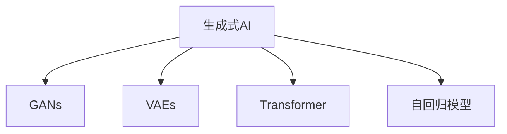

                 

## 1. 背景介绍

### 1.1 问题由来

随着人工智能(AI)技术的飞速发展，生成式AI（Generative AI）技术逐渐引起了各界的广泛关注。生成式AI通过训练生成模型，能够自主地生成高质量的图像、文本、音频等内容，已经在图像生成、文本创作、音乐生成等多个领域展现出巨大的潜力和应用前景。然而，将生成式AI从实验室中的概念验证推广到现实世界的广泛应用，仍面临着一系列的技术挑战。

### 1.2 问题核心关键点

为了更好地解决这些问题，并推动生成式AI技术在各行各业的落地应用，本节将详细介绍生成式AI的核心概念、技术原理及其实际应用，并讨论其在艺术创作、娱乐、教育和医疗等领域的具体应用场景。

## 2. 核心概念与联系

### 2.1 核心概念概述

为更好地理解生成式AI技术及其在实际应用中的表现，本节将介绍几个关键概念：

- **生成式AI（Generative AI）**：通过训练生成模型，能够自主地生成高质量内容的技术，包括文本生成、图像生成、音频生成等多种形式。
- **生成对抗网络（Generative Adversarial Networks, GANs）**：一种深度学习模型，由生成器和判别器两部分组成，通过对两者进行对抗性训练，生成逼真的样本数据。
- **变分自编码器（Variational Autoencoder, VAEs）**：一种生成模型，通过学习数据的潜在分布，生成与训练数据相似的新数据。
- **Transformer**：一种用于处理序列数据的神经网络模型，基于自注意力机制，能够高效地处理和生成序列数据，如自然语言、图像等。
- **自回归模型（Auto-Regressive Models）**：一种从已生成样本逐步预测下一个样本的模型，如循环神经网络（RNN）、变换器（Transformer）等。

### 2.2 核心概念原理和架构的 Mermaid 流程图



这个流程图展示了生成式AI所涉及的核心概念及其相互关系：

1. **GANs**：生成式AI的一个重要组成部分，通过对生成器和判别器的对抗训练，生成逼真的样本数据。
2. **VAEs**：另一种生成模型，通过学习数据的潜在分布，生成与训练数据相似的新数据。
3. **Transformer**：用于高效处理和生成序列数据的关键模型，包括自然语言、图像等。
4. **自回归模型**：从已生成样本逐步预测下一个样本的模型，如RNN、Transformer等。

这些核心概念共同构成了生成式AI的技术框架，推动了其在图像、文本、音频等领域的广泛应用。

## 3. 核心算法原理 & 具体操作步骤

### 3.1 算法原理概述

生成式AI的核心算法原理主要基于生成模型，其目标是学习数据的潜在分布，并从中生成新的、符合分布的数据样本。常见的生成模型包括GANs、VAEs和自回归模型等，它们各自有不同的生成机制和优化策略。

### 3.2 算法步骤详解

以下是生成式AI的核心算法步骤：

1. **数据准备**：收集并处理用于训练生成模型的数据集。
2. **模型选择与构建**：选择合适的生成模型（如GANs、VAEs等），并构建模型架构。
3. **参数初始化**：对模型参数进行初始化，可以使用随机初始化或预训练模型参数。
4. **对抗性训练**：对于GANs，进行生成器和判别器的对抗性训练，以生成高质量的样本数据。
5. **潜在分布学习**：对于VAEs，学习数据的潜在分布，生成新的数据样本。
6. **序列生成**：对于自回归模型，利用已生成的样本逐步预测下一个样本，生成连续的序列数据。
7. **评估与优化**：对生成模型进行评估，使用损失函数等指标衡量生成质量，并根据评估结果优化模型参数。
8. **样本生成**：训练完成后，使用模型生成新的数据样本。

### 3.3 算法优缺点

生成式AI技术具有以下优点：

- **生成多样化**：能够生成多样的、符合不同分布的数据样本，满足不同的应用需求。
- **应用广泛**：已经在图像生成、文本创作、音乐生成等领域展现出强大的应用潜力。
- **自动化**：自动化生成数据，减少了手动标注数据的时间和成本。

同时，该技术也存在以下缺点：

- **模型复杂**：生成模型通常较为复杂，训练和优化成本较高。
- **质量控制**：生成的数据样本质量可能不稳定，需要对其进行评估和筛选。
- **伦理问题**：生成式AI可能生成有害或误导性的内容，需要对其进行监管和管理。

### 3.4 算法应用领域

生成式AI技术已经在多个领域得到了广泛应用，以下是一些典型的应用场景：

- **图像生成**：如生成逼真的人脸、场景等，应用于虚拟现实、影视制作、艺术创作等。
- **文本创作**：如自动生成新闻、故事、诗歌等，应用于内容创作、自动翻译、情感分析等。
- **音乐生成**：如生成新的音乐片段、旋律等，应用于音乐创作、音频生成等。
- **医疗**：如生成医疗影像、病理报告等，应用于疾病诊断、治疗方案设计等。
- **娱乐**：如生成游戏角色、场景等，应用于游戏设计、动画制作等。
- **教育**：如生成教学视频、教材等，应用于个性化教育、智能辅导等。

## 4. 数学模型和公式 & 详细讲解

### 4.1 数学模型构建

在生成式AI中，数学模型构建是非常重要的环节。下面以GANs和VAEs为例，介绍这两种生成模型的数学模型构建。

### 4.2 公式推导过程

#### GANs

GANs由生成器（G）和判别器（D）两部分组成，通过对抗性训练，使得生成器能够生成逼真的样本数据。GANs的训练过程如下：

1. **生成器训练**：生成器G将噪声向量z作为输入，生成样本x。
2. **判别器训练**：判别器D判断样本x是否为真实数据，给出预测概率P(D(x|x) | x)，即x为真实数据的概率。
3. **对抗性训练**：生成器G和判别器D通过对抗性训练，使得生成器生成的样本x能够欺骗判别器，即P(D(x|G(z)) | x) > P(D(x|x) | x)。

### 4.3 案例分析与讲解

假设我们想要生成逼真的人脸图像，可以采用GANs模型。具体实现步骤如下：

1. **数据准备**：收集大量的人脸图像数据集。
2. **模型选择与构建**：选择GANs模型，并构建生成器G和判别器D。
3. **参数初始化**：对模型参数进行随机初始化。
4. **对抗性训练**：在训练过程中，不断优化生成器和判别器的参数，使得生成器能够生成逼真的人脸图像，判别器难以区分生成的图像与真实图像。
5. **评估与优化**：通过评估指标（如Inception Score、FID等）评估生成器生成的图像质量，并根据评估结果优化模型参数。
6. **样本生成**：训练完成后，使用生成器G生成新的人脸图像。

## 5. 项目实践：代码实例和详细解释说明

### 5.1 开发环境搭建

在进行生成式AI项目实践前，需要准备好开发环境。以下是使用Python进行TensorFlow开发的开发环境配置流程：

1. 安装Anaconda：从官网下载并安装Anaconda，用于创建独立的Python环境。
2. 创建并激活虚拟环境：
```bash
conda create -n tf-env python=3.8 
conda activate tf-env
```

3. 安装TensorFlow：根据CUDA版本，从官网获取对应的安装命令。例如：
```bash
conda install tensorflow -c tf -c conda-forge
```

4. 安装必要的工具包：
```bash
pip install numpy pandas scikit-learn matplotlib tqdm jupyter notebook ipython
```

完成上述步骤后，即可在`tf-env`环境中开始生成式AI项目实践。

### 5.2 源代码详细实现

下面我们以GANs模型生成图像为例，给出使用TensorFlow的代码实现。

```python
import tensorflow as tf
from tensorflow.keras import layers

# 定义生成器G
def make_generator_model():
    model = tf.keras.Sequential()
    model.add(layers.Dense(7*7*256, use_bias=False, input_shape=(100,)))
    model.add(layers.BatchNormalization())
    model.add(layers.LeakyReLU())
    model.add(layers.Reshape((7, 7, 256)))
    assert model.output_shape == (None, 7, 7, 256)  # Note: None is the batch dimension

    model.add(layers.Conv2DTranspose(128, (5, 5), strides=(1, 1), padding='same', use_bias=False))
    assert model.output_shape == (None, 7, 7, 128)
    model.add(layers.BatchNormalization())
    model.add(layers.LeakyReLU())

    model.add(layers.Conv2DTranspose(64, (5, 5), strides=(2, 2), padding='same', use_bias=False))
    assert model.output_shape == (None, 14, 14, 64)
    model.add(layers.BatchNormalization())
    model.add(layers.LeakyReLU())

    model.add(layers.Conv2DTranspose(1, (5, 5), strides=(2, 2), padding='same', use_bias=False, activation='tanh'))
    assert model.output_shape == (None, 28, 28, 1)

    return model

# 定义判别器D
def make_discriminator_model():
    model = tf.keras.Sequential()
    model.add(layers.Conv2D(64, (5, 5), strides=(2, 2), padding='same',
                           input_shape=[28, 28, 1]))
    model.add(layers.LeakyReLU())
    model.add(layers.Dropout(0.3))

    model.add(layers.Conv2D(128, (5, 5), strides=(2, 2), padding='same'))
    model.add(layers.LeakyReLU())
    model.add(layers.Dropout(0.3))

    model.add(layers.Flatten())
    model.add(layers.Dense(1))

    return model

# 定义生成器和判别器
generator = make_generator_model()
discriminator = make_discriminator_model()

# 定义损失函数和优化器
cross_entropy = tf.keras.losses.BinaryCrossentropy(from_logits=True)
generator_optimizer = tf.keras.optimizers.Adam(1e-4)
discriminator_optimizer = tf.keras.optimizers.Adam(1e-4)

# 定义训练函数
@tf.function
def train_step(images):
    noise = tf.random.normal([BATCH_SIZE, 100])

    with tf.GradientTape() as gen_tape, tf.GradientTape() as disc_tape:
        generated_images = generator(noise, training=True)

        real_output = discriminator(images, training=True)
        fake_output = discriminator(generated_images, training=True)

        gen_loss = cross_entropy(tf.ones_like(fake_output), fake_output)
        disc_loss = cross_entropy(tf.ones_like(real_output), real_output) + cross_entropy(tf.zeros_like(fake_output), fake_output)

    gradients_of_generator = gen_tape.gradient(gen_loss, generator.trainable_variables)
    gradients_of_discriminator = disc_tape.gradient(disc_loss, discriminator.trainable_variables)

    generator_optimizer.apply_gradients(zip(gradients_of_generator, generator.trainable_variables))
    discriminator_optimizer.apply_gradients(zip(gradients_of_discriminator, discriminator.trainable_variables))

# 定义训练函数
def train(dataset, epochs):
    for epoch in range(epochs):
        for image_batch in dataset:
            train_step(image_batch)
```

以上代码展示了如何使用TensorFlow实现GANs模型生成图像的过程。代码中包含了生成器和判别器的定义、损失函数和优化器的选择、训练函数等关键部分，能够帮助开发者快速上手生成式AI项目实践。

### 5.3 代码解读与分析

让我们再详细解读一下关键代码的实现细节：

**make_generator_model函数**：
- 该函数定义了生成器G的结构，包括全连接层、卷积层、激活函数等。
- 生成器G将噪声向量z作为输入，通过一系列卷积和上采样操作生成图像。

**make_discriminator_model函数**：
- 该函数定义了判别器D的结构，包括卷积层、激活函数、Dropout等。
- 判别器D将图像作为输入，通过一系列卷积和全连接操作，判断图像是否为真实数据。

**train_step函数**：
- 该函数定义了训练过程的具体步骤。
- 在每个训练步骤中，生成器和判别器分别前向传播，计算损失函数，并通过反向传播更新模型参数。

**train函数**：
- 该函数定义了整个训练过程。
- 在每个epoch中，通过遍历数据集，不断进行训练步骤，更新生成器和判别器的参数。

可以看到，TensorFlow提供了强大的计算图功能和自动微分功能，使得生成式AI模型的训练和优化变得简洁高效。开发者可以将更多精力放在模型设计、数据处理等高层逻辑上，而不必过多关注底层的实现细节。

## 6. 实际应用场景

### 6.1 艺术创作

生成式AI在艺术创作领域具有广泛的应用前景。艺术家可以利用生成式AI技术，生成逼真的人脸、场景等图像，进行创意设计。例如，Adobe的DeepArt技术，可以将摄影作品转换为经典名画的风格，极大地提升了创意设计和作品展示的效果。

### 6.2 娱乐

生成式AI在娱乐领域也有着重要的应用。例如，Netflix使用生成式AI技术，自动生成电影的预告片、海报等视觉内容，提高了内容制作的效率和质量。在游戏领域，生成式AI可以生成逼真的游戏角色、场景等，提升游戏的沉浸感和体验效果。

### 6.3 教育和培训

生成式AI在教育领域也有着广泛的应用。例如，Coursera使用生成式AI技术，自动生成个性化的学习内容，适应不同学生的学习进度和需求。Khan Academy使用生成式AI技术，生成智能化的教学视频和教材，提升学生的学习效果。

### 6.4 医疗

生成式AI在医疗领域也有着重要的应用。例如，Google Health使用生成式AI技术，生成高质量的医学影像和病理报告，辅助医生进行疾病诊断和治疗。DeepMind使用生成式AI技术，生成新的药物分子结构，加速新药研发进程。

### 6.5 金融

生成式AI在金融领域也有着广泛的应用。例如，JP Morgan使用生成式AI技术，生成逼真的股票走势图，辅助金融分析师进行市场预测。高盛使用生成式AI技术，生成个性化的金融产品推荐，提高客户满意度和忠诚度。

## 7. 工具和资源推荐

### 7.1 学习资源推荐

为了帮助开发者系统掌握生成式AI的理论基础和实践技巧，这里推荐一些优质的学习资源：

1. **《Deep Learning》**：Ian Goodfellow、Yoshua Bengio、Aaron Courville联合撰写，全面介绍了深度学习的基本概念和前沿技术。
2. **《Generative Adversarial Networks: Training Generative Adversarial Nets》**：Ian Goodfellow、Jean Pouget-Abadie、Ménéo Glorot等联合撰写，系统介绍了GANs的基本原理和训练方法。
3. **《Variational Inference: A Review for Statisticians》**：David W. Blei、Alan E. Ginzburg、Nike Ghahramani、Michael W. Welling等联合撰写，系统介绍了VAEs的基本原理和应用。
4. **《Transformers》**：Hugging Face联合撰写，介绍了Transformer模型及其在NLP任务中的应用。
5. **《Hands-On Machine Learning with Scikit-Learn, Keras, and TensorFlow》**：Aurélien Géron撰写，介绍了机器学习的基本概念和TensorFlow的使用方法。

通过对这些资源的学习实践，相信你一定能够快速掌握生成式AI的精髓，并用于解决实际的生成式AI问题。

### 7.2 开发工具推荐

高效的开发离不开优秀的工具支持。以下是几款用于生成式AI开发的常用工具：

1. **TensorFlow**：由Google主导开发的开源深度学习框架，生产部署方便，适合大规模工程应用。
2. **PyTorch**：基于Python的开源深度学习框架，灵活动态的计算图，适合快速迭代研究。
3. **Keras**：高级神经网络API，可以方便地构建和训练深度学习模型。
4. **Hugging Face Transformers库**：用于NLP任务开发的库，集成了众多预训练模型，提供了丰富的微调样例代码。
5. **Adobe DeepArt**：用于图像风格转换的工具，可以将摄影作品转换为经典名画的风格。

合理利用这些工具，可以显著提升生成式AI的开发效率，加快创新迭代的步伐。

### 7.3 相关论文推荐

生成式AI技术的发展源于学界的持续研究。以下是几篇奠基性的相关论文，推荐阅读：

1. **Image-to-Image Translation with Conditional Adversarial Networks**：Jia Deng等，提出了条件对抗网络，用于图像风格转换和生成。
2. **Accessing Global Optimizers in High Dimension**：Diederik P. Kingma、Max Welling，提出了Adam优化器，极大地提升了深度学习模型的训练效率。
3. **Generative Adversarial Nets**：Ian Goodfellow、Jean Pouget-Abadie、Ménéo Glorot等，提出了GANs的基本原理和训练方法。
4. **Variational Inference and Learning in Neural Networks**：David W. Blei、Alan E. Ginzburg、Nike Ghahramani、Michael W. Welling等，介绍了VAEs的基本原理和应用。
5. **Language Models are Unsupervised Multitask Learners**：Alec Radford、Jeffrey Wu、Roberto C. Moore等，展示了语言模型的强大zero-shot学习能力，引发了对于通用人工智能的新一轮思考。

这些论文代表了大语言模型微调技术的发展脉络。通过学习这些前沿成果，可以帮助研究者把握学科前进方向，激发更多的创新灵感。

## 8. 总结：未来发展趋势与挑战

### 8.1 总结

本文对生成式AI技术及其在实际应用中的表现进行了全面系统的介绍。首先阐述了生成式AI的概念、原理和应用场景，明确了其在艺术创作、娱乐、教育和医疗等领域的重要价值。其次，从原理到实践，详细讲解了生成式AI的数学模型和关键步骤，给出了生成式AI项目开发的完整代码实例。同时，本文还广泛探讨了生成式AI在实际应用中的具体场景，展示了生成式AI技术的巨大潜力。

通过本文的系统梳理，可以看到，生成式AI技术已经在图像生成、文本创作、音乐生成等领域展现出巨大的应用前景，极大地提升了内容创作、娱乐、教育和医疗等多个行业的生产力和效率。未来，伴随生成式AI技术的持续演进，相信其在更多领域的应用将进一步拓展，为人类社会带来更加丰富和多样化的体验。

### 8.2 未来发展趋势

展望未来，生成式AI技术将呈现以下几个发展趋势：

1. **图像生成多样化**：生成式AI将生成更多样化的、符合不同风格和需求的图像内容，满足不同场景和应用的需求。
2. **文本创作自动化**：生成式AI将自动生成更多高质量的文本内容，应用于内容创作、翻译、情感分析等多个领域。
3. **音频生成普及化**：生成式AI将生成更多逼真的音乐、语音等内容，应用于音乐创作、语音合成、自然语言处理等多个领域。
4. **跨领域融合发展**：生成式AI将与其他AI技术进行更深入的融合，如知识表示、因果推理、强化学习等，提升生成内容的智能化水平。
5. **伦理和安全保障**：生成式AI将引入更多的伦理和安全保障机制，避免生成有害或误导性的内容，确保输出符合人类价值观和伦理道德。
6. **实时生成能力**：生成式AI将具备更强的实时生成能力，应用于实时视频生成、实时内容创作等多个场景。

这些趋势凸显了生成式AI技术的广阔前景。这些方向的探索发展，必将进一步提升生成式AI系统的性能和应用范围，为人类认知智能的进化带来深远影响。

### 8.3 面临的挑战

尽管生成式AI技术已经取得了瞩目成就，但在迈向更加智能化、普适化应用的过程中，它仍面临着诸多挑战：

1. **数据质量瓶颈**：生成式AI的训练数据需要高质量、多样化的数据集，然而，高质量数据集的获取和标注成本较高。
2. **模型鲁棒性不足**：生成式AI模型面对域外数据时，泛化性能往往大打折扣，容易出现模式过拟合等问题。
3. **伦理和安全问题**：生成式AI模型可能生成有害或误导性的内容，需要对其进行监管和管理。
4. **计算资源限制**：生成式AI模型的训练和推理需要大量的计算资源，对硬件设备的要求较高。
5. **可解释性和透明性不足**：生成式AI模型的决策过程缺乏可解释性，难以对其生成内容进行解释和调试。

### 8.4 研究展望

面对生成式AI面临的这些挑战，未来的研究需要在以下几个方面寻求新的突破：

1. **数据增强技术**：通过数据增强技术，扩大训练数据集，提高生成式AI模型的泛化性能。
2. **对抗性训练方法**：引入对抗性训练方法，提高生成式AI模型的鲁棒性，避免模式过拟合。
3. **伦理和安全保障**：引入伦理和安全保障机制，避免生成有害或误导性的内容，确保输出符合人类价值观和伦理道德。
4. **模型压缩与优化**：通过模型压缩与优化，减少生成式AI模型的计算资源消耗，提升实时生成能力。
5. **可解释性和透明性提升**：提升生成式AI模型的可解释性和透明性，使其生成内容能够被人类理解和解释。

这些研究方向的探索，必将引领生成式AI技术迈向更高的台阶，为构建更加智能化、普适化的AI系统铺平道路。面向未来，生成式AI技术还需要与其他AI技术进行更深入的融合，如知识表示、因果推理、强化学习等，多路径协同发力，共同推动AI技术的进步。

## 9. 附录：常见问题与解答

**Q1：生成式AI是否适用于所有应用场景？**

A: 生成式AI适用于绝大多数应用场景，但在某些特定领域的应用中可能面临一些挑战。例如，在司法领域，生成式AI生成的报告需要满足严格的法律要求，因此需要对其输出进行严格审核。在医学领域，生成式AI生成的病理报告需要经过医生的审核和确认，以确保其准确性和可靠性。

**Q2：生成式AI生成的内容是否具有版权？**

A: 生成式AI生成的内容通常不具有版权，除非其是基于特定数据集训练的模型，生成的内容包含了原数据集的版权信息。生成式AI技术的目的是通过机器学习生成新的内容，其生成的内容应视为原数据集的衍生品，不属于原始版权的保护范围。

**Q3：生成式AI如何处理生成内容的多样性？**

A: 生成式AI通常使用多样性增强技术，如数据增强、对抗训练等，来提升生成内容的多样性。例如，在图像生成中，可以使用对抗样本生成技术，生成多样化的图像内容。在文本生成中，可以使用不同的训练集、不同的语言模型参数等，来生成多样化的文本内容。

**Q4：生成式AI如何避免模式过拟合？**

A: 生成式AI模型面对域外数据时，容易发生模式过拟合，导致泛化性能下降。避免模式过拟合的方法包括对抗性训练、数据增强、自监督学习等。例如，可以使用生成式对抗网络（GANs）的对抗性训练方法，提升生成模型的鲁棒性。

**Q5：生成式AI在实际应用中需要注意哪些问题？**

A: 在实际应用中，生成式AI需要考虑以下几个问题：
1. 数据质量：生成式AI需要高质量、多样化的数据集进行训练，数据质量对生成结果有重要影响。
2. 计算资源：生成式AI模型的训练和推理需要大量的计算资源，需要考虑硬件设备的限制。
3. 伦理和安全：生成式AI生成的内容可能存在伦理和安全问题，需要进行严格的监管和管理。
4. 可解释性：生成式AI模型的输出缺乏可解释性，需要进行适当的解释和说明。
5. 版权问题：生成式AI生成的内容可能存在版权问题，需要进行合理的版权声明和保护。

综上所述，生成式AI技术具有广阔的应用前景，但在实际应用中需要注意数据质量、计算资源、伦理和安全、可解释性和版权问题。只有在解决这些问题的基础上，才能更好地发挥生成式AI技术的作用，推动AI技术在各个领域的发展和应用。

---

作者：禅与计算机程序设计艺术 / Zen and the Art of Computer Programming

