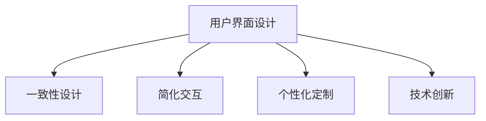

                 

## 1. 背景介绍

### 1.1 问题由来

随着移动互联网和智能设备的普及，用户界面（UI）设计变得越发重要。UI设计不仅仅是展示信息的界面，更是用户与设备交互的关键环节。良好的UI设计不仅能提升用户的使用体验，还能提高产品的市场竞争力。

然而，尽管许多UI设计师和开发者已经掌握了基本的设计原则和技术，但在实际工作中，常常会遇到一些棘手的问题：

1. **可用性不一致**：不同平台或设备上的UI设计风格不统一，用户需要适应不同的界面，降低了使用体验。
2. **交互复杂化**：新功能和复杂业务的引入，导致用户操作流程变得繁琐，增加了学习成本。
3. **个性化需求**：不同用户群体对UI界面的需求各异，设计团队难以兼顾所有用户需求。
4. **技术限制**：现有技术和工具不能满足日益复杂的UI设计需求，限制了创意的实现。

### 1.2 问题核心关键点

为了解决这些问题，本文将聚焦于以下几个核心关键点：

1. **一致性设计**：确保不同平台和设备上的UI设计风格和操作逻辑保持一致，提高用户的使用舒适度。
2. **简化交互**：通过优化用户操作流程，降低复杂度，提升用户的操作效率和满意度。
3. **个性化定制**：提供灵活的UI配置选项，满足不同用户群体的个性化需求。
4. **技术创新**：探索新的技术和工具，为UI设计提供更丰富的实现手段。

### 1.3 问题研究意义

良好的UI设计不仅能提升用户的使用体验，还能减少学习成本，增加用户粘性，进而提高产品的商业价值。通过系统地解决上述问题，可以实现以下目标：

1. **提升用户体验**：通过一致性和简化交互，使用户能更快速、更自然地使用产品。
2. **降低学习成本**：简化用户操作流程，减少用户学习新功能的难度。
3. **满足个性化需求**：通过个性化定制，提供灵活的UI配置选项，满足不同用户群体的需求。
4. **推动技术创新**：探索新的技术和工具，为UI设计提供更丰富的实现手段。

## 2. 核心概念与联系

### 2.1 核心概念概述

为了更好地理解用户界面设计的原理和实现方法，本节将介绍几个密切相关的核心概念：

- **用户界面设计（UI Design）**：指设计人员根据用户需求，对软件或硬件的用户界面进行设计和优化，使之易用、易懂、易操作。
- **一致性设计（Consistent Design）**：通过统一的设计风格和操作逻辑，确保不同平台和设备上的UI设计保持一致，提高用户的使用舒适度。
- **简化交互（Simplified Interaction）**：通过优化用户操作流程，降低复杂度，提升用户的操作效率和满意度。
- **个性化定制（Personalization）**：根据不同用户群体的需求，提供灵活的UI配置选项，满足个性化需求。
- **技术创新（Technology Innovation）**：探索新的技术和工具，为UI设计提供更丰富的实现手段。

这些核心概念之间的逻辑关系可以通过以下Mermaid流程图来展示：



这个流程图展示出用户界面设计的核心概念及其之间的关系：

1. 用户界面设计通过一致性设计、简化交互和个性化定制，提高用户体验和满意度。
2. 技术创新为UI设计提供新的实现手段，推动设计的发展和优化。

## 3. 核心算法原理 & 具体操作步骤

### 3.1 算法原理概述

用户界面设计的算法原理主要包括一致性设计、简化交互、个性化定制和技术创新四个方面。

1. **一致性设计**：通过统一的设计风格和操作逻辑，确保不同平台和设备上的UI设计保持一致，提高用户的使用舒适度。
2. **简化交互**：通过优化用户操作流程，降低复杂度，提升用户的操作效率和满意度。
3. **个性化定制**：根据不同用户群体的需求，提供灵活的UI配置选项，满足个性化需求。
4. **技术创新**：探索新的技术和工具，为UI设计提供更丰富的实现手段。

### 3.2 算法步骤详解

#### 3.2.1 一致性设计

一致性设计的核心在于确保不同平台和设备上的UI设计保持一致，提高用户的使用舒适度。具体步骤如下：

1. **设计风格统一**：确保UI设计中使用的颜色、字体、图标等元素在不同平台和设备上保持一致。可以通过样式表（CSS）和设计规范（Style Guide）来实现。

2. **操作逻辑一致**：确保用户在不同平台和设备上的操作逻辑保持一致。例如，点击、拖拽、滚动等基本操作的动作和反馈应保持一致。

3. **交互元素对齐**：确保不同平台和设备上的交互元素（如按钮、输入框等）对齐，使用户能够更自然地进行操作。

#### 3.2.2 简化交互

简化交互的目标是降低用户操作流程的复杂度，提升用户的操作效率和满意度。具体步骤如下：

1. **减少步骤**：通过优化操作流程，减少用户完成某个任务所需的操作步骤。例如，简化登录流程，通过自动填充和一键登录减少步骤。

2. **隐藏复杂操作**：将复杂的任务隐藏在更高级别界面，避免用户频繁切换。例如，将高级设置选项隐藏在菜单中，不干扰用户的操作。

3. **提供提示和帮助**：在用户操作过程中，及时提供提示和帮助，减少用户的学习成本。例如，在输入框中提供自动补全功能，减少输入错误。

#### 3.2.3 个性化定制

个性化定制的目标是根据不同用户群体的需求，提供灵活的UI配置选项，满足个性化需求。具体步骤如下：

1. **提供配置选项**：通过菜单、设置界面等，提供用户自定义UI配置的选项，例如修改字体大小、主题颜色等。

2. **动态调整**：根据用户的操作习惯和偏好，动态调整UI设计。例如，根据用户的操作频率自动调整快捷键布局。

3. **数据驱动**：通过数据分析，了解用户的行为和偏好，优化UI设计。例如，根据用户的使用频率推荐常用的功能。

#### 3.2.4 技术创新

技术创新的目标是为UI设计提供新的实现手段，推动设计的发展和优化。具体步骤如下：

1. **探索新技术**：关注最新的UI设计技术，例如虚拟现实（VR）、增强现实（AR）、混合现实（MR）等，为UI设计提供新的方向。

2. **优化工具**：优化现有的UI设计工具，例如界面设计工具、原型制作工具等，提高设计的效率和质量。

3. **采用新材料**：探索新的材料和界面技术，例如柔性屏幕、触控技术等，为UI设计提供新的实现手段。

### 3.3 算法优缺点

一致性设计、简化交互、个性化定制和技术创新的算法各有优缺点，具体如下：

1. **一致性设计**：

   - **优点**：提高用户的使用舒适度，减少学习成本。
   - **缺点**：可能导致设计灵活性降低，难以满足特定场景的需求。

2. **简化交互**：

   - **优点**：提升用户的操作效率和满意度，减少学习成本。
   - **缺点**：可能导致部分功能隐藏过深，用户难以找到。

3. **个性化定制**：

   - **优点**：满足不同用户群体的需求，提升用户体验。
   - **缺点**：可能增加开发和维护成本，降低设计的稳定性。

4. **技术创新**：

   - **优点**：为UI设计提供新的实现手段，推动设计的发展和优化。
   - **缺点**：新技术和工具的引入可能带来新的挑战和风险。

### 3.4 算法应用领域

一致性设计、简化交互、个性化定制和技术创新在多个领域都有广泛应用，具体如下：

1. **移动应用**：确保不同操作系统上的UI设计保持一致，提升用户的使用体验。

2. **网页设计**：通过一致性设计和技术创新，提高网页的可访问性和用户体验。

3. **游戏设计**：通过简化交互和个性化定制，提升游戏的可玩性和用户满意度。

4. **智能家居**：通过一致性设计和技术创新，提高智能家居设备的易用性和智能化水平。

5. **医疗应用**：通过简化交互和个性化定制，提升医疗应用的用户体验，满足不同用户的需求。

6. **教育软件**：通过一致性设计和个性化定制，提升教育软件的用户体验和教学效果。

## 4. 数学模型和公式 & 详细讲解  
### 4.1 数学模型构建

用户界面设计的数学模型构建主要涉及一致性设计、简化交互、个性化定制和技术创新四个方面。

1. **一致性设计**：通过统一的设计风格和操作逻辑，确保不同平台和设备上的UI设计保持一致。可以通过使用一致性约束条件来描述。

2. **简化交互**：通过优化用户操作流程，降低复杂度，提升用户的操作效率和满意度。可以通过建立操作流程图和用户路径来描述。

3. **个性化定制**：根据不同用户群体的需求，提供灵活的UI配置选项，满足个性化需求。可以通过建立用户配置文件和偏好设置来描述。

4. **技术创新**：探索新的技术和工具，为UI设计提供更丰富的实现手段。可以通过引入新的算法和技术来描述。

### 4.2 公式推导过程

#### 4.2.1 一致性设计

一致性设计的核心在于确保不同平台和设备上的UI设计保持一致。假设UI设计中有 $N$ 个元素，每个元素有 $M$ 个属性，则一致性设计可以表示为：

$$
\min_{\theta} \sum_{i=1}^{N}\sum_{j=1}^{M} ||\theta_{i,j} - \theta_{i,j}^{\prime}||^2
$$

其中 $\theta_{i,j}$ 和 $\theta_{i,j}^{\prime}$ 分别表示原始设计和新设计中第 $i$ 个元素的第 $j$ 个属性的取值。

#### 4.2.2 简化交互

简化交互的目标是降低用户操作流程的复杂度，提升用户的操作效率和满意度。可以通过计算用户操作路径的平均时间 $T$ 和平均步骤数 $S$ 来评估简化交互的效果。

$$
T = \frac{1}{N} \sum_{i=1}^{N} \sum_{k=1}^{K} t_k
$$

$$
S = \frac{1}{N} \sum_{i=1}^{N} \sum_{k=1}^{K} s_k
$$

其中 $t_k$ 和 $s_k$ 分别表示第 $i$ 个任务中的第 $k$ 个步骤的时间和步骤数。

#### 4.2.3 个性化定制

个性化定制的目标是根据不同用户群体的需求，提供灵活的UI配置选项，满足个性化需求。可以通过建立用户配置文件和偏好设置来描述。

$$
C = \sum_{i=1}^{N} \sum_{j=1}^{M} c_{i,j}
$$

其中 $c_{i,j}$ 表示第 $i$ 个用户对第 $j$ 个UI配置选项的评分。

#### 4.2.4 技术创新

技术创新的目标是为UI设计提供新的实现手段，推动设计的发展和优化。可以通过引入新的算法和技术来描述。

$$
I = \sum_{i=1}^{N} \sum_{j=1}^{M} i_{i,j}
$$

其中 $i_{i,j}$ 表示第 $i$ 个新技术对第 $j$ 个UI设计元素的影响。

### 4.3 案例分析与讲解

#### 4.3.1 一致性设计案例

假设有一个UI设计平台，需要在多个设备和操作系统上保持一致。通过统一的设计风格和操作逻辑，可以确保不同平台和设备上的UI设计保持一致。

1. **设计风格统一**：使用CSS样式表来统一UI设计中使用的颜色、字体、图标等元素。例如：

   ```css
   body {
       background-color: #FFFFFF;
       font-family: "Arial", sans-serif;
       color: #333333;
   }
   ```

2. **操作逻辑一致**：确保用户在不同平台和设备上的操作逻辑保持一致。例如，在移动设备和PC设备上，点击、拖拽、滚动等基本操作的动作和反馈应保持一致。

#### 4.3.2 简化交互案例

假设有一个电商平台，需要优化用户的操作流程，提高用户的购物体验。通过简化交互，可以降低用户操作流程的复杂度，提升用户的操作效率和满意度。

1. **减少步骤**：简化登录流程，通过自动填充和一键登录减少步骤。例如：

   ```javascript
   let user = {
       username: "username",
       password: "password"
   };
   
   // 自动填充用户名和密码
   let filledUser = fillForm(user);
   
   // 一键登录
   let loginResult = login(filledUser);
   ```

2. **隐藏复杂操作**：将复杂的任务隐藏在更高级别界面，避免用户频繁切换。例如，将高级设置选项隐藏在菜单中，不干扰用户的操作。

#### 4.3.3 个性化定制案例

假设有一个在线教育平台，需要根据不同用户群体的需求，提供灵活的UI配置选项，满足个性化需求。通过个性化定制，可以提升用户的体验和满意度。

1. **提供配置选项**：通过设置界面，提供用户自定义UI配置的选项，例如修改字体大小、主题颜色等。

   ```javascript
   let settings = {
       font_size: 14,
       theme: "dark"
   };
   
   // 修改字体大小
   let newFont = settings["font_size"] + 2;
   
   // 修改主题颜色
   let newTheme = settings["theme"] == "dark" ? "light" : "dark";
   ```

2. **动态调整**：根据用户的操作习惯和偏好，动态调整UI设计。例如，根据用户的操作频率自动调整快捷键布局。

## 5. 项目实践：代码实例和详细解释说明

### 5.1 开发环境搭建

在进行UI设计实践前，我们需要准备好开发环境。以下是使用Python进行React开发的环境配置流程：

1. 安装Node.js和npm：从官网下载并安装Node.js和npm，用于创建和管理项目依赖。

2. 创建并激活虚拟环境：
```bash
conda create -n react-env python=3.8 
conda activate react-env
```

3. 安装React：使用npm安装React和相关工具。例如：
```bash
npm install react react-dom
```

4. 安装React Router等常用工具包：
```bash
npm install react-router-dom
```

5. 安装React Native：若需要开发移动端应用，还需要安装React Native和相关工具。例如：

```bash
npm install -g react-native-cli
```

完成上述步骤后，即可在`react-env`环境中开始UI设计实践。

### 5.2 源代码详细实现

下面以React开发的登录界面为例，给出完整的UI设计代码实现。

```javascript
import React, { useState } from 'react';
import { BrowserRouter as Router, Route, Link } from 'react-router-dom';

function App() {
    const [username, setUsername] = useState('');
    const [password, setPassword] = useState('');

    function handleLogin() {
        // 模拟登录逻辑
    }

    return (
        <Router>
            <div>
                <nav>
                    <ul>
                        <li><Link to="/">Home</Link></li>
                        <li><Link to="/login">Login</Link></li>
                    </ul>
                </nav>

                <Route path="/" exact component={Home} />
                <Route path="/login" component={Login} />
            </div>
        </Router>
    );
}

function Home() {
    return (
        <div>
            <h1>Home</h1>
        </div>
    );
}

function Login() {
    return (
        <div>
            <h1>Login</h1>
            <form>
                <label>
                    Username:
                    <input type="text" value={username} onChange={(e) => setUsername(e.target.value)} />
                </label>
                <br />
                <label>
                    Password:
                    <input type="password" value={password} onChange={(e) => setPassword(e.target.value)} />
                </label>
                <br />
                <button onClick={handleLogin}>Login</button>
            </form>
        </div>
    );
}

export default App;
```

### 5.3 代码解读与分析

让我们再详细解读一下关键代码的实现细节：

**App组件**：
- 定义两个状态变量 `username` 和 `password`，用于存储用户输入的登录信息。
- 定义 `handleLogin` 函数，用于模拟登录逻辑。
- 通过 `BrowserRouter` 和 `Route` 组件，实现导航和路由功能。

**Home组件**：
- 显示主页内容，包含一个标题。

**Login组件**：
- 显示登录页面内容，包含用户名输入框、密码输入框和登录按钮。

**handleLogin函数**：
- 模拟登录逻辑，可以通过实际的后端服务进行替换。

以上代码实现了基本的登录功能，并通过路由实现导航。可以看到，React的路由组件和状态管理机制为UI设计提供了强大的支持，使得实现复杂的功能变得简单。

## 6. 实际应用场景

### 6.1 智能家居

基于用户界面设计的智能家居系统，可以极大地提升用户的使用体验。通过一致性设计和简化交互，使用户能够更自然地与智能家居设备进行互动。

1. **一致性设计**：确保不同设备和操作系统的UI设计保持一致，例如电视、音响、空调等设备的界面风格和操作逻辑一致。

2. **简化交互**：通过优化用户操作流程，降低复杂度，提升用户的操作效率和满意度。例如，通过语音助手快速控制家电，减少用户的操作时间。

3. **个性化定制**：根据不同用户群体的需求，提供灵活的UI配置选项，例如调整温度、亮度、音量等。

### 6.2 医疗应用

医疗应用的UI设计需要考虑患者的隐私和安全，同时提供清晰的操作界面，帮助医生进行诊断和治疗。

1. **一致性设计**：确保不同设备和操作系统的UI设计保持一致，例如医生工作站和患者查看结果的界面风格和操作逻辑一致。

2. **简化交互**：通过优化用户操作流程，降低复杂度，提升用户的操作效率和满意度。例如，简化患者挂号流程，减少用户等待时间。

3. **个性化定制**：根据不同用户群体的需求，提供灵活的UI配置选项，例如调整字号、颜色等，满足不同用户的需求。

### 6.3 在线教育

在线教育平台的UI设计需要考虑学生的学习体验，同时提供清晰的教学界面，帮助教师进行授课和学生进行学习。

1. **一致性设计**：确保不同设备和操作系统的UI设计保持一致，例如学生端和教师端的界面风格和操作逻辑一致。

2. **简化交互**：通过优化用户操作流程，降低复杂度，提升用户的操作效率和满意度。例如，简化课程选择流程，减少学生的操作步骤。

3. **个性化定制**：根据不同用户群体的需求，提供灵活的UI配置选项，例如调整字体大小、主题颜色等，满足不同用户的需求。

### 6.4 未来应用展望

随着用户界面设计的不断发展，未来在多个领域将有更多的应用场景：

1. **虚拟现实（VR）**：通过虚拟现实技术，提供沉浸式的用户体验，增强用户的互动性和沉浸感。

2. **增强现实（AR）**：通过增强现实技术，将虚拟信息与现实世界相结合，提供更加丰富的交互方式。

3. **混合现实（MR）**：通过混合现实技术，将虚拟信息与现实世界无缝融合，提供更加自然和真实的交互体验。

4. **人工智能（AI）**：通过人工智能技术，提供智能化的交互方式，例如自然语言处理、语音识别等。

5. **物联网（IoT）**：通过物联网技术，将用户界面设计扩展到更多设备上，实现跨设备的用户体验。

## 7. 工具和资源推荐

### 7.1 学习资源推荐

为了帮助开发者系统掌握用户界面设计的理论基础和实践技巧，这里推荐一些优质的学习资源：

1. **《设计模式》（原书第2版）**：一本经典的设计模式书籍，涵盖设计模式的基本概念、应用场景和实践方法。

2. **《React官方文档》**：React官方文档，提供详细的React API文档和教程，是学习和使用React的必备资源。

3. **《Material Design》**：Material Design官方文档，提供Material Design的设计规范和组件库，为UI设计提供丰富的参考。

4. **《Design Patterns》**：一本经典的设计模式书籍，涵盖设计模式的基本概念、应用场景和实践方法。

5. **《User Experience for the Web》**：一本关于Web用户体验设计的书籍，提供实用的设计技巧和方法。

### 7.2 开发工具推荐

高效的开发离不开优秀的工具支持。以下是几款用于UI设计开发的常用工具：

1. **React**：一个开源的JavaScript库，用于构建用户界面，提供了强大的组件化设计和状态管理机制。

2. **React Router**：一个开源的路由库，用于实现客户端路由功能，使得UI设计更加灵活。

3. **Material-UI**：一个开源的UI组件库，提供丰富的Material Design风格的UI组件，简化UI设计过程。

4. **Sketch**：一个流行的UI设计工具，提供直观的设计界面和丰富的设计元素，是UI设计师的必备工具。

5. **Figma**：一个在线的UI设计工具，提供实时协作和设计预览功能，方便团队协作。

6. **Adobe XD**：一个专业的UI设计工具，提供强大的原型设计和交互设计功能，是UI设计师的重要工具。

### 7.3 相关论文推荐

用户界面设计的相关论文涵盖了设计原理、实现方法和应用场景等多个方面，以下是几篇经典的论文：

1. **《一致性设计：统一界面设计的重要因素》**：讨论一致性设计的重要性和实现方法，提供具体的案例分析。

2. **《简化交互：提升用户体验的关键》**：讨论简化交互的实现方法，提供具体的案例分析。

3. **《个性化定制：满足不同用户需求的关键》**：讨论个性化定制的实现方法，提供具体的案例分析。

4. **《技术创新：推动UI设计发展的新方向》**：讨论技术创新的实现方法，提供具体的案例分析。

5. **《用户界面设计的新趋势：虚拟现实、增强现实和混合现实》**：讨论虚拟现实、增强现实和混合现实在UI设计中的应用，提供具体的案例分析。

## 8. 总结：未来发展趋势与挑战

### 8.1 总结

本文对用户界面设计的核心概念和实现方法进行了全面系统的介绍。首先阐述了用户界面设计的重要性，明确了一致性设计、简化交互、个性化定制和技术创新在UI设计中的关键作用。其次，从原理到实践，详细讲解了UI设计的数学模型和实现步骤，给出了UI设计代码实现的完整示例。同时，本文还广泛探讨了UI设计在多个领域的应用前景，展示了UI设计技术的广泛应用。

通过本文的系统梳理，可以看到，用户界面设计不仅能提升用户的使用体验，还能降低学习成本，提高产品的商业价值。未来，随着用户界面设计的不断发展，将会有更多的应用场景和技术创新。

### 8.2 未来发展趋势

展望未来，用户界面设计的技术将呈现以下几个发展趋势：

1. **智能交互**：通过引入人工智能和机器学习技术，提供更加智能和个性化的交互方式，例如自然语言处理、语音识别等。

2. **多模态设计**：通过引入多模态设计，提供更加丰富和自然的交互方式，例如语音、手势、触觉等。

3. **沉浸式设计**：通过引入虚拟现实、增强现实和混合现实技术，提供更加沉浸式的用户体验，例如虚拟现实应用和游戏。

4. **自适应设计**：通过引入自适应设计，提供更加灵活和高效的UI设计，例如响应式设计和动态布局。

5. **跨平台设计**：通过引入跨平台设计，提供更加一致和统一的UI设计，例如Web和移动端的跨平台设计。

6. **开源设计**：通过引入开源设计，提供更加透明和可扩展的UI设计，例如React和Vue等开源框架。

以上趋势凸显了用户界面设计技术的广阔前景。这些方向的探索发展，必将进一步提升UI设计的效率和质量，为构建智能交互系统提供新的技术支持。

### 8.3 面临的挑战

尽管用户界面设计技术已经取得了显著进展，但在迈向更加智能化、普适化应用的过程中，仍然面临诸多挑战：

1. **学习曲线陡峭**：新的技术和工具往往需要一定的学习曲线，对于不熟悉这些工具的设计师和开发者来说，可能会增加学习成本。

2. **设计复杂度增加**：随着新技术和工具的引入，UI设计的复杂度也随之增加，设计师和开发者需要更高的技术水平来应对这些挑战。

3. **跨平台兼容性**：不同平台和设备的UI设计需要保持一致，但不同平台和设备的技术实现方式可能不同，需要进行大量的适配工作。

4. **用户需求多样化**：不同用户群体对UI设计的需求各异，设计师和开发者需要兼顾多种需求，并进行灵活的设计。

5. **设计和开发分离**：在设计阶段和开发阶段之间可能存在一定的鸿沟，设计师和开发者需要进行紧密的协作，以确保设计意图得以实现。

6. **设计工具和语言限制**：不同工具和语言的设计能力和表现效果可能不同，需要选择合适的工具和语言来实现设计目标。

这些挑战需要设计师和开发者在实践中不断探索和优化，以克服这些难题，实现更加优秀和高效的用户界面设计。

### 8.4 研究展望

未来，用户界面设计的技术将不断创新和进步，研究者需要在以下几个方面进行更多的探索：

1. **智能设计工具**：开发更加智能的设计工具，例如基于AI的设计助手和推荐系统，辅助设计师进行创意和设计。

2. **自适应设计系统**：开发自适应设计系统，根据用户行为和环境变化自动调整UI设计，提供更加动态和适应用户需求的设计。

3. **跨平台设计框架**：开发跨平台设计框架，提供一致和灵活的UI设计，例如React Native和Flutter等。

4. **用户体验研究**：深入研究用户体验的关键因素，提供更加科学和高效的设计方法，例如可用性测试和用户反馈分析。

5. **交互设计创新**：探索新的交互设计方法和技术，例如手势识别、眼动追踪等，提升用户的操作效率和满意度。

6. **跨学科研究**：将用户界面设计与心理学、社会学等学科结合，提供更加全面和深入的设计理论和方法。

这些研究方向将推动用户界面设计技术的不断进步，为构建智能交互系统提供新的技术支持和理论指导。

## 9. 附录：常见问题与解答

**Q1：如何进行一致性设计？**

A: 一致性设计的核心在于确保不同平台和设备上的UI设计保持一致。可以通过使用样式表（CSS）和设计规范（Style Guide）来实现。例如，在React中，使用CSS样式表来统一UI设计中使用的颜色、字体、图标等元素。

**Q2：如何简化交互？**

A: 简化交互的目标是降低用户操作流程的复杂度，提升用户的操作效率和满意度。可以通过优化用户操作流程、隐藏复杂操作和提供提示和帮助来实现。例如，在React中，通过React Router和状态管理机制来实现导航和路由功能。

**Q3：如何进行个性化定制？**

A: 个性化定制的目标是根据不同用户群体的需求，提供灵活的UI配置选项，满足个性化需求。可以通过提供配置选项、动态调整和数据分析来实现。例如，在React中，通过状态管理和用户配置文件来实现个性化定制。

**Q4：如何进行技术创新？**

A: 技术创新的目标是为UI设计提供新的实现手段，推动设计的发展和优化。可以通过探索新技术、优化工具和采用新材料来实现。例如，在React中，通过引入React Native和混合现实技术来实现技术创新。

**Q5：如何进行用户界面设计的测试和优化？**

A: 用户界面设计的测试和优化是一个持续的过程。可以通过可用性测试、用户反馈分析和A/B测试等方法，不断优化UI设计。例如，在React中，可以使用React Testing Library和Jest等工具来进行测试和优化。

**Q6：如何进行用户界面设计的文档和设计规范？**

A: 用户界面设计的文档和设计规范是设计团队的重要基础。可以通过设计规范、用户手册和技术文档等方式，进行文档和规范的制定和维护。例如，在React中，可以使用React Documentation和Design System等资源，进行文档和规范的制定和维护。

---

作者：禅与计算机程序设计艺术 / Zen and the Art of Computer Programming

