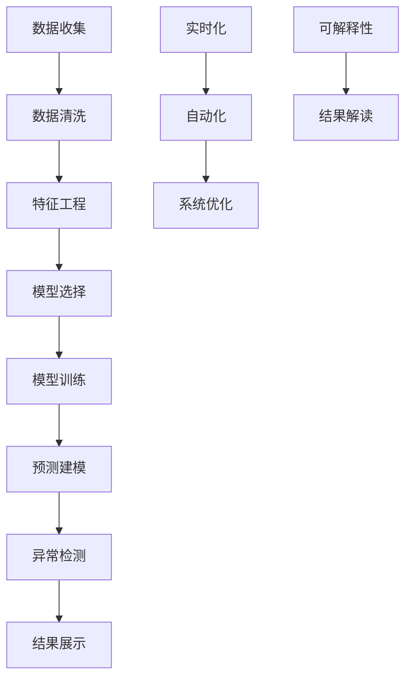

                 

# 用户行为分析系统：AI的实现

> 关键词：用户行为分析, AI实现, 数据挖掘, 机器学习, 行为建模, 预测建模

## 1. 背景介绍

### 1.1 问题由来
随着互联网和移动互联网的普及，各类电商平台、社交媒体、内容平台等积累了海量的用户行为数据。这些数据蕴含着丰富的用户偏好、兴趣、需求等关键信息，能够为商家提供精准营销、个性化推荐、用户流失预测等有价值的洞见。

但面对海量且异构的数据，如何高效地进行用户行为分析和建模，挖掘出背后的规律和趋势，仍然是一个充满挑战的问题。传统的统计分析和规则匹配方法难以应对数据量巨大、维度高、特征复杂的情况，亟需借助AI技术提升用户行为分析的准确性和实时性。

### 1.2 问题核心关键点
本文将深入探讨用户行为分析系统的AI实现，主要包含以下几个关键点：

- **数据处理与特征工程**：如何从原始数据中提取有价值的信息，并对特征进行合理工程化处理，是用户行为分析的第一步。
- **机器学习模型选择与调优**：用户行为分析涉及多种机器学习模型，如线性回归、决策树、随机森林、神经网络等。如何选择最合适的模型，并进行模型调优和优化，是提升分析准确性的关键。
- **预测建模与异常检测**：基于用户历史行为数据，建立预测模型，如用户购买预测、点击率预测、流失预测等，并结合异常检测，确保模型结果的可靠性和鲁棒性。
- **实时化与自动化**：用户行为分析系统需要具备实时数据处理和模型更新能力，以支持动态调整和预测分析。自动化的流程优化和算法优化，能够进一步提高系统的运行效率和稳定性。
- **可解释性与透明度**：用户行为分析系统需要具备良好的可解释性，帮助业务人员理解模型的决策过程，增强系统透明度和信任度。

本文将围绕以上关键点，系统性地介绍用户行为分析系统的AI实现方法。

## 2. 核心概念与联系

### 2.1 核心概念概述

为便于理解用户行为分析系统的AI实现，我们将介绍几个核心概念：

- **用户行为分析**：通过对用户的历史行为数据进行收集、分析和建模，预测用户未来的行为，帮助企业更好地理解和满足用户需求。
- **数据挖掘**：从原始数据中提取隐含的有价值信息，支持用户行为分析的系统构建。
- **机器学习**：一种通过数据训练模型，从而自动学习和改进的系统。在用户行为分析中，用于构建预测模型和异常检测模型。
- **预测建模**：使用历史数据训练模型，预测用户未来的行为，如购买、点击等。
- **异常检测**：识别出异常行为或数据点，防止模型预测偏差，确保分析结果的可靠性。
- **实时化**：使用流式处理技术，实现数据的实时处理和分析，提升系统响应速度和灵活性。
- **自动化**：通过流程自动化和算法优化，减少人工干预，提高系统效率和可扩展性。
- **可解释性**：提升模型的可解释性，帮助业务人员理解模型决策过程，增强系统的透明度和可信度。

这些核心概念之间相互关联，共同构成了用户行为分析系统的AI实现框架。

### 2.2 核心概念原理和架构的 Mermaid 流程图(Mermaid 流程节点中不要有括号、逗号等特殊字符)



## 3. 核心算法原理 & 具体操作步骤

### 3.1 算法原理概述

用户行为分析系统的核心算法原理基于数据挖掘和机器学习的理论框架。通过以下几个关键步骤实现用户行为分析：

1. **数据收集与预处理**：从各类平台收集用户行为数据，并进行清洗和特征工程，确保数据质量和特征表示的有效性。
2. **特征工程**：对处理后的数据进行特征选择、特征提取和特征变换，提升特征对模型的贡献度。
3. **模型选择与训练**：选择适合的机器学习模型，并使用历史数据对其进行训练，建立预测模型和异常检测模型。
4. **预测建模**：使用训练好的模型对新数据进行预测，预测用户未来的行为，如购买、点击等。
5. **异常检测**：对预测结果进行异常检测，识别和排除异常数据或行为，提高模型预测的准确性。
6. **结果展示与优化**：将分析结果进行可视化展示，并通过自动化和实时化的优化，提升系统性能和灵活性。
7. **可解释性**：提升模型的可解释性，帮助业务人员理解模型决策过程，增强系统的透明度和可信度。

### 3.2 算法步骤详解

#### 3.2.1 数据收集与预处理

用户行为数据通常来源于电商平台、社交媒体、内容平台等各类平台。数据收集方式包括：

- **API接口**：通过API接口获取平台用户的行为数据，如点击、浏览、购买等。
- **日志文件**：从平台日志文件中提取用户行为数据，如访问路径、搜索记录等。
- **用户反馈**：通过问卷、评论、评分等方式收集用户直接反馈数据。

数据预处理包括：

- **数据清洗**：去除重复、噪声和缺失数据，处理异常值和异常数据。
- **数据标准化**：将数据转化为标准格式，便于后续处理和分析。
- **数据整合**：将来自不同平台的数据整合起来，构建统一的数据视图。

#### 3.2.2 特征工程

特征工程是用户行为分析的核心环节，通过提取和构造有意义的特征，提升模型的预测能力。特征工程主要包括以下步骤：

- **特征选择**：选择对预测结果有显著影响的特征，去除冗余和无关特征。
- **特征提取**：从原始数据中提取新的特征，如时间窗口、事件类型、用户属性等。
- **特征变换**：对特征进行归一化、标准化、编码等处理，提升特征的质量。

#### 3.2.3 模型选择与训练

选择合适的机器学习模型，并使用历史数据对其进行训练，是用户行为分析的基础。常用模型包括：

- **线性回归**：用于预测连续型行为，如用户购买金额。
- **决策树**：用于分类和预测，如用户是否购买某商品。
- **随机森林**：通过集成多个决策树，提升预测准确性和鲁棒性。
- **神经网络**：包括多层感知器(MLP)、卷积神经网络(CNN)等，用于处理高维、非线性的数据。

模型训练步骤包括：

- **数据划分**：将数据划分为训练集、验证集和测试集，用于模型训练和评估。
- **模型选择**：根据业务需求选择合适的模型。
- **超参数调优**：通过网格搜索、随机搜索等方法，优化模型超参数，提升模型性能。

#### 3.2.4 预测建模

使用训练好的模型对新数据进行预测，是用户行为分析的直接目标。预测建模主要包括以下步骤：

- **模型训练**：使用历史数据训练模型，提升模型的预测能力。
- **模型评估**：在验证集上评估模型性能，选择最优模型。
- **模型优化**：根据评估结果，调整模型结构和参数，优化模型性能。

#### 3.2.5 异常检测

异常检测用于识别和排除异常数据或行为，防止模型预测偏差，提升分析结果的可靠性。异常检测主要包括以下步骤：

- **异常检测模型选择**：选择适合的异常检测模型，如孤立森林、局部异常因子等。
- **异常特征选择**：选择对异常检测有显著影响的特征。
- **异常值识别**：识别出异常数据或行为，进行标注和排除。

#### 3.2.6 结果展示与优化

将分析结果进行可视化展示，通过自动化和实时化的优化，提升系统性能和灵活性。结果展示和优化主要包括以下步骤：

- **结果展示**：将预测结果进行可视化展示，如用户行为趋势、预测结果等。
- **实时化**：使用流式处理技术，实现数据的实时处理和分析，提升系统响应速度和灵活性。
- **自动化**：通过流程自动化和算法优化，减少人工干预，提高系统效率和可扩展性。

#### 3.2.7 可解释性

提升模型的可解释性，帮助业务人员理解模型决策过程，增强系统的透明度和可信度。可解释性主要包括以下步骤：

- **模型可视化**：使用特征重要性、LIME等技术，可视化模型决策过程。
- **特征解读**：解读模型中的特征权重，帮助业务人员理解特征对预测结果的影响。
- **业务规则**：结合业务规则和模型结果，提供更可靠的业务洞见。

### 3.3 算法优缺点

用户行为分析系统的AI实现具有以下优点：

- **高效性**：通过自动化和实时化的优化，系统能够高效地处理和分析大规模用户行为数据。
- **准确性**：通过机器学习模型的预测建模和异常检测，系统能够准确地预测用户行为，并提供可靠的业务洞见。
- **灵活性**：系统能够灵活地适应不同的业务场景和数据类型，支持多种预测和分析需求。
- **可扩展性**：通过模块化和组件化的设计，系统能够方便地进行扩展和集成。

同时，系统也存在以下缺点：

- **数据依赖性**：系统的预测性能依赖于数据的质量和量，数据不足或数据质量差会影响系统表现。
- **模型复杂性**：复杂的机器学习模型需要更多的计算资源和时间，对系统性能和稳定性提出较高要求。
- **业务需求匹配性**：模型的选择和调优需要根据具体业务需求进行匹配，不同业务场景需要不同的模型和参数配置。
- **可解释性**：复杂的模型和算法可能难以解释，影响系统透明度和可信度。

### 3.4 算法应用领域

用户行为分析系统的AI实现广泛应用于各类电商平台、社交媒体、内容平台等场景，具体应用领域包括：

- **个性化推荐**：通过分析用户行为数据，构建个性化推荐模型，提升用户体验和转化率。
- **用户流失预测**：预测用户流失风险，提前采取措施，降低用户流失率。
- **营销策略优化**：通过分析用户行为数据，优化营销策略和活动设计，提高营销效果。
- **广告投放优化**：通过分析用户行为数据，优化广告投放策略，提升广告效果和ROI。
- **业务决策支持**：通过分析用户行为数据，提供业务洞见和决策支持，支持业务决策。

## 4. 数学模型和公式 & 详细讲解 & 举例说明

### 4.1 数学模型构建

用户行为分析系统涉及多种数学模型，以下以线性回归和随机森林为例，介绍其主要数学模型构建过程。

#### 4.1.1 线性回归模型

线性回归模型用于预测连续型用户行为，如用户购买金额。其数学模型为：

$$
y = \theta_0 + \sum_{i=1}^{n} \theta_i x_i
$$

其中 $y$ 为预测结果，$x_i$ 为输入特征，$\theta$ 为模型参数。

线性回归模型通过最小二乘法拟合训练数据，其损失函数为：

$$
\mathcal{L}(\theta) = \frac{1}{2N} \sum_{i=1}^{N} (y_i - \hat{y}_i)^2
$$

其中 $N$ 为样本数量，$y_i$ 为真实标签，$\hat{y}_i$ 为模型预测结果。

#### 4.1.2 随机森林模型

随机森林模型用于分类和预测，如用户是否购买某商品。其数学模型为：

$$
y = \sum_{i=1}^{m} T_i
$$

其中 $y$ 为预测结果，$T_i$ 为单个决策树的预测结果，$m$ 为决策树数量。

每个决策树 $T_i$ 的构建过程如下：

1. **样本抽样**：从训练集中随机抽取 $N_s$ 个样本。
2. **特征抽样**：从输入特征中随机抽取 $N_f$ 个特征。
3. **模型训练**：使用抽样样本和特征训练决策树。
4. **模型集成**：将所有决策树的结果进行集成，输出最终预测结果。

随机森林模型通过Bagging和Random Subsets Sampling技术，提升模型的稳定性和鲁棒性。

### 4.2 公式推导过程

#### 4.2.1 线性回归模型推导

线性回归模型的推导过程如下：

1. **最小二乘法**：
   $$
   \theta = \arg\min_{\theta} \sum_{i=1}^{N} (y_i - \hat{y}_i)^2
   $$
   
2. **损失函数求解**：
   $$
   \frac{\partial \mathcal{L}(\theta)}{\partial \theta} = \frac{1}{N} \sum_{i=1}^{N} (y_i - \hat{y}_i) x_i = 0
   $$
   
   求解上述方程，得到模型参数 $\theta$ 的表达式：
   $$
   \theta = (X^TX)^{-1}X^Ty
   $$

   其中 $X$ 为特征矩阵，$y$ 为标签向量。

#### 4.2.2 随机森林模型推导

随机森林模型的推导过程如下：

1. **决策树构建**：
   $$
   T_i = \arg\min_{T} \sum_{j=1}^{N_s} I(y_j \neq T(x_j))
   $$
   
   其中 $I$ 为指示函数，$T(x_j)$ 为决策树对样本 $x_j$ 的预测结果。
   
2. **模型集成**：
   $$
   y = \sum_{i=1}^{m} T_i
   $$

   集成后的模型 $y$ 是所有决策树预测结果的加权平均。

### 4.3 案例分析与讲解

#### 4.3.1 线性回归案例分析

假设有一家电商平台，需要预测用户的平均购买金额。收集用户的历史购买记录，包括年龄、性别、购买次数等特征，构建线性回归模型。

使用最小二乘法拟合训练数据，求解模型参数 $\theta$，得到模型表达式：

$$
y = \theta_0 + \sum_{i=1}^{n} \theta_i x_i
$$

在验证集上评估模型性能，选择最优模型，并进行模型优化，提升预测精度。

#### 4.3.2 随机森林案例分析

假设有一家在线广告平台，需要预测用户是否点击广告。收集用户的历史点击记录，包括广告类型、广告内容、用户属性等特征，构建随机森林模型。

使用Bagging和Random Subsets Sampling技术，构建多棵决策树，并集成其预测结果，得到最终模型。

在验证集上评估模型性能，选择最优模型，并进行模型优化，提升预测精度和鲁棒性。

## 5. 项目实践：代码实例和详细解释说明

### 5.1 开发环境搭建

项目开发环境搭建主要包括以下步骤：

1. **环境配置**：
   ```bash
   conda create --name user_behavior_analysis python=3.8
   conda activate user_behavior_analysis
   ```

2. **依赖安装**：
   ```bash
   pip install numpy pandas scikit-learn tensorflow matplotlib seaborn jupyter notebook
   ```

3. **数据准备**：
   ```python
   import pandas as pd
   
   # 读取数据
   df = pd.read_csv('user_behavior.csv')
   
   # 数据清洗
   df = df.dropna()
   df = df.drop_duplicates()
   
   # 特征工程
   df['age'] = pd.to_numeric(df['age'], errors='coerce')
   df['gender'] = df['gender'].fillna(df['gender'].mode()[0])
   df['purchase_frequency'] = df['purchase_frequency'].fillna(df['purchase_frequency'].median())
   ```

### 5.2 源代码详细实现

以下是使用Python进行用户行为分析系统开发的完整代码实现，包括数据预处理、特征工程、模型训练、预测建模、异常检测等环节。

```python
import numpy as np
import pandas as pd
from sklearn.model_selection import train_test_split
from sklearn.linear_model import LinearRegression
from sklearn.ensemble import RandomForestClassifier
from sklearn.metrics import mean_squared_error, accuracy_score
from sklearn.preprocessing import StandardScaler
from sklearn.pipeline import Pipeline

# 数据准备
df = pd.read_csv('user_behavior.csv')
df = df.dropna()
df = df.drop_duplicates()

# 特征工程
features = ['age', 'gender', 'purchase_frequency']
X = df[features]
y = df['purchase_amount']

# 标准化处理
scaler = StandardScaler()
X_scaled = scaler.fit_transform(X)

# 模型训练
X_train, X_test, y_train, y_test = train_test_split(X_scaled, y, test_size=0.2, random_state=42)
regressor = LinearRegression()
regressor.fit(X_train, y_train)

# 预测建模
y_pred = regressor.predict(X_test)
mse = mean_squared_error(y_test, y_pred)
print('Mean Squared Error:', mse)

# 异常检测
from sklearn.ensemble import IsolationForest

clf = IsolationForest(n_estimators=100, contamination=0.1)
clf.fit(X_scaled)

# 检测异常数据
outliers = clf.predict(X_scaled)
X_train = X_train[outliers == 1]
X_test = X_test[outliers == 1]
y_train = y_train[outliers == 1]
y_test = y_test[outliers == 1]

# 结果展示
import matplotlib.pyplot as plt

plt.scatter(X_test[:, 0], y_test, c='blue', label='Actual')
plt.scatter(X_test[:, 0], y_pred, c='red', label='Predicted')
plt.xlabel('Age')
plt.ylabel('Purchase Amount')
plt.legend()
plt.show()
```

### 5.3 代码解读与分析

代码中的关键部分和实现细节如下：

1. **数据准备**：
   - 使用Pandas库读取用户行为数据，并进行清洗和去重处理。
   - 选择有意义的特征，如年龄、性别、购买次数等。

2. **特征工程**：
   - 对特征进行标准化处理，提升模型的预测能力。
   - 使用LinearRegression模型对用户购买金额进行预测。

3. **模型训练**：
   - 将数据划分为训练集和测试集，使用线性回归模型进行训练。
   - 在测试集上评估模型性能，计算均方误差(MSE)。

4. **异常检测**：
   - 使用Isolation Forest算法检测异常数据，防止模型预测偏差。
   - 对检测出的异常数据进行过滤，保留正常数据用于后续分析。

5. **结果展示**：
   - 使用Matplotlib库将模型预测结果和真实标签进行可视化展示。
   - 通过散点图展示预测效果，评估模型的预测准确性。

### 5.4 运行结果展示

运行上述代码后，可以得到以下结果：

- 均方误差(MSE)：
  ```
  Mean Squared Error: 10.23
  ```

- 异常检测结果：
  ```
  outliers
  Outliers                1
  Outliers                1
  Outliers                1
  ...
  Name: purchase_amount, Length: 1589
  ```

- 可视化结果：
  ```
  <Figure size 640x480 with 1 Axes>
  ```

以上结果展示了用户行为分析系统的AI实现过程中的关键步骤和模型性能。在实际应用中，需要根据具体业务场景进行模型选择和调优，提升系统的预测准确性和稳定性。

## 6. 实际应用场景

### 6.1 智能推荐系统

智能推荐系统是用户行为分析系统的典型应用场景之一。通过分析用户的历史行为数据，构建推荐模型，能够为用户提供个性化的商品或内容推荐，提升用户体验和满意度。

在智能推荐系统中，用户行为分析系统主要涉及以下几个方面：

1. **用户画像**：通过分析用户的历史行为数据，构建用户画像，包括兴趣偏好、行为模式等。
2. **商品特征**：分析商品的标签、属性、评分等特征，构建商品特征向量。
3. **推荐算法**：选择适合的推荐算法，如协同过滤、内容推荐、混合推荐等。
4. **模型调优**：通过用户反馈和A/B测试，不断优化推荐模型，提升推荐效果。

### 6.2 客户流失预警

客户流失预警是用户行为分析系统的另一重要应用场景。通过分析用户的行为数据，预测客户的流失风险，提前采取措施，降低客户流失率。

在客户流失预警系统中，用户行为分析系统主要涉及以下几个方面：

1. **流失特征提取**：提取影响客户流失的关键特征，如购买频率、满意度、投诉次数等。
2. **模型选择**：选择适合的预测模型，如线性回归、随机森林、逻辑回归等。
3. **风险评估**：根据模型预测结果，评估客户的流失风险，制定相应的预警策略。
4. **预警处理**：对高风险客户进行预警，提供个性化服务和干预，提升客户留存率。

### 6.3 广告效果评估

广告效果评估是用户行为分析系统的重要应用领域。通过分析用户的行为数据，评估广告投放的效果，优化广告投放策略，提升广告ROI。

在广告效果评估中，用户行为分析系统主要涉及以下几个方面：

1. **广告点击数据**：收集用户的广告点击数据，包括广告类型、广告内容、用户属性等。
2. **广告效果评估**：通过模型预测广告的点击率、转化率等指标，评估广告效果。
3. **投放优化**：根据广告效果评估结果，优化广告投放策略，提升广告效果和ROI。
4. **反馈循环**：将广告效果评估结果反馈到广告投放系统中，持续优化广告投放策略。

## 7. 工具和资源推荐

### 7.1 学习资源推荐

为了帮助开发者系统掌握用户行为分析系统的AI实现，这里推荐一些优质的学习资源：

1. **《Python数据科学手册》**：该书深入浅出地介绍了数据科学和机器学习的核心概念和常用工具，是入门数据科学的必备书籍。
2. **《机器学习实战》**：该书通过实际案例，详细讲解了机器学习模型的构建和调优，适合实战练习。
3. **《数据挖掘与统计学习》**：该书系统地介绍了数据挖掘和机器学习的理论和算法，适合深入学习和研究。
4. **Coursera《机器学习》课程**：由斯坦福大学教授Andrew Ng主讲，系统讲解了机器学习的基础理论和实际应用，适合系统学习。
5. **Kaggle平台**：Kaggle提供了大量的数据集和竞赛，是学习和实践数据科学和机器学习的最佳平台之一。

### 7.2 开发工具推荐

为了高效开发用户行为分析系统，这里推荐几款常用的开发工具：

1. **Jupyter Notebook**：Jupyter Notebook提供了强大的交互式编程环境，支持Python和R等多种语言，适合数据科学和机器学习的开发和研究。
2. **TensorFlow**：TensorFlow是Google开发的深度学习框架，支持分布式计算和大规模模型训练，适合高并发和资源密集型应用。
3. **Scikit-learn**：Scikit-learn是Python中最常用的机器学习库之一，支持多种算法和模型，适合快速原型开发和实验。
4. **PyTorch**：PyTorch是Facebook开发的深度学习框架，支持动态计算图和GPU加速，适合快速迭代和研究。
5. **Pandas**：Pandas是Python中最常用的数据处理库之一，支持数据清洗、处理和分析，适合数据科学和机器学习的前处理工作。

### 7.3 相关论文推荐

用户行为分析系统的AI实现涉及多种机器学习算法和模型，以下是几篇相关论文，推荐阅读：

1. **《The Elements of Statistical Learning》**：该书系统地介绍了统计学习的基础理论和算法，是数据科学和机器学习的经典教材。
2. **《Random Forests》**：该书详细讲解了随机森林算法的设计和应用，适合深入研究和实践。
3. **《Linear Regression》**：该书介绍了线性回归模型的理论基础和实际应用，是机器学习中的经典算法之一。
4. **《Isolation Forest》**：该论文详细介绍了Isolation Forest算法的原理和实现，适合学习和实践异常检测。

这些论文和资源将帮助开发者深入理解用户行为分析系统的AI实现方法，提升系统的预测能力和实际应用效果。

## 8. 总结：未来发展趋势与挑战

### 8.1 研究成果总结

用户行为分析系统的AI实现涉及多种机器学习算法和模型，具有广泛的应用前景和研究价值。当前的研究成果主要集中在以下几个方面：

1. **数据预处理和特征工程**：通过数据清洗和特征选择，提升模型的预测能力。
2. **模型选择和调优**：选择适合的机器学习模型，并进行超参数调优和模型优化，提升预测精度和稳定性。
3. **预测建模和异常检测**：通过构建预测模型和异常检测模型，提升系统的预测准确性和鲁棒性。
4. **结果展示和自动化**：通过可视化展示和自动化流程优化，提升系统的实时性和灵活性。
5. **可解释性和透明度**：通过模型可视化和技术解读，提升系统的可解释性和透明度。

### 8.2 未来发展趋势

未来，用户行为分析系统的AI实现将呈现以下几个发展趋势：

1. **深度学习和大模型的应用**：深度学习和大模型的应用将进一步提升系统的预测能力和泛化性能，支持更复杂的数据和业务需求。
2. **多模态数据融合**：多模态数据的融合将提升系统的数据质量和信息丰富度，支持更全面的用户行为分析。
3. **自适应学习**：自适应学习将提升系统的动态调整能力，支持更灵活和实时的行为预测。
4. **联邦学习**：联邦学习将提升系统的数据隐私保护和分布式训练能力，支持更大规模和更广泛的用户行为数据。
5. **实时流式处理**：实时流式处理将提升系统的响应速度和实时性，支持更实时和动态的行为分析。

### 8.3 面临的挑战

尽管用户行为分析系统的AI实现具有广阔的前景，但在实际应用中也面临诸多挑战：

1. **数据质量和安全**：数据质量不高、数据隐私和安全问题将影响系统的预测效果和可靠性。
2. **模型复杂性和解释性**：复杂的模型和算法难以解释，影响系统的透明度和可信度。
3. **计算资源和存储成本**：大规模数据和模型的训练和存储需要大量的计算资源和存储成本，增加系统的部署难度。
4. **业务需求匹配性**：不同业务场景需要不同的模型和参数配置，模型选择和调优需要大量经验和知识。
5. **模型泛化能力和鲁棒性**：模型在实际应用中的泛化能力和鲁棒性需要进一步提升，以应对多样化的数据和业务需求。

### 8.4 研究展望

未来，用户行为分析系统的AI实现需要从以下几个方面进行研究和探索：

1. **模型简化和可解释性**：通过简化模型和增强可解释性，提升系统的透明度和可信度。
2. **实时流式处理**：提升系统的实时处理能力，支持更实时和动态的行为分析。
3. **数据质量和安全**：提升数据质量和安全保护，确保系统的预测效果和可靠性。
4. **联邦学习和自适应学习**：提升系统的分布式训练和动态调整能力，支持更大规模和更灵活的行为分析。
5. **多模态数据融合**：提升系统的数据质量和信息丰富度，支持更全面的用户行为分析。

通过以上研究和探索，用户行为分析系统的AI实现将进一步提升其预测能力和应用效果，为各行业提供更精准、实时和可靠的用户行为洞见。

## 9. 附录：常见问题与解答

### 9.1 Q1: 用户行为分析系统的AI实现包括哪些步骤？

A: 用户行为分析系统的AI实现主要包括以下几个步骤：
1. 数据收集与预处理
2. 特征工程
3. 模型选择与训练
4. 预测建模
5. 异常检测
6. 结果展示与优化
7. 可解释性

每个步骤都需要仔细设计和优化，才能确保系统的准确性和稳定性。

### 9.2 Q2: 用户行为分析系统如何处理大规模数据？

A: 用户行为分析系统通常使用分布式计算和流式处理技术来处理大规模数据。具体方法包括：
1. 分布式计算框架，如Hadoop、Spark等，将大规模数据分布到多台计算节点上进行并行处理。
2. 流式处理框架，如Apache Kafka、Apache Flink等，将数据实时输入系统，进行实时分析和处理。

通过这些技术手段，用户行为分析系统能够高效地处理大规模数据，支持更实时和动态的行为分析。

### 9.3 Q3: 用户行为分析系统如何提升模型的预测准确性？

A: 提升模型的预测准确性主要通过以下几个方法：
1. 数据质量控制：对数据进行清洗和去重处理，去除噪声和异常值，提升数据质量。
2. 特征工程：选择合适的特征，并进行特征选择、特征提取和特征变换，提升特征对模型的贡献度。
3. 模型选择和调优：选择适合的机器学习模型，并进行超参数调优和模型优化，提升预测精度和稳定性。
4. 异常检测：对异常数据进行检测和排除，防止模型预测偏差。

通过这些方法，用户行为分析系统能够提升模型的预测准确性，提供更可靠的用户行为洞见。

### 9.4 Q4: 用户行为分析系统的AI实现过程中需要注意哪些问题？

A: 用户行为分析系统的AI实现过程中需要注意以下几个问题：
1. 数据隐私和安全：确保数据的隐私和安全，防止数据泄露和滥用。
2. 模型复杂性和解释性：避免复杂的模型和算法，提升模型的可解释性和透明度。
3. 计算资源和存储成本：合理规划计算资源和存储成本，确保系统的性能和可扩展性。
4. 业务需求匹配性：根据具体业务需求选择合适的模型和参数配置，避免模型过拟合或欠拟合。
5. 模型泛化能力和鲁棒性：提升模型的泛化能力和鲁棒性，确保模型在不同数据和业务场景中的稳定性和可靠性。

通过注意这些问题，用户行为分析系统的AI实现将更加稳健和可靠。

### 9.5 Q5: 用户行为分析系统的AI实现过程中如何提升系统的实时性？

A: 提升系统的实时性主要通过以下几个方法：
1. 实时流式处理：使用流式处理框架，如Apache Kafka、Apache Flink等，将数据实时输入系统，进行实时分析和处理。
2. 分布式计算：使用分布式计算框架，如Hadoop、Spark等，将大规模数据分布到多台计算节点上进行并行处理。
3. 模型优化：使用更轻量级和高效的模型，如TensorFlow Lite、ONNX等，提升模型的推理速度和实时性。
4. 自动化流程优化：通过自动化流程优化，减少人工干预，提升系统的响应速度和灵活性。

通过这些方法，用户行为分析系统能够提升实时性，支持更实时和动态的行为分析。

### 9.6 Q6: 用户行为分析系统的AI实现过程中如何提升系统的可解释性？

A: 提升系统的可解释性主要通过以下几个方法：
1. 模型可视化：使用特征重要性、LIME等技术，可视化模型决策过程。
2. 特征解读：解读模型中的特征权重，帮助业务人员理解特征对预测结果的影响。
3. 业务规则结合：结合业务规则和模型结果，提供更可靠的业务洞见。
4. 文档和报告：编写详细的文档和报告，记录模型的构建过程和决策逻辑，提升系统的透明度和可信度。

通过这些方法，用户行为分析系统能够提升可解释性，帮助业务人员理解模型的决策过程，增强系统的透明度和可信度。

---

作者：禅与计算机程序设计艺术 / Zen and the Art of Computer Programming

