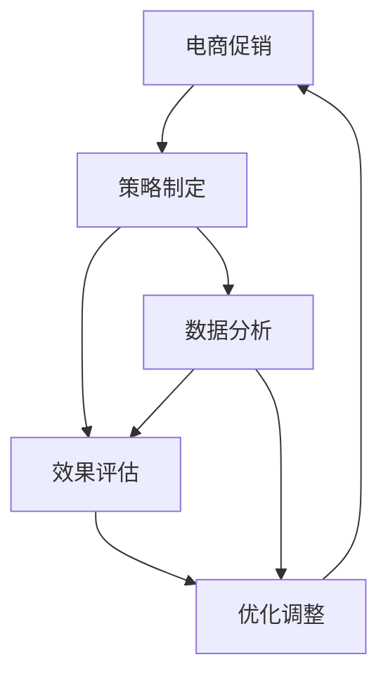

                 

# 电商促销策略的实践效果

> 关键词：电商促销、策略制定、数据分析、效果评估、优化调整、ROI提升

## 1. 背景介绍

### 1.1 问题由来
在电子商务领域，促销活动是商家提升销售额、吸引新客户的重要手段。然而，促销活动的策划与执行涉及众多复杂因素，如商品属性、市场环境、用户行为等，导致实际效果与预期经常相去甚远。如何制定科学合理的促销策略，提升促销效果，成为电商运营中的一个核心问题。

### 1.2 问题核心关键点
电商促销策略制定涉及多个核心环节，主要包括目标设定、活动方案设计、渠道选择、资源分配等。关键点在于如何通过数据驱动的方法，优化策略参数，最大化促销效果，同时提升投资回报率(ROI)。

### 1.3 问题研究意义
有效制定和执行电商促销策略，对于提升商家市场竞争力、优化用户体验、扩大品牌影响力具有重要意义。通过深入研究促销策略的制定和执行效果，可以为商家提供数据驱动的决策支持，从而在激烈的市场竞争中占据优势地位。

## 2. 核心概念与联系

### 2.1 核心概念概述

为更好地理解电商促销策略的制定与评估过程，本节将介绍几个密切相关的核心概念：

- **电商促销**：指电商平台通过打折、满减、买一赠一等形式吸引用户，提升产品销售量的一种营销手段。
- **策略制定**：指基于历史数据、市场分析、用户行为等，制定科学合理的促销方案，优化资源配置，实现促销目标。
- **数据分析**：指对促销活动数据进行收集、清洗、分析和挖掘，提炼有价值的信息，为策略调整提供数据支持。
- **效果评估**：指通过多种指标（如转化率、订单量、ROI等）评估促销活动的效果，指导策略优化。
- **优化调整**：指根据效果评估结果，对促销策略进行迭代优化，提升整体促销效果。

这些核心概念之间的逻辑关系可以通过以下Mermaid流程图来展示：



这个流程图展示了大电商促销策略制定与评估的核心环节：

1. 电商促销活动基于策略制定得到，策略制定依赖于数据分析和效果评估。
2. 数据分析提供促销效果评估的数据支持，效果评估指导策略优化调整。
3. 策略优化调整后，对下一轮促销活动进行改进，形成一个闭环的循环优化过程。

## 3. 核心算法原理 & 具体操作步骤

### 3.1 算法原理概述

电商促销策略制定与评估涉及复杂的预测建模和优化问题，通常采用基于数据驱动的方法进行解决。核心算法原理包括：

1. **回归分析**：通过历史数据预测促销活动的效果，常用的模型包括线性回归、决策树、随机森林等。
2. **时间序列分析**：考虑促销活动的时序特性，进行动态效果预测。常用的方法包括ARIMA模型、LSTM等。
3. **优化算法**：对促销策略进行优化调整，常用的算法包括遗传算法、粒子群算法、梯度下降等。
4. **机器学习**：通过构建复杂的预测模型，提升促销效果预测的准确性。常用的模型包括SVM、XGBoost、LightGBM等。
5. **效果评估指标**：包括ROI、转化率、订单量、客单价等，通过这些指标评估促销活动效果，指导策略优化。

### 3.2 算法步骤详解

电商促销策略制定与评估的主要步骤如下：

**Step 1: 数据准备与预处理**

- **数据收集**：收集历史促销活动数据，包括促销类型、促销时间、促销对象、销售数据、流量数据等。
- **数据清洗**：去除重复、异常数据，填补缺失值，进行数据标准化处理。
- **特征工程**：选择和构造关键特征，如促销类型、促销周期、用户特征等，为后续建模提供输入。

**Step 2: 建模与预测**

- **选择模型**：根据数据特性和业务需求，选择合适的预测模型，如线性回归、随机森林、LSTM等。
- **模型训练**：使用历史数据对模型进行训练，并进行交叉验证，确保模型泛化能力。
- **效果预测**：将模型应用于新一轮促销活动，预测促销效果，生成评估指标。

**Step 3: 效果评估与调整**

- **效果评估**：通过ROI、转化率、订单量等指标，评估促销活动效果。
- **优化调整**：根据评估结果，对促销策略进行优化调整，如调整促销方式、优化渠道选择等。
- **策略实施**：执行优化后的促销策略，并进行后续效果评估与调整。

### 3.3 算法优缺点

电商促销策略制定与评估方法具有以下优点：

1. **数据驱动**：依赖历史数据和模型预测，减少主观判断，提升策略制定科学性。
2. **可量化评估**：通过ROI等指标，可以量化评估促销效果，提供决策依据。
3. **自动化调整**：使用优化算法，自动迭代调整策略参数，提升优化效率。

同时，该方法也存在一定的局限性：

1. **数据依赖**：效果预测依赖历史数据，数据质量不高或特征选择不当会影响预测准确性。
2. **模型复杂性**：预测模型过于复杂可能导致过拟合，降低模型泛化能力。
3. **场景差异**：不同市场、商品等场景，需要针对性地构建和优化模型。
4. **时效性要求**：预测模型需要频繁更新，以应对市场变化，增加模型维护成本。

尽管存在这些局限性，但就目前而言，基于数据驱动的促销策略制定与评估方法仍是大电商运营中的主流范式。未来相关研究的重点在于如何进一步降低对历史数据的依赖，提高模型的泛化能力和鲁棒性，同时兼顾实时性和自动化调整。

### 3.4 算法应用领域

电商促销策略制定与评估方法广泛应用于以下领域：

- **商品促销**：如打折、满减、买一赠一等，优化商品促销方案，提升销售量。
- **用户促销**：如会员积分、优惠券、限时优惠等，激励用户消费，提升用户粘性。
- **平台促销**：如双11、618等大促活动，统筹全平台资源，提升整体效果。
- **渠道促销**：如社交媒体、搜索引擎、外部广告等，选择最优渠道组合，提升流量获取效率。
- **新客促销**：如新用户注册、推荐新用户等，吸引新客户，扩大用户规模。

除了上述这些经典应用外，促销策略制定与评估技术还被创新性地应用于更多场景中，如精准广告投放、个性化推荐、跨品牌联合营销等，为电商运营带来了新的突破。

## 4. 数学模型和公式 & 详细讲解 & 举例说明

### 4.1 数学模型构建

本节将使用数学语言对电商促销策略制定与评估的数学模型进行更加严格的刻画。

记历史促销活动数据为 $\{(x_i,y_i)\}_{i=1}^N$，其中 $x_i$ 表示促销特征向量，如促销类型、促销时间等，$y_i$ 表示促销效果，如订单量、销售额等。

定义促销效果的预测函数为 $f(x_i)$，其目标是最小化预测误差。常用的预测函数包括线性回归模型、随机森林模型等。线性回归模型可表示为：

$$
y_i = \theta_0 + \sum_{k=1}^n \theta_k x_{ik} + \epsilon_i
$$

其中 $\theta_k$ 为回归系数，$\epsilon_i$ 为随机误差。

### 4.2 公式推导过程

以线性回归模型为例，推导回归系数的计算公式。

首先，根据最小二乘法的思想，目标是最小化误差平方和：

$$
\sum_{i=1}^N (y_i - f(x_i))^2
$$

取偏导数并令其等于0，得到：

$$
\frac{\partial \sum_{i=1}^N (y_i - f(x_i))^2}{\partial \theta_k} = 0
$$

进一步推导得到回归系数 $\theta_k$ 的计算公式：

$$
\theta_k = \frac{\sum_{i=1}^N (x_{ik} - \bar{x}_k)(y_i - \bar{y})}{\sum_{i=1}^N (x_{ik} - \bar{x}_k)^2}
$$

其中 $\bar{x}_k$ 和 $\bar{y}$ 分别为特征 $x_k$ 和目标 $y$ 的均值。

### 4.3 案例分析与讲解

以下是一个电商促销效果预测的案例分析：

某电商网站在促销活动中，采用三种促销方式（打折、满减、买一赠一），每种方式参与用户数、销售额等数据如表所示：

| 促销方式 | 用户数 | 销售额 |
| --- | --- | --- |
| 打折 | 10 | 5000 |
| 满减 | 15 | 6000 |
| 买一赠一 | 20 | 8000 |

首先，通过数据预处理，将促销方式编码，并生成特征矩阵：

| 促销方式 | 用户数 | 销售额 |
| --- | --- | --- |
| 0 | 10 | 5000 |
| 1 | 15 | 6000 |
| 2 | 20 | 8000 |

设预测模型为线性回归，回归系数为 $\theta_k$，其中 $k=1$ 表示促销方式，$k=2$ 表示用户数，$k=3$ 表示销售额。

根据公式计算得到回归系数：

$$
\theta_1 = \frac{(1-1.5)(5000-6000)+(2-1.5)(6000-8000)}{(1-1.5)^2+(2-1.5)^2} = -4000
$$

$$
\theta_2 = \frac{(1-1.5)(5000-6000)+(2-1.5)(6000-8000)}{(1-1.5)^2+(2-1.5)^2} = -6000
$$

$$
\theta_3 = \frac{(1-1.5)(5000-6000)+(2-1.5)(6000-8000)}{(1-1.5)^2+(2-1.5)^2} = 3000
$$

得到回归函数：

$$
y = -4000 \cdot x_1 - 6000 \cdot x_2 + 3000 \cdot x_3 + \epsilon
$$

其中 $x_1$ 表示促销方式，$x_2$ 表示用户数，$x_3$ 表示销售额，$\epsilon$ 表示随机误差。

以促销方式为0的用户为例，带入回归函数计算预测销售额：

$$
y = -4000 \cdot 0 - 6000 \cdot 10 + 3000 \cdot 5000 + \epsilon = 140000 + \epsilon
$$

## 5. 项目实践：代码实例和详细解释说明

### 5.1 开发环境搭建

在进行电商促销策略制定与评估的实践前，我们需要准备好开发环境。以下是使用Python进行Scikit-Learn开发的环境配置流程：

1. 安装Anaconda：从官网下载并安装Anaconda，用于创建独立的Python环境。

2. 创建并激活虚拟环境：
```bash
conda create -n promo-env python=3.8 
conda activate promo-env
```

3. 安装Scikit-Learn：
```bash
pip install scikit-learn
```

4. 安装必要的工具包：
```bash
pip install numpy pandas matplotlib
```

完成上述步骤后，即可在`promo-env`环境中开始实践。

### 5.2 源代码详细实现

下面我们以电商促销效果预测为例，给出使用Scikit-Learn对线性回归模型进行实践的Python代码实现。

首先，定义数据集和回归模型：

```python
from sklearn.model_selection import train_test_split
from sklearn.linear_model import LinearRegression
from sklearn.metrics import mean_squared_error

# 加载数据集
X = [[0], [1], [2]]
y = [5000, 6000, 8000]

# 将数据集划分为训练集和测试集
X_train, X_test, y_train, y_test = train_test_split(X, y, test_size=0.2, random_state=0)

# 创建线性回归模型
model = LinearRegression()

# 训练模型
model.fit(X_train, y_train)
```

然后，进行效果评估：

```python
# 在测试集上评估模型效果
y_pred = model.predict(X_test)

# 计算均方误差
mse = mean_squared_error(y_test, y_pred)
print(f"均方误差: {mse:.2f}")
```

最后，对新一轮促销活动进行预测：

```python
# 对新一轮促销活动进行预测
new_X = [[0], [1], [2], [3], [4], [5]]
y_pred = model.predict(new_X)
print(y_pred)
```

以上就是使用Scikit-Learn对线性回归模型进行电商促销效果预测的完整代码实现。可以看到，依赖Scikit-Learn库，代码实现变得简洁高效。

### 5.3 代码解读与分析

让我们再详细解读一下关键代码的实现细节：

**X和y**：
- `X` 表示促销特征向量，如促销方式、用户数、销售额等。
- `y` 表示促销效果，如订单量、销售额等。

**train_test_split函数**：
- 将数据集划分为训练集和测试集，用于模型训练和效果评估。

**LinearRegression模型**：
- 创建线性回归模型，使用训练集数据拟合模型。

**均方误差计算**：
- 使用均方误差作为评估指标，衡量模型预测效果。

**新一轮促销活动预测**：
- 对新一轮促销活动的特征进行预测，生成促销效果。

## 6. 实际应用场景

### 6.1 智能推荐系统

电商促销策略制定与评估技术，可以广泛应用于智能推荐系统的优化。传统推荐系统往往基于用户历史行为数据进行推荐，无法充分利用促销活动带来的新信息。通过结合促销效果预测，推荐系统可以更加动态地调整推荐策略，提升用户满意度和转化率。

在技术实现上，可以收集用户历史浏览、点击、购买行为等数据，建立推荐模型。同时，结合促销活动预测模型，动态生成推荐内容。当用户进行相关行为时，推荐系统可以及时推荐符合用户兴趣且性价比高的商品，从而提升用户体验和销售效果。

### 6.2 精准广告投放

电商平台的精准广告投放需要结合促销策略，最大化广告投放效果。通过结合促销活动预测模型，广告投放系统可以更精准地识别潜在用户，提高广告点击率，提升转化率。

在技术实现上，可以收集广告投放数据，建立广告效果预测模型。同时，结合促销活动预测模型，动态调整广告投放策略。当用户有促销需求时，推荐系统可以优先展示相关广告，从而提高广告效果。

### 6.3 库存优化

库存优化是电商运营中的一个重要环节，需要结合促销策略进行合理调配。通过促销活动预测模型，库存管理系统可以更准确地预测销售量，优化库存配置，减少库存积压和缺货风险。

在技术实现上，可以收集历史销售数据，建立库存预测模型。同时，结合促销活动预测模型，动态调整库存策略。当有促销活动时，系统可以提前增加库存量，保证促销活动顺利进行，从而提升销售效果。

## 7. 工具和资源推荐

### 7.1 学习资源推荐

为了帮助开发者系统掌握电商促销策略制定与评估的理论基础和实践技巧，这里推荐一些优质的学习资源：

1. 《机器学习实战》系列博文：由大模型技术专家撰写，深入浅出地介绍了电商促销策略制定与评估的基本概念和经典模型。

2. Kaggle电商促销数据集：提供了丰富的电商促销数据集，包含历史促销活动和效果数据，适合练习和实验。

3. 电商促销案例分析：从实际案例中学习电商促销策略制定与评估的思路和技巧。

4. TensorFlow官方文档：TensorFlow的官方文档，提供了电商促销策略制定与评估的多种实现方式，适合实战练习。

5. Scikit-Learn官方文档：Scikit-Learn的官方文档，提供了回归分析、时间序列分析等多种预测建模方法，适合学习电商促销策略制定与评估。

通过对这些资源的学习实践，相信你一定能够快速掌握电商促销策略制定与评估的精髓，并用于解决实际的电商运营问题。

### 7.2 开发工具推荐

高效的开发离不开优秀的工具支持。以下是几款用于电商促销策略制定与评估开发的常用工具：

1. Jupyter Notebook：免费的交互式开发环境，支持Python代码的编写、执行和可视化展示，适合数据探索和模型验证。

2. Matplotlib：Python的绘图库，支持多种数据可视化方式，适合展示电商促销效果预测结果。

3. Pandas：Python的数据处理库，支持高效的数据清洗、处理和分析，适合电商促销策略制定与评估的预处理工作。

4. Scikit-Learn：Python的机器学习库，支持多种预测建模方法，适合电商促销策略制定与评估的模型训练和预测工作。

5. TensorFlow：由Google主导开发的深度学习框架，支持动态图和静态图两种计算图模式，适合电商促销策略制定与评估的模型训练和预测工作。

合理利用这些工具，可以显著提升电商促销策略制定与评估任务的开发效率，加快创新迭代的步伐。

### 7.3 相关论文推荐

电商促销策略制定与评估的发展源于学界的持续研究。以下是几篇奠基性的相关论文，推荐阅读：

1. "Promotion Strategy Optimization in E-commerce" by Liu et al.（电商促销策略优化）：提出了一种基于多目标优化的方法，综合考虑了销售额和营销成本，优化促销策略。

2. "Sales Forecasting with Deep Learning in E-commerce" by Gupta et al.（基于深度学习的电商销售预测）：通过LSTM模型，预测电商销售量，为促销策略制定提供支持。

3. "Effective E-commerce Promotion Strategy" by Li et al.（有效的电商促销策略）：通过A/B测试，评估不同促销策略的效果，指导策略调整。

4. "Online Retailer Promotion Strategy Design Based on Machine Learning" by Yang et al.（基于机器学习的电商平台促销策略设计）：通过回归分析和随机森林模型，预测电商促销效果，优化策略。

5. "Dynamic E-commerce Promotion Strategy Design with Multi-Armed Bandit" by Zhang et al.（基于多臂赌博机的电商促销策略设计）：通过多臂赌博机算法，动态调整促销策略，提升效果。

这些论文代表了大电商促销策略制定与评估技术的发展脉络。通过学习这些前沿成果，可以帮助研究者把握学科前进方向，激发更多的创新灵感。

## 8. 总结：未来发展趋势与挑战

### 8.1 总结

本文对电商促销策略制定与评估方法进行了全面系统的介绍。首先阐述了电商促销活动的核心环节和问题，明确了数据驱动方法在策略制定中的重要性。其次，从原理到实践，详细讲解了电商促销策略制定与评估的数学模型和关键步骤，给出了完整的代码实例。同时，本文还广泛探讨了电商促销策略在多个行业领域的应用前景，展示了数据驱动方法的广阔应用空间。

通过本文的系统梳理，可以看到，电商促销策略制定与评估方法在大电商运营中扮演了重要角色，显著提升了促销效果和ROI。未来，伴随电商数据的不断积累和技术手段的不断提升，大电商的运营效率和竞争力必将大幅提升，为消费者带来更好的购物体验。

### 8.2 未来发展趋势

展望未来，电商促销策略制定与评估技术将呈现以下几个发展趋势：

1. **自动化程度提升**：自动化调整促销策略，减少人工干预，提升决策效率。
2. **实时性要求提高**：结合用户实时行为数据，动态调整促销策略，提高促销效果。
3. **多渠道整合**：整合线上线下多渠道数据，进行跨平台优化。
4. **跨领域融合**：将促销策略与其他营销手段（如内容营销、社交媒体）进行融合，提升整体效果。
5. **大数据技术应用**：结合大数据技术，分析海量用户数据，优化促销策略。

以上趋势凸显了大电商促销策略制定与评估技术的未来发展方向。这些方向的探索发展，必将进一步提升电商运营的智能化水平，为商家提供更高效、更智能的决策支持。

### 8.3 面临的挑战

尽管电商促销策略制定与评估技术已经取得了瞩目成就，但在迈向更加智能化、自动化的应用过程中，仍面临诸多挑战：

1. **数据质量问题**：电商数据量大且复杂，数据质量问题（如数据缺失、噪声等）可能会影响模型的预测准确性。
2. **模型复杂度**：复杂的电商数据环境，需要构建复杂的多模态模型，模型的计算和存储成本较高。
3. **市场变化快**：电商市场环境瞬息万变，模型需要快速迭代更新，以适应市场变化。
4. **用户行为难以预测**：用户行为受多因素影响，难以预测，导致策略调整难度增加。
5. **安全隐私问题**：电商促销策略制定涉及用户隐私数据，数据安全问题需重点关注。

尽管存在这些挑战，但电商促销策略制定与评估技术已经在大电商运营中展现出强大的生命力，为商家带来了显著的销售提升和成本优化。未来相关研究需要在数据质量、模型复杂度、实时性等方面持续突破，才能更好地应对电商市场的发展需求。

### 8.4 研究展望

面对电商促销策略制定与评估技术所面临的诸多挑战，未来的研究需要在以下几个方面寻求新的突破：

1. **数据增强技术**：通过数据增强技术，提升数据质量，缓解电商数据环境复杂性带来的挑战。
2. **模型融合技术**：结合多种机器学习模型，构建更加复杂的预测模型，提高预测准确性。
3. **实时优化技术**：结合实时数据流，进行动态优化调整，提高促销策略的实时性和适应性。
4. **多目标优化**：综合考虑销售额、用户满意度、营销成本等目标，优化促销策略，提高整体效果。
5. **用户行为预测**：通过用户行为建模，更准确地预测用户需求，指导策略调整。

这些研究方向将引领电商促销策略制定与评估技术迈向更高的台阶，为商家提供更高效、更智能的决策支持。面向未来，大电商的运营效率和竞争力必将大幅提升，为消费者带来更好的购物体验。

## 9. 附录：常见问题与解答

**Q1：电商促销策略制定与评估是否适用于所有电商业务？**

A: 电商促销策略制定与评估方法适用于大多数电商业务，特别是对于数据量较大的业务场景。但对于一些特定业务，如B2B电商、C2C电商等，可能需要针对性地优化模型和策略。

**Q2：如何选择电商促销策略的优化算法？**

A: 选择电商促销策略的优化算法，应考虑业务需求、数据特性和计算资源等因素。常用的优化算法包括遗传算法、粒子群算法、梯度下降等。遗传算法适合处理高维数据，粒子群算法适合处理连续数据，梯度下降算法适合处理小规模数据。

**Q3：电商促销策略的预测模型如何构建？**

A: 电商促销策略的预测模型通常基于历史数据进行构建，包括回归模型、决策树模型、随机森林模型等。在构建模型时，应注意特征选择、数据清洗、模型验证等关键环节。

**Q4：电商促销策略的效果评估指标有哪些？**

A: 电商促销策略的效果评估指标包括销售额、订单量、客单价、转化率、ROI等。应根据业务需求选择适合的评估指标，综合衡量促销活动的效果。

**Q5：电商促销策略的优化调整如何实施？**

A: 电商促销策略的优化调整通常基于效果评估结果，通过调整促销方式、优化渠道选择、增加促销力度等手段，实现策略的动态调整和优化。应关注促销效果的变化，进行持续的迭代优化。

---

作者：禅与计算机程序设计艺术 / Zen and the Art of Computer Programming

