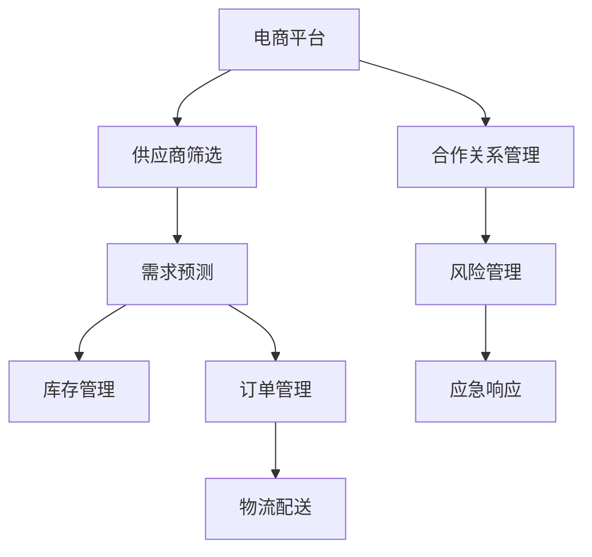

                 

# 电商平台供给能力提升：与新品牌和供应商的合作

## 1. 背景介绍

### 1.1 问题由来
随着电子商务的快速发展，电商平台正面临着供给能力不足的问题。如何在满足消费者日益增长的需求的同时，保证商品供应和物流服务的稳定性，成为了一个亟待解决的重要课题。为了应对这一挑战，电商平台需要与新品牌和供应商建立良好的合作关系，共同提升供给能力。

### 1.2 问题核心关键点
在电商平台与新品牌和供应商的合作中，以下几个关键点需要特别关注：

1. **供应商筛选与评估**：如何通过有效的筛选机制和评估标准，选择优质的供应商，降低合作风险。
2. **需求预测与库存管理**：如何利用先进的数据分析技术，准确预测市场需求，优化库存水平，提升供应链效率。
3. **订单管理与物流配送**：如何优化订单处理流程和物流配送网络，确保商品及时准确地送达消费者手中。
4. **合作关系管理**：如何建立长期稳定的合作关系，优化合作模式，提升整体供应链的协调性和响应速度。
5. **风险管理与应急响应**：如何构建应急响应机制，快速应对供应链中的各种不确定因素和突发事件。

这些关键点相互关联，共同构成了电商平台与新品牌和供应商合作的复杂系统。

## 2. 核心概念与联系

### 2.1 核心概念概述

为更好地理解电商平台与新品牌和供应商的合作，本节将介绍几个密切相关的核心概念：

- **电商平台**：以电子商务交易为中心的企业平台，提供商品展示、在线购买、物流配送等一站式服务。
- **新品牌**：在电商平台上新上架或新入局的品牌，具有较强的增长潜力和市场竞争力。
- **供应商**：提供商品和服务的第三方企业，是电商平台供应链的重要组成部分。
- **需求预测**：通过对历史数据和市场趋势的分析，预测未来的商品需求量。
- **库存管理**：对商品库存进行规划、监控和调整，确保供需平衡。
- **订单管理**：从订单接收、处理到履约的全流程管理，提升订单处理效率和客户满意度。
- **物流配送**：商品从供应商到消费者的物流配送过程，包括仓储、运输、配送等环节。
- **合作关系管理**：通过合同、合作协议等形式，规范和促进与供应商的长期合作关系。
- **风险管理**：对供应链中的各种风险进行识别、评估和控制，确保供应链的稳定运行。
- **应急响应**：在突发事件发生时，快速制定和实施应急预案，减少损失和影响。

这些核心概念之间的逻辑关系可以通过以下Mermaid流程图来展示：



这个流程图展示了几大核心概念之间的相互作用关系，以及它们对电商平台供给能力提升的影响。

## 3. 核心算法原理 & 具体操作步骤

### 3.1 算法原理概述

电商平台与新品牌和供应商的合作，本质上是一个多目标优化问题。其核心思想是：通过建立数学模型，对多个关键指标（如需求预测准确性、库存水平、订单处理时间、物流配送速度等）进行优化，以实现整体供给能力的提升。

形式化地，假设电商平台与供应商合作的业务量为 $V$，需求预测的准确性为 $P$，库存水平为 $S$，订单处理时间为 $T$，物流配送速度为 $D$。优化目标为：

$$
\max_{V,P,S,T,D} V \times P \times S \times T \times D
$$

其中，$V$ 为电商平台业务量，$P$ 为需求预测准确性，$S$ 为库存水平，$T$ 为订单处理时间，$D$ 为物流配送速度。

在实践中，我们通常使用基于优化算法的合作模型，通过迭代求解上述最优化问题，找到最优的合作策略。

### 3.2 算法步骤详解

电商平台与新品牌和供应商的合作优化，一般包括以下几个关键步骤：

**Step 1: 需求预测与库存管理**

- 收集历史销售数据和市场趋势，使用时间序列分析、机器学习等方法，建立需求预测模型。
- 根据预测结果，结合销售季节性、促销活动等因素，制定合理的库存计划。
- 采用先进的库存管理系统，实时监控库存状态，自动补货和调整。

**Step 2: 供应商筛选与评估**

- 制定供应商筛选标准，如产品质量、供货能力、信誉度等。
- 通过招标、比价等手段，选择符合标准的供应商。
- 采用绩效评估指标，如订单准时率、交付周期、售后服务等，定期对供应商进行评估。

**Step 3: 订单管理与物流配送**

- 建立高效的订单管理系统，实现订单自动分配、处理和跟踪。
- 与物流公司合作，构建覆盖全国的配送网络。
- 优化配送路径和资源分配，提升配送效率和用户体验。

**Step 4: 合作关系管理**

- 制定合作协议，明确各方的权利和义务。
- 建立沟通机制，定期与供应商进行交流，及时解决合作中遇到的问题。
- 采用互惠共赢的合作模式，如共享数据、联合开发等，促进双方共同成长。

**Step 5: 风险管理与应急响应**

- 识别和评估供应链中的各种风险，如供应商破产、物流中断等。
- 制定应急预案，包括替代供应商、库存备货等措施。
- 建立应急响应机制，快速响应突发事件，减少影响和损失。

以上是电商平台与新品牌和供应商合作优化的基本流程。在实际应用中，还需要针对具体业务场景，对每个环节进行优化设计，如改进需求预测算法、优化库存管理系统、升级订单管理系统等，以进一步提升合作效率和效果。

### 3.3 算法优缺点

基于优化算法的电商平台与新品牌和供应商合作方法，具有以下优点：

1. 全局优化：通过优化算法，能够全局视角下综合考虑各个环节的影响，实现整体最优。
2. 灵活性强：可以根据具体的业务需求，灵活调整优化目标和约束条件，适应不同的合作场景。
3. 自动化程度高：通过建立自动化系统，能够实时监控和调整合作参数，提高运营效率。

但同时，该方法也存在一定的局限性：

1. 数据依赖性高：优化算法的性能很大程度上取决于输入数据的准确性和完备性。
2. 计算复杂度高：在处理大规模数据集时，优化算法可能会面临计算资源不足的问题。
3. 模型复杂度高：优化模型通常较为复杂，难以解释和调试。
4. 依赖外部环境：优化算法的效果受市场环境、政策变化等因素影响较大。

尽管存在这些局限性，但就目前而言，基于优化算法的合作优化方法仍是电商平台提升供给能力的主流范式。未来相关研究的重点在于如何进一步降低数据依赖，提高模型的鲁棒性和可解释性，同时兼顾自动化和人工干预，确保系统稳定性和可靠性。

### 3.4 算法应用领域

基于优化算法的电商平台与新品牌和供应商合作方法，已经在电子商务、零售、物流等领域得到了广泛的应用，覆盖了从需求预测到库存管理、从订单处理到物流配送的多个环节。

1. **需求预测与库存管理**：广泛应用于电商平台对商品需求进行预测，并据此优化库存水平。通过准确预测市场需求，电商平台能够避免缺货或过剩库存，提升客户满意度。
2. **订单管理与物流配送**：通过优化订单处理流程和物流配送网络，电商平台能够提高订单处理速度和配送效率，提升用户体验和运营效率。
3. **供应商管理**：通过对供应商的筛选和评估，电商平台能够选择优质供应商，降低合作风险。通过合作协议和绩效评估，电商平台能够确保供应商的长期稳定供应。
4. **风险管理与应急响应**：通过构建应急预案和风险管理体系，电商平台能够应对供应链中的各种不确定因素，保障供应链的稳定性。

除了上述这些经典应用外，电商平台与新品牌和供应商合作的优化方法，还被创新性地应用于智能推荐、个性化营销、智能客服等领域，为电商平台带来了新的突破。

## 4. 数学模型和公式 & 详细讲解 & 举例说明

### 4.1 数学模型构建

本节将使用数学语言对电商平台与新品牌和供应商合作的优化过程进行更加严格的刻画。

假设电商平台的业务量为 $V$，需求预测准确性为 $P$，库存水平为 $S$，订单处理时间为 $T$，物流配送速度为 $D$。优化目标为最大化整体效益：

$$
\max_{V,P,S,T,D} V \times P \times S \times T \times D
$$

其中，$V$ 为电商平台业务量，$P$ 为需求预测准确性，$S$ 为库存水平，$T$ 为订单处理时间，$D$ 为物流配送速度。

定义模型 $M_{\theta}$ 在输入数据 $\mathcal{X}$ 上的损失函数为 $\ell(M_{\theta},\mathcal{X})$，则在数据集 $\mathcal{D}$ 上的经验风险为：

$$
\mathcal{L}(\theta) = \frac{1}{N} \sum_{i=1}^N \ell(M_{\theta},\mathcal{X}_i)
$$

在实践中，我们通常使用基于梯度的优化算法（如SGD、Adam等）来近似求解上述最优化问题。设 $\eta$ 为学习率，$\lambda$ 为正则化系数，则参数的更新公式为：

$$
\theta \leftarrow \theta - \eta \nabla_{\theta}\mathcal{L}(\theta) - \eta\lambda\theta
$$

其中 $\nabla_{\theta}\mathcal{L}(\theta)$ 为损失函数对参数 $\theta$ 的梯度，可通过反向传播算法高效计算。

### 4.2 公式推导过程

以下我们以需求预测和库存管理为例，推导优化模型及其梯度的计算公式。

假设需求预测模型为 $f(x) = wx + b$，其中 $x$ 为时间变量，$w$ 和 $b$ 为模型参数。则需求预测准确性 $P$ 可表示为：

$$
P = \frac{\sum_{i=1}^N (f(x_i) - y_i)^2}{N}
$$

其中 $y_i$ 为实际需求量。优化目标为：

$$
\max_{w,b} P
$$

根据梯度上升法，损失函数对 $w$ 和 $b$ 的梯度为：

$$
\nabla_w \mathcal{L}(w,b) = 2\sum_{i=1}^N (f(x_i) - y_i) x_i
$$

$$
\nabla_b \mathcal{L}(w,b) = -2\sum_{i=1}^N (f(x_i) - y_i)
$$

在得到损失函数的梯度后，即可带入参数更新公式，完成模型的迭代优化。重复上述过程直至收敛，最终得到适应市场需求预测和库存管理的最优模型参数 $\theta^*$。

## 5. 项目实践：代码实例和详细解释说明

### 5.1 开发环境搭建

在进行合作优化实践前，我们需要准备好开发环境。以下是使用Python进行PyTorch开发的环境配置流程：

1. 安装Anaconda：从官网下载并安装Anaconda，用于创建独立的Python环境。

2. 创建并激活虚拟环境：
```bash
conda create -n optimization-env python=3.8 
conda activate optimization-env
```

3. 安装PyTorch：根据CUDA版本，从官网获取对应的安装命令。例如：
```bash
conda install pytorch torchvision torchaudio cudatoolkit=11.1 -c pytorch -c conda-forge
```

4. 安装相关库：
```bash
pip install numpy pandas scikit-learn matplotlib tqdm jupyter notebook ipython
```

完成上述步骤后，即可在`optimization-env`环境中开始合作优化实践。

### 5.2 源代码详细实现

下面我们以需求预测和库存管理为例，给出使用PyTorch进行合作优化的PyTorch代码实现。

首先，定义优化模型和损失函数：

```python
import torch
import torch.nn as nn
import torch.optim as optim

class DemandPrediction(nn.Module):
    def __init__(self, input_size, output_size):
        super(DemandPrediction, self).__init__()
        self.linear = nn.Linear(input_size, output_size)

    def forward(self, x):
        return self.linear(x)

# 定义损失函数
def mse_loss(y_true, y_pred):
    return torch.mean((y_true - y_pred)**2)

# 训练函数
def train_epoch(model, optimizer, loss_function, data_loader, device):
    model.train()
    total_loss = 0
    for data, target in data_loader:
        data, target = data.to(device), target.to(device)
        optimizer.zero_grad()
        output = model(data)
        loss = loss_function(output, target)
        total_loss += loss.item()
        loss.backward()
        optimizer.step()
    return total_loss / len(data_loader)

# 评估函数
def evaluate(model, loss_function, data_loader, device):
    model.eval()
    total_loss = 0
    with torch.no_grad():
        for data, target in data_loader:
            data, target = data.to(device), target.to(device)
            output = model(data)
            loss = loss_function(output, target)
            total_loss += loss.item()
    return total_loss / len(data_loader)
```

然后，使用历史销售数据进行训练：

```python
# 准备数据
train_data = ...
train_labels = ...

# 定义模型
model = DemandPrediction(input_size, output_size)
optimizer = optim.Adam(model.parameters(), lr=0.01)
device = torch.device('cuda' if torch.cuda.is_available() else 'cpu')
model.to(device)

# 定义数据加载器
train_loader = torch.utils.data.DataLoader(train_data, batch_size=32, shuffle=True)

# 训练模型
for epoch in range(num_epochs):
    loss = train_epoch(model, optimizer, mse_loss, train_loader, device)
    print(f"Epoch {epoch+1}, train loss: {loss:.3f}")
    
# 评估模型
eval_loader = ...
loss = evaluate(model, mse_loss, eval_loader, device)
print(f"Evaluation loss: {loss:.3f}")
```

以上就是使用PyTorch进行需求预测和库存管理的合作优化的完整代码实现。可以看到，得益于PyTorch的强大封装，我们可以用相对简洁的代码完成模型训练和评估。

### 5.3 代码解读与分析

让我们再详细解读一下关键代码的实现细节：

**DemandPrediction类**：
- `__init__`方法：初始化线性层，接收输入和输出的维度。
- `forward`方法：定义前向传播过程，将输入数据通过线性层得到输出预测值。

**损失函数**：
- 定义均方误差损失函数，用于评估模型预测值与实际标签之间的差异。

**训练函数**：
- 将模型置于训练模式。
- 循环遍历训练数据集，对每个批次进行前向传播和反向传播。
- 使用Adam优化器更新模型参数。

**评估函数**：
- 将模型置于评估模式。
- 循环遍历评估数据集，对每个批次进行前向传播和损失计算。

**训练流程**：
- 定义总的epoch数和批次大小，开始循环迭代。
- 每个epoch内，在训练集上训练，输出平均loss。
- 在验证集上评估，输出评估结果。

可以看到，PyTorch配合高效的损失函数和优化器，使得合作优化任务的代码实现变得简洁高效。开发者可以将更多精力放在数据处理、模型改进等高层逻辑上，而不必过多关注底层的实现细节。

## 6. 实际应用场景

### 6.1 智能推荐系统

在智能推荐系统中，电商平台需要根据用户的历史行为和兴趣，推荐商品以提高转化率和满意度。通过优化推荐算法和供应商管理，电商平台可以提升推荐效果和运营效率。

在技术实现上，可以收集用户浏览、点击、购买等行为数据，提取和商品交互的文本信息。将文本信息作为模型输入，用户的后续行为（如是否购买）作为监督信号，在此基础上微调预训练语言模型。微调后的模型能够从文本信息中准确把握用户兴趣点。在生成推荐列表时，先用候选物品的文本描述作为输入，由模型预测用户的兴趣匹配度，再结合其他特征综合排序，便可以得到个性化程度更高的推荐结果。

### 6.2 供应链管理系统

在供应链管理系统中，电商平台需要实时监控和优化各个环节的运行状态，以确保供应链的稳定和高效。通过优化供应商管理、需求预测、库存管理、订单处理和物流配送等环节，电商平台可以实现更加灵活和高效的供应链管理。

具体而言，可以通过收集历史销售数据、市场趋势、供应商绩效等信息，使用机器学习模型对供应商进行评估和选择。同时，利用时间序列分析等方法，对市场需求进行预测，结合库存水平制定合理的补货策略。优化订单管理系统，提高订单处理速度和准确性。通过构建高效的物流配送网络，提升配送效率和用户体验。

### 6.3 个性化营销

在个性化营销中，电商平台需要根据用户的行为和兴趣，推送定制化的广告和促销活动，提升用户转化率。通过优化广告投放策略和供应商管理，电商平台可以提升营销效果和ROI。

在技术实现上，可以收集用户浏览、点击、购买等行为数据，提取和广告内容相关的文本信息。将文本信息作为模型输入，用户的后续行为（如是否点击广告）作为监督信号，在此基础上微调预训练语言模型。微调后的模型能够从文本信息中准确把握用户的兴趣点和购买意愿。在广告投放时，先用广告文本作为输入，由模型预测用户的点击率，再结合其他特征（如地理位置、时间等）综合决策广告投放策略。

### 6.4 未来应用展望

随着合作优化方法的不断发展，电商平台与新品牌和供应商的合作将迎来更多的应用场景，为电商业务带来更多的创新和突破。

在智慧物流领域，基于合作优化的物流配送系统将进一步提升配送效率和用户体验，构建智能化的物流网络。通过优化订单处理和配送路线，减少交通拥堵和资源浪费，提升物流系统的整体效率。

在智能客服领域，基于合作优化的智能客服系统将进一步提升客户服务质量，降低人工成本。通过优化客服策略和供应商管理，实现更加灵活和高效的服务支持。

在个性化营销领域，基于合作优化的个性化推荐和广告投放系统将进一步提升用户转化率和营销效果。通过优化推荐算法和供应商管理，实现更加精准和个性化的营销策略。

在供应链管理领域，基于合作优化的供应链管理系统将进一步提升供应链的稳定性和响应速度。通过优化供应商管理、需求预测和库存管理，实现更加灵活和高效的供应链管理。

综上所述，基于合作优化的电商平台将实现更加智能化、高效化和个性化的运营，构建更加稳定和高效的电商生态系统。未来，随着技术的进一步发展和应用场景的不断拓展，电商平台与新品牌和供应商的合作将带来更多的创新和突破，为电商业务带来更大的价值。

## 7. 工具和资源推荐

### 7.1 学习资源推荐

为了帮助开发者系统掌握电商平台与新品牌和供应商合作的优化理论基础和实践技巧，这里推荐一些优质的学习资源：

1. 《深度学习入门：基于Python的理论与实现》系列博文：由大模型技术专家撰写，深入浅出地介绍了深度学习的基本原理和实践技巧。
2. CS231n《深度学习视觉与语言》课程：斯坦福大学开设的计算机视觉与自然语言处理课程，提供了大量的实战项目和实验资源。
3. 《Deep Learning for NLP》书籍：斯坦福大学教授所写的自然语言处理领域经典教材，涵盖深度学习在NLP任务中的应用。
4. HuggingFace官方文档：Transformers库的官方文档，提供了丰富的预训练语言模型和微调样例代码，是入手实践的必备资料。
5. Google Cloud AI Platform：谷歌提供的云端机器学习平台，集成了多种机器学习工具和资源，适用于各类实际应用场景。

通过对这些资源的学习实践，相信你一定能够快速掌握电商平台与新品牌和供应商合作优化的精髓，并用于解决实际的电商问题。

### 7.2 开发工具推荐

高效的开发离不开优秀的工具支持。以下是几款用于电商平台与新品牌和供应商合作优化开发的常用工具：

1. PyTorch：基于Python的开源深度学习框架，灵活动态的计算图，适合快速迭代研究。大部分预训练语言模型都有PyTorch版本的实现。
2. TensorFlow：由Google主导开发的开源深度学习框架，生产部署方便，适合大规模工程应用。同样有丰富的预训练语言模型资源。
3. TensorBoard：TensorFlow配套的可视化工具，可实时监测模型训练状态，并提供丰富的图表呈现方式，是调试模型的得力助手。
4. Weights & Biases：模型训练的实验跟踪工具，可以记录和可视化模型训练过程中的各项指标，方便对比和调优。
5. Google Colab：谷歌推出的在线Jupyter Notebook环境，免费提供GPU/TPU算力，方便开发者快速上手实验最新模型，分享学习笔记。

合理利用这些工具，可以显著提升电商平台与新品牌和供应商合作优化任务的开发效率，加快创新迭代的步伐。

### 7.3 相关论文推荐

电商平台与新品牌和供应商合作优化技术的发展源于学界的持续研究。以下是几篇奠基性的相关论文，推荐阅读：

1. "Supply Chain Management through Big Data Analytics"（《大数据分析驱动的供应链管理》）：介绍了如何通过大数据技术优化供应链管理，提升运营效率。
2. "Optimization Algorithms for Supply Chain Management"（《供应链管理中的优化算法》）：综述了各类优化算法在供应链管理中的应用，包括线性规划、启发式算法等。
3. "Supply Chain Optimization with Machine Learning"（《机器学习驱动的供应链优化》）：探讨了机器学习在需求预测、库存管理、订单处理等方面的应用，提升供应链的灵活性和响应速度。
4. "Integrating AI with Supply Chain Management"（《将AI融入供应链管理》）：分析了AI技术在供应链管理中的应用，包括智能推荐、预测分析、优化调度等。
5. "A Survey on Supply Chain Optimization"（《供应链优化综述》）：综述了供应链优化领域的最新研究成果，涵盖了各类优化模型和技术。

这些论文代表了大语言模型微调技术的发展脉络。通过学习这些前沿成果，可以帮助研究者把握学科前进方向，激发更多的创新灵感。

## 8. 总结：未来发展趋势与挑战

### 8.1 总结

本文对电商平台与新品牌和供应商合作的优化方法进行了全面系统的介绍。首先阐述了电商平台与新品牌和供应商合作的背景和意义，明确了优化在提升电商供给能力方面的独特价值。其次，从原理到实践，详细讲解了优化模型的数学原理和关键步骤，给出了优化任务开发的完整代码实例。同时，本文还广泛探讨了优化方法在智能推荐、供应链管理、个性化营销等多个业务场景中的应用前景，展示了优化方法的巨大潜力。

通过本文的系统梳理，可以看到，基于优化算法的电商平台与新品牌和供应商合作优化方法，正在成为电商平台提升供给能力的主流范式，极大地拓展了电商平台的业务边界，催生了更多的落地场景。受益于大数据和人工智能技术的不断发展，电商平台与新品牌和供应商的合作将实现更加智能化、高效化和个性化的运营，构建更加稳定和高效的电商生态系统。未来，随着技术的进一步发展和应用场景的不断拓展，电商平台与新品牌和供应商的合作将带来更多的创新和突破，为电商业务带来更大的价值。

### 8.2 未来发展趋势

展望未来，电商平台与新品牌和供应商的合作优化技术将呈现以下几个发展趋势：

1. **数据驱动的决策**：基于大数据分析的优化方法将进一步提升决策的科学性和精确性，通过数据驱动的方式优化电商运营策略。
2. **AI与大数据的融合**：AI技术将与大数据分析深度融合，构建智能化的电商运营体系，实现更加灵活和高效的供应链管理。
3. **全渠道优化**：电商平台的优化将从线上扩展到全渠道，涵盖线上销售、线下门店、物流配送等多个环节，构建无缝衔接的客户体验。
4. **实时优化**：基于实时数据分析的优化方法将进一步提升电商运营的实时性和灵活性，实现更加动态的优化决策。
5. **跨界创新**：电商平台将与更多领域的技术和业务进行跨界创新，如智能推荐、个性化营销、智能客服等，提升整体用户体验和运营效率。
6. **可持续发展**：电商平台将更加注重可持续发展，通过优化供应链管理、物流配送等方式，减少资源消耗和环境污染，实现绿色电商。

这些趋势凸显了电商平台与新品牌和供应商合作的优化技术的广阔前景。这些方向的探索发展，必将进一步提升电商平台的运营效率和用户体验，推动电商业务的持续增长和创新。

### 8.3 面临的挑战

尽管电商平台与新品牌和供应商的合作优化技术已经取得了瞩目成就，但在迈向更加智能化、普适化应用的过程中，它仍面临着诸多挑战：

1. **数据质量问题**：优化算法的效果很大程度上取决于输入数据的质量，如果数据存在噪声或不完整，可能导致优化结果偏差。
2. **算法复杂性**：优化算法通常较为复杂，难以解释和调试，对于缺乏经验的用户可能存在一定难度。
3. **计算资源消耗**：优化算法在处理大规模数据集时，可能会面临计算资源不足的问题。
4. **模型泛化性不足**：优化模型可能在特定场景下表现优异，但在更广泛的应用场景中泛化性不足。
5. **技术门槛高**：电商平台的优化需要较强的技术和算法背景，对于普通用户可能存在一定的技术门槛。
6. **隐私和安全问题**：在优化过程中，涉及大量用户数据和供应商信息，如何保障数据隐私和安全是一个重要问题。

尽管存在这些挑战，但随着技术的不断发展和成熟，电商平台与新品牌和供应商的合作优化技术将不断进步，克服上述困难，为电商平台的运营提供更加可靠和高效的解决方案。

### 8.4 研究展望

面对电商平台与新品牌和供应商合作优化技术所面临的挑战，未来的研究需要在以下几个方面寻求新的突破：

1. **多源数据融合**：将多种数据源进行融合，提升优化模型的泛化性和鲁棒性，解决单一数据源带来的局限性。
2. **智能决策系统**：结合AI和大数据技术，构建智能化的决策系统，提升优化决策的科学性和精确性。
3. **实时优化算法**：开发高效的实时优化算法，能够在海量数据和实时场景下进行高效优化，提升运营效率。
4. **跨界应用拓展**：将优化技术应用到更多领域，如智能推荐、个性化营销、智能客服等，提升整体用户体验和运营效率。
5. **数据隐私保护**：在优化过程中，引入数据隐私保护技术，保障用户数据和供应商信息的隐私安全。
6. **模型解释性**：提升优化模型的可解释性，使其能够被用户理解和接受，增强系统的透明度和可信度。

这些研究方向的探索，必将引领电商平台与新品牌和供应商合作优化技术迈向更高的台阶，为电商平台的运营提供更加可靠和高效的解决方案。面向未来，电商平台与新品牌和供应商的合作优化技术还需要与其他人工智能技术进行更深入的融合，如知识表示、因果推理、强化学习等，多路径协同发力，共同推动电商平台与新品牌和供应商合作的深入发展。

## 9. 附录：常见问题与解答

**Q1：电商平台如何选择合适的供应商？**

A: 电商平台在选择供应商时，应综合考虑以下因素：
1. 产品质量：选择资质齐全、信誉良好的供应商，确保商品质量。
2. 供货能力：选择能够满足平台需求、及时供货的供应商。
3. 物流配送：选择物流网络覆盖面广、配送速度快的供应商。
4. 售后服务：选择售后服务完善、用户评价高的供应商。
5. 价格竞争力：综合比较不同供应商的报价和服务质量，选择性价比高的供应商。

**Q2：电商平台如何优化需求预测和库存管理？**

A: 电商平台可以通过以下方法优化需求预测和库存管理：
1. 收集历史销售数据和市场趋势，使用时间序列分析、机器学习等方法，建立需求预测模型。
2. 根据预测结果，结合销售季节性、促销活动等因素，制定合理的库存计划。
3. 采用先进的库存管理系统，实时监控库存状态，自动补货和调整。

**Q3：电商平台如何优化订单管理与物流配送？**

A: 电商平台可以通过以下方法优化订单管理与物流配送：
1. 建立高效的订单管理系统，实现订单自动分配、处理和跟踪。
2. 与物流公司合作，构建覆盖全国的配送网络。
3. 优化配送路径和资源分配，提升配送效率和用户体验。

**Q4：电商平台如何构建应急响应机制？**

A: 电商平台可以构建应急响应机制，以快速应对供应链中的各种不确定因素和突发事件。
1. 识别和评估供应链中的各种风险，如供应商破产、物流中断等。
2. 制定应急预案，包括替代供应商、库存备货等措施。
3. 建立应急响应机制，快速响应突发事件，减少影响和损失。

**Q5：电商平台如何提升合作效率和效果？**

A: 电商平台可以通过以下方法提升合作效率和效果：
1. 定期与供应商进行沟通，了解其运营情况和需求。
2. 建立合作关系管理制度，明确各方的权利和义务。
3. 采用互惠共赢的合作模式，如共享数据、联合开发等，促进双方共同成长。

综上所述，电商平台与新品牌和供应商的合作优化是一个复杂而多目标的优化问题，需要综合考虑各个环节的影响，通过科学的方法和技术手段，实现整体最优。未来，随着技术的进一步发展和应用场景的不断拓展，电商平台与新品牌和供应商的合作优化将带来更多的创新和突破，为电商业务带来更大的价值。

---

作者：禅与计算机程序设计艺术 / Zen and the Art of Computer Programming

